.. note::

    Hallo und herzlich willkommen in der SunFounder Raspberry Pi & Arduino & ESP32 Enthusiasten-Community auf Facebook! Tauche gemeinsam mit anderen Enthusiasten tiefer in die Welt von Raspberry Pi, Arduino und ESP32 ein.

    **Warum beitreten?**

    - **Expertenunterstützung**: Löse nach dem Kauf auftretende Probleme und technische Herausforderungen mit Hilfe unserer Community und unseres Teams.
    - **Lernen & Teilen**: Tausche Tipps und Anleitungen aus, um deine Fähigkeiten zu erweitern.
    - **Exklusive Vorschauen**: Erhalte frühzeitigen Zugang zu neuen Produktankündigungen und exklusiven Einblicken.
    - **Spezielle Rabatte**: Profitiere von exklusiven Rabatten auf unsere neuesten Produkte.
    - **Festliche Aktionen und Verlosungen**: Nimm an Verlosungen und Feiertagsaktionen teil.

    👉 Bereit, gemeinsam mit uns zu entdecken und zu erschaffen? Klicke auf [|link_sf_facebook|] und tritt noch heute bei!

1.2 Was ist in deinem Kit enthalten
======================================

In unserem Kit findest du eine Vielzahl von Komponenten und Bauteilen, die du im Laufe dieses Kurses zum Bau von Schaltkreisen verwenden wirst. Hier ist ein kurzer Überblick darüber, was enthalten ist.

**1 x Original Arduino Uno R3**

Eine Mikrocontroller-Platine, die das Gehirn deiner Schaltkreise ist. Sie enthält alles, was der Mikrocontroller benötigt; verbinde sie einfach über ein USB-Kabel mit deinem Computer oder betreibe sie mit einem AC-DC-Adapter oder einer Batterie, um loszulegen.

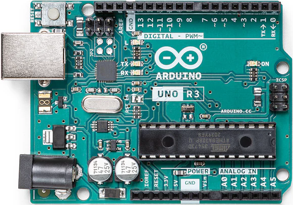

**1 x 400-Punkt Steckbrett**

Ein lötfreies Steckbrett, das dir ermöglicht, elektronische Schaltungen einfach aufzubauen. Es ist mit Reihen von Löchern gefüllt, um Drähte und Bauteile zu verbinden.

.. image:: img/2_breadboard_half.png
    :width: 500
    :align: center

**120 x Widerstände (10 von jedem Typ, 30 davon 220Ω-Widerstände)**

Ein Widerstand ist ein Bauteil, das den Fluss elektrischer Energie behindert und somit Spannung und Strom in einem Stromkreis verändert. Der Wert eines Widerstands wird in Ohm gemessen und durch das griechische Symbol Omega (Ω) dargestellt. Die farbigen Streifen auf einem Widerstand geben seinen Widerstandswert und seine Toleranz an.

.. image:: img/2_all_resistor.png
    :align: center

**25 x LEDs (5 in jeder Farbe)**

Diese bunte LED-Auswahl umfasst fünf Farben: Rot, Grün, Blau, Gelb und Weiß, die verschiedene Beleuchtungs- und Signalanforderungen erfüllen. Diese LEDs sind ideal für Anwendungen, die von einfachen Statusanzeigen bis hin zu komplexen dekorativen Lichtprojekten reichen, und bieten eine reichhaltige Farbauswahl zur optischen Bereicherung deines Projekts.

.. image:: img/2_led_color.png
    :align: center

**2 x RGB-LEDs**

Kombiniert rote, grüne und blaue LEDs in einem Gehäuse. Sie kann durch Anpassung der Eingangsspannung verschiedene Farben anzeigen und so Millionen von Farbtönen erzeugen.

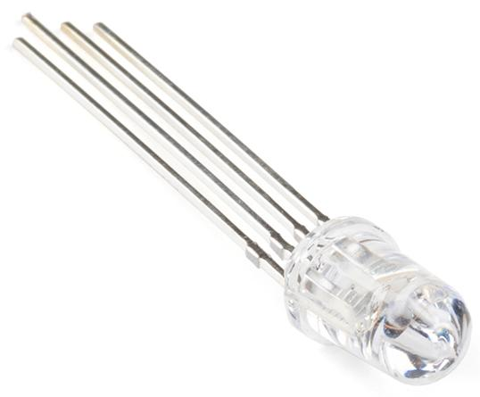

**1 x Fotowiderstand**

Ein Fotowiderstand ist ein lichtempfindliches Bauteil, das seinen Widerstand in Abhängigkeit von der Intensität des Lichts ändert, dem es ausgesetzt ist – ideal zur Entwicklung von lichtgesteuerten Steuerungen und Sensoren in elektronischen Projekten.

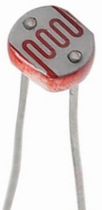

**1 x NTC-Thermistor**

Ein Thermistor ist ein temperaturabhängiger Widerstand. NTC-Thermistoren verringern ihren Widerstand bei steigender Temperatur, während PTC-Thermistoren den Widerstand mit zunehmender Temperatur erhöhen.

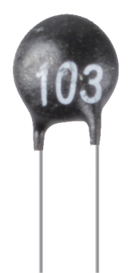

**1 x Aktiver Buzzer & 1 x Passiver Buzzer**

Ein Buzzer, erhältlich in aktiver und passiver Ausführung, ist ein akustisches Signalgerät, das bei Stromzufuhr Geräusche erzeugt. Er wird häufig in Alarmanlagen, Timern und Benachrichtigungssystemen verwendet.

.. image:: img/7_beep_2.png
    :align: center

**1 x Potentiometer**

Ein Potentiometer ist ein variabler Widerstand mit drei Anschlüssen. Zwei Anschlüsse verbinden die Enden eines Widerstands, während der mittlere Anschluss mit einem beweglichen Schleifer verbunden ist, der den Widerstand in zwei Teile teilt. Potentiometer werden oft zur Spannungsregelung in Schaltungen verwendet, ähnlich wie die Lautstärkeregler an Radios.

.. image:: img/9_dimmer_pot.png
    :width: 200
    :align: center

**10 x Kleine Tasten**

Eine kleine Drucktaste wird verwendet, um bei Betätigung eine physische Rückmeldung zu geben. Sie wird in elektronischen Geräten häufig verwendet, um Aktionen zu initiieren oder Befehle einzugeben.

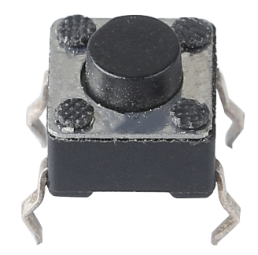

**1 x 74HC595 Chip**

Der 74HC594 ist ein Schieberegister, das dazu verwendet wird, die Ein-/Ausgabeports digitaler Schaltungen zu erweitern, indem serielle Eingaben in parallele Ausgaben umgewandelt werden. Dadurch wird die Anzahl der benötigten Anschlusspins reduziert. Dieser Chip eignet sich zur Steuerung einer großen Anzahl von Ausgangsgeräten, wie etwa 7-Segment-Anzeigen, ohne zu viele Mikrocontroller-Pins zu beanspruchen.

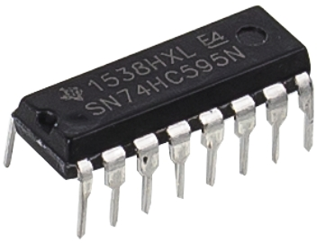

**1 x 7-Segment-Anzeige**

Eine 7-Segment-Anzeige ist ein 8-förmiges Bauteil, das 7 LEDs enthält. Jede LED wird als Segment bezeichnet – wenn sie aktiviert wird, bildet ein Segment einen Teil einer anzuzeigenden Ziffer.

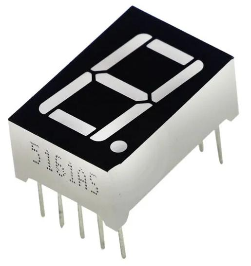

**1 x Ultraschallmodul**

Dies ist ein Ultraschallmodul, das Ultraschallwellen zur Messung von Entfernungen verwendet und die Position und Entfernung von Objekten genau erfasst. Es wird häufig in der Robotik, in Hindernisvermeidungssystemen und in automatisierten Steuerungssystemen eingesetzt und ist ein Schlüsselbauteil zur Umgebungswahrnehmung und räumlichen Navigation.

.. image:: img/19_ultrasonic_pic.png
    :width: 300
    :align: center

**65 x Jumper-Kabel**

Verbinde Bauteile auf dem Steckbrett miteinander und mit der Arduino-Platine.

.. image:: img/2_wire_color.jpg
    :width: 400
    :align: center

**10 x Male-to-Female DuPont-Kabel**

Male-to-Female DuPont-Kabel sind speziell für die Verbindung von Modulen mit männlichen Pin-Anschlüssen, wie etwa Ultraschallmodulen, mit Steckbrettern konzipiert. Diese Kabel sind unverzichtbar für die Verbindung verschiedener Bauteile in Projekten, bei denen steckbrettkompatible Male-to-Female-Verbindungen benötigt werden.

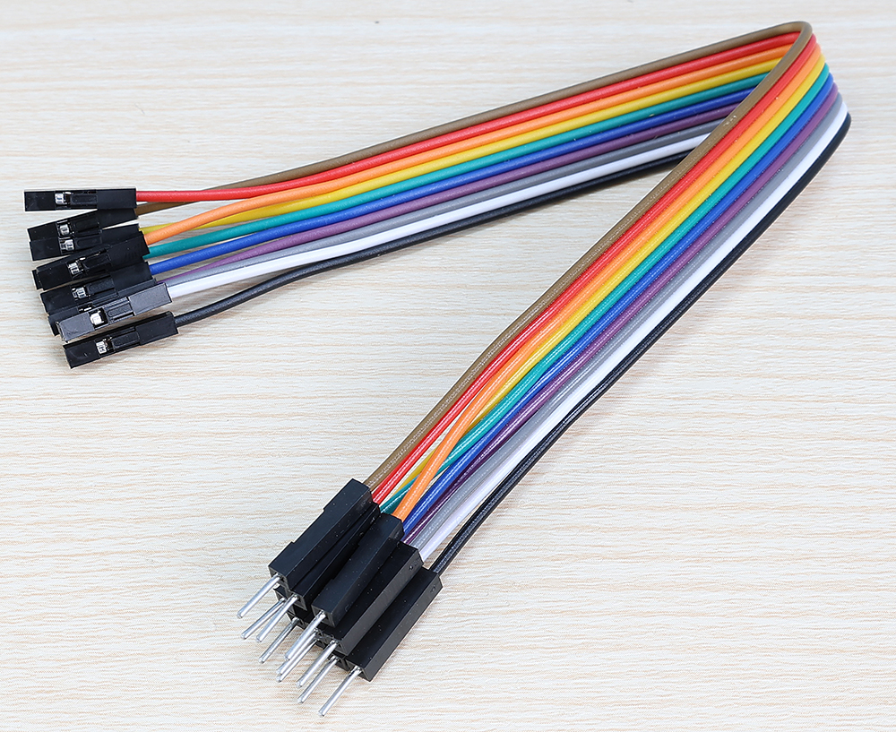

**1 x USB-Kabel**

Verbindet die Arduino-Platine mit einem Computer. Damit kannst du Programme auf die Platine schreiben, kompilieren und übertragen. Es versorgt die Platine auch mit Strom.

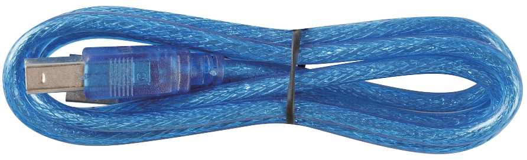

**1 x 9V-Batterie**

Dies ist eine nicht wiederaufladbare 9V-Alkalibatterie. Du musst sie im Multimeter einsetzen.

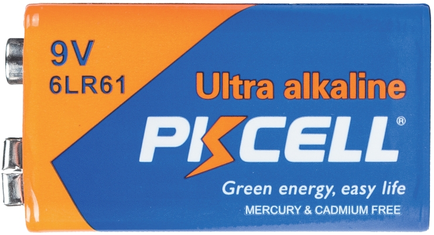

**1 x Multimeter mit roten und schwarzen Messleitungen**

Dies ist ein vielseitiges Multimeter, das Spannung, Strom und Widerstand messen kann und auch andere elektrische Tests durchführt. Es ist ein unverzichtbares Werkzeug für die Elektronik- und Elektroarbeiten.

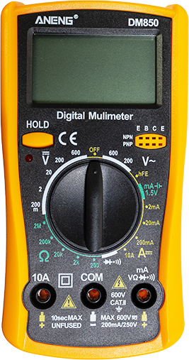
