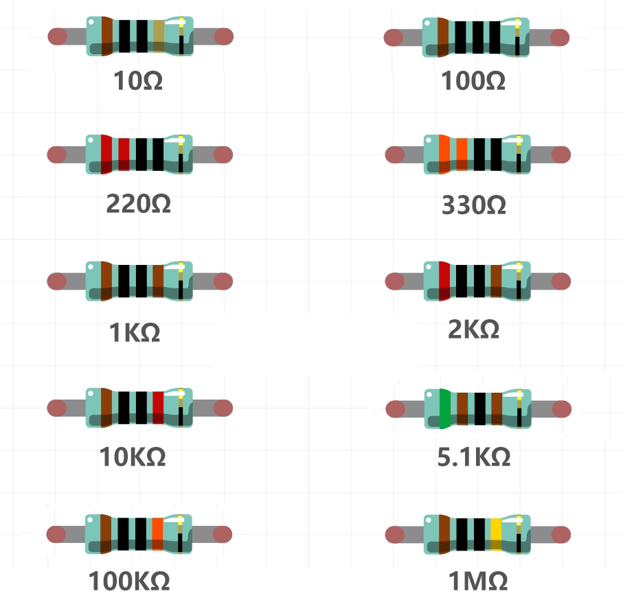

1.2 What's Included in Your Kit
======================================

Inside our kit, you'll find a variety of components and parts you'll use throughout this course to build circuits. Here's a quick guide to what's included.

**R3 Board**

A microcontroller board that's the brain of your circuits. It has everything needed to support the microcontroller; simply connect it to your computer with a USB cable or power it with an AC-to-DC adapter or battery to get started.

.. image:: img/1_uno_board.png
    :width: 500
    :align: center

**Breadboard**

A solderless board that lets you easily build electronic circuits. It's filled with rows of holes for connecting wires and components.

.. image:: img/2_breadboard_half.png
    :width: 500
    :align: center

**Resistors**

A resistor is a component that obstructs the flow of electric power, thereby altering the voltage and current within a circuit. The value of a resistor is measured in ohms, symbolized by the Greek letter omega (Ω). The colored stripes on a resistor indicate its resistance value and tolerance.

**Light-Emitting Diode (LED)**

When current flows through, it lights up. Used as indicators on devices, for colorful displays in TVs, and as energy-efficient lighting.

.. image:: img/2_led_color.png
    :align: center

**RGB LED**

Combines red, green, and blue LEDs in one casing. It can display various colors by adjusting the input voltage, creating millions of colors.

.. image:: img/1_rgb_led.jpg
    :width: 300
    :align: center

**Photoresistor**

Changes resistance based on light intensity. Useful for light-sensitive projects.

.. image:: img/1_photoresistor.png
    :width: 100
    :align: center

**NTC Thermistor**

A thermistor is a resistor sensitive to temperature changes. NTC thermistors decrease resistance as temperature rises, while PTC thermistors increase resistance with temperature.

.. image:: img/1_thermistor.png
    :width: 100
    :align: center

**Buzzer**

An audio signaling device. Comes in active and passive types, useful for sound effects.

.. image:: img/1_buzzer.png
    :align: center

**Potentiometer**

A potentiometer is a variable resistor with three pins. Two pins connect to the ends of a resistor, while the middle pin attaches to a movable wiper, dividing the resistor into two parts. Potentiometers, often used to adjust voltage in circuits, are like the volume knobs on radios.

.. image:: img/1_potentiometer.png
    :width: 200
    :align: center

**Button**

Closes the circuit when pressed, opens when released. Lets the Arduino detect on/off signals.

.. image:: img/1_button.png
    :width: 200
    :align: center

**74HC595**

Controls eight output pins with only three input pins, great for expanding I/O lines.

.. image:: img/1_74hc595.png
    :width: 300
    :align: center

**7-segment Display**

A 7-segment display is an 8-shaped component which packages 7 LEDs. Each LED is called a segment - when energized, one segment forms part of a numeral to be displayed.

.. image:: img/1_7_segment.png
    :width: 300
    :align: center

**Jumper Wires**

Connect components on the breadboard to each other and to the Arduino board.

.. image:: img/2_wire_color.jpg
    :width: 500
    :align: center

**USB Cable**

Connects the Arduino board to a computer. Allows you to write, compile, and transfer programs to the Arduino board. Also powers the board.

.. image:: img/1_usb_cable.png
    :width: 400
    :align: center

**Battery Snap**

Connects a 9V battery to your circuit. Easily plugs into your breadboard or Arduino.