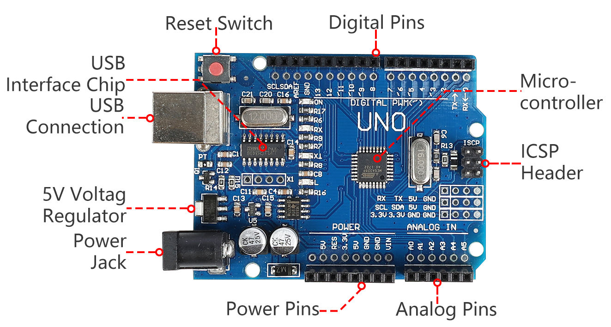
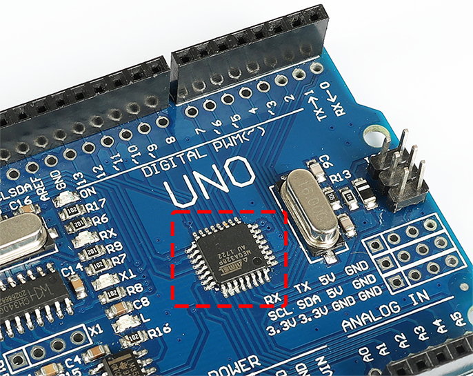
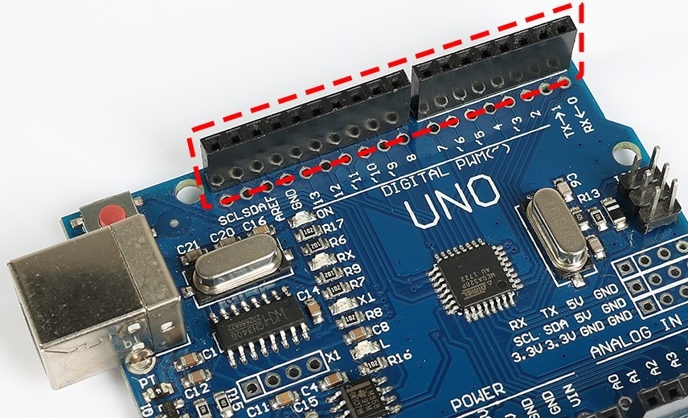
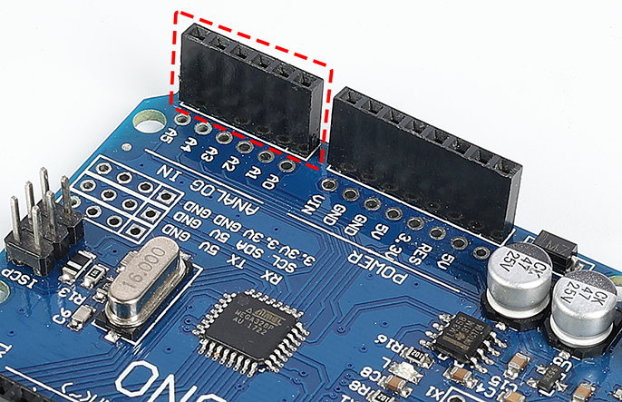
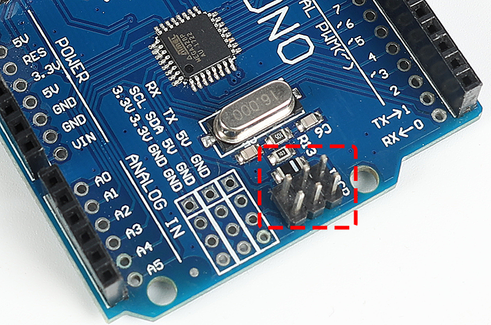
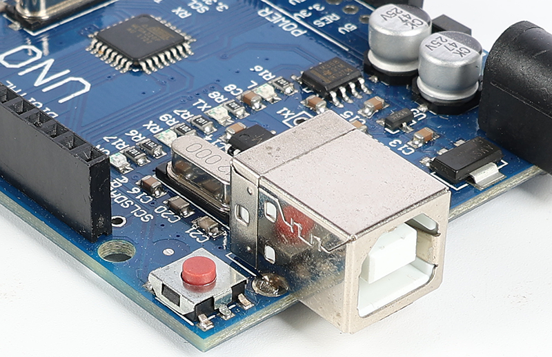
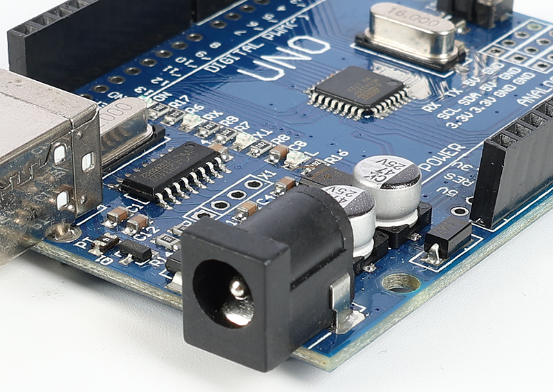
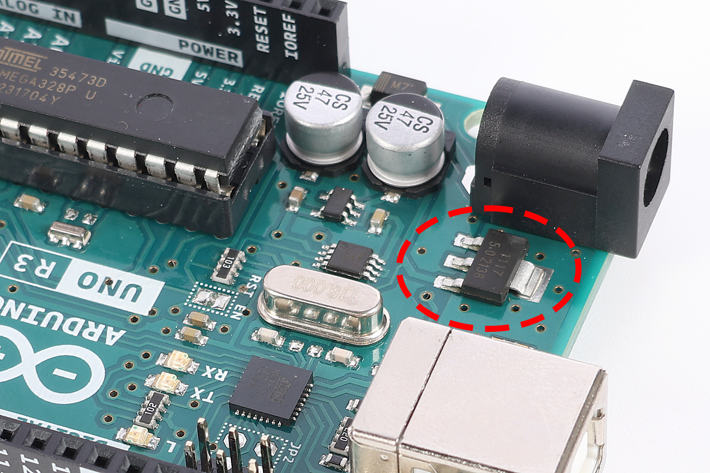
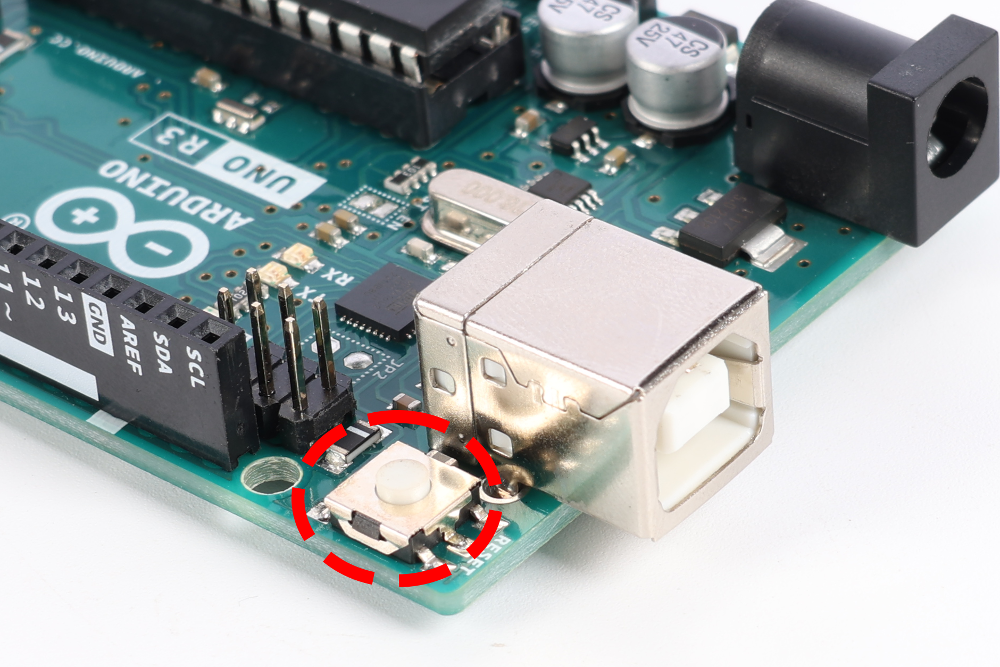
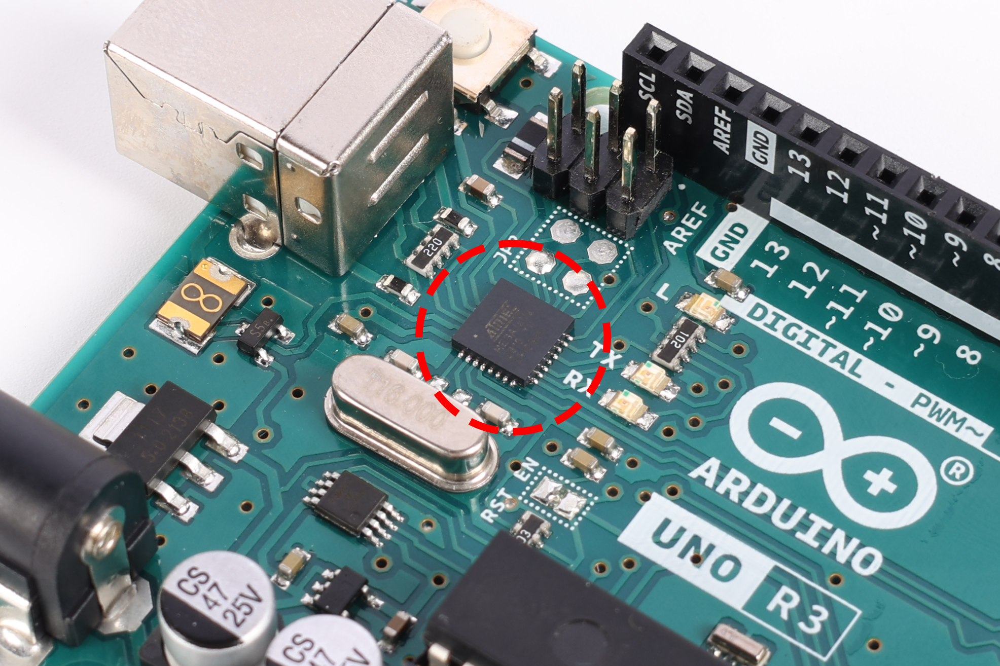

.. note::

    Bonjour, bienvenue dans la communauté des passionnés de Raspberry Pi, Arduino et ESP32 de SunFounder sur Facebook ! Plongez dans l'univers du Raspberry Pi, Arduino et ESP32 avec d'autres passionnés.

    **Pourquoi nous rejoindre ?**

    - **Support d'experts** : Résolvez les problèmes après-vente et les défis techniques avec l'aide de notre communauté et de notre équipe.
    - **Apprendre et partager** : Échangez des astuces et des tutoriels pour améliorer vos compétences.
    - **Aperçus exclusifs** : Bénéficiez d'un accès anticipé aux nouvelles annonces de produits et avant-premières.
    - **Réductions spéciales** : Profitez de réductions exclusives sur nos derniers produits.
    - **Promotions festives et concours** : Participez à des concours et des promotions festives.

    👉 Prêt à explorer et créer avec nous ? Cliquez sur [|link_sf_facebook|] et rejoignez-nous dès aujourd'hui !

1.3 Découverte de votre carte Arduino
==========================================

Bienvenue à la prochaine étape de votre aventure Arduino ! Vous avez entre les mains une carte Arduino, un outil qui vous aidera à transformer vos idées en projets concrets. Bien que cette carte puisse sembler différente des autres, elle fonctionne de la même manière. La communauté Arduino aime partager, ce qui signifie que cette carte a été conçue à partir de plans open-source accessibles à tous.

Imaginez les projets incroyables que vous pourrez créer – qu'il s'agisse d'un mini-robot, d'un jeu personnalisé ou d'un appareil intelligent pour votre chambre. Arduino permet de concrétiser ces idées. C'est une plateforme compacte, mais remplie de grandes possibilités. Découvrons ensemble la carte et ses composants pour que vous puissiez commencer à créer.

Le Cœur : Le Microcontrôleur
--------------------------------

Le microcontrôleur est la puce principale de votre Arduino. Pensez-y comme le cerveau de la carte, où toutes les décisions sont prises. Il exécute vos instructions et contrôle les broches, qui interagissent avec des lumières, des moteurs et des capteurs.

Les Broches : Connexion et Contrôle
--------------------------------------

**Broches d'alimentation**

Ces broches fournissent de l'énergie à vos créations. Elles sont étiquetées "3.3V", "5V" et "GND", chacune offrant différents niveaux de puissance pour vos projets. La broche "Reset" agit comme un bouton de redémarrage, réinitialisant tout depuis le début.

.. image:: img/1_uno_power_pin.png
    :width: 500
    :align: center

**Broches numériques**

Les broches numériques fonctionnent comme de petits interrupteurs qui peuvent être activés ou désactivés. Vous les utiliserez pour contrôler des éléments comme des LEDs ou pour lire des appuis sur des boutons. Certaines d'entre elles peuvent même ajuster la quantité de courant qu'elles envoient, ce qui est utile pour faire varier la luminosité des lumières ou contrôler la vitesse des moteurs.

**Broches analogiques**

Ces broches peuvent lire différents niveaux de courant, ce qui signifie qu'elles sont parfaites pour capter des données de capteurs. Elles peuvent mesurer la luminosité, la température ou même la pression appliquée.

**En-tête ICSP**

Cet ensemble de broches est un peu comme un passage secret pour programmer votre Arduino d'une manière spéciale. Il n'est pas souvent utilisé, mais il est là si vous en avez besoin.

Ports : Connexion de votre carte
------------------------------------

**Connexion USB**

Ce port permet de connecter votre Arduino à votre ordinateur, vous permettant de télécharger des programmes et de dire à la carte ce que vous voulez qu'elle fasse.

**Prise d'alimentation**

C'est là que vous pouvez brancher une source d'alimentation externe, comme une batterie, pour que votre Arduino fonctionne sans être connecté à un ordinateur.

Autres composants clés
---------------------------

**Régulateur de tension 5 volts**

Cette pièce s'assure que votre Arduino reçoit la bonne quantité d'énergie, garantissant ainsi un fonctionnement fluide.

**Interrupteur de réinitialisation**

Le bouton de réinitialisation vous permet de relancer votre programme depuis le début, d'une simple pression.

**Puce d'interface USB**

C'est elle qui communique avec le port USB, permettant à votre ordinateur et à votre Arduino de se comprendre.

Comprendre ces composants vous aidera à tirer le meilleur parti de votre carte Arduino. Alors, commençons ensemble cette aventure d'apprentissage !
