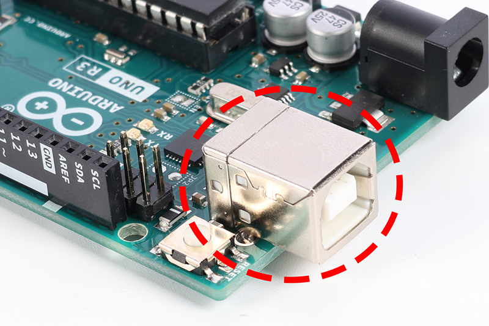
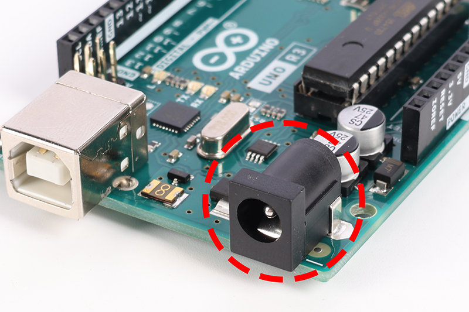

.. note::

    Ciao, benvenuto nella community di appassionati di SunFounder Raspberry Pi & Arduino & ESP32 su Facebook! Approfondisci le tue conoscenze su Raspberry Pi, Arduino ed ESP32 insieme ad altri appassionati.

    **Perché unirti a noi?**

    - **Supporto esperto**: Risolvi i problemi post-vendita e le sfide tecniche con l'aiuto della nostra comunità e del nostro team.
    - **Impara e condividi**: Scambia consigli e tutorial per migliorare le tue competenze.
    - **Anteprime esclusive**: Ottieni accesso anticipato agli annunci di nuovi prodotti e anteprime.
    - **Sconti speciali**: Approfitta di sconti esclusivi sui nostri prodotti più recenti.
    - **Promozioni festive e omaggi**: Partecipa a concorsi e promozioni durante le festività.

    👉 Sei pronto a esplorare e creare con noi? Clicca su [|link_sf_facebook|] e unisciti oggi stesso!

1.3 Conosci la tua scheda Arduino
========================================

Benvenuto al tuo prossimo passo nel viaggio con Arduino! Nelle tue mani c'è una scheda Arduino, uno strumento che ti aiuterà a trasformare le tue idee geniali in progetti reali. Anche se questa scheda può sembrare diversa da altre, funziona esattamente allo stesso modo. La comunità Arduino ama condividere, il che significa che questa scheda è stata realizzata seguendo progetti open-source disponibili per tutti.

Pensa ai progetti straordinari che puoi creare, che si tratti di un mini robot, di un gioco personalizzato o di un dispositivo intelligente per la tua stanza. Arduino ti permette di realizzare queste idee. È una piattaforma compatta, ma con grandi possibilità. Iniziamo a conoscere la scheda e tutte le sue parti, così potrai cominciare a creare.

.. image:: img/1_introduce_board.png
    :width: 800
    :align: center

Il cuore: il microcontrollore
-------------------------------

Il microcontrollore è il chip principale della tua scheda Arduino. Pensalo come il cervello della scheda, dove avviene tutto il "pensiero". Esegue i tuoi comandi e controlla i pin, che interagiscono con luci, motori e sensori.

.. image:: img/1_uno_mcu.png
    :width: 500
    :align: center

Pin: connessione e controllo
-------------------------------------

**Pin di alimentazione**

Questi pin forniscono energia alle tue creazioni. Hanno etichette come "3.3V," "5V" e "GND," ognuno fornisce livelli di alimentazione diversi per i tuoi progetti. Il pin "Reset" funziona come un pulsante di riavvio, riportando tutto all'inizio.

.. image:: img/1_uno_power_pin.png
    :width: 500
    :align: center

**Pin digitali**

I pin digitali funzionano come piccoli interruttori che possono essere accesi o spenti. Li userai per controllare dispositivi come i LED o per rilevare la pressione di pulsanti. Alcuni possono anche controllare la quantità di potenza inviata, utile per regolare la luminosità delle luci o la velocità dei motori.

.. image:: img/1_uno_digital_pin.png
    :width: 500
    :align: center

**Pin analogici**

Questi pin possono leggere diversi livelli di potenza, il che significa che sono perfetti per leggere da sensori. Possono misurare quanto è luminosa una luce, quanto è calda una superficie o quanta pressione stai applicando.

**Intestazione ICSP**

Questo insieme di pin è un po' come un passaggio segreto per programmare il tuo Arduino in un modo speciale. Non è comunemente utilizzato, ma è lì se ne hai bisogno.

.. image:: img/1_uno_icsp_header.png
    :width: 500
    :align: center

Porte: connessione della tua scheda
---------------------------------------

**Connessione USB**

Questa porta collega il tuo Arduino al computer, permettendoti di caricare i programmi e dire alla scheda cosa vuoi che faccia.

**Presa di alimentazione**

Qui puoi collegare una fonte di alimentazione esterna, come una batteria, per far funzionare il tuo Arduino senza un computer.

Altri componenti chiave
----------------------------------

**Regolatore di tensione a 5 volt**

Questa parte assicura che il tuo Arduino riceva la giusta quantità di energia, mantenendo tutto funzionante senza problemi.

.. image:: img/1_uno_voltage_regulator.png
    :width: 500
    :align: center

**Interruttore di reset**

Il pulsante di reset ti permette di riavviare il programma dall'inizio, con un solo tocco.

.. image:: img/1_uno_reset_switch.png
    :width: 500
    :align: center

**Chip di interfaccia USB**

Questo chip permette la comunicazione con la porta USB, aiutando il computer e l'Arduino a capirsi.

Comprendere questi componenti ti aiuterà a sfruttare al massimo la tua scheda Arduino. Quindi, iniziamo insieme questa avventura di apprendimento!

