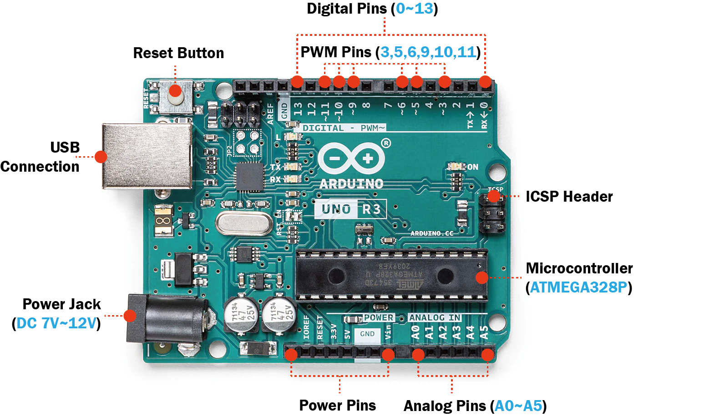
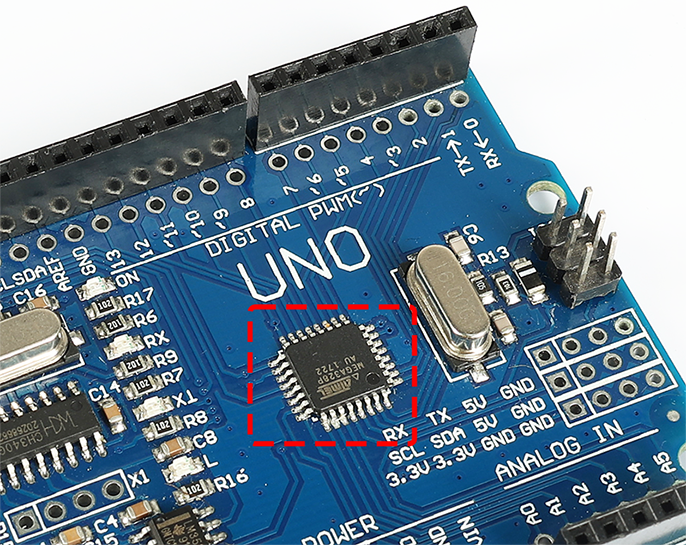

.. note::

    ¡Hola! Bienvenido a la comunidad de entusiastas de SunFounder Raspberry Pi, Arduino y ESP32 en Facebook. Sumérgete más en el mundo de Raspberry Pi, Arduino y ESP32 con otros apasionados.

    **¿Por qué unirte?**

    - **Soporte experto**: Resuelve problemas postventa y desafíos técnicos con la ayuda de nuestra comunidad y equipo.
    - **Aprende y comparte**: Intercambia consejos y tutoriales para mejorar tus habilidades.
    - **Preestrenos exclusivos**: Obtén acceso anticipado a anuncios de nuevos productos y adelantos.
    - **Descuentos especiales**: Disfruta de descuentos exclusivos en nuestros productos m√°s recientes.
    - **Promociones festivas y sorteos**: Participa en sorteos y promociones especiales durante las festividades.

    üëâ ¬øListo para explorar y crear con nosotros? Haz clic en [|link_sf_facebook|] y √∫nete hoy mismo.

1.3 Conociendo tu Placa Arduino
========================================

¡Bienvenido a tu siguiente paso en el viaje de Arduino! En tus manos tienes una placa Arduino, una herramienta que te ayudará a convertir tus ingeniosas ideas en proyectos reales. Aunque esta placa puede parecer un poco diferente de otras, funciona exactamente igual. A la comunidad de Arduino le encanta compartir, lo que significa que esta placa fue creada siguiendo planos de código abierto disponibles para todos.

Imagina los increíbles proyectos que puedes crear, ya sea un mini robot, un juego personalizado o un dispositivo inteligente para tu habitación. Arduino se trata de hacer realidad esas ideas. Es una plataforma compacta con grandes posibilidades. Vamos a conocer la placa y todas sus partes para que puedas comenzar a crear.

El N√∫cleo: Microcontrolador
-------------------------------

El microcontrolador es el chip principal de tu Arduino. Piensa en él como el cerebro de la placa, donde ocurre todo el procesamiento. Ejecuta tus comandos y controla los pines, que interactúan con luces, motores y sensores.

Pines: Conectando y Controlando
-------------------------------------

**Pines de Alimentación**

Estos pines suministran energía a tus creaciones. Tienen etiquetas como "3.3V", "5V" y "GND", cada uno proporcionando diferentes niveles de energía para tus proyectos. El pin "Reset" actúa como un botón de reinicio, volviendo todo al inicio.

.. image:: img/1_uno_power_pin.png
    :width: 500
    :align: center

**Pines Digitales**

Los pines digitales funcionan como pequeños interruptores que pueden encenderse y apagarse. Los utilizarás para controlar cosas como LEDs o para leer pulsaciones de botones. Algunos de ellos incluso pueden controlar cuánta energía envían, lo cual es útil para atenuar luces o controlar la velocidad de motores.

.. image:: img/1_uno_digital_pin.png
    :width: 500
    :align: center

**Pines Analógicos**

Estos pines pueden leer diferentes niveles de energía, lo que significa que son excelentes para leer desde sensores. Pueden medir cuánta luz hay, qué tan cálido está algo o cuánta presión estás aplicando.

.. image:: img/1_uno_analog_pin.png
    :width: 500
    :align: center

**Encabezado ICSP**

Este conjunto de pines es como un pasaje secreto para programar tu Arduino de una manera especial. No se utiliza comúnmente, pero está ahí si lo necesitas.

.. image:: img/1_uno_icsp_header.png
    :width: 500
    :align: center

Puertos: Conectando tu Placa
--------------------------------

**Conexión USB**

Este puerto conecta tu Arduino a tu computadora, permitiéndote cargar programas y decirle a tu placa lo que quieres que haga.

.. image:: img/1_uno_usb_port.png
    :width: 500
    :align: center

**Conector de Alimentación**

Aquí puedes conectar una fuente de alimentación externa, como una batería, para hacer que tu Arduino funcione sin necesidad de estar conectado a una computadora.

.. image:: img/1_uno_power_jack.png
    :width: 500
    :align: center

Otros Componentes Clave
----------------------------------

**Regulador de Voltaje de 5 Voltios**

Esta parte se asegura de que tu Arduino reciba la cantidad adecuada de energía, manteniendo todo funcionando sin problemas.

.. image:: img/1_uno_voltage_regulator.png
    :width: 500
    :align: center

**Interruptor de Reinicio**

El botón de reinicio te permite comenzar tu programa desde el principio con solo un toque.

.. image:: img/1_uno_reset_switch.png
    :width: 500
    :align: center

**Chip de Interfaz USB**

Este es el que se comunica con el puerto USB, ayudando a que tu computadora y Arduino se entiendan entre sí.

.. image:: img/1_uno_usb_chip.png
    :width: 500
    :align: center

Entender estas partes te ayudará a aprovechar al máximo tu placa Arduino. ¡Así que comencemos juntos esta emocionante aventura de aprendizaje!
