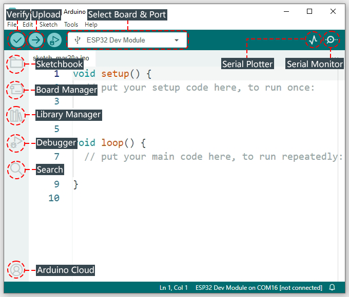
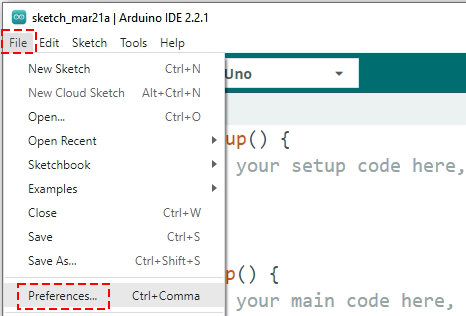
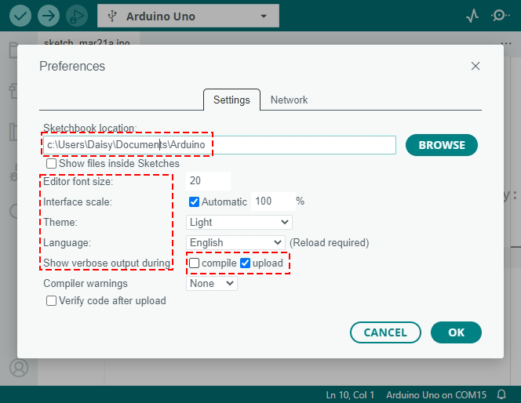

.. note::

    Hallo und herzlich willkommen in der SunFounder Raspberry Pi & Arduino & ESP32 Enthusiasten-Community auf Facebook! Tauche gemeinsam mit anderen Enthusiasten tiefer in die Welt von Raspberry Pi, Arduino und ESP32 ein.

    **Warum beitreten?**

    - **Expertenunterstützung**: Löse nach dem Kauf auftretende Probleme und technische Herausforderungen mit Hilfe unserer Community und unseres Teams.
    - **Lernen & Teilen**: Tausche Tipps und Anleitungen aus, um deine Fähigkeiten zu erweitern.
    - **Exklusive Vorschauen**: Erhalte frühzeitigen Zugang zu neuen Produktankündigungen und exklusiven Einblicken.
    - **Spezielle Rabatte**: Profitiere von exklusiven Rabatten auf unsere neuesten Produkte.
    - **Festliche Aktionen und Verlosungen**: Nimm an Verlosungen und Feiertagsaktionen teil.

    👉 Bereit, gemeinsam mit uns zu entdecken und zu erschaffen? Klicke auf [|link_sf_facebook|] und tritt noch heute bei!

1.5 Entdecke die Arduino-Welt (IDE)
================================================

Einführung in die Arduino IDE
-------------------------------------

Willkommen in der Arduino IDE, deinem speziellen Werkzeug, um coole Elektronikprojekte zu erstellen. In diesem Programm schreibst du die Anweisungen, auch Code genannt, die deinem Arduino sagen, was er tun soll.

Hier sind einige der Funktionen, die du mit der Arduino IDE nutzen kannst:

* **Überprüfen / Hochladen**: Diese Funktionen prüfen deinen Code und senden ihn an die Arduino-Platine.
* **Platine & Port auswählen**: Hilft deinem Computer, deine Arduino-Platine zu finden. Es zeigt, wo deine Platine angeschlossen ist, damit der Code am richtigen Ort landet.
* **Sketchbook**: Ein Ort, um alle deine bisherigen Codes und Projekte zu finden.
* **Board-Manager**: Fügt neue Arduino-Platinen hinzu, die du programmieren kannst.
* **Bibliotheks-Manager**: Bietet zusätzlichen Code für weitere Funktionen in deinen Projekten.
* **Debugger:** Hilft, Probleme im Code zu beheben.
* **Suche**: Ermöglicht das schnelle Auffinden bestimmter Codeabschnitte.
* **Serieller Monitor**: Öffnet den seriellen Monitor zur Kommunikation mit der Arduino-Platine.
* **Serieller Plotter**: Erstellt Diagramme aus Daten, wie Lichtstärken.

Für detailliertere Informationen über diese Funktionen, besuche bitte |link_docs_ide|.

Grundlegende Einstellungen
-------------------------------

Als Nächstes werfen wir einen Blick auf die Grundeinstellungen der Arduino IDE. Klicke in der Menüleiste oben auf **Datei** und dann auf **Voreinstellungen**.

.. raw:: html

     

Zunächst siehst du den Standard-Speicherort für deine Projekte, die als Sketche bezeichnet werden. Diese Sketche werden in einem Bereich namens Sketchbook gespeichert. Du kannst den Standard-Speicherort beibehalten oder einen Ort auswählen, der für dich am besten passt.

.. raw:: html

     

Anschließend kannst du die Arduino IDE nach deinen Wünschen anpassen:

* Stelle die **Schriftgröße**, die **Skalierung der Oberfläche**, **Themen** und sogar die **Sprache** ein, in der die IDE angezeigt wird.
* Unter **Ausführliche Ausgabe anzeigen bei** kannst du bei **kompilieren** oder **hochladen** ein Häkchen setzen, um detaillierte Rückmeldungen zu Fehlern während dieser Vorgänge zu erhalten.

Passe die Arduino IDE so an, dass sie für dich so komfortabel wie möglich ist. Wenn du mit deinen Einstellungen zufrieden bist, klicke auf **OK**, um sie zu speichern.

Herzlichen Glückwunsch! Du hast die Arduino IDE erfolgreich installiert und konfiguriert. Du hast einen wichtigen ersten Schritt in die Welt des Arduino-Programmierens gemacht.
