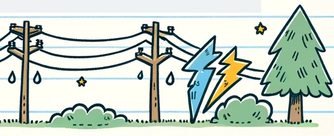

1.7 Electrical Safety
=====================

Congratulations on completing your first electronic activity! You might have wondered about your safety while making the Arduino blink. Could you get shocked by touching it?

The activities in this course are safe as long as you follow the instructions. However, the electrical concepts you'll encounter also apply to situations involving more power, like the circuits in your home. That's why knowing the risks and practicing good safety habits is important when dealing with any amount of electricity.

You've probably heard that you shouldn't insert objects into power outlets or touch fallen power lines. During thunderstorms, holding a metal rod up isn't a great idea either. The electricity from outlets, power lines, and storms can be deadly. But good electrical safety practices are important even when dealing with low power.

**Safety Tips:**

- Always make sure your circuit is off before working on it. Powering your circuit should be the last step.
- Don't work on conductive surfaces like metal tables to avoid short circuits.
- Wear appropriate safety gear like safety glasses, rubber gloves, or non-conductive shoes depending on the amount of electricity you're working with.
- Remove all metal jewelry to prevent short circuits or providing a path for electricity.
- Keep food and drinks away from your workspace. Water conducts electricity. A spilled bottle could ruin a project or endanger your life.
- Keep your workspace clean and organized. Be mindful of where your tools are.
- Don't use damaged electronic components. It's safer to replace them with new ones.
- When working with high currents or voltages, use your right hand as much as possible. This way, if you do get shocked, the electricity is less likely to pass through your heart.

Electricity can be dangerous, but following the right safety procedures minimizes the risks. Remember, the activities in this course use low voltage and low current, making them safe and free from the danger of electric shock or other physical harm.
