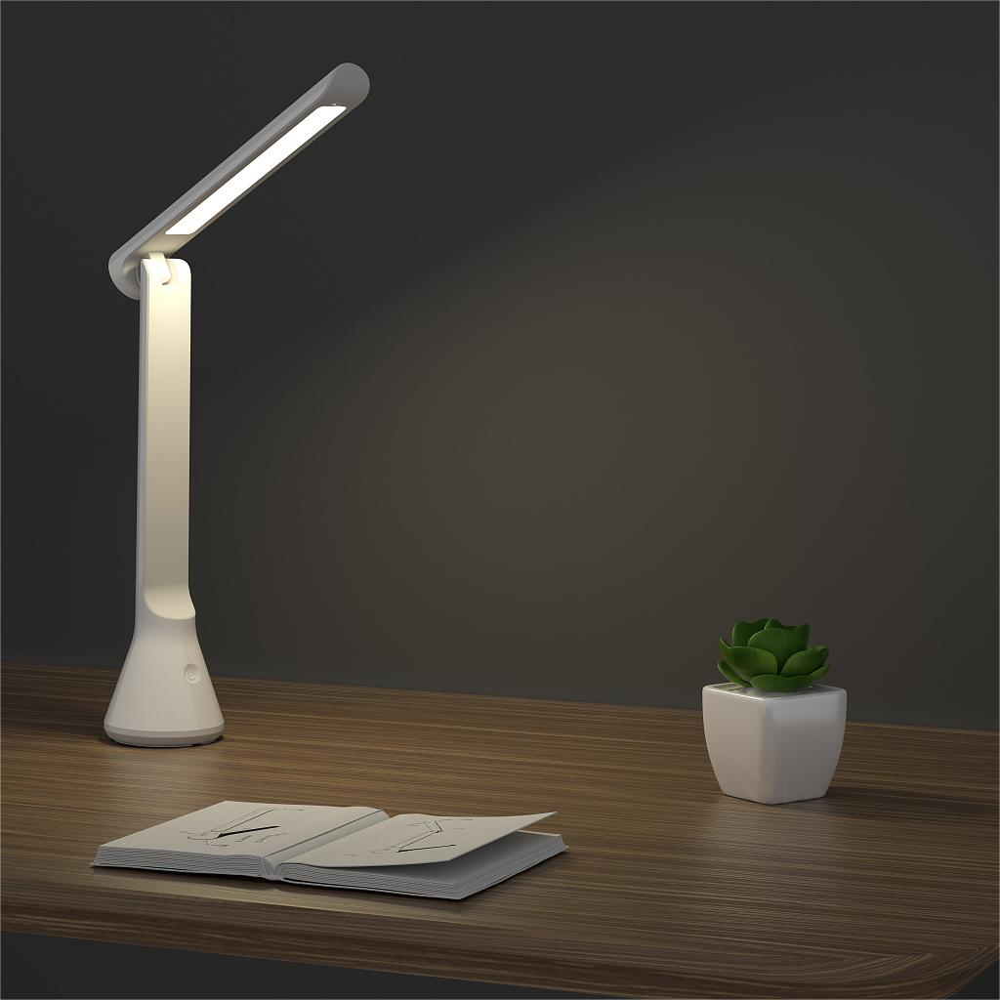
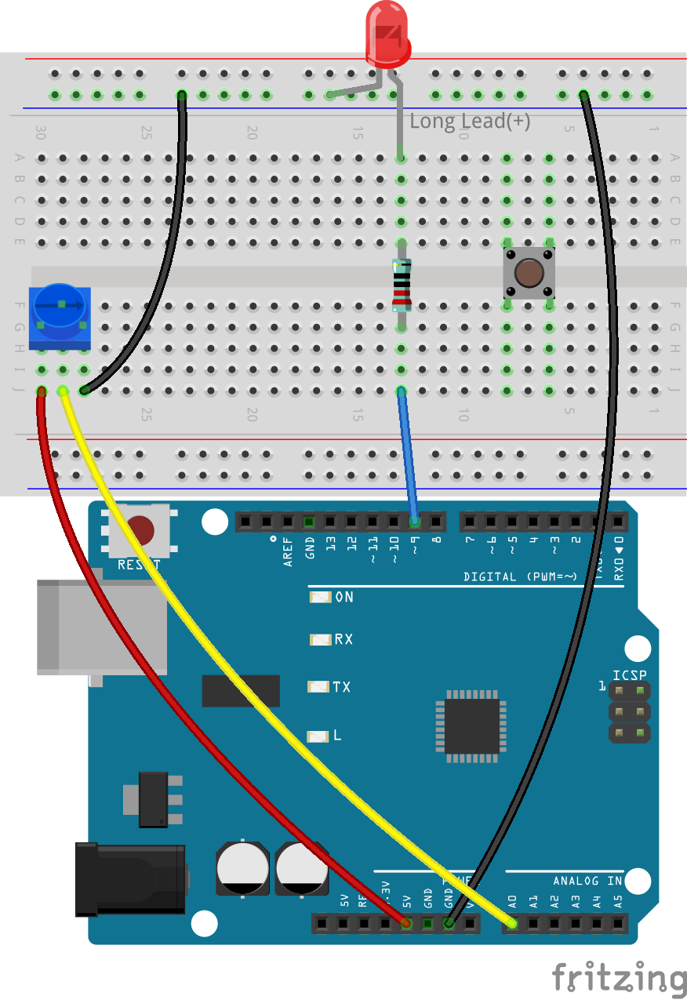
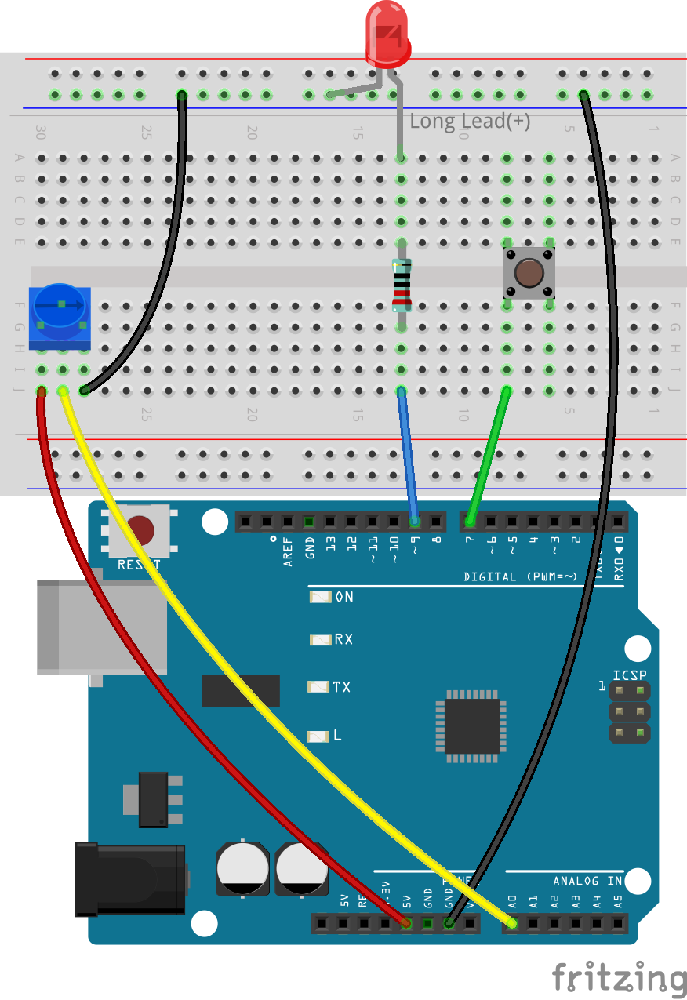
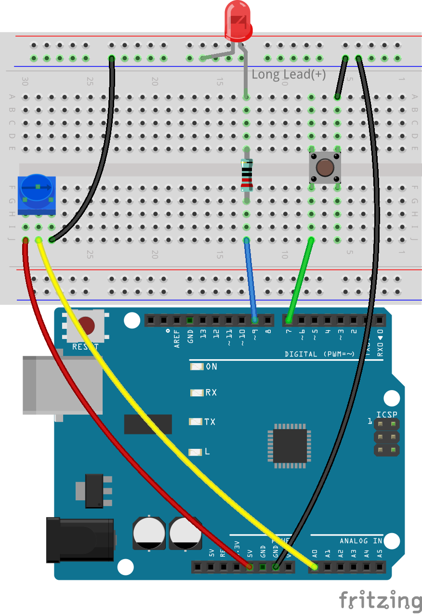
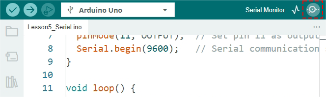
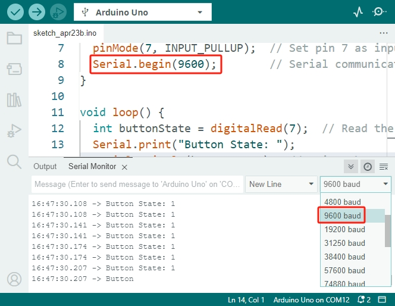
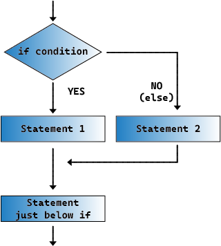
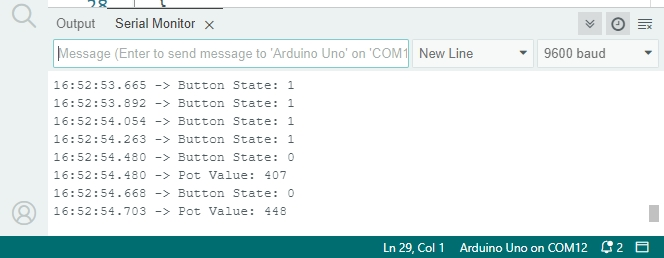

.. note::

    Bonjour et bienvenue dans la communauté SunFounder Raspberry Pi & Arduino & ESP32 Enthusiasts sur Facebook ! Plongez plus profondément dans l'univers du Raspberry Pi, d'Arduino et d'ESP32 avec d'autres passionnés.

    **Pourquoi nous rejoindre ?**

    - **Support d'experts** : Résolvez les problèmes après-vente et les défis techniques grâce à l'aide de notre communauté et de notre équipe.
    - **Apprendre et partager** : Échangez des astuces et des tutoriels pour améliorer vos compétences.
    - **Aperçus exclusifs** : Accédez en avant-première aux annonces de nouveaux produits et aux aperçus.
    - **Réductions spéciales** : Profitez de remises exclusives sur nos nouveaux produits.
    - **Promotions festives et concours** : Participez à des concours et à des promotions pendant les fêtes.

    👉 Prêt à explorer et à créer avec nous ? Cliquez sur [|link_sf_facebook|] et rejoignez-nous dès aujourd'hui !

10. Lampe de Bureau ON/OFF
====================================

Dans cette leçon, vous allez enrichir votre projet précédent en ajoutant une fonctionnalité pratique à votre lampe de bureau réglable : un bouton marche/arrêt. Cette amélioration simule un scénario réel où les lampes de bureau sont allumées ou éteintes, puis ajustées en luminosité avec un variateur, reproduisant ainsi plus fidèlement une utilisation quotidienne.

* Apprenez à utiliser le moniteur série pour afficher des données en temps réel.
* Implémentez le mode ``INPUT_PULLUP`` pour gérer efficacement les entrées du bouton.
* Comprenez comment détecter les changements d'état.
* Explorez les caractéristiques des signaux numériques et analogiques.
* Utilisez les instructions conditionnelles (``if else``).

Construction du Circuit
------------------------------------

**Composants Nécessaires**

.. list-table:: 
   :widths: 25 25 25 25
   :header-rows: 0

   * - 1 * Arduino Uno R3
     - 1 * LED rouge
     - 1 * Résistance de 220Ω
     - 1 * Potentiomètre
   * - |list_uno_r3| 
     - |list_red_led| 
     - |list_220ohm| 
     - |list_potentiometer| 
   * - 1 * Bouton
     - 1 * Câble USB
     - 1 * Breadboard
     - Fils de Connexion
   * - |list_button| 
     - |list_usb_cable| 
     - |list_breadboard| 
     - |list_wire| 

**Étapes de Construction**

1. Commencez par le circuit de la lampe de bureau de la leçon précédente.

.. image:: img/9_dimmer_led1_pin9.png
    :width: 500
    :align: center

2. Insérez le bouton dans la breadboard en traversant le vide central, avec les broches dans les trous 6E, 8E, 6J et 8J.

.. note::

    Si vous ne savez pas comment insérer le bouton, essayez les deux orientations. Dans un sens, l'écartement des broches sera légèrement trop étroit pour s'adapter.

3. Connectez la broche en bas à gauche du bouton à la pin numérique 7 de l'Arduino Uno R3 à l'aide d'un long fil, en insérant une extrémité dans le trou 8J et l'autre dans la pin 7.

4. Connectez la broche en haut à droite du bouton au rail négatif de la breadboard avec un court fil, en insérant une extrémité dans le trou 6A et l'autre dans le rail négatif.

Création de Code
---------------------

**Afficher l'État du Bouton**

1. Ouvrez le sketch que vous avez sauvegardé précédemment, ``Lesson9_Desk_Lamp``. Cliquez sur "Enregistrer sous..." dans le menu "Fichier", et renommez-le en ``Lesson10_Desk_Lamp_Button``. Cliquez sur "Enregistrer".

2. Dans la leçon 8, nous avons utilisé un bouton avec une résistance de pull-down de 10K connectée manuellement entre GND et le bouton. Cependant, dans ce circuit, nous n'avons pas connecté de résistance. À la place, nous pouvons utiliser la fonctionnalité de pull-up interne d'Arduino. Vous devez définir la pin connectée au bouton comme entrée tout en l'ajustant à ``PULLUP``.

.. code-block:: Arduino
    :emphasize-lines: 6

    int potValue = 0;

    void setup() {
        // Mettez votre code de configuration ici, à exécuter une fois :
        pinMode(9, OUTPUT);        // Définir la pin 9 comme sortie
        pinMode(7, INPUT_PULLUP);  // Définir la pin 7 comme entrée avec une résistance de pull-up interne
    }

3. Pour utiliser le moniteur série, vous devez inclure une commande qui initialise la communication série sur l'Arduino Uno R3.

Cette commande est généralement placée dans la section ``void setup()`` du sketch. La commande ``Serial.begin(baud)`` démarre la communication série, où ``baud`` représente la vitesse de transfert des données par seconde entre l'ordinateur et l'Arduino Uno R3. Les vitesses de transfert courantes sont 9600 et 115200 bits par seconde.

.. code-block:: Arduino
    :emphasize-lines: 7

    int potValue = 0;

    void setup() {
        // Mettez votre code de configuration ici, à exécuter une fois :
        pinMode(9, OUTPUT);        // Définir la pin 9 comme sortie
        pinMode(7, INPUT_PULLUP);  // Définir la pin 7 comme entrée avec une résistance de pull-up interne
        Serial.begin(9600);        // Initialisation de la communication série à 9600 bauds
    }

4. Avant d'entrer dans la fonction ``void loop()``, nous devons également créer deux variables pour initialiser les états du bouton et de la LED. La LED doit être éteinte en l'absence d'interaction, donc définissez son état sur LOW. Comme le bouton utilise une résistance de pull-up interne, il sera lu comme HIGH lorsqu'il n'est pas pressé.

.. code-block:: Arduino
    :emphasize-lines: 2,3

    int potValue = 0;  // Variable pour stocker la valeur lue du potentiomètre
    int ledState = LOW;          // État initial de la LED
    int lastButtonState = HIGH;  // La dernière lecture de la pin d'entrée

    void setup() {
        pinMode(9, OUTPUT);        // Définir la pin 9 comme sortie
        pinMode(7, INPUT_PULLUP);  // Définir la pin 7 comme entrée avec une résistance de pull-up interne
        Serial.begin(9600);        // Initialisation de la communication série à 9600 bauds
    }

5. Maintenant, dans la fonction ``void loop()``, lisez d'abord l'état du bouton en utilisant ``digitalRead()`` et stockez-le dans la variable ``buttonState``.

.. code-block:: Arduino
    :emphasize-lines: 2

    void loop() {
        int buttonState = digitalRead(7);  // Read the state of the button
    }

6. Vous êtes maintenant prêt à utiliser le moniteur série pour afficher des données. Vous utiliserez ``Serial.print()`` pour afficher des données et d'autres textes.

Voici comment l'utiliser :

    * ``Serial.print(val)`` ou ``Serial.print(val, format)`` : Affiche des données sur le port série sous forme de texte ASCII lisible.

    **Paramètres**
        - ``Serial`` : objet du port série.
        - ``val`` : la valeur à afficher. Types de données autorisés : tout type de données.

    **Retourne**
        ``print()`` renvoie le nombre d'octets écrits, bien que la lecture de ce nombre soit optionnelle. Type de données : size_t.

Cette commande peut représenter divers types de données et formats, y compris les nombres, les points flottants, les octets et les chaînes de caractères. Par exemple :

.. code-block:: Arduino

    Serial.print(78);                // affiche "78"
    Serial.print(78, BIN);           // affiche "1001110"
    Serial.print(1.23456);           // affiche "1.23"
    Serial.print(1.23456, 0);        // affiche "1"
    Serial.print('N');               // affiche "N"
    Serial.print("Bonjour tout le monde.");  // affiche "Bonjour tout le monde."

7. Utilisez cette commande pour afficher un message indiquant les données sur le point d'être imprimées. Cela est utile pour différencier plusieurs impressions de données en même temps.

.. code-block:: Arduino
    :emphasize-lines: 3

    void loop() {
        int buttonState = digitalRead(7);  // Lire l'état du bouton
        Serial.print("Button State: ");
    }

8. Imprimez maintenant la valeur stockée dans la variable ``buttonState``. Pour vous assurer que chaque sortie apparaît sur une nouvelle ligne dans le Moniteur Série, utilisez ``Serial.println()``, qui ajoute un caractère de retour à la ligne à la fin de l'instruction print.

.. note::

    Notez la différence entre l'impression de caractères ou de chaînes (qui doivent être placés entre guillemets) et les variables qui sont insérées directement.

.. code-block:: Arduino
    :emphasize-lines: 14

    int potValue = 0;  // Variable pour stocker la valeur lue du potentiomètre
    int ledState = LOW;          // État initial de la LED
    int lastButtonState = HIGH;  // La dernière lecture de la pin d'entrée

    void setup() {
        pinMode(9, OUTPUT);        // Définir la pin 9 comme sortie
        pinMode(7, INPUT_PULLUP);  // Définir la pin 7 comme entrée avec une résistance de pull-up interne
        Serial.begin(9600);        // Initialisation de la communication série à 9600 bauds
    }

    void loop() {
        int buttonState = digitalRead(7);  // Lire l'état du bouton
        Serial.print("État du Bouton : ");
        Serial.println(buttonState);  // Imprimer l'état actuel du bouton
    }

9. À ce stade, le code est essentiellement complet. Cliquez sur "Téléverser" pour téléverser le code sur l'Arduino Uno R3.

.. note::

    Chaque fois que des données sont transmises de la carte à l'ordinateur, vous devriez voir la LED TX sur votre Arduino Uno R3 clignoter.

10. Ensuite, cliquez sur le bouton "Moniteur Série" en haut à droite de l'IDE Arduino.

11. Si vous voyez des données illisibles affichées, vous devrez ajuster le débit en bauds pour qu'il corresponde à celui défini dans votre code.

12. Vous constaterez que lorsque le bouton n'est pas pressé, il imprime continuellement "1", et lorsque le bouton est pressé, il imprime continuellement "0". C'est la caractéristique d'un signal numérique, qui n'a que deux états : "0" et "1".

**Détection des Changements d'État du Bouton**

Dans cette section, nous allons apprendre à utiliser un simple bouton pour contrôler une LED en basculant son état de ON à OFF et vice versa. Cela implique de détecter le moment précis où l'état du bouton passe de non appuyé à appuyé.

1. Commençons par la fonction principale qui surveille l'appui sur le bouton.

Auparavant, nous avons appris à déterminer si un bouton est appuyé en lisant son état comme ``HIGH`` ou ``LOW``. Cependant, cette leçon vise à réagir à un simple appui sans qu'il soit nécessaire de maintenir le bouton enfoncé. Cela nécessite de détecter un changement d'état du bouton.

Pour y parvenir, nous utilisons une instruction ``if`` qui compare l'état précédent du bouton (``lastButtonState``) avec son état actuel (``buttonState``). L'opérateur logique ``&&`` est utilisé ici, ce qui signifie que les deux conditions doivent être vraies pour que le bloc de code dans l'instruction ``if`` soit exécuté.

.. code-block:: Arduino
    :emphasize-lines: 7,8

    void loop() {
        int buttonState = digitalRead(7);  // Lire l'état du bouton
        Serial.print("Button State: ");
        Serial.println(buttonState);  // Imprimer l'état actuel du bouton
            
        // Vérifier si l'état du bouton a changé depuis la dernière itération de la boucle
        if (lastButtonState == HIGH && buttonState == LOW) {  // Appui sur le bouton détecté
        }
    }

2. Lorsque l'appui sur le bouton est détecté, nous basculons l'état de la LED. Cela signifie que si la LED était éteinte, elle s'allume, et si elle était allumée, elle s'éteint. L'opérateur ``!`` est utilisé pour inverser l'état de la variable ledState.

.. code-block:: Arduino
    :emphasize-lines: 8

    void loop() {
        int buttonState = digitalRead(7);  // Lire l'état du bouton
        Serial.print("Button State: ");
        Serial.println(buttonState);  // Imprimer l'état actuel du bouton
            
        // Vérifier si l'état du bouton a changé depuis la dernière itération de la boucle
        if (lastButtonState == HIGH && buttonState == LOW) {  // Appui sur le bouton détecté
            ledState = !ledState;                               // Basculer l'état de la LED
        }
    }

3. Après avoir vérifié l'état du bouton et mis à jour la LED en conséquence, nous devons enregistrer l'état actuel du bouton comme le nouveau 'dernier état connu'. Cette étape est cruciale pour détecter le prochain changement d'état.

.. code-block:: Arduino
    :emphasize-lines: 10,11

    void loop() {
        int buttonState = digitalRead(7);  // Lire l'état du bouton
        Serial.print("Button State: ");
        Serial.println(buttonState);  // Imprimer l'état actuel du bouton
        
        // Vérifier si l'état du bouton a changé depuis la dernière itération de la boucle
        if (lastButtonState == HIGH && buttonState == LOW) {  // Appui sur le bouton détecté
            ledState = !ledState;                               // Basculer l'état de la LED
        }
        lastButtonState = buttonState;  // Mettre à jour lastButtonState avec l'état actuel
        delay(200);                     // Optionnel : Simple anti-rebond logiciel
    }

**Ajuster la Luminosité avec un Potentiomètre**

Dans les scénarios où ``ledState`` est à ``HIGH``, nous voulons que la LED ne se contente pas de s'allumer, mais que sa luminosité puisse également être ajustée à l'aide d'un potentiomètre. Voici comment vous pouvez implémenter cette fonctionnalité :

1. Juste après l'instruction ``if`` qui bascule l'état de la LED lors d'un appui sur le bouton, ajoutez une autre instruction ``if`` pour vérifier si ``ledState`` est à ``HIGH``. Si c'est le cas, c'est ici que nous ajusterons la luminosité de la LED en fonction de la valeur du potentiomètre.

.. code-block:: Arduino
    :emphasize-lines: 10,12

    void loop() {
        int buttonState = digitalRead(7);  // Lire l'état du bouton
        Serial.print("Button State: ");
        Serial.println(buttonState);  // Imprimer l'état actuel du bouton
        
        // Vérifier si l'état du bouton a changé depuis la dernière itération
        if (lastButtonState == HIGH && buttonState == LOW) {  // Appui sur le bouton détecté
            ledState = !ledState;                               // Basculer l'état de la LED
        }
        if (ledState == HIGH) {

        }
        lastButtonState = buttonState;  // Mettre à jour lastButtonState avec l'état actuel
        delay(200);                     // Optionnel : Simple anti-rebond logiciel
    }

2. À l'intérieur du bloc ``if (ledState == HIGH)``, lisez la valeur du potentiomètre pour déterminer le niveau de luminosité. Ensuite, appliquez cette valeur pour ajuster la luminosité de la LED à l'aide de ``analogWrite()``. Imprimez également cette valeur dans le Moniteur Série pour obtenir un retour en temps réel.

.. code-block:: Arduino
    :emphasize-lines: 6-9

    // Vérifier si l'état du bouton a changé depuis la dernière itération
    if (lastButtonState == HIGH && buttonState == LOW) {  // Appui sur le bouton détecté
        ledState = !ledState;                               // Basculer l'état de la LED
    }
    if (ledState == HIGH) {
        potValue = analogRead(A0);  // Lire en continu la valeur du potentiomètre lorsque la LED est allumée
        analogWrite(9, potValue / 4);  // Ajuster en continu la luminosité
        Serial.print("Pot Value: ");
        Serial.println(potValue);
    }
    lastButtonState = buttonState;  // Mettre à jour lastButtonState avec l'état actuel
    delay(200);                     // Optionnel : Simple anti-rebond logiciel

3. Pour vous assurer que la LED s'éteint lorsque ``ledState`` est à ``LOW``, ajoutez une instruction ``else`` après le bloc ``if``. Cela permettra d'éteindre complètement la LED lorsque les conditions dans le ``if`` ne sont pas remplies.

.. code-block:: Arduino
    :emphasize-lines: 6-8

    if (ledState == HIGH) {
        potValue = analogRead(A0);  // Lire en continu la valeur du potentiomètre lorsque la LED est allumée
        analogWrite(9, potValue / 4);  // Ajuster en continu la luminosité
        Serial.print("Pot Value: ");
        Serial.println(potValue);
    } else {
        analogWrite(9, 0);  // Éteindre la LED
    }

**Exécution du Code**

Maintenant que votre code est complet, voici la liste complète :

.. code-block:: Arduino

    int potValue = 0;            // Variable pour stocker la valeur lue du potentiomètre
    int ledState = LOW;          // État initial de la LED
    int lastButtonState = HIGH;  // La dernière lecture de la pin d'entrée

    void setup() {
        pinMode(9, OUTPUT);        // Définir la pin 9 comme sortie
        pinMode(7, INPUT_PULLUP);  // Définir la pin 7 comme entrée avec une résistance de pull-up interne
        Serial.begin(9600);        // Initialisation de la communication série à 9600 bauds
    }

    void loop() {
        int buttonState = digitalRead(7);  // Lire l'état du bouton
        Serial.print("Button State: ");
        Serial.println(buttonState);

        // Vérifier si l'état du bouton a changé depuis la dernière itération
        if (lastButtonState == HIGH && buttonState == LOW) {  // Appui sur le bouton détecté
            ledState = !ledState;                               // Basculer l'état de la LED
        }

        if (ledState == HIGH) {
            potValue = analogRead(A0);  // Lire en continu la valeur du potentiomètre lorsque la LED est allumée
            analogWrite(9, potValue / 4);  // Ajuster en continu la luminosité
            Serial.print("Pot Value: ");
            Serial.println(potValue);
        } else {
            analogWrite(9, 0);  // Éteindre la LED
        }

        lastButtonState = buttonState;  // Mettre à jour lastButtonState avec l'état actuel
        delay(200);                     // Optionnel : Simple anti-rebond logiciel
    }

1. Après avoir sélectionné la carte et le port corrects, cliquez sur "Téléverser" pour télécharger le code sur votre Arduino.

2. Ouvrez le Moniteur Série pour visualiser les données de sortie. Vous remarquerez que l'état du bouton affiche "1" en continu lorsqu'il n'est pas pressé et "0" au moment où il est pressé. En même temps, la valeur du potentiomètre sera également imprimée. Lorsque vous tournez le potentiomètre, vous observerez dans le Moniteur Série que plus la valeur est élevée, plus la LED devient lumineuse, et vice versa.

.. note::

    Vous devez désormais bien comprendre :

    - Les signaux numériques n'ont que deux états : 0 et 1.
    - Les signaux analogiques, en revanche, ont une plage de valeurs, dans ce cas de 0 à 1023.

3. Enfin, n'oubliez pas de sauvegarder votre code et de ranger votre espace de travail.

**Question**

1. Que se passerait-il si vous définissiez la pin numérique 7 uniquement sur INPUT ? Pourquoi ?

.. code-block::
    :emphasize-lines: 3

    void setup() {
        pinMode(9, OUTPUT);        // Définir la pin 9 comme sortie
        pinMode(7, INPUT);  // Définir la pin 7 comme entrée
        Serial.begin(9600);        // Initialisation de la communication série à 9600 bauds
    }

2. Si la pin 7 est définie uniquement sur ``INPUT``, quels ajustements faudrait-il apporter au circuit ?

**Résumé**

À la fin de cette leçon, vous aurez une lampe de bureau ON/OFF entièrement fonctionnelle, contrôlée via une interface utilisateur simple. Vous aurez maîtrisé l'intégration et la manipulation de divers composants électroniques ainsi que les techniques de programmation Arduino pour créer un dispositif électronique pratique et interactif. Ce projet renforce non seulement les concepts fondamentaux en électronique et en programmation, mais vous donne également une pièce fonctionnelle à ajouter à votre collection de projets DIY.
