.. note::

    Bonjour et bienvenue dans la communauté SunFounder Raspberry Pi & Arduino & ESP32 Enthusiasts sur Facebook ! Plongez plus profondément dans l'univers du Raspberry Pi, d'Arduino et d'ESP32 avec d'autres passionnés.

    **Pourquoi nous rejoindre ?**

    - **Support d'experts** : Résolvez les problèmes après-vente et les défis techniques grâce à l'aide de notre communauté et de notre équipe.
    - **Apprenez et partagez** : Échangez des astuces et des tutoriels pour améliorer vos compétences.
    - **Aperçus exclusifs** : Accédez en avant-première aux annonces de nouveaux produits et aux aperçus.
    - **Réductions spéciales** : Profitez de remises exclusives sur nos nouveaux produits.
    - **Promotions festives et concours** : Participez à des concours et des promotions pendant les fêtes.

    👉 Prêt à explorer et créer avec nous ? Cliquez sur [|link_sf_facebook|] et rejoignez-nous dès aujourd'hui !

11. Contrôle de Matrices de LED avec un Potentiomètre
==========================================================

Bienvenue dans cette leçon, où nous allons explorer comment maîtriser les instructions conditionnelles pour contrôler dynamiquement des matrices de LED. En s'appuyant sur nos connaissances des circuits LED simples, cette leçon vous introduit à une logique conditionnelle plus complexe, permettant aux LEDs de réagir à différents niveaux d'entrée d'un potentiomètre. Ce cours est idéal pour les débutants qui découvrent les instructions conditionnelles, ainsi que pour les programmeurs expérimentés souhaitant approfondir leur compréhension des structures if-else if-else.

À la fin de cette leçon, vous saurez non seulement programmer les LEDs pour s'allumer en séquence, mais vous comprendrez aussi comment utiliser ces schémas lumineux pour représenter visuellement différents seuils d'entrée.

.. raw:: html

    <video controls style = "max-width:90%">
        <source src="_static/video/11_control_leds.mp4" type="video/mp4">
        Your browser does not support the video tag.
    </video>

Construction du Circuit
------------------------------------

**Composants Nécessaires**

.. list-table:: 
   :widths: 25 25 25 25
   :header-rows: 0

   * - 1 * Arduino Uno R3
     - 3 * LED rouges
     - 3 * Résistance de 220Ω
     - 1 * Potentiomètre
   * - |list_uno_r3| 
     - |list_red_led| 
     - |list_220ohm| 
     - |list_potentiometer| 
   * - 1 * Câble USB
     - 1 * Breadboard
     - Fils de connexion
     - 1 * Multimètre
   * - |list_usb_cable| 
     - |list_breadboard| 
     - |list_wire| 
     - |list_meter|

**Étapes de Construction**

Suivez le schéma de câblage ou les étapes ci-dessous pour construire votre circuit.

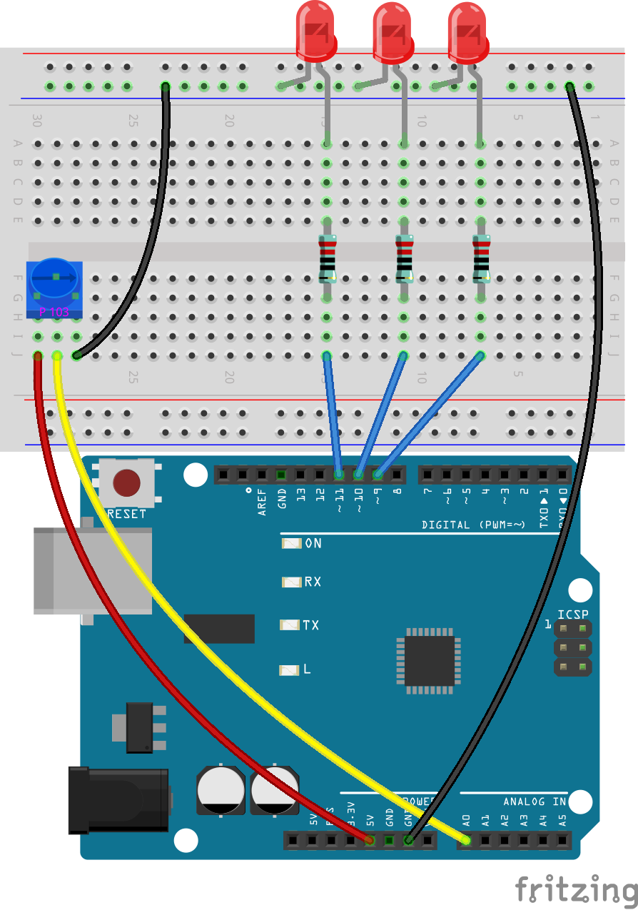

1. Connectez un potentiomètre à la breadboard. Insérez ses trois broches dans les trous 30G, 29F, 28G.

.. note::
    Le potentiomètre est étiqueté "P 103", indiquant sa plage de résistance. Insérez-le dans la breadboard comme indiqué, avec le côté étiqueté face à vous.

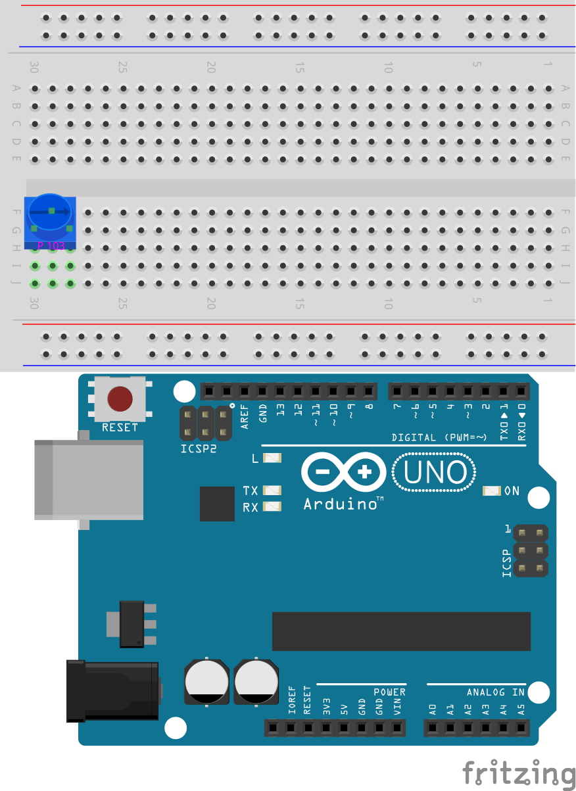

2. Insérez un fil de connexion dans le trou 28J et connectez-le à la borne négative de la breadboard.

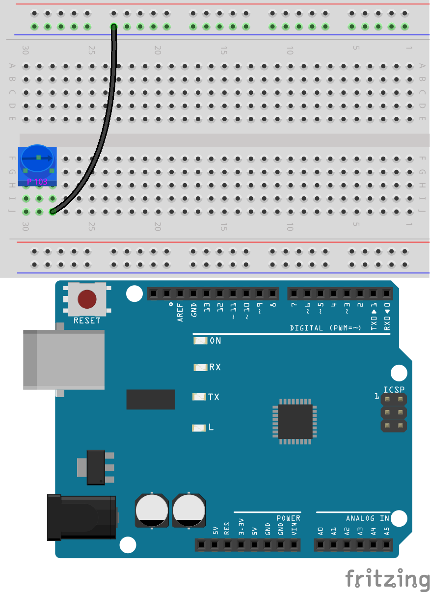

3. Ensuite, insérez un fil de connexion entre le trou 29J et la pin A0 de l'Arduino Uno R3.

4. Enfin, connectez le potentiomètre au 5V en insérant un fil de connexion entre le trou 30J de la breadboard et la pin 5V de l'Arduino Uno R3.

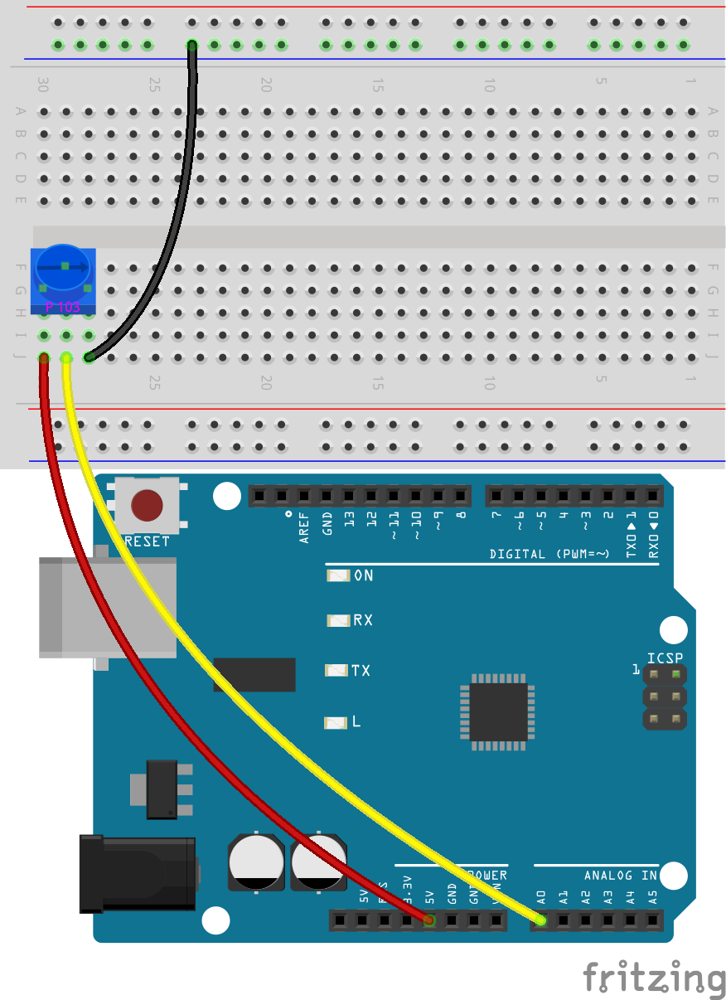

5. Connectez la pin GND de l'Arduino Uno R3 à la borne négative de la breadboard à l'aide d'un long fil de connexion.

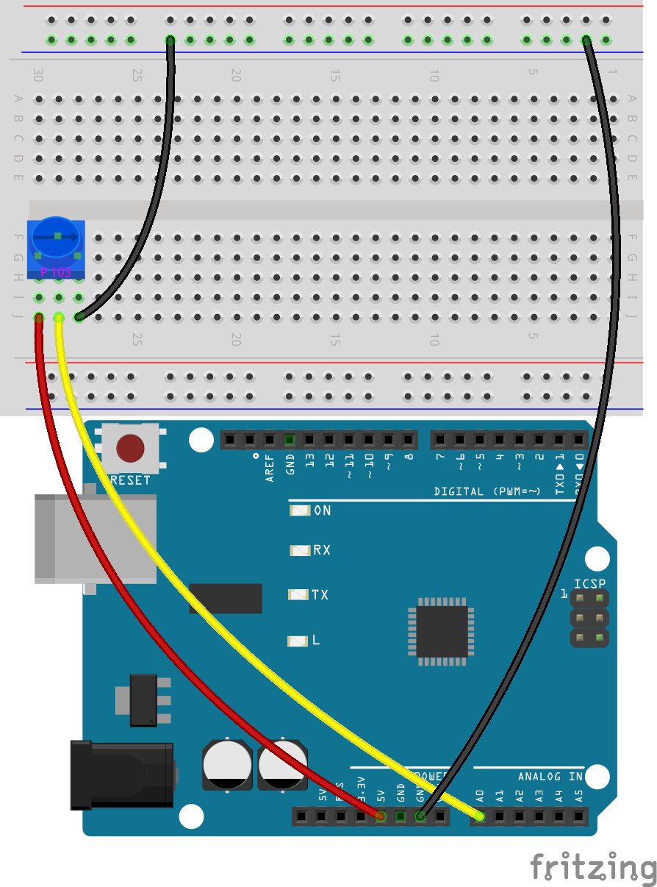

6. Prenez trois LEDs de n'importe quelle couleur. Insérez leurs anodes (broches les plus longues) dans les trous 15A, 11A, et 7A respectivement, et leurs cathodes (broches les plus courtes) dans la borne négative de la breadboard.

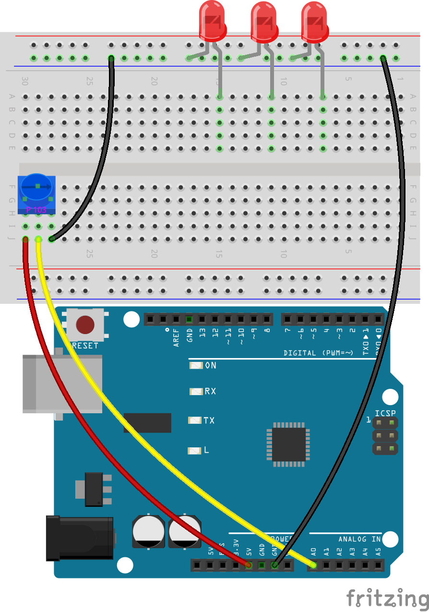

7. Placez une résistance de 220 ohms entre les trous 15E et 15G.

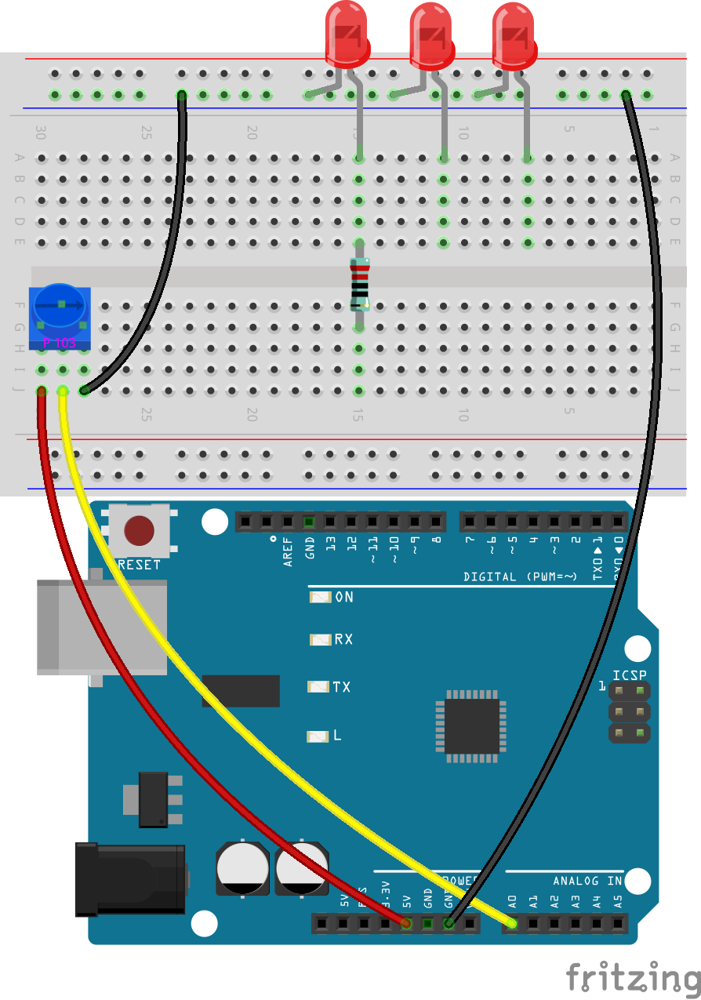

8. De la même manière, insérez une résistance de 220 ohms entre les trous 11E et 11G, puis une autre entre les trous 7E et 7G.

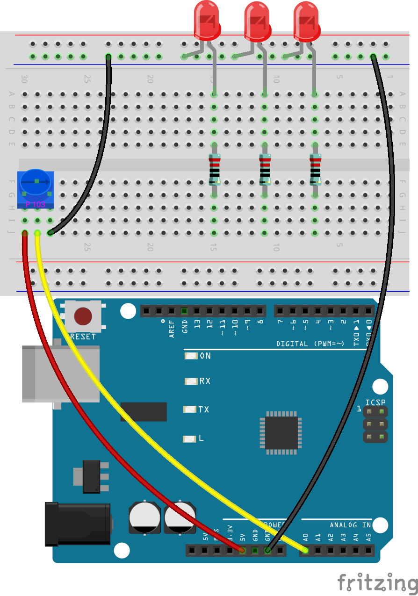

9. Connectez le trou 15J de la breadboard à la pin 11 de l'Arduino Uno R3 à l'aide d'un fil.

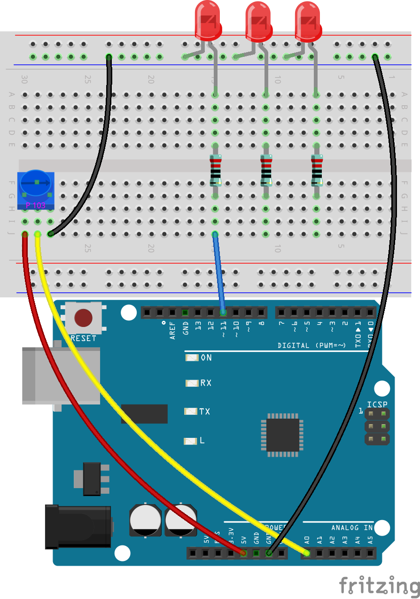

10. Connectez le trou 11J de la breadboard à la pin 10 de l'Arduino Uno R3 à l'aide d'un fil.

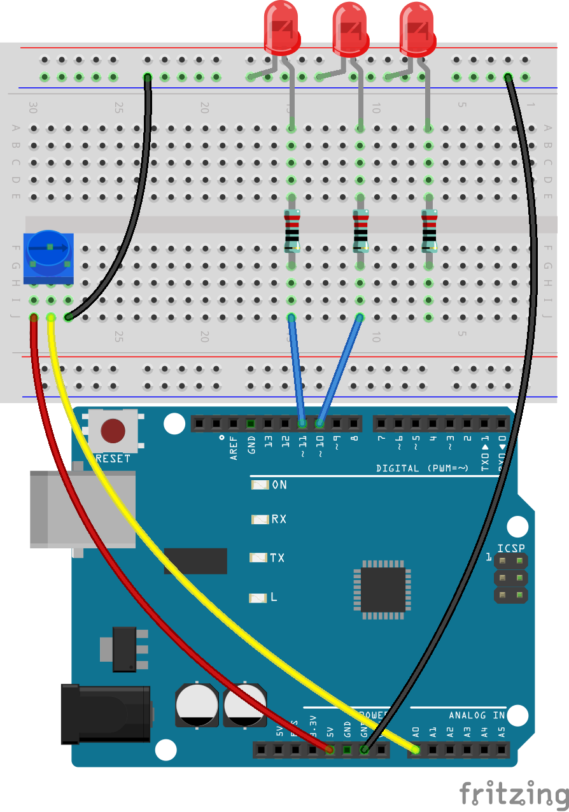

11. Connectez le trou 7J de la breadboard à la pin 9 de l'Arduino Uno R3 à l'aide d'un fil. Votre circuit est maintenant terminé.

Création du Code
-----------------------

**Écrire un pseudocode**

1. Le pseudocode sert de croquis de programme, écrit dans un langage simple pour en faciliter la compréhension. Votre tâche consiste à créer un pseudocode pour un tableau de LEDs qui réagit à un potentiomètre. À mesure que la valeur du potentiomètre augmente, plus de LEDs s'allumeront. Avant de rédiger le pseudocode, répondez à ces questions :

.. code-block::

    - Comment l'Arduino lit-il la valeur du potentiomètre ?
    - Comment chaque LED peut-elle être contrôlée individuellement ?
    - En combien de plages les valeurs du potentiomètre doivent-elles être divisées ?
    - Que doit afficher chaque LED en fonction de ces plages ?

2. Rédigez votre pseudocode pour le tableau de LEDs dans la section vierge de votre manuel.

**Imprimer les Valeurs du Potentiomètre**

3. Pour transformer votre pseudocode en un sketch fonctionnel, ouvrez l'IDE Arduino et démarrez un nouveau projet en sélectionnant « Nouveau Sketch » dans le menu « Fichier ».
4. Sauvegardez votre sketch sous le nom de ``Lesson11_LED_Array`` en utilisant ``Ctrl + S`` ou en cliquant sur « Enregistrer ».

5. Comme dans les leçons précédentes, créez une variable avant la fonction ``void setup()`` pour stocker la valeur du potentiomètre, et n'oubliez pas d'annoter votre code pour correspondre à sa fonctionnalité.

.. code-block:: Arduino
    :emphasize-lines: 1

    int potValue = 0;            // Variable pour stocker la valeur lue du potentiomètre

    void setup() {
        // Code à exécuter une seule fois :

    }

6. Comme les LEDs sont des dispositifs de sortie, vous devrez configurer les pins numériques 9, 10 et 11 comme sorties (OUTPUT). N'oubliez pas d'ajouter des commentaires.

.. code-block:: Arduino
    :emphasize-lines: 5,6,7

    int potValue = 0;            // Variable pour stocker la valeur lue du potentiomètre

    void setup() {
        // Code à exécuter une seule fois :
        pinMode(9, OUTPUT);  // Configurer la pin 9 comme sortie
        pinMode(10, OUTPUT); // Configurer la pin 10 comme sortie
        pinMode(11, OUTPUT); // Configurer la pin 11 comme sortie
    }

7. Démarrez la communication série en définissant le débit en bauds à 9600.

.. code-block:: Arduino
    :emphasize-lines: 8

    int potValue = 0;            // Variable pour stocker la valeur lue du potentiomètre

    void setup() {
        // Code à exécuter une seule fois :
        pinMode(9, OUTPUT);  // Configurer la pin 9 comme sortie
        pinMode(10, OUTPUT); // Configurer la pin 10 comme sortie
        pinMode(11, OUTPUT); // Configurer la pin 11 comme sortie
        Serial.begin(9600);  // Démarrer la communication série à 9600 bauds
    }

8. Dans la fonction ``void loop()``, après avoir lu la valeur du potentiomètre, stockez-la dans la variable ``potValue`` et affichez-la dans le moniteur série.

.. code-block:: Arduino
    :emphasize-lines: 12-15

    int potValue = 0;            // Variable pour stocker la valeur lue du potentiomètre

    void setup() {
        pinMode(9, OUTPUT);  // Configurer la pin 9 comme sortie
        pinMode(10, OUTPUT); // Configurer la pin 10 comme sortie
        pinMode(11, OUTPUT); // Configurer la pin 11 comme sortie
        Serial.begin(9600);  // Démarrer la communication série à 9600 bauds
    }

    void loop() {
        // Code principal à exécuter en boucle :
        potValue = analogRead(A0);     // Lire la valeur du potentiomètre
        Serial.print("Valeur Pot : ");  // Afficher la lecture
        Serial.println(potValue);      // Imprimer la valeur du potentiomètre
        delay(100);
    }

9. Validez et compilez votre code si nécessaire.

10. Une fois le code téléversé sur l'Arduino Uno R3, vous remarquerez que faire tourner le potentiomètre fait varier la valeur affichée dans le moniteur série entre 0 et 1023. Cette plage est idéale, mais en raison des variations de fabrication, votre potentiomètre pourrait afficher une plage de 50 à 1000. Gardez simplement cette plage en référence.

**Contrôler les LEDs avec les Valeurs du Potentiomètre**

Pour allumer successivement chaque LED en fonction de la valeur du potentiomètre, vous aurez besoin de plusieurs conditions. Vous pouvez utiliser ``if`` pour spécifier des actions pour différentes plages de valeurs du potentiomètre :
  
  - Moins de 200 : Éteindre toutes les LEDs.
  - Entre 200 et 600 : Allumer la première LED.
  - Entre 600 et 1000 : Allumer deux LEDs.
  - Au-dessus de 1000 : Allumer toutes les LEDs.

Cependant, gérer ces conditions séparément peut être inefficace, car l'Arduino doit vérifier chaque condition à chaque cycle de boucle.

Pour optimiser cela, utilisez la structure ``if-else if`` :

.. code-block:: Arduino

    if (condition 1) {
        // Exécuter si la condition 1 est vraie
    }
    else if (condition 2) {
        // Exécuter si la condition 2 est vraie
    }
    else if (condition 3) {
        // Exécuter si la condition 3 est vraie
    }
    else {
        // Exécuter si aucune des conditions n'est vraie
    }

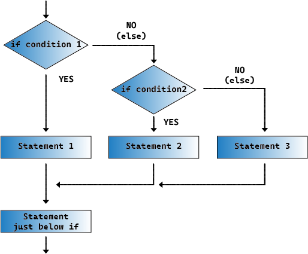

Dans une structure ``if-else if``, la première condition est testée. Si elle est vraie, les commandes associées sont exécutées, et toutes les autres conditions sont ignorées (même si certaines sont vraies). Si la première condition est fausse, la deuxième condition est testée. Si cette condition est vraie, les commandes associées à cette condition sont exécutées, puis les autres sont ignorées. Si elle est fausse, la troisième condition est testée, et ainsi de suite. Dans certains cas, plusieurs conditions peuvent être vraies. Par conséquent, l'ordre des conditions est important. Seule la première condition vraie aura ses commandes exécutées.

11. Tout d'abord, éteignez les trois LEDs si la valeur du potentiomètre est inférieure à 200. Ajoutez une instruction if et utilisez ensuite la fonction digitalWrite() pour définir les pins 9, 10 et 11 sur LOW afin d'éteindre les LEDs.

.. code-block:: Arduino
    :emphasize-lines: 7-11 

    void loop() {
        // put your main code here, to run repeatedly:
        potValue = analogRead(A0);    // Read value from potentiometer
        Serial.print("Pot Value: ");  // Prompt for the read value
        Serial.println(potValue);     // Print the potentiometer value
        delay(100);
        if (potValue < 200) {     // If potValue less than 200
            digitalWrite(9, LOW);   // Switch off the LED on pin 9
            digitalWrite(10, LOW);  // Switch off the LED on pin 10
            digitalWrite(11, LOW);  // Switch off the LED on pin 11
        }
    }

 
12. Ajoutez une instruction ``else if`` pour allumer la première LED lorsque la valeur analogique du potentiomètre est inférieure à 600.

 
.. code-block:: Arduino
    :emphasize-lines: 5-9 
    
    if (potValue < 200) {         // Si potValue est inférieur à 200
        digitalWrite(9, LOW);       // Éteindre la LED sur la pin 9
        digitalWrite(10, LOW);      // Éteindre la LED sur la pin 10
        digitalWrite(11, LOW);      // Éteindre la LED sur la pin 11
    } else if (potValue < 600) {  // Si potValue est inférieur à 600
        digitalWrite(9, HIGH);      // Allumer la LED sur la pin 9
        digitalWrite(10, LOW);      // Éteindre la LED sur la pin 10
        digitalWrite(11, LOW);      // Éteindre la LED sur la pin 11
    }

13. Pour allumer deux LEDs lorsque la valeur est inférieure à 1000, insérez une autre condition ``else if`` comme ceci :

.. code-block:: Arduino
    :emphasize-lines: 10-14 
    
    if (potValue < 200) {         // Si potValue est inférieur à 200
        digitalWrite(9, LOW);       // Éteindre la LED sur la pin 9
        digitalWrite(10, LOW);      // Éteindre la LED sur la pin 10
        digitalWrite(11, LOW);      // Éteindre la LED sur la pin 11
    } else if (potValue < 600) {  // Si potValue est inférieur à 600
        digitalWrite(9, HIGH);      // Allumer la LED sur la pin 9
        digitalWrite(10, LOW);      // Éteindre la LED sur la pin 10
        digitalWrite(11, LOW);      // Éteindre la LED sur la pin 11
    }
    else if (potValue < 1000) {  // Si potValue est inférieur à 1000
        digitalWrite(9, HIGH);     // Allumer la LED sur la pin 9
        digitalWrite(10, HIGH);    // Allumer la LED sur la pin 10
        digitalWrite(11, LOW);     // Éteindre la LED sur la pin 11
    }    

14. Enfin, modifiez les commandes à l'intérieur du bloc ``else`` pour allumer les trois LEDs à l'aide de ``digitalWrite()``. Ce bloc contient les commandes qui s'exécutent lorsque les autres conditions ne sont pas remplies. En d'autres termes, si la valeur du potentiomètre ``potValue`` est supérieure ou égale à 1000, les commandes dans ``else {}`` s'exécuteront. Votre bloc ``else`` devrait ressembler à ceci :

.. code-block:: Arduino
    :emphasize-lines: 6-8 

    else if (potValue < 1000) {  // Si potValue est inférieur à 1000
        digitalWrite(9, HIGH);     // Allumer la LED sur la pin 9
        digitalWrite(10, HIGH);    // Allumer la LED sur la pin 10
        digitalWrite(11, LOW);     // Éteindre la LED sur la pin 11
    } else {
        digitalWrite(9, HIGH);   // Allumer la LED sur la pin 9
        digitalWrite(10, HIGH);  // Allumer la LED sur la pin 10
        digitalWrite(11, HIGH);  // Allumer la LED sur la pin 11
    }

15. Voici votre code complet. Cliquez sur "Téléverser" pour envoyer le code à votre Arduino Uno R3.

.. code-block:: Arduino

    int potValue = 0;  // Variable pour stocker la valeur lue du potentiomètre

    void setup() {
        pinMode(9, OUTPUT);   // Configurer la pin 9 comme sortie
        pinMode(10, OUTPUT);  // Configurer la pin 10 comme sortie
        pinMode(11, OUTPUT);  // Configurer la pin 11 comme sortie
        Serial.begin(9600);   // Démarrer la communication série à 9600 bauds
    }

    void loop() {
        // Code principal à exécuter en boucle :
        potValue = analogRead(A0);    // Lire la valeur du potentiomètre
        Serial.print("Valeur Pot : ");  // Afficher la valeur lue
        Serial.println(potValue);     // Imprimer la valeur du potentiomètre
        delay(100);
        if (potValue < 200) {          // Si potValue est inférieur à 200
            digitalWrite(9, LOW);        // Éteindre la LED sur la pin 9
            digitalWrite(10, LOW);       // Éteindre la LED sur la pin 10
            digitalWrite(11, LOW);       // Éteindre la LED sur la pin 11
        } else if (potValue < 600) {   // Si potValue est inférieur à 600
            digitalWrite(9, HIGH);       // Allumer la LED sur la pin 9
            digitalWrite(10, LOW);       // Éteindre la LED sur la pin 10
            digitalWrite(11, LOW);       // Éteindre la LED sur la pin 11
        } else if (potValue < 1000) {  // Si potValue est inférieur à 1000
            digitalWrite(9, HIGH);       // Allumer la LED sur la pin 9
            digitalWrite(10, HIGH);      // Allumer la LED sur la pin 10
            digitalWrite(11, LOW);       // Éteindre la LED sur la pin 11
        } else {
            digitalWrite(9, HIGH);   // Allumer la LED sur la pin 9
            digitalWrite(10, HIGH);  // Allumer la LED sur la pin 10
            digitalWrite(11, HIGH);  // Allumer la LED sur la pin 11
        }
    }

16. Tournez le potentiomètre pour voir si le tableau de LEDs fonctionne comme prévu :

   - Si la valeur du potentiomètre est inférieure à 200, toutes les LEDs doivent être éteintes.
   - Si la valeur est comprise entre 200 et 600, la première LED doit être allumée.
   - Si la valeur est comprise entre 600 et 1000, les deux premières LEDs doivent être allumées.
   - Si la valeur dépasse 1000, toutes les LEDs doivent être allumées.

**Question**

Dans le code, nous déterminons le nombre de LEDs à allumer en fonction de la valeur du potentiomètre. Comment pouvons-nous modifier le code pour que, tout en allumant les LEDs, leur luminosité change en fonction du potentiomètre ?

**Résumé**

Dans cette leçon complète, vous avez appris à créer un affichage interactif de LEDs qui réagit à un potentiomètre. En commençant par la construction du circuit, vous avez assemblé un système intégrant plusieurs LEDs contrôlées via des pins numériques, liées à un potentiomètre qui ajuste leur état en fonction de ses lectures. Grâce à des instructions étape par étape, vous avez réussi à programmer votre Arduino pour gérer différents scénarios d'éclairage en fonction de seuils précis du potentiomètre, renforçant ainsi votre compréhension des interactions entre matériel et logiciel.

Ce cours vous a permis d'acquérir les compétences nécessaires pour écrire des structures conditionnelles efficaces, permettant à vos projets de réagir à des changements précis dans les entrées des capteurs. En expérimentant avec différentes conditions, vous avez vu comment l'ordre et la structure de votre code affectent la sortie et l'efficacité de vos projets électroniques.
