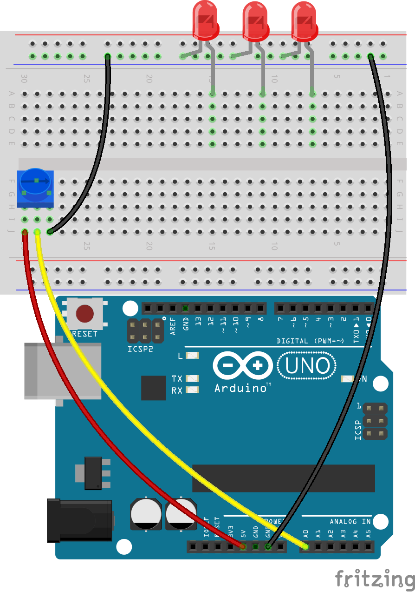
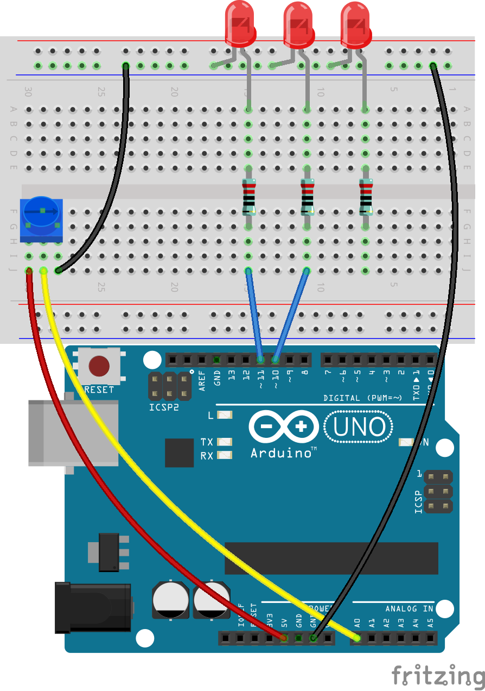

.. note::

    こんにちは、SunFounder Raspberry Pi & Arduino & ESP32 Enthusiasts Community on Facebookへようこそ！このコミュニティで、Raspberry Pi、Arduino、ESP32に関する知識を深めましょう。

    **なぜ参加するのか？**

    - **専門サポート**：購入後の問題や技術的な課題をコミュニティやチームの助けを借りて解決しましょう。
    - **学びと共有**：スキルを向上させるためのヒントやチュートリアルを交換しましょう。
    - **独占プレビュー**：新製品の発表や予告をいち早く入手できます。
    - **特別割引**：最新製品の限定割引をお楽しみください。
    - **フェスティブプロモーションとギブアウェイ**：ギブアウェイやホリデープロモーションに参加しましょう。

    👉 探索と創作の旅に出る準備ができましたか？[|link_sf_facebook|]をクリックして、今すぐ参加しましょう！

11. ポテンショメータでLEDアレイを制御する
==============================================

このレッスンへようこそ。ここでは、条件文を使ってLEDアレイを動的に制御する方法を学びます。シンプルなLED回路の知識を基に、このレッスンでは複雑な条件ロジックを導入し、ポテンショメータからの入力レベルに応じてLEDが反応するようにします。このコースは、条件文を初めて学ぶ初心者から、if-else if-else構造を深く理解したい経験者まで、幅広い学習者に最適です。

このレッスンの終わりには、LEDを順番に点灯させるプログラムの作成方法だけでなく、これらの点灯パターンを使用して異なる入力しきい値を視覚的に表現する方法も理解できるようになります。

.. raw:: html

    <video controls style = "max-width:90%">
        <source src="_static/video/11_control_leds.mp4" type="video/mp4">
        Your browser does not support the video tag.
    </video>

回路を作る
------------------------------------

**必要なコンポーネント**

.. list-table:: 
   :widths: 25 25 25 25
   :header-rows: 0

   * - 1 * Arduino Uno R3
     - 3 * 赤色LED
     - 3 * 220Ω抵抗
     - 1 * ポテンショメータ
   * - |list_uno_r3| 
     - |list_red_led| 
     - |list_220ohm| 
     - |list_potentiometer| 
   * - 1 * USBケーブル
     - 1 * ブレッドボード
     - ジャンパーワイヤー
     - 1 * マルチメータ
   * - |list_usb_cable| 
     - |list_breadboard| 
     - |list_wire| 
     - |list_meter|
     

**構築ステップ**

配線図に従うか、以下のステップに従って回路を構築してください。

.. image:: img/11_conditional_led_control_p9.png
    :width: 500
    :align: center

1. ポテンショメータをブレッドボードに接続します。ポテンショメータの3つのピンを30G、29F、28Gの穴に挿入します。

.. note::
    ポテンショメータには「P 103」というラベルがあり、抵抗範囲を示しています。ラベルが見えるようにポテンショメータをブレッドボードに挿入してください。

.. image:: img/11_dimmer_test_pot.png
    :width: 500
    :align: center

2. 28Jの穴にジャンパーワイヤーを挿入し、それをブレッドボードの負極端子に接続します。

.. image:: img/11_conditional_led_control_pot_gnd.png
    :width: 500
    :align: center

3. 次に、29JとArduino Uno R3のA0ピンの間にジャンパーワイヤーを挿入します。

.. image:: img/11_conditional_led_control_a0.png
    :width: 500
    :align: center

4. 最後に、ブレッドボードの30JとArduino Uno R3の5Vピンの間にジャンパーワイヤーを挿入してポテンショメータを5Vに接続します。

.. image:: img/11_conditional_led_control_5v.png
    :width: 500
    :align: center

5. Arduino Uno R3のGNDピンを長いジャンパーワイヤーでブレッドボードの負極端子に接続します。

.. image:: img/11_conditional_led_control_gnd.png
    :width: 500
    :align: center

6. 3つの任意の色のLEDを取り出し、そのアノード（長いピン）をそれぞれ15A、11A、7Aの穴に、カソード（短いピン）をブレッドボードの負極端子に挿入します。

7. 220Ω抵抗を15Eと15Gの穴の間に挿入します。

.. image:: img/11_conditional_led_control_1resistor.png
    :width: 500
    :align: center

8. 同様に、220Ω抵抗を11Eと11Gの間、7Eと7Gの間に挿入します。

9. ブレッドボードの15Jの穴をArduino Uno R3のピン11にワイヤーで接続します。

.. image:: img/11_conditional_led_control_p11.png
    :width: 500
    :align: center

10. ブレッドボードの11Jの穴をArduino Uno R3のピン10にワイヤーで接続します。

11. ブレッドボードの7Jの穴をArduino Uno R3のピン9にワイヤーで接続します。これで回路が完成しました。

.. image:: img/11_conditional_led_control_p9.png
    :width: 500
    :align: center

**コード作成**
-----------------------

**擬似コードの作成**

1. 擬似コードはプログラムの概要を示すスケッチであり、理解を簡単にするために平易な言葉で書かれます。あなたの課題は、ポテンショメータに反応するLEDアレイの擬似コードを作成することです。ポテンショメータの値が増えるにつれて、より多くのLEDが点灯します。擬似コードに入る前に、次の質問に答えてください：

.. code-block::

    - Arduinoはポテンショメータの値をどのように読み取りますか？
    - 各LEDを個別に制御するにはどうすればよいですか？
    - ポテンショメータの値をいくつの範囲に分割すべきですか？
    - これらの範囲で各LEDは何を表示すべきですか？

2. 擬似コードを手帳の空欄に記入してください。

**ポテンショメータの値を表示**

3. 擬似コードを実際のスケッチに変えるために、Arduino IDEを開き、[ファイル]メニューから「新しいスケッチ」を選択して新しいプロジェクトを開始します。
4. スケッチを ``Lesson11_LED_Array`` として保存し、 ``Ctrl + S`` を押すか、「保存」をクリックします。

5. 前のレッスンと同様に、ポテンショメータの値を保存する変数を ``void setup()`` の前に作成し、コードがその機能を示すようにコメントを付けます。

.. code-block:: Arduino
    :emphasize-lines: 1

    int potValue = 0;            // ポテンショメータから読み取った値を保存する変数

    void setup() {
        // 一度だけ実行されるコード：

    }

6. LEDは出力デバイスであるため、デジタルピン9、10、11をOUTPUTとして設定する必要があります。コメントを忘れずに含めてください。

.. code-block:: Arduino
    :emphasize-lines: 5,6,7

    int potValue = 0;            // ポテンショメータから読み取った値を保存する変数

    void setup() {
        // Code to run once:
        pinMode(9, OUTPUT);  // Configure pin 9 as output
        pinMode(10, OUTPUT); // Configure pin 10 as output
        pinMode(11, OUTPUT); // Configure pin 11 as output
    }

7. シリアル通信を開始するために、ボーレートを9600に設定します。

.. code-block:: Arduino
    :emphasize-lines: 8

    int potValue = 0;            // ポテンショメータから読み取った値を保存する変数

    void setup() {
        // Code to run once:
        pinMode(9, OUTPUT);  // Configure pin 9 as output
        pinMode(10, OUTPUT); // Configure pin 10 as output
        pinMode(11, OUTPUT); // Configure pin 11 as output
        Serial.begin(9600);  // Start serial communication at 9600 baud
    }

8. ``void loop()`` の中で、ポテンショメータの値を読み取り、その値を ``potValue`` 変数に保存し、シリアルモニタに表示します。

.. code-block:: Arduino
    :emphasize-lines: 12-15

    int potValue = 0;            // ポテンショメータから読み取った値を保存する変数

    void setup() {
        pinMode(9, OUTPUT);  // Configure pin 9 as output
        pinMode(10, OUTPUT); // Configure pin 10 as output
        pinMode(11, OUTPUT); // Configure pin 11 as output
        Serial.begin(9600);  // Start serial communication at 9600 baud
    }

    void loop() {
        // Main code to run repeatedly:
        potValue = analogRead(A0);     // Read value from potentiometer
        Serial.print("Pot Value: ");  // Display the reading
        Serial.println(potValue);      // Print the potentiometer value
        delay(100);
    }

9. コードを確認し、必要に応じてコンパイルします。

10. コードがArduino Uno R3にアップロードされると、ポテンショメータを回すと、シリアルモニタに表示される値が0から1023の間で変化することに気付くでしょう。この範囲は理想的ですが、製造のばらつきにより、ポテンショメータが50から1000の範囲を示す場合があります。この範囲を参考に覚えておいてください。

**ポテンショメータの値でLEDを制御**

ポテンショメータの値に基づいて各LEDを順番に点灯させるには、複数の条件が必要です。異なるポテンショメータ値の範囲に対して ``if`` を使用してアクションを指定します：
  
  - 200未満：すべてのLEDを消灯。
  - 200から600の間：最初のLEDを点灯。
  - 600から1000の間：2つのLEDを点灯。
  - 1000以上：すべてのLEDを点灯。

ただし、これらの条件を個別に管理するのは非効率的です。Arduinoは各ループサイクルでそれぞれをチェックする必要があります。

これを効率化するために、 ``if-else if`` 構造を使用します：

.. code-block:: Arduino

    if (condition 1) {
        // 条件1が真の場合に実行される
    }
    else if (condition 2) {
        // 条件2が真の場合に実行される
    }
    else if (condition 3) {
        // 条件3が真の場合に実行される
    }
    else {
        // どの条件も真でない場合に実行される
    }

.. image:: img/if_else_if.png
    :width: 500
    :align: center

``if-else if`` 構造では、最初の条件がテストされます。もしその条件が真であれば、関連するコマンドが実行され、他のすべての条件はスキップされます（それらのいくつかが真であっても）。最初の条件が偽の場合、構造内の2番目の条件をテストします。2番目の条件が真であれば、その条件に関連するコマンドが実行され、他の条件はスキップされます。偽であれば、3番目の条件をテストし、以下同様です。いくつかのシナリオでは、複数の条件が真である場合があります。したがって、条件の順序は重要です。最初に真と判定された条件のみがその関連コマンドを実行します。

11. まず、ポテンショメータの値が200未満の場合、すべてのLEDを消灯します。if文を追加し、digitalWrite()関数を使用してピン9、10、11をLOWに設定してLEDを消灯します。

.. code-block:: Arduino
    :emphasize-lines: 7-11 
    
    void loop() {
        // put your main code here, to run repeatedly:
        potValue = analogRead(A0);    // Read value from potentiometer
        Serial.print("Pot Value: ");  // Prompt for the read value
        Serial.println(potValue);     // Print the potentiometer value
        delay(100);
        if (potValue < 200) {     // If potValue less than 200
            digitalWrite(9, LOW);   // Switch off the LED on pin 9
            digitalWrite(10, LOW);  // Switch off the LED on pin 10
            digitalWrite(11, LOW);  // Switch off the LED on pin 11
        }
    }

12. ポテンショメータのアナログ値が600未満の場合に最初のLEDを点灯する ``else if`` 文を追加します。

.. code-block:: Arduino
    :emphasize-lines: 5-9 
    
    if (potValue < 200) {         // If potValue less than 200
        digitalWrite(9, LOW);       // Switch off the LED on pin 9
        digitalWrite(10, LOW);      // Switch off the LED on pin 10
        digitalWrite(11, LOW);      // Switch off the LED on pin 11
    } else if (potValue < 600) {  // If potValue less than 600
        digitalWrite(9, HIGH);      // Light up the LED on pin 9
        digitalWrite(10, LOW);      // Switch off the LED on pin 10
        digitalWrite(11, LOW);      // Switch off the LED on pin 11
    }

13. ポテンショメータの値が1000未満の場合に2つのLEDを点灯する「else if」条件を追加します。

.. code-block:: Arduino
    :emphasize-lines: 10-14 
    
    if (potValue < 200) {         // If potValue less than 200
        digitalWrite(9, LOW);       // Switch off the LED on pin 9
        digitalWrite(10, LOW);      // Switch off the LED on pin 10
        digitalWrite(11, LOW);      // Switch off the LED on pin 11
    } else if (potValue < 600) {  // If potValue less than 600
        digitalWrite(9, HIGH);      // Light up the LED on pin 9
        digitalWrite(10, LOW);      // Switch off the LED on pin 10
        digitalWrite(11, LOW);      // Switch off the LED on pin 11
    }
    else if (potValue < 1000) {  // If potValue less than 1000
        digitalWrite(9, HIGH);     // Light up the LED on pin 9
        digitalWrite(10, HIGH);    // Light up the LED on pin 10
        digitalWrite(11, LOW);     // Switch off the LED on pin 11
    }    

14. 最後に、 ``else`` ブロック内のコマンドを修正して、 ``digitalWrite()`` を使用して3つのLEDすべてを点灯します。このブロックには、他の条件がすべて偽である場合に実行されるコマンドが含まれています。言い換えれば、ポテンショメータの ``potValue`` が1000以上の場合、 ``else {}`` 内のコマンドが実行されます。 ``else`` ブロックは次のようになります。

.. code-block:: Arduino
    :emphasize-lines: 6-8 

    else if (potValue < 1000) {  // If potValue less than 1000
        digitalWrite(9, HIGH);     // Light up the LED on pin 9
        digitalWrite(10, HIGH);    // Light up the LED on pin 10
        digitalWrite(11, LOW);     // Switch off the LED on pin 11
    } else {
        digitalWrite(9, HIGH);   // Light up the LED on pin 9
        digitalWrite(10, HIGH);  // Light up the LED on pin 10
        digitalWrite(11, HIGH);  // Light up the LED on pin 11
    }

15. 完成したコードは次のとおりです。「アップロード」をクリックして、コードをArduino Uno R3に送信します。

.. code-block:: Arduino

    int potValue = 0;  // ポテンショメータの値を格納する変数

    void setup() {
        pinMode(9, OUTPUT);   // Configure pin 9 as output
        pinMode(10, OUTPUT);  // Configure pin 10 as output
        pinMode(11, OUTPUT);  // Configure pin 11 as output
        Serial.begin(9600);   // Start serial communication at 9600 baud
    }

    void loop() {
        // put your main code here, to run repeatedly:
        potValue = analogRead(A0);    // Read value from potentiometer
        Serial.print("Pot Value: ");  // Prompt for the read value
        Serial.println(potValue);     // Print the potentiometer value
        delay(100);
        if (potValue < 200) {          // If potValue less than 200
            digitalWrite(9, LOW);        // Switch off the LED on pin 9
            digitalWrite(10, LOW);       // Switch off the LED on pin 10
            digitalWrite(11, LOW);       // Switch off the LED on pin 11
        } else if (potValue < 600) {   // If potValue less than 600
            digitalWrite(9, HIGH);       // Light up the LED on pin 9
            digitalWrite(10, LOW);       // Switch off the LED on pin 10
            digitalWrite(11, LOW);       // Switch off the LED on pin 11
        } else if (potValue < 1000) {  // If potValue less than 1000
            digitalWrite(9, HIGH);       // Light up the LED on pin 9
            digitalWrite(10, HIGH);      // Light up the LED on pin 10
            digitalWrite(11, LOW);       // Switch off the LED on pin 11
        } else {
            digitalWrite(9, HIGH);   // Light up the LED on pin 9
            digitalWrite(10, HIGH);  // Light up the LED on pin 10
            digitalWrite(11, HIGH);  // Light up the LED on pin 11
        }
    }

16. ポテンショメータを回して、LEDアレイが期待通りに動作するかどうかを確認します。

   - ポテンショメータの値が200未満の場合、すべてのLEDが消灯するべきです。
   - 値が200から600の間の場合、最初のLEDが点灯するべきです。
   - 値が600から1000の間の場合、最初の2つのLEDが点灯するべきです。
   - 値が1000を超える場合、すべてのLEDが点灯するべきです。

**質問**

コード内で、ポテンショメータの値に基づいて点灯するLEDの数を決定しています。LEDを点灯させながら、その明るさがポテンショメータに応じて変わるようにコードを修正するにはどうすればよいですか？

**まとめ**

この包括的なレッスンでは、ポテンショメータに応じて反応するインタラクティブなLEDディスプレイを作成する方法を学びました。回路の構築から始め、デジタルピンで制御される複数のLEDを組み込み、その読み取り値に基づいて状態を調整するポテンショメータと連携するシステムを組み立てました。段階的な手順を通じて、特定のポテンショメータのしきい値に基づいて異なる照明シナリオを管理するためにArduinoをプログラムする方法を成功裏に習得し、ハードウェアとソフトウェアの相互作用についての理解を深めました。

このコースでは、効率的な条件構造を書くスキルを身につけ、センサー入力の正確な変化に対応するプロジェクトを作成する能力を養いました。さまざまな条件を試すことで、コードの順序と構造が出力とプロジェクトの効率にどのように影響するかを直接確認しました。
