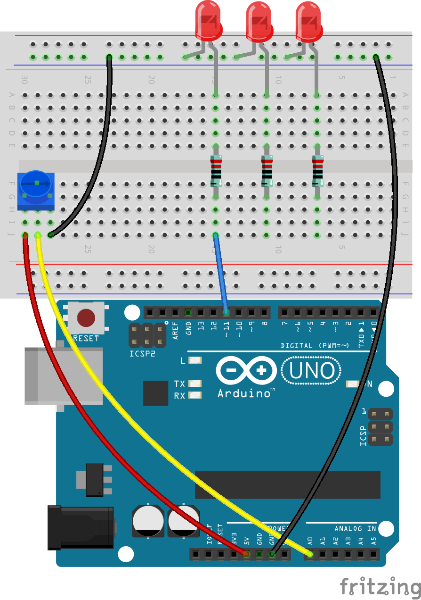

11. Controlling LED Arrays with Potentiometer
===================================================

Welcome to this lesson, where we explore how to master conditional statements to control LED arrays dynamically. Building on our prior knowledge of simple LED circuits, this lesson introduces you to complex conditional logic, allowing LEDs to respond to varying levels of input from a potentiometer. This course is ideal for both beginners who are new to programming conditional statements and for experienced coders who wish to deepen their understanding of if-else if-else structures.

By the end of this lesson, you will not only know how to program LEDs to turn on in sequence but also understand how to use these lighting patterns to visually represent different input thresholds.

Build the circuit
------------------------------------

**Components Needed**

.. list-table:: 
   :widths: 25 25 25 25
   :header-rows: 0

   * - 1 * R3 Board
     - 3 * Red LEDs
     - 3 * 220Ω Resistor
     - 1 * Potentiometer
   * - |compoents_uno_r3| 
     - |compoents_red_led| 
     - |compoents_220ohm| 
     - |compoents_potentiometer| 
   * - 1 * USB Cable
     - 1 * Breadboard
     - Jumper Wires
     - 1 * Multimeter
   * - |compoents_usb_cable| 
     - |compoents_breadboard| 
     - |compoents_wire| 
     - |compoents_meter|
     

**Building Steps**

Follow the wiring diagram, or the steps below to build your circuit.

.. image:: img/11_conditional_led_cont rol_p9.png
    :width: 500
    :align: center

1. Connect a potentiometer to the breadboard. Insert its three pins into holes 30G, 29F, 29G.

.. note::
    The potentiometer has a label "P 103", indicating its resistance range. Please insert the potentiometer into the breadboard as shown, with the labeled side facing you.

.. image:: img/5_dimmer_test_pot.png
    :width: 500
    :align: center

2. Insert a jumper wire into hole 28J and connect it to the negative terminal of the breadboard.

.. image:: img/11_conditional_led_control_pot_gnd.png
    :width: 500
    :align: center

3. Then, insert a jumper wire between hole 29J and the A0 pin of the R3 board.

.. image:: img/11_conditional_led_control_a0.png
    :width: 500
    :align: center

4. Finally, connect the potentiometer to 5V by inserting a jumper wire between hole 30J on the breadboard and the 5V pin on the R3 board.

.. image:: img/11_conditional_led_control_5v.png
    :width: 500
    :align: center

5. Connect the GND pin of the R3 board to the negative terminal of the breadboard using a long jumper wire.

.. image:: img/11_conditional_led_control_gnd.png
    :width: 500
    :align: center

3. Take out three LEDs of any color. Insert their anodes (longer pins) into holes 15A, 11A, and 7A respectively, and their cathodes (shorter pins) into the negative terminal of the breadboard.

.. image:: img/11_conditional_led_control_3led.png
    :width: 500
    :align: center

4. Place a 220 ohms resistor between holes 15E and 15G.

.. image:: img/11_conditional_led_control_1resistor.png
    :width: 500
    :align: center

5. Similarly, insert a 220 ohms resistor between 11E and 11G, and another between 7E and 7G.

.. image:: img/11_conditional_led_control_2resistor.png
    :width: 500
    :align: center

6. Connect the hole 15J on the breadboard to pin 11 on the R3 board with a wire.

7. Connect the hole 11J on the breadboard to pin 10 on the R3 board with a wire.

.. image:: img/11_conditional_led_control_p10.png
    :width: 500
    :align: center

8. Connect the hole 7J on the breadboard to pin 9 on the R3 board with a wire. Your circuit is now complete.

.. image:: img/11_conditional_led_control_p9.png
    :width: 500
    :align: center
    
Code Creation
-----------------------

**Writing Pseudocode**

1. Pseudocode serves as a program sketch, written in plain language to simplify understanding. Your task is to create pseudocode for an LED array that reacts to a potentiometer. As the potentiometer's value increases, more LEDs will light up. Before diving into pseudocode, answer these questions:

.. code-block::

    - How does the Arduino read the potentiometer's value?
    - How can each LED be controlled individually?
    - how many ranges should the potentiometer's values be divided?
    - What should each LED display across these ranges?

2. Write your pseudocode for the LED array in the blank section provided in your handbook.

**Printing Potentiometer Values**

3. To turn your pseudocode into a working sketch, open the Arduino IDE, go to the “File” menu, and select “New Sketch” to begin a new project. Ensure no other sketch windows are open.
4. Save your new sketch by selecting “Save” from the “File” menu or pressing ``Ctrl + S``. Store it in the default Arduino Sketchbook location under the name ``Lesson11_LED_Array`` and click "Save".

5. Similar to previous lessons, create a variable before the ``void setup()`` to store the potentiometer value, and remember to annotate your code to match its functionality.

.. code-block:: Arduino
    :emphasize-lines: 1

    int potValue = 0;            // Variable to store the value read from the potentiometer

    void setup() {
        // Code to run once:

    }

6. Since LEDs are output devices, you'll need to configure digital pins 9, 10, and 11 as OUTPUTs. Remember to include comments.

.. code-block:: Arduino
    :emphasize-lines: 5,6,7

    int potValue = 0;            // Variable to store the value read from the potentiometer

    void setup() {
        // Code to run once:
        pinMode(9, OUTPUT);  // Configure pin 9 as output
        pinMode(10, OUTPUT); // Configure pin 10 as output
        pinMode(11, OUTPUT); // Configure pin 11 as output
    }

7. Start serial communication by setting the baud rate to 9600.

.. code-block:: Arduino
    :emphasize-lines: 8

    int potValue = 0;            // Variable to store the value read from the potentiometer

    void setup() {
        // Code to run once:
        pinMode(9, OUTPUT);  // Configure pin 9 as output
        pinMode(10, OUTPUT); // Configure pin 10 as output
        pinMode(11, OUTPUT); // Configure pin 11 as output
        Serial.begin(9600);  // Start serial communication at 9600 baud
    }

8. Within the ``void loop()``, after reading the potentiometer value, store it in the variable ``potValue`` and print it to the serial monitor.

.. code-block:: Arduino
    :emphasize-lines: 12-15

    int potValue = 0;            // Variable to store the value read from the potentiometer

    void setup() {
        pinMode(9, OUTPUT);  // Configure pin 9 as output
        pinMode(10, OUTPUT); // Configure pin 10 as output
        pinMode(11, OUTPUT); // Configure pin 11 as output
        Serial.begin(9600);  // Start serial communication at 9600 baud
    }

    void loop() {
        // Main code to run repeatedly:
        potValue = analogRead(A0);     // Read value from potentiometer
        Serial.print("Pot Value: ");  // Display the reading
        Serial.println(potValue);      // Print the potentiometer value
        delay(100);
    }

9. Validate and compile your code if necessary.

10. Once the code is uploaded to the R3 board, you'll notice that rotating the potentiometer causes the value displayed in the serial monitor to vary between 0 and 1023. This range is ideal, though due to manufacturing variances, your potentiometer might show a range from 50 to 1000. Just remember this range for reference.

**Control LEDs with Potentiometer Values**

To sequentially light up each LED based on the value of the potentiometer, you will need multiple conditions. You can use ``if`` to specify actions for different ranges of potentiometer values:
  
  - Below 200: Turn off all LEDs.
  - Between 200 and 600: Light up the first LED.
  - Between 600 and 1000: Light up two LEDs.
  - Above 1000: Light up all LEDs.

However, managing these conditions separately can be inefficient, as Arduino needs to check each one in every loop cycle. 

To streamline this, utilize the ``if-else if`` structure:

.. code-block:: Arduino

    if (condition 1) {
        // Execute if condition 1 is true
    }
    else if (condition 2) {
        // Execute if condition 2 is true
    }
    else if (condition 3) {
        // Execute if condition 3 is true
    }
    else {
        // Execute if none of the conditions are true
    }

In an ``if-else if`` structure, the first condition is tested. If it's true, the associated commands are executed, and all other conditions are skipped (even if some of them are true). If the first condition is false, it tests the second condition in the structure. If the second condition is true, it executes the commands associated with this condition and then skips the others. If it is false, it tests the third condition, and so on. In some scenarios, there can be multiple true conditions. Therefore, the order of conditions is important. Only the first true condition will have its associated commands run.

11. First, turn off all three LEDs if the value of the potentiometer is less than 200. Add an if statement and then use the digitalWrite() function to set pins 9, 10, and 11 to LOW to turn off the LEDs.

.. code-block:: Arduino
    :emphasize-lines: 7-11 
    
    void loop() {
        // put your main code here, to run repeatedly:
        potValue = analogRead(A0);    // Read value from potentiometer
        Serial.print("Pot Value: ");  // Prompt for the read value
        Serial.println(potValue);     // Print the potentiometer value
        delay(100);
        if (potValue < 200) {     // If potValue less than 200
            digitalWrite(9, LOW);   // Switch off the LED on pin 9
            digitalWrite(10, LOW);  // Switch off the LED on pin 10
            digitalWrite(11, LOW);  // Switch off the LED on pin 11
        }
    }

 
12. Add an ``else if`` statement to light up the first LED when the potentiometer's analog value is below 600.

.. code-block:: Arduino
    :emphasize-lines: 5-9 
    
    if (potValue < 200) {         // If potValue less than 200
        digitalWrite(9, LOW);       // Switch off the LED on pin 9
        digitalWrite(10, LOW);      // Switch off the LED on pin 10
        digitalWrite(11, LOW);      // Switch off the LED on pin 11
    } else if (potValue < 600) {  // If potValue less than 600
        digitalWrite(9, HIGH);      // Light up the LED on pin 9
        digitalWrite(10, LOW);      // Switch off the LED on pin 10
        digitalWrite(11, LOW);      // Switch off the LED on pin 11
    }

13. To light up two LEDs when the value is below 1000, insert another ``else if`` condition like this:

.. code-block:: Arduino
    :emphasize-lines: 10-14 
    
    if (potValue < 200) {         // If potValue less than 200
        digitalWrite(9, LOW);       // Switch off the LED on pin 9
        digitalWrite(10, LOW);      // Switch off the LED on pin 10
        digitalWrite(11, LOW);      // Switch off the LED on pin 11
    } else if (potValue < 600) {  // If potValue less than 600
        digitalWrite(9, HIGH);      // Light up the LED on pin 9
        digitalWrite(10, LOW);      // Switch off the LED on pin 10
        digitalWrite(11, LOW);      // Switch off the LED on pin 11
    }
    else if (potValue < 1000) {  // If potValue less than 1000
        digitalWrite(9, HIGH);     // Light up the LED on pin 9
        digitalWrite(10, HIGH);    // Light up the LED on pin 10
        digitalWrite(11, LOW);     // Switch off the LED on pin 11
    }    

14. Finally, modify the commands inside the ``else`` block to light up all three LEDs using ``digitalWrite()``. This block contains commands that run when none of the other conditions are true. In other words, if the ``potValue`` from the potentiometer is greater than or equal to 1000, the commands within ``else {}`` will execute. Your ``else`` block should look like this:

.. code-block:: Arduino
    :emphasize-lines: 6-8 

    else if (potValue < 1000) {  // If potValue less than 1000
        digitalWrite(9, HIGH);     // Light up the LED on pin 9
        digitalWrite(10, HIGH);    // Light up the LED on pin 10
        digitalWrite(11, LOW);     // Switch off the LED on pin 11
    } else {
        digitalWrite(9, HIGH);   // Light up the LED on pin 9
        digitalWrite(10, HIGH);  // Light up the LED on pin 10
        digitalWrite(11, HIGH);  // Light up the LED on pin 11
    }

15. Your complete code is as follows. Click "Upload" to send the code to your R3 board.

16. Rotate the potentiometer to see if the LED array functions as expected:

   - If the potentiometer's value is below 200, all LEDs should be off.
   - If the value is between 200 and 600, the first LED should be on.
   - If the value is between 600 and 1000, the first two LEDs should be on.
   - If the value exceeds 1000, all LEDs should be on.

**Summary**

In this comprehensive lesson, you've learned to create an interactive LED display that responds to a potentiometer. Starting with circuit building, you've assembled a system that incorporates multiple LEDs controlled via digital pins, linked to a potentiometer that adjusts their states based on its readings. Through step-by-step instructions, you've successfully programmed your Arduino to manage different lighting scenarios based on specific potentiometer thresholds, enhancing your understanding of both hardware and software interactions.

This course has equipped you with the skills to write efficient conditional structures, enabling your projects to react to precise changes in sensor inputs. By experimenting with different conditions, you've seen firsthand how the order and structure of your code affect the output and efficiency of your electronic projects.

**Question:**

In the last code, we determine the number of LEDs to light up based on the value of the potentiometer. How can we modify the code so that, while lighting up the LEDs, their brightness changes in accordance with the potentiometer?