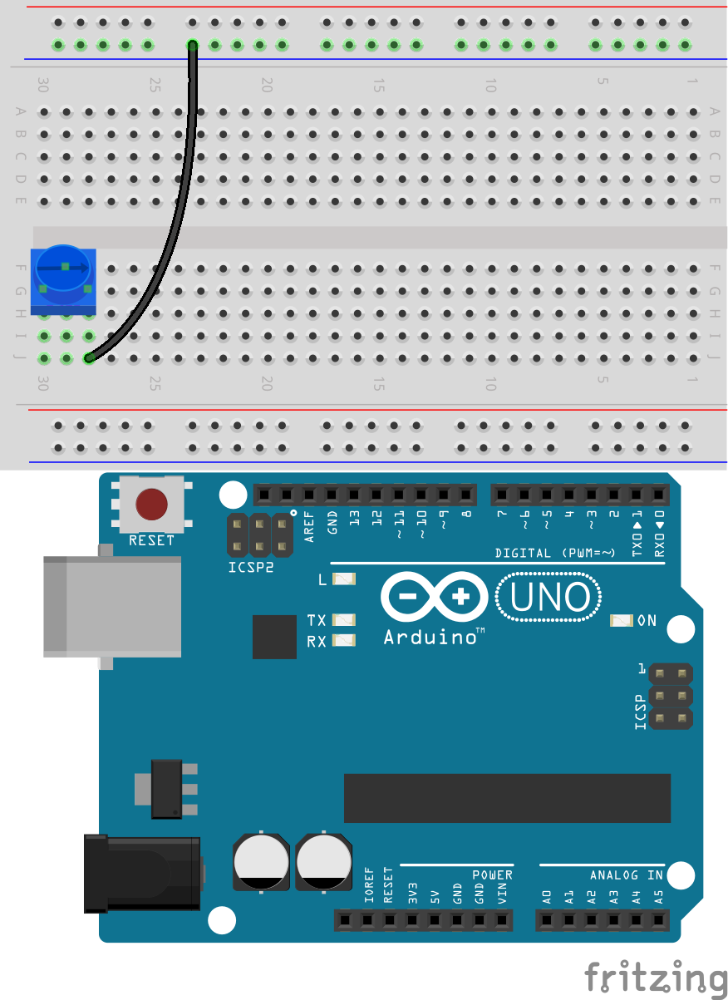
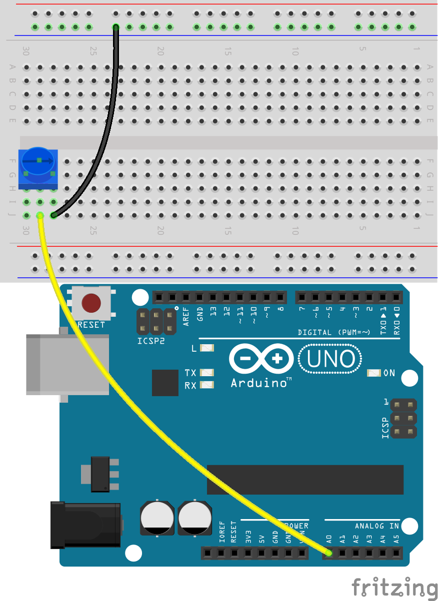

.. note::

    Hallo, willkommen in der SunFounder Raspberry Pi & Arduino & ESP32 Enthusiasten-Community auf Facebook! Tauche tiefer in die Welt von Raspberry Pi, Arduino und ESP32 mit gleichgesinnten Enthusiasten ein.

    **Warum beitreten?**

    - **Experten-Support**: Löse Probleme nach dem Kauf und technische Herausforderungen mit Hilfe unserer Community und unseres Teams.
    - **Lernen & Teilen**: Tausche Tipps und Tutorials aus, um deine Fähigkeiten zu verbessern.
    - **Exklusive Vorschauen**: Erhalte frühzeitigen Zugriff auf neue Produktankündigungen und Einblicke.
    - **Spezielle Rabatte**: Profitiere von exklusiven Rabatten auf unsere neuesten Produkte.
    - **Festliche Aktionen und Verlosungen**: Nimm an Gewinnspielen und Feiertagsaktionen teil.

    👉 Bereit, mit uns zu forschen und zu erschaffen? Klicke auf [|link_sf_facebook|] und trete noch heute bei!

11. Steuerung von LED-Arrays mit Potentiometer
===================================================

Willkommen zu dieser Lektion, in der wir lernen, bedingte Anweisungen zu meistern, um LED-Arrays dynamisch zu steuern. Aufbauend auf unserem vorherigen Wissen über einfache LED-Schaltungen führt diese Lektion in komplexere bedingte Logik ein, die es ermöglicht, dass LEDs auf verschiedene Eingaben eines Potentiometers reagieren. Dieser Kurs eignet sich sowohl für Anfänger, die neu in der Programmierung von bedingten Anweisungen sind, als auch für erfahrene Programmierer, die ihr Verständnis für if-else if-else-Strukturen vertiefen möchten.

Am Ende dieser Lektion wirst du nicht nur wissen, wie man LEDs nacheinander programmiert, sondern auch verstehen, wie man diese Lichtmuster verwendet, um unterschiedliche Eingabeschwellen visuell darzustellen.

.. raw:: html

    <video controls style = "max-width:90%">
        <source src="_static/video/11_control_leds.mp4" type="video/mp4">
        Your browser does not support the video tag.
    </video>

Bau der Schaltung
------------------------------------

**Benötigte Komponenten**

.. list-table:: 
   :widths: 25 25 25 25
   :header-rows: 0

   * - 1 * Arduino Uno R3
     - 3 * Rote LEDs
     - 3 * 220Ω Widerstände
     - 1 * Potentiometer
   * - |list_uno_r3| 
     - |list_red_led| 
     - |list_220ohm| 
     - |list_potentiometer| 
   * - 1 * USB-Kabel
     - 1 * Steckbrett
     - Jumper-Kabel
     - 1 * Multimeter
   * - |list_usb_cable| 
     - |list_breadboard| 
     - |list_wire| 
     - |list_meter|
     

**Bau der Schaltung**

Folge dem Verdrahtungsdiagramm oder den folgenden Schritten, um deine Schaltung zu bauen.

.. image:: img/11_conditional_led_cont rol_p9.png
    :width: 500
    :align: center

1. Schließe ein Potentiometer an das Steckbrett an. Setze seine drei Pins in die Löcher 30G, 29F, 28G.

.. note::
    Das Potentiometer ist mit "P 103" beschriftet, was auf seinen Widerstandsbereich hinweist. Setze das Potentiometer so in das Steckbrett ein, dass die beschriftete Seite zu dir zeigt.

.. image:: img/11_dimmer_test_pot.png
    :width: 500
    :align: center

2. Setze ein Jumper-Kabel in das Loch 28J und verbinde es mit dem negativen Anschluss des Steckbretts.

3. Setze dann ein Jumper-Kabel zwischen Loch 29J und den A0-Pin des Arduino Uno R3.

4. Verbinde schließlich das Potentiometer mit 5V, indem du ein Jumper-Kabel zwischen Loch 30J am Steckbrett und den 5V-Pin des Arduino Uno R3 einsetzt.

.. image:: img/11_conditional_led_control_5v.png
    :width: 500
    :align: center

5. Verbinde den GND-Pin des Arduino Uno R3 mit dem negativen Anschluss des Steckbretts, indem du ein langes Jumper-Kabel verwendest.

.. image:: img/11_conditional_led_control_gnd.png
    :width: 500
    :align: center

6. Nimm drei LEDs beliebiger Farbe heraus. Setze ihre Anoden (längere Pins) in die Löcher 15A, 11A und 7A und ihre Kathoden (kürzere Pins) in den negativen Anschluss des Steckbretts.

.. image:: img/11_conditional_led_control_3led.png
    :width: 500
    :align: center

7. Setze einen 220 Ohm Widerstand zwischen die Löcher 15E und 15G.

.. image:: img/11_conditional_led_control_1resistor.png
    :width: 500
    :align: center

8. Setze ebenfalls einen 220 Ohm Widerstand zwischen 11E und 11G sowie einen weiteren zwischen 7E und 7G.

.. image:: img/11_conditional_led_control_2resistor.png
    :width: 500
    :align: center

9. Verbinde das Loch 15J am Steckbrett mit Pin 11 des Arduino Uno R3 mit einem Kabel.

.. image:: img/11_conditional_led_control_p11.png
    :width: 500
    :align: center

10. Verbinde das Loch 11J am Steckbrett mit Pin 10 des Arduino Uno R3 mit einem Kabel.

.. image:: img/11_conditional_led_control_p10.png
    :width: 500
    :align: center

11. Verbinde das Loch 7J am Steckbrett mit Pin 9 des Arduino Uno R3 mit einem Kabel. Deine Schaltung ist jetzt fertiggestellt.

.. image:: img/11_conditional_led_control_p9.png
    :width: 500
    :align: center

Codeerstellung
-----------------------

**Pseudocode schreiben**

1. Pseudocode dient als Programmskizze, die in einfacher Sprache verfasst ist, um das Verständnis zu erleichtern. Deine Aufgabe ist es, einen Pseudocode für ein LED-Array zu erstellen, das auf ein Potentiometer reagiert. Wenn der Wert des Potentiometers steigt, sollen mehr LEDs leuchten. Bevor du mit dem Pseudocode beginnst, beantworte diese Fragen:

.. code-block::

    - Wie liest der Arduino den Wert des Potentiometers aus?
    - Wie kann jede LED einzeln gesteuert werden?
    - In wie viele Bereiche sollte der Wert des Potentiometers unterteilt werden?
    - Was sollte jede LED in diesen Bereichen anzeigen?

2. Schreibe deinen Pseudocode für das LED-Array in den vorgesehenen Abschnitt deines Handbuchs.

**Potentiometerwerte anzeigen**

3. Um deinen Pseudocode in ein funktionierendes Sketch umzuwandeln, öffne die Arduino IDE und starte ein neues Projekt, indem du im Menü „Datei“ die Option „Neues Sketch“ auswählst.
4. Speichere dein Sketch als ``Lesson11_LED_Array`` mit ``Ctrl + S`` oder durch Klicken auf „Speichern“.

5. Ähnlich wie in den vorherigen Lektionen erstellst du eine Variable vor dem ``void setup()``, um den Potentiometerwert zu speichern. Denke daran, deinen Code passend zu kommentieren.

.. code-block:: Arduino
    :emphasize-lines: 1

    int potValue = 0;            // Variable zur Speicherung des Potentiometerwerts

    void setup() {
        // Code, der einmal ausgeführt wird:
    }

6. Da LEDs Ausgabegeräte sind, musst du die digitalen Pins 9, 10 und 11 als OUTPUT konfigurieren. Vergiss nicht, Kommentare hinzuzufügen.

.. code-block:: Arduino
    :emphasize-lines: 5,6,7

    int potValue = 0;            // Variable zur Speicherung des Potentiometerwerts

    void setup() {
        // Code, der einmal ausgeführt wird:
        pinMode(9, OUTPUT);  // Konfiguriere Pin 9 als Ausgang
        pinMode(10, OUTPUT); // Konfiguriere Pin 10 als Ausgang
        pinMode(11, OUTPUT); // Konfiguriere Pin 11 als Ausgang
    }

7. Starte die serielle Kommunikation, indem du die Baudrate auf 9600 einstellst.

.. code-block:: Arduino
    :emphasize-lines: 8

    int potValue = 0;            // Variable zur Speicherung des Potentiometerwerts

    void setup() {
        // Code, der einmal ausgeführt wird:
        pinMode(9, OUTPUT);  // Konfiguriere Pin 9 als Ausgang
        pinMode(10, OUTPUT); // Konfiguriere Pin 10 als Ausgang
        pinMode(11, OUTPUT); // Konfiguriere Pin 11 als Ausgang
        Serial.begin(9600);  // Starte serielle Kommunikation mit 9600 Baud
    }

8. Innerhalb der ``void loop()``, nachdem du den Potentiometerwert gelesen hast, speichere ihn in der Variable ``potValue`` und gib ihn auf dem seriellen Monitor aus.

.. code-block:: Arduino
    :emphasize-lines: 12-15

    int potValue = 0;            // Variable zur Speicherung des Potentiometerwerts

    void setup() {
        pinMode(9, OUTPUT);  // Konfiguriere Pin 9 als Ausgang
        pinMode(10, OUTPUT); // Konfiguriere Pin 10 als Ausgang
        pinMode(11, OUTPUT); // Konfiguriere Pin 11 als Ausgang
        Serial.begin(9600);  // Starte serielle Kommunikation mit 9600 Baud
    }

    void loop() {
        // Hauptcode, der wiederholt ausgeführt wird:
        potValue = analogRead(A0);     // Lese den Wert des Potentiometers
        Serial.print("Pot Value: ");  // Zeige den Wert an
        Serial.println(potValue);      // Drucke den Potentiometerwert
        delay(100);
    }

9. Überprüfe und kompiliere deinen Code bei Bedarf.

10. Nachdem der Code auf das Arduino Uno R3 hochgeladen wurde, wirst du feststellen, dass das Drehen des Potentiometers den angezeigten Wert im seriellen Monitor zwischen 0 und 1023 variieren lässt. Dieser Bereich ist ideal, aber aufgrund von Fertigungstoleranzen könnte dein Potentiometer einen Bereich von 50 bis 1000 zeigen. Behalte diesen Bereich zur Referenz im Hinterkopf.

**Steuerung der LEDs mit Potentiometerwerten**

Um jede LED nacheinander basierend auf dem Wert des Potentiometers zu beleuchten, benötigst du mehrere Bedingungen. Du kannst ``if`` verwenden, um Aktionen für verschiedene Bereiche der Potentiometerwerte festzulegen:
  
  - Unter 200: Alle LEDs ausschalten.
  - Zwischen 200 und 600: Die erste LED einschalten.
  - Zwischen 600 und 1000: Zwei LEDs einschalten.
  - Über 1000: Alle LEDs einschalten.

Das Verwalten dieser Bedingungen separat kann jedoch ineffizient sein, da der Arduino jede Bedingung in jedem Schleifendurchlauf überprüfen muss. 

Um dies zu vereinfachen, verwende die ``if-else if``-Struktur:

.. code-block:: Arduino

    if (Bedingung 1) {
        // Ausführen, wenn Bedingung 1 wahr ist
    }
    else if (Bedingung 2) {
        // Ausführen, wenn Bedingung 2 wahr ist
    }
    else if (Bedingung 3) {
        // Ausführen, wenn Bedingung 3 wahr ist
    }
    else {
        // Ausführen, wenn keine der Bedingungen zutrifft
    }

.. image:: img/if_else_if.png
    :width: 500
    :align: center

In einer ``if-else if``-Struktur wird die erste Bedingung überprüft. Ist sie wahr, werden die zugehörigen Befehle ausgeführt, und alle anderen Bedingungen werden übersprungen (auch wenn einige davon wahr sind). Wenn die erste Bedingung falsch ist, wird die zweite Bedingung in der Struktur getestet. Ist die zweite Bedingung wahr, werden die zugehörigen Befehle ausgeführt und die restlichen Bedingungen übersprungen. Ist auch die zweite Bedingung falsch, wird die dritte Bedingung getestet, und so weiter. In manchen Szenarien können mehrere Bedingungen wahr sein. Daher ist die Reihenfolge der Bedingungen wichtig. Nur die erste wahre Bedingung wird ausgeführt.

11. Schalten Sie zuerst alle drei LEDs aus, wenn der Wert des Potentiometers unter 200 liegt. Fügen Sie eine if-Anweisung hinzu und verwenden Sie dann die Funktion digitalWrite(), um die Pins 9, 10 und 11 auf LOW zu setzen, um die LEDs auszuschalten.

.. code-block:: Arduino
    :emphasize-lines: 7-11 
    
    void loop() {
        // Hauptcode, der wiederholt ausgeführt wird:
        potValue = analogRead(A0);    // Lese den Potentiometerwert
        Serial.print("Pot Value: ");  // Ausgabe des gelesenen Werts
        Serial.println(potValue);     // Drucke den Potentiometerwert
        delay(100);
        if (potValue < 200) {     // Wenn potValue kleiner als 200 ist
            digitalWrite(9, LOW);   // Schalte die LED an Pin 9 aus
            digitalWrite(10, LOW);  // Schalte die LED an Pin 10 aus
            digitalWrite(11, LOW);  // Schalte die LED an Pin 11 aus
        }
    }

12. Fügen Sie eine ``else if``-Anweisung hinzu, um die erste LED einzuschalten, wenn der analoge Wert des Potentiometers unter 600 liegt.

.. code-block:: Arduino
    :emphasize-lines: 5-9 
    
    if (potValue < 200) {         // Wenn potValue kleiner als 200 ist
        digitalWrite(9, LOW);       // Schalte die LED an Pin 9 aus
        digitalWrite(10, LOW);      // Schalte die LED an Pin 10 aus
        digitalWrite(11, LOW);      // Schalte die LED an Pin 11 aus
    } else if (potValue < 600) {  // Wenn potValue kleiner als 600 ist
        digitalWrite(9, HIGH);      // Schalte die LED an Pin 9 ein
        digitalWrite(10, LOW);      // Schalte die LED an Pin 10 aus
        digitalWrite(11, LOW);      // Schalte die LED an Pin 11 aus
    }

13. Um zwei LEDs zu beleuchten, wenn der Wert unter 1000 liegt, fügen Sie eine weitere ``else if``-Bedingung wie folgt hinzu:

.. code-block:: Arduino
    :emphasize-lines: 10-14 
    
    if (potValue < 200) {         // Wenn potValue kleiner als 200 ist
        digitalWrite(9, LOW);       // Schalte die LED an Pin 9 aus
        digitalWrite(10, LOW);      // Schalte die LED an Pin 10 aus
        digitalWrite(11, LOW);      // Schalte die LED an Pin 11 aus
    } else if (potValue < 600) {  // Wenn potValue kleiner als 600 ist
        digitalWrite(9, HIGH);      // Schalte die LED an Pin 9 ein
        digitalWrite(10, LOW);      // Schalte die LED an Pin 10 aus
        digitalWrite(11, LOW);      // Schalte die LED an Pin 11 aus
    }
    else if (potValue < 1000) {  // Wenn potValue kleiner als 1000 ist
        digitalWrite(9, HIGH);     // Schalte die LED an Pin 9 ein
        digitalWrite(10, HIGH);    // Schalte die LED an Pin 10 ein
        digitalWrite(11, LOW);     // Schalte die LED an Pin 11 aus
    }    

14. Schließlich ändern Sie die Befehle im ``else``-Block, um alle drei LEDs mit ``digitalWrite()`` einzuschalten. Dieser Block enthält Befehle, die ausgeführt werden, wenn keine der anderen Bedingungen wahr ist. Mit anderen Worten: Wenn der ``potValue`` des Potentiometers größer oder gleich 1000 ist, werden die Befehle innerhalb von ``else {}`` ausgeführt. Ihr ``else``-Block sollte wie folgt aussehen:

.. code-block:: Arduino
    :emphasize-lines: 6-8 

    else if (potValue < 1000) {  // Wenn potValue kleiner als 1000 ist
        digitalWrite(9, HIGH);     // Schalte die LED an Pin 9 ein
        digitalWrite(10, HIGH);    // Schalte die LED an Pin 10 ein
        digitalWrite(11, LOW);     // Schalte die LED an Pin 11 aus
    } else {
        digitalWrite(9, HIGH);   // Schalte die LED an Pin 9 ein
        digitalWrite(10, HIGH);  // Schalte die LED an Pin 10 ein
        digitalWrite(11, HIGH);  // Schalte die LED an Pin 11 ein
    }

15. Ihr vollständiger Code lautet wie folgt. Klicken Sie auf "Upload", um den Code auf Ihr Arduino Uno R3 zu laden.

.. code-block:: Arduino

    int potValue = 0;  // Variable zur Speicherung des Potentiometerwerts

    void setup() {
        pinMode(9, OUTPUT);   // Konfiguriere Pin 9 als Ausgang
        pinMode(10, OUTPUT);  // Konfiguriere Pin 10 als Ausgang
        pinMode(11, OUTPUT);  // Konfiguriere Pin 11 als Ausgang
        Serial.begin(9600);   // Starte serielle Kommunikation mit 9600 Baud
    }

    void loop() {
        // Hauptcode, der wiederholt ausgeführt wird:
        potValue = analogRead(A0);    // Lese den Potentiometerwert
        Serial.print("Pot Value: ");  // Ausgabe des gelesenen Werts
        Serial.println(potValue);     // Drucke den Potentiometerwert
        delay(100);
        if (potValue < 200) {          // Wenn potValue kleiner als 200 ist
            digitalWrite(9, LOW);        // Schalte die LED an Pin 9 aus
            digitalWrite(10, LOW);       // Schalte die LED an Pin 10 aus
            digitalWrite(11, LOW);       // Schalte die LED an Pin 11 aus
        } else if (potValue < 600) {   // Wenn potValue kleiner als 600 ist
            digitalWrite(9, HIGH);       // Schalte die LED an Pin 9 ein
            digitalWrite(10, LOW);       // Schalte die LED an Pin 10 aus
            digitalWrite(11, LOW);       // Schalte die LED an Pin 11 aus
        } else if (potValue < 1000) {  // Wenn potValue kleiner als 1000 ist
            digitalWrite(9, HIGH);       // Schalte die LED an Pin 9 ein
            digitalWrite(10, HIGH);      // Schalte die LED an Pin 10 ein
            digitalWrite(11, LOW);       // Schalte die LED an Pin 11 aus
        } else {
            digitalWrite(9, HIGH);   // Schalte die LED an Pin 9 ein
            digitalWrite(10, HIGH);  // Schalte die LED an Pin 10 ein
            digitalWrite(11, HIGH);  // Schalte die LED an Pin 11 ein
        }
    }

16. Drehen Sie das Potentiometer, um zu überprüfen, ob das LED-Array wie erwartet funktioniert:

   - Wenn der Potentiometerwert unter 200 liegt, sollten alle LEDs aus sein.
   - Wenn der Wert zwischen 200 und 600 liegt, sollte die erste LED leuchten.
   - Wenn der Wert zwischen 600 und 1000 liegt, sollten die ersten beiden LEDs leuchten.
   - Wenn der Wert über 1000 liegt, sollten alle LEDs leuchten.

**Frage**

Im Code bestimmen wir die Anzahl der LEDs, die basierend auf dem Wert des Potentiometers leuchten. Wie können wir den Code so ändern, dass sich während des Leuchtens der LEDs deren Helligkeit entsprechend dem Potentiometerwert ändert?

**Zusammenfassung**

In dieser umfassenden Lektion haben Sie gelernt, ein interaktives LED-Display zu erstellen, das auf ein Potentiometer reagiert. Beginnend mit dem Aufbau der Schaltung haben Sie ein System zusammengebaut, das mehrere über digitale Pins gesteuerte LEDs beinhaltet, die mit einem Potentiometer verbunden sind, das deren Zustände basierend auf den gelesenen Werten anpasst. Schritt für Schritt haben Sie Ihren Arduino so programmiert, dass er verschiedene Beleuchtungsszenarien basierend auf bestimmten Potentiometer-Schwellenwerten steuert, was Ihr Verständnis für die Interaktion zwischen Hardware und Software vertieft.

Dieser Kurs hat Ihnen die Fähigkeiten vermittelt, effiziente bedingte Strukturen zu schreiben, die es Ihren Projekten ermöglichen, präzise auf Änderungen von Sensoreingaben zu reagieren. Durch das Experimentieren mit verschiedenen Bedingungen haben Sie aus erster Hand erfahren, wie die Reihenfolge und Struktur Ihres Codes die Ausgabe und Effizienz Ihrer elektronischen Projekte beeinflussen kann.

