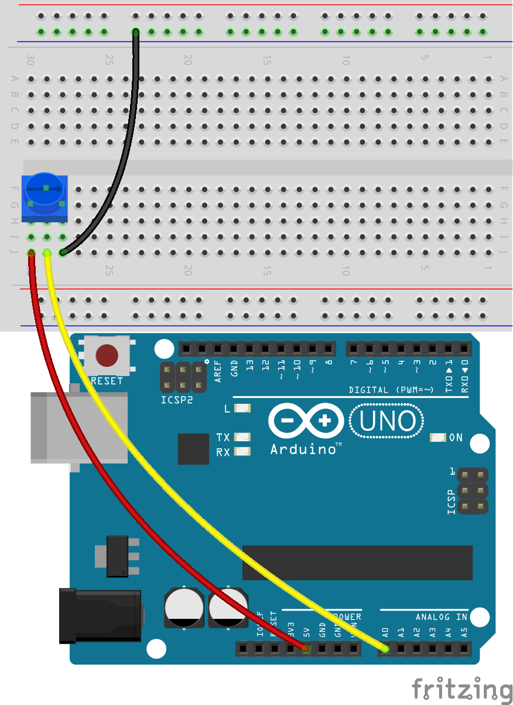
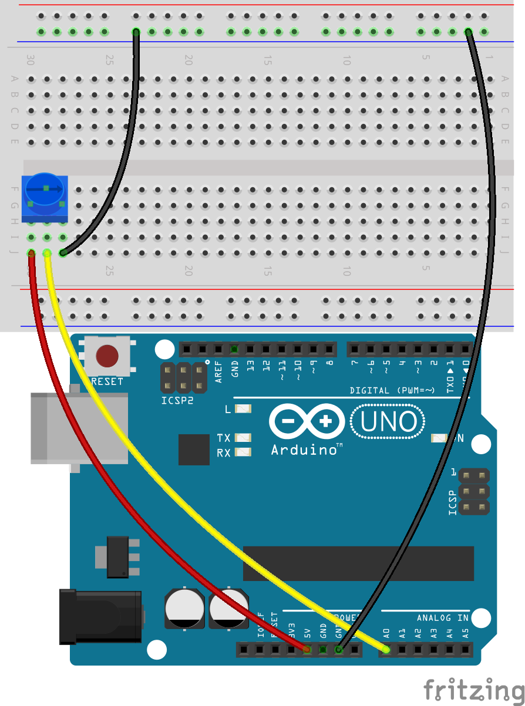

.. note::

    Ciao, benvenuto nella comunità di appassionati di SunFounder Raspberry Pi & Arduino & ESP32 su Facebook! Approfondisci Raspberry Pi, Arduino e ESP32 con altri appassionati.

    **Perché unirti?**

    - **Supporto Esperti**: Risolvi problemi post-vendita e sfide tecniche con l'aiuto della nostra comunità e del nostro team.
    - **Impara e Condividi**: Scambia suggerimenti e tutorial per migliorare le tue competenze.
    - **Anteprime Esclusive**: Ottieni accesso anticipato a nuovi annunci di prodotti e anteprime.
    - **Sconti Speciali**: Goditi sconti esclusivi sui nostri prodotti più recenti.
    - **Promozioni Festive e Omaggi**: Partecipa a omaggi e promozioni festive.

    👉 Pronto a esplorare e creare con noi? Clicca [|link_sf_facebook|] e unisciti oggi stesso!

11. Controllo di Matrici LED con Potenziometro
===================================================

Benvenuto in questa lezione, dove esploreremo come padroneggiare le istruzioni condizionali per controllare dinamicamente matrici di LED. Partendo dalla nostra precedente conoscenza dei circuiti LED semplici, questa lezione ti introdurrà a logiche condizionali complesse, consentendo ai LED di rispondere a diversi livelli di input da un potenziometro. Questo corso è ideale sia per principianti che si avvicinano alla programmazione delle istruzioni condizionali, sia per programmatori esperti che desiderano approfondire la struttura if-else if-else.

Alla fine di questa lezione, non solo saprai programmare i LED per accendersi in sequenza, ma comprenderai anche come utilizzare questi schemi di illuminazione per rappresentare visivamente diverse soglie di input.

.. raw:: html

    <video controls style = "max-width:90%">
        <source src="_static/video/11_control_leds.mp4" type="video/mp4">
        Your browser does not support the video tag.
    </video>

Costruisci il Circuito
------------------------------------

**Componenti Necessari**

.. list-table:: 
   :widths: 25 25 25 25
   :header-rows: 0

   * - 1 * Arduino Uno R3
     - 3 * LED Rossi
     - 3 * Resistenze da 220Ω
     - 1 * Potenziometro
   * - |list_uno_r3| 
     - |list_red_led| 
     - |list_220ohm| 
     - |list_potentiometer| 
   * - 1 * Cavo USB
     - 1 * Breadboard
     - Fili di Collegamento
     - 1 * Multimetro
   * - |list_usb_cable| 
     - |list_breadboard| 
     - |list_wire| 
     - |list_meter|
     

**Fasi di Costruzione**

Segui il diagramma di cablaggio, o i passaggi qui sotto per costruire il circuito.

.. image:: img/11_conditional_led_cont rol_p9.png
    :width: 500
    :align: center

1. Collega un potenziometro al breadboard. Inserisci i suoi tre pin nei fori 30G, 29F, 28G.

.. note::
    Il potenziometro ha un'etichetta "P 103", che indica il suo intervallo di resistenza. Inserisci il potenziometro nel breadboard come mostrato, con il lato etichettato rivolto verso di te.

.. image:: img/11_dimmer_test_pot.png
    :width: 500
    :align: center

2. Inserisci un filo di collegamento nel foro 28J e collegalo al terminale negativo del breadboard.

.. image:: img/11_conditional_led_control_pot_gnd.png
    :width: 500
    :align: center

3. Successivamente, inserisci un filo di collegamento tra il foro 29J e il pin A0 dell'Arduino Uno R3.

.. image:: img/11_conditional_led_control_a0.png
    :width: 500
    :align: center

4. Infine, collega il potenziometro al pin 5V inserendo un filo di collegamento tra il foro 30J del breadboard e il pin 5V dell'Arduino Uno R3.

5. Collega il pin GND dell'Arduino Uno R3 al terminale negativo del breadboard utilizzando un filo di collegamento lungo.

3. Prendi tre LED di qualsiasi colore. Inserisci i loro anodi (pin più lunghi) nei fori 15A, 11A e 7A rispettivamente, e i loro catodi (pin più corti) nel terminale negativo del breadboard.

.. image:: img/11_conditional_led_control_3led.png
    :width: 500
    :align: center

4. Posiziona una resistenza da 220 ohm tra i fori 15E e 15G.

.. image:: img/11_conditional_led_control_1resistor.png
    :width: 500
    :align: center

5. Allo stesso modo, inserisci una resistenza da 220 ohm tra 11E e 11G, e un'altra tra 7E e 7G.

.. image:: img/11_conditional_led_control_2resistor.png
    :width: 500
    :align: center

6. Collega il foro 15J del breadboard al pin 11 dell'Arduino Uno R3 con un filo.

.. image:: img/11_conditional_led_control_p11.png
    :width: 500
    :align: center

7. Collega il foro 11J del breadboard al pin 10 dell'Arduino Uno R3 con un filo.

.. image:: img/11_conditional_led_control_p10.png
    :width: 500
    :align: center

8. Collega il foro 7J del breadboard al pin 9 dell'Arduino Uno R3 con un filo. Il circuito è ora completo.

.. image:: img/11_conditional_led_control_p9.png
    :width: 500
    :align: center
    
Creazione del Codice
-----------------------

**Scrivere il Pseudocodice**

1. Il pseudocodice serve come schizzo del programma, scritto in linguaggio semplice per semplificare la comprensione. Il tuo compito è creare il pseudocodice per una matrice di LED che reagisce a un potenziometro. Man mano che il valore del potenziometro aumenta, più LED si accenderanno. Prima di immergerti nel pseudocodice, rispondi a queste domande:

.. code-block::

    - How does the Arduino read the potentiometer's value?
    - How can each LED be controlled individually?
    - how many ranges should the potentiometer's values be divided?
    - What should each LED display across these ranges?

2. Scrivi il tuo pseudocodice per la matrice di LED nella sezione vuota fornita nel tuo manuale.

**Stampare i Valori del Potenziometro**

3. Per trasformare il tuo pseudocodice in uno sketch funzionante, apri l'IDE di Arduino e avvia un nuovo progetto selezionando "New Sketch" dal menu "File".
4. Salva il tuo sketch come ``Lesson11_LED_Array`` usando ``Ctrl + S`` o facendo clic su "Salva".

5. Come nelle lezioni precedenti, crea una variabile prima del ``void setup()`` per memorizzare il valore del potenziometro e ricorda di annotare il codice per rispecchiarne la funzionalità.

.. code-block:: Arduino
    :emphasize-lines: 1

    int potValue = 0;            // Variabile per memorizzare il valore letto dal potenziometro

    void setup() {
        // Codice da eseguire una volta:

    }

6. Poiché i LED sono dispositivi di output, dovrai configurare i pin digitali 9, 10 e 11 come OUTPUT. Ricorda di includere i commenti.

.. code-block:: Arduino
    :emphasize-lines: 5,6,7

    int potValue = 0;            // Variabile per memorizzare il valore letto dal potenziometro

    void setup() {
        // Codice da eseguire una volta:
        pinMode(9, OUTPUT);  // Configura il pin 9 come output
        pinMode(10, OUTPUT); // Configura il pin 10 come output
        pinMode(11, OUTPUT); // Configura il pin 11 come output
    }

7. Avvia la comunicazione seriale impostando il baud rate a 9600.

.. code-block:: Arduino
    :emphasize-lines: 8

    int potValue = 0;            // Variabile per memorizzare il valore letto dal potenziometro

    void setup() {
        // Codice da eseguire una volta:
        pinMode(9, OUTPUT);  // Configura il pin 9 come output
        pinMode(10, OUTPUT); // Configura il pin 10 come output
        pinMode(11, OUTPUT); // Configura il pin 11 come output
        Serial.begin(9600);  // Avvia la comunicazione seriale a 9600 baud
    }

8. All'interno del ``void loop()``, dopo aver letto il valore del potenziometro, memorizzalo nella variabile ``potValue`` e stampalo nel monitor seriale.

.. code-block:: Arduino
    :emphasize-lines: 12-15

    int potValue = 0;            // Variabile per memorizzare il valore letto dal potenziometro

    void setup() {
        pinMode(9, OUTPUT);  // Configura il pin 9 come output
        pinMode(10, OUTPUT); // Configura il pin 10 come output
        pinMode(11, OUTPUT); // Configura il pin 11 come output
        Serial.begin(9600);  // Avvia la comunicazione seriale a 9600 baud
    }

    void loop() {
        // Codice principale da eseguire ripetutamente:
        potValue = analogRead(A0);     // Leggi il valore dal potenziometro
        Serial.print("Pot Value: ");  // Visualizza la lettura
        Serial.println(potValue);      // Stampa il valore del potenziometro
        delay(100);
    }

9. Valida e compila il codice se necessario.

10. Una volta che il codice è caricato sull'Arduino Uno R3, noterai che ruotando il potenziometro il valore visualizzato nel monitor seriale varia tra 0 e 1023. Questo intervallo è ideale, anche se a causa di variazioni di fabbricazione, il tuo potenziometro potrebbe mostrare un intervallo da 50 a 1000. Ricorda semplicemente questo intervallo come riferimento.

**Controllare i LED con i Valori del Potenziometro**

Per accendere sequenzialmente ogni LED in base al valore del potenziometro, avrai bisogno di più condizioni. Puoi usare ``if`` per specificare le azioni per diverse fasce di valori del potenziometro:
  
  - Sotto 200: Spegni tutti i LED.
  - Tra 200 e 600: Accendi il primo LED.
  - Tra 600 e 1000: Accendi due LED.
  - Sopra 1000: Accendi tutti i LED.

Tuttavia, gestire queste condizioni separatamente può essere inefficiente, poiché Arduino deve verificarle tutte ad ogni ciclo del loop.

Per ottimizzare il processo, utilizza la struttura ``if-else if``:

.. code-block:: Arduino

    if (condition 1) {
        // Execute if condition 1 is true
    }
    else if (condition 2) {
        // Execute if condition 2 is true
    }
    else if (condition 3) {
        // Execute if condition 3 is true
    }
    else {
        // Execute if none of the conditions are true
    }

.. image:: img/if_else_if.png
    :width: 500
    :align: center

In una struttura ``if-else if``, viene testata prima la prima condizione. Se è vera, vengono eseguiti i comandi associati e tutte le altre condizioni vengono saltate (anche se alcune sono vere). Se la prima condizione è falsa, viene testata la seconda. Se questa è vera, vengono eseguiti i comandi associati e si saltano le altre. Se anche questa è falsa, si testa la terza condizione, e così via. In alcuni casi, potrebbero esserci più condizioni vere. Pertanto, l'ordine delle condizioni è importante. Verranno eseguiti solo i comandi associati alla prima condizione vera.

11. Per prima cosa, spegni tutti e tre i LED se il valore del potenziometro è inferiore a 200. Aggiungi un'istruzione if e usa la funzione digitalWrite() per impostare i pin 9, 10 e 11 su LOW per spegnere i LED.

.. code-block:: Arduino
    :emphasize-lines: 7-11 
    
    void loop() {
        // Inserisci qui il codice principale da eseguire ripetutamente:
        potValue = analogRead(A0);    // Leggi il valore dal potenziometro
        Serial.print("Pot Value: ");  // Mostra il valore letto
        Serial.println(potValue);     // Stampa il valore del potenziometro
        delay(100);
        if (potValue < 200) {     // Se il valore del potenziometro è inferiore a 200
            digitalWrite(9, LOW);   // Spegni il LED sul pin 9
            digitalWrite(10, LOW);  // Spegni il LED sul pin 10
            digitalWrite(11, LOW);  // Spegni il LED sul pin 11
        }
    }

 
12. Aggiungi un'istruzione ``else if`` per accendere il primo LED quando il valore analogico del potenziometro è inferiore a 600.

.. code-block:: Arduino
    :emphasize-lines: 5-9 
    
    if (potValue < 200) {         // If potValue less than 200
        digitalWrite(9, LOW);       // Switch off the LED on pin 9
        digitalWrite(10, LOW);      // Switch off the LED on pin 10
        digitalWrite(11, LOW);      // Switch off the LED on pin 11
    } else if (potValue < 600) {  // If potValue less than 600
        digitalWrite(9, HIGH);      // Light up the LED on pin 9
        digitalWrite(10, LOW);      // Switch off the LED on pin 10
        digitalWrite(11, LOW);      // Switch off the LED on pin 11
    }

13. Per accendere due LED quando il valore è inferiore a 1000, inserisci un'altra condizione ``else if`` come questa:

.. code-block:: Arduino
    :emphasize-lines: 10-14 
    
    if (potValue < 200) {         // If potValue less than 200
        digitalWrite(9, LOW);       // Switch off the LED on pin 9
        digitalWrite(10, LOW);      // Switch off the LED on pin 10
        digitalWrite(11, LOW);      // Switch off the LED on pin 11
    } else if (potValue < 600) {  // If potValue less than 600
        digitalWrite(9, HIGH);      // Light up the LED on pin 9
        digitalWrite(10, LOW);      // Switch off the LED on pin 10
        digitalWrite(11, LOW);      // Switch off the LED on pin 11
    }
    else if (potValue < 1000) {  // If potValue less than 1000
        digitalWrite(9, HIGH);     // Light up the LED on pin 9
        digitalWrite(10, HIGH);    // Light up the LED on pin 10
        digitalWrite(11, LOW);     // Switch off the LED on pin 11
    }  

14. Infine, modifica i comandi all'interno del blocco ``else`` per accendere tutti e tre i LED utilizzando ``digitalWrite()``. Questo blocco contiene i comandi che vengono eseguiti quando nessuna delle altre condizioni è vera. In altre parole, se il valore ``potValue`` del potenziometro è maggiore o uguale a 1000, i comandi all'interno di ``else {}`` verranno eseguiti. Il tuo blocco ``else`` dovrebbe apparire così:

.. code-block:: Arduino
    :emphasize-lines: 6-8 

    else if (potValue < 1000) {  // Se il valore del potenziometro è inferiore a 1000
        digitalWrite(9, HIGH);     // Accendi il LED sul pin 9
        digitalWrite(10, HIGH);    // Accendi il LED sul pin 10
        digitalWrite(11, LOW);     // Spegni il LED sul pin 11
    } else {
        digitalWrite(9, HIGH);   // Accendi il LED sul pin 9
        digitalWrite(10, HIGH);  // Accendi il LED sul pin 10
        digitalWrite(11, HIGH);  // Accendi il LED sul pin 11
    }

15. Il codice completo è il seguente. Clicca su "Carica" per inviare il codice al tuo Arduino Uno R3.

.. code-block:: Arduino

    int potValue = 0;  // Variabile per memorizzare il valore letto dal potenziometro

    void setup() {
        pinMode(9, OUTPUT);   // Configura il pin 9 come output
        pinMode(10, OUTPUT);  // Configura il pin 10 come output
        pinMode(11, OUTPUT);  // Configura il pin 11 come output
        Serial.begin(9600);   // Avvia la comunicazione seriale a 9600 baud
    }

    void loop() {
        // Inserisci qui il codice principale da eseguire ripetutamente:
        potValue = analogRead(A0);    // Leggi il valore dal potenziometro
        Serial.print("Pot Value: ");  // Mostra il valore letto
        Serial.println(potValue);     // Stampa il valore del potenziometro
        delay(100);
        if (potValue < 200) {          // Se il valore del potenziometro è inferiore a 200
            digitalWrite(9, LOW);        // Spegni il LED sul pin 9
            digitalWrite(10, LOW);       // Spegni il LED sul pin 10
            digitalWrite(11, LOW);       // Spegni il LED sul pin 11
        } else if (potValue < 600) {   // Se il valore del potenziometro è inferiore a 600
            digitalWrite(9, HIGH);       // Accendi il LED sul pin 9
            digitalWrite(10, LOW);       // Spegni il LED sul pin 10
            digitalWrite(11, LOW);       // Spegni il LED sul pin 11
        } else if (potValue < 1000) {  // Se il valore del potenziometro è inferiore a 1000
            digitalWrite(9, HIGH);       // Accendi il LED sul pin 9
            digitalWrite(10, HIGH);      // Accendi il LED sul pin 10
            digitalWrite(11, LOW);       // Spegni il LED sul pin 11
        } else {
            digitalWrite(9, HIGH);   // Accendi il LED sul pin 9
            digitalWrite(10, HIGH);  // Accendi il LED sul pin 10
            digitalWrite(11, HIGH);  // Accendi il LED sul pin 11
        }
    }

16. Ruota il potenziometro per verificare se la matrice di LED funziona come previsto:

   - Se il valore del potenziometro è inferiore a 200, tutti i LED devono essere spenti.
   - Se il valore è compreso tra 200 e 600, si deve accendere il primo LED.
   - Se il valore è compreso tra 600 e 1000, si devono accendere i primi due LED.
   - Se il valore supera 1000, tutti i LED devono essere accesi.

**Domanda**

Nel codice, determiniamo il numero di LED da accendere in base al valore del potenziometro. Come possiamo modificare il codice in modo che, mentre i LED si accendono, la loro luminosità cambi in base al potenziometro?

**Riassunto**

In questa lezione completa, hai imparato a creare un display LED interattivo che risponde a un potenziometro. A partire dalla costruzione del circuito, hai assemblato un sistema che incorpora più LED controllati tramite pin digitali, collegati a un potenziometro che ne regola gli stati in base alle letture. Attraverso istruzioni passo passo, hai programmato con successo il tuo Arduino per gestire diversi scenari di illuminazione in base a soglie specifiche del potenziometro, migliorando la tua comprensione delle interazioni tra hardware e software.

Questo corso ti ha fornito le competenze per scrivere strutture condizionali efficienti, consentendo ai tuoi progetti di reagire a cambiamenti precisi negli input dei sensori. Sperimentando con diverse condizioni, hai visto in prima persona come l'ordine e la struttura del tuo codice influiscano sull'output e sull'efficienza dei tuoi progetti elettronici.

