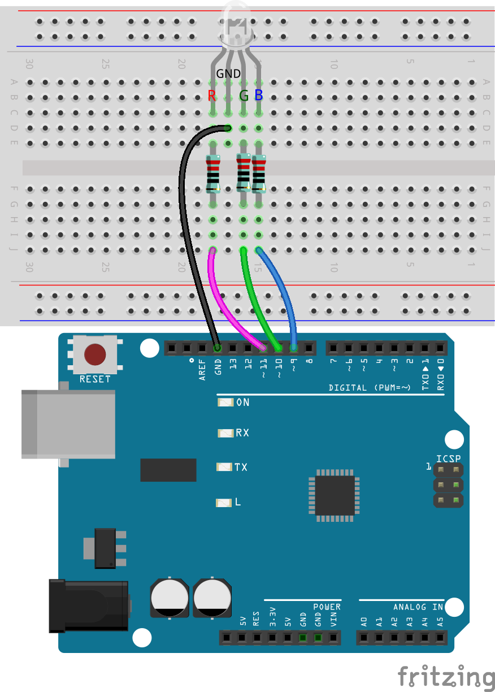
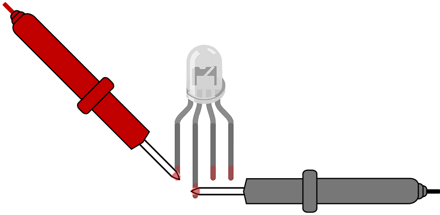
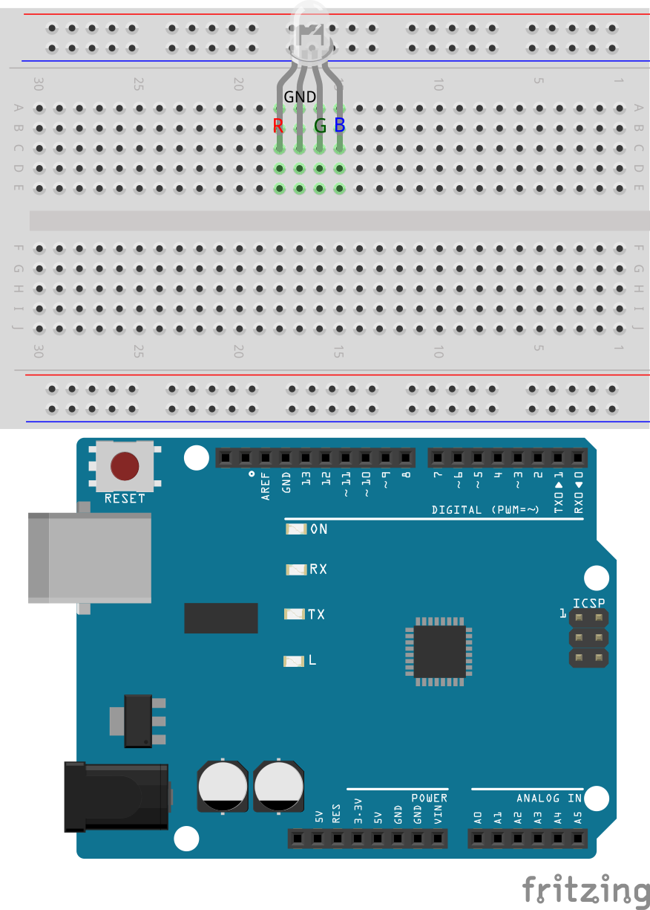
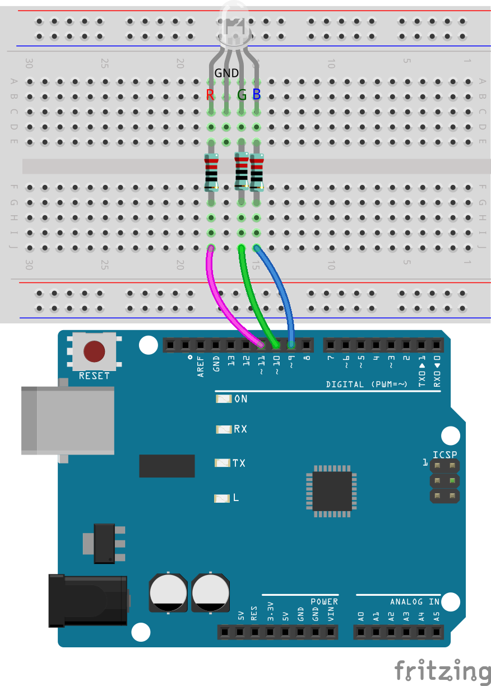

12. The Colors of the Rainbow
=======================================

In this activity, you'll delve into the fascinating world of color blending using an RGB LED to understand how primary colors combine to create a spectrum of hues.

You will sequentially power the pins of an RGB LED, observing the emitted colors and addressing these questions:

* What color does each pin of the RGB LED emit when powered individually?
* What colors result from combining two different light colors?
* How can the RGB LED emit white light?

Building the Circuit
-----------------------

**Components Needed**

* 1 * R3 Board
* 1 * Potentiometer
* 1 * RGB LED
* 3 * 220 Ohm Resistors
* Several Jumper Wires
* 1 * USB Cable
* 1 * Breadboard
* 1 * Multimeter with Test Leads

.. note::
    The color bands for a 220 Ohm resistor are: Red, Red, Black, Black, Brown

**Step-by-Step Building Instructions**

Follow the schematic and wiring diagram or these steps to construct the circuit.

1. Start with an RGB LED.

RGB LEDs emit light in various colors by integrating red, green, and blue LEDs within a single package. By varying the voltage input on the three pins, these LEDs can combine to produce up to 16,777,216 different colors.

.. image:: img/6_mix_color_rgb.png
    :width: 400
    :align: center

Depending on their design, RGB LEDs can be either common anode or common cathode. For this project, we use a **common cathode** RGB LED, where all three LEDs share a negative connection.

* Common cathode RGB LEDs have a shared negative connection.
* Common anode RGB LEDs have a shared positive connection.

.. image:: img/6_rgb_cc_ca.jpg
    :width: 600
    :align: center

An RGB LED typically has 4 pins; the longest one is the ground. When placing the RGB LED, ensure the longest lead is second from the left, configuring the pins as Red, GND, Green, and Blue from left to right.

.. image:: img/6_mix_color_rgb_1.jpg
    :width: 200
    :align: center

You can also use a multimeter in Diode Test mode to identify the color each pin emits.

Set the multimeter to the **Continuity** setting for resistance measurement.

.. image:: img/multimeter_diode_measure.png
    :width: 300
    :align: center

Touch the black probe of the multimeter to the RGB LED's longest pin, and touch the red probe to the other pins individually. You will see the RGB LED light up in red, green, or blue accordingly.

2. Insert the RGB LED into the breadboard with the longest pin going into hole 17D, and the other three pins into 18D, 16D, and 15D, respectively.

3. Insert three resistors as shown from holes 15E to 15G, 16E to 16G, and 18E to 18G.

4. Connect these resistors to pins 9, 10, and 11 on the R3 board with jumper wires as illustrated.

5. Connect the longest pin of the RGB LED to GND using a jumper wire.

创建代码 —— 使用函数
---------------------------------

你已经注意到，要让RGB LED显示轮流显示不同的颜色，你将需要很多行类似的代码，比如我们让RGB LED 显示7种颜色，代码如下：

.. code-block:: Arduino

    void setup() {
        // put your setup code here, to run once:
        pinMode(9, OUTPUT);   // Set Blue pin of RGB LED as output
        pinMode(10, OUTPUT);  // Set Green pin of RGB LED as output
        pinMode(11, OUTPUT);  // Set Red pin of RGB LED as output
    }

    void loop() {
        // put your main code here, to run repeatedly:
        digitalWrite(9, LOW);    // Turn off the Blue pin of RGB LED
        digitalWrite(10, LOW);   // Turn off the Green pin of RGB LED
        digitalWrite(11, HIGH);  // Turn on the Red pin of RGB LED
        delay(1000);             //Wait for 1 second
        digitalWrite(9, LOW);    // Turn off the Blue pin of RGB LED
        digitalWrite(10, HIGH);  // Turn on the Green pin of RGB LED
        digitalWrite(11, LOW);   // Turn off the Red pin of RGB LED
        delay(1000);             //Wait for 1 second
        digitalWrite(9, HIGH);   // Turn on the Blue pin of RGB LED
        digitalWrite(10, LOW);   // Turn off the Green pin of RGB LED
        digitalWrite(11, LOW);   // Turn off the Red pin of RGB LED
        delay(1000);             //Wait for 1 second
        digitalWrite(9, LOW);   // Turn off the Blue pin of RGB LED
        digitalWrite(10, HIGH);   // Turn on the Green pin of RGB LED
        digitalWrite(11, HIGH);   // Turn on the Red pin of RGB LED
        delay(1000);             //Wait for 1 second
        digitalWrite(9, HIGH);   // Turn on the Blue pin of RGB LED
        digitalWrite(10, LOW);   // Turn off the Green pin of RGB LED
        digitalWrite(11, HIGH);   // Turn on the Red pin of RGB LED
        delay(1000);             //Wait for 1 second
        digitalWrite(9, HIGH);   // Turn on the Blue pin of RGB LED
        digitalWrite(10, HIGH);   // Turn on the Green pin of RGB LED
        digitalWrite(11, LOW);   // Turn off the Red pin of RGB LED
        delay(1000);             //Wait for 1 second
        digitalWrite(9, HIGH);   // Turn on the Blue pin of RGB LED
        digitalWrite(10, HIGH);   // Turn on the Green pin of RGB LED
        digitalWrite(11, HIGH);   // Turn on the Red pin of RGB LED
        delay(1000);             //Wait for 1 second
    }

你会发现整个loop()非常长，而且无法看清具体的逻辑，这时我们就需要引入函数的概念。

其实在写代码过程中我们一直都有调用Arduino定制好的函数，比如 ``pinMode()``, ``digitalWrite()``， ``delay()`` 等等。

在这里我们要教的是自定义函数，除了调用Arduino或者是其他人定义好的函数，你可以自己定义一个函数来使你的代码简化，逻辑性更强。

The reason that you need to be able to write your own functions is that as
sketches start to get a little complicated, then your setup and loop functions will
grow and grow until they are long and complicated and it becomes difficult to see
how they work.
The biggest problem in software development of any sort is managing
complexity. The best programmers write software that is easy to look at and
understand and requires very little in the way of explanation.
Functions are a key tool in creating easy-to-understand sketches that can be
changed without difficulty or risk of the whole thing falling into a crumpled mess.

What Is a Function?
A function is a little like a program within a program. You can use it to wrap up
some little thing that you want to do. A function that you define can be called from
anywhere in your sketch and contains its own variables and its own list of
commands. When the commands have been run, execution returns to the point just
after wherever it was in the code that called the function.

.. note::

    调用函数就像一个执行特定任务的迷你程序。只要该任务需要完成，它就可以在主程序中随时运行。

    当函数被 “调用”时，程序离开主代码部分，跳转到函数，并运行函数中的代码行。
    当函数完成后，程序返回到主代码部分，并从函数被调用的位置后继续运行。

    
所以我们可以将让RGB LED显示不同颜色代码放到单独的函数中，
要创建一个调用函数，在 void loop()函数的右大括号之后，移到草图的最底部。
就像 void setup()和 void loop()函数一样，其他调用的函数也是以 void 开头，然后是函数的名称。
命名函数与命名变量或常量的规则相同。
你可以用 Arduino IDE 中任何不是关键词或命令的字给函数命名。函数的命令被放在函数的大括号内。

1. 现在我们在草图底部创建7个新函数，

.. code-block:: Arduino
    :emphasize-lines: 11-13

    void setup() {
        // put your setup code here, to run once:
        pinMode(9, OUTPUT);   // Set Blue pin of RGB LED as output
        pinMode(10, OUTPUT);  // Set Green pin of RGB LED as output
        pinMode(11, OUTPUT);  // Set Red pin of RGB LED as output
    }

    void loop() {
        // put your main code here, to run repeatedly:
        digitalWrite(9, LOW);    // Turn off the Blue pin of RGB LED
        digitalWrite(10, LOW);   // Turn off the Green pin of RGB LED
        digitalWrite(11, HIGH);  // Turn on the Red pin of RGB LED
        delay(1000);             //Wait for 1 second
        ...
    }

    void lightRed(){
    
    }

    void lightGreen(){
    
    }

    ...

    void lightWhite(){
    
    }

2. 现在将不同颜色的代码剪切到相应的函数里面, 之后``loop()``中只留了7个``delay()``函数。

.. code-block:: Arduino
    :emphasize-lines: 11-13

    ...

    void loop() {
        // put your main code here, to run repeatedly:

        delay(1000);  //Wait for 1 second
        delay(1000);  //Wait for 1 second
        delay(1000);  //Wait for 1 second
        delay(1000);  //Wait for 1 second
        delay(1000);  //Wait for 1 second
        delay(1000);  //Wait for 1 second
        delay(1000);  //Wait for 1 second
    }

    void lightRed() {
        digitalWrite(9, LOW);    // Turn off the Blue pin of RGB LED
        digitalWrite(10, LOW);   // Turn off the Green pin of RGB LED
        digitalWrite(11, HIGH);  // Turn on the Red pin of RGB LED
    }

    void lightGreen() {
        digitalWrite(9, LOW);    // Turn off the Blue pin of RGB LED
        digitalWrite(10, HIGH);  // Turn on the Green pin of RGB LED
        digitalWrite(11, LOW);   // Turn off the Red pin of RGB LED
    }

    ...

    void lightWhite() {
        digitalWrite(9, HIGH);   // Turn on the Blue pin of RGB LED
        digitalWrite(10, HIGH);  // Turn on the Green pin of RGB LED
        digitalWrite(11, HIGH);  // Turn on the Red pin of RGB LED
    }

3. 现在函数创建完成了，到了需要在  void loop() 里面调用这些函数的时候。调用函数，只需要将这些名加双括号就行，最后不要忘记在每一行加上分号。

.. code-block:: Arduino
    :emphasize-lines: 12-28

    void setup() {
        // put your setup code here, to run once:
        pinMode(9, OUTPUT);   // Set Blue pin of RGB LED as output
        pinMode(10, OUTPUT);  // Set Green pin of RGB LED as output
        pinMode(11, OUTPUT);  // Set Red pin of RGB LED as output
    }

    void loop() {
        // put your main code here, to run repeatedly:
        lightRed();
        delay(1000);  //Wait for 1 second
        lightGreen();
        delay(1000);  //Wait for 1 second
        lightBlue();
        delay(1000);  //Wait for 1 second
        lightYellow();
        delay(1000);  //Wait for 1 second
        lightPink();
        delay(1000);  //Wait for 1 second
        lightCyan();
        delay(1000);  //Wait for 1 second
        lightWhite();
        delay(1000);  //Wait for 1 second
    }

    void lightRed() {
        digitalWrite(9, LOW);    // Turn off the Blue pin of RGB LED
        digitalWrite(10, LOW);   // Turn off the Green pin of RGB LED
        digitalWrite(11, HIGH);  // Turn on the Red pin of RGB LED
    }

    void lightGreen() {
        digitalWrite(9, LOW);    // Turn off the Blue pin of RGB LED
        digitalWrite(10, HIGH);  // Turn on the Green pin of RGB LED
        digitalWrite(11, LOW);   // Turn off the Red pin of RGB LED
    }
    void lightBlue() {
        digitalWrite(9, HIGH);  // Turn on the Blue pin of RGB LED
        digitalWrite(10, LOW);  // Turn off the Green pin of RGB LED
        digitalWrite(11, LOW);  // Turn off the Red pin of RGB LED
    }
    void lightYellow() {
        digitalWrite(9, LOW);    // Turn off the Blue pin of RGB LED
        digitalWrite(10, HIGH);  // Turn on the Green pin of RGB LED
        digitalWrite(11, HIGH);  // Turn on the Red pin of RGB LED
    }
    void lightPink() {
        digitalWrite(9, HIGH);   // Turn on the Blue pin of RGB LED
        digitalWrite(10, LOW);   // Turn off the Green pin of RGB LED
        digitalWrite(11, HIGH);  // Turn on the Red pin of RGB LED
    }
    void lightCyan() {
        digitalWrite(9, HIGH);   // Turn on the Blue pin of RGB LED
        digitalWrite(10, HIGH);  // Turn on the Green pin of RGB LED
        digitalWrite(11, LOW);   // Turn off the Red pin of RGB LED
    }
    void lightWhite() {
        digitalWrite(9, HIGH);   // Turn on the Blue pin of RGB LED
        digitalWrite(10, HIGH);  // Turn on the Green pin of RGB LED
        digitalWrite(11, HIGH);  // Turn on the Red pin of RGB LED
    }

4. 到了这里，代码已经完成了。点击“Upload”按钮将代码上传到R3板，你会发现RGB LED循环显示，红，绿，蓝，黄，粉，靛青和白色。

.. note::
    这个RGB LED的亮度比较刺眼，不要长时间盯着看，以免伤害眼睛。

    另外你可以用纸巾或者其他能光的物体遮挡下。

.. note:: 

    对于布尔型变量而言，任何非零值都被视为true，而0被视为false。
    因此也可以使用1和0来为其赋值。
    即此函数的 ``lightUp(1, 0, 0);`` 与 ``lightUp(True, False, False);`` 是相同的。

将剩余的几种电平组合都列出来，并用delay()隔开，你的代码应带如下所示：

.. code-block:: Arduino

    int delayTime=1000;

    void setup() {
        pinMode(9, OUTPUT);             // Declare the RGB LED pin1 as output
        pinMode(10, OUTPUT);            // Declare the RGB LED pin2 as output
        pinMode(11, OUTPUT);            // Declare the RGB LED pin2 as output
    }

    void loop(){              
        lightUp(1, 0, 0);               // Call the lightUp function to control the LEDs
        delay(delayTime);               // wait a second
        lightUp(0, 1, 0);               
        delay(delayTime);
        lightUp(0, 0, 1);               
        delay(delayTime);
        lightUp(1, 1, 0);               
        delay(delayTime);
        lightUp(1, 0, 1);               
        delay(delayTime);
        lightUp(0, 1, 1);               
        delay(delayTime);
        lightUp(1, 1, 1);   
        delay(delayTime);                           
    }

    void lightUp(bool pin1, bool pin2, bool pin3) {
        if (pin1 == True) {             // If pin1 is True, turn on the first LED
            digitalWrite(9, HIGH);
        } else {                        // Otherwise, turn off the first LED
            digitalWrite(9, LOW);
        }

        if (pin2 == True) {             // If pin2 is True, turn on the second LED
            digitalWrite(10, HIGH);
        } else {                        // Otherwise, turn off the second LED
            digitalWrite(10, LOW);
        }

        if (pin3 == True) {             // If pin3 is True, turn on the third LED
            digitalWrite(11, HIGH);
        } else {                        // Otherwise, turn off the third LED
            digitalWrite(11, LOW);
        }
    }

现在我们已经可以完整的遍历所有的电平组合了。但是当这个代码烧录进R3板后，你会发现一个问题。

*我已经看到灯光颜色变化了，可是这时候是哪几个引脚处于高电平呢？*

一个简单的解决方法是在 ``lightUp()`` 中添加打印，这样在每次切换颜色时，你都可以通过串口监视器知道现在的电平组合。

.. code-block:: Arduino
    :emphasize-lines: 7,28-33

    int delayTime=1000;

    void setup() {
        pinMode(9, OUTPUT);             // Declare the RGB LED pin1 as output
        pinMode(10, OUTPUT);            // Declare the RGB LED pin2 as output
        pinMode(11, OUTPUT);            // Declare the RGB LED pin2 as output
        Serial.begin(9600);
    }

    void loop(){              
        lightUp(1, 0, 0);               // Call the lightUp function to control the LEDs
        delay(delayTime);               // wait a second
        lightUp(0, 1, 0);               
        delay(delayTime);
        lightUp(0, 0, 1);               
        delay(delayTime);
        lightUp(1, 1, 0);               
        delay(delayTime);
        lightUp(1, 0, 1);               
        delay(delayTime);
        lightUp(0, 1, 1);               
        delay(delayTime);
        lightUp(1, 1, 1);   
        delay(delayTime);                           
    }

    void lightUp(bool pin1, bool pin2, bool pin3) {
        Serial.print("pin Level:");
        Serial.print(pin1);
        Serial.print(" , ");
        Serial.print(pin2);
        Serial.print(" , ");
        Serial.println(pin3);  

        if (pin1 == True) {             // If pin1 is True, turn on the first LED
            digitalWrite(9, HIGH);
        } else {                        // Otherwise, turn off the first LED
            digitalWrite(9, LOW);
        }

        if (pin2 == True) {             // If pin2 is True, turn on the second LED
            digitalWrite(10, HIGH);
        } else {                        // Otherwise, turn off the second LED
            digitalWrite(10, LOW);
        }

        if (pin3 == True) {             // If pin3 is True, turn on the third LED
            digitalWrite(11, HIGH);
        } else {                        // Otherwise, turn off the third LED
            digitalWrite(11, LOW);
        }
    }

点击“上传”按钮，将草图上传到你的 Arduino 板。点击 Arduino IDE 右上角的 "串行监视器 "按钮。串行监视器将在一个新窗口中打开。

为每个电平组合记录下对应的灯光颜色。如果颜色切换得太快来不及记录，可以手动增加 delayTime 的值，延长时间。

点击 “保存” 来保存你的草图。