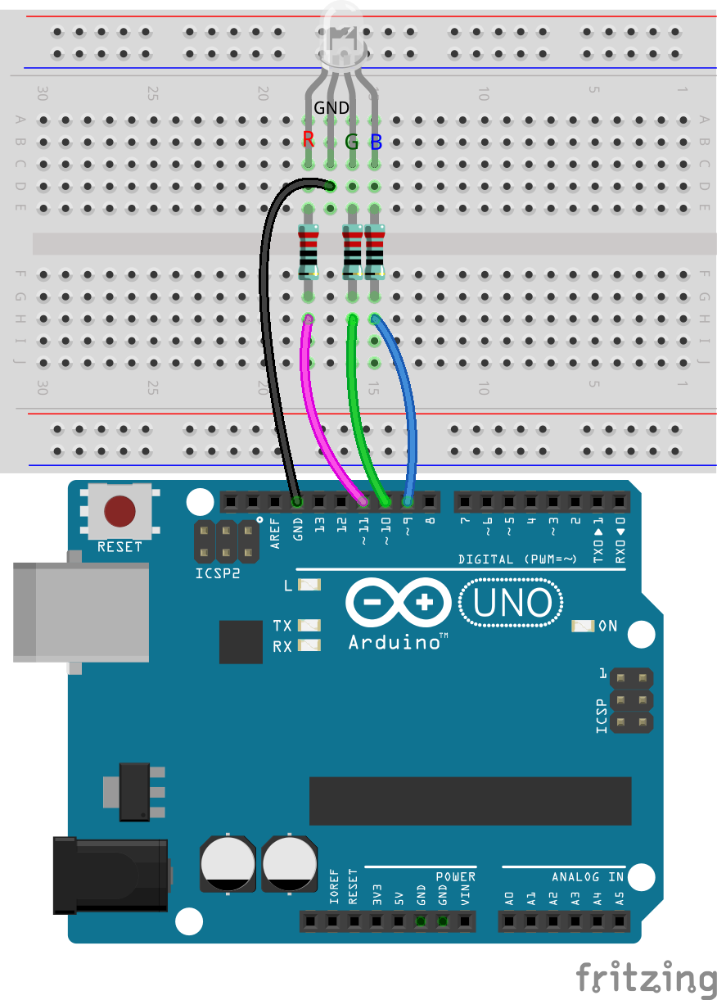
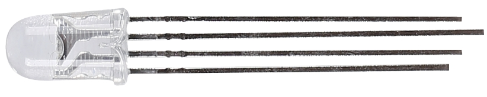
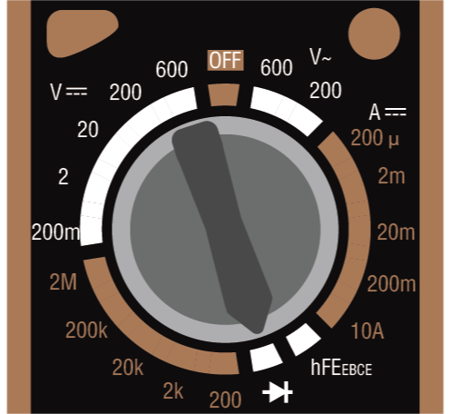
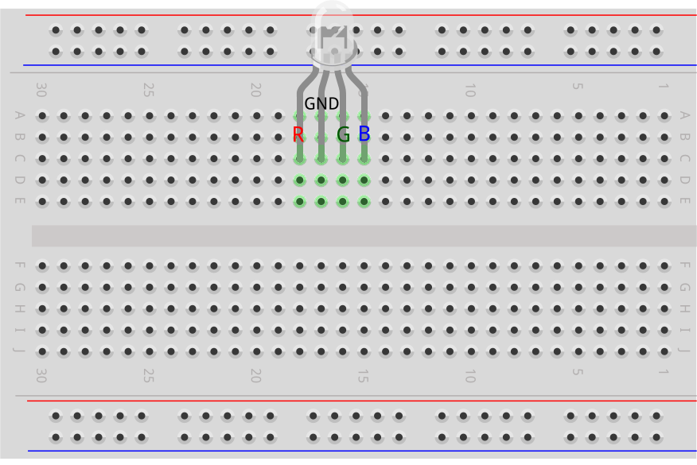
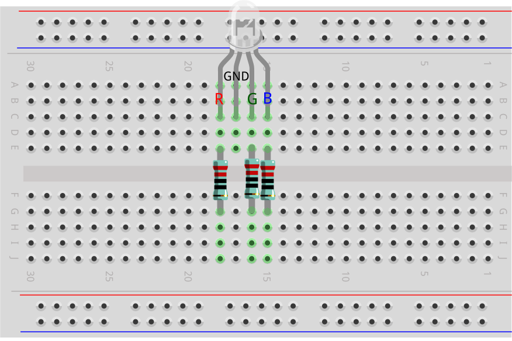
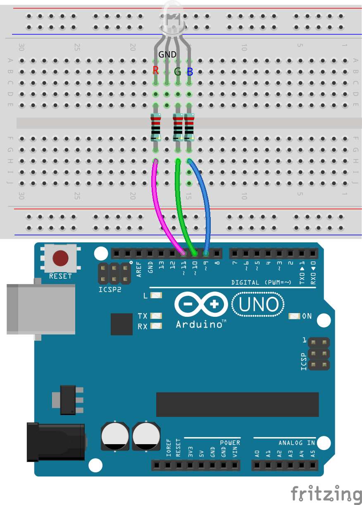

.. note::

    Hallo und herzlich willkommen in der SunFounder Raspberry Pi & Arduino & ESP32 Enthusiasten-Community auf Facebook! Tauche tiefer in die Welt von Raspberry Pi, Arduino und ESP32 ein, gemeinsam mit anderen Technikbegeisterten.

    **Warum solltest du beitreten?**

    - **Experten-Support**: Löse technische Herausforderungen und Probleme nach dem Kauf mit Hilfe unserer Community und unseres Teams.
    - **Lernen & Teilen**: Tausche Tipps und Tutorials aus, um deine Fähigkeiten zu erweitern.
    - **Exklusive Vorschauen**: Erhalte frühzeitigen Zugang zu neuen Produktankündigungen und exklusiven Einblicken.
    - **Spezielle Rabatte**: Genieße exklusive Rabatte auf unsere neuesten Produkte.
    - **Festliche Aktionen und Gewinnspiele**: Nimm an Gewinnspielen und Sonderaktionen zu Feiertagen teil.

    👉 Bereit, mit uns zu forschen und zu kreieren? Klicke auf [|link_sf_facebook|] und trete noch heute bei!

12. Die Farben des Regenbogens
=======================================
Stell dir vor, du könntest mit Licht malen, indem du Rot, Grün und Blau mischst, um jede erdenkliche Farbe zu erzeugen – so wie beim Mischen von Farben auf einer Palette, nur mit Lichtstrahlen.

.. image:: img/12_rgb_mix.png
    :width: 300
    :align: center

Willkommen zu dieser Lektion, in der du die faszinierende Welt der RGB-LEDs erkunden wirst und lernst, wie die Kombination von Primärfarben ein lebendiges Farbspektrum erzeugen kann. Dieser praktische Kurs führt dich durch die Funktionsprinzipien der RGB-LEDs und zeigt dir die Anwendungsmöglichkeiten in der Programmierung und im Schaltungsaufbau.

In dieser Lektion wirst du lernen:

* Die Funktionsweise von RGB-LEDs zu verstehen.
* Funktionen in deinem Code zu erstellen und zu nutzen, um Aufgaben zu vereinfachen und die Lesbarkeit zu verbessern.
* Die Auswirkungen verschiedener Farbkombinationen zu erkunden, indem du die RGB-LED steuerst.

Aufbau der Schaltung
-----------------------

**Benötigte Komponenten**

.. list-table:: 
   :widths: 25 25 25 25
   :header-rows: 0

   * - 1 * Arduino Uno R3
     - 1 * RGB-LED
     - 3 * 220Ω-Widerstand
     - Steckkabel
   * - |list_uno_r3| 
     - |list_rgb_led| 
     - |list_220ohm| 
     - |list_wire| 
   * - 1 * USB-Kabel
     - 1 * Steckbrett
     - 1 * Multimeter
     -
   * - |list_usb_cable| 
     - |list_breadboard| 
     - |list_meter|
     -

**Schritt-für-Schritt-Anleitung zum Aufbau**

Folge dem Schaltplan oder diesen Schritten, um die Schaltung aufzubauen.

1. Beginne mit einer RGB-LED.

RGB-LEDs erzeugen Licht in verschiedenen Farben, indem sie rote, grüne und blaue LEDs in einem einzigen Gehäuse kombinieren. Durch das Variieren der Spannung an den drei Pins können diese LEDs bis zu 16.777.216 verschiedene Farben erzeugen.

Je nach Bauweise können RGB-LEDs entweder eine gemeinsame Anode oder eine gemeinsame Kathode haben. In diesem Projekt verwenden wir eine **gemeinsame Kathode**-RGB-LED, bei der alle drei LEDs eine negative Verbindung teilen.

* RGB-LEDs mit gemeinsamer Kathode haben eine gemeinsame negative Verbindung.
* RGB-LEDs mit gemeinsamer Anode haben eine gemeinsame positive Verbindung.

.. image:: img/12_rgb_cc_ca.jpg
    :width: 600
    :align: center

Eine RGB-LED hat in der Regel 4 Pins; der längste davon ist der Massepin. Achte beim Einsetzen der RGB-LED darauf, dass der längste Pin der zweite von links ist, und konfiguriere die Pins als Rot, GND, Grün und Blau von links nach rechts.

.. image:: img/12_mix_color_rgb_1.jpg
    :width: 200
    :align: center

Du kannst auch ein Multimeter im Diodentestmodus verwenden, um herauszufinden, welche Farbe jeder Pin erzeugt.

Stelle das Multimeter auf die **Durchgangsprüfung** für die Widerstandsmessung ein.

Berühre mit der schwarzen Leitung des Multimeters den längsten Pin der RGB-LED und mit der roten Leitung die anderen Pins einzeln. Die RGB-LED leuchtet dann in Rot, Grün oder Blau auf.

.. image:: img/12_mix_color_measure_pin.png
    :width: 500
    :align: center

2. Setze die RGB-LED in das Steckbrett ein, wobei der längste Pin in Loch 17D geht und die anderen drei Pins in 18C, 16C und 15C.

3. Setze drei 220Ω-Widerstände ein, wie gezeigt: von Loch 15E zu 15G, 16E zu 16G und 18E zu 18G.

4. Verbinde diese Widerstände mit den Pins 9, 10 und 11 des Arduino Uno R3, wie im Diagramm gezeigt.

5. Verbinde den längsten Pin der RGB-LED mit GND, indem du ein Steckkabel verwendest.

Code-Erstellung - RGB-LEDs zum Leuchten bringen
--------------------------------------------------

1. Öffne die Arduino IDE und starte ein neues Projekt, indem du "Neue Skizze" aus dem Menü "Datei" wählst.
2. Speichere deine Skizze als ``Lesson12_Rainbow_Color`` mit ``Ctrl + S`` oder durch Klicken auf „Speichern“.

3. Die LED in deinem Schaltkreis ist mit digitalen Pins des Arduino Uno R3 verbunden. Da die LED ein Ausgabegerät ist, musst du die digitalen Pins 9, 10 und 11 als ``OUTPUT`` festlegen.

.. code-block:: Arduino
    :emphasize-lines: 3-5

    void setup() {
        // Setup-Code, der einmal ausgeführt wird:
        pinMode(9, OUTPUT);   // Setze den blauen Pin der RGB-LED als Ausgang
        pinMode(10, OUTPUT);  // Setze den grünen Pin der RGB-LED als Ausgang
        pinMode(11, OUTPUT);  // Setze den roten Pin der RGB-LED als Ausgang
    }

    void loop() {
        // Hauptcode, der wiederholt ausgeführt wird:
    }

4. Setze nun im ``void loop()`` den roten Pin der RGB-LED auf ``HIGH`` und die anderen beiden Pins auf ``LOW``.

.. note::

    Da wir die PWM-Pins 9, 10 und 11 verwenden, kannst du entweder ``digitalWrite()`` oder ``analogWrite()`` verwenden, um einen hohen oder niedrigen Pegel auszugeben.
    
    Für diese Lektion werden wir jedoch einfach die Pins auf high oder low setzen und deshalb ``digitalWrite()`` verwenden.

.. code-block:: Arduino
    :emphasize-lines: 10-12

    void setup() {
        // Setup-Code, der einmal ausgeführt wird:
        pinMode(9, OUTPUT);   // Setze den blauen Pin der RGB-LED als Ausgang
        pinMode(10, OUTPUT);  // Setze den grünen Pin der RGB-LED als Ausgang
        pinMode(11, OUTPUT);  // Setze den roten Pin der RGB-LED als Ausgang
    }

    void loop() {
        // Hauptcode, der wiederholt ausgeführt wird:
        digitalWrite(9, LOW);    // Schalte den blauen Pin der RGB-LED aus
        digitalWrite(10, LOW);   // Schalte den grünen Pin der RGB-LED aus
        digitalWrite(11, HIGH);  // Schalte den roten Pin der RGB-LED ein
    }

5. Speichere den Code und klicke auf „Hochladen“, um ihn auf dein Arduino Uno R3 zu übertragen. Schau dir an, was passiert.

6. Du wirst sehen, dass die RGB-LED rot aufleuchtet. Aber was ist, wenn du möchtest, dass auch Grün und Blau leuchten? Wie solltest du den Code ändern?

Kopiere nun die drei ``digitalWrite()``-Befehle zwei weitere Male. Setze den gewünschten Pin auf ``HIGH`` und die anderen auf ``LOW``. Jede Farbe sollte für eine Sekunde leuchten.

.. code-block:: Arduino
    :emphasize-lines: 14-21

    void setup() {
        // Setup-Code, der einmal ausgeführt wird:
        pinMode(9, OUTPUT);   // Setze den blauen Pin der RGB-LED als Ausgang
        pinMode(10, OUTPUT);  // Setze den grünen Pin der RGB-LED als Ausgang
        pinMode(11, OUTPUT);  // Setze den roten Pin der RGB-LED als Ausgang
    }

    void loop() {
        // Hauptcode, der wiederholt ausgeführt wird:
        digitalWrite(9, LOW);    // Schalte den blauen Pin der RGB-LED aus
        digitalWrite(10, LOW);   // Schalte den grünen Pin der RGB-LED aus
        digitalWrite(11, HIGH);  // Schalte den roten Pin der RGB-LED ein
        delay(1000);              // Warte 1 Sekunde
        digitalWrite(9, LOW);    // Schalte den blauen Pin der RGB-LED aus
        digitalWrite(10, HIGH);  // Schalte den grünen Pin der RGB-LED ein
        digitalWrite(11, LOW);   // Schalte den roten Pin der RGB-LED aus
        delay(1000);              // Warte 1 Sekunde
        digitalWrite(9, HIGH);   // Schalte den blauen Pin der RGB-LED ein
        digitalWrite(10, LOW);   // Schalte den grünen Pin der RGB-LED aus
        digitalWrite(11, LOW);   // Schalte den roten Pin der RGB-LED aus
        delay(1000);              // Warte 1 Sekunde
    }

7. Lade den Code erneut hoch, um die Effekte zu sehen. Du wirst feststellen, dass die RGB-LED zwischen Rot, Grün und Blau wechselt.

**Fragen**:

1. Wenn du andere Farben möchtest, was solltest du tun? Sieh dir das untenstehende Diagramm an und trage deine Ideen in dein Handbuch ein.

.. image:: img/12_rgb_mix.png
    :width: 300
    :align: center

.. list-table::
   :widths: 20 20 20 20
   :header-rows: 1

   * - Farbe
     - Roter Pin
     - Grüner Pin
     - Blauer Pin
   * - Rot
     - *HIGH*
     - *LOW*
     - *LOW*
   * - Grün
     - *LOW*
     - *HIGH*
     - *LOW*
   * - Blau
     - *LOW*
     - *LOW*
     - *HIGH*
   * - Gelb
     -
     -
     -
   * - Pink
     -
     -
     -
   * - Cyan
     - 
     -
     -
   * - Weiß
     -
     -
     -

Code-Erstellung - Erstellen von Funktionen
------------------------------------------------

Vielleicht ist dir aufgefallen, dass du, um verschiedene Farben nacheinander auf der RGB-LED anzuzeigen, viele ähnliche Codezeilen schreiben musst. Um beispielsweise sieben verschiedene Farben auf der RGB-LED darzustellen, könntest du Folgendes schreiben:

.. code-block:: Arduino

    void setup() {
        // Setup-Code, der einmal ausgeführt wird:
        pinMode(9, OUTPUT);   // Setze den blauen Pin der RGB-LED als Ausgang
        pinMode(10, OUTPUT);  // Setze den grünen Pin der RGB-LED als Ausgang
        pinMode(11, OUTPUT);  // Setze den roten Pin der RGB-LED als Ausgang
    }

    void loop() {
        // Hauptcode, der wiederholt ausgeführt wird:
        digitalWrite(9, LOW);    // Schalte den blauen Pin der RGB-LED aus
        digitalWrite(10, LOW);   // Schalte den grünen Pin der RGB-LED aus
        digitalWrite(11, HIGH);  // Schalte den roten Pin der RGB-LED ein
        delay(1000);             // Warte 1 Sekunde
        digitalWrite(9, LOW);    // Schalte den blauen Pin der RGB-LED aus
        digitalWrite(10, HIGH);  // Schalte den grünen Pin der RGB-LED ein
        digitalWrite(11, LOW);   // Schalte den roten Pin der RGB-LED aus
        delay(1000);             // Warte 1 Sekunde
        digitalWrite(9, HIGH);   // Schalte den blauen Pin der RGB-LED ein
        digitalWrite(10, LOW);   // Schalte den grünen Pin der RGB-LED aus
        digitalWrite(11, LOW);   // Schalte den roten Pin der RGB-LED aus
        delay(1000);             // Warte 1 Sekunde
        digitalWrite(9, LOW);    // Schalte den blauen Pin der RGB-LED aus
        digitalWrite(10, HIGH);  // Schalte den grünen Pin der RGB-LED ein
        digitalWrite(11, HIGH);  // Schalte den roten Pin der RGB-LED ein
        delay(1000);             // Warte 1 Sekunde
        digitalWrite(9, HIGH);   // Schalte den blauen Pin der RGB-LED ein
        digitalWrite(10, LOW);   // Schalte den grünen Pin der RGB-LED aus
        digitalWrite(11, HIGH);  // Schalte den roten Pin der RGB-LED ein
        delay(1000);             // Warte 1 Sekunde
        digitalWrite(9, HIGH);   // Schalte den blauen Pin der RGB-LED ein
        digitalWrite(10, HIGH);  // Schalte den grünen Pin der RGB-LED ein
        digitalWrite(11, LOW);   // Schalte den roten Pin der RGB-LED aus
        delay(1000);             // Warte 1 Sekunde
        digitalWrite(9, HIGH);   // Schalte den blauen Pin der RGB-LED ein
        digitalWrite(10, HIGH);  // Schalte den grünen Pin der RGB-LED ein
        digitalWrite(11, HIGH);  // Schalte den roten Pin der RGB-LED ein
        delay(1000);             // Warte 1 Sekunde
    }

Du hast vielleicht bemerkt, dass deine ``void loop()``-Funktion recht lang geworden ist und die Logik schwer nachzuvollziehen ist. Dies ist der perfekte Moment, um das Konzept der Funktionen einzuführen.

Während deiner Programmierreise hast du bereits eingebaute Arduino-Funktionen wie ``pinMode()``, ``digitalWrite()`` und ``delay()`` verwendet. Jetzt werden wir eigene Funktionen erstellen. Eigene Funktionen helfen dir, deinen Code zu vereinfachen und übersichtlicher zu gestalten.

Um eine Funktion zu erstellen, füge sie einfach am Ende deiner Skizze nach der schließenden Klammer von ``void loop()`` hinzu. Wie bei ``void setup()`` und ``void loop()`` beginnt eine Funktion mit dem Schlüsselwort ``void``, gefolgt von einem selbstgewählten Namen. Die Namensregeln für Funktionen sind denen für Variablen oder Konstanten ähnlich. Du kannst eine Funktion nach Belieben benennen, solange es kein reserviertes Wort in der Arduino IDE ist, und die Anweisungen der Funktion werden in geschweifte Klammern gesetzt.

.. code-block:: Arduino
    :emphasize-lines: 9-11

    void setup() {
        ...
    }

    void loop() {
        ...
    }

    void lightRed(){
    
    }

1. Füge am Ende deiner Skizze, direkt nach der schließenden Klammer von ``void loop()``, sieben neue Funktionen hinzu. Jede Funktion wird den Code enthalten, um eine bestimmte Farbe auf der RGB-LED anzuzeigen.

.. code-block:: Arduino
    :emphasize-lines: 10-22

    void loop() {
        // Hauptcode, der wiederholt ausgeführt wird:
        digitalWrite(9, LOW);    // Schalte den blauen Pin der RGB-LED aus
        digitalWrite(10, LOW);   // Schalte den grünen Pin der RGB-LED aus
        digitalWrite(11, HIGH);  // Schalte den roten Pin der RGB-LED ein
        delay(1000);             // Warte 1 Sekunde
        ...
    }

    void lightRed(){
    
    }

    void lightGreen(){
    
    }

    ...

    void lightWhite(){
    
    }

2. Als Nächstes schneidest du die farbspezifischen Code-Snippets aus der Funktion ``void loop()`` und fügst sie in ihre jeweiligen Funktionen ein. Dadurch bleiben nur sieben ``delay()``-Aufrufe in der ``loop()``-Funktion übrig.

.. code-block:: Arduino

    ...

    void loop() {
        // Hier kommt dein Hauptcode, der wiederholt ausgeführt wird:

        delay(1000);  // Warte 1 Sekunde
        delay(1000);  // Warte 1 Sekunde
        delay(1000);  // Warte 1 Sekunde
        delay(1000);  // Warte 1 Sekunde
        delay(1000);  // Warte 1 Sekunde
        delay(1000);  // Warte 1 Sekunde
        delay(1000);  // Warte 1 Sekunde
    }

    void lightRed() {
        digitalWrite(9, LOW);    // Schalte den blauen Pin der RGB-LED aus
        digitalWrite(10, LOW);   // Schalte den grünen Pin der RGB-LED aus
        digitalWrite(11, HIGH);  // Schalte den roten Pin der RGB-LED ein
    }
    ...

    void lightWhite() {
        digitalWrite(9, HIGH);   // Schalte den blauen Pin der RGB-LED ein
        digitalWrite(10, HIGH);  // Schalte den grünen Pin der RGB-LED ein
        digitalWrite(11, HIGH);  // Schalte den roten Pin der RGB-LED ein
    }

3. Nun, da die Funktionen eingerichtet sind, ist es an der Zeit, sie innerhalb der Funktion ``void loop()`` aufzurufen. Um eine Funktion aufzurufen, schreibe einfach ihren Namen gefolgt von zwei Klammern und beende die Zeile mit einem Semikolon.

.. code-block:: Arduino
    :emphasize-lines: 7-22

    void setup() {
        // Hier kommt dein Setup-Code, der einmalig ausgeführt wird:
        pinMode(9, OUTPUT);   // Setze den blauen Pin der RGB-LED als Ausgang
        pinMode(10, OUTPUT);  // Setze den grünen Pin der RGB-LED als Ausgang
        pinMode(11, OUTPUT);  // Setze den roten Pin der RGB-LED als Ausgang
    }

    void loop() {
        // Hier kommt dein Hauptcode, der wiederholt ausgeführt wird:
        lightRed();
        delay(1000);  // Warte 1 Sekunde
        lightGreen();
        delay(1000);  // Warte 1 Sekunde
        lightBlue();
        delay(1000);  // Warte 1 Sekunde
        lightYellow();
        delay(1000);  // Warte 1 Sekunde
        lightPink();
        delay(1000);  // Warte 1 Sekunde
        lightCyan();
        delay(1000);  // Warte 1 Sekunde
        lightWhite();
        delay(1000);  // Warte 1 Sekunde
    }

    void lightRed() {
        digitalWrite(9, LOW);    // Schalte den blauen Pin der RGB-LED aus
        digitalWrite(10, LOW);   // Schalte den grünen Pin der RGB-LED aus
        digitalWrite(11, HIGH);  // Schalte den roten Pin der RGB-LED ein
    }

    void lightGreen() {
        digitalWrite(9, LOW);    // Schalte den blauen Pin der RGB-LED aus
        digitalWrite(10, HIGH);  // Schalte den grünen Pin der RGB-LED ein
        digitalWrite(11, LOW);   // Schalte den roten Pin der RGB-LED aus
    }
    void lightBlue() {
        digitalWrite(9, HIGH);  // Schalte den blauen Pin der RGB-LED ein
        digitalWrite(10, LOW);  // Schalte den grünen Pin der RGB-LED aus
        digitalWrite(11, LOW);  // Schalte den roten Pin der RGB-LED aus
    }
    void lightYellow() {
        digitalWrite(9, LOW);    // Schalte den blauen Pin der RGB-LED aus
        digitalWrite(10, HIGH);  // Schalte den grünen Pin der RGB-LED ein
        digitalWrite(11, HIGH);  // Schalte den roten Pin der RGB-LED ein
    }
    void lightPink() {
        digitalWrite(9, HIGH);   // Schalte den blauen Pin der RGB-LED ein
        digitalWrite(10, LOW);   // Schalte den grünen Pin der RGB-LED aus
        digitalWrite(11, HIGH);  // Schalte den roten Pin der RGB-LED ein
    }
    void lightCyan() {
        digitalWrite(9, HIGH);   // Schalte den blauen Pin der RGB-LED ein
        digitalWrite(10, HIGH);  // Schalte den grünen Pin der RGB-LED ein
        digitalWrite(11, LOW);   // Schalte den roten Pin der RGB-LED aus
    }
    void lightWhite() {
        digitalWrite(9, HIGH);   // Schalte den blauen Pin der RGB-LED ein
        digitalWrite(10, HIGH);  // Schalte den grünen Pin der RGB-LED ein
        digitalWrite(11, HIGH);  // Schalte den roten Pin der RGB-LED ein
    }

4. Sobald alle Funktionen eingerichtet und im Loop aufgerufen sind, ist dein Code nun vollständig. Klicke auf den "Upload"-Button, um den Code auf das Arduino Uno R3 zu übertragen. Du wirst sehen, wie die RGB-LED nacheinander die Farben Rot, Grün, Blau, Gelb, Pink, Cyan und Weiß durchläuft.

.. note::

    Die Helligkeit der RGB-LED kann ziemlich intensiv sein, daher solltest du vermeiden, zu lange direkt in die LED zu schauen, um eine Überanstrengung der Augen zu verhindern.

    Du könntest auch in Erwägung ziehen, das Licht mit einem Taschentuch oder einem mattierten Material zu streuen, um die Helligkeit zu mildern.

**Zusammenfassung**

Durch eine Reihe von Programmierübungen wirst du Sketche schreiben, die die Farbe der LED dynamisch verändern. Beginnend mit einfachen Befehlen zur Steuerung jeder Farbe wirst du anschließend deinen Code so umstrukturieren, dass Funktionen verwendet werden, wodurch dein Aufbau modularer und wartungsfreundlicher wird. Dieser Ansatz macht den Code nicht nur übersichtlicher, sondern zeigt dir auch die Bedeutung von Funktionen in der Programmierung.
