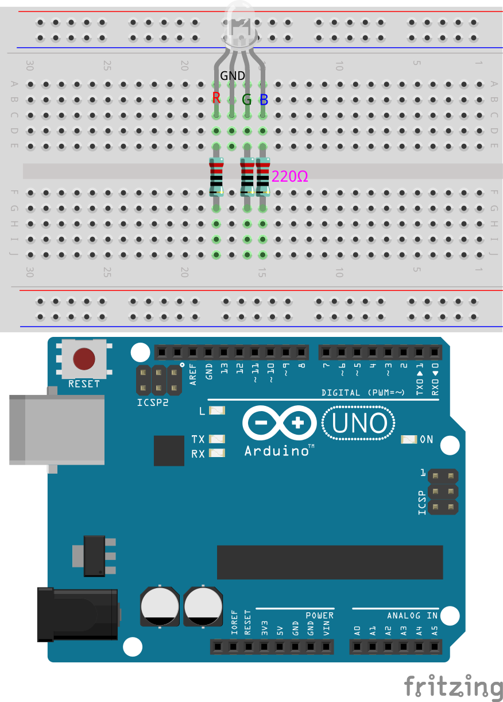

.. note::

    ¡Hola! Bienvenido a la comunidad de entusiastas de SunFounder Raspberry Pi, Arduino y ESP32 en Facebook. Sumérgete en el mundo de Raspberry Pi, Arduino y ESP32 junto a otros entusiastas.

    **¿Por qué unirte?**

    - **Soporte de expertos**: Resuelve problemas post-venta y desafíos técnicos con la ayuda de nuestra comunidad y equipo.
    - **Aprende y comparte**: Intercambia consejos y tutoriales para mejorar tus habilidades.
    - **Vistas previas exclusivas**: Obtén acceso anticipado a anuncios y adelantos de nuevos productos.
    - **Descuentos especiales**: Disfruta de descuentos exclusivos en nuestros productos más recientes.
    - **Promociones y sorteos festivos**: Participa en sorteos y promociones especiales durante las festividades.

    👉 ¿Listo para explorar y crear con nosotros? Haz clic en [|link_sf_facebook|] y únete hoy mismo.

12. Los Colores del Arcoíris
=======================================

Imagina que puedes pintar con luz, mezclando rojo, verde y azul para crear cada color imaginable, como si estuvieras combinando pinturas en una paleta, pero con haces de luz.

.. image:: img/12_rgb_mix.png
    :width: 300
    :align: center

Bienvenido a esta lección, donde explorarás el fascinante mundo de los LEDs RGB y descubrirás cómo la combinación de colores primarios puede crear un espectro vibrante de tonalidades. Este curso práctico te guiará a través de los principios de funcionamiento de los LEDs RGB y te presentará aplicaciones prácticas de la programación y la construcción de circuitos.

En esta lección aprenderás:

* Comprender los principios operativos de los LEDs RGB.
* Aprender a crear y utilizar funciones en tu código para simplificar tareas y mejorar la legibilidad.
* Explorar el impacto de las diferentes combinaciones de colores al manipular el LED RGB.

Construcción del Circuito
-----------------------------

**Componentes Necesarios**

.. list-table:: 
   :widths: 25 25 25 25
   :header-rows: 0

   * - 1 * Arduino Uno R3
     - 1 * LED RGB
     - 3 * Resistencias de 220Ω
     - Cables jumper
   * - |list_uno_r3| 
     - |list_rgb_led| 
     - |list_220ohm| 
     - |list_wire| 
   * - 1 * Cable USB
     - 1 * Protoboard
     - 1 * Multímetro
     - 
   * - |list_usb_cable| 
     - |list_breadboard| 
     - |list_meter| 
     - 
     
**Instrucciones Paso a Paso para Construir el Circuito**

Sigue el diagrama de cableado o estos pasos para construir el circuito.

.. image:: img/12_mix_color_bb_4.png
    :width: 500
    :align: center

1. Comienza con un LED RGB.

Los LEDs RGB emiten luz en varios colores al integrar LEDs de rojo, verde y azul en un solo paquete. Al variar el voltaje de entrada en los tres pines, estos LEDs pueden combinarse para producir hasta 16,777,216 colores diferentes.

.. image:: img/12_mix_color_rgb.png
    :width: 400
    :align: center

Dependiendo de su diseño, los LEDs RGB pueden ser de cátodo común o ánodo común. Para este proyecto, usaremos un LED RGB de **cátodo común**, donde los tres LEDs comparten una conexión negativa.

* Los LEDs RGB de cátodo común tienen una conexión negativa compartida.
* Los LEDs RGB de ánodo común tienen una conexión positiva compartida.

.. image:: img/12_rgb_cc_ca.jpg
    :width: 600
    :align: center

Un LED RGB típicamente tiene 4 pines; el más largo es la tierra. Al colocar el LED RGB, asegúrate de que el pin más largo esté en la segunda posición desde la izquierda, configurando los pines como Rojo, GND, Verde y Azul de izquierda a derecha.

.. image:: img/12_mix_color_rgb_1.jpg
    :width: 200
    :align: center

También puedes usar un multímetro en modo de prueba de diodos para identificar qué color emite cada pin.

Configura el multímetro en la opción **Continuidad** para medir la resistencia.

.. image:: img/multimeter_diode_measure.png
    :width: 300
    :align: center

Toca el cable negro del multímetro al pin más largo del LED RGB y toca el cable rojo a los otros pines individualmente. Verás que el LED RGB se ilumina en rojo, verde o azul, según el pin.

.. image:: img/12_mix_color_measure_pin.png
    :width: 500
    :align: center

2. Inserta el LED RGB en la protoboard, con el pin más largo en el agujero 17D, y los otros tres pines en 18C, 16C y 15C, respectivamente.

.. image:: img/12_mix_color_bb_1.png
    :width: 500
    :align: center

3. Inserta tres resistencias de 220 ohmios como se muestra, desde los agujeros 15E a 15G, 16E a 16G, y 18E a 18G.

4. Conecta estas resistencias a los pines 9, 10 y 11 del Arduino Uno R3 con cables jumper, como se ilustra.

.. image:: img/12_mix_color_bb_3.png
    :width: 500
    :align: center

5. Conecta el pin más largo del LED RGB a GND usando un cable jumper.

.. image:: img/12_mix_color_bb_4.png
    :width: 500
    :align: center

Creación de Código - Iluminando un LED RGB
----------------------------------------------

1. Abre el IDE de Arduino y comienza un nuevo proyecto seleccionando “Nuevo Sketch” en el menú “Archivo”.
2. Guarda tu sketch como ``Lesson12_Rainbow_Color`` usando ``Ctrl + S`` o haciendo clic en “Guardar”.

3. El LED en tu circuito está conectado a pines digitales en el Arduino Uno R3. Como el LED es un dispositivo de salida, deberás configurar los pines digitales 9, 10 y 11 como ``OUTPUT``.

.. code-block:: Arduino
    :emphasize-lines: 3-5

    void setup() {
        // Configura tu código aquí, se ejecuta una vez:
        pinMode(9, OUTPUT);   // Configurar el pin Azul del LED RGB como salida
        pinMode(10, OUTPUT);  // Configurar el pin Verde del LED RGB como salida
        pinMode(11, OUTPUT);  // Configurar el pin Rojo del LED RGB como salida
    }

    void loop() {
        // Código principal que se ejecuta repetidamente:
    }

4. Ahora en el ``void loop()``, configura el pin rojo del LED RGB en ``HIGH``, y los otros dos pines en ``LOW``.

.. note::

    Dado que estamos usando los pines PWM 9, 10 y 11, tienes la opción de usar ``digitalWrite()`` o ``analogWrite()`` para establecer un nivel alto o bajo.
    
    Para esta lección, como solo estamos configurando los pines en alto o bajo, utilizaremos ``digitalWrite()``.

.. code-block:: Arduino
    :emphasize-lines: 10-12

    void setup() {
        // Configura tu código aquí, se ejecuta una vez:
        pinMode(9, OUTPUT);   // Configurar el pin Azul del LED RGB como salida
        pinMode(10, OUTPUT);  // Configurar el pin Verde del LED RGB como salida
        pinMode(11, OUTPUT);  // Configurar el pin Rojo del LED RGB como salida
    }

    void loop() {
        // Código principal que se ejecuta repetidamente:
        digitalWrite(9, LOW);    // Apagar el pin Azul del LED RGB
        digitalWrite(10, LOW);   // Apagar el pin Verde del LED RGB
        digitalWrite(11, HIGH);  // Encender el pin Rojo del LED RGB
    }

5. Guarda el código y haz clic en "Subir" para enviarlo a tu Arduino Uno R3. Veamos qué sucede.

6. Verás que el LED RGB se ilumina en rojo. Pero, ¿qué pasa si quieres encender también los colores verde y azul? ¿Cómo deberías modificar el código?

Ahora copia los tres comandos ``digitalWrite()`` dos veces más. Configura el pin que deseas que se ilumine en ``HIGH`` y los otros en ``LOW``. Cada color que se encienda debería tener un segundo para brillar.

.. code-block:: Arduino
    :emphasize-lines: 14-21

    void setup() {
        // Configura tu código aquí, se ejecuta una vez:
        pinMode(9, OUTPUT);   // Configurar el pin Azul del LED RGB como salida
        pinMode(10, OUTPUT);  // Configurar el pin Verde del LED RGB como salida
        pinMode(11, OUTPUT);  // Configurar el pin Rojo del LED RGB como salida
    }

    void loop() {
        // Código principal que se ejecuta repetidamente:
        digitalWrite(9, LOW);    // Apagar el pin Azul del LED RGB
        digitalWrite(10, LOW);   // Apagar el pin Verde del LED RGB
        digitalWrite(11, HIGH);  // Encender el pin Rojo del LED RGB
        delay(1000);              // Esperar 1 segundo
        digitalWrite(9, LOW);    // Apagar el pin Azul del LED RGB
        digitalWrite(10, HIGH);  // Encender el pin Verde del LED RGB
        digitalWrite(11, LOW);   // Apagar el pin Rojo del LED RGB
        delay(1000);              // Esperar 1 segundo
        digitalWrite(9, HIGH);   // Encender el pin Azul del LED RGB
        digitalWrite(10, LOW);   // Apagar el pin Verde del LED RGB
        digitalWrite(11, LOW);   // Apagar el pin Rojo del LED RGB
        delay(1000);              // Esperar 1 segundo
    }

7. Sube el código de nuevo para ver los efectos. Verás que el LED RGB alterna entre rojo, verde y azul.

**Preguntas**:

1. Si quieres otros colores, ¿qué deberías hacer? Consulta el diagrama a continuación y escribe tus ideas en tu cuaderno.

.. image:: img/12_rgb_mix.png
    :width: 300
    :align: center

.. list-table::
   :widths: 20 20 20 20
   :header-rows: 1

   * - Color
     - Pin Rojo
     - Pin Verde
     - Pin Azul
   * - Rojo
     - *HIGH*
     - *LOW*
     - *LOW*
   * - Verde
     - *LOW*
     - *HIGH*
     - *LOW*
   * - Azul
     - *LOW*
     - *LOW*
     - *HIGH*
   * - Amarillo
     - 
     - 
     - 
   * - Rosa
     - 
     - 
     - 
   * - Cian
     - 
     - 
     - 
   * - Blanco
     - 
     - 
     - 

Creación de Código - Crear Funciones
-----------------------------------------

Es posible que hayas notado que para mostrar diferentes colores secuencialmente en el LED RGB, terminas escribiendo muchas líneas de código similar. Por ejemplo, para mostrar siete colores diferentes en el LED RGB, escribirías algo así:

.. code-block:: Arduino

    void setup() {
        // Configura tu código aquí, se ejecuta una vez:
        pinMode(9, OUTPUT);   // Configurar el pin Azul del LED RGB como salida
        pinMode(10, OUTPUT);  // Configurar el pin Verde del LED RGB como salida
        pinMode(11, OUTPUT);  // Configurar el pin Rojo del LED RGB como salida
    }

    void loop() {
        // Código principal que se ejecuta repetidamente:
        digitalWrite(9, LOW);    // Apagar el pin Azul del LED RGB
        digitalWrite(10, LOW);   // Apagar el pin Verde del LED RGB
        digitalWrite(11, HIGH);  // Encender el pin Rojo del LED RGB
        delay(1000);             // Esperar 1 segundo
        digitalWrite(9, LOW);    // Apagar el pin Azul del LED RGB
        digitalWrite(10, HIGH);  // Encender el pin Verde del LED RGB
        digitalWrite(11, LOW);   // Apagar el pin Rojo del LED RGB
        delay(1000);             // Esperar 1 segundo
        digitalWrite(9, HIGH);   // Encender el pin Azul del LED RGB
        digitalWrite(10, LOW);   // Apagar el pin Verde del LED RGB
        digitalWrite(11, LOW);   // Apagar el pin Rojo del LED RGB
        delay(1000);             // Esperar 1 segundo
        digitalWrite(9, LOW);   // Apagar el pin Azul del LED RGB
        digitalWrite(10, HIGH);   // Encender el pin Verde del LED RGB
        digitalWrite(11, HIGH);   // Encender el pin Rojo del LED RGB
        delay(1000);             // Esperar 1 segundo
        digitalWrite(9, HIGH);   // Encender el pin Azul del LED RGB
        digitalWrite(10, LOW);   // Apagar el pin Verde del LED RGB
        digitalWrite(11, HIGH);   // Encender el pin Rojo del LED RGB
        delay(1000);             // Esperar 1 segundo
        digitalWrite(9, HIGH);   // Encender el pin Azul del LED RGB
        digitalWrite(10, HIGH);   // Encender el pin Verde del LED RGB
        digitalWrite(11, LOW);   // Apagar el pin Rojo del LED RGB
        delay(1000);             // Esperar 1 segundo
        digitalWrite(9, HIGH);   // Encender el pin Azul del LED RGB
        digitalWrite(10, HIGH);   // Encender el pin Verde del LED RGB
        digitalWrite(11, HIGH);   // Encender el pin Rojo del LED RGB
        delay(1000);             // Esperar 1 segundo
    }

Es posible que hayas notado que tu función ``void loop()`` se ha vuelto bastante extensa y la lógica difícil de seguir. Este es el momento perfecto para introducir el concepto de funciones.

A lo largo de tu experiencia en programación, ya has estado utilizando funciones integradas de Arduino como ``pinMode()``, ``digitalWrite()`` y ``delay()``. Ahora, profundizaremos en la creación de funciones personalizadas. Las funciones personalizadas te permiten simplificar tu código, haciéndolo más lógico y manejable.

Para crear una función, simplemente agrégala al final de tu sketch después de la llave de cierre de ``void loop()``. Al igual que ``void setup()`` y ``void loop()``, las funciones comienzan con void, seguido del nombre que elijas. Las reglas de nomenclatura para funciones son similares a las de variables o constantes. Puedes nombrar una función con cualquier nombre que no sea una palabra clave en el IDE de Arduino, y su contenido se encierra entre llaves.

.. code-block:: Arduino
    :emphasize-lines: 9-11

    void setup() {
        ...
    }

    void loop() {
        ...
    }

    void lightRed(){
    
    }

1. Al final de tu sketch, justo después de la llave de cierre de ``void loop()``, vamos a añadir siete funciones nuevas. Cada función contendrá el código para mostrar un color específico en el LED RGB.

.. code-block:: Arduino
    :emphasize-lines: 10-22

    void loop() {
        // Código principal que se ejecuta repetidamente:
        digitalWrite(9, LOW);    // Apagar el pin Azul del LED RGB
        digitalWrite(10, LOW);   // Apagar el pin Verde del LED RGB
        digitalWrite(11, HIGH);  // Encender el pin Rojo del LED RGB
        delay(1000);             // Esperar 1 segundo
        ...
    }

    void lightRed(){
    
    }

    void lightGreen(){
    
    }

    ...

    void lightWhite(){
    
    }

2. A continuación, corta los fragmentos de código específicos de color de ``void loop()`` y pégalos en sus respectivas funciones. Esto dejará solo siete llamadas a ``delay()`` en la función ``loop()``.

.. code-block:: Arduino

    ...

    void loop() {
        // Código principal que se ejecuta repetidamente:

        delay(1000);  // Esperar 1 segundo
        delay(1000);  // Esperar 1 segundo
        delay(1000);  // Esperar 1 segundo
        delay(1000);  // Esperar 1 segundo
        delay(1000);  // Esperar 1 segundo
        delay(1000);  // Esperar 1 segundo
        delay(1000);  // Esperar 1 segundo
    }

    void lightRed() {
        digitalWrite(9, LOW);    // Apagar el pin Azul del LED RGB
        digitalWrite(10, LOW);   // Apagar el pin Verde del LED RGB
        digitalWrite(11, HIGH);  // Encender el pin Rojo del LED RGB
    }
    ...

    void lightWhite() {
        digitalWrite(9, HIGH);   // Encender el pin Azul del LED RGB
        digitalWrite(10, HIGH);  // Encender el pin Verde del LED RGB
        digitalWrite(11, HIGH);  // Encender el pin Rojo del LED RGB
    }

3. Ahora que las funciones están configuradas, es momento de llamarlas dentro de ``void loop()``. Para llamar a una función, simplemente escribe su nombre seguido de dos paréntesis y termina la línea con un punto y coma.

.. code-block:: Arduino
    :emphasize-lines: 7-22

    void setup() {
        // Configura tu código aquí, se ejecuta una vez:
        pinMode(9, OUTPUT);   // Configurar el pin Azul del LED RGB como salida
        pinMode(10, OUTPUT);  // Configurar el pin Verde del LED RGB como salida
        pinMode(11, OUTPUT);  // Configurar el pin Rojo del LED RGB como salida
    }

    void loop() {
        // Código principal que se ejecuta repetidamente:
        lightRed();
        delay(1000);  // Esperar 1 segundo
        lightGreen();
        delay(1000);  // Esperar 1 segundo
        lightBlue();
        delay(1000);  // Esperar 1 segundo
        lightYellow();
        delay(1000);  // Esperar 1 segundo
        lightPink();
        delay(1000);  // Esperar 1 segundo
        lightCyan();
        delay(1000);  // Esperar 1 segundo
        lightWhite();
        delay(1000);  // Esperar 1 segundo
    }

    void lightRed() {
        digitalWrite(9, LOW);    // Apagar el pin Azul del LED RGB
        digitalWrite(10, LOW);   // Apagar el pin Verde del LED RGB
        digitalWrite(11, HIGH);  // Encender el pin Rojo del LED RGB
    }

    void lightGreen() {
        digitalWrite(9, LOW);    // Apagar el pin Azul del LED RGB
        digitalWrite(10, HIGH);  // Encender el pin Verde del LED RGB
        digitalWrite(11, LOW);   // Apagar el pin Rojo del LED RGB
    }
    void lightBlue() {
        digitalWrite(9, HIGH);  // Encender el pin Azul del LED RGB
        digitalWrite(10, LOW);  // Apagar el pin Verde del LED RGB
        digitalWrite(11, LOW);  // Apagar el pin Rojo del LED RGB
    }
    void lightYellow() {
        digitalWrite(9, LOW);    // Apagar el pin Azul del LED RGB
        digitalWrite(10, HIGH);  // Encender el pin Verde del LED RGB
        digitalWrite(11, HIGH);  // Encender el pin Rojo del LED RGB
    }
    void lightPink() {
        digitalWrite(9, HIGH);   // Encender el pin Azul del LED RGB
        digitalWrite(10, LOW);   // Apagar el pin Verde del LED RGB
        digitalWrite(11, HIGH);  // Encender el pin Rojo del LED RGB
    }
    void lightCyan() {
        digitalWrite(9, HIGH);   // Encender el pin Azul del LED RGB
        digitalWrite(10, HIGH);  // Encender el pin Verde del LED RGB
        digitalWrite(11, LOW);   // Apagar el pin Rojo del LED RGB
    }
    void lightWhite() {
        digitalWrite(9, HIGH);   // Encender el pin Azul del LED RGB
        digitalWrite(10, HIGH);  // Encender el pin Verde del LED RGB
        digitalWrite(11, HIGH);  // Encender el pin Rojo del LED RGB
    }

4. Con todas las funciones configuradas y llamadas en el loop(), tu código ahora está completo. Haz clic en el botón "Subir" para transferir tu código al Arduino Uno R3. Verás que el LED RGB alterna entre rojo, verde, azul, amarillo, rosa, cian y blanco.

.. note::

    El brillo del LED RGB puede ser bastante intenso, así que evita mirarlo directamente por largos periodos para prevenir fatiga ocular.

    También puedes considerar difuminar la luz con un pañuelo o material opaco para suavizar el brillo.

**Resumen**

A través de una serie de ejercicios de codificación, escribirás sketches que cambian dinámicamente el color del LED. Comenzando con comandos básicos para controlar cada color, luego refactorizarás tu código para usar funciones, haciendo tu configuración más modular y fácil de mantener. Este enfoque no solo limpia el código, sino que también te enseña sobre la importancia de las funciones en la programación.

