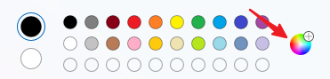
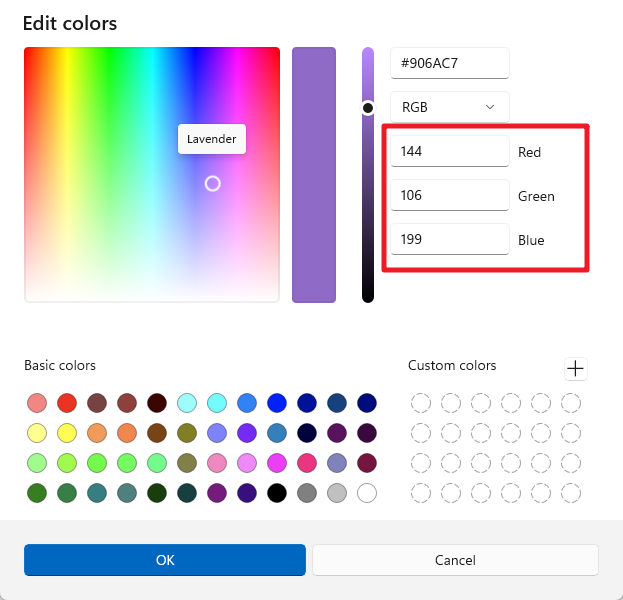

.. note::

    Bonjour, bienvenue dans la communauté des passionnés de SunFounder Raspberry Pi & Arduino & ESP32 sur Facebook ! Plongez plus profondément dans Raspberry Pi, Arduino et ESP32 avec d'autres passionnés.

    **Pourquoi nous rejoindre ?**

    - **Support d'experts** : Résolvez les problèmes après-vente et les défis techniques avec l'aide de notre communauté et de notre équipe.
    - **Apprendre et partager** : Échangez des astuces et des tutoriels pour améliorer vos compétences.
    - **Aperçus exclusifs** : Accédez en avant-première aux annonces de nouveaux produits et aux aperçus exclusifs.
    - **Réductions spéciales** : Profitez de réductions exclusives sur nos derniers produits.
    - **Promotions et cadeaux festifs** : Participez à des promotions et à des cadeaux spéciaux pendant les fêtes.

    👉 Prêt à explorer et créer avec nous ? Cliquez sur [|link_sf_facebook|] et rejoignez-nous dès aujourd'hui !

13. Le Spectre de la Vision
================================================================================
Bienvenue dans cette leçon où nous dévoilons le mystère de la perception des couleurs chez l’humain et reproduisons cette capacité avec la technologie. Dans cette leçon, nous explorerons comment nos yeux distinguent des millions de couleurs et comment cette capacité incroyable peut être simulée numériquement avec des LED RGB. En explorant l'interaction des photorécepteurs de nos yeux et du modèle de couleur RGB, vous apprendrez à recréer la vivacité du monde en forme numérique.

.. raw:: html

    <video muted controls style = "max-width:90%">
        <source src="_static/video/13_human_perception_color.mp4" type="video/mp4">
        Your browser does not support the video tag.
    </video>

**Aperçu**

Le système visuel humain peut percevoir environ dix millions de couleurs différentes, 
une capacité obtenue grâce aux cellules photoréceptrices de la rétine – les cônes et 
les bâtonnets. La perception des couleurs n'est pas linéaire ; notre système visuel 
est plus sensible aux variations de certaines couleurs qu'à d'autres. Les cônes, 
sensibles à la couleur, existent en trois types principaux, chacun étant le plus 
réceptif à la lumière rouge, verte ou bleue.

Le modèle de couleur RGB est un modèle additif dans lequel les couleurs sont créées en 
mélangeant des intensités variables de lumière rouge, verte et bleue. Dans ce modèle, 
le rouge, le vert et le bleu sont considérés comme des canaux de couleur primaires. 
En ajustant l’intensité de chaque canal (de 0 à une valeur maximale, généralement 255 
correspondant à une profondeur de couleur de 8 bits), il est possible de produire un 
spectre visible de plus de 16 millions de couleurs. Par exemple, on peut obtenir du 
orange en mélangeant plus de rouge avec moins de vert.

.. image:: img/13_mix_orange.jpg

Dans cette leçon interactive, vous appliquerez ces principes pour contrôler une LED RGB, lui permettant d'afficher les couleurs de votre choix grâce à des commandes électroniques précises.

**Objectifs d'apprentissage**

* Comprendre comment ce modèle imite la perception des couleurs humaines et son application dans les affichages numériques.
* Apprendre à utiliser la modulation de largeur d'impulsion (PWM) pour un mélange subtil des couleurs avec une LED RGB.
* Améliorer l'efficacité et la clarté de votre code en créant des fonctions prenant des paramètres dans Arduino.
* Expérimenter différentes valeurs RGB pour personnaliser les couleurs sur votre LED, reflétant la complexité de la vision des couleurs humaines.

Montage du Circuit
-----------------------

**Composants nécessaires**

.. list-table:: 
   :widths: 25 25 25 25
   :header-rows: 0

   * - 1 * Arduino Uno R3
     - 1 * LED RGB
     - 3 * Résistances de 220Ω
     - Fils de connexion
   * - |list_uno_r3| 
     - |list_rgb_led| 
     - |list_220ohm| 
     - |list_wire| 
   * - 1 * Câble USB
     - 1 * Plaque d'essai (breadboard)
     - -
     - -
   * - |list_usb_cable| 
     - |list_breadboard| 
     - -
     - -

Cette leçon utilise le même circuit que la Leçon 12.

.. image:: img/12_mix_color_bb_4.png
    :width: 600
    :align: center

Création de Code - Affichage des Couleurs
------------------------------------------------

Dans notre parcours pour maîtriser le contrôle des LED RGB, nous avons vu comment utiliser ``digitalWrite()`` pour allumer la LED dans des couleurs basiques. Pour explorer plus en profondeur et débloquer tout le spectre de couleurs qu'une LED RGB peut produire, nous allons maintenant utiliser ``analogWrite()`` pour envoyer des signaux PWM (modulation de largeur d'impulsion), ce qui nous permettra d'obtenir une large gamme de teintes.

Voyons comment implémenter cela avec du code.

1. Ouvrez l'IDE Arduino et démarrez un nouveau projet en sélectionnant « Nouveau Sketch » dans le menu « Fichier ».
2. Enregistrez votre sketch sous le nom de ``Lesson13_PWM_Color_Mixing`` en utilisant ``Ctrl + S`` ou en cliquant sur « Enregistrer ».

3. Tout d'abord, configurez les trois broches de la LED RGB en tant que sorties :

.. code-block:: Arduino
    :emphasize-lines: 3-5

    void setup() {
        // Code d'initialisation à exécuter une seule fois :
        pinMode(9, OUTPUT);   // Configurer la broche bleue de la LED RGB en sortie
        pinMode(10, OUTPUT);  // Configurer la broche verte de la LED RGB en sortie
        pinMode(11, OUTPUT);  // Configurer la broche rouge de la LED RGB en sortie
    }

4. Utilisez ``analogWrite()`` pour envoyer des valeurs PWM à la LED RGB. Dans la Leçon 9, nous avons appris que les valeurs PWM peuvent changer la luminosité d'une LED, et que la plage PWM est de 0 à 255. Pour afficher du rouge, nous réglons la valeur PWM de la broche rouge de la LED RGB à 255, et les deux autres broches à 0.

.. code-block:: Arduino
    :emphasize-lines: 10-12

    void setup() {
        // Code d'initialisation à exécuter une seule fois :
        pinMode(9, OUTPUT);   // Configurer la broche bleue de la LED RGB en sortie
        pinMode(10, OUTPUT);  // Configurer la broche verte de la LED RGB en sortie
        pinMode(11, OUTPUT);  // Configurer la broche rouge de la LED RGB en sortie
    }

    void loop() {
        // Code principal à exécuter en boucle :
        analogWrite(9, 0);    // Régler la valeur PWM de la broche bleue à 0
        analogWrite(10, 0);   // Régler la valeur PWM de la broche verte à 0
        analogWrite(11, 255);  // Régler la valeur PWM de la broche rouge à 255
    }

5. Avec cette configuration, après avoir téléchargé le code sur l'Arduino Uno R3, vous verrez la LED RGB afficher la couleur rouge.

6. La fonction ``analogWrite()`` permet à la LED RGB d'afficher non seulement les sept couleurs de base, mais également de nombreuses autres nuances. Vous pouvez maintenant ajuster les valeurs des broches 9, 10 et 11 séparément, et enregistrer les couleurs observées dans votre carnet.

.. list-table::
    :widths: 20 20 20 40
    :header-rows: 1

    *   - Broche Rouge    
        - Broche Verte  
        - Broche Bleue
        - Couleur
    *   - 0
        - 128
        - 128
        - 
    *   - 128
        - 0
        - 255
        - 
    *   - 128
        - 128
        - 255
        - 
    *   - 255
        - 128
        - 0
        -     

Création de Code - Fonctions Paramétrées
------------------------------------------------

L'utilisation de la fonction ``analogWrite()`` pour afficher différentes couleurs peut rendre votre code long si vous souhaitez afficher plusieurs couleurs en même temps. Par conséquent, nous devons créer des fonctions.

Contrairement à la leçon précédente, nous nous préparons à créer une fonction avec des paramètres.

Une fonction paramétrée vous permet de passer des valeurs spécifiques à la fonction, qui les utilisera pour effectuer ses tâches. Cela est particulièrement utile pour ajuster des propriétés telles que l'intensité des couleurs de manière dynamique. Cela rend votre code plus flexible et facile à lire.

Lorsque vous définissez une fonction paramétrée, vous spécifiez les valeurs dont elle a besoin pour fonctionner à travers des paramètres listés entre parenthèses juste après le nom de la fonction. Ces paramètres agissent comme des variables temporaires qui sont remplacées par des valeurs réelles lorsque la fonction est appelée.

Voici comment définir une fonction paramétrée pour régler la couleur d'une LED RGB :

1. Ouvrez le sketch que vous avez sauvegardé précédemment, ``Lesson13_PWM_Color_Mixing``.

2. Cliquez sur "Enregistrer sous..." dans le menu "Fichier" et renommez-le en ``Lesson13_PWM_Color_Mixing_Function``. Cliquez sur "Enregistrer".

3. Commencez par déclarer la fonction après la fonction ``void loop()`` avec le mot-clé ``void``, suivi du nom de la fonction et des paramètres entre parenthèses. Pour notre fonction ``setColor``, nous utiliserons trois paramètres—``red``, ``green`` et ``blue``—chacun représentant l'intensité du composant couleur correspondant de la LED RGB.

.. code-block:: Arduino
    :emphasize-lines: 5,6

    void loop() {
        // mettez ici votre code principal à exécuter en boucle
    }

    void setColor(int red, int green, int blue) {
    }

4. Dans le corps de la fonction, utilisez la commande ``analogWrite()`` pour envoyer des signaux PWM aux broches de la LED RGB. Les valeurs passées à ``setColor`` détermineront la luminosité de chaque couleur. Les paramètres ``red``, ``green`` et ``blue`` sont utilisés ici pour contrôler directement l'intensité de chaque broche de la LED.

.. code-block:: Arduino

    // Fonction pour définir la couleur de la LED RGB
    void setColor(int red, int green, int blue) {
        // Écrire la valeur PWM pour le rouge, le vert et le bleu sur la LED RGB
        analogWrite(11, red);
        analogWrite(10, green);
        analogWrite(9, blue);
    }

5. Vous pouvez maintenant appeler votre nouvelle fonction ``setColor()`` dans la fonction ``void loop()``. Puisque vous avez créé une fonction avec des paramètres, vous devez remplir les arguments dans les ``()`` comme ``(255, 0, 0)``. N'oubliez pas d'ajouter des commentaires.

.. code-block:: Arduino
    :emphasize-lines: 3

    void loop() {
        // mettez ici votre code principal à exécuter en boucle
        setColor(255, 0, 0); // Affiche la couleur rouge
    }

    // Fonction pour définir la couleur de la LED RGB
    void setColor(int red, int green, int blue) {
        // Écrire la valeur PWM pour le rouge, le vert et le bleu sur la LED RGB
        analogWrite(11, red);
        analogWrite(10, green);
        analogWrite(9, blue);
    }

6. Nous savons déjà qu'en fournissant différentes valeurs aux trois broches de la LED RGB, nous pouvons afficher différentes couleurs de lumière. Comment faire en sorte que la LED RGB affiche précisément la couleur que nous voulons ? Pour cela, vous aurez besoin de l'aide d'une palette de couleurs. Ouvrez **Paint** (ce logiciel est fourni avec Windows) ou tout autre logiciel de dessin sur votre ordinateur personnel.

7. Choisissez une couleur qui vous plaît et notez ses valeurs RGB.

.. note::

    Notez qu'avant de sélectionner une couleur, ajustez les lumens à la position appropriée.

8. Insérez la couleur que vous avez sélectionnée dans la fonction ``setColor()`` dans la ``void loop()``, et utilisez la fonction ``delay()`` pour spécifier la durée d'affichage de chaque couleur.

.. code-block:: Arduino

    void loop() {
        // mettez ici votre code principal à exécuter en boucle
        setColor(255, 0, 0);      // Affiche la couleur rouge
        delay(1000);              // Attendre 1 seconde
        setColor(0, 128, 128);    // Affiche la couleur turquoise
        delay(1000);              // Attendre 1 seconde
        setColor(128, 0, 255);    // Affiche la couleur violette
        delay(1000);              // Attendre 1 seconde
        setColor(128, 128, 255);  // Affiche la couleur bleu clair
        delay(1000);              // Attendre 1 seconde
        setColor(255, 128, 0);    // Affiche la couleur orange
        delay(1000);              // Attendre 1 seconde
    }

9. Voici le code complet ; vous pouvez cliquer sur "Téléverser" pour envoyer le code à l'Arduino Uno R3 et voir les effets.

.. code-block:: Arduino

    void setup() {
        // mettez ici votre code de configuration à exécuter une seule fois
        pinMode(9, OUTPUT);   // Configurer la broche bleue de la LED RGB en sortie
        pinMode(10, OUTPUT);  // Configurer la broche verte de la LED RGB en sortie
        pinMode(11, OUTPUT);  // Configurer la broche rouge de la LED RGB en sortie
    }

    void loop() {
        // mettez ici votre code principal à exécuter en boucle
        setColor(255, 0, 0);      // Affiche la couleur rouge
        delay(1000);              // Attendre 1 seconde
        setColor(0, 128, 128);    // Affiche la couleur turquoise
        delay(1000);              // Attendre 1 seconde
        setColor(128, 0, 255);    // Affiche la couleur violette
        delay(1000);              // Attendre 1 seconde
        setColor(128, 128, 255);  // Affiche la couleur bleu clair
        delay(1000);              // Attendre 1 seconde
        setColor(255, 128, 0);    // Affiche la couleur orange
        delay(1000);              // Attendre 1 seconde
    }

    // Fonction pour définir la couleur de la LED RGB
    void setColor(int red, int green, int blue) {
        // Écrire la valeur PWM pour le rouge, le vert et le bleu sur la LED RGB
        analogWrite(11, red);
        analogWrite(10, green);
        analogWrite(9, blue);
    }

10. Enfin, n'oubliez pas de sauvegarder votre code et de ranger votre espace de travail.

**Résumé**

L'exploration d'aujourd'hui sur la perception des couleurs fait le lien entre la science biologique et l'application électronique, mettant en lumière la puissance de la programmation pour donner vie à des concepts abstraits. En ajustant les valeurs RGB sur une LED, vous avez imité la manière dont l'œil perçoit les couleurs, acquérant ainsi à la fois une meilleure compréhension de la biologie humaine et des compétences avancées en contrôle électronique.
