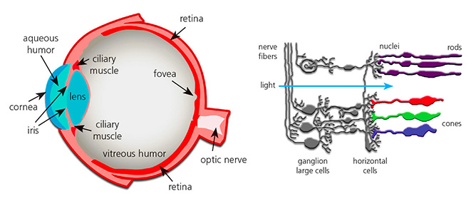
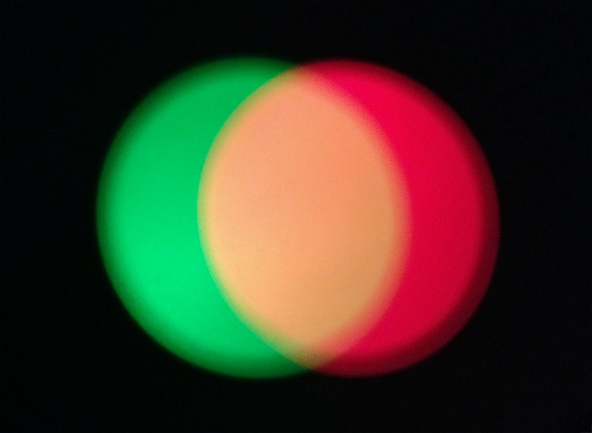

13. The Human Perception of Color
===================================

人类的视觉系统能够感知大约1000万种不同的颜色，
这是通过眼睛里的视网膜上的感光细胞——视锥细胞和视杆细胞来实现的。
这种对颜色的感知并不是线性的，也就是说，视觉系统对某些颜色的变化比对其他颜色的变化更为敏感。
视锥细胞对颜色敏感，主要分为三种，分别对红色、绿色和蓝色光最为敏感。

RGB颜色模型是一种加色模型，它通过混合不同强度的红色、绿色和蓝色光来创建出各种颜色。
在这个模型中，红色、绿色和蓝色通常被认为是基本颜色通道，
通过调整每个通道的强度（从0到最大值，通常是255对应于8位颜色深度），
可以生成超过1600万种不同的颜色的可见光。
例如，橙色可以由更多的红色和更少的绿色产生。

在这个活动中，你将让RGB灯亮出你想要的颜色。

**需要的元件**

TODO-IMAGE
1项目板
TODO-IMAGE
1 RGB LED
TODO-IMAGE
1 跳线
TODO-IMAGE
1 带测试线的万用表
TODO-IMAGE
3 个 220 欧姆的电阻

.. note::
    220 欧姆电阻的色环是： 红色，红色，黑色，黑色，棕色

**原理示意图+wiring**

【】

**构筑电路**

这个电路是沿用了章节6.1的电路。

点亮任意颜色
---------------------------------

在这个活动中，你将为 RGB LED的引脚提供不同强度的PWM信号，从而使它能够进行连续的颜色渐变。
在函数名称和存放函数命令的左大括号之间是一组小括号。
它是创建函数时就需要定义的 **参数列表**，用于将程序主体部分的变量或其他值等信息传递给该函数。
这些信息将用来完成函数的任务。

参数列表里可能有多个参数，这些参数被成为形参。（当然一个函数也可能没有形参，这样的函数的小括号是空的，就像 ``void loop()`` 一样。）
在函数执行时形参作为局部变量存在。

在这里我们设置三个不同的布尔型变量作为参数列表，用来控制三个引脚的电平。这三个变量在设置时也要遵守 ``变量类型 变量名`` 的格式来声明。

.. code-block:: Arduino
    :emphasize-lines: 1

    void lightUp(bool pin1, bool pin2, bool pin3) {

    }

   
为函数填上内容：如果某引脚对应的参数是True，则为该引脚提供高电平；如果某引脚对应的是False，则提供低电平。
那么，代码将会变成这样：

.. code-block:: Arduino
    :emphasize-lines: 2-18

    void lightUp(bool pin1, bool pin2, bool pin3) {
        if (pin1 == True) {             // If pin1 is True, turn on the first LED
            digitalWrite(9, HIGH);
        } else {                        // Otherwise, turn off the first LED
            digitalWrite(9, LOW);
        }

        if (pin2 == True) {             // If pin2 is True, turn on the second LED
            digitalWrite(10, HIGH);
        } else {                        // Otherwise, turn off the second LED
            digitalWrite(10, LOW);
        }

        if (pin3 == True) {             // If pin3 is True, turn on the third LED
            digitalWrite(11, HIGH);
        } else {                        // Otherwise, turn off the third LED
            digitalWrite(11, LOW);
        }
    }

1) 如果有必要，在 Arduino IDE 中打开你的 Lesson6_mix_color 草图。

2) 用新的名称保存草图。从 "文件 "菜单中选择 "另存为..."，草图位置应该默认为 Arduino Sketchbook。将文件命名为 "Lesson6_mix_color_plus"。点击 "保存"。

3) 目前这个草图中，有个自定的调用函数 ``lightUp()`` ，它的作用是为RGB LED的三个引脚提供电平。
现在我们要将其改造一番，让它可以为RGB LED的三个引脚提供模拟值。从而改变三原色光各自的强度，组合成丰富的颜色。

为此，我们需要在两个方面修改这个函数：

    1. 修改为用analogWrite()来为RGB LED引脚供电。
    2. 将传参修改为各个基本颜色通道的强度。(因为PWM值的范围为0-255，而非电平那样是个二极性的数值，因此需要将变量从bool型改为int型)

.. code-block:: Arduino

    void lightUp(int value1, int value2, int value3) {
        Serial.print("pin value:");
        Serial.print(value1);
        Serial.print(" , ");
        Serial.print(value2);
        Serial.print(" , ");
        Serial.println(value3);  

        analogWrite(9, value1);
        analogWrite(10, value2);
        analogWrite(11, value3);
    }

6) 在  void loop() 里面使用该函数，为其写入三个通道的强度。现在，请尝试写入这几个数值 (255，98，183)，看看是否出现了新奇的颜色？请描述下这个颜色。

.. code-block:: Arduino
    :emphasize-lines: 8

    void setup() {
        pinMode(9, OUTPUT);             // Declare the RGB LED pin1 as output
        pinMode(10, OUTPUT);            // Declare the RGB LED pin2 as output
        pinMode(11, OUTPUT);            // Declare the RGB LED pin2 as output
        Serial.begin(9600);
    }

    void loop(){
        lightUp(255, 98, 183);               // Call the lightUp function to control the RGB LED
    }

    void lightUp(int value1, int value2, int value3) {
        Serial.print("pin value:");
        Serial.print(value1);
        Serial.print(" , ");
        Serial.print(value2);
        Serial.print(" , ");
        Serial.println(value3);  

        analogWrite(9, value1);
        analogWrite(10, value2);
        analogWrite(11, value3);
    }

7) 点击“上传”按钮，将草图上传到你的 Arduino 板。

*请描述一下你看到的颜色。并且尝试以下几种数值组合，在手册中记录下看到的颜色。*

.. list-table::
    :widths: 20 20 20 40
    :header-rows: 1

    *   - Value1	
        - Value2	
        - Value3
        - Color
    *   - 255
        - 98
        - 183
        - 
    *   - 122
        - 236
        - 255
        - 
    *   - 255
        - 195
        - 80
        - 
    *   - 244
        - 255
        - 120
        -     

亮出自己想要的颜色
----------------------------------

我们已经知道，通过给RGB LED 的三个引脚提供不同的值，可以亮出不同的灯光颜色。
那么，如何让RGB LED亮出我正好想要的颜色呢？这就需要一个调色盘的辅助了。

在你的个人计算机中，打开 paint （这是Windows系统自带的软件）或者任意的绘图软件。找到自定义颜色。

.. image:: img/6_mix_color_paint.png

选择一个你喜欢的颜色，记录下它的RGB值。

.. image:: img/6_mix_color_paint_2.png

将你选中的颜色填入代码。其中R值填入value1，G值填入value2，B值填入value3。

.. code-block:: Arduino
    :emphasize-lines: 9

    void setup() {
        pinMode(9, OUTPUT);             // Declare the RGB LED pin1 as output
        pinMode(10, OUTPUT);            // Declare the RGB LED pin2 as output
        pinMode(11, OUTPUT);            // Declare the RGB LED pin2 as output
        Serial.begin(9600);
    }

    void loop(){
        lightUp(144, 109, 199);               // Call the lightUp function to control the RGB LED
    }

    void lightUp(int value1, int value2, int value3) {
        Serial.print("pin value:");
        Serial.print(value1);
        Serial.print(" , ");
        Serial.print(value2);
        Serial.print(" , ");
        Serial.println(value3);  

        analogWrite(9, value1);
        analogWrite(10, value2);
        analogWrite(11, value3);
    }

点击“上传”按钮，将草图上传到你的 Arduino 板。

*让RGB LED多亮出几种你喜欢的颜色，将RGB值记录在handbook上。*

点击 “保存” 来保存你的草图。