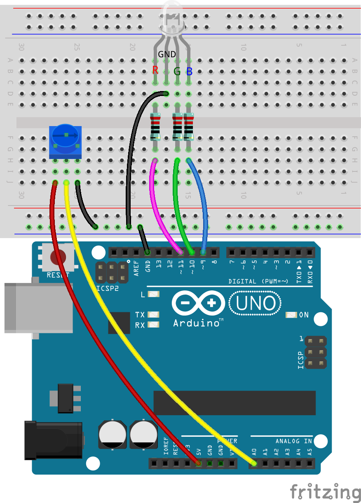
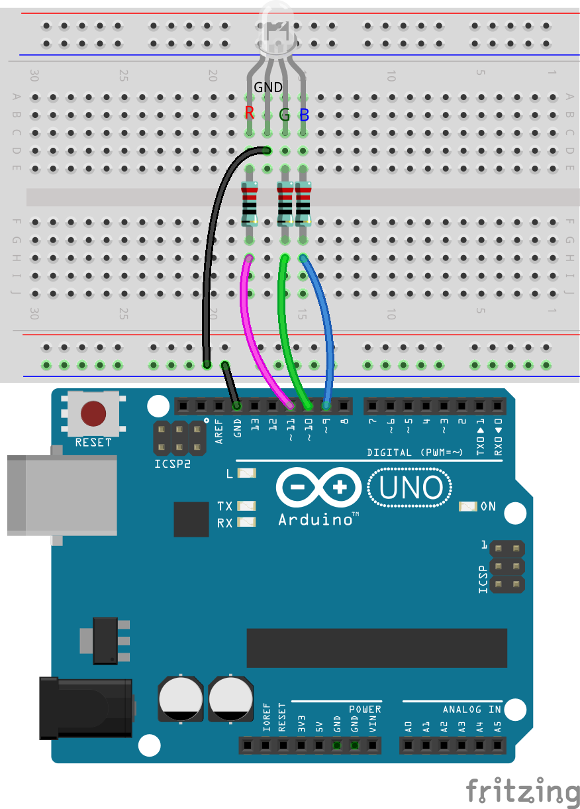
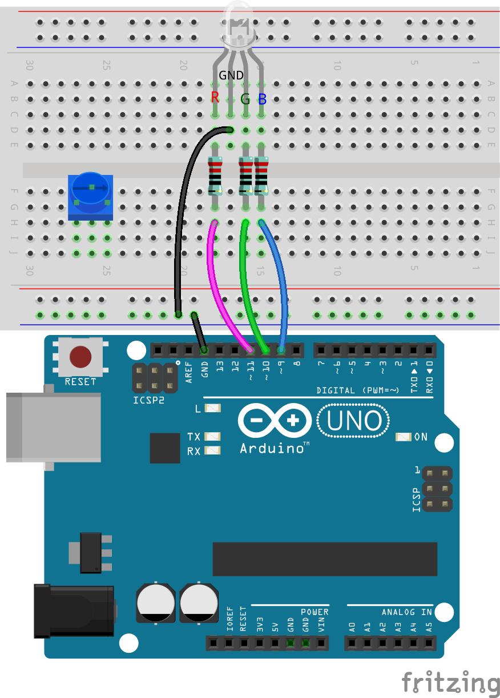
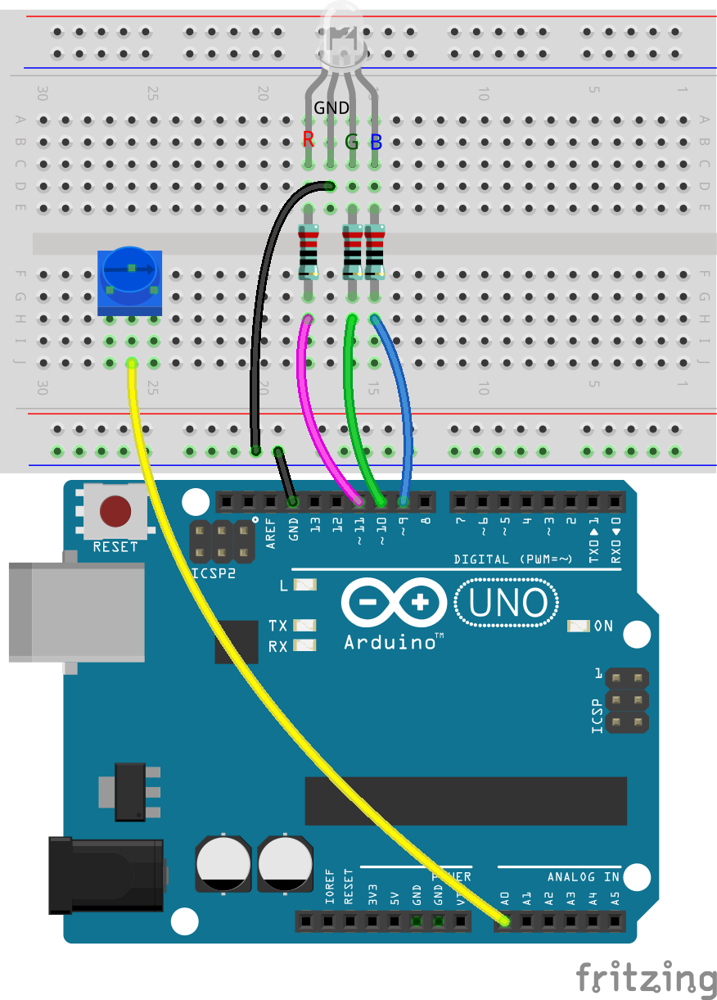
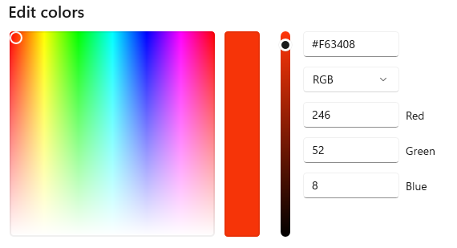
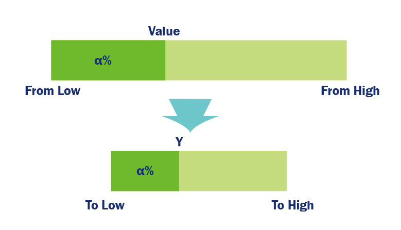

.. note::

    こんにちは、SunFounderのRaspberry Pi & Arduino & ESP32愛好者コミュニティへようこそ！Facebookで仲間と一緒にRaspberry Pi、Arduino、ESP32の深い世界へ飛び込みましょう。

    **なぜ参加するのか？**

    - **専門的なサポート**：アフターサービスの問題や技術的な課題をコミュニティとチームの助けを借りて解決します。
    - **学びと共有**：スキルを向上させるためのヒントやチュートリアルを交換します。
    - **独占プレビュー**：新製品の発表や予告をいち早く入手できます。
    - **特別割引**：最新製品の独占割引を楽しめます。
    - **祝祭プロモーションとギブアウェイ**：ギブアウェイや休日のプロモーションに参加できます。

    👉 探索し、共に創造する準備ができましたか？ [|link_sf_facebook|] をクリックして、今すぐ参加しましょう！

15. クールカラーとウォームカラー
==================================

色は私たちの視覚体験の一部であるだけでなく、感情や気分にも影響を与えます。このレッスンでは、色の心理的影響について掘り下げ、RGB LEDを操作して暖色と寒色を切り替える方法を学び、光の温度の変化を模倣します。

.. raw:: html

    <video muted controls style = "max-width:90%">
        <source src="_static/video/15_cool_warm_color.mp4" type="video/mp4">
        Your browser does not support the video tag.
    </video>

**概要**

クールカラーとウォームカラーの概念は、色が私たちの認識に与える心理的な影響に関連しています。赤、オレンジ、黄色、茶色は通常、暖かさと興奮を呼び起こすため、ウォームカラーと分類されます。一方、緑、青、紫はしばしば落ち着き、爽快感、広がりを与え、クールカラーとされています。オレンジと青は、この暖かい－冷たいスペクトルの反対側に位置します。

家庭やレジャー環境では、薄い黄色やオフホワイトの照明が好まれ、日没やろうそくの光を浴びているような居心地の良い雰囲気を作り出します。

図書館、教室、オフィス、病院では、集中力や爽快感を促進するため、クールな色調の照明が好まれ、学習や作業に適した環境を提供します。

光の温かさや冷たさは、私たちの心理的反応や視覚的快適さに大きく影響します。デザイナーや照明エンジニアは、空間の機能と望ましい雰囲気に適した色温度を慎重に選び、美的にも実用的にも優れた照明環境を作り出します。これらの原則を科学的に応用することで、生活と仕事の環境の質を向上させ、より健康で快適な雰囲気を作り出すことができます。

このレッスンでは、照明エンジニアの役割を担い、色温度を切り替える照明システムを作成します。

**学習目標**

- クールカラーとウォームカラーの心理的効果を理解する。
- 光の温度が気分や設定に与える影響を探る。
- RGB LEDの色を調整して異なる温度をシミュレートする方法をArduinoを使って学ぶ。
- ``map()`` 関数を使って色温度を移行させる実用的なスキルを身につける。

回路の構築
------------------------------------

**必要なコンポーネント**

.. list-table:: 
   :widths: 25 25 25 25
   :header-rows: 0

   * - 1 * Arduino Uno R3
     - 1 * RGB LED
     - 3 * 220Ω抵抗
     - 1 * ポテンショメータ
   * - |list_uno_r3| 
     - |list_rgb_led| 
     - |list_220ohm| 
     - |list_potentiometer| 
   * - 1 * USBケーブル
     - 1 * ブレッドボード
     - ジャンパーワイヤ
     -
   * - |list_usb_cable| 
     - |list_breadboard| 
     - |list_wire| 
     -
     
**構築ステップ**

この回路は、レッスン12のものにポテンショメータを追加して構築します。

1. Arduino Uno R3のGNDピンからRGB LEDのGNDピンに接続されているジャンパーワイヤを取り外し、それをブレッドボードの負端子に挿入します。次に、負端子からRGB LEDのGNDピンにジャンパーワイヤを接続します。

2. ポテンショメータを穴25G、26F、27Gに挿入します。

3. ポテンショメータの中央のピンをArduino Uno R3のA0ピンに接続します。

4. 最後に、ポテンショメータの左のピンをArduino Uno R3の5Vピンに、右のピンをブレッドボードの負端子に接続します。

コードの作成
---------------------

**ウォームカラーとクールカラーの理解**

色温度を調整する前に、クールカラーとウォームカラーのRGB値の違いを理解する必要があります。

照明の暖かさの認識は主観的な部分もありますが、ウォームカラーはオレンジ－赤に傾き、クールカラーは青に傾くことは間違いありません。

1. **ペイント** または任意のカラーピッキングツールを開き、最も暖かい色と最も涼しい色を見つけ、そのRGB値をハンドブックに記録します。

.. note::

    色を選択する前に、ルーメンを適切な位置に調整してください。

.. list-table::
   :widths: 25 25 50 25
   :header-rows: 1

   * - 色の種類
     - 赤
     - 緑
     - 青
   * - ウォームカラー
     -
     -
     -
   * - クールカラー
     -
     -
     -

2. 以下にウォームトーンとクールトーンの例とそのRGB値を示します：

* レッド (赤: 246, 緑: 52, 青: 8)

* ライトブルー (赤: 100, 緑: 150, 青: 255)

.. image:: img/15_mix_color_tone_cool.png

ウォームカラーとクールカラーの主な違いは、三つの主要な色の強度の比率です。次に、これらのウォームカラーとクールカラーのRGB値をスケッチに保存します。

3. 以前に保存したスケッチ ``Lesson13_PWM_Color_Mixing`` を開きます。

4. 「ファイル」メニューから「名前を付けて保存」を選択し、``Lesson15_Cool_Warm_Color`` に名前を変更します。「保存」をクリックします。

5. ``void setup()`` の前に、これら二つの色のRGB値を保存するための六つの変数を宣言します。選択した色を使用します。

.. code-block:: Arduino
    :emphasize-lines: 1-4,6-9

    // ウォームカラーのRGB値
    int warm_r = 246;
    int warm_g = 52;
    int warm_b = 8;

    // クールカラーのRGB値
    int cool_r = 100;
    int cool_g = 150;
    int cool_b = 255;

    void setup() {
        // 初期設定コードをここに記述します：
        pinMode(9, OUTPUT);   // RGB LEDのブルーピンを出力に設定
        pinMode(10, OUTPUT);  // RGB LEDのグリーンピンを出力に設定
        pinMode(11, OUTPUT);  // RGB LEDのレッドピンを出力に設定
    }

**map() 関数の使用**

ウォームからクールの照明に移行するには、赤色光の強度を減らし、青色光を増やし、緑色光の強度を微調整するだけです。

以前のプロジェクトでは、ポテンショメータの回転に応じてLEDの明るさを変化させる方法を学びました。

しかし、このプロジェクトでは、ポテンショメータの回転が特定の範囲内でRGBピンの強度を変化させるため、単純な分割では不十分です。したがって、新しい関数 ``map()`` が必要です。

Arduinoプログラミングにおいて、 ``map()``  関数は非常に便利で、数値範囲を別の範囲にマップ（または変換）することができます。

使い方は以下の通りです：

* ``map(value, fromLow, fromHigh, toLow, toHigh)``：数値をある範囲から別の範囲に再マップします。つまり、 ``fromLow``  の値は ``toLow`` に、 ``fromHigh``  の値は ``toHigh`` に、間の値は間の値にマップされます。

    **パラメータ**
        * ``value``：マップする数値。
        * ``fromLow``：現在の範囲の下限。
        * ``fromHigh``：現在の範囲の上限。
        * ``toLow``：対象範囲の下限。
        * ``toHigh``：対象範囲の上限。

    **戻り値**
        マップされた値。データ型：long。

``map()`` 関数は、元の範囲（fromLowからfromHigh）から新しい範囲（toLowからtoHigh）に値をスケーリングします。まず、 ``value``  の元の範囲内の位置を計算し、この位置を新しい範囲にスケーリングします。

したがって、次の式で表すことができます：

.. code-block::

    (value-fromLow)/(fromHigh-fromLow) = (y-toLow)/(toHigh-toLow)

代数を使って、この式を再配置して ``y`` を解くことができます：

.. code-block::

    y = (value-fromLow) * (toHigh-toLow) / (fromHigh-fromLow) + toLow

たとえば、 ``y = map(value, 0, 1023, 246, 100);``  を使用すると、 ``value``  が434の場合、 ``y = (434-0) * (100 - 246) / (1023-0) + 246``  となり、おおよそ152になります。

6. ``void loop()`` の元のコードを削除し、ポテンショメータの値を読み取り、変数 ``potValue`` に格納するコードを記述します。

.. code-block:: Arduino

    void loop() {
        // put your main code here, to run repeatedly:
        int potValue = analogRead(A0);                         // Read value from potentiometer
    }

7. 次に、 ``map()`` 関数を使用して、ポテンショメータの値を0～1023の範囲から255（ ``warm_r`` ）～100（ ``cool_r`` ）の範囲にマップします。

.. code-block:: Arduino

    void loop() {
        // put your main code here, to run repeatedly:
        int potValue = analogRead(A0);                         // Read value from potentiometer
        int value_r = map(potValue, 0, 1023, warm_r, cool_r);  // Map pot value to red intensity
    }

8. シリアルモニタを使用して、 ``potValue``  とマップされた値 ``value_r`` を表示し、 ``map()``  関数の理解を深めます。 ``void setup()``  でシリアルモニタを開始します。

.. code-block:: Arduino
    :emphasize-lines: 6

    void setup() {
        // 初期設定コードをここに記述します：
        pinMode(9, OUTPUT);   // RGB LEDのブルーピンを出力に設定
        pinMode(10, OUTPUT);  // RGB LEDのグリーンピンを出力に設定
        pinMode(11, OUTPUT);  // RGB LEDのレッドピンを出力に設定
        Serial.begin(9600);        // 9600ボーでシリアル通信を設定
    }

9. 変数 ``potValue`` と ``value_r`` を同じ行に "|" で区切って表示します。

.. code-block:: Arduino
    :emphasize-lines: 23-26

    // ウォームカラーのRGB値
    int warm_r = 246;
    int warm_g = 52;
    int warm_b = 8;

    // クールカラーのRGB値
    int cool_r = 100;
    int cool_g = 150;
    int cool_b = 255;

    void setup() {
        // 初期設定コードをここに記述します：
        pinMode(9, OUTPUT);   // RGB LEDのブルーピンを出力に設定
        pinMode(10, OUTPUT);  // RGB LEDのグリーンピンを出力に設定
        pinMode(11, OUTPUT);  // RGB LEDのレッドピンを出力に設定
        Serial.begin(9600);        // 9600ボーでシリアル通信を設定
    }

    void loop() {
        // 繰り返し実行されるメインコードをここに記述します：
        int potValue = analogRead(A0);                         // ポテンショメータの値を読み取る
        int value_r = map(potValue, 0, 1023, warm_r, cool_r);  // ポット値を赤の強度にマップする
        Serial.print(potValue);
        Serial.print(" | ");
        Serial.println(value_r);
        delay(500);  // 500ms待機
    }

    // RGB LEDの色を設定する関数
    void setColor(int red, int green, int blue) {
        analogWrite(11, red);    // 赤ピンにPWMを書き込む
        analogWrite(10, green);  // 緑ピンにPWMを書き込む
        analogWrite(9, blue);    // 青ピンにPWMを書き込む
    }

10. コードを検証してアップロードし、シリアルモニタを開くと、2列のデータが表示されることが確認できます。

.. code-block::

    434 | 152
    435 | 152
    434 | 152
    434 | 152
    434 | 152
    434 | 152

このデータから、範囲0〜1023内の値434の位置が、範囲246〜100内の値152の位置に対応していることがわかります。

**色温度の調整**

ここでは、ポテンショメータの回転に伴いRGB LEDの3つのピンの強度が変化し、最も暖かい色から最も冷たい色に移行するように ``map()`` 関数を使用します。
具体的には、提供した参照値を用いて、ポテンショメータを回転させると、RGB LEDのR値が246から100に、G値が8から150に（G値の変化はあまり顕著ではないものの）、B値が8から255に徐々に変化します。

11. 次に、シリアル印刷は一時的に必要ないので、シリアル印刷はコード全体の処理に影響を与えるため、 ``Ctrl + /`` を使って関連コードをコメントアウトします。

    .. note::

        直接削除しない理由は、後で印刷が必要になった場合に、再度記述する必要がなく、これらの行を選択して ``Ctrl + /`` を押すだけでコメント解除できるためです。

.. code-block:: Arduino
    :emphasize-lines: 3,4

    void loop() {
        // 繰り返し実行されるメインコードをここに記述します：
        int potValue = analogRead(A0);                         // ポテンショメータの値を読み取る
        int value_r = map(potValue, 0, 1023, warm_r, cool_r);  // ポット値を赤の強度にマップする
        // Serial.print(potValue);
        // Serial.print(" | ");
        // Serial.println(value_r);
        // delay(500);  // 500ms待機
    }

12. 続けて、 ``map()`` 関数を呼び出し、ポテンショメータの値に基づいてマップされた ``value_g`` および ``value_b`` を取得します。

.. code-block:: Arduino
    :emphasize-lines: 9,10

    void loop() {
        // 繰り返し実行されるメインコードをここに記述します：
        int potValue = analogRead(A0);                         // ポテンショメータの値を読み取る
        int value_r = map(potValue, 0, 1023, warm_r, cool_r);  // ポット値を赤の強度にマップする
        // Serial.print(potValue);
        // Serial.print(" | ");
        // Serial.println(value_r);
        // delay(500);  // 500ms待機
        int value_g = map(potValue, 0, 1023, warm_g, cool_g);  // ポット値を緑の強度にマップする
        int value_b = map(potValue, 0, 1023, warm_b, cool_b);  // ポット値を青の強度にマップする
    }

13. 最後に、 ``setColor()`` 関数を呼び出して、マップされたRGB値をRGB LEDに表示させます。

.. code-block:: Arduino
    :emphasize-lines: 11,12

    void loop() {
        // 繰り返し実行されるメインコードをここに記述します：
        int potValue = analogRead(A0);                         // ポテンショメータの値を読み取る
        int value_r = map(potValue, 0, 1023, warm_r, cool_r);  // ポット値を赤の強度にマップする
        // Serial.print(potValue);
        // Serial.print(" | ");
        // Serial.println(value_r);
        // delay(500);  // 500ms待機
        int value_g = map(potValue, 0, 1023, warm_g, cool_g);  // ポット値を緑の強度にマップする
        int value_b = map(potValue, 0, 1023, warm_b, cool_b);  // ポット値を青の強度にマップする
        setColor(value_r, value_g, value_b);                   // LEDの色を設定する
        delay(500);
    }

14. 以下は完成したコードです。「Upload」ボタンをクリックしてArduino Uno R3にコードをアップロードしてください。その後、ポテンショメータを回すと、RGB LEDが冷たい色から暖かい色、または暖かい色から冷たい色にゆっくりと変化するのがわかります。

.. code-block:: Arduino

    // 暖色のRGB値
    int warm_r = 246;
    int warm_g = 52;
    int warm_b = 8;

    // 冷色のRGB値
    int cool_r = 100;
    int cool_g = 150;
    int cool_b = 255;

    void setup() {
        // 初期設定をここに記述します：
        pinMode(9, OUTPUT);   // RGB LEDの青ピンを出力に設定
        pinMode(10, OUTPUT);  // RGB LEDの緑ピンを出力に設定
        pinMode(11, OUTPUT);  // RGB LEDの赤ピンを出力に設定
    }

    void loop() {
        // 繰り返し実行されるメインコードをここに記述します：
        int potValue = analogRead(A0);                         // ポテンショメータの値を読み取る
        int value_r = map(potValue, 0, 1023, warm_r, cool_r);  // ポット値を赤の強度にマップする
        // Serial.print(potValue);
        // Serial.print(" | ");
        // Serial.println(value_r);
        // delay(500);  // 500ms待機
        int value_g = map(potValue, 0, 1023, warm_g, cool_g);  // ポット値を緑の強度にマップする
        int value_b = map(potValue, 0, 1023, warm_b, cool_b);  // ポット値を青の強度にマップする
        setColor(value_r, value_g, value_b);                   // LEDの色を設定する
        delay(500);                                            // 500ms待機
    }

    // RGB LEDの色を設定する関数
    void setColor(int red, int green, int blue) {
        analogWrite(11, red);    // 赤ピンにPWMを書き込む
        analogWrite(10, green);  // 緑ピンにPWMを書き込む
        analogWrite(9, blue);    // 青ピンにPWMを書き込む
    }

15. 最後に、コードを保存し、作業スペースを整理整頓することを忘れないでください。

**ヒント**

実験中に、暖かい色と冷たい色の変化が画面上で見るほど明確でないことがあるかもしれません。例えば、予想される暖かい光が白く見えることがあります。これは正常で、RGB LEDの色混合はディスプレイ上のように精巧ではないためです。

そのような場合、暖色のG値とB値の強度を下げることで、RGB LEDがより適切な色を表示するように調整できます。

**質問**

「下限」が「上限」よりも大きい、または小さい場合があるため、 ``map(value, fromLow, fromHigh, toLow, toHigh)`` 関数は数値の範囲を逆転させるためにも使用できます。例えば：

.. code-block::

    y = map(x, 1, 50, 50, 1);

この関数は負の数も適切に処理するため、次の例も有効で正常に動作します。

.. code-block::

    y = map(x, 1, 50, 50, -100);

``y = map(x, 1, 50, 50, -100);``の場合、 ``x`` が20なら、 ``y`` は何になるでしょうか。以下の式を参照して計算してください。

