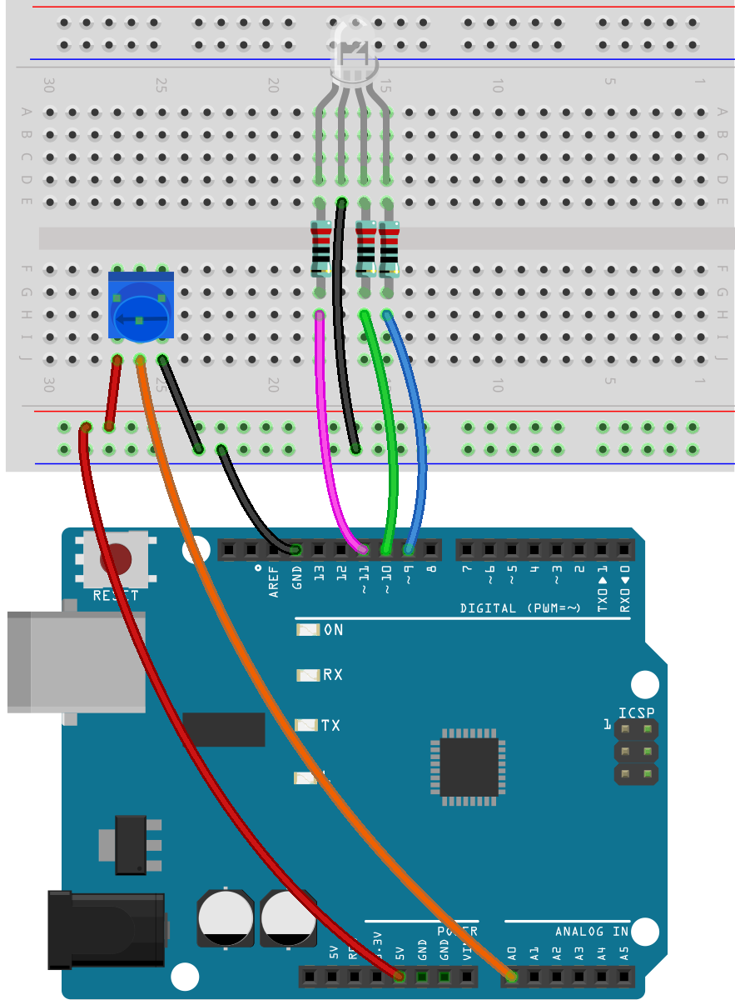

15. 随机色彩
======================

生活需要点惊喜，在你百般聊赖的时候，不妨让随机数做决定。
这个活动中，你将让RGB LED亮出随机颜色。

**需要的元件**

TODO-IMAGE
1项目板
TODO-IMAGE
1 RGB LED
TODO-IMAGE
1 跳线
TODO-IMAGE
1 带测试线的万用表
TODO-IMAGE
3 个 220 欧姆的电阻

.. note::
    220 欧姆电阻的色环是： 红色，红色，黑色，黑色，棕色

**原理示意图+wiring**

【】

**构筑电路**

这个电路沿用了章节6.1的电路。

亮出随机色彩
^^^^^^^^^^^^^^^^^^^^

**创建代码文件**

如果有必要，在 Arduino IDE 中打开你的 Lesson6_mix_color_plus 草图。

用新的名称保存草图。从 "文件 "菜单中选择 "另存为..."，草图位置应该默认为 Arduino Sketchbook。
将文件命名为 "Lesson6_mix_color_random"。点击 "保存"。

**random()**

物理世界中充满了随机数，编程则不然，编程中所谓的“随机”数，通常是通过一种确定性的算法计算得出的。
这种算法通常需要一个起始点，称为“种子”（seed）。
这意味着它们实际上是可以预测的，因此被称为“伪随机”数。
这里的“伪”（pseudo）前缀指的是这些随机数看似随机，但实际上是有规律的。

但是，有趣的是，R3板这种可以用现实世界的物理数值来作为种子。（在你用电表测量的过程中，你能看到电路中的电压和电流数值是会有微弱的抖动的。）
这就可以给随机数提供不可预测性。

Arduino编程中的随机数由以下几个函数组成。

* 初始化随机数生成器的种子值。这个函数确保了随机数序列的起点在每次程序运行时都能有所不同，从而生成不同的随机数序列

``randomSeed(analogRead(0));``

    参数:
        * seed: 用于初始化随机数生成器的种子值。这个值是一个 unsigned long 类型的数，它确定了随机数序列的开始点。
    返回值：
        没有返回值。

* 当你需要在一个指定的范围内生成一个随机数时，可以使用以下原型：

``long random(long max);``

    参数:
        max: 生成的随机数的上限（不包含max本身）。这意味着生成的随机数会在0（包含）到max-1（包含）之间。
    
    返回值:
        返回一个long类型的数值，位于0到max-1之间。

* 如果你想要在一个指定的上下限范围内生成一个随机数，可以使用以下原型：

``long random(long min, long max);``

    参数:
        min: 生成的随机数的下限（包含min本身）。
        max: 生成的随机数的上限（不包含max本身）。这意味着生成的随机数会在min（包含）到max-1（包含）之间。
    
    返回值:
        返回一个long类型的数值，位于min到max-1之间。

**编写代码**

randomSeed()仅需在setup()函数中调用一次，以初始化种子。需要注意避免使用固定的种子值，因为这会导致每次程序运行时生成相同的随机数序列。

因此，我们使用analogRead(0)读取第0个模拟输入引脚的值，
由于该引脚未连接，它会读取到噪声，这些噪声每次读取时都是不同的，从而为randomSeed()提供了一个好的种子值。

.. code-block:: Arduino
    :emphasize-lines: 12

    void setup() {
         // Set the RGB LED pins as output
        pinMode(9, OUTPUT);             // Declare the red pin as output
        pinMode(10, OUTPUT);            // Declare the green pin as output
        pinMode(11, OUTPUT);            // Declare the blue pin as output

        // Initialize serial communication at 9600 bits per second:
        Serial.begin(9600);

        // Initialize random seed based on an unconnected analog pin
        // This ensures a different sequence of random numbers on each reset
        randomSeed(analogRead(0));
    }

生成三个随机值。作为RGB LED的R值，G值，和B值。

.. code-block:: Arduino
    :emphasize-lines: 3-5

    void loop(){
        // Generate random values for each color component
        int redValue = random(0, 256);   // Random value between 0 and 255
        int greenValue = random(0, 256); // Random value between 0 and 255
        int blueValue = random(0, 256);  // Random value between 0 and 255

        ... ...
    }

将生成的RGB值写入lightUp()，让RGB LED能够发出该色彩。

.. code-block:: Arduino
    :emphasize-lines: 22

    void setup() {
         // Set the RGB LED pins as output
        pinMode(9, OUTPUT);             // Declare the red pin as output
        pinMode(10, OUTPUT);            // Declare the green pin as output
        pinMode(11, OUTPUT);            // Declare the blue pin as output

        // Initialize serial communication at 9600 bits per second:
        Serial.begin(9600);

        // Initialize random seed based on an unconnected analog pin
        // This ensures a different sequence of random numbers on each reset
        randomSeed(analogRead(0));
    }

    void loop(){
        // Generate random values for each color component
        int redValue = random(0, 256);   // Random value between 0 and 255
        int greenValue = random(0, 256); // Random value between 0 and 255
        int blueValue = random(0, 256);  // Random value between 0 and 255
        
        // Set the RGB LED to the random color
        lightUp(redValue, greenValue, blueValue);               // Call the lightUp function to control the RGB LED
    
        // Wait for 1 second before changing the color again
        delay(1000);
    }

    void lightUp(int value1, int value2, int value3) {
       // Print the color values to the serial monitor
        Serial.print("pin value:");
        Serial.print(value1);
        Serial.print(" , ");
        Serial.print(value2);
        Serial.print(" , ");
        Serial.println(value3);  

        analogWrite(9, value1);
        analogWrite(10, value2);
        analogWrite(11, value3);
    }

点击“上传”按钮，将草图上传到你的 Arduino 板。此时你可以看到RGB LED会每隔一秒变化一次颜色。