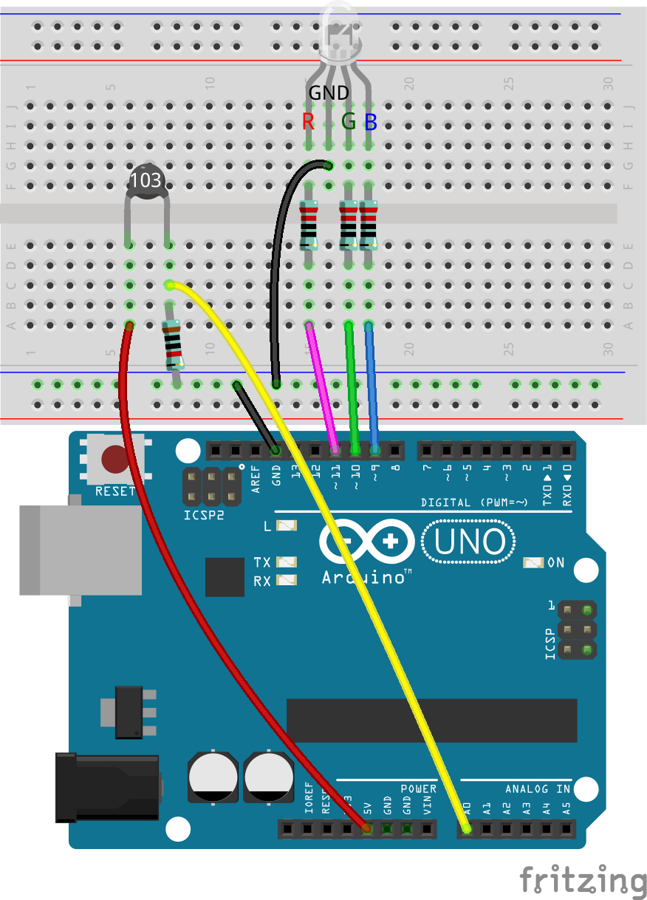
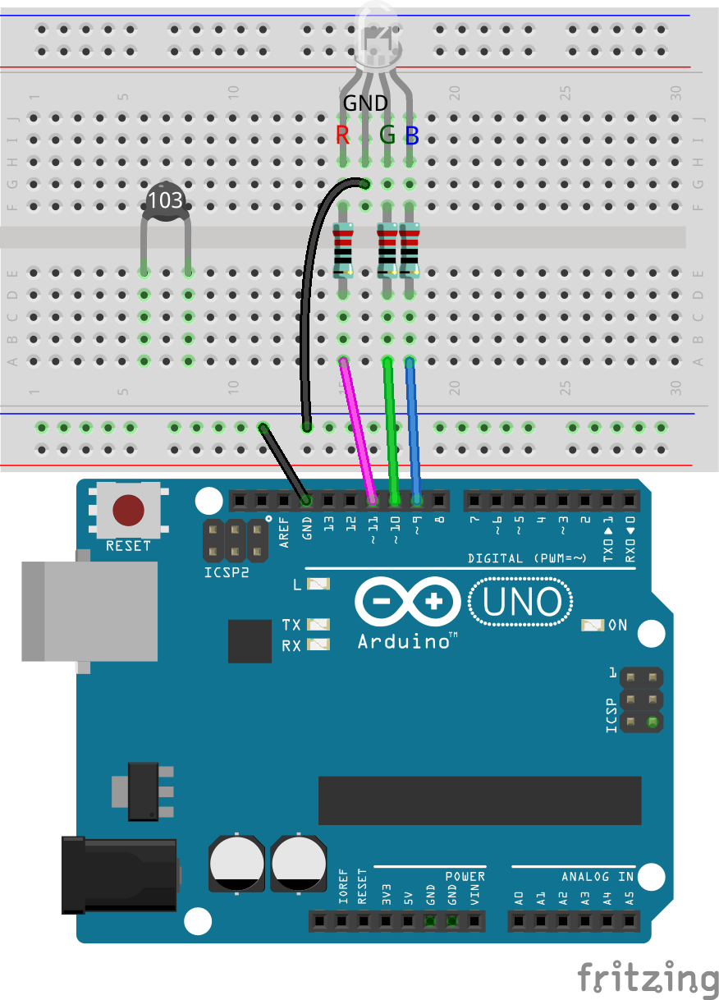
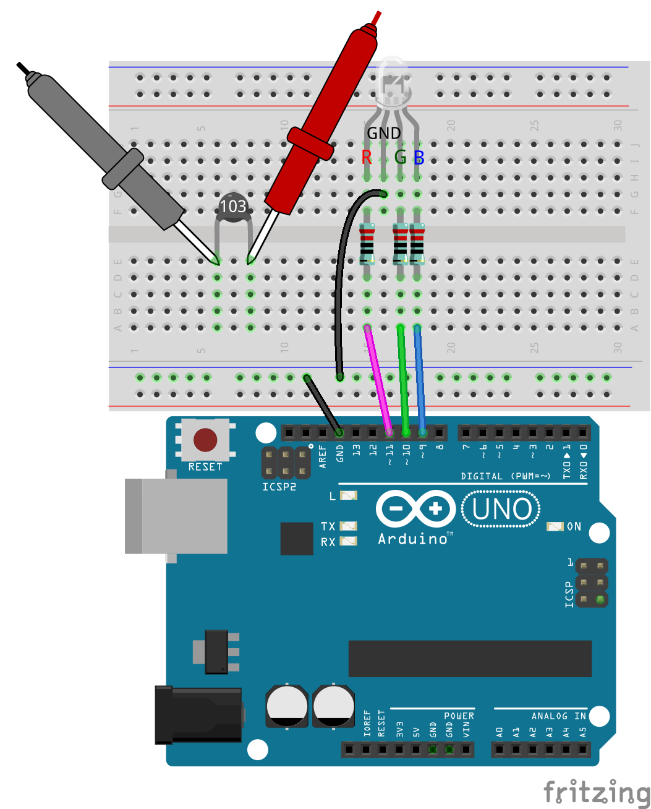
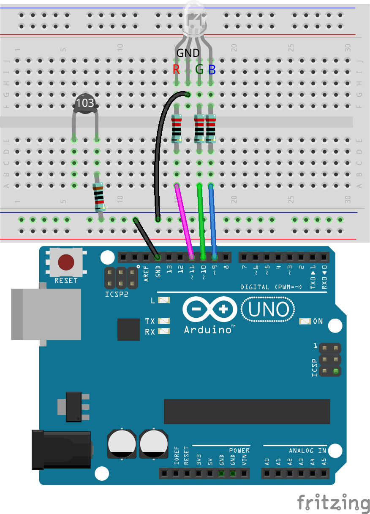
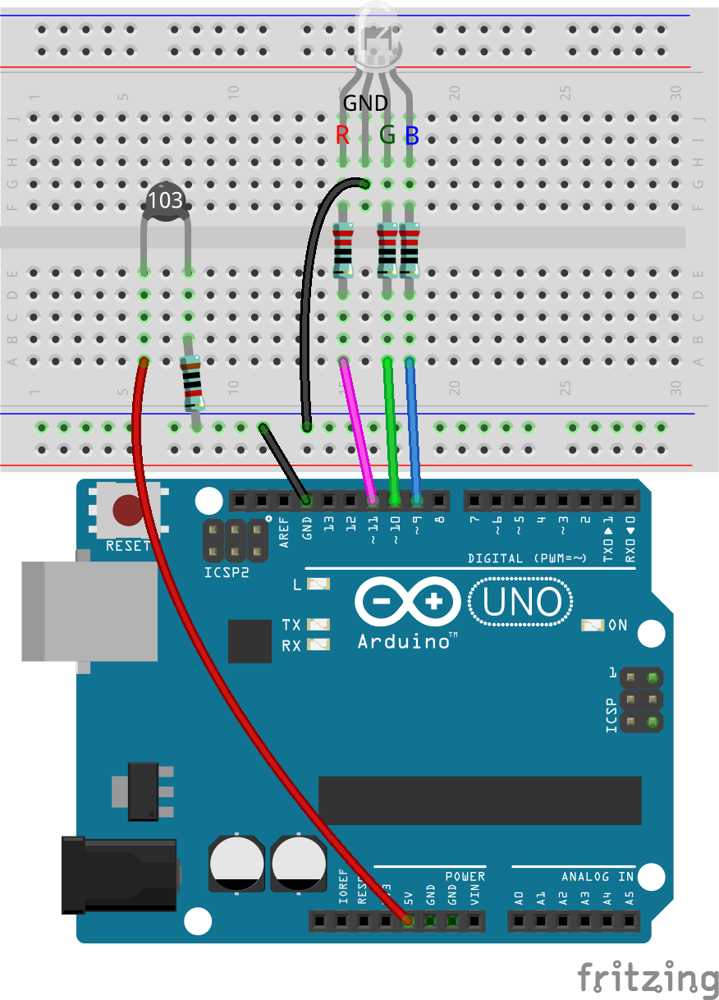
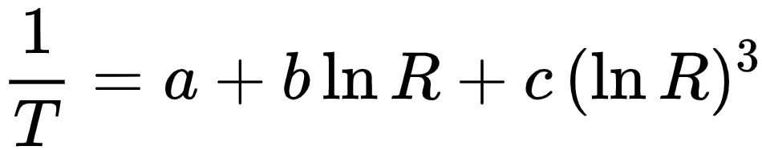
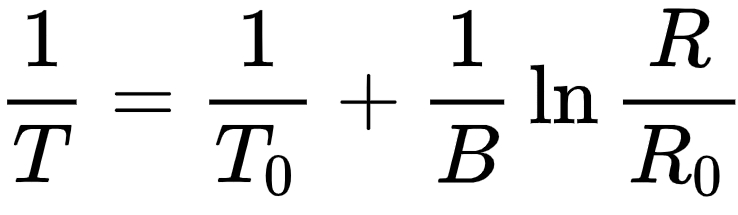
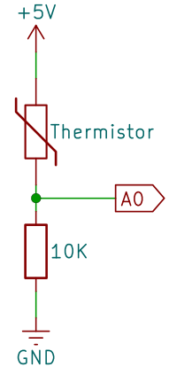
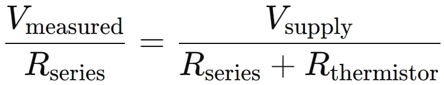
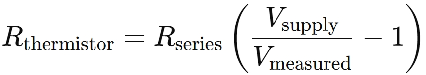

.. note::

    Hallo und willkommen in der SunFounder Raspberry Pi & Arduino & ESP32 Enthusiasten-Community auf Facebook! Tauche tiefer in die Welt von Raspberry Pi, Arduino und ESP32 ein und tausche dich mit anderen Enthusiasten aus.

    **Warum beitreten?**

    - **Fachkundige Unterstützung**: Löse Probleme nach dem Kauf und technische Herausforderungen mit Hilfe unserer Community und unseres Teams.
    - **Lernen & Teilen**: Tausche Tipps und Tutorials aus, um deine Fähigkeiten zu verbessern.
    - **Exklusive Vorschauen**: Erhalte frühzeitigen Zugang zu neuen Produktankündigungen und Vorschauen.
    - **Sonderrabatte**: Profitiere von exklusiven Rabatten auf unsere neuesten Produkte.
    - **Festliche Aktionen und Verlosungen**: Nimm an Verlosungen und saisonalen Aktionen teil.

    👉 Bereit, mit uns zu erkunden und zu kreieren? Klicke [|link_sf_facebook|] und werde noch heute Mitglied!

16. Temperatur-Alarm
========================

In dieser Lektion werden wir die entscheidende Rolle der Temperaturkontrolle für die Lebensmittelsicherheit untersuchen. Nicht alle Lebensmittel müssen gekühlt oder eingefroren werden; selbst haltbare Artikel wie Chips, Brot und bestimmte Früchte benötigen eine angemessene Temperaturlagerung, um Qualität und Sicherheit zu gewährleisten. Durch den Aufbau eines Temperatursüberwachungssystems lernen wir, wie man Lebensmittel innerhalb sicherer Temperaturbereiche hält und einen Alarm auslöst, wenn die Temperaturen von diesen Grenzen abweichen. Dieses praktische Projekt schützt nicht nur Lebensmittel, sondern dient auch als hervorragende Einführung in die Umweltüberwachung mit praktischen Anwendungen.

.. .. image:: img/16_temperature.jpg
..     :width: 400
..     :align: center

.. raw:: html

    <video muted controls style = "max-width:90%">
        <source src="_static/video/16_temp_alarm.mp4" type="video/mp4">
        Your browser does not support the video tag.
    </video>

Am Ende dieser Lektion wirst du in der Lage sein:

* Die Bedeutung der Temperaturkontrolle für die Lebensmittelsicherheit zu verstehen.
* Einen Schaltkreis mit einem Thermistor zum Überwachen von Temperaturänderungen aufzubauen.
* Ein Arduino-Programm zu schreiben, um Temperaturdaten von einem Thermistor auszulesen.
* Logik in der Programmierung anzuwenden, um basierend auf Temperaturdaten Aktionen auszulösen (z.B. eine LED leuchten lassen oder einen Alarm auslösen).
* Konzepte des elektrischen Widerstands und der Temperaturumrechnung in praktischen Szenarien anzuwenden.

Schaltkreisaufbau
-----------------------

**Benötigte Komponenten**

.. list-table:: 
   :widths: 25 25 25 25
   :header-rows: 0

   * - 1 * Arduino Uno R3
     - 1 * RGB LED
     - 3 * 220Ω Widerstand
     - 1 * 10KΩ Widerstand
   * - |list_uno_r3| 
     - |list_rgb_led| 
     - |list_220ohm| 
     - |list_10kohm| 
   * - 1 * Thermistor
     - 1 * Steckbrett
     - Jumper Drähte
     - 1 * USB-Kabel
   * - |list_thermistor| 
     - |list_breadboard| 
     - |list_wire| 
     - |list_usb_cable| 
   * - 1 * Multimeter
     - 
     - 
     - 
   * - |list_meter| 
     - 
     - 
     - 

**Schritt-für-Schritt-Anleitung**

Dieser Schaltkreis baut auf dem aus Lektion 12 auf und fügt einen Thermistor hinzu.

1. Entferne basierend auf dem Schaltkreis aus Lektion 12 das Jumper-Kabel, das den GND-Pin des Arduino Uno R3 mit dem GND-Pin der RGB-LED verbindet, und stecke es in die negative Klemme des Steckbretts. Verbinde dann ein weiteres Jumper-Kabel von der negativen Klemme mit dem GND-Pin der RGB-LED.

2. Setze den Thermistor in die Löcher 6E und 8E ein. Die Pins sind nicht richtungsgebunden und können frei eingesetzt werden.

Ein Thermistor ist eine spezielle Art von Widerstand, dessen Widerstand sich mit der Temperatur ändert. Dieses Gerät ist sehr nützlich, da es uns hilft, die Temperatur zu erkennen und zu messen und so in verschiedenen elektronischen Projekten und Geräten zu kontrollieren.

Hier ist das elektronische Symbol des Thermistors.

.. image:: img/16_thermistor_symbol.png
    :width: 300
    :align: center

Thermistoren gibt es in zwei grundlegenden Typen:

* **NTC-Thermistoren**: Der Widerstand nimmt mit steigender Temperatur ab. Häufig als Temperatursensoren oder Einschaltstrombegrenzer in Schaltungen verwendet.
* **PTC-Thermistoren**: Der Widerstand steigt mit steigender Temperatur. Oft als rücksetzbare Sicherungen in Schaltungen verwendet, um vor Überstrom zu schützen.

In diesem Kit verwenden wir einen **NTC**-Thermistor.

Jetzt benutze ein Multimeter, um den Widerstand dieses Thermistors zu messen und zu überprüfen, ob er tatsächlich mit steigender Temperatur abnimmt.

3. Da der Nennwiderstand des Thermistors 10K beträgt, stelle das Multimeter auf den Widerstandsbereich von 20 Kiloohm (20K) ein.

.. image:: img/multimeter_20k.png
    :width: 300
    :align: center

4. Berühre nun die beiden Pins des Thermistors mit den roten und schwarzen Prüfleitungen des Multimeters.

5. Lese den Widerstandswert bei der aktuellen Temperatur ab und notiere ihn in der folgenden Tabelle.

.. list-table::
   :widths: 20 20
   :header-rows: 1

   * - Umgebung
     - Widerstand (Kiloohm)
   * - Aktuelle Temperatur
     - *9,37*
   * - Höhere Temperatur
     -
   * - Niedrigere Temperatur
     -

6. Finde nun einen Freund, der dir hilft, den Thermistor zu halten, oder verwende etwas anderes, um die Temperatur um den Thermistor herum zu erhöhen (kein Wasser, kein Feuer, Sicherheit geht vor). Notiere den Widerstandswert des Thermistors zu diesem Zeitpunkt in der Tabelle.

.. list-table::
   :widths: 20 20
   :header-rows: 1

   * - Umgebung
     - Widerstand (Kiloohm)
   * - Aktuelle Temperatur
     - *9,37*
   * - Höhere Temperatur
     - *6,10*
   * - Niedrigere Temperatur
     -

7. Du kannst den Thermistor auch nach draußen legen oder ihn mit einem Ventilator kühlen, um die Temperatur um ihn herum zu senken. Notiere den gemessenen Widerstandswert zu diesem Zeitpunkt in der Tabelle.

.. list-table::
   :widths: 20 20
   :header-rows: 1

   * - Umgebung
     - Widerstand (Kiloohm)
   * - Aktuelle Temperatur
     - *9,37*
   * - Höhere Temperatur
     - *6,10*
   * - Niedrigere Temperatur
     - *12,49*

Durch diese Messungen können wir sehen, dass der Widerstand mit steigender Umgebungstemperatur abnimmt.
8. Jetzt kannst du den Schaltkreis weiter aufbauen. Verbinde ein Ende des Thermistors mit einem 10KΩ-Widerstand, und das andere Ende des 10KΩ-Widerstands mit der negativen Klemme des Steckbretts.

9. Verbinde das andere Ende des Steckbretts mit dem 5V-Pin des Arduino Uno R3.

10. Verbinde schließlich den gemeinsamen Pin des Fotowiderstands und des 10KΩ-Widerstands mit dem A0-Pin des Arduino Uno R3.

Verständnis der Temperaturberechnung
----------------------------------------
**Über die Temperaturformel**

Der Widerstand eines NTC-Thermistors ändert sich mit der Temperatur. Diese Beziehung wird in der Regel genau durch die Steinhart-Hart-Gleichung beschrieben, wie folgt:

Hierbei werden a, b und c als Steinhart-Hart-Parameter bezeichnet, die für jedes Gerät festgelegt werden müssen. T ist die absolute Temperatur, und R ist der Widerstand.

Zusätzlich zur Steinhart-Hart-Gleichung verwenden viele praktische Anwendungen auch ein vereinfachtes Modell, das auf dem Beta-Parameter basiert, um die Temperatur schnell zu berechnen. Dieses Modell nimmt an, dass die Beziehung zwischen Widerstand und Temperatur durch eine einfachere exponentielle Beziehung angenähert werden kann, wodurch der Berechnungsprozess vereinfacht wird und es sich gut für die schnelle Temperaturüberwachung in technischen Anwendungen eignet.

* **T** ist die Temperatur des Thermistors in Kelvin.
* **T0** ist eine Referenztemperatur, normalerweise bei 25°C (das entspricht 273,15 + 25 in Kelvin).
* **B** ist der Beta-Parameter des Materials; der Beta-Koeffizient des NTC-Thermistors in diesem Kit beträgt 3950.
* **R** ist der gemessene Widerstand.
* **R0** ist der Widerstand bei der Referenztemperatur T0; der Widerstand des NTC-Thermistors in diesem Kit beträgt bei 25°C 10 Kiloohm.

Nach Umstellung der oben genannten Formeln wird die Temperatur in Kelvin wie folgt berechnet: ``T=1/(ln(R/R0)/B+1/T0)``, ziehe 273,15 ab, um sie in Celsius umzurechnen.

**Wie misst man den Widerstand?**

Wir verbinden den Thermistor und einen 10KΩ-Widerstand in unserem Schaltkreis in Reihe.

Die Spannung am Pin A0, die wir messen, geteilt durch den Reihenwiderstand (den 10KΩ-Widerstand), gibt uns den Strom, der durch den Schaltkreis fließt. Dieser Strom kann auch ermittelt werden, indem die Gesamtspannung durch den Gesamtwiderstand des Schaltkreises (Reihenwiderstand + Thermistor) geteilt wird:

* **Vsupply**: Die an den Schaltkreis angelegte Spannung.
* **Rseries**: Der Widerstandswert des Reihenwiderstands.
* **Vmeasured**: Die Spannung über den 10KΩ-Widerstand, auch die Spannung am Pin A0.

Aus diesen Informationen können wir die Formel umstellen, um den Widerstand des Thermistors zu berechnen:

In unserem Code verwenden wir die Funktion ``analogRead()``, um die Spannung am Pin A0 zu messen. Die Beziehung zwischen der Spannung **Vmeasured** und dem gelesenen Analogwert ist:

.. code-block::

    (Analog value at A0) / 1023.0 = Vmeasured / Vsupply

Mithilfe der obigen Formel berechnen wir den Widerstand des Thermistors:

.. code-block::

    R_thermistor =R_series x (1023.0 / (Analog value at A0) - 1)

.. note::

    Falls dir die Formeln kompliziert erscheinen, merke dir einfach die folgenden wichtigen:

    Der Widerstand des Thermistors kann durch die folgende Formel ermittelt werden:

    .. code-block::

        R_thermistor =R_series x (1023.0 / (Analog value at A0) - 1)

    Berechne dann die Temperatur in Kelvin mit der folgenden Formel:

    .. code-block::

        T=1/(ln(R/R0)/B+1/T0)

    * **T0**: 273,15 + 25.
    * **B**: 3950.
    * **R** ist der gemessene Widerstand.
    * **R0**: 10 Kiloohm.

    Schließlich wird die Temperatur in Celsius mit der folgenden Formel umgerechnet:

    .. code-block::

        Tc = T - 273.15

    
Code-Erstellung
------------------

**Temperatur erfassen**

1. Öffne die Arduino-IDE und starte ein neues Projekt, indem du im Menü „Datei“ die Option „Neuer Sketch“ auswählst.
2. Speichere deinen Sketch unter dem Namen ``Lesson16_Temperature_Alarm`` mit ``Ctrl + S`` oder durch Klicken auf „Speichern“.

3. In den vorherigen Lektionen haben wir die RGB-LED-Pins direkt im Code referenziert; hier definieren wir sie als Konstanten.

.. code-block:: Arduino
    :emphasize-lines: 2-5

    // Pin-Konfigurationen
    const int tempSensorPin = A0;  // NTC-Thermistor analoger Eingang
    const int redPin = 11;         // Roter LED-Digital-Pin
    const int greenPin = 10;       // Grüner LED-Digital-Pin
    const int bluePin = 9;         // Blauer LED-Digital-Pin

    void setup() {
        // Setup-Code hier einfügen, der einmal ausgeführt wird:
    }

Die Verwendung von Konstanten anstelle von Variablen, die sich während des Programms nicht ändern, sorgt für Klarheit und erleichtert die Wartung. Dies ermöglicht die Verwendung von aussagekräftigen Namen anstelle von Zahlen, und Änderungen müssen nur in der Deklaration vorgenommen werden, nicht im gesamten Code. Konstanten folgen denselben Namensregeln wie Variablen, wobei reservierte Schlüsselwörter oder Befehle der Arduino-IDE vermieden werden sollten.

4. Bevor wir den Thermistor verwenden, müssen wir auch einige weitere Konstanten definieren, um Parameter für den Schaltkreis zu speichern.

.. note::

    Du wirst sehen, dass es Konstanten vom Typ ``int`` und ``float`` gibt. Was ist der Unterschied zwischen diesen beiden Konstantentypen?

  * ``const int``: Eine ``int``-Konstante (Abkürzung für Integer) speichert Ganzzahlen. Dieser Typ unterstützt keine Brüche oder Dezimalzahlen. Er belegt in der Regel 16 oder 32 Bit Speicher, abhängig vom System.
  * ``const float``: Eine ``float``-Konstante (Abkürzung für Floating-Point) speichert Zahlen mit Nachkommastellen. Sie wird verwendet, wenn mehr Präzision benötigt wird, beispielsweise bei Messungen oder Berechnungen, die Dezimalwerte erfordern. Ein ``float`` belegt in der Regel 32 Bit Speicher und kann einen größeren Zahlenbereich als ein ``int`` darstellen.

.. code-block:: Arduino
    :emphasize-lines: 2-5

    // Pin-Konfigurationen
    const int tempSensorPin = A0;  // NTC-Thermistor analoger Eingang
    const int redPin = 10;         // Roter LED-Digital-Pin
    const int greenPin = 11;       // Grüner LED-Digital-Pin
    const int bluePin = 12;        // Blauer LED-Digital-Pin

    // Konstanten für die Temperaturberechnung
    const float beta = 3950.0;               // Beta-Wert des NTC-Thermistors
    const float seriesResistor = 10000;      // Wert des Reihenwiderstands (Ohm)
    const float roomTempResistance = 10000;  // Widerstand des NTC bei 25°C
    const float roomTemp = 25 + 273.15;      // Raumtemperatur in Kelvin

5. In ``void setup()`` werden die RGB-LED-Pins als Ausgänge festgelegt und die serielle Kommunikation auf 9600 Baud konfiguriert.

.. code-block:: Arduino
    :emphasize-lines: 2-5

    void setup() {
        // Initialisiere LED-Pins als Ausgänge
        pinMode(redPin, OUTPUT);
        pinMode(greenPin, OUTPUT);
        pinMode(bluePin, OUTPUT);
        
        // Starte die serielle Kommunikation mit 9600 Baud
        Serial.begin(9600);
    }

6. Zuerst musst du den analogen Wert des Pins A0 in ``void loop()`` auslesen.

.. code-block:: Arduino
    :emphasize-lines: 2

    void loop() {
        int adcValue = analogRead(tempSensorPin);                     // Thermistor-Wert auslesen
    }

7. Berechne anschließend den Widerstand des Thermistors mithilfe der zuvor abgeleiteten Formel zur Umrechnung von Analogwerten in Spannung.

.. code-block:: Arduino
    :emphasize-lines: 3

    void loop() {
        int adcValue = analogRead(tempSensorPin);                     // Thermistor-Wert auslesen
        float resistance = (1023.0 / adcValue - 1) * seriesResistor;  // Thermistor-Widerstand berechnen
    }

8. Berechne dann die Temperatur in Kelvin anhand der unten gezeigten Formel:

.. code-block:: Arduino
    :emphasize-lines: 6

    void loop() {
        int adcValue = analogRead(tempSensorPin);                     // Thermistor-Wert auslesen
        float resistance = (1023.0 / adcValue - 1) * seriesResistor;  // Thermistor-Widerstand berechnen

        // Temperatur in Kelvin mit der Beta-Gleichung berechnen
        float tempK = 1 / (log(resistance / roomTempResistance) / beta + 1 / roomTemp);
    }

9. Subtrahiere 273,15 von der Temperatur in Kelvin, um sie in Celsius umzurechnen, und gib das Ergebnis mit der Funktion ``Serial.println()`` im seriellen Monitor aus.

.. code-block:: Arduino
    :emphasize-lines: 8,9

    void loop() {
        int adcValue = analogRead(tempSensorPin);                     // Thermistor-Wert auslesen
        float resistance = (1023.0 / adcValue - 1) * seriesResistor;  // Thermistor-Widerstand berechnen

        // Temperatur in Kelvin mit der Beta-Gleichung berechnen
        float tempK = 1 / (log(resistance / roomTempResistance) / beta + 1 / roomTemp);
    
        float tempC = tempK - 273.15;  // In Celsius umrechnen
        Serial.println(tempC);           // Temperatur in Celsius im seriellen Monitor anzeigen
    }

10. An diesem Punkt kannst du den Code auf deinen Arduino Uno R3 hochladen und die aktuellen Celsius-Temperaturwerte ablesen.

.. code-block::

    26.28
    26.19
    26.19
    26.28
    26.28

**Farbe der RGB-LED ändern**

Lass uns nun die Farbe der RGB-LED basierend auf der Temperatur ändern, die vom Thermistor gemessen wird.

Zum Beispiel setzen wir drei Temperaturbereiche fest:

* Unter 10 Grad zeigt die RGB-LED Grün an, was bedeutet, dass die Temperatur angenehm ist.
* Zwischen 10 und 20 Grad zeigt die RGB-LED Gelb an, was auf eine erhöhte Vorsicht bei der Temperatur hinweist.
* Über 21 Grad zeigt die RGB-LED Rot an, was signalisiert, dass die Temperatur zu hoch ist und Maßnahmen erforderlich sind.

11. Zur Steuerung der RGB-LED verwenden wir die Funktion ``setColor()``, die in früheren Lektionen erstellt wurde.

.. code-block:: Arduino

    // Funktion, um die Farbe der RGB-LED festzulegen
    void setColor(int red, int green, int blue) {
        // PWM-Werte für Rot, Grün und Blau an die RGB-LED schreiben
        analogWrite(11, red);
        analogWrite(10, green);
        analogWrite(9, blue);
    }

12. Jetzt verwenden wir eine ``if else if``-Anweisung, um die Farbe der RGB-LED basierend auf unterschiedlichen Temperaturen zu steuern.

.. code-block:: Arduino
    :emphasize-lines: 12-18

    void loop() {
        int adcValue = analogRead(tempSensorPin);                     // Read thermistor value
        float resistance = (1023.0 / adcValue - 1) * seriesResistor;  // Calculate thermistor resistance

        // Calculate temperature in Kelvin using Beta parameter equation
        float tempK = 1 / (log(resistance / roomTempResistance) / beta + 1 / roomTemp);
    
        float tempC = tempK - 273.15;  // Convert to Celsius
        Serial.println(tempC);           // Display temperature in Celsius on Serial Monitor

        // Adjust LED color based on temperature
        if (tempC < 10) {
            setColor(0, 0, 255);  // Cold: blue
        } else if (tempC >= 10 && tempC <= 21) {
            setColor(0, 255, 0);  // Comfortable: green
        } else if (tempC > 21) {
            setColor(255, 0, 0);  // Hot: red
        }
        delay(1000);  // Delay 1 second before next reading
    }

13. Dein vollständiger Code ist nun bereit. Du kannst ihn jetzt auf deinen Arduino Uno R3 hochladen, um die Ergebnisse zu sehen.

.. code-block:: Arduino

    // Pin-Konfigurationen
    const int tempSensorPin = A0;  // NTC-Thermistor analoger Eingang
    const int redPin = 10;         // Roter LED-Digital-Pin
    const int greenPin = 11;       // Grüner LED-Digital-Pin
    const int bluePin = 12;        // Blauer LED-Digital-Pin

    // Konstanten für die Temperaturberechnung
    const float beta = 3950.0;               // Beta-Wert des NTC-Thermistors
    const float seriesResistor = 10000;      // Wert des Reihenwiderstands (Ohm)
    const float roomTempResistance = 10000;  // NTC-Widerstand bei 25°C
    const float roomTemp = 25 + 273.15;      // Raumtemperatur in Kelvin

    void setup() {
        // Initialisiere LED-Pins als Ausgänge
        pinMode(redPin, OUTPUT);
        pinMode(greenPin, OUTPUT);
        pinMode(bluePin, OUTPUT);

        // Starte die serielle Kommunikation mit 9600 Baud
        Serial.begin(9600);
    }

    void loop() {
        int adcValue = analogRead(tempSensorPin);                     // Thermistor-Wert auslesen
        float resistance = (1023.0 / adcValue - 1) * seriesResistor;  // Thermistor-Widerstand berechnen

        // Temperatur in Kelvin mit der Beta-Gleichung berechnen
        float tempK = 1 / (log(resistance / roomTempResistance) / beta + 1 / roomTemp);

        float tempC = tempK - 273.15;  // In Celsius umrechnen
        Serial.println(tempC);           // Temperatur in Celsius im seriellen Monitor anzeigen

        // LED-Farbe basierend auf der Temperatur anpassen
        if (tempC < 10) {
            setColor(0, 0, 255);  // Kalt: Blau
        } else if (tempC >= 10 && tempC <= 21) {
            setColor(0, 255, 0);  // Angenehm: Grün
        } else if (tempC > 21) {
            setColor(255, 0, 0);  // Heiß: Rot
        }
        delay(1000);  // 1 Sekunde Verzögerung vor der nächsten Messung
    }

    // Funktion, um die Farbe der RGB-LED festzulegen
    void setColor(int red, int green, int blue) {
        // PWM-Werte für Rot, Grün und Blau an die RGB-LED schreiben
        analogWrite(11, red);
        analogWrite(10, green);
        analogWrite(9, blue);
    }

14. Vergiss abschließend nicht, deinen Code zu speichern und deinen Arbeitsplatz aufzuräumen.

**Fragen**

1. Im Code werden Temperaturen in Kelvin und Celsius berechnet. Wenn du auch die Temperatur in Fahrenheit wissen möchtest, was müsstest du tun?

2. Fallen dir andere Situationen oder Orte ein, an denen ein Temperaturüberwachungssystem wie das, das wir heute gebaut haben, nützlich sein könnte?

**Zusammenfassung**

In der heutigen Lektion haben wir ein Temperaturalarmsystem gebaut, das einen Thermistor verwendet, um die Temperatur eines Lagerbereichs für haltbare Lebensmittel zu überwachen. Wir haben gelernt, wie man Widerstandswerte des Thermistors ausliest und in Temperaturwerte in Celsius umwandelt. Durch unsere Programmierung haben wir außerdem Bedingungen festgelegt, um die Farbe einer RGB-LED je nach Temperatur zu ändern, sodass eine visuelle Warnung für zu niedrige, optimale oder zu hohe Temperaturen angezeigt wird.

