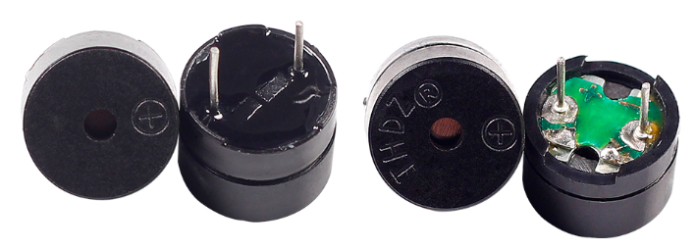
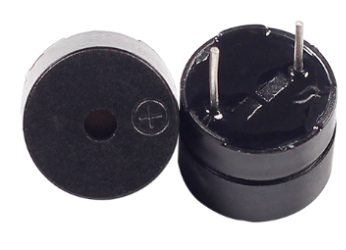
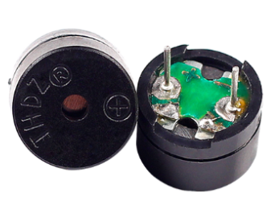
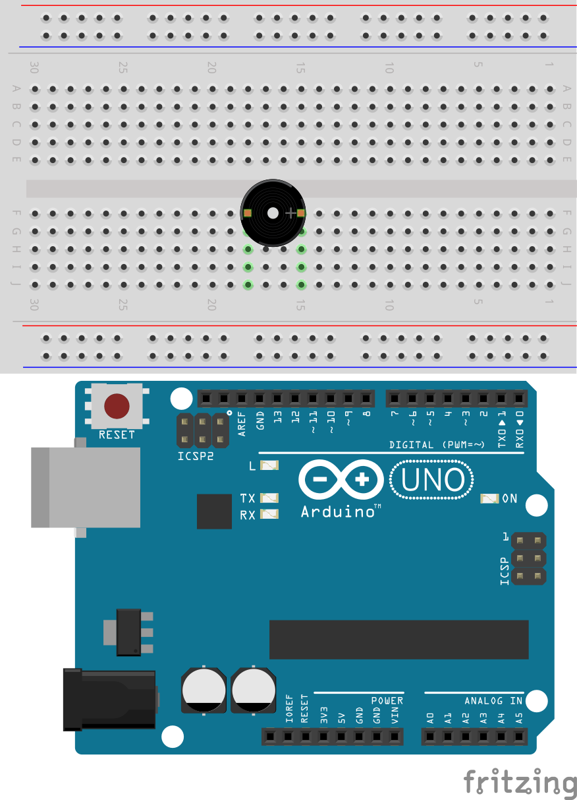
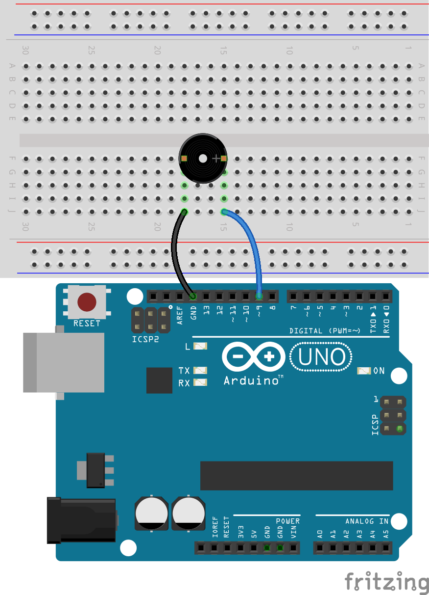

17. Morse Code
========================

Morse code is like a secret language using dots (.) and dashes (-) invented by Samuel Morse in the 1840s. It was created to send messages across long distances using telegraphs. Each letter of the alphabet and number is represented by a unique combination of these signals. For example, the most famous Morse code message is "SOS" (··· ––– ···), which is an international signal for help. Morse code used to be essential for communication before the invention of phones and the internet, and it was especially popular among ship and airplane operators. Today, it's fun to learn as a way to send secret messages to your friends!

In this lesson, you will learn:

* Understand the workings of an active buzzer.
* Learn to code the SOS signal in Morse code, enabling you to send messages using Morse code with a buzzer.

Morse Code Magic!
-------------------

Imagine inventing a way to send secret messages using just dots and dashes! That's what Samuel Morse did back in 1836 with Morse code. Initially a painter, Morse got inspired on a boat trip and later, with his buddy Alfred Vail, created the telegraph to send messages across wires.

Morse code uses dots (short signals) and dashes (long signals) to represent letters and numbers. The first Morse code message? "What hath God wrought"—sent in 1844 from Washington D.C. to Baltimore, kicking off the telegraph era.

Today, Morse code isn't used as much, but it's still cool for things like aviation and by amateur radio fans. Now, let's explore how Morse code works with Arduino and a buzzer and have some fun with this piece of communication history!

Building the Circuit
-----------------------

**Components Needed**

.. list-table:: 
   :widths: 25 25 25 25
   :header-rows: 0

   * - 1 * R3 Board
     - 1 * Active Buzzer
     - 1 * Breadboard
     - Jumper Wires
   * - |compoents_uno_r3| 
     - |compoents_active_buzzer| 
     - |compoents_breadboard| 
     - |compoents_wire| 
   * - 1 * USB Cable
     - 1 * Multimeter
     - 
     - 
   * - |compoents_usb_cable| 
     - |compoents_meter|
     - 
     - 

**Building Step-by-Step**

1. Locate an active buzzer which typically has a white sticker on the front and a sealed black back.

Buzzers, as electronic sound devices, have a rich history that traces back to the 19th century. The precursor to modern buzzers is rooted in 1831, when Michael Faraday discovered electromagnetic induction, forming the foundational principle behind the operation of electromagnetic buzzers. Following Faraday's groundbreaking discovery, many scientists and inventors explored how to apply electromagnetic theories to practical devices. Today, Buzzers can be categorized as active and passive ones:

**Active Buzzer**

Sealed at the back, active buzzers contain an internal oscillator that sounds when powered, typically producing a single-tone beep.

**Passive Buzzer**

Open at the back, passive buzzers require an external frequency signal from a microcontroller to generate sound, allowing for a range of tones.

1. Active buzzer is also polar device. The front side has a "+" sign indicating its positive terminal (anode), which is also the longer pin. Now insert the buzzer into the breadboard with the anode in hole 15F and the cathode in hole 18F.

2. Connect the cathode to the GND pin on the R3 board.

3. If you insert the anode of the buzzer into the 5V pin of the R3 board, you will hear the active buzzer emit sound directly. Of course, you can also use this method to verify if the buzzer you have is correct. A passive buzzer will not produce sound when directly connected to a power source.

4. Now, remove the wire inserted into the 5V pin and insert it into pin 9 of the R3 board, so that the buzzer can be controlled with code.

.. image:: img/16_morse_code.png
    :width: 500
    :align: center

Code Creation
----------------
1. Open the Arduino IDE, go to the “File” menu, and select “New Sketch” to start a fresh project. Close any other sketch windows that might be open.
2. Save your new sketch by clicking “Save” from the “File” menu or by pressing ``Ctrl + S``. Save it in the default Arduino Sketchbook location under the name ``Lesson17_Morse_Code``. Click "Save".

3. First, create a constant called ``buzzerPin`` and set it equal to pin 9.

.. code-block:: Arduino
    :emphasize-lines: 1

    const int buzzerPin = 9;   // Assigns the pin 9 to the constant for the buzzer

    void setup() {
        // put your setup code here, to run once:
    }

4. Initialize the pin: In the ``void setup()`` function, set the buzzer pin to output mode.

.. code-block:: Arduino
    :emphasize-lines: 5

    const int buzzerPin = 9;   // Assigns the pin 9 to the constant for the buzzer

    void setup() {
        // put your setup code here, to run once:
        pinMode(buzzerPin, OUTPUT);  // Set pin 9 as output
    }

5. Making an active buzzer sound an alert is as simple as lighting an LED; you just need to use ``digitalWrite()`` to set pin 9 high or low and ``delay()`` to control the timing.

.. code-block:: Arduino
    :emphasize-lines: 10-13

    const int buzzerPin = 9;   // Assigns the pin 9 to the constant for the buzzer

    void setup() {
        // put your setup code here, to run once:
        pinMode(buzzerPin, OUTPUT);  // Set pin 9 as output
    }

    void loop() {
        // put your main code here, to run repeatedly:
        digitalWrite(buzzerPin, HIGH);  // Turn buzzer ON
        delay(250);                     // Beep duration: 250 milliseconds
        digitalWrite(buzzerPin, LOW);   // Turn buzzer OFF
        delay(250);                     // Interval between signals: 250 milliseconds
    }

6. You can upload your code to the R3 board, and then you will hear the "beep beep" sound.

7. To make the buzzer emit Morse code, you need to create two functions after ``void loop()``, for emitting dots (short signals) and dashes (long signals).

.. note::

    In Morse code, there are traditional timing rules for dots (short signals), dashes (long signals), and the intervals between signals to ensure the message is accurately received and understood. Here are some basic rules:

    * Length of a dot: the basic time unit.
    * Length of a dash: equals three dots.
    * Interval between dots: the length of one dot.
    * Interval within a character (between dots and dashes of a letter or number): the length of one dot.
    * Interval between characters (e.g., between two letters): three dots.
    * Interval between words (e.g., between two words): seven dots.

    Therefore, we set the length of a dot to 250ms, a dash to 750ms, and the interval between elements to 250ms.

.. code-block:: Arduino
    :emphasize-lines: 9-14,16-21

    void loop() {
        // put your main code here, to run repeatedly:
        digitalWrite(buzzerPin, HIGH);  // Turn buzzer ON
        delay(250);                     // Beep duration: 250 milliseconds
        digitalWrite(buzzerPin, LOW);   // Turn buzzer OFF
        delay(250);                     // Interval between signals: 250 milliseconds
    }

    void dot() {
        digitalWrite(buzzerPin, HIGH);
        delay(250);  // Short duration for a dot
        digitalWrite(buzzerPin, LOW);
        delay(250);  // Interval between signals
    }

    void dash() {
        digitalWrite(buzzerPin, HIGH);
        delay(750);  // Longer duration for a dash
        digitalWrite(buzzerPin, LOW);
        delay(250);  // Interval between signals
    }

8. Now, you can transmit Morse code. For example, to send "SOS" (... --- ...), the Morse code for 'S' consists of three dots, and 'O' is three dashes, so you simply call the dot and dash functions three times respectively.

.. code-block:: Arduino
    :emphasize-lines: 2-11

    void loop() {
        dot();
        dot();
        dot();  // S: ...
        dash();
        dash();
        dash();  // O: ---
        dot();
        dot();
        dot();       // S: ...
        delay(750);  // Repeat after a period
    }

9. Here is your complete code. You can now click "Upload" to upload the code to the R3 board, after which you will hear the Morse code for "SOS" (... --- ...).

.. code-block:: Arduino

    const int buzzerPin = 9;   // Assigns the pin 9 to the constant for the buzzer
    
    void setup() {
        // put your setup code here, to run once:
        pinMode(buzzerPin, OUTPUT);  // Set pin 9 as output
    }

    void loop() {
        dot();
        dot();
        dot();  // S: ...
        dash();
        dash();
        dash();  // O: ---
        dot();
        dot();
        dot();       // S: ...
        delay(750);  // Repeat after a period
    }

    void dot() {
        digitalWrite(buzzerPin, HIGH);
        delay(250);  // Short duration for a dot
        digitalWrite(buzzerPin, LOW);
        delay(250);  // Interval between signals
    }

    void dash() {
        digitalWrite(buzzerPin, HIGH);
        delay(750);  // Longer duration for a dash
        digitalWrite(buzzerPin, LOW);
        delay(250);  // Interval between signals
    }

10. Finally, remember to save your code and tidy up your workspace.

**Summary**

In this lesson, you've explored the basics of Morse code, a unique form of communication developed in the 1840s by Samuel Morse. You learned how to use an active buzzer to send the Morse code for SOS, a universally recognized distress signal. This lesson not only taught you how to set up and code an active buzzer but also gave you a glimpse into the historical significance of Morse code in telecommunications. With these skills, you can now send secret Morse code messages to friends or further explore its applications in modern devices.

In this lesson, we only used the Morse codes for the letters "S" and "O." Here is the chart of the Morse code 26 letters and 10 numerals.

.. list-table::
    :widths: 8 8 8 8 8 8 8 8
    :header-rows: 1

    * - Letter
      - Code
      - Letter
      - Code
      - Letter
      - Code
      - Letter
      - Code
    * - A
      - \.-
      - B
      - \-...
      - C
      - \-.\-.
      - D
      - \-..
    * - E
      - \.
      - F
      - \..-.
      - G
      - \-\-.
      - H
      - \....
    * - I
      - \..
      - J
      - \.\-\-\-
      - K
      - \-.-
      - L
      - \.-..
    * - M
      - \--
      - N
      - \-.
      - O
      - \-\-\-
      - P
      - \.-\-.
    * - Q
      - \-\-.-
      - R
      - \.-.
      - S
      - \...
      - T
      - \-
    * - U
      - \..-
      - V
      - \...-
      - W
      - \.-\-
      - X
      - \-..-
    * - Y
      - \-.-\-
      - Z
      - \-\-..
      - 1
      - \.\-\-\-\-
      - 2
      - \..\-\-\-
    * - 3
      - \...-\-
      - 4
      - \....-
      - 5
      - \.....
      - 6
      - \-....
    * - 7
      - \-\-...
      - 8
      - \-\-\-..
      - 9
      - \-\-\-\-.
      -
      -
  

**Question**

Using the Morse code table provided, write a code to send the message "Hello".

