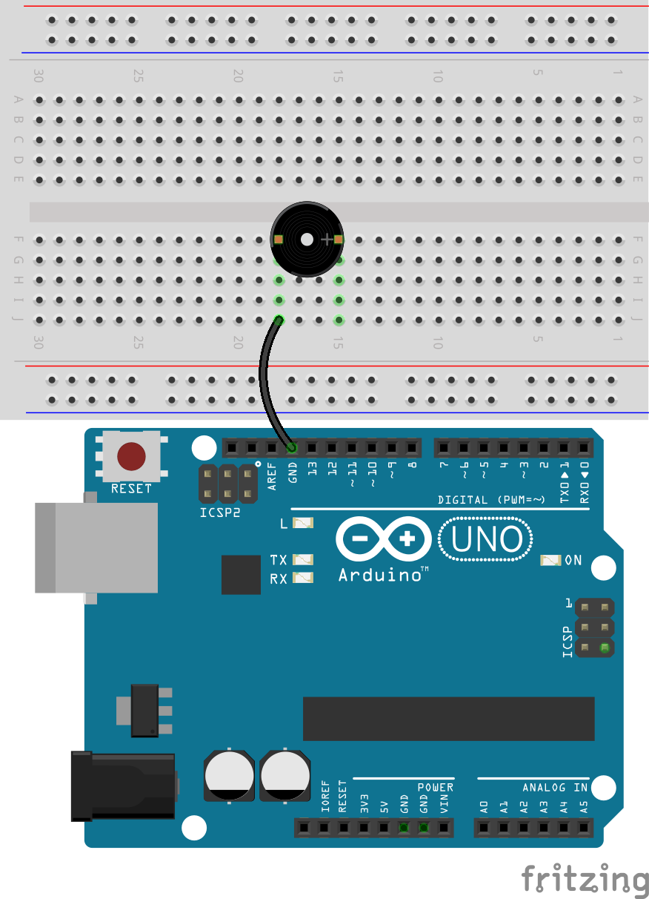

.. note::

    こんにちは、SunFounder Raspberry Pi & Arduino & ESP32 Enthusiasts Community（Facebook）へようこそ！Raspberry Pi、Arduino、ESP32の世界を仲間と一緒に深く掘り下げましょう。

    **参加のメリット**

    - **専門的なサポート**：コミュニティとチームの助けを借りて、販売後の問題や技術的な課題を解決しましょう。
    - **学びと共有**：スキル向上のためのヒントやチュートリアルを交換しましょう。
    - **限定プレビュー**：新製品の発表やスニークピークをいち早く入手できます。
    - **特別割引**：最新の製品に対する限定割引を楽しめます。
    - **フェスティブプロモーションとプレゼント**：プレゼントやホリデープロモーションに参加できます。

    👉 探索と創造の準備はできましたか？こちらをクリックして [|link_sf_facebook|] 参加しましょう！

17. モールス信号
========================

モールス信号は、1840年代にサミュエル・モールスによって発明された、点（.）と線（-）を使用する秘密の言語のようなものです。これは電信を使用して長距離にメッセージを送るために作られました。アルファベットと数字のそれぞれが、これらの信号の独自の組み合わせで表されます。例えば、最も有名なモールス信号メッセージは「SOS」（··· ––– ···）で、これは助けを求める国際信号です。電話やインターネットの発明前は、モールス信号は通信に欠かせないもので、特に船や飛行機のオペレーターの間で人気がありました。今日では、友達に秘密のメッセージを送る楽しい方法として学ぶことができます！

.. raw:: html

    <video controls style = "max-width:90%">
        <source src="_static/video/17_morse_code.mp4" type="video/mp4">
        Your browser does not support the video tag.
    </video>

このレッスンで学ぶこと:

* アクティブブザーの仕組みを理解する。
* モールス信号でSOS信号をコード化し、ブザーを使ってモールス信号を送る方法を学ぶ。

モールス信号の魔法！
----------------------

.. image:: img/7_morse.jpeg

点と線だけを使って秘密のメッセージを送る方法を発明することを想像してみてください！それがサミュエル・モールスが1836年にモールス信号で行ったことです。元々は画家だったモールスは、船旅の中でインスピレーションを得て、後に友人のアルフレッド・ヴェイルと共に電信機を作り、メッセージをワイヤーで送ることを可能にしました。

モールス信号は、点（短い信号）と線（長い信号）を使って文字と数字を表現します。最初のモールス信号のメッセージは「神は何を成し遂げたか」（"What hath God wrought"）で、1844年にワシントンD.C.からボルチモアに送信され、電信時代の幕開けを告げました。

今日では、モールス信号はあまり使用されていませんが、航空やアマチュア無線愛好家の間ではまだ利用されています。では、Arduinoとブザーを使ってモールス信号の仕組みを探求し、この通信の歴史の一部を楽しみましょう！

回路の構築
-----------------------

**必要なコンポーネント**

.. list-table:: 
   :widths: 25 25 25 25
   :header-rows: 0

   * - 1 * Arduino Uno R3
     - 1 * アクティブブザー
     - 1 * ブレッドボード
     - ジャンパーワイヤー
   * - |list_uno_r3| 
     - |list_active_buzzer| 
     - |list_breadboard| 
     - |list_wire| 
   * - 1 * USBケーブル
     -
     - 
     - 
   * - |list_usb_cable| 
     -
     - 
     - 

**ステップバイステップでの構築**

1. アクティブブザーを見つけてください。通常、前面に白いステッカーが貼られており、背面が封されています。

.. image:: img/7_beep_2.png

ブザーは19世紀に遡る豊かな歴史を持つ電子音響装置です。現代のブザーの前身は、1831年にマイケル・ファラデーが発見した電磁誘導に基づいており、これが電磁ブザーの動作原理の基本となっています。ファラデーの画期的な発見の後、多くの科学者や発明家が電磁理論を実用的な装置に適用する方法を探求しました。現在、ブザーはアクティブとパッシブの2種類に分類されます。

**アクティブブザー**

.. image:: img/7_beep_ac.png
    :width: 300
    :align: center

背面が封されているアクティブブザーは、電源が供給されると内部オシレータが音を出し、通常は単音のビープ音を発します。

**パッシブブザー**

.. image:: img/7_beep_pa.png
    :width: 300
    :align: center

背面が開いているパッシブブザーは、マイクロコントローラからの外部周波数信号を必要とし、さまざまな音色を生成できます。

1. アクティブブザーは極性を持つデバイスでもあります。正端子（アノード）を示す「+」記号が前面にあり、長いピンが正端子です。ブザーをアノードを15F、カソードを18Fに差し込んでブレッドボードに挿入します。

.. image:: img/16_morse_code_buzzer.png
    :width: 500
    :align: center

2. カソードをArduino Uno R3のGNDピンに接続します。

3. ブザーのアノードをArduino Uno R3の5Vピンに差し込むと、アクティブブザーが直接音を発します。この方法を使ってブザーが正しいかどうかを確認することもできます。パッシブブザーは、電源に直接接続しても音を出しません。

.. image:: img/16_morse_code_5v.png
    :width: 500
    :align: center

4. 5Vピンに挿入したワイヤーを取り外し、Arduino Uno R3のピン9に挿入して、コードでブザーを制御できるようにします。

.. image:: img/16_morse_code.png
    :width: 500
    :align: center

コード作成
----------------
1. Arduino IDEを開き、「ファイル」メニューから「新しいスケッチ」を選択して新しいプロジェクトを開始します。
2. スケッチを ``Ctrl + S`` を押すか「保存」をクリックして ``Lesson17_Morse_Code`` として保存します。

3. まず、 ``buzzerPin`` という定数を作成し、ピン9に設定します。

.. code-block:: Arduino
    :emphasize-lines: 1

    const int buzzerPin = 9;   // ブザー用の定数にピン9を割り当て

    void setup() {
        // 初期設定コードをここに記述します。一度だけ実行されます。
    }

4. ピンの初期化： ``void setup()`` 関数内で、ブザーピンを出力モードに設定します。

.. code-block:: Arduino
    :emphasize-lines: 5

    const int buzzerPin = 9;   // ブザー用の定数にピン9を割り当て

    void setup() {
        // 初期設定コードをここに記述します。一度だけ実行されます。
        pinMode(buzzerPin, OUTPUT);  // ピン9を出力モードに設定
    }

5. アクティブブザーを鳴らすのは、LEDを点灯するのと同じくらい簡単です。 ``digitalWrite()`` を使ってピン9をHIGHまたはLOWに設定し、 ``delay()`` でタイミングを制御するだけです。

.. code-block:: Arduino
    :emphasize-lines: 10-13

    const int buzzerPin = 9;   // ブザー用の定数にピン9を割り当て

    void setup() {
        // 初期設定コードをここに記述します。一度だけ実行されます。
        pinMode(buzzerPin, OUTPUT);  // ピン9を出力モードに設定
    }

    void loop() {
        // メインコードをここに記述します。繰り返し実行されます。
        digitalWrite(buzzerPin, HIGH);  // ブザーをONにする
        delay(250);                     // ビープ音の持続時間：250ミリ秒
        digitalWrite(buzzerPin, LOW);   // ブザーをOFFにする
        delay(250);                     // 信号間の間隔：250ミリ秒
    }

6. コードをArduino Uno R3にアップロードすると、「ビープビープ」という音が聞こえます。

7. ブザーでモールス信号を発するために、 ``void loop()`` の後に、点（短い信号）と線（長い信号）を発するための2つの関数を作成します。

.. note::

    モールス信号では、メッセージが正確に受信され理解されるために、点（短い信号）、線（長い信号）、および信号間の間隔に関する伝統的なタイミングルールがあります。基本的なルールは次のとおりです：

    * 点の長さ：基本的な時間単位。
    * 線の長さ：点の3倍。
    * 点間の間隔：点の長さ。
    * 文字内の間隔（文字や数字の点と線の間）：点の長さ。
    * 文字間の間隔（例：2文字間）：3点。
    * 単語間の間隔（例：2単語間）：7点。

    したがって、点の長さを250ms、線の長さを750ms、要素間の間隔を250msに設定します。

.. code-block:: Arduino
    :emphasize-lines: 9-14,16-21

    void loop() {
        // メインコードをここに記述します。繰り返し実行されます。
        digitalWrite(buzzerPin, HIGH);  // ブザーをONにする
        delay(250);                     // ビープ音の持続時間：250ミリ秒
        digitalWrite(buzzerPin, LOW);   // ブザーをOFFにする
        delay(250);                     // 信号間の間隔：250ミリ秒
    }

    void dot() {
        digitalWrite(buzzerPin, HIGH);
        delay(250);  // 点の短い持続時間
        digitalWrite(buzzerPin, LOW);
        delay(250);  // 信号間の間隔
    }

    void dash() {
        digitalWrite(buzzerPin, HIGH);
        delay(750);  // 線の長い持続時間
        digitalWrite(buzzerPin, LOW);
        delay(250);  // 信号間の間隔
    }

8. これでモールス信号を送信できるようになりました。例えば、「SOS」（... --- ...）を送信するには、モールス信号で'S'は3つの点、'O'は3つの線で構成されているので、点と線の関数をそれぞれ3回呼び出します。

.. code-block:: Arduino
    :emphasize-lines: 2-11

    void loop() {
        dot();
        dot();
        dot();  // S: ...
        dash();
        dash();
        dash();  // O: ---
        dot();
        dot();
        dot();       // S: ...
        delay(750);  // Repeat after a period
    }

9. これが完全なコードです。これで「アップロード」をクリックしてコードをArduino Uno R3にアップロードすると、「SOS」（... --- ...）のモールス信号が聞こえます。

.. code-block:: Arduino

    const int buzzerPin = 9;   // ブザー用の定数にピン9を割り当て
    
    void setup() {
        // 初期設定コードをここに記述します。一度だけ実行されます。
        pinMode(buzzerPin, OUTPUT);  // ピン9を出力モードに設定
    }

    void loop() {
        dot();
        dot();
        dot();  // S: ...
        dash();
        dash();
        dash();  // O: ---
        dot();
        dot();
        dot();       // S: ...
        delay(750);  // 一定期間後に繰り返す
    }

    void dot() {
        digitalWrite(buzzerPin, HIGH);
        delay(250);  // 点の短い持続時間
        digitalWrite(buzzerPin, LOW);
        delay(250);  // 信号間の間隔
    }

    void dash() {
        digitalWrite(buzzerPin, HIGH);
        delay(750);  // 線の長い持続時間
        digitalWrite(buzzerPin, LOW);
        delay(250);  // 信号間の間隔
    }

10. 最後に、コードを保存し、作業スペースを整理することを忘れないでください。

**まとめ**

このレッスンでは、1840年代にサミュエル・モールスが開発した独特の通信方法であるモールス信号の基本を学びました。アクティブブザーを使用して、SOSというモールス信号（国際的に認識されている遭難信号）を送信する方法を学びました。このレッスンでは、アクティブブザーの設定とコード作成方法だけでなく、モールス信号が通信史において持つ歴史的な意義についても触れました。これらのスキルを使って、友達に秘密のモールス信号メッセージを送信したり、現代のデバイスでの応用をさらに探求したりすることができます。

このレッスンでは、「S」と「O」のモールス信号だけを使用しました。ここにモールス信号の26文字と10数字のチャートがあります。

.. list-table::
    :widths: 8 8 8 8 8 8 8 8
    :header-rows: 1

    * - 文字
      - コード
      - 文字
      - コード
      - 文字
      - コード
      - 文字
      - コード
    * - A
      - \.-
      - B
      - \-...
      - C
      - \-.\-.
      - D
      - \-..
    * - E
      - \.
      - F
      - \..-.
      - G
      - \-\-.
      - H
      - \....
    * - I
      - \..
      - J
      - \.\-\-\-
      - K
      - \-.-
      - L
      - \.-..
    * - M
      - \--
      - N
      - \-.
      - O
      - \-\-\-
      - P
      - \.-\-.
    * - Q
      - \-\-.-
      - R
      - \.-.
      - S
      - \...
      - T
      - \-
    * - U
      - \..-
      - V
      - \...-
      - W
      - \.-\-
      - X
      - \-..-
    * - Y
      - \-.-\-
      - Z
      - \-\-..
      - 1
      - \.\-\-\-\-
      - 2
      - \..\-\-\-
    * - 3
      - \...-\-
      - 4
      - \....-
      - 5
      - \.....
      - 6
      - \-....
    * - 7
      - \-\-...
      - 8
      - \-\-\-..
      - 9
      - \-\-\-\-.
      -
      -
  

**質問**

提供されたモールス信号表を使って、「Hello」のメッセージを送るコードを書いてください。
