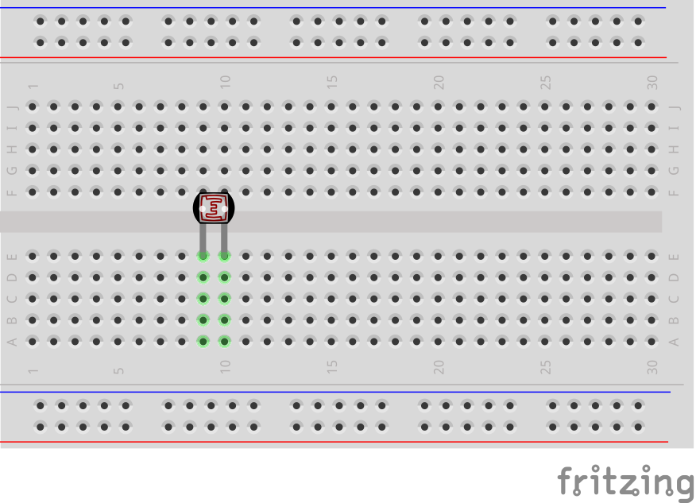
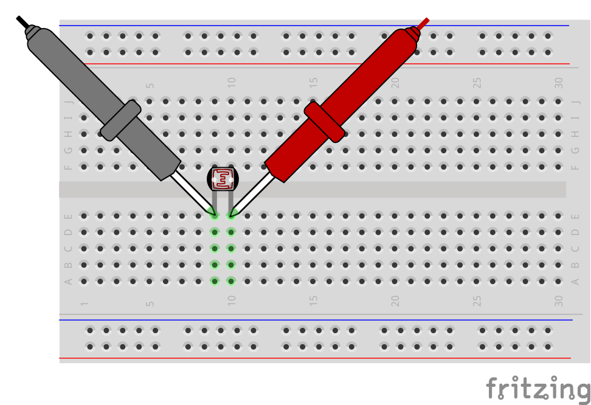
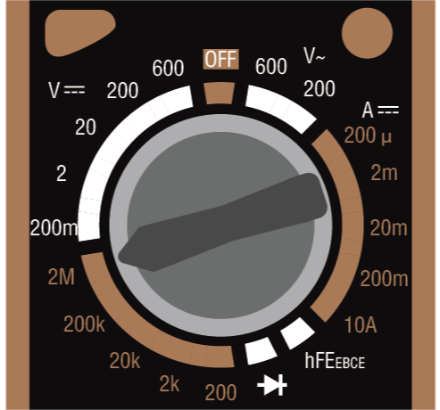
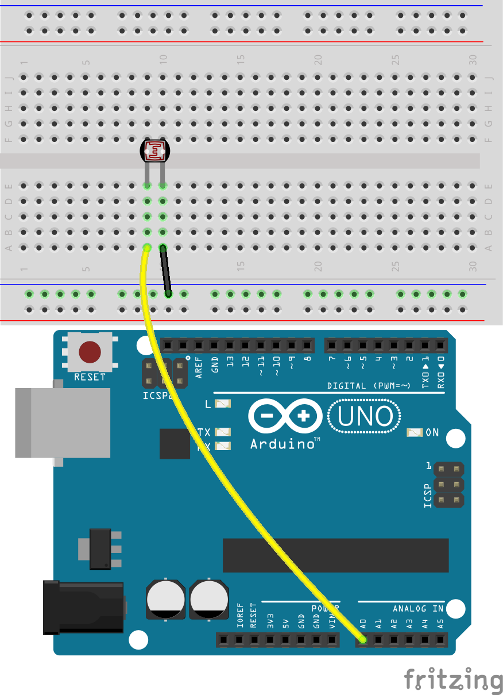
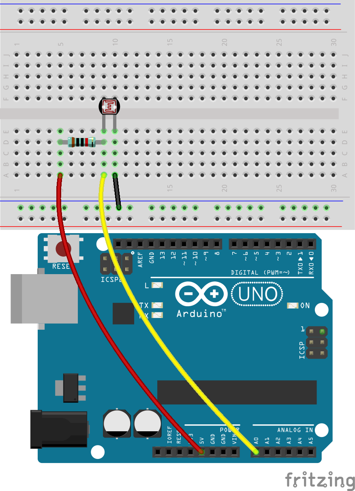
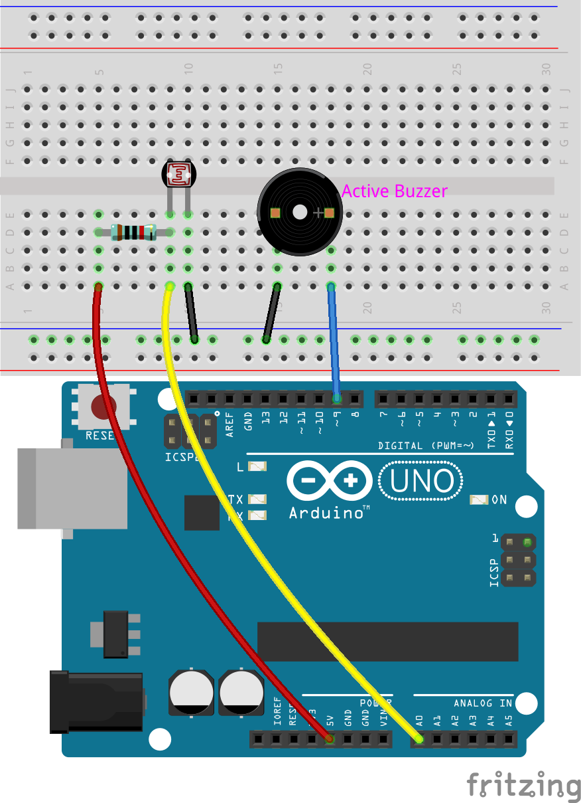

.. note::

    Ciao, benvenuto nella SunFounder Raspberry Pi & Arduino & ESP32 Enthusiasts Community su Facebook! Esplora più a fondo Raspberry Pi, Arduino ed ESP32 insieme ad altri appassionati.

    **Perché unirti?**

    - **Supporto esperto**: Risolvi i problemi post-vendita e le sfide tecniche con l'aiuto della nostra community e del nostro team.
    - **Impara & Condividi**: Scambia suggerimenti e tutorial per migliorare le tue competenze.
    - **Anteprime Esclusive**: Ottieni l'accesso anticipato agli annunci di nuovi prodotti e alle anteprime.
    - **Sconti Speciali**: Godi di sconti esclusivi sui nostri prodotti più recenti.
    - **Promozioni Festive e Giveaway**: Partecipa a promozioni festive e concorsi a premi.

    👉 Pronto per esplorare e creare con noi? Clicca [|link_sf_facebook|] e unisciti oggi stesso!

18. Allarme Luminoso
========================

Immagina una scena degna di un film:
In un museo scarsamente illuminato, un ladro astuto si avvicina furtivamente a un dipinto di inestimabile valore.
Si muove con discrezione, cercando di compiere il furto sotto il manto della notte.
Tuttavia, nel momento in cui tocca il dipinto, una serie di sensori sofisticati viene attivata,
scatenando allarmi in tutta la galleria, illuminando immediatamente l'area circostante.
Il ladro viene prontamente catturato dal personale di sicurezza in loco, impedendo un possibile furto d'arte.
Non è un film; è un esempio reale di come la tecnologia dei sensori funzioni nei moderni sistemi di sicurezza.

Come si ottiene tutto questo? Si tratta di posizionare una fotoresistenza o un sensore di luce più sofisticato vicino alla cornice del dipinto. Qualsiasi tentativo di spostare il dipinto o bloccarlo altera le condizioni di luce, attivando così il sistema di allarme.

Ora, costruiamo un sistema simulato di allarme luminoso utilizzando una fotoresistenza e un buzzer, ci stai?

.. raw:: html

    <video controls style = "max-width:90%">
        <source src="_static/video/18_light_alarm.mp4" type="video/mp4">
        Your browser does not support the video tag.
    </video>

In questa lezione imparerai:

* I principi di funzionamento e le caratteristiche di una fotoresistenza.
* Come costruire un semplice sistema di allarme luminoso.

Costruzione del Circuito
--------------------------

**Componenti Necessari**

.. list-table:: 
   :widths: 25 25 25 25
   :header-rows: 0

   * - 1 * Arduino Uno R3
     - 1 * Fotoresistenza
     - 1 * Resistenza da 10KΩ
     - 1 * Buzzer Attivo
   * - |list_uno_r3| 
     - |list_photoresistor| 
     - |list_10kohm| 
     - |list_active_buzzer| 
   * - 1 * Cavo USB
     - 1 * Breadboard
     - Fili di Collegamento
     - 1 * Multimetro
   * - |list_usb_cable| 
     - |list_breadboard| 
     - |list_wire| 
     - |list_meter|

**Costruzione Passo-Passo**

1. Inizia con una Fotoresistenza.

.. image:: img/17_photoresistor.png
    :width: 100
    :align: center

Una fotoresistenza o fotocellula è una resistenza variabile controllata dalla luce. La resistenza di una fotoresistenza diminuisce con l'aumentare dell'intensità della luce incidente; in altre parole, mostra fotoconduttività.

Le fotoresistenze possono essere utilizzate come semiconduttori resistivi in circuiti rilevatori sensibili alla luce e in circuiti di commutazione attivati dalla luce o dal buio. Al buio, la resistenza di una fotoresistenza può arrivare fino a diversi megaohm (MΩ), mentre in condizioni di luce può scendere a poche centinaia di ohm.

Il kit include una resistenza da 10K a 25°C. Ora, utilizza un multimetro per misurare la resistenza della fotoresistenza in condizioni di luce normale, illuminata e al buio.

2. Poiché la resistenza nominale della fotoresistenza è di 10K, imposta il multimetro per misurare la resistenza nella gamma di 20 kilo-ohm (20K).

.. image:: img/multimeter_20k.png
    :width: 300
    :align: center

3. Inserisci la fotoresistenza nella breadboard nelle posizioni 10E e 11E. I pin non hanno direzionalità e possono essere inseriti liberamente.

4. Ora, tocca i due pin della fotoresistenza con i puntali rosso e nero del multimetro.

5. Leggi il valore della resistenza sotto la luce ambientale corrente e registralo nella tabella sottostante.

.. list-table::
   :widths: 20 20
   :header-rows: 1

   * - Ambiente
     - Resistenza (kilohm)
   * - Luce Normale
     - *5.48*
   * - Luce Intensa
     - 
   * - Buio
     - 

6. Ora, chiedi a un amico di puntare una torcia o un'altra fonte di luce direttamente sulla fotoresistenza e registra il valore della resistenza, che potrebbe essere solo di poche centinaia di ohm. Pertanto, potresti dover impostare il multimetro su 2K o persino su 200 ohm per una lettura più precisa.

.. note::

    Abbiamo impostato l'unità di misura della resistenza nella tabella in kilohm. 1 kilohm (kΩ) = 1000 ohm.

    Se hai scelto l'intervallo di 200 ohm e hai ottenuto una lettura di 164,5 ohm, converti il valore in 0,16 kilohm (consigliato l'arrotondamento a due decimali) e inserisci il valore convertito nella tabella.

.. list-table::
   :widths: 20 20
   :header-rows: 1

   * - Ambiente
     - Resistenza (kilohm)
   * - Luce Normale
     - *≈5.48*
   * - Luce Intensa
     - *≈0.16*
   * - Buio
     - 

7. Per le condizioni di oscurità, la resistenza della fotoresistenza può raggiungere diversi megaohm, quindi dobbiamo impostare il multimetro sulla posizione 2 megaohm.

8. Copri completamente la fotoresistenza con un oggetto nero, quindi registra la resistenza misurata nella tabella.

.. note::
    Abbiamo impostato l'unità di misura della resistenza nella tabella in kilohm. 1 megaohm (MΩ) = 1000 kilohm.

    Se hai scelto l'intervallo di 2 megaohm e hai ottenuto una lettura di 1,954 megaohm, converti il valore in 1954 kilohm, che è il valore che dovresti inserire.

    Se la lettura supera direttamente i 2MΩ, verrà visualizzato "1.", a questo punto puoi inserire direttamente 2 megaohm oppure puoi considerare l'utilizzo di un multimetro più preciso per misurare il valore esatto.

.. list-table::
   :widths: 20 20
   :header-rows: 1

   * - Ambiente
     - Resistenza (kilohm)
   * - Luce Normale
     - *≈5.48*
   * - Luce Intensa
     - *≈0.16*
   * - Buio
     - *≈1954*

Dalle misurazioni, abbiamo confermato le proprietà fotoconduttive della fotoresistenza: maggiore è la luce, minore è la resistenza; minore è la luce, maggiore è la resistenza, che può raggiungere diversi megaohm.

9. Continua a costruire il circuito. Collega un pin della fotoresistenza al terminale negativo della breadboard e l'altro pin al pin A0 dell'Arduino Uno R3.

10. Inserisci una resistenza da 10K nella stessa fila della connessione della fotoresistenza ad A0.

In questo circuito, la resistenza da 10K e la fotoresistenza sono collegate in serie e la corrente che le attraversa è la stessa. La resistenza da 10K funge da protezione e il pin A0 legge il valore dopo la conversione di tensione della fotoresistenza.

Quando la luce aumenta, la resistenza della fotoresistenza diminuisce, quindi la sua tensione diminuisce e il valore letto dal pin A0 diminuirà; se la luce è abbastanza intensa, la resistenza della fotoresistenza sarà vicina a 0 e il valore del pin A0 sarà vicino a 0. In questo momento, la resistenza da 10K svolge un ruolo protettivo, prevenendo un cortocircuito impedendo che i 5V e il GND siano collegati direttamente.

Se posizioni la fotoresistenza in una situazione di buio, il valore del pin A0 aumenterà. In una situazione sufficientemente buia, la resistenza della fotoresistenza sarà infinita e la sua tensione sarà vicina ai 5V (la resistenza da 10K diventa trascurabile), e il valore del pin A0 sarà vicino a 1023.

11. Collega l'altro pin della resistenza da 10K al pin 5V dell'Arduino Uno R3.

12. Successivamente, come nella lezione precedente, inserisci il buzzer attivo nella breadboard, collegando l'anodo al pin 9 dell'R3 e il catodo al terminale negativo della breadboard.

13. Infine, collega il terminale negativo della breadboard al pin GND dell'Arduino Uno R3 con un cavo jumper.

Creazione del Codice
------------------------
1. Apri l'IDE di Arduino e avvia un nuovo progetto selezionando "New Sketch" dal menu "File".
2. Salva il tuo sketch come ``Lesson18_Light_Alarm`` utilizzando ``Ctrl + S`` o cliccando su "Save".

3. Prima del ``void setup()``, crea delle costanti per il fotoresistore e il buzzer, oltre a una costante per il valore di soglia che attiverà l'allarme quando la lettura del fotoresistore scende al di sotto di essa.

.. code-block:: Arduino
    :emphasize-lines: 1,2,3

    const int sensorPin = A0;   // Assegna il pin A0 alla costante per il fotoresistore
    const int buzzerPin = 9;    // Assegna il pin 9 alla costante per il buzzer
    const int threshold = 300;  // Imposta il valore di soglia

    void setup() {
        // Inserisci qui il codice di setup da eseguire una volta:
    }

4. Inoltre, crea una variabile per memorizzare il valore letto dal fotoresistore.

.. code-block:: Arduino
    :emphasize-lines: 5

    const int sensorPin = A0;   // Assegna il pin A0 alla costante per il fotoresistore
    const int buzzerPin = 9;    // Assegna il pin 9 alla costante per il buzzer
    const int threshold = 300;  // Imposta il valore di soglia

    int sensorValue = 0;  // Per memorizzare la lettura del fotoresistore

    void setup() {
        // Inserisci qui il codice di setup da eseguire una volta:
    }

5. Nel ``void setup()``, imposta il buzzer come uscita e avvia la comunicazione seriale per monitorare le letture del fotoresistore.

.. code-block:: Arduino
    :emphasize-lines: 3,4

    void setup() {
        // Inserisci qui il codice di setup da eseguire una volta:
        pinMode(buzzerPin, OUTPUT);  // Imposta il pin del buzzer come uscita
        Serial.begin(9600);          // Inizializza la comunicazione seriale a 9600 baud
    }

6. Nel ``void loop()``, utilizza la funzione ``analogRead()`` per leggere il valore dal fotoresistore e memorizzarlo nella variabile ``sensorValue``. Poi stampa questo valore sul monitor seriale. Ricorda di impostare un intervallo di tempo tra ogni lettura dei dati.

.. code-block:: Arduino
    :emphasize-lines: 3,4,5

    void loop() {
        // Inserisci qui il codice principale da eseguire ripetutamente:
        sensorValue = analogRead(sensorPin);  // Leggi il valore analogico dal fotoresistore
        Serial.println(sensorValue);          // Stampa la lettura del fotoresistore sul monitor seriale
        delay(100); // Attendi 0,1 secondi
    }

7. Quando l'ambiente passa da scuro a luminoso, la resistenza del fotoresistore diminuisce e lo stesso accade per la lettura del pin A0. Ora utilizza un'istruzione ``if`` per verificare se il valore del fotoresistore è inferiore alla soglia impostata; se lo è, accendi il buzzer, altrimenti spegnilo.

.. code-block:: Arduino
    :emphasize-lines: 7-12

    void loop() {
        // Inserisci qui il codice principale da eseguire ripetutamente:
        sensorValue = analogRead(sensorPin);  // Leggi il valore analogico dal fotoresistore
        Serial.println(sensorValue);          // Stampa la lettura del fotoresistore sul monitor seriale
        delay(100);                           // Attendi 0,1 secondi

        // Controlla se la lettura è inferiore alla soglia
        if (sensorValue < threshold) {
            digitalWrite(buzzerPin, HIGH);  // Se inferiore alla soglia, accendi il buzzer
        } else {
            digitalWrite(buzzerPin, LOW);  // Se non inferiore alla soglia, spegni il buzzer
        }
    }

8. Ecco il codice completo. Ora puoi cliccare su "Upload" per caricare il codice su Arduino Uno R3.

.. code-block:: Arduino

    const int sensorPin = A0;   // Assegna il pin A0 alla costante per il fotoresistore
    const int buzzerPin = 9;    // Assegna il pin 9 alla costante per il buzzer
    const int threshold = 300;  // Imposta il valore di soglia

    int sensorValue = 0;  // Per memorizzare la lettura del fotoresistore

    void setup() {
        // Inserisci qui il codice di setup da eseguire una volta:
        pinMode(buzzerPin, OUTPUT);  // Imposta il pin del buzzer come uscita
        Serial.begin(9600);          // Inizializza la comunicazione seriale a 9600 baud
    }

    void loop() {
        // Inserisci qui il codice principale da eseguire ripetutamente:
        sensorValue = analogRead(sensorPin);  // Leggi il valore analogico dal fotoresistore
        Serial.println(sensorValue);          // Stampa la lettura del fotoresistore sul monitor seriale
        delay(100);                           // Attendi 0,1 secondi

        // Controlla se la lettura è inferiore alla soglia
        if (sensorValue < threshold) {
            digitalWrite(buzzerPin, HIGH);  // Se inferiore alla soglia, accendi il buzzer
        } else {
            digitalWrite(buzzerPin, LOW);  // Se non inferiore alla soglia, spegni il buzzer
        }
    }

9. Infine, ricorda di salvare il codice e riordinare il tuo spazio di lavoro.

**Domanda**

Astuti ladri potrebbero decidere di rubare di notte, e se un dipinto scompare, il 
fotoresistore potrebbe non rilevare alcun cambiamento di luce, fallendo così 
nell'attivare l'allarme. Cosa si potrebbe fare per migliorare questo difetto?
