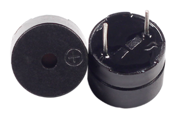
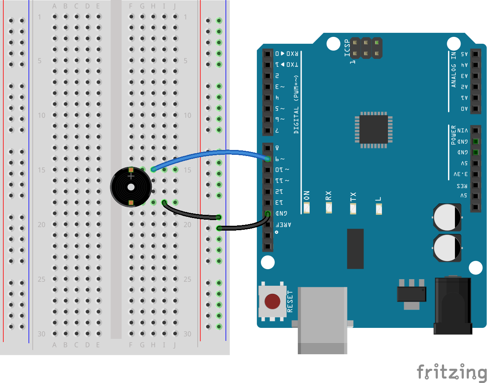

19. 番茄钟
===========================================

在计时器的发展史中，时间与声音的关联一直扮演着关键的角色。从最早的钟声到现代电子提示音，声音一直是人们理解和感知时间流逝的一种直观方式。

.. image:: img/7_big_ben.png

时钟的历史
----------------

在古代世界中，大规模的钟声已被用来标记时间的流逝和特定的社会事件。
例如，中世纪的欧洲城市会利用教堂钟声来标记一天中的祷告时刻和工作的开始与结束。
这些钟声不仅仅是时间的标记，也是社会秩序的一个工具，整个社区的日常生活围绕着这些钟声的规律展开。

**机械钟表与声音**

随着机械钟表的发展，特别是在大本钟的设计中，钟表开始配备了更为复杂的铃铛和报时机制。
大本钟的钟声通过其庞大的铜铃传递，这种设计不仅提高了声音的传播范围，也提升了时间通报的精确度。
在许多小镇和城市中，大本钟的钟声成为了居民调整日常活动的依据，其准确性对于航海、
铁路时刻表等更为精确的时间调度起到了关键作用。

**电子时代的声音计时**

进入电子时代，声音计时器得到了新的发展。电子蜂鸣器的引入，特别是在微控制器如Arduino的辅助下，
使得时间的标记不再依赖于大型机械装置。这些小型设备能够产生不同频率和音调的声音，
可以用于各种计时应用，从简单的厨房计时器到复杂的工业过程控制系统。
例如，现代医院中的护理呼叫系统、学校的课程铃声，以及个人电子设备中的提醒音，都是利用电子蜂鸣器来实现时间管理的实例。

*你在生活中还有什么地方能够‘听见’时间，举几个例子，写在handbook上！*

在这个活动中，我们会制作几个项目，使用蜂鸣器来探索电子世界的时间魔法。

**需要的元件**

* 1 项目板
* 1 有源蜂鸣器
* 1 跳线
* 1 带测试线的万用表

**构筑电路**

1. 拿出有源蜂鸣器。请注意有源蜂鸣器是的背面是密封的。

2. 将蜂鸣器画有“+”的一端连接到R3板的引脚9.

.. image:: img/7_beep_bb_1.png

3. 将另一端连接到GND。

代码创建 - tick tick
----------------------------

在Arduino中， ``delay()`` 是最简单也是最常见的时间函数。
我们通常使用它来让程序暂停一小段时间，配合循环还可以实现让LED闪烁的效果。在这里我们使用delay()函数让蜂鸣器每秒钟响一次。

1. Open the Arduino IDE, go to the “File” menu, and select “New Sketch” to start a fresh project. Close any other sketch windows that might be open.
2. Save your new sketch by clicking “Save” from the “File” menu or by pressing ``Ctrl + S``. Save it in the default Arduino Sketchbook location under the name ``Lesson17_timer_tick_tick``. Click "Save".

3. 编写代码如下所示：

.. code-block:: Arduino

  const int buzzerPin = 9;   // Assigns the pin 9 to the constant for the buzzer  
  
  void setup() {
    // put your setup code here, to run once:
    pinMode(buzzerPin, OUTPUT);  // Set pin 9 as output
  } 

  void loop() {
    // put your main code here, to run repeatedly:
    digitalWrite(buzzerPin, HIGH);  // Turn buzzer ON
    delay(100);                     // Beep duration: 100 milliseconds
    digitalWrite(buzzerPin, LOW);   // Turn buzzer OFF
    delay(1000);                     // Interval between signals: 1000 milliseconds
  }

在这里，第一个``delay()``函数会让R3板暂停100毫秒，器件蜂鸣器持续发声。第二个``delay()``函数使Arduino暂停1000毫秒（1秒），这段时间蜂鸣器不发声。

3. 将代码上传到R3板之后，你将听到蜂鸣器每隔一秒发声一次。

代码创建 - millis
--------------------

使用``delay()``会让你的代码暂停，这会引起一些不方便的情况。

打个比方，就是在微波炉里加热披萨，然后等待一些重要的电子邮件。
您将披萨放入微波炉中，静置 10 分钟。与使用 ``delay()`` 的类比是坐在微波炉前，看着计时器从 10 分钟倒计时到计时器归零。如果在此期间收到重要电子邮件，您将错过它。

而你通常会做的是将披萨放进微波炉，然后检查你的电子邮件，也许还能做点别的事情，隔一段时间后你会回到微波炉前，看看计时器是否已经达到零，表明你的披萨已经完成。

Arduino中自然也有不会让程序暂停的计时工具，那就是 ``mills()`` 。

``millis()`` 函数是 Arduino 编程中非常重要的一个函数，它用于返回自 Arduino 开发板上电或最后一次重置以来经过的时间，单位是毫秒。

在这里，我们同样的让蜂鸣器每一秒beep一次。

1. Open the Arduino IDE, go to the “File” menu, and select “New Sketch” to start a fresh project. Close any other sketch windows that might be open.
2. Save your new sketch by clicking “Save” from the “File” menu or by pressing ``Ctrl + S``. Save it in the default Arduino Sketchbook location under the name ``Lesson17_timer_millis``. Click "Save".

1. 创建一个新的草图，将其命名为"Lesson7_timer_millis"

2. 定义变量

  .. code-block:: Arduino

    int buzzerPin = 9;   // Buzzer connected to digital pin 9
    unsigned long previousMillis = 0;  // will store last time buzzer was updated
    long interval = 1000;  // interval at which to beep (milliseconds)

3. 设置引脚模式

  .. code-block:: Arduino

    void setup() {
      pinMode(buzzerPin, OUTPUT);  // sets the digital pin as output
    }

4. 在 loop（） 中，声明 currentMillis 来存储当前时间。

  .. code-block:: Arduino

    void loop() {
      unsigned long currentMillis = millis();

5. 当当前运行时间与上次更新时间间隔大于1000ms时，触发某些功能。同时，将上一个 Millis 更新为当前时间，以便下一个触发将在 1 秒后发生。

  .. code-block:: Arduino

    if (currentMillis - previousMillis >= interval) {
        previousMillis = currentMillis;// save the last time you make a voice
    //...
    }

6. 添加每隔一段时间所需要执行的主要功能。也就是让蜂鸣器发出声音。

  .. code-block:: Arduino

    if (currentMillis - previousMillis >= interval) {
      previousMillis = currentMillis;   // save the last time you blinked the LED
      digitalWrite(buzzerPin, HIGH);  // make a voice
      delay(100);
      digitalWrite(buzzerPin, LOW);  // silence
    }

你的代码应该是这样的：

  .. code-block:: Arduino

    int buzzerPin = 9;   // Buzzer connected to digital pin 9
    unsigned long previousMillis = 0;  // will store last time buzzer was updated
    long interval = 1000;  // interval at which to beep (milliseconds)

    void setup() {
      pinMode(buzzerPin, OUTPUT);  // sets the digital pin as output
    }

    void loop() {
      unsigned long currentMillis = millis();

      if (currentMillis - previousMillis >= interval) {
        previousMillis = currentMillis;   // save the last time you blinked the LED
        digitalWrite(buzzerPin, HIGH);  // make a voice
        delay(100);
        digitalWrite(buzzerPin, LOW);  // silence
      }
    }

7. 点击“上传”按钮，将草图上传到你的 Arduino 板。

8. 点击 “保存” 来保存你的草图。

**实验3：番茄钟**

番茄钟，也被称为番茄工作法（Pomodoro Technique），
是一种时间管理方法，由弗朗切斯科·西里洛（Francesco Cirillo）在1980年代末期开发。
这个方法使用一个计时器来划分时间为25分钟的工作区块，每个区块之后是一个短暂的休息时间。
每个工作区块称为一个“番茄”，源于西里洛在大学时使用的厨房计时器，形状像一个番茄。

番茄工作法的基本步骤包括：

1. 设定任务：在开始之前，确定你需要完成的任务。
2. 设定番茄钟：使用计时器设定25分钟的工作时间。
3. 专注工作：在这25分钟内，全力以赴地专注于任务，避免任何形式的干扰。
4. 短暂休息：工作时间结束后，休息5分钟。这段时间可以起身走动、伸展、喝水等，但避免与工作相关的活动。

番茄工作法的优势包括：提高专注度，减少疲劳，明确的工作和休息时间帮助管理工作中的干扰，增加完成工作的动力和满足感。
并且，番茄工作法不需要复杂的工具或技术，一个简单的计时器就足够了。

接下来我们会编程一个计时器，每隔25分钟让蜂鸣器发出提醒信号，随后是5分钟的休息时间提醒：

1. 创建一个新的草图，将其命名为"Lesson7_timer_tomato"

2. Define Variables:

* Define the pin connected to the buzzer as an integer.
* Use unsigned long to store start times, as millis() returns the number of milliseconds since the Arduino board began running the current program.
* Define constants for the work and break periods using const long.
* Use a static boolean variable to track whether it's a work or break period.

.. code-block:: Arduino

  int buzzerPin = 9; // Set the buzzer to pin 8
  unsigned long startMillis; // Stores the time when the timer starts
  const long workPeriod = 1500000; // Work period of 25 minutes
  const long breakPeriod = 300000;  // Break period of 5 minutes
  bool isWorkPeriod = true; // Track whether it is a work or break period

3. Setup Function:

* Initialize the buzzer pin as an output using pinMode().
* Start the timer by recording the start time with millis().

.. code-block:: Arduino

  void setup() {
    pinMode(buzzerPin, OUTPUT); // Initialize buzzer pin as an output
    startMillis = millis(); // Record the start time
  }

4. Main Loop:

在loop()函数中，使用unsigned long currentMillis = millis();来获取当前时间。

.. code-block:: Arduino

  void loop() {
    unsigned long currentMillis = millis(); // Update the current time

    ... ...
  }

5. 使用条件语句判断是否处于工作期。

.. code-block:: Arduino
  :emphasize-lines: 4-8

  void loop() {
    unsigned long currentMillis = millis(); // Update the current time

    if (isWorkPeriod){ 
      ...
    } else if (!isWorkPeriod) 
      ...
    }
  }

6. 如果是，检查当前时间是否已超过工作周期。若超过，则重置计时器，切换到休息期，并触发蜂鸣器三次。

.. code-block:: Arduino
  :emphasize-lines: 5-9

  void loop() {
    unsigned long currentMillis = millis(); // Update the current time

    if (isWorkPeriod){ 
      if(currentMillis - startMillis >= workPeriod) {
        startMillis = currentMillis; // Reset the timer
        isWorkPeriod = false; // Switch to break period
        alertBuzzer(3); // Buzzer alerts 3 times at end of work period
      }
    } else if (!isWorkPeriod) 
      ... ...
    }
  }

7. 使用另一个条件语句判断是否处于休息期，如果是，同样检查当前时间是否已超过休息周期。若超过，则重置计时器，切换回工作期，并触发蜂鸣器两次。

.. code-block:: Arduino
  :emphasize-lines: 11-15

  void loop() {
    unsigned long currentMillis = millis(); // Update the current time

    if (isWorkPeriod){ 
      if(currentMillis - startMillis >= workPeriod) {
        startMillis = currentMillis; // Reset the timer
        isWorkPeriod = false; // Switch to break period
        alertBuzzer(3); // Buzzer alerts 3 times at end of work period
      }
    } else if (!isWorkPeriod) 
      if(currentMillis - startMillis >= breakPeriod) {
        startMillis = currentMillis; // Reset the timer
        isWorkPeriod = true; // Switch to work period
        alertBuzzer(2); // Buzzer alerts 2 times at end of break period
      }
    }
  }

8. 编写alertBuzzer(int count)函数，使用for循环控制蜂鸣器按指定次数响起。每次响起包括一个200毫秒的高电平和200毫秒的低电平。

.. code-block:: Arduino

  void alertBuzzer(int count) {
    for(int i = 0; i < count; i++) {
      digitalWrite(buzzerPin, HIGH); // Turn buzzer on
      delay(200); // Buzzer on for 200 milliseconds
      digitalWrite(buzzerPin, LOW); // Turn buzzer off
      delay(200); // Buzzer off for 200 milliseconds
    }
  }

你的代码应当是这个样子：

.. code-block:: Arduino

  int buzzerPin = 9; // Set the buzzer to pin 8
  unsigned long startMillis; // Stores the time when the timer starts
  const long workPeriod = 1500000; // Work period of 25 minutes
  const long breakPeriod = 300000;  // Break period of 5 minutes
  static bool isWorkPeriod = true; // Track whether it is a work or break period  

  void setup() {
    pinMode(buzzerPin, OUTPUT); // Initialize buzzer pin as an output
    startMillis = millis(); // Record the start time
  }

  void loop() {
    unsigned long currentMillis = millis(); // Update the current time

    if (isWorkPeriod){ 
      if(currentMillis - startMillis >= workPeriod) {
        startMillis = currentMillis; // Reset the timer
        isWorkPeriod = false; // Switch to break period
        alertBuzzer(3); // Buzzer alerts 3 times at end of work period
      }
    } else if (!isWorkPeriod) 
      if(currentMillis - startMillis >= breakPeriod) {
        startMillis = currentMillis; // Reset the timer
        isWorkPeriod = true; // Switch to work period
        alertBuzzer(2); // Buzzer alerts 2 times at end of break period
      }
    }
  }

  void alertBuzzer(int count) {
    for(int i = 0; i < count; i++) {
      digitalWrite(buzzerPin, HIGH); // Turn buzzer on
      delay(200); // Buzzer on for 200 milliseconds
      digitalWrite(buzzerPin, LOW); // Turn buzzer off
      delay(200); // Buzzer off for 200 milliseconds
    }
  }

9. 点击“上传”按钮，将草图上传到你的 Arduino 板。

10. 点击 “保存” 来保存你的草图。

