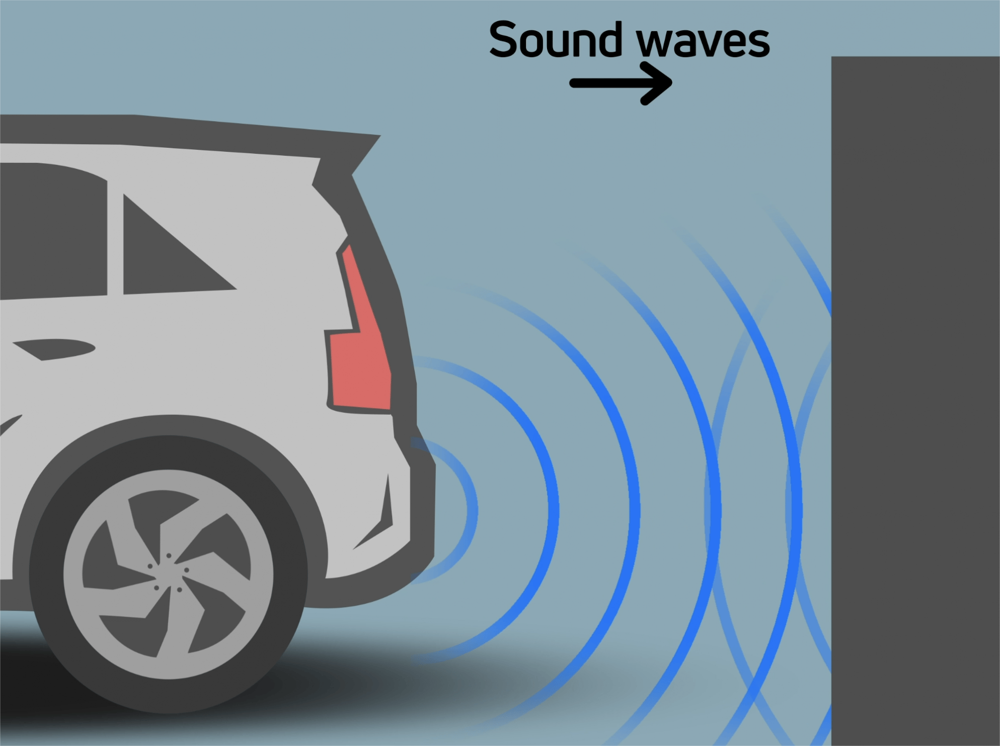
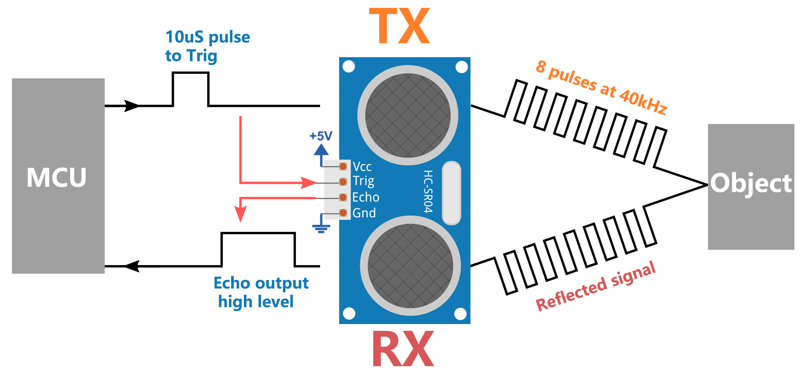
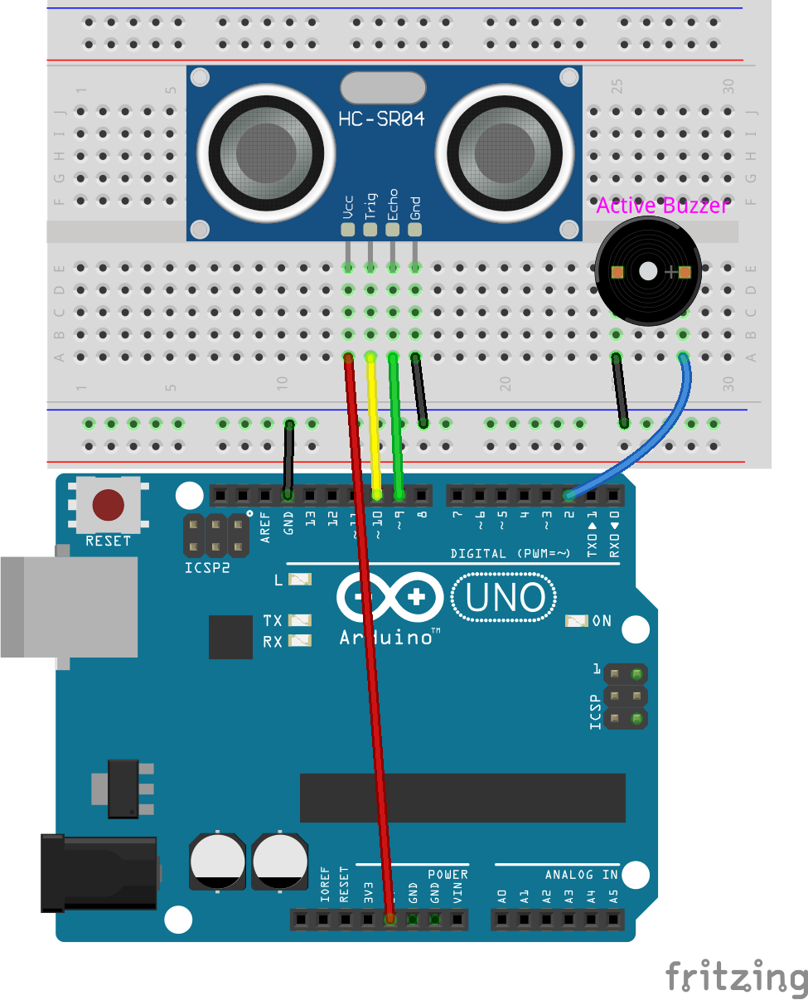

.. note::

    Bonjour, bienvenue dans la communauté des passionnés de Raspberry Pi, Arduino et ESP32 de SunFounder sur Facebook ! Plongez plus profondément dans l'univers du Raspberry Pi, Arduino et ESP32 avec d'autres passionnés.

    **Pourquoi nous rejoindre ?**

    - **Support d'experts** : Résolvez vos problèmes après-vente et relevez vos défis techniques grâce à l'aide de notre communauté et de notre équipe.
    - **Apprenez & Partagez** : Échangez des astuces et des tutoriels pour améliorer vos compétences.
    - **Aperçus exclusifs** : Profitez d'un accès anticipé aux annonces de nouveaux produits et à des avant-premières exclusives.
    - **Réductions spéciales** : Bénéficiez de réductions exclusives sur nos nouveaux produits.
    - **Promotions festives et concours** : Participez à des concours et à des promotions festives.

    👉 Prêt à explorer et créer avec nous ? Cliquez sur [|link_sf_facebook|] et rejoignez-nous dès aujourd'hui !

19. Système d'alarme de stationnement en marche arrière
=============================================================

Lorsqu'on recule avec une voiture, il est crucial d'être conscient des obstacles derrière le véhicule, surtout dans des situations de visibilité réduite. 
Pour améliorer la sécurité, de nombreux véhicules modernes sont équipés de systèmes d'avertissement de recul. 

Dans ce projet, nous allons utiliser un Arduino, un capteur ultrasonique et un buzzer actif pour simuler un tel système. 
Le capteur ultrasonique permet de détecter la distance des obstacles derrière le véhicule, et lorsque cette distance est trop courte, le buzzer actif émet une alerte pour avertir le conducteur. 

Ce projet nous permet non seulement de mieux comprendre le fonctionnement des capteurs ultrasoniques, mais également d'apprendre à programmer et à contrôler un Arduino pour mettre en œuvre une fonction pratique d'avertissement de recul. 

.. raw:: html

    <video controls style = "max-width:90%">
        <source src="_static/video/19_reverse_parking_system.mp4" type="video/mp4">
        Your browser does not support the video tag.
    </video>
  

**Module Ultrasonique**

Imaginez que vous vous trouvez dans une pièce sombre et que vous ne pouvez pas voir les objets autour de vous. Dans cette situation, vous pourriez taper dans vos mains pour produire un son qui se propage vers l'extérieur. Lorsque ce son rencontre un mur ou un autre objet, il rebondit sous forme d'écho. Si vous écoutez attentivement, vous pouvez entendre cet écho. En calculant le temps que le son met pour voyager et revenir, vous pouvez estimer approximativement la distance qui vous sépare du mur ou de l'objet. Les capteurs ultrasoniques fonctionnent de manière similaire pour "voir" le monde qui les entoure.

.. image:: img/19_ultrasonic_pic.png
    :width: 400
    :align: center

Les capteurs ultrasoniques se composent principalement de deux parties : un émetteur et un récepteur, un peu comme votre bouche et vos oreilles.

1. Émission des ondes sonores :

Lorsque le capteur ultrasonique est activé, l'émetteur envoie une série d'ondes sonores rapides, un peu comme si vous tapiez dans vos mains. Ces ondes sonores ont une fréquence si élevée que nos oreilles ne peuvent pas les entendre.

2. Propagation et retour du son :

Les ondes sonores se propagent vers l'avant jusqu'à rencontrer un obstacle, comme un mur ou une table, puis elles rebondissent.

3. Réception des ondes sonores :

La partie réceptrice du capteur ultrasonique est chargée de "capturer" ces échos, comme vos oreilles captant les sons réfléchis par les objets.

4. Calcul de la distance :

Le capteur enregistre le temps nécessaire aux ondes sonores pour se déplacer et revenir. 
Étant donné que la vitesse du son est connue (environ 340 mètres par seconde dans l'air), 
en multipliant ce temps par la vitesse du son, on obtient la distance totale parcourue par les ondes sonores. 
Comme nous n'avons besoin que de la distance aller simple jusqu'à l'objet, 
nous divisons la distance totale par 2 pour obtenir le résultat final.
Cette technologie rend les capteurs ultrasoniques très utiles dans de nombreuses situations, 
comme aider les robots à éviter les obstacles ou assister les conducteurs en indiquant la distance par rapport aux objets lorsqu'ils reculent.

**Synchronisation Ultrasonique**

Le diagramme de synchronisation est illustré ci-dessous. 
Il suffit de fournir une brève impulsion de 10us pour l'entrée de déclenchement afin de démarrer le mesurage, 
puis le module enverra une rafale de 8 cycles d'ultrasons à 40 kHz et relèvera son écho. 
Vous pouvez calculer la distance à l'aide de l'intervalle de temps entre l'envoi du signal de déclenchement et la réception du signal d'écho.

Formule : us / 58 = centimètres ou us / 148 = pouces ; ou : la distance = temps de haut niveau * vitesse (340M/S) / 2 ; 
il est recommandé d'utiliser un cycle de mesure supérieur à 60 ms afin de prévenir les collisions de signaux entre le signal de déclenchement et le signal d'écho.

.. image:: img/19_ultrasonic_timing.png
    :width: 600
    :align: center

Construction du circuit
--------------------------------

**Composants nécessaires**

.. list-table:: 
   :widths: 25 25 25 25
   :header-rows: 0

   * - 1 * Arduino Uno R3
     - 1 * Module Ultrasonique
     - 1 * Buzzer Actif
     - Fils de connexion
   * - |list_uno_r3| 
     - |list_ultrasonic| 
     - |list_active_buzzer| 
     - |list_wire| 
   * - 1 * Câble USB
     - 1 * Plaque d'essai
     - 1 * Multimètre
     - 
   * - |list_usb_cable| 
     - |list_breadboard| 
     - |list_meter| 
     - 

**Étapes de construction**

Suivez le schéma de câblage ou les étapes ci-dessous pour assembler votre circuit.

Création du code
--------------------

1. Ouvrez l'IDE Arduino et démarrez un nouveau projet en sélectionnant "New Sketch" dans le menu "Fichier".
2. Enregistrez votre sketch sous le nom ``Lesson19_reversing_alarm`` en utilisant ``Ctrl + S`` ou en cliquant sur "Enregistrer".

3. Tout d'abord, nous devons définir les broches de l'Arduino qui sont connectées au capteur ultrasonique et au buzzer. Cette étape est cruciale car elle pose les bases de l'interface matérielle.

* **TRIGGER_PIN** et **ECHO_PIN** sont utilisés pour déclencher et recevoir les échos du capteur ultrasonique.
* **BUZZER_PIN** est la broche connectée au buzzer.

.. code-block:: Arduino

  #define TRIGGER_PIN  10
  #define ECHO_PIN     9
  #define BUZZER_PIN   2

4. Dans la fonction setup(), nous définissons le mode de chaque broche. La broche Trig doit être configurée en sortie (car elle envoie le signal), la broche Echo est configurée en entrée (car elle reçoit le signal), et la broche du buzzer est également définie en sortie (car elle doit émettre un son).

.. code-block:: Arduino

  void setup() {
    pinMode(TRIGGER_PIN, OUTPUT);
    pinMode(ECHO_PIN, INPUT);
    pinMode(BUZZER_PIN, OUTPUT);
    Serial.begin(9600); // Démarrage de la communication série pour le débogage et la visualisation de la distance
  }

5. Écriture de la fonction measureDistance():

La fonction measureDistance() encapsule la logique nécessaire pour déclencher le capteur ultrasonique et lire la distance en fonction de l'écho reçu :

a. Déclenchement de l'impulsion ultrasonique

  * Mettez le TRIGGER_PIN à LOW au départ pour assurer une impulsion propre.
  * Un court délai de 2 microsecondes garantit que la ligne est dégagée.
  * Envoyez une impulsion HIGH de 10 microsecondes sur le TRIGGER_PIN. Cette impulsion demande au capteur d'émettre une onde sonore ultrasonique.
  * Remettez le TRIGGER_PIN à LOW pour terminer l'impulsion.

  .. code-block:: Arduino

    long measureDistance() {
      digitalWrite(TRIGGER_PIN, LOW);  // Assurez-vous que la broche Trig est à LOW avant une impulsion
      delayMicroseconds(2);
      digitalWrite(TRIGGER_PIN, HIGH); // Envoyez une impulsion HIGH
      delayMicroseconds(10);           // Durée de l'impulsion de 10 microsecondes
      digitalWrite(TRIGGER_PIN, LOW);  // Terminez l'impulsion HIGH
    }

.. note::

  Dans les leçons précédentes, nous avons travaillé avec des types de variables ``int`` et ``float``. Voyons maintenant ce que sont les variables ``long`` et ``unsigned long`` :

  * ``long`` : Un entier ``long`` est une version étendue d'un ``int``. Il est utilisé pour stocker des valeurs entières plus grandes que la capacité des ``int`` standard. Un ``long`` occupe généralement 32 ou 64 bits de mémoire, ce qui lui permet de contenir des valeurs beaucoup plus grandes, positives comme négatives.
  * ``unsigned long`` : Un ``unsigned long`` est similaire à un ``long`` mais ne peut représenter que des valeurs non négatives. Il utilise le bit normalement réservé au signe pour étendre la plage des valeurs possibles, mais uniquement dans le spectre positif.

b. Lecture de l'écho

  * La fonction pulseIn() est utilisée sur l'ECHO_PIN pour mesurer la durée de l'impulsion entrante. Cette fonction attend que la broche passe à HIGH, mesure combien de temps elle reste à HIGH, puis retourne la durée en microsecondes.
  * Cette durée correspond au temps nécessaire à l'onde ultrasonique pour voyager jusqu'à l'objet et revenir.

  .. code-block:: Arduino
    :emphasize-lines: 7

    long measureDistance() {
      digitalWrite(TRIGGER_PIN, LOW);  // Assurez-vous que la broche Trig est à LOW avant une impulsion
      delayMicroseconds(2);
      digitalWrite(TRIGGER_PIN, HIGH); // Envoyez une impulsion HIGH
      delayMicroseconds(10);           // Durée de l'impulsion de 10 microsecondes
      digitalWrite(TRIGGER_PIN, LOW);  // Terminez l'impulsion HIGH
      long duration = pulseIn(ECHO_PIN, HIGH);  // Mesurez la durée du niveau HIGH sur la broche Echo
    }

c. Calcul de la distance

  * La vitesse du son dans l'air (environ 340 m/s) est utilisée ici. La formule pour calculer la distance est (durée * vitesse du son) / 2. Nous divisons par 2 car l'onde sonore se déplace jusqu'à l'objet et revient, donc nous ne comptons que la moitié de la distance pour une mesure aller simple.
  * Dans notre code, 0.034 cm/us (vitesse du son en cm/microseconde) est utilisé comme facteur de conversion.

  .. code-block:: Arduino
    :emphasize-lines: 8,9

    long measureDistance() {
      digitalWrite(TRIGGER_PIN, LOW);  // Assurez-vous que la broche Trig est à LOW avant une impulsion
      delayMicroseconds(2);
      digitalWrite(TRIGGER_PIN, HIGH); // Envoyez une impulsion HIGH
      delayMicroseconds(10);           // Durée de l'impulsion de 10 microsecondes
      digitalWrite(TRIGGER_PIN, LOW);  // Terminez l'impulsion HIGH
      long duration = pulseIn(ECHO_PIN, HIGH);  // Mesurez la durée du niveau HIGH sur la broche Echo
      long distance = duration * 0.034 / 2;     // Calculez la distance (en cm)
      return distance;
    }

6. Implémentation de la boucle principale
Dans la fonction loop(), la distance est mesurée fréquemment en utilisant la fonction measureDistance(). 
Des décisions sont prises en fonction de cette distance, comme l'activation du buzzer.

.. code-block:: Arduino

  void loop() {
    long distance = measureDistance(); // Mesurer la distance
    Serial.print("Distance : ");
    Serial.print(distance);
    Serial.println(" cm");

    if (distance > 0 && distance <= 50) {
      digitalWrite(BUZZER_PIN, HIGH);  // Activer le buzzer si l'objet est proche
      delay(100);                      // Le buzzer sonne pendant 100 millisecondes
      digitalWrite(BUZZER_PIN, LOW);   // Éteindre le buzzer
    } else {
      digitalWrite(BUZZER_PIN, LOW);   // Laisser le buzzer éteint
    }

    delay(100);  // Délai entre les mesures pour éviter une surcharge du capteur
  }

7. Voici votre code complet. Vous pouvez maintenant cliquer sur "Téléverser" pour envoyer le code à l'Arduino Uno R3.

.. code-block:: Arduino

  #define TRIGGER_PIN  10
  #define ECHO_PIN     9
  #define BUZZER_PIN   2

  void setup() {
    pinMode(TRIGGER_PIN, OUTPUT);  // Configurer la broche Trig comme sortie
    pinMode(ECHO_PIN, INPUT);      // Configurer la broche Echo comme entrée
    pinMode(BUZZER_PIN, OUTPUT);   // Configurer la broche du buzzer comme sortie
    Serial.begin(9600);            // Démarrer la communication série pour le débogage
  }

  void loop() {
    long distance = measureDistance(); // Appeler la fonction pour mesurer la distance
    Serial.print("Distance : ");
    Serial.print(distance);
    Serial.println(" cm");

    if (distance > 0 && distance <= 50) { // Si la distance est inférieure ou égale à 50 centimètres
      digitalWrite(BUZZER_PIN, HIGH);     // Activer le buzzer
      delay(100);                         // Le buzzer sonne pendant 100 millisecondes
      digitalWrite(BUZZER_PIN, LOW);      // Éteindre le buzzer
    } else {
      digitalWrite(BUZZER_PIN, LOW);      // Laisser le buzzer éteint
    }

    delay(100);  // Délai entre les mesures
  }

  long measureDistance() {
    digitalWrite(TRIGGER_PIN, LOW);  // Assurez-vous que la broche Trig est à LOW avant l'impulsion
    delayMicroseconds(2);
    digitalWrite(TRIGGER_PIN, HIGH); // Envoyer une impulsion HIGH
    delayMicroseconds(10);           // Durée de l'impulsion de 10 microsecondes
    digitalWrite(TRIGGER_PIN, LOW);  // Terminer l'impulsion HIGH

    long duration = pulseIn(ECHO_PIN, HIGH);  // Mesurer la durée du niveau HIGH sur la broche Echo
    long distance = duration * 0.034 / 2;     // Calculer la distance (en cm)
    return distance;
  }

8. Enfin, n'oubliez pas d'enregistrer votre code et de ranger votre espace de travail.

**Question**

Si vous souhaitez que la distance détectée par cet appareil soit plus précise avec des décimales, comment devriez-vous modifier le code ?
