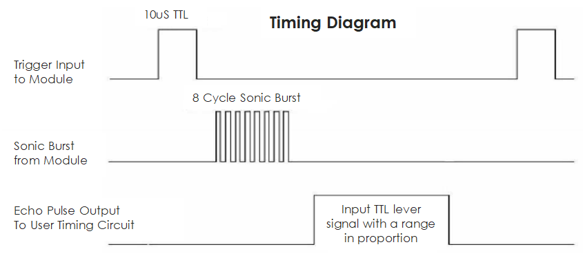

.. note::

    Hallo, willkommen in der SunFounder Raspberry Pi & Arduino & ESP32 Enthusiasten-Community auf Facebook! Tauche tiefer in Raspberry Pi, Arduino und ESP32 ein und tausche dich mit anderen Begeisterten aus.

    **Warum beitreten?**

    - **Expertenunterstützung**: Löse nach dem Kauf auftretende Probleme und technische Herausforderungen mit Hilfe unserer Community und unseres Teams.
    - **Lernen & Teilen**: Tausche Tipps und Tutorials aus, um deine Fähigkeiten zu verbessern.
    - **Exklusive Vorschauen**: Erhalte frühzeitigen Zugang zu neuen Produktankündigungen und Einblicken hinter die Kulissen.
    - **Exklusive Rabatte**: Genieße exklusive Rabatte auf unsere neuesten Produkte.
    - **Festliche Aktionen und Verlosungen**: Nimm an Verlosungen und festlichen Sonderaktionen teil.

    👉 Bereit, mit uns zu forschen und zu basteln? Klicke [|link_sf_facebook|] und tritt noch heute bei!

19. Rückfahrwarner-System
=====================================

.. image:: img/19_packing.png
    :width: 600
    :align: center

Beim Rückwärtsfahren ist es entscheidend, Hindernisse hinter dem Fahrzeug zu erkennen, insbesondere in Situationen mit eingeschränkter Sicht.
Um die Sicherheit zu erhöhen, sind viele moderne Fahrzeuge mit Rückfahrwarnsystemen ausgestattet.

In diesem Projekt werden wir ein Arduino, einen Ultraschallsensor und einen aktiven Summer verwenden, um ein solches System zu simulieren.
Der Ultraschallsensor hilft dabei, den Abstand zu Hindernissen hinter dem Fahrzeug zu erkennen, und wenn dieser Abstand zu kurz wird, ertönt ein aktiver Summer, um den Fahrer zu warnen.

Dieses Projekt ermöglicht es uns nicht nur, besser zu verstehen, wie Ultraschallsensoren funktionieren, sondern lehrt uns auch, wie man mit Arduino programmiert und steuert, um eine praktische Rückfahrwarnfunktion zu implementieren.

.. raw:: html

    <video controls style = "max-width:90%">
        <source src="_static/video/19_reverse_parking_system.mp4" type="video/mp4">
        Your browser does not support the video tag.
    </video>

**Ultraschallmodul**

Stellen Sie sich vor, Sie befinden sich in einem dunklen Raum und können die Gegenstände um Sie herum nicht sehen. In dieser Situation könnten Sie in die Hände klatschen, um ein Geräusch zu erzeugen, das sich nach außen ausbreitet. Wenn dieses Geräusch auf eine Wand oder einen anderen Gegenstand trifft, wird es als Echo zurückgeworfen. Wenn Sie genau hinhören, können Sie dieses Echo hören. Durch Berechnung der Zeit, die der Schall benötigt, um hinauszugehen und das Echo zurückzukehren, können Sie grob abschätzen, wie weit die Wand oder der Gegenstand entfernt ist. Ultraschallsensoren funktionieren auf ähnliche Weise, um die Umgebung „zu sehen“.

.. image:: img/19_ultrasonic_pic.png
    :width: 400
    :align: center

Ultraschallsensoren bestehen hauptsächlich aus zwei Teilen: einem Sender und einem Empfänger, ähnlich wie Mund und Ohren.

1. Aussenden von Schallwellen:

Wenn der Ultraschallsensor aktiviert wird, sendet der Sender eine Reihe schneller Schallwellen aus, ähnlich wie das Klatschen Ihrer Hände. Diese Schallwellen haben eine so hohe Frequenz, dass unsere Ohren sie nicht hören können.

2. Der Schall breitet sich aus und kehrt zurück:

Die Schallwellen breiten sich nach vorne aus, bis sie auf etwas wie eine Wand oder einen Tisch treffen, und dann werden sie zurückgeworfen.

3. Empfang der Schallwellen:

Der Empfänger des Ultraschallsensors ist dafür verantwortlich, diese Echos „anzuhören“, ähnlich wie Ihre Ohren die reflektierten Schallwellen von Gegenständen auffangen.

4. Berechnung der Entfernung:

Der Sensor zeichnet die Zeit auf, die die Schallwellen benötigen, um hinauszugehen und zurückzukehren.
Da die Schallgeschwindigkeit bekannt ist (etwa 340 Meter pro Sekunde in der Luft),
liefert die Multiplikation dieser Zeit mit der Schallgeschwindigkeit die gesamte Strecke, die die Schallwellen zurückgelegt haben.
Da wir nur die einfache Entfernung zum Objekt benötigen,
teilen wir die gesamte Entfernung durch 2, um das endgültige Ergebnis zu erhalten.
Diese Technologie macht Ultraschallsensoren in vielen Situationen sehr nützlich,
zum Beispiel, um Robotern zu helfen, Hindernissen auszuweichen, oder um Fahrern beim Rückwärtsfahren die Entfernung zu Hindernissen hinter dem Fahrzeug anzuzeigen.

.. image:: img/19_ultrasonic_ms.png
    :width: 500
    :align: center

**Ultraschall-Timing**

Das Timing-Diagramm ist unten dargestellt.
Sie müssen nur einen kurzen 10µs-Impuls für den Trigger-Eingang bereitstellen, um die Messung zu starten,
und dann sendet das Modul einen 8-Zyklus-Ultraschallstoß bei 40 kHz aus und hebt sein Echo an.
Sie können die Reichweite durch das Zeitintervall zwischen dem Senden des Triggersignals und dem Empfang des Echosignals berechnen.

Formel: us / 58 = Zentimeter oder us / 148 = Zoll; oder: die Reichweite = Hochpegelzeit * Geschwindigkeit (340M/S) / 2;
es wird empfohlen, einen Messzyklus von über 60ms zu verwenden, um Signalstörungen zwischen dem Triggersignal und dem Echosignal zu vermeiden.

Schaltungsaufbau
-----------------------------

**Benötigte Komponenten**

.. list-table:: 
   :widths: 25 25 25 25
   :header-rows: 0

   * - 1 * Arduino Uno R3
     - 1 * Ultraschallmodul
     - 1 * Aktiver Summer
     - Verbindungskabel
   * - |list_uno_r3| 
     - |list_ultrasonic| 
     - |list_active_buzzer| 
     - |list_wire| 
   * - 1 * USB-Kabel
     - 1 * Steckbrett
     - 1 * Multimeter
     - 
   * - |list_usb_cable| 
     - |list_breadboard| 
     - |list_meter| 
     - 

**Schritt-für-Schritt-Aufbau**

Folgen Sie dem Schaltplan oder den untenstehenden Schritten, um Ihre Schaltung zu erstellen.

.. image:: img/19_reversing_aid_bb.png
    :width: 600
    :align: center

Erstellen des Codes
------------------------

1. Öffnen Sie die Arduino IDE und starten Sie ein neues Projekt, indem Sie „New Sketch“ aus dem Menü „File“ auswählen.
2. Speichern Sie Ihren Sketch als ``Lesson19_reversin_alarm`` mit ``Strg + S`` oder durch Klicken auf „Speichern“.

3. Zuerst müssen wir die Pins auf dem Arduino definieren, die mit dem Ultraschallsensor und dem Summer verbunden sind. Dieser Schritt ist entscheidend, da er die Grundlage für die Hardware-Schnittstelle bildet.

* **TRIGGER_PIN** und **ECHO_PIN** werden verwendet, um den Ultraschallsensor auszulösen und die Echos zu empfangen.
* **BUZZER_PIN** ist der Pin, der mit dem Summer verbunden ist.

.. code-block:: Arduino

  #define TRIGGER_PIN  10
  #define ECHO_PIN     9
  #define BUZZER_PIN   2

4. In der Funktion setup() legen wir den Modus für jeden Pin fest. Der Trigger-Pin muss auf Ausgang gesetzt werden (da er das Signal sendet), der Echo-Pin wird auf Eingang gesetzt (da er das Signal empfängt), und der Summer-Pin wird ebenfalls auf Ausgang gesetzt (da er ein Geräusch ausgeben muss).

.. code-block:: Arduino

  void setup() {
    pinMode(TRIGGER_PIN, OUTPUT);
    pinMode(ECHO_PIN, INPUT);
    pinMode(BUZZER_PIN, OUTPUT);
    Serial.begin(9600); // Starte die serielle Kommunikation zur Fehlerbehebung und zur Anzeige der Entfernung
  }

5. Schreiben der Funktion measureDistance():

Die Funktion measureDistance() enthält die Logik, die erforderlich ist, um den Ultraschallsensor auszulösen und die Entfernung basierend auf dem empfangenen Echo zu berechnen:

a. Auslösen des Ultraschallimpulses:

  * Setzen Sie den TRIGGER_PIN zunächst auf LOW, um einen sauberen Impuls zu gewährleisten.
  * Eine kurze Verzögerung von 2 Mikrosekunden sorgt dafür, dass die Leitung frei ist.
  * Senden Sie einen 10-Mikrosekunden-Hochimpuls an den TRIGGER_PIN. Dieser Impuls weist den Sensor an, eine Ultraschallwelle auszusenden.
  * Setzen Sie den TRIGGER_PIN zurück auf LOW, um den Impuls zu beenden.

  .. code-block:: Arduino

    long measureDistance() {
      digitalWrite(TRIGGER_PIN, LOW);  // Stellen Sie sicher, dass der Trigger-Pin vor einem Impuls LOW ist
      delayMicroseconds(2);
      digitalWrite(TRIGGER_PIN, HIGH); // Senden Sie einen Hochimpuls
      delayMicroseconds(10);           // Impulsdauer von 10 Mikrosekunden
      digitalWrite(TRIGGER_PIN, LOW);  // Beenden Sie den Hochimpuls
    }

.. note::

  In früheren Lektionen haben wir mit ``int``- und ``float``-Variablen oder Konstanten gearbeitet. Nun lassen Sie uns verstehen, was es mit den Typen ``long`` und ``unsigned long`` auf sich hat:

  * ``long``: Ein ``long``-Integer ist eine erweiterte Version eines ``int``. Es wird verwendet, um größere Ganzzahlen zu speichern, die die Kapazität eines Standard-``int`` überschreiten. Ein ``long`` belegt typischerweise 32 oder 64 Bit Speicher, was es ihm ermöglicht, viel größere Werte zu speichern, sowohl positive als auch negative.
  * ``unsigned long``: Ein ``unsigned long`` ist ähnlich wie ein ``long``, kann jedoch nur nicht-negative Werte darstellen. Es verwendet das Bit, das normalerweise für das Vorzeichen reserviert ist, um den Bereich der möglichen Werte zu erweitern, jedoch ausschließlich im positiven Bereich.

b. Echo lesen:

  * Die Funktion pulseIn() wird am ECHO_PIN verwendet, um die Dauer des eingehenden Impulses zu messen. Diese Funktion wartet darauf, dass der Pin HIGH wird, misst, wie lange er HIGH bleibt, und gibt dann die Dauer in Mikrosekunden zurück.
  * Diese Dauer ist die Zeit, die der Ultraschallimpuls benötigt, um zum Objekt und zurück zu gelangen.

  .. code-block:: Arduino
    :emphasize-lines: 7

    long measureDistance() {
      digitalWrite(TRIGGER_PIN, LOW);  // Stellen Sie sicher, dass der Trigger-Pin vor einem Impuls LOW ist
      delayMicroseconds(2);
      digitalWrite(TRIGGER_PIN, HIGH); // Senden Sie einen Hochimpuls
      delayMicroseconds(10);           // Impulsdauer von 10 Mikrosekunden
      digitalWrite(TRIGGER_PIN, LOW);  // Beenden Sie den Hochimpuls
      long duration = pulseIn(ECHO_PIN, HIGH);  // Messen Sie die Dauer des HIGH-Pegels am Echo-Pin
    }

c. Berechnung der Entfernung:

  * Die Schallgeschwindigkeit in der Luft (etwa 340 m/s) wird hier verwendet. Die Formel zur Berechnung der Entfernung lautet (Dauer * Schallgeschwindigkeit) / 2. Wir teilen durch 2, da die Schallwelle zum Objekt und zurück reist, sodass wir nur die halbe Entfernung für eine einfache Messung benötigen.
  * In unserem Code wird 0,034 cm/µs (Schallgeschwindigkeit in cm/Mikrosekunde) als Umrechnungsfaktor verwendet.

  .. code-block:: Arduino
    :emphasize-lines: 8,9

    long measureDistance() {
      digitalWrite(TRIGGER_PIN, LOW);  // Stellen Sie sicher, dass der Trigger-Pin vor einem Impuls LOW ist
      delayMicroseconds(2);
      digitalWrite(TRIGGER_PIN, HIGH); // Senden Sie einen Hochimpuls
      delayMicroseconds(10);           // Impulsdauer von 10 Mikrosekunden
      digitalWrite(TRIGGER_PIN, LOW);  // Beenden Sie den Hochimpuls
      long duration = pulseIn(ECHO_PIN, HIGH);  // Messen Sie die Dauer des HIGH-Pegels am Echo-Pin
      long distance = duration * 0.034 / 2;     // Berechnen Sie die Entfernung (in cm)
      return distance;
    }

6. Implementieren der Hauptschleife:
In der loop()-Funktion wird die Entfernung häufig mit der Funktion measureDistance() gemessen.
Entscheidungen basieren auf dieser Entfernung, z. B. ob der Summer aktiviert werden soll.

.. code-block:: Arduino

  void loop() {
    long distance = measureDistance(); // Entfernung messen
    Serial.print("Entfernung: ");
    Serial.print(distance);
    Serial.println(" cm");

    if (distance > 0 && distance <= 50) {
      digitalWrite(BUZZER_PIN, HIGH);  // Summer aktivieren, wenn der Abstand gering ist
      delay(100);                      // Der Summer ertönt 100 Millisekunden lang
      digitalWrite(BUZZER_PIN, LOW);   // Summer ausschalten
    } else {
      digitalWrite(BUZZER_PIN, LOW);   // Summer ausgeschaltet lassen
    }

    delay(100);  // Verzögerung zwischen den Messungen, um eine Überlastung des Sensors zu verhindern
  }

7. Hier ist Ihr vollständiger Code. Sie können jetzt auf „Upload“ klicken, um den Code auf das Arduino Uno R3 hochzuladen.

.. code-block:: Arduino

  #define TRIGGER_PIN  10
  #define ECHO_PIN     9
  #define BUZZER_PIN   2

  void setup() {
    pinMode(TRIGGER_PIN, OUTPUT);  // Setzt den Trigger-Pin als Ausgang
    pinMode(ECHO_PIN, INPUT);      // Setzt den Echo-Pin als Eingang
    pinMode(BUZZER_PIN, OUTPUT);   // Setzt den Summer-Pin als Ausgang
    Serial.begin(9600);            // Startet die serielle Kommunikation zur Fehlerbehebung
  }

  void loop() {
    long distance = measureDistance(); // Ruft die Funktion zur Entfernungsmessung auf
    Serial.print("Distance: ");
    Serial.print(distance);
    Serial.println(" cm");

    if (distance > 0 && distance <= 50) { // Wenn die Entfernung innerhalb von 50 cm liegt
      digitalWrite(BUZZER_PIN, HIGH);     // Den Summer einschalten
      delay(100);                         // Der Summer ertönt 100 Millisekunden lang
      digitalWrite(BUZZER_PIN, LOW);      // Den Summer ausschalten
    } else {
      digitalWrite(BUZZER_PIN, LOW);      // Den Summer ausgeschaltet lassen
    }

    delay(100);  // Verzögerung zwischen den Messungen
  }

  long measureDistance() {
    digitalWrite(TRIGGER_PIN, LOW);  // Stellen Sie sicher, dass der Trigger-Pin vor einem Impuls LOW ist
    delayMicroseconds(2);
    digitalWrite(TRIGGER_PIN, HIGH); // Senden Sie einen Hochimpuls
    delayMicroseconds(10);           // Impulsdauer von 10 Mikrosekunden
    digitalWrite(TRIGGER_PIN, LOW);  // Beenden Sie den Hochimpuls

    long duration = pulseIn(ECHO_PIN, HIGH);  // Messen Sie die Dauer des HIGH-Pegels am Echo-Pin
    long distance = duration * 0.034 / 2;     // Berechnen Sie die Entfernung (in cm)
    return distance;
  }

8. Speichern Sie abschließend Ihren Code und räumen Sie Ihren Arbeitsplatz auf.

**Frage**

Wenn Sie möchten, dass die gemessene Entfernung auf Dezimalstellen genau ist, wie sollten Sie den Code ändern?
