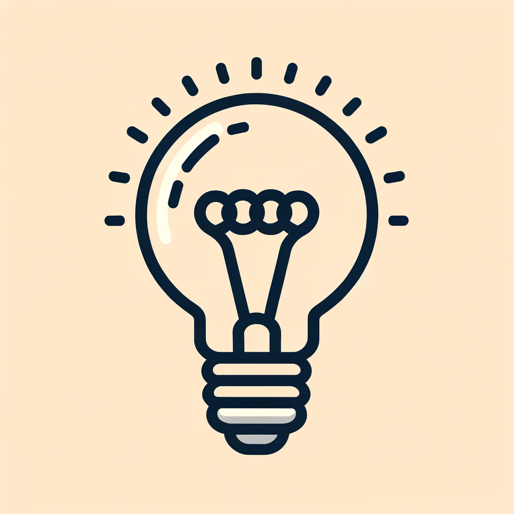

2.1 Discovering Electricity
===============================

Electricity Unveiled
-------------------------------

Our journey begins with the story of Benjamin Franklin and his kite—a tale of curiosity and daring that led to a greater understanding of electricity. Although Franklin didn't discover electricity, his experiments with kites and keys under stormy skies sparked new ideas about electrical charges and their power.

.. image:: img/2_electronic.webp
    :width: 600
    :align: center

From Franklin's insight, we learned that electricity involves positive and negative charges moving across distances, much like lightning during a storm. French scientist Thomas-François Dalibard, inspired by Franklin, proved these ideas right, showing how currents could flow between clouds and the ground without any kites or keys.

The story of electricity is also a story of brilliant minds like Nikola Tesla and Thomas Edison, whose rivalry and achievements helped shape the electric world we know today. While Edison's methodical experiments brought inventions like the light bulb to market, Tesla's vivid imagination pushed the boundaries of electricity, leading us to the alternating current (AC) that powers our homes.

Fast forward to 1947, and we meet the transistor—a tiny yet mighty innovation that revolutionized electronics. Invented by a team of scientists, this small device could amplify signals, make microchips, and act as an electronic switch, becoming the building block of modern technology.

.. image:: img/2_transistor.jpg
    :width: 300
    :align: center

Although you won't use transistors directly in this course, you will harness the power of microcontrollers, packed with thousands of transistors, as you build and control your own electronic projects.

Measuring Electricity
--------------------------------

Electricity can be envisioned as electrons flowing through paths that conduct electricity.

* **Current** is one way to measure electricity, indicating the number of electrons moving through a part of the conductive path in a set timeframe, measured in amperes (amps).
* Another common method of measuring electricity is **voltage**. Voltage is the difference in electrical energy between two points. It's a comparison of the number of electrons at one place versus another.
* **Resistance** is another way to measure electricity, gauging how much a material impedes the flow of electrons. Metals, being good conductors, have low resistance, allowing more electrons to pass through. Insulators like plastic, rubber, and glass have high resistance, which restricts electron flow. The unit for resistance is the ohm, symbolized by the Greek letter omega (Ω).

.. image:: img/2_resistance.png
    :width: 400
    :align: center

Understanding current, voltage, and resistance can be simplified using a garden watering system analogy. Picture having a garden hose, with one end connected to a faucet and the other end for watering plants. In this comparison:

* **Current** resembles the water flow, signifying the movement of electrons through a conductor. Similar to how a greater water flow means more water is passing through the hose, a higher current means more electrons are flowing through the conductor.
* **Voltage** is like the openness of the faucet, controlling the force propelling electrons through a conductor. Turning the faucet further increases the water flow, just as a higher voltage accelerates electron movement.
* **Resistance** equates to any obstructions in the hose, like bends or partially closed valves, slowing down the flow. In circuits, resistance hinders electron movement, with more significant obstacles making it more challenging for current to flow.

While useful for beginners, this analogy may fall short in explaining more complex electrical concepts such as alternating current, electric fields, and components like transistors.

Ohm's Law, formulated by Georg Simon Ohm, elucidates the proportional relationship between voltage, current, and resistance in a circuit, encapsulated in the equation V = I • R. This foundational principle will be explored further through experiments in upcoming lessons.

.. code-block::

    Voltage = Current x Resistance

    Or

    V = I • R

.. note::
    
    Variables refer to the letters or symbols in an equation that represent a certain quantity. In Ohm's law, **V** is used to represent voltage. The letter **I** represents current. For resistance, the letter **R** is used.

With algebra, you can rearrange this equation to solve for current or resistance.

.. code-block::

    Current = Voltage / Resistance or I = V/R
    Resistance = Voltage / Current or R = V/I

.. note::
    
    Curiosity about why current is represented by "I" instead of "C"? It stems from the French term "intensité de courant," meaning the intensity of the current.

By bridging the historical context of electricity with its core concepts of current, voltage, and resistance, we lay the groundwork for your forthcoming electrical adventures. Let's ignite your curiosity and illuminate the path to understanding the electricity that powers our world!

