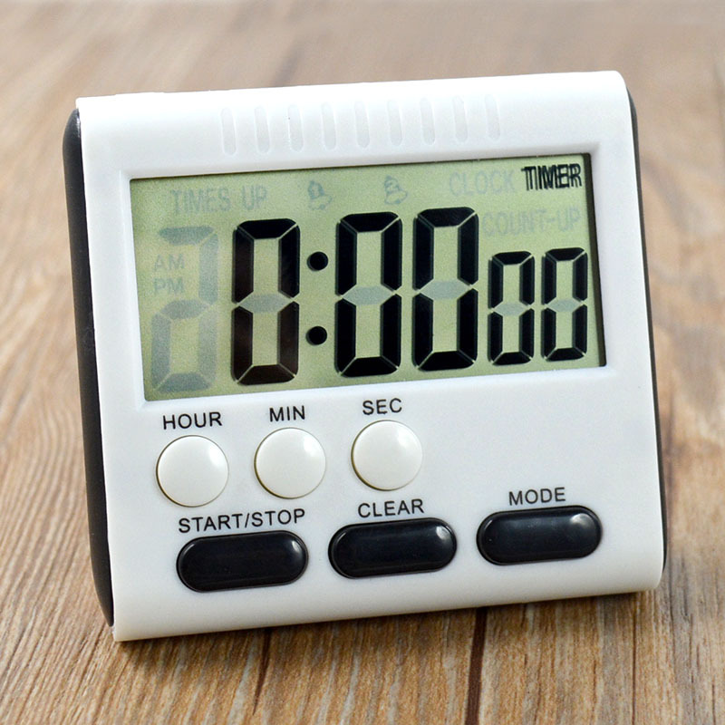

.. note::

    こんにちは、SunFounder Raspberry Pi & Arduino & ESP32 Enthusiasts Community（Facebook）へようこそ！Raspberry Pi、Arduino、ESP32の世界を仲間と一緒に深く掘り下げましょう。

    **参加する理由**

    - **専門サポート**：コミュニティとチームの助けを借りて、販売後の問題や技術的な課題を解決します。
    - **学びと共有**：スキルを向上させるためのヒントやチュートリアルを交換しましょう。
    - **限定プレビュー**：新製品の発表やスニークピークをいち早く入手できます。
    - **特別割引**：最新の製品に対する限定割引を楽しめます。
    - **フェスティブプロモーションとプレゼント**：プレゼントやホリデープロモーションに参加できます。

    👉 探索と創造の準備はできましたか？こちらをクリックして [|link_sf_facebook|] 参加しましょう！

20. ポモドーロタイマー
===========================================

このレッスンでは、時間管理と技術の交差点を探求し、Arduinoとアクティブブザーを使用してポモドーロタイマーを作成します。Arduinoの内部タイミング機能を利用して、25分の集中作業と5分の休憩に分けたタイマーを構築する方法を学びます。この方法はポモドーロ・テクニックとして知られ、生産性と集中力を向上させます。このコースを通じて、電子タイミングの基礎を学び、プログラミングや回路組立ての実践的な経験を得ることで、機能的なポモドーロタイマーを作成します。私たちと一緒に時間をマスターし、日常の効率を高めましょう！

.. raw:: html

     <video controls style = "max-width:90%">
        <source src="_static/video/20_beep_timer.mp4" type="video/mp4">
        お使いのブラウザはビデオタグをサポートしていません。
    </video>

このレッスンの終わりには、以下ができるようになります：

* 時間計測における音の歴史的意義を理解する。
* 電子タイマー回路を構築するために必要な部品を特定する。
* ``delay()`` と ``millis()`` 関数を使用して、ブザーを制御するためのArduinoプログラムを作成する。
* ポモドーロ・テクニックを実践的に応用し、作業と休憩の間隔を交互に切り替えるタイマーを作成する。

時計と音
--------------------

古代の世界では、大規模な鐘の音が時間の経過や特定の社会的イベントを知らせるために使用されていました。
例えば、中世のヨーロッパの都市では、教会の鐘が祈りの時間や仕事の開始と終了を知らせていました。
これらの鐘の音は単なる時間のマーカーではなく、コミュニティの日常生活が回る社会秩序のツールとして機能していました。

**機械式時計と音**

機械式時計の発展と特にビッグ・ベンの設計により、時計にはより複雑な鐘とタイミング機構が装備されるようになりました。
ビッグ・ベンの音は大きな青銅の鐘によって運ばれ、音の伝播範囲と時間告知の精度を高めました。
多くの町や都市では、ビッグ・ベンの音が住民の生活リズムの調整基準となり、航海のスケジュールや鉄道の時刻表など、より正確な時間管理に重要な役割を果たしました。

**電子時代の音タイミング**

電子時代に入ると、音タイマーは新たな進化を遂げました。特にArduinoのようなマイクロコント
ローラの助けを借りて、電子ブザーの導入により、時間のマーキングは大きな機械装置に依存しな
くなりました。これらの小型デバイスは異なる周波数と音程の音を生成でき、シンプルなキッチン
タイマーから複雑な工業プロセス制御システムまで、さまざまなタイミングアプリケーションに使
用されます。現代の病院のナースコールシステム、学校のチャイム、個人用電子デバイスのリマイ
ンダーなど、すべてが時間管理に電子ブザーを活用しています。

回路の構築
-----------------------

**必要なコンポーネント**

.. list-table:: 
   :widths: 25 25 25 25
   :header-rows: 0

   * - 1 * Arduino Uno R3
     - 1 * ブレッドボード
     - 1 * アクティブブザー
     - ジャンパーワイヤー
   * - |list_uno_r3| 
     - |list_breadboard| 
     - |list_active_buzzer| 
     - |list_wire| 
   * - 1 * USBケーブル
     -
     - 
     - 
   * - |list_usb_cable| 
     -
     - 
     - 

**ステップバイステップでの構築**

このレッスンでは、レッスン17と同じ回路を使用します。

.. image:: img/16_morse_code.png
    :width: 500
    :align: center

コード作成 - チクタク
----------------------------

Arduinoでは、 ``delay()``  は最もシンプルでよく使われるタイミング関数です。
プログラムを短時間停止させるためによく使われ、ループと組み合わせてLEDの点滅効果を作り出すことができます。ここでは、 ``delay()``  関数を使ってブザーが毎秒一回音を鳴らすようにします。

1. Arduino IDEを開き、「ファイル」メニューから「新しいスケッチ」を選択して新しいプロジェクトを開始します。
2. スケッチを ``Ctrl + S`` を押すか「保存」をクリックして ``Lesson20_Timer_Tick_Tick`` として保存します。

3. 以下のコードを記述します。

.. code-block:: Arduino

  const int buzzerPin = 9;   // ブザー用の定数にピン9を割り当てる  
  
  void setup() {
    // 初期設定コードをここに記述します。一度だけ実行されます。
    pinMode(buzzerPin, OUTPUT);  // ピン9を出力に設定
  } 

  void loop() {
    // メインコードをここに記述します。繰り返し実行されます。
    digitalWrite(buzzerPin, HIGH);  // ブザーをオンにする
    delay(100);                     // ビープ音の長さ：100ミリ秒
    digitalWrite(buzzerPin, LOW);   // ブザーをオフにする
    delay(1000);                    // 信号間の間隔：1000ミリ秒
  }

この設定では、最初の ``delay()`` 関数はArduino Uno R3を100ミリ秒間停止させ、その間ブザーは鳴り続けます。次の ``delay()`` 関数はArduinoを1000ミリ秒（1秒）停止させ、その間ブザーは鳴りません。

4. コードをArduino Uno R3にアップロードすると、ブザーが毎秒一回ビープ音を発するのを聞くことができます。

コード作成 - ``millis()``
------------------------------

``delay()`` を使用するとコードが一時停止してしまい、不便になることがあります。

例えば、電子レンジでピザを加熱しながら重要なメールを待っているとします。
ピザを電子レンジに入れて10分間設定します。 ``delay()`` を使う場合のアナロジーは、タイマーが10分から0になるまで電子レンジの前に座って見ていることです。この間に重要なメールが届いたとしても見逃してしまいます。

通常はピザを電子レンジに入れてからメールをチェックし、定期的にタイマーが0になったか確認しに行きます。

Arduinoにもプログラムを一時停止させないタイミングツールがあり、それが ``millis()`` です。

``millis()`` はArduinoプログラミングで非常に重要な関数です。Arduinoボードが電源投入されたかリセットされてから経過したミリ秒数を返します。

  * ``time = millis()`` : Arduinoボードが現在のプログラムを実行し始めてから経過したミリ秒数を返します。この数値は約50日後にオーバーフロー（ゼロに戻る）します。

  **パラメータ**
    なし

  **戻り値**
    プログラム開始から経過したミリ秒数。データ型：unsigned long。

ここでも同様にブザーが毎秒一回鳴るようにします。

1. Arduino IDEを開き、「ファイル」メニューから「新しいスケッチ」を選択して新しいプロジェクトを開始します。
2. スケッチを ``Ctrl + S`` を押すか「保存」をクリックして ``Lesson20_Timer_Millis`` として保存します。

3. まず、 ``buzzerPin`` という定数を作成し、ピン9を設定します。

.. code-block:: Arduino
  :emphasize-lines: 1

  const int buzzerPin = 9;   // ブザー用の定数にピン9を割り当てる

  void setup() {
    // 初期設定コードをここに記述します。一度だけ実行されます。
  }

4. ``previousMillis`` という名前のlong型変数を作成し、前回ブザーが鳴った時のタイムスタンプを格納します。 ``interval``  はブザーが鳴る間隔をミリ秒単位で設定します。ここでは1000ミリ秒（1秒）ごとに鳴るように設定します。

.. code-block:: Arduino
  :emphasize-lines: 3,4

  const int buzzerPin = 9;  // ブザー用の定数にピン9を割り当てる

  unsigned long previousMillis = 0;  // 前回ブザーが鳴った時のタイムスタンプを格納
  long interval = 1000;              // ビープ音の間隔をミリ秒単位で設定

5. ``void setup()`` 関数内で、ブザーピンを出力モードに設定します。

.. code-block:: Arduino
  :emphasize-lines: 8

  const int buzzerPin = 9;  // ブザー用の定数にピン9を割り当てる

  unsigned long previousMillis = 0;  // 前回ブザーが鳴った時のタイムスタンプを格納
  long interval = 1000;              // ビープ音の間隔をミリ秒単位で設定

  void setup() {
    // 初期設定コードをここに記述します。一度だけ実行されます。
    pinMode(buzzerPin, OUTPUT);  // ピン9を出力に設定
  }

6. ``void loop()`` 内で ``currentMillis`` という名前のunsigned long型変数を作成し、現在の時刻を格納します。

.. code-block:: Arduino
  :emphasize-lines: 3

  void loop() {
    // メインコードをここに記述します。繰り返し実行されます。
    unsigned long currentMillis = millis();
  }

7. 現在の実行時間から前回の更新時間を引いた値が1000msを超えたときに、いくつかの関数をトリガーします。また、次のトリガーが1秒後に発生するように、 ``previousMillis`` を現在の時間に更新します。

.. code-block:: Arduino
  :emphasize-lines: 5,6

  void loop() {
    // 繰り返し実行されるメインコードをここに記述します。
    unsigned long currentMillis = millis();

    if (currentMillis - previousMillis >= interval) {
      previousMillis = currentMillis;  // 最後にブザーが鳴った時間を保存
    }
  }

8. 定期的に実行する必要のあるメイン関数を追加します。この場合、ブザーを鳴らします。

.. code-block:: Arduino
  :emphasize-lines: 7,8,9

  void loop() {
    // 繰り返し実行されるメインコードをここに記述します。
    unsigned long currentMillis = millis();

    if (currentMillis - previousMillis >= interval) {
      previousMillis = currentMillis;  // 最後にブザーが鳴った時間を保存
      digitalWrite(buzzerPin, HIGH);   // 音を出す
      delay(100);
      digitalWrite(buzzerPin, LOW);    // 音を消す
    }
  }

9. 完成したコードは以下のようになります。これをArduino Uno R3にアップロードすると、ブザーが毎秒一回鳴ることが確認できます。

.. code-block:: Arduino

  const int buzzerPin = 9;  // ブザー用の定数にピン9を割り当てる

  unsigned long previousMillis = 0;  // 前回ブザーが鳴った時のタイムスタンプを格納
  long interval = 1000;              // ビープ音の間隔をミリ秒単位で設定

  void setup() {
    // 初期設定コードをここに記述します。一度だけ実行されます。
    pinMode(buzzerPin, OUTPUT);  // ピン9を出力に設定
  }

  void loop() {
    // 繰り返し実行されるメインコードをここに記述します。
    unsigned long currentMillis = millis();

    if (currentMillis - previousMillis >= interval) {
      previousMillis = currentMillis;  // 最後にブザーが鳴った時間を保存
      digitalWrite(buzzerPin, HIGH);   // 音を出す
      delay(100);
      digitalWrite(buzzerPin, LOW);    // 音を消す
    }
  }

**質問**

もし ``delay(100);`` を ``delay(1000);`` に変更した場合、プログラムには何が起こりますか？その理由は何ですか？

コード作成 - ポモドーロタイマー
-----------------------------------

ポモドーロ・テクニック、またはトマトテクニックは、1980年代後半にフランチェスコ・シリロによって開発された時間管理法です。
この方法は、作業を25分のインターバルに分け、その後に短い休憩を取るものです。
各作業インターバルは、シリロが大学時代に使用していたトマト形のキッチンタイマーにちなんで「ポモドーロ」と呼ばれます。

ポモドーロ・テクニックの基本的なステップは以下の通りです：

1. **タスクの定義**：開始する前に完了する必要のあるタスクを決定します。
2. **ポモドーロタイマーのセット**：25分の作業時間にタイマーをセットします。
3. **集中して作業**：この25分間、あらゆる形の気を散らすものを避けて、タスクに完全に集中します。
4. **短い休憩を取る**：作業時間が終了したら、5分の休憩を取ります。この時間に歩き回ったり、ストレッチしたり、水を飲んだりしますが、仕事に関連する活動は避けます。

ポモドーロ・テクニックの利点には、集中力の向上、疲労の軽減、作業と休憩の明確な区分が気を散らすものの管理に役立つこと、タスクを完了することでのモチベーションと満足感の向上が含まれます。また、ポモドーロ・テクニックは複雑なツールや技術を必要とせず、シンプルなタイマーだけで十分です。

次に、25分ごとにブザーが鳴り、作業時間の終了を知らせるタイマーをプログラムし、その後5分の休憩を取るリマインダーを作成します：

1. Arduino IDEを開き、「ファイル」メニューから「新しいスケッチ」を選択して新しいプロジェクトを開始します。
2. スケッチを ``Ctrl + S`` を押すか「保存」をクリックして ``Lesson20_Timer_Millis_Pomodoro`` として保存します。

3. ``void setup()`` の前にいくつかの定数と変数を定義します。

* ``buzzerPin`` はブザーが接続されているピンを識別します。
* ``startMillis`` はタイマーが開始した時刻を記録します。
* ``workPeriod`` と``breakPeriod``はそれぞれの期間がどれくらい続くかを定義します。
* ``isWorkPeriod`` は作業時間か休憩時間かを追跡するためのブール型変数です。

.. code-block:: Arduino

  const int buzzerPin = 9;          // ブザー用の定数にピン9を割り当てる
  unsigned long startMillis;        // タイマーが開始した時刻を記録する
  const long workPeriod = 1500000;  // 25分の作業期間
  const long breakPeriod = 300000;  // 5分の休憩期間
  static bool isWorkPeriod = true;  // 作業時間か休憩時間かを追跡する

4. ブザーピンを出力として初期化し、 ``millis()`` で開始時刻を記録してタイマーを開始します。

.. code-block:: Arduino
  :emphasize-lines: 2,3
  
  void setup() {
    pinMode(buzzerPin, OUTPUT); // ブザーピンを出力として初期化
    startMillis = millis(); // 開始時刻を記録
  }

5. ``void loop()`` 内で ``currentMillis`` という名前の ``unsigned long`` 型変数を作成し、現在の時刻を格納します。

.. code-block:: Arduino
  :emphasize-lines: 2

  void loop() {
    unsigned long currentMillis = millis(); // 現在の時刻を更新
  }

6. ``if else if`` 条件文を使用して、作業期間であるかどうかを判断します。

.. code-block:: Arduino
  :emphasize-lines: 4-6

  void loop() {
    unsigned long currentMillis = millis(); // 現在の時刻を更新

    if (isWorkPeriod){ 
    } else if (!isWorkPeriod){
    }
  }

7. 作業期間であれば、現在の時刻が ``workPeriod`` を超えているかどうかを確認します。超えている場合、タイマーをリセットし、休憩期間に切り替え、ブザーを2回長く鳴らします。

.. code-block:: Arduino
  :emphasize-lines: 5-16

  void loop() {
    unsigned long currentMillis = millis();  // 現在の時刻を更新

    if (isWorkPeriod) {
      if (currentMillis - startMillis >= workPeriod) {
        startMillis = currentMillis;  // タイマーをリセット
        isWorkPeriod = false;         // 休憩期間に切り替え
        digitalWrite(buzzerPin, HIGH);  // ブザーをオンにする
        delay(500);                     // ブザーを500ミリ秒鳴らす
        digitalWrite(buzzerPin, LOW);   // ブザーをオフにする
        delay(200);                     // ブザーを200ミリ秒オフにする
        digitalWrite(buzzerPin, HIGH);  // ブザーをオンにする
        delay(500);                     // ブザーを500ミリ秒鳴らす
        digitalWrite(buzzerPin, LOW);   // ブザーをオフにする
        delay(200);                     // ブザーを200ミリ秒オフにする
      }
    } else if (!isWorkPeriod) {
    }
  }

8. ``else if`` 条件文を使用して、休憩期間であるかどうかを判断し、同様に現在の時刻が ``breakPeriod`` を超えているかどうかを確認します。超えている場合、タイマーをリセットし、作業期間に戻し、ブザーを2回短く鳴らします。

.. code-block:: Arduino

  } else if (!isWorkPeriod) {
    if (currentMillis - startMillis >= breakPeriod) {
      startMillis = currentMillis;  // タイマーをリセット
      isWorkPeriod = true;          // 作業期間に切り替え
      digitalWrite(buzzerPin, HIGH);  // ブザーをオンにする
      delay(200);                     // ブザーを200ミリ秒鳴らす
      digitalWrite(buzzerPin, LOW);   // ブザーをオフにする
      delay(200);                     // ブザーを200ミリ秒オフにする
      digitalWrite(buzzerPin, HIGH);  // ブザーをオンにする
      delay(200);                     // ブザーを200ミリ秒鳴らす
      digitalWrite(buzzerPin, LOW);   // ブザーをオフにする
      delay(200);                     // ブザーを200ミリ秒オフにする
    }
  }

9. 完成したコードは以下の通りです。これをArduino Uno R3にアップロードして、その効果を確認してください。

.. note::

  デバッグ中に25分の作業時間と5分の休憩時間が長すぎると感じる場合は、 ``workPeriod`` を15000ミリ秒、 ``breakPeriod`` を3000ミリ秒に短縮することができます。これにより、15秒ごとにブザーが2回長く鳴り、その後3秒ごとに短く2回鳴るのを聞くことができます。

.. code-block:: Arduino

  const int buzzerPin = 9;          // ブザー用のピン9を定数として割り当てる
  unsigned long startMillis;        // タイマーが開始した時刻を記録する
  const long workPeriod = 1500000;  // 25分の作業期間
  const long breakPeriod = 300000;  // 5分の休憩期間
  static bool isWorkPeriod = true;  // 作業期間か休憩期間かを追跡する

  void setup() {
    pinMode(buzzerPin, OUTPUT); // ブザーピンを出力として初期化
    startMillis = millis(); // 開始時刻を記録
  }

  void loop() {
    unsigned long currentMillis = millis(); // 現在の時刻を更新

    if (isWorkPeriod){ 
      if(currentMillis - startMillis >= workPeriod) {
        startMillis = currentMillis; // タイマーをリセット
        isWorkPeriod = false; // 休憩期間に切り替え
        digitalWrite(buzzerPin, HIGH);  // ブザーをオンにする
        delay(500);                     // ブザーを500ミリ秒鳴らす
        digitalWrite(buzzerPin, LOW);   // ブザーをオフにする
        delay(200);                     // ブザーを200ミリ秒オフにする
        digitalWrite(buzzerPin, HIGH);  // ブザーをオンにする
        delay(500);                     // ブザーを500ミリ秒鳴らす
        digitalWrite(buzzerPin, LOW);   // ブザーをオフにする
        delay(200);                     // ブザーを200ミリ秒オフにする
      }
    } else if (!isWorkPeriod) 
      if(currentMillis - startMillis >= breakPeriod) {
        startMillis = currentMillis; // タイマーをリセット
        isWorkPeriod = true; // 作業期間に切り替え
        digitalWrite(buzzerPin, HIGH);  // ブザーをオンにする
        delay(200);                     // ブザーを200ミリ秒鳴らす
        digitalWrite(buzzerPin, LOW);   // ブザーをオフにする
        delay(200);                     // ブザーを200ミリ秒オフにする
        digitalWrite(buzzerPin, HIGH);  // ブザーをオンにする
        delay(200);                     // ブザーを200ミリ秒鳴らす
        digitalWrite(buzzerPin, LOW);   // ブザーをオフにする
        delay(200);                     // ブザーを200ミリ秒オフにする
      }
    }
  }

10. 最後に、コードを保存し、作業スペースを整理することを忘れないでください。

**質問**

日常生活の中で「時間を聞く」ことができる他の場所について考えてみましょう。いくつかの例を挙げて、それをハンドブックに書いてください！

**まとめ**

今日のクラスでは、ポモドーロタイマーの電子版を成功裏に構築しました。これは、作業と休憩の期間を構造化することで生産性を向上させるための貴重なツールです。このプロジェクトを通じて、学生はブザーの時間管理における有用性と、 ``millis()`` 関数を使用してArduinoでノンブロッキングタイマーコードを作成する実践的な応用方法を学びました。このアプローチは、マイクロコントローラアプリケーションでのマルチタスクを可能にし、技術や産業のより複雑なシステムを反映しています。

