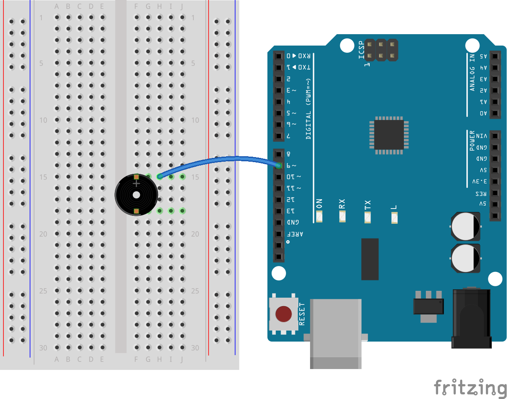
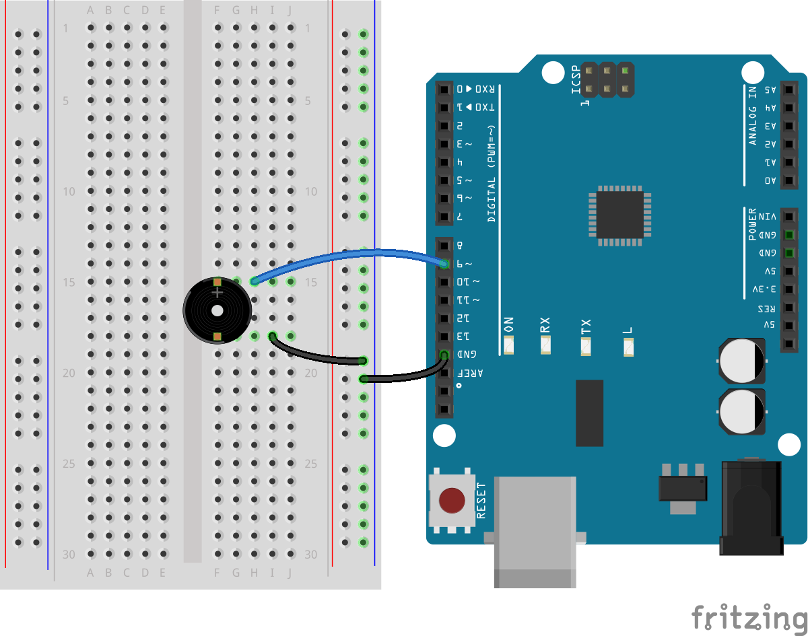

Siren
=========================

Beep
========================

蜂鸣器的基本工作原理是使用电磁感应产生声音，这种原理在许多早期的电子设备中都有应用。
蜂鸣器的发展与电气工程的进步密切相关，尤其是在电磁学和电子学领域的应用。

蜂鸣器作为一种电声装置，其历史可以追溯到19世纪末期。
蜂鸣器的前身可以追溯到1831年，迈克尔·法拉第（Michael Faraday）发现了电磁感应，
这是电磁蜂鸣器工作的基础原理。
法拉第的发现后，许多科学家和发明家开始探索如何将电磁理论应用于实际设备中。

在19世纪中期，电铃的发明为蜂鸣器的出现铺平了道路。
电铃使用电磁铁拉动一个机械臂，撞击声体发声，其工作原理与后来的蜂鸣器类似。

直到20世纪初，随着电子元件的发展，蜂鸣器开始采用更为复杂的电子电路。
这一时期，蜂鸣器主要用于信号传递，如电话交换机、警报系统等。

随着晶体管的发明和集成电路的普及，现代蜂鸣器得以小型化并广泛应用于各种电子产品中。
现代蜂鸣器不仅体积小，而且能效高，能产生从单一音调到复杂音乐的各种声音。

.. image:: img/7_beep_2.png

今天，蜂鸣器不仅用于发出警告或提示音，还广泛应用于玩具、家用电器、医疗设备和汽车等多种产品中，成为不可或缺的组件之一。
有源蜂鸣器和无源蜂鸣器是两种常见的蜂鸣器类型，它们在工作原理和应用方面有一些基本的区别：

**有源蜂鸣器**

.. image:: img/7_beep_ac.png

有源蜂鸣器的背后是密封的。

它内置了振荡电路，因此只需直接供电就可以发声。这种类型的蜂鸣器通常只能发出一种固定频率的声音。

工作原理：当有源蜂鸣器接受到直流电源时，内部的振荡电路会激活，使得蜂鸣器产生声音。振荡器产生一个恒定的频率，从而产生稳定的音调。
优点：使用简单，只需提供适当的电压即可工作。
应用：常见于需要简单声音提示的电子设备中，如微波炉、计算机设备、报警器等。

**无源蜂鸣器**

.. image:: img/7_beep_pa.png

无源蜂鸣器的背后是敞开的，能看到一个小块的电路板。

它没有内置振荡电路，需要外部电路（如微控制器）提供交流信号来驱动，从而产生声音。
这使得无源蜂鸣器能够播放多种不同频率的声音。

工作原理：无源蜂鸣器需要外部的脉冲频率信号来驱动，通过改变输入信号的频率，蜂鸣器可以发出不同的音调。
优点：具有更高的灵活性，可以产生多种不同的音频和旋律。
应用：广泛用于需要复杂声音输出的设备，如手机、玩具和各类电子项目中。

**学习目标**

了解蜂鸣器如何通过电磁或压电效应产生声音。
理解蜂鸣器的主要类型，包括有源蜂鸣器和无源蜂鸣器，以及它们的工作原理和区别。
了解蜂鸣器在实际应用中的用途，如报警系统、电子玩具、家用电器等。
学习如何通过编程控制蜂鸣器发声。
使用串口显示器输入信息。
学习使用计时函数。

.. toctree::
    :maxdepth: 4

    7.1_morse_code 
    7.2_beep_timer 
    7.3_siren 
    7.4_music

    
.. image:: img/7_siren.png

声音是一种波动现象，通过介质（如空气、水或固体）传播的振动能量。了解声音的物理属性可以帮助我们更好地理解和控制声音在不同环境中的行为。
以下是声音的几个关键物理属性：

**频率**
频率是指单位时间内振动周期的重复次数，通常以赫兹（Hz）表示。
频率决定了声音的音调：频率越高，听起来的音调越高；频率越低，音调越低。人类可听频率范围大约在20 Hz到20,000 Hz之间。

**振幅**
振幅是声波振动的强度，它决定了声音的响度。
振幅越大，声音越响亮；振幅越小，声音越微弱。
在物理学中，振幅通常与声波的能量直接相关，而在日常用语中，
我们常用分贝（dB）来描述声音的响度

**音色**
音色描述了声音的质感或声音的颜色，
这使我们能够区分即使在相同音高和响度的情况下，由不同声源发出的声音。
例如，即使小提琴和钢琴演奏相同的音符，我们仍然可以通过音色来区分它们。

在本次Arduino项目中，我们将探索如何通过编程和电子硬件的结合，
实现一个模拟警笛声的系统。

警笛声采用特定的频率和音调模式，即快速的上升和下降音调，
这种模式不仅容易辨认，而且容易与日常环境中的其他声音区分开。
这种音调变化能够激起人的紧迫感，
因为它们在自然界中通常与警告信号或危险情况相关联。

通过调整无源蜂鸣器的频率，
我们可以模拟出警笛声中那典型的高低起伏音调。

**需要的元件**

* 1 项目板
* 1 无源蜂鸣器
* 1 跳线
* 1 带测试线的万用表

**构筑电路**

1. 拿出蜂鸣器。请注意无源蜂鸣器背后是能看到电路板的

.. image:: img/7_beep_pa.png

2. 将蜂鸣器画有“+”的一端连接到R3板的引脚9.

3. 将另一端连接到GND。

**编写代码**

1. 创建一个新的草图，将其命名为"Lesson9_siren"

2. Define the Buzzer Pin
At the top of your new sketch, define which pin of the Arduino will be connected to the buzzer. For this example, we use pin 9.

.. code-block:: Arduino

    int buzzerPin = 9;

3. Setup the Pin Mode

In the setup() function, configure the buzzer pin as an output. This is necessary because the pin will be sending signals to the buzzer.

.. code-block:: Arduino

    void setup() {
        pinMode(buzzerPin, OUTPUT);
    }

4. 让蜂鸣器发声：

在Arduino编程中，tone()
函数是用来控制无源蜂鸣器或其他音频输出设备产生一定频率的声音的功能。

tone()函数的基本语法如下：

``tone(pin, frequency);``
``tone(pin, frequency, duration);``

    * pin：指定连接蜂鸣器的Arduino板上的数字输出引脚。
    * frequency：设置声音的频率，以赫兹（Hz）为单位。这个值决定了声音的音调。
    * duration（可选）：声音持续的时间，以毫秒（ms）为单位。如果提供这个参数，tone()函数将在指定时间后自动停止声音的输出。

在loop()函数里写入tone()函数。

.. code-block:: Arduino

    void loop() {
        tone(buzzerPin, 400, 10);  // Emit a tone
    }

5. 修改代码，改为逐渐提高音调: Start from a low frequency and increase to a higher frequency.

.. code-block:: Arduino

    void loop() {
        // Gradually increase the pitch
        for (int freq = 100; freq <= 1000; freq += 10) {
            tone(buzzerPin, freq, 10);  // Emit a tone
            delay(20);  // Delay to create a continuous sound effect
        }
    }

6. Decrease Pitch: Reverse the order, from high back down to low.

.. code-block:: Arduino

    void loop() {
        // Gradually increase the pitch
        for (int freq = 100; freq <= 1000; freq += 10) {
            tone(buzzerPin, freq, 10);  // Emit a tone
            delay(20);  // Delay to create a continuous sound effect
        }

        // Gradually decrease the pitch
        for (int freq = 1000; freq >= 100; freq -= 10) {
            tone(buzzerPin, freq, 10);  // Emit a tone
            delay(20);  // Delay to create a continuous sound effect
        }
    }

你的代码应当如下所示：

.. code-block:: Arduino

    // Define the pin connected to the buzzer
    int buzzerPin = 9;

    void setup() {
        // Set the buzzer pin as an output
        pinMode(buzzerPin, OUTPUT);
    }

    void loop() {
        // Gradually increase the pitch
        for (int freq = 100; freq <= 1000; freq += 10) {
            tone(buzzerPin, freq, 10);  // Emit a tone
            delay(20);  // Delay to create a continuous sound effect
        }

        // Gradually decrease the pitch
        for (int freq = 1000; freq >= 100; freq -= 10) {
            tone(buzzerPin, freq, 10);  // Emit a tone
            delay(20);  // Delay to create a continuous sound effect
        }
    }

7. 点击“上传”按钮，将草图上传到你的 Arduino 板。

8. 点击 “保存” 来保存你的草图。