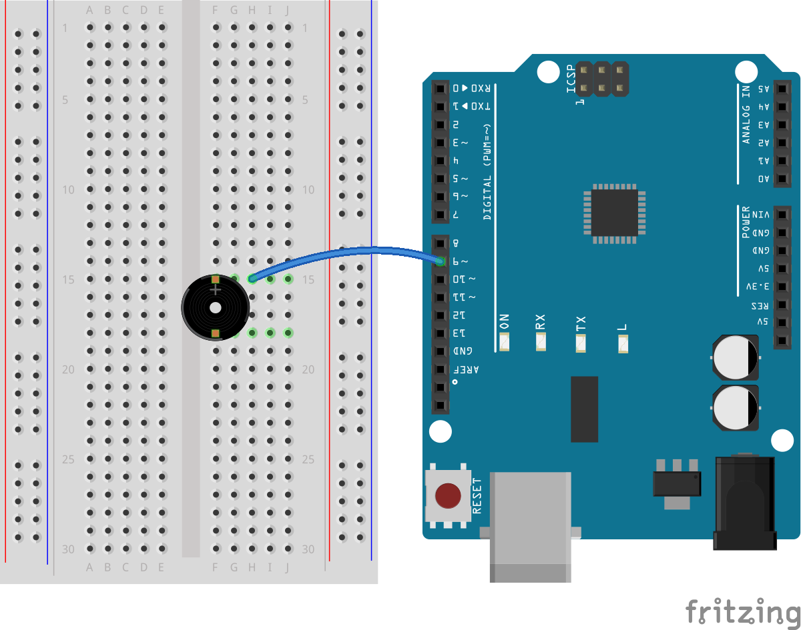

音乐
===========================================

.. image:: img/7_sound.png

各种乐器都会通过改变频率发出不同的音调。
例如，在钢琴上，敲击键盘会使相应的琴弦快速振动，产生特定的音调。
科学家和音乐家通过精确测量这些振动的频率，开发出了各种音乐调整方法和音调标准。

当你控制Arduino或其他微控制器向蜂鸣器发送电信号时，蜂鸣器的震动片会按照信号的频率快速振动，
从而发出声音。例如，频率设置为440 Hz的信号会使蜂鸣器产生标准的音乐音调“A4”，这是音乐调谐中的一个基准点。
随着频率的提高或降低，所产生的音调也随之升高或降低，从而在音乐创作中实现从低到高的音阶表现。

在西方音乐中，一个八度中有12个音级（半音），从C到B，然后再回到更高的C。

例如，中央C（通常称为C4）的频率大约是261.63 Hz。音符的频率计算可以通过以下公式得出：

.. image:: img/7_music_format.png

其中f_0是参考音（通常是A4，频率为440Hz），n是从参考音到目标音的半音步数（正数表示升高，负数表示降低）。
通过这个公式，我们可以计算出任何音符的频率。

以下是一组频率表：

* C（C4）: 262 Hz （实际上接近261.63 Hz，四舍五入到262）
* D（D4）: 294 Hz
* E（E4）: 330 Hz
* F（F4）: 349 Hz
* G（G4）: 392 Hz
* A（A4）: 440 Hz
* B（B4）: 494 Hz

现在我们将通过Arduino和蜂鸣器探索音符的奥秘。让无源蜂鸣器演奏一曲《小星星》。

.. note::

  《小星星》（Twinkle, Twinkle, Little Star）的旋律基于简单的音符组合，
  这首歌曲的旋律是基于法国作曲家阿马代斯·莫扎特（Wolfgang Amadeus Mozart）的
  《Ah vous dirai-je, Maman》变奏曲，这些旋律非常适合初学者学习。

  这里是《小星星》的基本乐谱，包括每个音符：

  .. code-block:: Arduino

    C C G G A A G
    F F E E D D C
    G G F F E E D
    G G F F E E D
    C C G G A A G
    F F E E D D C

**需要的元件**

* 1 项目板
* 1 无源蜂鸣器
* 1 跳线
* 1 带测试线的万用表

**构筑电路**

1. 拿出蜂鸣器。请注意无源蜂鸣器背后是能看到电路板的

.. image:: img/7_beep_pa.png

2. 将蜂鸣器画有“+”的一端连接到R3板的引脚9.

3. 将另一端连接到GND。

.. image:: img/7_beep_bb_2.png

**编写代码**

1. 创建一个新的草图，将其命名为"Lesson10_music"

2. 定义蜂鸣器引脚

  .. code-block:: Arduino

    int buzzerPin = 8; 

3. 编写两个数组，一个储存播放旋律的音符；一个储存每个音符的时长。

  .. code-block:: Arduino

    int melody[] = {262, 262, 392, 392, 440, 440, 392, 349, 349, 330, 330, 294, 294, 262};
    int noteDurations[] = {500, 500, 500, 500, 500, 500, 1000, 500, 500, 500, 500, 500, 500, 1000};

在Arduino编程中，数组是一种用来存储多个相同类型数据的数据结构。它
是一种非常基本且强大的工具，合理使用可以大大提升编程效率和程序性能。
数组可以存储诸如整数、浮点数、字符等类型的元素。
每个存储在数组中的元素都可以通过索引来访问，索引通常从0开始。

如在这个代码里： ``melody[0]`` 为 ``262`` ； ``melody[2]`` 为 ``392``。

4. 设置引脚模式。这里设置buzzerPin为OUTPUT模式，意味着该引脚用于输出电信号给蜂鸣器。

  .. code-block:: Arduino

    void setup() {
      pinMode(buzzerPin, OUTPUT); 
    }

5. 在loop()中，遍历《小星星》的所有音符。使用for循环从数组melody[]中逐一取出每个音符。
thisNote是循环计数器，从0开始，代表第一个音符，一直到13（共14个音符）。
旋律播放完毕后，使用delay(2000)函数使程序暂停两秒。
这样可以在重复播放前提供一个较长的停顿，使整个演奏听起来更为自然。

  .. code-block:: Arduino

    void loop() {
      for (int thisNote = 0; thisNote < 14; thisNote++) {
        ... ...
      }
      delay(2000); // Wait two seconds before replaying
    }

6. 计算每个音符的持续时间：noteDurations[]数组存储了每个音符的时值（毫秒）。
这里我们用1000除以数组中的值来计算实际的音符持续时间。
这是因为tone()函数需要音符的持续时间，而我们希望根据音符原本的节奏调整这个时长。

  .. code-block:: Arduino

    void loop() {
      for (int thisNote = 0; thisNote < 14; thisNote++) {
        int noteDuration = 1000 / noteDurations[thisNote]; // Calculate the duration for each note
        ... ...
      }
      delay(2000); // Wait two seconds before replaying
    }

7. 播放音符：
使用tone()函数播放音符。这个函数接收三个参数：蜂鸣器的引脚号、音符频率（从melody[]数组取得）、以及刚刚计算的持续时间。这会使蜂鸣器按指定的频率和时长发声。

  .. code-block:: Arduino

    void loop() {
      for (int thisNote = 0; thisNote < 14; thisNote++) {
        int noteDuration = 1000 / noteDurations[thisNote]; // Calculate the duration for each note
        tone(buzzerPin, melody[thisNote], noteDuration); // Play the note on the buzzer
        ... ...
      }
      delay(2000); // Wait two seconds before replaying
    }

8. 音符间的停顿：
每个音符播放结束后，为了让旋律更自然，需要在两个音符之间加入短暂的停顿。这里我们将音符的持续时间乘以1.30来计算间隔，使旋律听起来不那么急促。

  .. code-block:: Arduino

    void loop() {
      for (int thisNote = 0; thisNote < 14; thisNote++) {
        int noteDuration = 1000 / noteDurations[thisNote]; // Calculate the duration for each note
        tone(buzzerPin, melody[thisNote], noteDuration); // Play the note on the buzzer
        int pauseBetweenNotes = noteDuration * 1.30; // Calculate the pause duration between notes
        delay(pauseBetweenNotes); // Wait for the note to finish playing
        ... ...
      }
      delay(2000); // Wait two seconds before replaying
    }

9. 停止蜂鸣器：
使用noTone()函数停止当前引脚的音调输出。这是必要的步骤，以确保每个音符都能清晰地播放，而不会和下一个音符混淆。

  .. code-block:: Arduino

    void loop() {
      for (int thisNote = 0; thisNote < 14; thisNote++) {
        int noteDuration = 1000 / noteDurations[thisNote]; // Calculate the duration for each note
        tone(buzzerPin, melody[thisNote], noteDuration); // Play the note on the buzzer
        int pauseBetweenNotes = noteDuration * 1.30; // Calculate the pause duration between notes
        delay(pauseBetweenNotes); // Wait for the note to finish playing
        noTone(buzzerPin); // Stop the buzzer
      }
      delay(2000); // Wait two seconds before replaying
    }

你的代码应该如下所示：

  .. code-block:: Arduino

    int buzzerPin = 8; // Connect the buzzer to digital pin 8

    // Melody of "Twinkle, Twinkle, Little Star"
    int melody[] = {262, 262, 392, 392, 440, 440, 392, 349, 349, 330, 330, 294, 294, 262};
    int noteDurations[] = {500, 500, 500, 500, 500, 500, 1000, 500, 500, 500, 500, 500, 500, 1000};  

    void setup() {
      pinMode(buzzerPin, OUTPUT); // Set the buzzer pin as an output
    }

    void loop() {
      for (int thisNote = 0; thisNote < 14; thisNote++) {
        int noteDuration = 1000 / noteDurations[thisNote]; // Calculate the duration for each note
        tone(buzzerPin, melody[thisNote], noteDuration); // Play the note on the buzzer
        int pauseBetweenNotes = noteDuration * 1.30; // Calculate the pause duration between notes
        delay(pauseBetweenNotes); // Wait for the note to finish playing
        noTone(buzzerPin); // Stop the buzzer
      }
      delay(2000); // Wait two seconds before replaying
    }

  
10. 点击“上传”按钮，将草图上传到你的 Arduino 板。

11. 点击 “保存” 来保存你的草图。