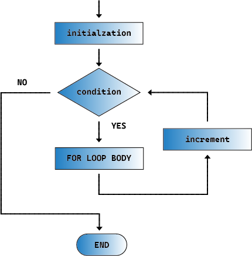

.. note::

    Ciao, benvenuto nella SunFounder Raspberry Pi & Arduino & ESP32 Enthusiasts Community su Facebook! Approfondisci le tue conoscenze su Raspberry Pi, Arduino e ESP32 con altri appassionati.

    **Perché unirti?**

    - **Supporto Esperto**: Risolvi i problemi post-vendita e le sfide tecniche con l'aiuto della nostra comunità e del nostro team.
    - **Impara & Condividi**: Scambia consigli e tutorial per migliorare le tue competenze.
    - **Anteprime Esclusive**: Ottieni accesso anticipato agli annunci di nuovi prodotti e anteprime.
    - **Sconti Speciali**: Approfitta di sconti esclusivi sui nostri prodotti più recenti.
    - **Promozioni Festive e Giveaway**: Partecipa a giveaway e promozioni festive.

    👉 Sei pronto per esplorare e creare con noi? Clicca [|link_sf_facebook|] e unisciti oggi stesso!

21. Suono della Sirena
=========================

In questo progetto Arduino, esploreremo come creare un sistema di sirene attraverso la programmazione e l'integrazione di hardware elettronico.

I suoni delle sirene utilizzano un modello di frequenza e tonalità specifico, caratterizzato da rapide salite e discese di tonalità, facilmente riconoscibili e distinti dagli altri suoni quotidiani. Questi cambiamenti di tonalità possono evocare un senso di urgenza, poiché sono spesso associati a segnali di allarme o situazioni pericolose in natura.

Modificando la frequenza di un buzzer passivo, possiamo simulare le caratteristiche tipiche di una sirena con toni ascendenti e discendenti.

.. raw:: html

    <video controls style = "max-width:90%">
        <source src="_static/video/21_siren_sound.mp4" type="video/mp4">
        Your browser does not support the video tag.
    </video>

In questa lezione imparerai:

* Come funzionano i buzzer passivi
* Come pilotare un buzzer passivo utilizzando la funzione tone()
* Come usare il ciclo for nella programmazione
* Come implementare un suono di sirena

Comprendere le Proprietà del Suono
--------------------------------------

Il suono è un fenomeno ondulatorio che si propaga attraverso mezzi come l'aria, l'acqua o i solidi sotto forma di energia vibrante. Comprendere le proprietà fisiche del suono ci aiuta a capire e controllare meglio come esso si comporta in diversi ambienti. Ecco alcune delle principali proprietà fisiche del suono:

**Frequenza**

La frequenza si riferisce al numero di cicli di vibrazione per unità di tempo, solitamente espressa in Hertz (Hz). La frequenza determina l'altezza del suono: frequenze più alte producono suoni più acuti, frequenze più basse suoni più gravi. Il range udibile dall'uomo è di circa 20 Hz a 20.000 Hz.

**Ampiezza**
L'ampiezza è l'intensità della vibrazione di un'onda sonora e determina il volume del suono. Una maggiore ampiezza corrisponde a un suono più forte, una minore ampiezza a un suono più debole. In fisica, l'ampiezza è solitamente correlata direttamente all'energia dell'onda sonora, mentre nel linguaggio comune utilizziamo spesso i decibel (dB) per descrivere il volume del suono.

**Timbro**
Il timbro descrive la "qualità" o "colore" del suono, permettendoci di distinguere suoni provenienti da diverse fonti, anche se hanno la stessa altezza e volume. Ad esempio, anche se un violino e un pianoforte suonano la stessa nota, possiamo distinguerli dal timbro.

In questo progetto, ci concentreremo sull'influenza della frequenza sul suono.

Costruire il Circuito
-----------------------

**Componenti Necessari**

.. list-table:: 
   :widths: 25 25 25 25
   :header-rows: 0

   * - 1 * Arduino Uno R3
     - 1 * Breadboard
     - 1 * Buzzer Passivo
     - Cavi di Collegamento
   * - |list_uno_r3| 
     - |list_breadboard| 
     - |list_passive_buzzer| 
     - |list_wire| 
   * - 1 * Cavo USB
     - 
     - 
     - 
   * - |list_usb_cable| 
     - 
     - 
     - 

**Costruzione Passo-Passo**

Nelle lezioni precedenti, abbiamo utilizzato un buzzer attivo. In questa lezione utilizzeremo un buzzer passivo. Il circuito è lo stesso, ma l'approccio di codifica per pilotarlo è diverso.

1. Trova un buzzer passivo, che ha un circuito esposto sul retro.

.. image:: img/7_beep_2.png

2. Anche se c'è un segno '+' sul buzzer passivo, non è un dispositivo polarizzato. Inseriscilo in qualsiasi direzione nei fori 15F e 18F della breadboard.

.. image:: img/16_morse_code_buzzer.png
    :width: 500
    :align: center

3. Collega uno dei pin del buzzer passivo al pin GND di Arduino Uno R3.

.. image:: img/16_morse_code_gnd.png
    :width: 500
    :align: center

4. Collega l'altro pin del buzzer passivo al pin 5V di Arduino Uno R3. Il buzzer non emetterà alcun suono, a differenza di un buzzer attivo, che invece suonerebbe se collegato in questo modo.

.. image:: img/16_morse_code_5v.png
    :width: 500
    :align: center

5. Ora, rimuovi il filo inserito nel pin 5V e inseriscilo nel pin 9 di Arduino Uno R3, in modo che il buzzer possa essere controllato tramite codice.

.. image:: img/16_morse_code.png
    :width: 500
    :align: center

Creare il Codice - Far Suonare il Buzzer Passivo
---------------------------------------------------

Come abbiamo imparato durante il collegamento, fornire semplicemente alimentazione alta e bassa a un buzzer passivo non lo farà suonare. Nella programmazione Arduino, la funzione ``tone()`` viene utilizzata per controllare un buzzer passivo o altri dispositivi audio per generare un suono a una frequenza specificata.

    * ``tone()``: Genera un'onda quadra alla frequenza specificata (e con un ciclo di lavoro del 50%) su un pin. Può essere specificata una durata, altrimenti l'onda continua finché non viene chiamata ``noTone()``.

    **Sintassi**

        * ``tone(pin, frequency)``
        * ``tone(pin, frequency, duration)``

    **Parametri**

        * ``pin``: il pin di Arduino su cui generare il suono.
        * ``frequency``: la frequenza del suono in Hertz. Tipi di dati consentiti: unsigned int.
        * ``duration``: la durata del suono in millisecondi (opzionale). Tipi di dati consentiti: unsigned long.

    **Restituisce**
        Nessun valore

1. Apri l'Arduino IDE e inizia un nuovo progetto selezionando "New Sketch" dal menu "File".
2. Salva il tuo sketch come ``Lesson21_Tone`` utilizzando ``Ctrl + S`` o cliccando su "Save".
3. Prima di tutto, definisci il pin per il buzzer.

.. code-block:: Arduino

    const int buzzerPin = 9;  // Assegna il pin 9 alla costante per il buzzer

    void setup() {
        // inserisci qui il tuo codice di configurazione, eseguito una sola volta:
    }

4. Per comprendere appieno l'uso della funzione ``tone()``, la scriviamo all'interno di ``void setup()``, così che il buzzer emetta un suono a una frequenza specifica per una durata determinata.

.. code-block:: Arduino
    :emphasize-lines: 5

    const int buzzerPin = 9;  // Assegna il pin 9 alla costante per il buzzer

    void setup() {
        // inserisci qui il tuo codice di configurazione, eseguito una sola volta:
        tone(buzzerPin, 1000, 100);  // Accendi il buzzer a 1000 Hz per una durata di 100 millisecondi
    }

    void loop() {
        // inserisci qui il tuo codice principale, eseguito ripetutamente:
    }

5. Ora puoi caricare il codice su Arduino Uno R3; sentirai un breve "beep" dal buzzer passivo, poi resterà in silenzio.

**Domande**

1. Se modifichi il codice e sposti i collegamenti sui pin 7 o 8, che non sono pin PWM, il buzzer emetterà comunque suono? Prova e scrivi la tua risposta nel manuale.

2. Per esplorare come ``frequency`` e ``duration`` nella funzione ``tone(pin, frequency, duration)`` influenzano il suono del buzzer, modifica il codice in base a due condizioni e annota le osservazioni nel manuale:

* Mantenendo ``frequency`` a 1000, aumenta gradualmente ``duration`` da 100, 500 a 1000. Come cambia il suono del buzzer e perché?

* Mantenendo ``duration`` a 100, aumenta gradualmente ``frequency`` da 1000, 2000 a 5000. Come cambia il suono del buzzer e perché?

Creazione del Codice - Emettere un Suono di Sirena
---------------------------------------------------

Abbiamo già imparato come far emettere un suono a un buzzer e abbiamo capito come frequenza e durata influenzino il suono. Ora, se vogliamo far emettere al buzzer un suono di sirena che sale da un tono basso a uno alto, come possiamo procedere?

Dalle nostre esplorazioni precedenti, sappiamo che la funzione ``tone(pin, frequency)`` permette a un buzzer passivo di emettere un suono. Aumentando gradualmente la ``frequency``, il tono del suono diventa più acuto. Implementiamo questo concetto con del codice.

1. Apri lo sketch che hai salvato in precedenza, ``Lesson21_Tone``.

2. Seleziona “Salva con nome...” dal menu “File” e rinominalo ``Lesson21_Siren_Sound``. Clicca su "Salva".

3. Scrivi la funzione ``tone()`` all'interno di ``void loop()`` e imposta tre frequenze diverse. Per sentire chiaramente la differenza tra i suoni, utilizza la funzione ``delay()`` per separare i vari suoni.

.. code-block:: Arduino

    const int buzzerPin = 9;  // Assegna il pin 9 alla costante per il buzzer

    void setup() {
        // inserisci qui il tuo codice di configurazione, eseguito una sola volta:
    }

    void loop() {
        // inserisci qui il tuo codice principale, eseguito ripetutamente:
        tone(buzzerPin, 100);  // Accendi il buzzer a 100 Hz
        delay(500);
        tone(buzzerPin, 300);  // Accendi il buzzer a 300 Hz
        delay(500);
        tone(buzzerPin, 600);  // Accendi il buzzer a 600 Hz
        delay(500);
    }

4. A questo punto, puoi caricare il codice su Arduino Uno R3 e sentirai il buzzer ripetere tre toni diversi.

5. Per ottenere una salita di tono più fluida, dobbiamo impostare intervalli di ``frequency`` più brevi, ad esempio un intervallo di 10, partendo da 100, 110, 120... fino a 1000. Possiamo scrivere il codice seguente.

.. code-block:: Arduino

    void loop() {
        // inserisci qui il tuo codice principale, eseguito ripetutamente:
        tone(buzzerPin, 100);  // Accendi il buzzer a 100 Hz
        delay(500);
        tone(buzzerPin, 110);  // Accendi il buzzer a 110 Hz
        delay(500);
        tone(buzzerPin, 120);  // Accendi il buzzer a 120 Hz
        delay(500);
        tone(buzzerPin, 130);  // Accendi il buzzer a 130 Hz
        delay(500);
        tone(buzzerPin, 140);  // Accendi il buzzer a 140 Hz
        delay(500);
        tone(buzzerPin, 150);  // Accendi il buzzer a 150 Hz
        delay(500);
        tone(buzzerPin, 160);  // Accendi il buzzer a 160 Hz
        delay(500);
        ...
    }

6. Noterai che se volessi davvero scrivere fino a 1000, questo codice sarebbe lungo oltre duecento righe. A questo punto, puoi utilizzare l'istruzione ``for``, che viene impiegata per ripetere un blocco di istruzioni racchiuso tra parentesi graffe.

    * ``for``: L'istruzione ``for`` è utile per qualsiasi operazione ripetitiva e viene spesso utilizzata in combinazione con array per operare su raccolte di dati o pin. Viene solitamente usato un contatore di incremento per proseguire e terminare il ciclo.

    **Sintassi**

    .. code-block::

        for (inizializzazione; condizione; incremento) {
            // istruzione(i);
        }

    **Parametri**

        * ``inizializzazione``: avviene per prima e solo una volta.
        * ``condizione``: ogni volta che il ciclo viene eseguito, la condizione viene testata; se è vera, il blocco di istruzioni e l'incremento vengono eseguiti, dopodiché la condizione viene testata di nuovo. Quando la condizione diventa falsa, il ciclo termina.
        * ``incremento``: viene eseguito ogni volta che la condizione è vera.

7. Ora modifica la funzione ``void loop()`` come mostrato di seguito, dove ``freq`` inizia da 100 e aumenta di 10 fino a 1000.

.. code-block:: Arduino
    :emphasize-lines: 3-6

    void loop() {
        // Aumenta gradualmente il tono
        for (int freq = 100; freq <= 1000; freq += 10) {
            tone(buzzerPin, freq);  // Emetti un tono
            delay(20);              // Attendi prima di cambiare la frequenza
        }
    }

8. Successivamente, lascia che ``freq`` parta da 1000 e diminuisca di 10 fino a 100, così potrai sentire il suono del buzzer passare da basso ad alto e poi da alto a basso, simulando così un suono di sirena.

.. code-block:: Arduino
    :emphasize-lines: 9-12

    void loop() {
        // Aumenta gradualmente il tono
        for (int freq = 100; freq <= 1000; freq += 10) {
            tone(buzzerPin, freq);  // Emetti un tono
            delay(20);              // Attendi prima di cambiare la frequenza
        }

        // Diminuisci gradualmente il tono
        for (int freq = 1000; freq >= 100; freq -= 10) {
            tone(buzzerPin, freq);  // Emetti un tono
            delay(20);              // Attendi prima di cambiare la frequenza
        }
    }

9. Ecco il codice completo. Ora puoi cliccare su "Upload" per caricare il codice sull'Arduino Uno R3.

.. code-block:: Arduino

    const int buzzerPin = 9;  // Assegna il pin 9 alla costante per il buzzer

    void setup() {
        // inserisci qui il tuo codice di configurazione, eseguito una sola volta:
    }

    void loop() {
        // Aumenta gradualmente il tono
        for (int freq = 100; freq <= 1000; freq += 10) {
            tone(buzzerPin, freq);  // Emetti un tono
            delay(20);              // Attendi prima di cambiare la frequenza
        }

        // Diminuisci gradualmente il tono
        for (int freq = 1000; freq >= 100; freq -= 10) {
            tone(buzzerPin, freq);  // Emetti un tono
            delay(20);              // Attendi prima di cambiare la frequenza
        }
    }

10. Infine, ricorda di salvare il codice e di mettere in ordine la tua postazione di lavoro.

**Riassunto**

In questa lezione, abbiamo esplorato come utilizzare un Arduino e un buzzer passivo per simulare un suono di sirena. Discutendo delle proprietà fisiche di base del suono, come la frequenza e il tono, abbiamo imparato come questi elementi influenzano la percezione e l'effetto del suono. Attraverso attività pratiche, non solo abbiamo imparato a costruire circuiti, ma abbiamo anche padroneggiato la programmazione con la funzione ``tone()`` su Arduino per controllare la frequenza e la durata del suono, ottenendo così la simulazione di un suono di sirena che sale e scende di tono.

