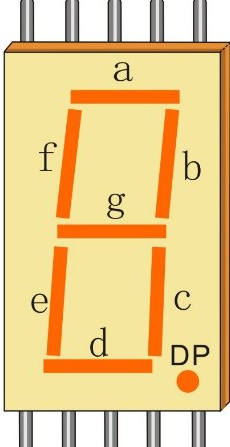
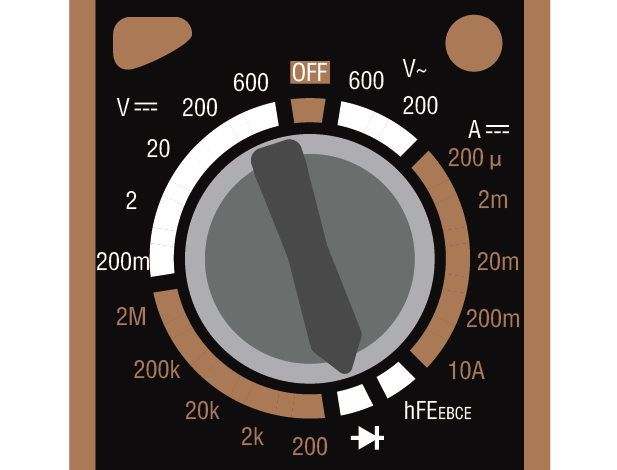
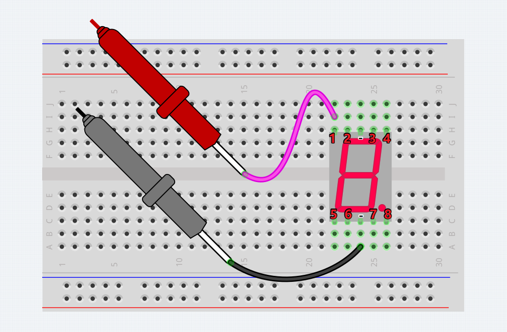
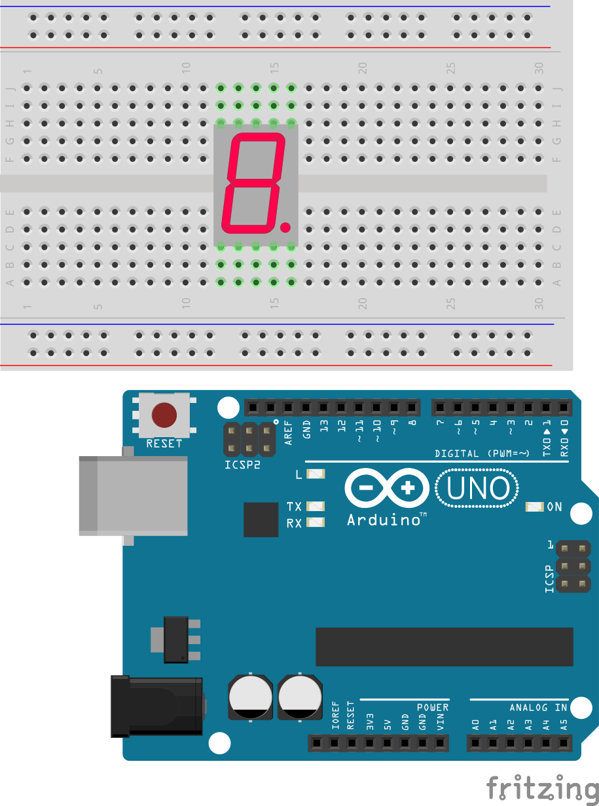
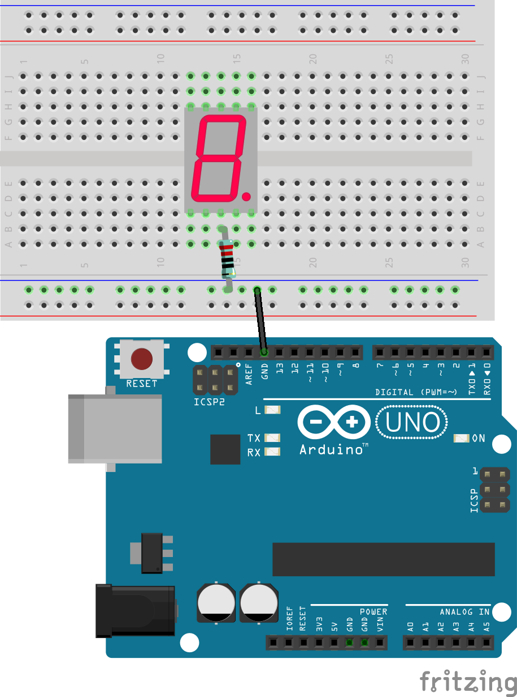
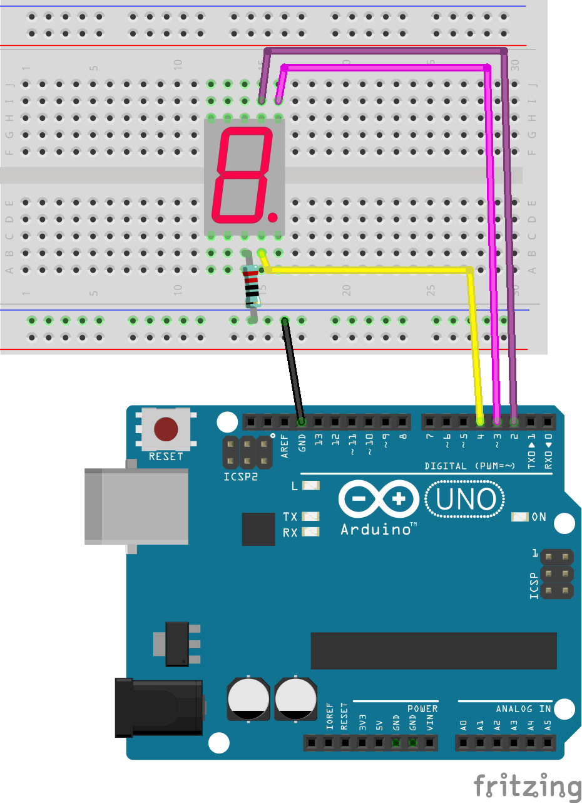
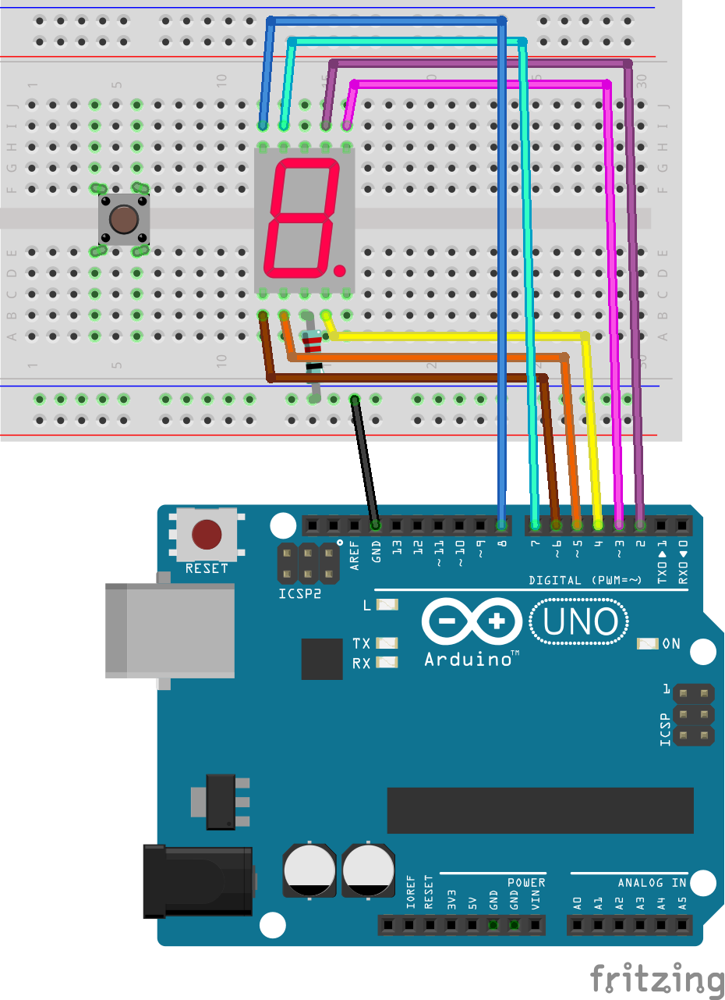
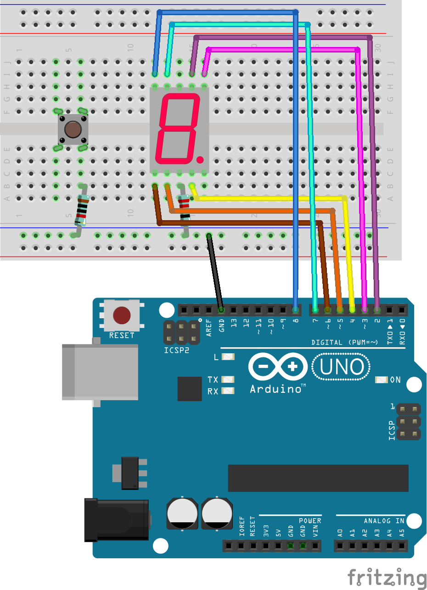
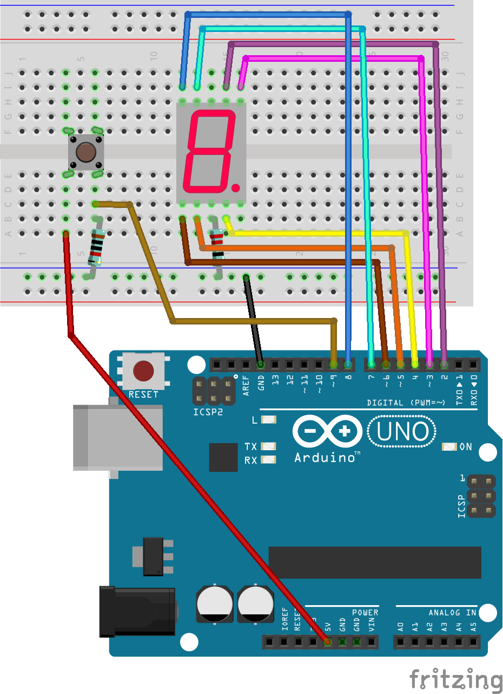
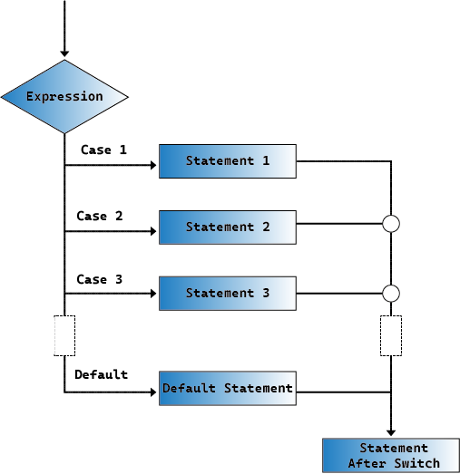

22. Cyber Dice
=====================

骰子是世界上最古老的赌博工具之一，其历史悠久，可以追溯到公元前数千年。
骰子的发明和使用体现了人类历史上对运气、命运和数学概率的早期探索。

最早的骰子出现在公元前3000年左右的古埃及，这些骰子通常由骨头、
象牙或其他天然材料制成。这些古埃及的骰子形状不规则，有时甚至不是完全对称的。

在同一时期，古美索不达米亚（现今的伊拉克）文明中也有发现骰子的记录。
古代的占卜师和宗教领袖使用骰子来做出决定或预测未来，
这表明骰子在宗教和神秘仪式中的使用同样重要。

随着时间的推移，骰子的形状和制作技术逐渐标准化。到了公元前1世纪，
罗马帝国对骰子的使用已非常普遍。
罗马人不仅在赌博中使用骰子，也用它们进行各种社交和娱乐活动。

在亚洲，尤其是在印度，骰子的使用可以追溯到古代文献《摩诃婆罗多》中的描述。
这部史诗记载了一场决定性的骰子游戏，对史诗的情节发展起了重要作用。

到了文艺复兴时期，骰子的生产更为精细，制作材料也开始多样化，包括木头、骨头、象牙甚至金属。
骰子的制作和使用逐渐成为一种艺术形式和娱乐方式

今天，骰子不仅是娱乐和赌博的工具，还广泛用于教育、
决策支持和各种桌面游戏中。它们的历史和多样性反映了人类文化和技术的发展，
是探索几率和运气的一个迷人窗口。

在这个项目中，我们将进行两个项目。

首先，我们将一步步的探索，让数码管显示数字。

随后，我们将创造一个电子骰子！它只需轻按一个按钮，
一个随机的数字就会在七段数码管上出现，数字范围从1到6。

**数码管**

七段数码管是由七个独立的LED段组成，这些段排列成一个“8”字形。这些LED段分别标记为A到G。
通过点亮这些段的不同组合，可以显示数字0到9和一些字母。

每个LED段可以单独控制，所有LED段的阴极连接在一起，并连接到地线，
而各个阳极则通过控制器（如Arduino）来单独控制。

例如，要显示数字“1”，只需点亮B和C两个段。

**使用万用表来识别七段数码管上各个引脚**

二极管测试是万用表的一个功能，用来检测二极管或类似的半导体器件（如LED）
的正向导通以及它们是否正常工作。万用表会通过二极管发送一个小电流。如果二极管完好无损，它将允许电流通过。

操作步骤如下：

1. 将万用表调至二极管测试模式

2. 使用万用表的红色正极测试笔连接到引脚1，黑色负极测试笔连接到引脚3。

3. 观察数码管是否有LED段亮起。如果有段亮起，记录下哪个引脚控制哪个段。

4. 将测试结果填入Handbook

5. 重复以上步骤，将红色正极测试笔连接其他的引脚。直到测试完所有引脚，找出所有控制LED的引脚。

.. note::

    七段数码管的这两个引脚都是GND。请不要让它们同时连接正负极，避免引起短路。
    

.. list-table::
    :widths: 20 20 40
    :header-rows: 1

    *   - 引脚
        - 发光LED段序号
        - 发光LED段的描述
    *   - 1
        - g
        - 正中间的一段
    *   - 2
        -
        - 
    *   - 4
        -
        - 
    *   - 5
        -
        - 
    *   - 6
        -
        - 
    *   - 7
        -
        - 
    *   - 9
        -
        - 
    *   - 10
        -
        -     

*Question：如果想要让数码管显示数字2，应当为哪几个引脚提供高电平？*

**构筑电路**

1. 将数码管插入面包板

2. 将数码管的阴极通过220Ω电阻接入GND

3. 将控制a,b,c段LED的引脚接入到UNO板的2,3,4引脚

4. 将控制d,e,f,g段LED的引脚接入到UNO板的5,6,7,8引脚

5. 插入一个按钮

6. 接入一个下拉电阻

7. 连接引脚9与按钮

8. 将按钮的另一端连接5V

编写代码 - 显示数字
-------------------------------------

1. 创建一个新的草图，将其命名为"Lesson10_show_number"

2. 定义引脚和初始设置，在Arduino代码中，定义每个段与Arduino引脚的连接，并设置引脚模式为输出。

.. code-block:: Arduino

    // 定义连接到七段显示器的引脚
    int pinA = 2;
    int pinB = 3;
    int pinC = 4;
    int pinD = 5;
    int pinE = 6;
    int pinF = 7;
    int pinG = 8;

    void setup() {
        // 将所有引脚设置为输出模式
        pinMode(pinA, OUTPUT);
        pinMode(pinB, OUTPUT);
        pinMode(pinC, OUTPUT);
        pinMode(pinD, OUTPUT);
        pinMode(pinE, OUTPUT);
        pinMode(pinF, OUTPUT);
        pinMode(pinG, OUTPUT);
    }

3. 你可以创建一个函数来控制数码管显示特定的数字。在这里我们可以使用if-esle语句，但是未免有些繁琐。

**Switch**

那么，switch语句提供了一种比多个if-else语句更清晰、更有组织的方法来选择多个可能的不同行为。
在编程中，switch语句是一种控制结构，用于基于变量的值执行不同的代码段。

switch语句的基本语法通常如下：

.. code-block:: Arduino

    switch (expression) {
        case value1:
            // code
            break;
        case value2:
            // code
            break;
        default:
            // code
    }

* expression: 这是一个通常返回整数或字符的表达式，switch语句将根据这个表达式的值来选择执行哪个case。
* case: 每个case关键字后跟一个可以与expression结果相匹配的值。如果匹配成功，从这个点开始执行代码直到遇到break语句。
* break: break语句用于退出switch块。如果没有break，程序将继续执行下一个case的代码，不论其值是否匹配，这称为“fall-through”。
* default: default部分是可选的，如果没有任何case匹配，执行将跳转到default部分。就像else在if-else结构中一样。

在新建函数中使用 switch-case 来完成数码管的数字显示。

.. code-block:: Arduino

    void displayDigit(int digit) {
        // Turn off all segments
        digitalWrite(pinA, LOW);
        digitalWrite(pinB, LOW);
        digitalWrite(pinC, LOW);
        digitalWrite(pinD, LOW);
        digitalWrite(pinE, LOW);
        digitalWrite(pinF, LOW);
        digitalWrite(pinG, LOW);

        // Turn on the segments needed for the desired number (LOW turns on the segments for common cathode)
        switch (digit) {
            case 1:
                digitalWrite(pinB, HIGH);
                digitalWrite(pinC, HIGH);
                break;
            case 2:
                digitalWrite(pinA, HIGH);
                digitalWrite(pinB, HIGH);
                digitalWrite(pinD, HIGH);
                digitalWrite(pinE, HIGH);
                digitalWrite(pinG, HIGH);
                break;
            case 3:
                digitalWrite(pinA, HIGH);
                digitalWrite(pinB, HIGH);
                digitalWrite(pinC, HIGH);
                digitalWrite(pinD, HIGH);
                digitalWrite(pinG, HIGH);
                break;
            case 4:
                digitalWrite(pinB, HIGH);
                digitalWrite(pinC, HIGH);
                digitalWrite(pinF, HIGH);
                digitalWrite(pinG, HIGH);
                break;
            case 5:
                digitalWrite(pinA, HIGH);
                digitalWrite(pinC, HIGH);
                digitalWrite(pinD, HIGH);
                digitalWrite(pinF, HIGH);
                digitalWrite(pinG, HIGH);
                break;
            case 6:
                digitalWrite(pinA, HIGH);
                digitalWrite(pinC, HIGH);
                digitalWrite(pinD, HIGH);
                digitalWrite(pinE, HIGH);
                digitalWrite(pinF, HIGH);
                digitalWrite(pinG, HIGH);
                break;
        }
    }

4. 在loop()函数中，你可以调用displayDigit()函数来显示一个数字。

.. code-block:: Arduino

    void loop() {
        for (int num = 1; num <= 6; num++) {
            displayDigit(num);
            delay(1000); // Display each number for 1 second
        }
    }

你的代码应当是这个样子的：

.. code-block:: Arduino

    // Define the pins connected to the segments of the seven-segment display
    int pinA = 2;
    int pinB = 3;
    int pinC = 4;
    int pinD = 5;
    int pinE = 6;
    int pinF = 7;
    int pinG = 8;

    void setup() {
        // Set all pins as outputs
        pinMode(pinA, OUTPUT);
        pinMode(pinB, OUTPUT);
        pinMode(pinC, OUTPUT);
        pinMode(pinD, OUTPUT);
        pinMode(pinE, OUTPUT);
        pinMode(pinF, OUTPUT);
        pinMode(pinG, OUTPUT);
    }

    void loop() {
        for (int num = 1; num <= 6; num++) {
            displayDigit(num);
            delay(1000); // Display each number for 1 second
        }
    }

    void displayDigit(int digit) {
        // Turn off all segments
        digitalWrite(pinA, LOW);
        digitalWrite(pinB, LOW);
        digitalWrite(pinC, LOW);
        digitalWrite(pinD, LOW);
        digitalWrite(pinE, LOW);
        digitalWrite(pinF, LOW);
        digitalWrite(pinG, LOW);

        // Turn on the segments needed for the desired number (LOW turns on the segments for common cathode)
        switch (digit) {
            case 1:
                digitalWrite(pinB, HIGH);
                digitalWrite(pinC, HIGH);
                break;
            case 2:
                digitalWrite(pinA, HIGH);
                digitalWrite(pinB, HIGH);
                digitalWrite(pinD, HIGH);
                digitalWrite(pinE, HIGH);
                digitalWrite(pinG, HIGH);
                break;
            case 3:
                digitalWrite(pinA, HIGH);
                digitalWrite(pinB, HIGH);
                digitalWrite(pinC, HIGH);
                digitalWrite(pinD, HIGH);
                digitalWrite(pinG, HIGH);
                break;
            case 4:
                digitalWrite(pinB, HIGH);
                digitalWrite(pinC, HIGH);
                digitalWrite(pinF, HIGH);
                digitalWrite(pinG, HIGH);
                break;
            case 5:
                digitalWrite(pinA, HIGH);
                digitalWrite(pinC, HIGH);
                digitalWrite(pinD, HIGH);
                digitalWrite(pinF, HIGH);
                digitalWrite(pinG, HIGH);
                break;
            case 6:
                digitalWrite(pinA, HIGH);
                digitalWrite(pinC, HIGH);
                digitalWrite(pinD, HIGH);
                digitalWrite(pinE, HIGH);
                digitalWrite(pinF, HIGH);
                digitalWrite(pinG, HIGH);
                break;
        }
    }

5. 点击“上传”按钮，将草图上传到你的 Arduino 板。

6. 点击 “保存” 来保存你的草图。

编写代码 - Cyber Dice
-------------------------------------

1. 备份"Lesson10_show_number"，另存一个草图，将其命名为"Lesson10_cyber_dice"

2. 将按钮整合到Arduino代码中

.. code-block:: Arduino
    :emphasize-lines: 10-11,23-24

    // Define the pins connected to the segments of the seven-segment display
    int pinA = 2;
    int pinB = 3;
    int pinC = 4;
    int pinD = 5;
    int pinE = 6;
    int pinF = 7;
    int pinG = 8;

    // Define the pin connected to the button
    int buttonPin = 9;

    void setup() {
        // Set all pins as outputs
        pinMode(pinA, OUTPUT);
        pinMode(pinB, OUTPUT);
        pinMode(pinC, OUTPUT);
        pinMode(pinD, OUTPUT);
        pinMode(pinE, OUTPUT);
        pinMode(pinF, OUTPUT);
        pinMode(pinG, OUTPUT);

        // Set the button pin as an input
        pinMode(buttonPin, INPUT);
    }

3. 在循环中检查按钮是否被按下。

.. code-block:: Arduino

    void loop() {
        // Check if the button is pressed
        if (digitalRead(buttonPin) == HIGH) {
            ... ...
        }
    }

4. 如果按下，程序将继续生成并显示一个随机数。

.. code-block:: Arduino

    void loop() {
        // Check if the button is pressed
        if (digitalRead(buttonPin) == HIGH) {
            // Generate a random number between 1 and 6
            int num = random(1, 7); // Note: random(1, 7) generates numbers from 1 to 6
        }
    }

5. 显示数字，并添加了延迟以防止抖动效果和意外的多次检测。

.. code-block:: Arduino

    void loop() {
        // Check if the button is pressed
        if (digitalRead(buttonPin) == HIGH) {
            // Generate a random number between 1 and 6
            int num = random(1, 7); // Note: random(1, 7) generates numbers from 1 to 6

            // Display the random number on the seven-segment display
            displayDigit(num);

            // Delay to debounce the button and add a slight pause after pressing
            delay(500);

        }
    }

6. 在Arduino或类似微控制器的编程中，处理按钮输入时通常会遇到一个常见问题：
如何确保每次按压只触发一次操作，尤其是在涉及到生成事件或执行命令（如随机数生成）时。
为了解决这个问题，我们可以使用一种称为“等待释放”（wait-for-release）的技术。

**wait-for-release**

这种方法的核心思想是，在按钮按下并执行了一次操作后，程序会进入一个循环，这个循环会持续监测按钮状态，直到按钮被释放。
这样做的目的是确保在按钮未完全释放之前，不会因为按钮抖动或用户保持按压状态而触发额外的操作。

我们可以在代码中加入一个while循环来实现这一点。

.. code-block:: Arduino
    :emphasize-lines: 13-14

    void loop() {
        // Check if the button is pressed
        if (digitalRead(buttonPin) == HIGH) {
            // Generate a random number between 1 and 6
            int num = random(1, 7); // Note: random(1, 7) generates numbers from 1 to 6

            // Display the random number on the seven-segment display
            displayDigit(num);

            // Delay to debounce the button and add a slight pause after pressing
            delay(500);

            // Wait for the button to be released before continuing
            while (digitalRead(buttonPin) == HIGH);
        }
    }

这里的while循环会在检测到按钮仍被按下（即digitalRead(buttonPin)返回HIGH）时持续执行。
只有当按钮被释放，输入引脚的状态变为LOW时，循环才会终止，程序才会跳出循环，等待下一次按钮按压。

你的代码应当如下所示：

.. code-block:: Arduino

    // Define the pins connected to the segments of the seven-segment display
    int pinA = 2;
    int pinB = 3;
    int pinC = 4;
    int pinD = 5;
    int pinE = 6;
    int pinF = 7;
    int pinG = 8;

    // Define the pin connected to the button
    int buttonPin = 9;

    void setup() {
        // Set all pins as outputs
        pinMode(pinA, OUTPUT);
        pinMode(pinB, OUTPUT);
        pinMode(pinC, OUTPUT);
        pinMode(pinD, OUTPUT);
        pinMode(pinE, OUTPUT);
        pinMode(pinF, OUTPUT);
        pinMode(pinG, OUTPUT);

        // Set the button pin as an input
        pinMode(buttonPin, INPUT);
    }

    void loop() {
        // Check if the button is pressed
        if (digitalRead(buttonPin) == HIGH) {
            // Generate a random number between 1 and 6
            int num = random(1, 7); // Note: random(1, 7) generates numbers from 1 to 6

            // Display the random number on the seven-segment display
            displayDigit(num);

            // Delay to debounce the button and add a slight pause after pressing
            delay(500);

            // Wait for the button to be released before continuing
            while (digitalRead(buttonPin) == HIGH);
        }
    }

    void displayDigit(int digit) {
        // Turn off all segments
        digitalWrite(pinA, LOW);
        digitalWrite(pinB, LOW);
        digitalWrite(pinC, LOW);
        digitalWrite(pinD, LOW);
        digitalWrite(pinE, LOW);
        digitalWrite(pinF, LOW);
        digitalWrite(pinG, LOW);

        // Turn on the segments needed for the desired number (LOW turns on the segments for common cathode)
        switch (digit) {
            case 1:
                digitalWrite(pinB, HIGH);
                digitalWrite(pinC, HIGH);
                break;
            case 2:
                digitalWrite(pinA, HIGH);
                digitalWrite(pinB, HIGH);
                digitalWrite(pinD, HIGH);
                digitalWrite(pinE, HIGH);
                digitalWrite(pinG, HIGH);
                break;
            case 3:
                digitalWrite(pinA, HIGH);
                digitalWrite(pinB, HIGH);
                digitalWrite(pinC, HIGH);
                digitalWrite(pinD, HIGH);
                digitalWrite(pinG, HIGH);
                break;
            case 4:
                digitalWrite(pinB, HIGH);
                digitalWrite(pinC, HIGH);
                digitalWrite(pinF, HIGH);
                digitalWrite(pinG, HIGH);
                break;
            case 5:
                digitalWrite(pinA, HIGH);
                digitalWrite(pinC, HIGH);
                digitalWrite(pinD, HIGH);
                digitalWrite(pinF, HIGH);
                digitalWrite(pinG, HIGH);
                break;
            case 6:
                digitalWrite(pinA, HIGH);
                digitalWrite(pinC, HIGH);
                digitalWrite(pinD, HIGH);
                digitalWrite(pinE, HIGH);
                digitalWrite(pinF, HIGH);
                digitalWrite(pinG, HIGH);
                break;
        }
    }

7. 点击“上传”按钮，将草图上传到你的 Arduino 板。

8. 点击 “保存” 来保存你的草图。