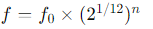
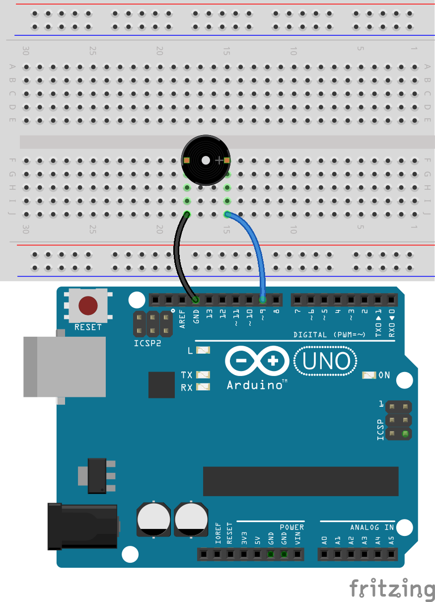

.. note::

    ¡Hola! Bienvenido a la comunidad de entusiastas de SunFounder Raspberry Pi, Arduino y ESP32 en Facebook. Profundiza en el mundo de Raspberry Pi, Arduino y ESP32 con otros entusiastas.

    **¿Por qué unirse?**

    - **Soporte experto**: Resuelve problemas post-venta y desafíos técnicos con la ayuda de nuestra comunidad y equipo.
    - **Aprende y comparte**: Intercambia consejos y tutoriales para mejorar tus habilidades.
    - **Avances exclusivos**: Obtén acceso anticipado a nuevos anuncios de productos y adelantos.
    - **Descuentos especiales**: Disfruta de descuentos exclusivos en nuestros productos más recientes.
    - **Promociones y sorteos festivos**: Participa en sorteos y promociones de temporada.

    👉 ¿Listo para explorar y crear con nosotros? Haz clic en [|link_sf_facebook|] y únete hoy mismo.

22. Toca "Estrellita, dónde estás"
===========================================
En esta lección, exploraremos la fascinante intersección entre la música y la tecnología. Aprenderás cómo se producen los diferentes tonos musicales mediante cambios de frecuencia y cómo aplicar este principio utilizando un microcontrolador como Arduino para controlar un zumbador. Al final de esta lección, no solo comprenderás los conceptos básicos de las frecuencias musicales, sino que también podrás programar un Arduino para tocar una melodía simple.

.. raw:: html

     <video controls style = "max-width:90%">
        <source src="_static/video/22_little_star.mp4" type="video/mp4">
        Your browser does not support the video tag.
    </video>

Al final de esta lección, serás capaz de:

* Aprender cómo los tonos musicales corresponden a frecuencias específicas.
* Simplificar la programación usando arreglos para almacenar y manipular notas musicales.
* Escribir y ejecutar un programa que controle un zumbador pasivo para tocar "Estrellita, dónde estás".

Frecuencias musicales y producción de sonido
-------------------------------------------------

Varios instrumentos musicales producen diferentes tonos al cambiar la frecuencia.
Por ejemplo, al tocar las teclas de un piano, se hacen vibrar las cuerdas correspondientes rápidamente, produciendo tonos específicos.
Científicos y músicos han desarrollado varios métodos de afinación musical y estándares de tono mediante la medición precisa de estas frecuencias de vibración.

Cuando controlas un Arduino o cualquier otro microcontrolador para enviar una señal eléctrica a un zumbador, el diafragma del zumbador vibra rápidamente según la frecuencia de la señal, produciendo sonido. Por ejemplo, una señal ajustada a 440 Hz producirá el tono musical estándar "A4", que es un punto de referencia en la afinación musical.
A medida que aumenta o disminuye la frecuencia, el tono producido también sube o baja, logrando así una gama de tonos de bajos a altos en la composición musical.

En la música occidental, una octava incluye 12 tonos (semitonos), desde C hasta B, y luego vuelve a una C más alta.

Por ejemplo, la frecuencia de C media (generalmente denominada C4) es aproximadamente 261.63 Hz. La frecuencia de una nota se puede calcular utilizando la siguiente fórmula:

donde f_0 es el tono de referencia (generalmente A4, con una frecuencia de 440 Hz), y n es el número de pasos de semitono desde el tono de referencia hasta el tono objetivo (los números positivos indican una subida, los negativos una bajada).
Usando esta fórmula, podemos calcular la frecuencia de cualquier nota.

Aquí tienes una tabla de frecuencias:

* C (C4): 262 Hz (aproximadamente 261.63 Hz, redondeado a 262)
* D (D4): 294 Hz
* E (E4): 330 Hz
* F (F4): 349 Hz
* G (G4): 392 Hz
* A (A4): 440 Hz
* B (B4): 494 Hz

Ahora exploraremos los secretos de las notas a través de Arduino y un zumbador. Hagamos que el zumbador pasivo toque las dos primeras líneas de "Estrellita, dónde estás":

.. note::

  La melodía de "Estrellita, dónde estás" se basa en combinaciones simples de notas,
  y la melodía de esta canción está basada en variaciones de "Ah vous dirai-je, Maman" del compositor francés Wolfgang Amadeus Mozart,
  lo que la hace muy adecuada para que los principiantes aprendan.

  Aquí tienes la partitura básica de "Estrellita, dónde estás", con cada nota:

  .. code-block:: 

    C C G G A A G
    F F E E D D C
    G G F F E E D
    G G F F E E D
    C C G G A A G
    F F E E D D C

Construcción del circuito
----------------------------

**Componentes necesarios**

.. list-table:: 
   :widths: 25 25 25 25
   :header-rows: 0

   * - 1 * Arduino Uno R3
     - 1 * Protoboard
     - 1 * Zumbador pasivo
     - Cables de puente
   * - |list_uno_r3| 
     - |list_breadboard| 
     - |list_passive_buzzer| 
     - |list_wire| 
   * - 1 * Cable USB
     - 
     - 
     - 
   * - |list_usb_cable| 
     - 
     - 
     - 

**Construcción paso a paso**

Esta lección utiliza el mismo circuito que la Lección 21.

Creación de código - Array
-------------------------------
1. Abre el IDE de Arduino y comienza un nuevo proyecto seleccionando "Nuevo Sketch" en el menú "Archivo".
2. Guarda tu sketch como ``Lesson22_Array`` utilizando ``Ctrl + S`` o haciendo clic en "Guardar".

3. Ahora crea un array al comienzo del código, almacenando las notas de "Estrellita, dónde estás" en el array.

.. code-block:: Arduino

  // Definir las frecuencias para las notas de la escala de do mayor (octava que comienza desde do medio)
  int c = 262;
  int d = 294;
  int e = 330;
  int f = 349;
  int g = 392;
  int a = 440;
  int b = 494;
  int C = 523;  // Do alto

  // Definir un array que contiene la secuencia de notas en la melodía
  int melody[] = { c, c, g, g, a, a, g, f, f, e, e, d, d, c, g, g, f, f, e, e, d, g, g, f, f, e, e, d, c, c, g, g, a, a, g, f, f, e, e, d, d, c };

Un array es una estructura de datos que se utiliza para almacenar múltiples elementos del mismo tipo en la programación de Arduino.
Es una herramienta muy básica y poderosa, y cuando se usa adecuadamente, puede mejorar enormemente la eficiencia y el rendimiento del programa.
Los arrays pueden almacenar elementos de tipos como enteros, números en coma flotante y caracteres.

Al igual que al crear variables y funciones, crear un array implica especificar el tipo y el nombre del array: ``int melody[]``.

Los elementos dentro de ``{}`` se llaman elementos del array, comenzando desde el índice 0, por lo que ``melody[0]`` equivale al primer ``c(262)``, y ``melody[13]`` es también ``c(262)``.

4. Ahora imprime los elementos en los índices 0 y 13 del arreglo ``melody[]`` en el monitor serial.

.. code-block:: Arduino
  :emphasize-lines: 17,18

  // Definir las frecuencias para las notas de la escala de do mayor (octava que comienza desde do medio)
  int c = 262;
  int d = 294;
  int e = 330;
  int f = 349;
  int g = 392;
  int a = 440;
  int b = 494;
  int C = 523;  // Do alto

  // Definir un arreglo que contiene la secuencia de notas en la melodía
  int melody[] = { c, c, g, g, a, a, g, f, f, e, e, d, d, c, g, g, f, f, e, e, d, g, g, f, f, e, e, d, c, c, g, g, a, a, g, f, f, e, e, d, d, c };

  void setup() {
    // Coloca tu código de configuración aquí para que se ejecute una vez:
    Serial.begin(9600);  // Inicializar la comunicación serial a 9600 baudios
    Serial.println(melody[0]);
    Serial.println(melody[13]);
  }
  
  void loop() {
    // Coloca aquí tu código principal para que se ejecute repetidamente:
  }

5. Después de cargar el código en el Arduino Uno R3, abre el monitor serial y verás dos 262.

.. code-block::

  262
  262

6. Si deseas imprimir cada elemento del arreglo ``melody[]`` uno por uno, primero necesitarás conocer la longitud del arreglo. Puedes usar la función ``sizeof()`` para calcular el número de elementos en el arreglo.

.. code-block:: Arduino
  :emphasize-lines: 4

  void setup() {
    // Coloca tu código de configuración aquí para que se ejecute una vez:
    Serial.begin(9600);  // Inicializar la comunicación serial a 9600 baudios
    int notes = sizeof(melody) / sizeof(melody[0]); // Calcular el número de elementos
  }

  
* ``sizeof(melody)`` devuelve el total de bytes usados por todos los elementos del arreglo.
* ``sizeof(melody[0])`` devuelve el número de bytes usados por un solo elemento del arreglo.
* Dividir el total de bytes por los bytes por elemento da el número total de elementos en el arreglo.

7. Luego utiliza una declaración ``for`` para iterar a través de los elementos del arreglo ``melody[]`` y mostrarlos usando la función ``Serial.println()``.

.. code-block:: Arduino

  // Definir las frecuencias para las notas de la escala de do mayor (octava que comienza desde do medio)
  int c = 262;
  int d = 294;
  int e = 330;
  int f = 349;
  int g = 392;
  int a = 440;
  int b = 494;
  int C = 523;  // Do alto

  // Definir un arreglo que contiene la secuencia de notas en la melodía
  int melody[] = { c, c, g, g, a, a, g, f, f, e, e, d, d, c, g, g, f, f, e, e, d, g, g, f, f, e, e, d, c, c, g, g, a, a, g, f, f, e, e, d, d, c };

  void setup() {
    // Coloca tu código de configuración aquí para que se ejecute una vez:
    Serial.begin(9600);                              // Inicializar la comunicación serial a 9600 baudios
    int notes = sizeof(melody) / sizeof(melody[0]);  // Calcular el número de elementos
    // Bucle para cada nota en el arreglo melody
    for (int i = 0; i < notes; i = i + 1) {
      // Mostrar la frecuencia de cada nota en el monitor serial
      Serial.println(melody[i]);
    }
  }

  void loop() {
    // Coloca aquí tu código principal para que se ejecute repetidamente:
  }

8. Después de cargar el código en el Arduino Uno R3, abre el monitor serial y verás los elementos del arreglo ``melody[]`` impresos uno por uno.

.. code-block::

  262
  262
  392
  392
  440
  440
  392
  349
  349
  330
  ...

**Preguntas**

También puedes realizar operaciones en los elementos del arreglo, como cambiar a ``Serial.println(melody[i] * 1.3);``. ¿Qué datos obtendrás y por qué?

Creación de código - Toca "Estrellita, dónde estás"
-------------------------------------------------------

Ahora que tenemos una comprensión sólida de cómo crear arreglos, acceder a los elementos de un arreglo y calcular sus longitudes y operaciones, apliquemos este conocimiento para programar un zumbador pasivo para tocar 'Estrellita, dónde estás' utilizando frecuencias e intervalos almacenados.

1. Abre el sketch que guardaste anteriormente, ``Lesson22_Array``. 

2. Haz clic en “Guardar como...” desde el menú “Archivo”, y renómbralo a ``Lesson22_Little_Star``. Haz clic en "Guardar".

3. Primero, define el pin del zumbador.

.. code-block:: Arduino

  const int buzzerPin = 9;  // Asigna el pin 9 a la constante para el zumbador

4. Ahora crea otro arreglo para almacenar la duración de las notas.

.. code-block:: Arduino
  :emphasize-lines: 3

  // Configura la secuencia de notas y sus duraciones en milisegundos
  int melody[] = { c, c, g, g, a, a, g, f, f, e, e, d, d, c, g, g, f, f, e, e, d, g, g, f, f, e, e, d, c, c, g, g, a, a, g, f, f, e, e, d, d, c };
  int noteDurations[] = { 500, 500, 500, 500, 500, 500, 1000, 500, 500, 500, 500, 500, 500, 1000, 500, 500, 500, 500, 500, 500, 1000, 500, 500, 500, 500, 500, 500, 1000, 500, 500, 500, 500, 500, 500, 1000, 500, 500, 500, 500, 500, 500, 1000 };

5. Ahora mueve parte del código de ``void setup()`` a ``void loop()``.

.. code-block:: Arduino
  :emphasize-lines: 8-13

  void setup() {
    // Coloca tu código de configuración aquí para que se ejecute una vez:
    Serial.begin(9600);                              // Inicializar la comunicación serial a 9600 baudios
  }

  void loop() {
    // Coloca aquí tu código principal para que se ejecute repetidamente:
    int notes = sizeof(melody) / sizeof(melody[0]);  // Calcular el número de elementos
    // Bucle para cada nota en el arreglo melody
    for (int i = 0; i < notes; i = i + 1) {
      // Mostrar la frecuencia de cada nota en el monitor serial
      Serial.println(melody[i]);
    }
  }

6. En la declaración ``for``, comenta el código de impresión y usa la función ``tone()`` para tocar las notas.

.. code-block:: Arduino
  :emphasize-lines: 9

  void loop() {
    // Coloca aquí tu código principal para que se ejecute repetidamente:
    int notes = sizeof(melody) / sizeof(melody[0]);  // Calcular el número de elementos
    // Bucle para cada nota en el arreglo melody
    for (int i = 0; i < notes; i = i + 1) {
      // Mostrar la frecuencia de cada nota en el monitor serial
      // Serial.println(melody[i]);

      tone(buzzerPin, melody[i], noteDurations[i]);  // Tocar la nota
    }
  }

7. Después de reproducir cada nota, para hacer que la melodía suene más natural, agrega una breve pausa entre las notas. Aquí multiplicamos la duración de las notas por 1.30 para calcular el intervalo, haciendo que la melodía suene menos apresurada.

.. code-block:: Arduino
  :emphasize-lines: 10

  void loop() {
    // Coloca aquí tu código principal para que se ejecute repetidamente:
    int notes = sizeof(melody) / sizeof(melody[0]);  // Calcula el número de elementos
    // Recorre cada nota en el arreglo melody
    for (int i = 0; i < notes; i = i + 1) {
      // Imprime la frecuencia de cada nota en el monitor serial
      // Serial.println(melody[i]);

      tone(buzzerPin, melody[i], noteDurations[i]);  // Reproduce la nota
      delay(noteDurations[i] * 1.30);                // Espera antes de cambiar la nota
    }
  }

8. Usa la función ``noTone()`` para detener la salida de tono en el pin actual. Este paso es necesario para asegurar que cada nota se toque claramente sin mezclarse con la siguiente.

.. code-block:: Arduino
  :emphasize-lines: 11

  void loop() {
    // Coloca aquí tu código principal para que se ejecute repetidamente:
    int notes = sizeof(melody) / sizeof(melody[0]);  // Calcula el número de elementos
    // Recorre cada nota en el arreglo melody
    for (int i = 0; i < notes; i = i + 1) {
      // Imprime la frecuencia de cada nota en el monitor serial
      // Serial.println(melody[i]);

      tone(buzzerPin, melody[i], noteDurations[i]);  // Reproduce la nota
      delay(noteDurations[i] * 1.30);                // Espera antes de cambiar la nota
      noTone(buzzerPin);                             // Detiene la reproducción de la nota
    }
  }

9. A continuación, se muestra tu código completo. Una vez que subas el código al Arduino Uno R3, podrás escuchar al buzzer tocando "Estrellita, dónde estás".

.. code-block:: Arduino

  int buzzerPin = 9;  // Asigna el pin 9 a la constante para el buzzer

  // Definir las frecuencias de las notas en la escala de do mayor (octava comenzando desde do medio)
  int c = 262;
  int d = 294;
  int e = 330;
  int f = 349;
  int g = 392;
  int a = 440;
  int b = 494;
  int C = 523;  // Do alto

  // Configurar la secuencia de notas y sus duraciones en milisegundos
  int melody[] = { c, c, g, g, a, a, g, f, f, e, e, d, d, c, g, g, f, f, e, e, d, g, g, f, f, e, e, d, c, c, g, g, a, a, g, f, f, e, e, d, d, c };
  int noteDurations[] = { 500, 500, 500, 500, 500, 500, 1000, 500, 500, 500, 500, 500, 500, 1000, 500, 500, 500, 500, 500, 500, 1000, 500, 500, 500, 500, 500, 500, 1000, 500, 500, 500, 500, 500, 500, 1000, 500, 500, 500, 500, 500, 500, 1000 };

  void setup() {
    // Coloca aquí tu código de configuración para que se ejecute una vez:
    Serial.begin(9600);                              // Inicializar la comunicación serial a 9600 baudios
  }

  void loop() {
    // Coloca aquí tu código principal para que se ejecute repetidamente:
    int notes = sizeof(melody) / sizeof(melody[0]);  // Calcula el número de elementos
    // Recorre cada nota en el arreglo melody
    for (int i = 0; i < notes; i = i + 1) {
      // Imprime la frecuencia de cada nota en el monitor serial
      // Serial.println(melody[i]);

      tone(buzzerPin, melody[i], noteDurations[i]);  // Reproduce la nota
      delay(noteDurations[i] * 1.30);                // Espera antes de cambiar la nota
      noTone(buzzerPin);                             // Detiene la reproducción de la nota
    }
  }
  
10. Finalmente, recuerda guardar tu código y organizar tu espacio de trabajo.

**Pregunta**

Si reemplazas el buzzer pasivo en el circuito con uno activo, ¿puedes reproducir "Estrellita, dónde estás" correctamente? ¿Por qué?

**Resumen**

Ahora que la clase ha terminado, en esta lección aprendimos cómo usar arreglos para almacenar datos, calcular longitudes de arreglos, indexar elementos dentro de un arreglo y realizar operaciones sobre cada elemento. Al almacenar frecuencias de notas e intervalos de tiempo en arreglos e iterar sobre ellos con un bucle for, programamos con éxito un buzzer pasivo para tocar 'Estrellita, dónde estás'.

Además, aprendimos cómo pausar la reproducción de una nota utilizando la función ``noTone()``.

Esta lección no solo reforzó nuestra comprensión de las operaciones con arreglos y las estructuras de control en programación, sino que también demostró cómo estos conceptos pueden aplicarse para crear música con componentes electrónicos, vinculando el conocimiento teórico con aplicaciones prácticas de una manera divertida y atractiva.
