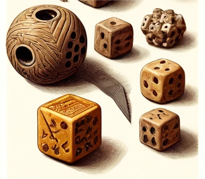
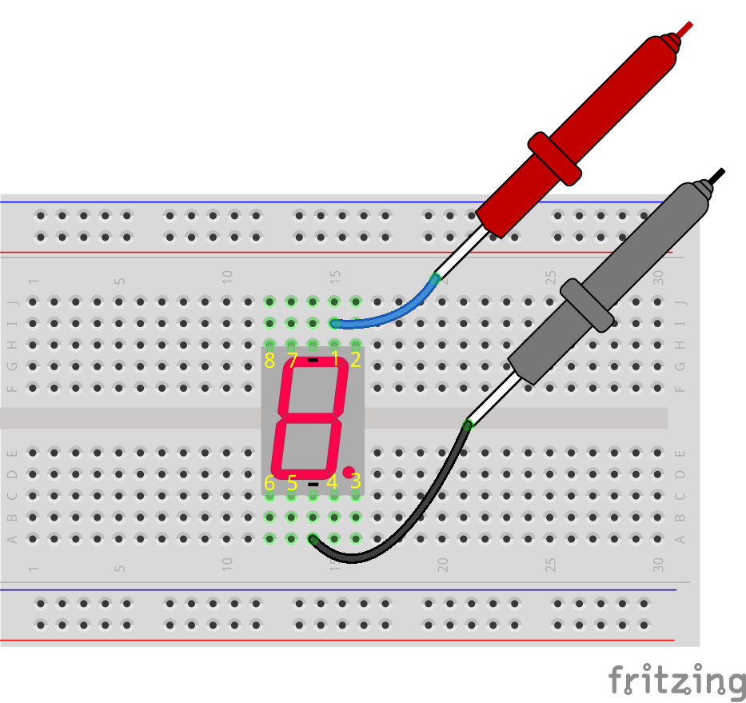
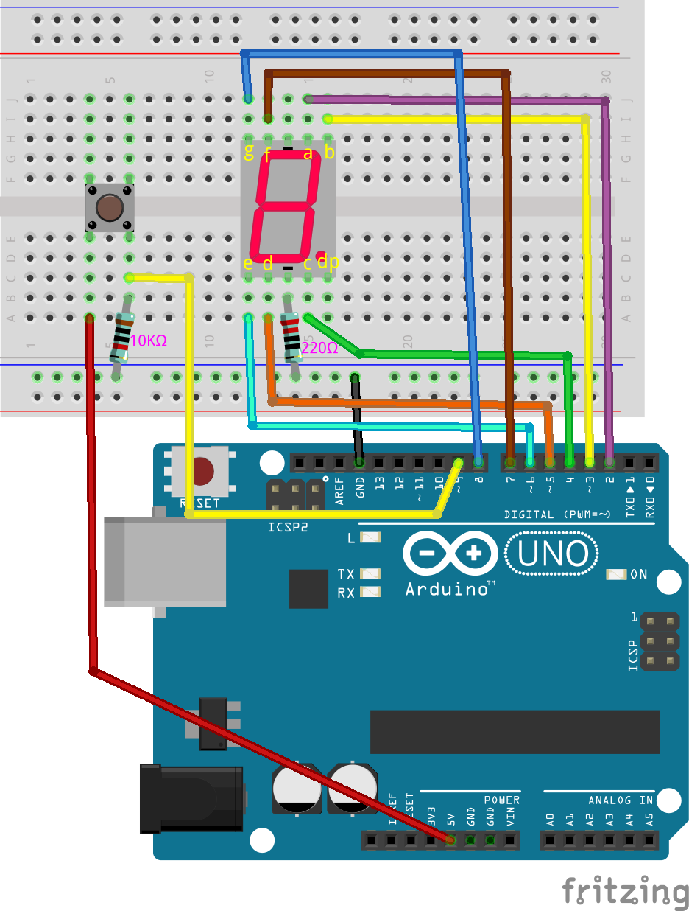
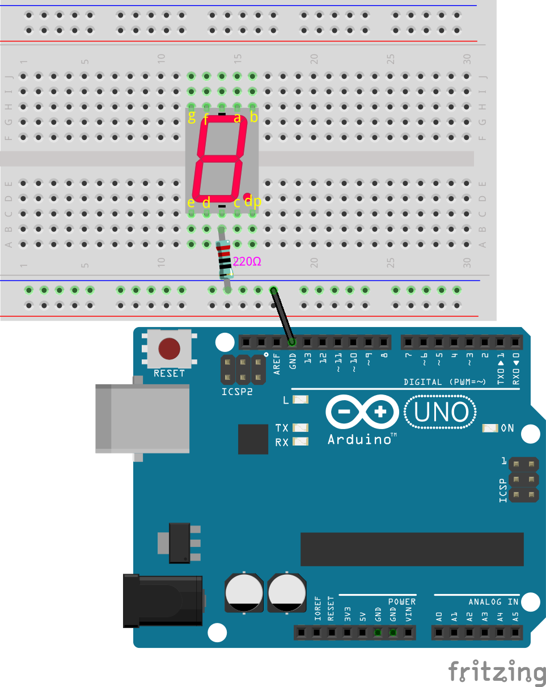
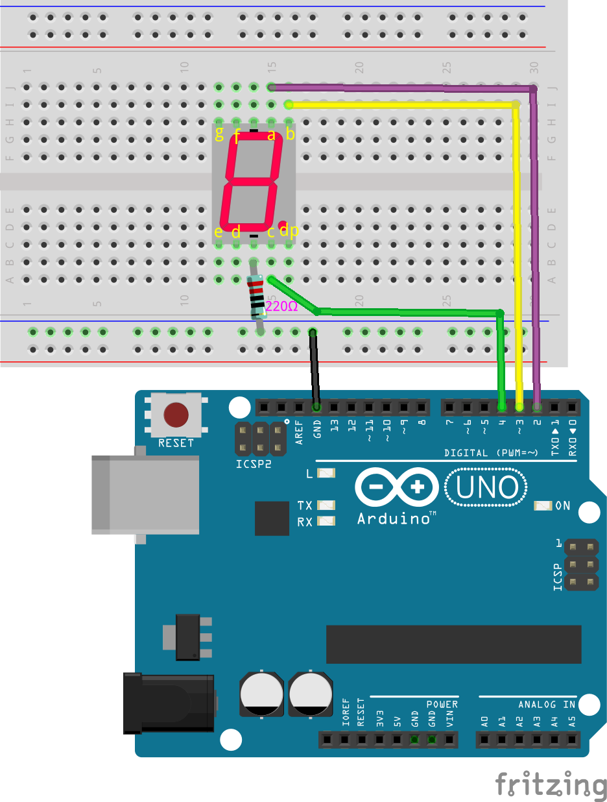
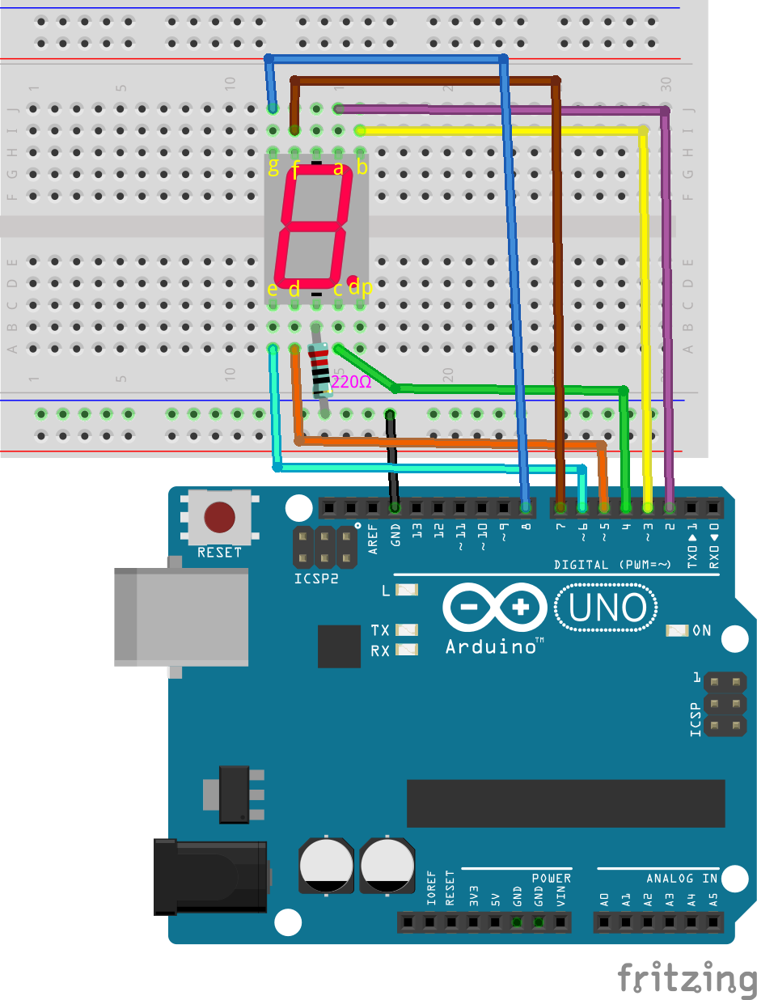
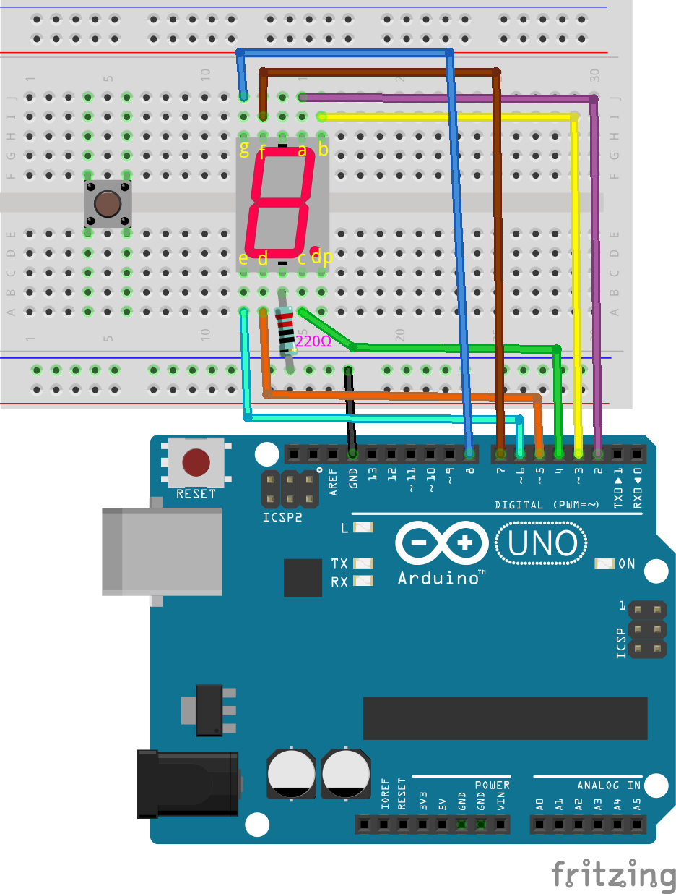
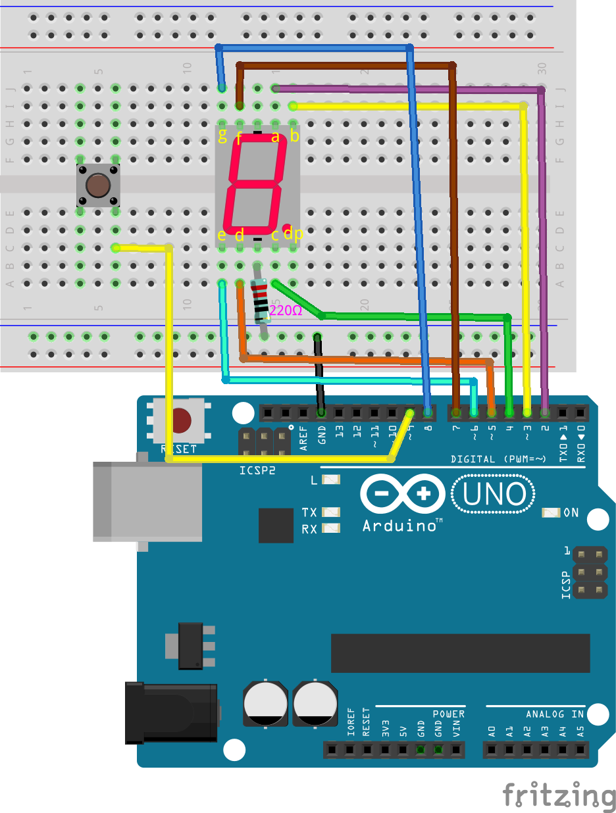
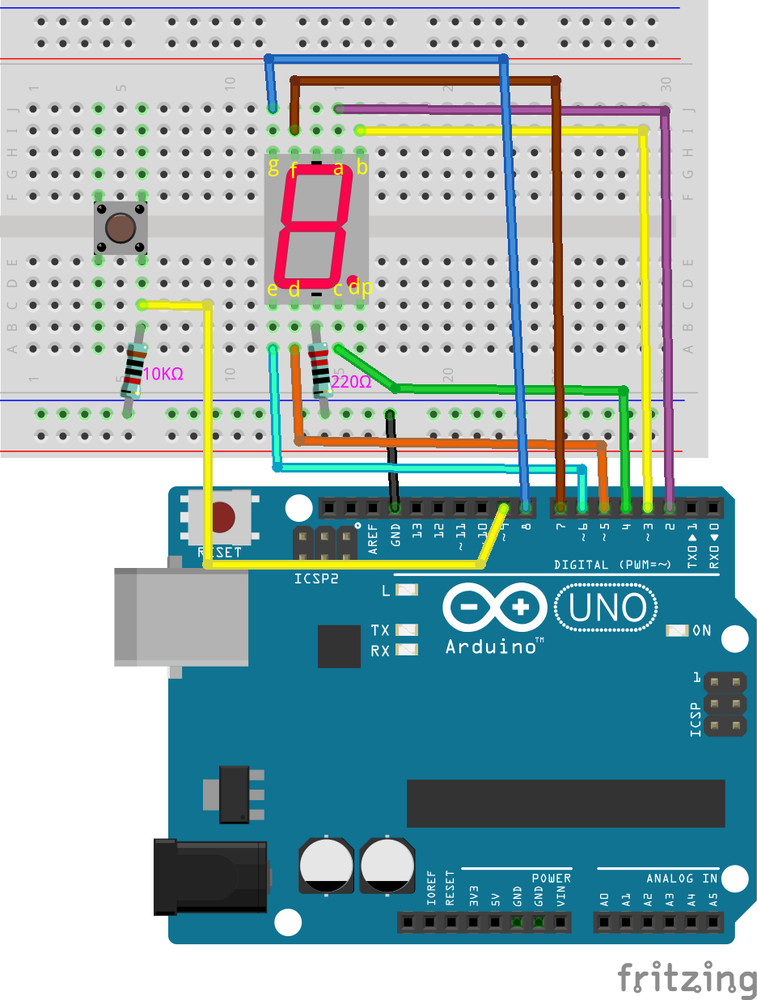
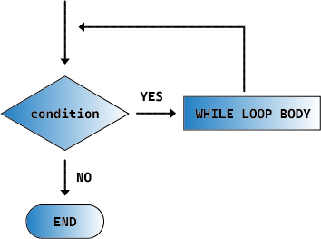

.. note::

    Hallo, willkommen in der SunFounder Raspberry Pi & Arduino & ESP32 Enthusiasten-Community auf Facebook! Tauche gemeinsam mit anderen Enthusiasten tiefer in die Welt von Raspberry Pi, Arduino und ESP32 ein.

    **Warum beitreten?**

    - **Expertenunterstützung**: Löse nach dem Kauf auftretende Probleme und technische Herausforderungen mit Hilfe unserer Community und unseres Teams.
    - **Lernen & Teilen**: Tausche Tipps und Tutorials aus, um deine Fähigkeiten zu verbessern.
    - **Exklusive Vorschauen**: Erhalte frühzeitigen Zugang zu neuen Produktankündigungen und exklusiven Einblicken.
    - **Sonderrabatte**: Genieße exklusive Rabatte auf unsere neuesten Produkte.
    - **Festliche Aktionen und Verlosungen**: Nimm an Verlosungen und Feiertagsaktionen teil.

    👉 Bereit, mit uns zu erkunden und zu erschaffen? Klicke auf [|link_sf_facebook|] und trete noch heute bei!

23. Cyber-Würfel
=======================

In dieser Lektion begeben wir uns auf eine spannende Reise durch zwei Projekte, die digitale Elektronik und Programmierung verbinden.

.. image:: img/23_dice.jpg
    :align: center
    :width: 500

Zunächst werden wir uns mit der Funktionsweise eines 7-Segment-Displays befassen und lernen, wie man es Schritt für Schritt steuert, um Zahlen anzuzeigen. Anschließend erstellen wir einen elektronischen Würfel! Durch einfaches Drücken eines Knopfes erscheint eine zufällige Zahl zwischen 1 und 6 auf dem 7-Segment-Display – eine digitale Variante des klassischen Würfels.

.. raw:: html

    <video muted controls style = "max-width:90%">
        <source src="_static/video/23_cycle_dice.mp4" type="video/mp4">
        Your browser does not support the video tag.
    </video>

In dieser Lektion wirst du lernen:

* Die Funktionsprinzipien eines 7-Segment-Displays und wie man es steuert.
* Den Einsatz von Switch-Case-Anweisungen, um die Logik des Codes zu vereinfachen.
* Wie man eine While-Schleife verwendet, um einen aktuellen Zustand aufrechtzuerhalten, bis eine Änderung erforderlich ist.
* Wie man das Cyber-Würfel-Projekt baut, indem einfache Elektronik mit interaktiver Programmierung kombiniert wird.

Der Ursprung des Würfels
---------------------------

Würfel gehören zu den ältesten Glücksspielwerkzeugen der Welt, mit einer Geschichte, die bis in die Zeit vor unserer Zeitrechnung zurückreicht. Sie entstanden um 3000 v. Chr. im alten Ägypten und wurden typischerweise aus Knochen, Elfenbein oder anderen natürlichen Materialien hergestellt. Diese frühen Würfel waren oft unregelmäßig geformt und nicht immer vollständig symmetrisch.

Würfel wurden auch im alten Mesopotamien (dem heutigen Irak) zur gleichen Zeit gefunden. Alte Wahrsager und religiöse Führer nutzten Würfel, um Entscheidungen zu treffen oder die Zukunft vorherzusagen, was ihre Bedeutung in religiösen und mystischen Riten unterstreicht.

Mit der Zeit wurden Form und Herstellungstechniken von Würfeln standardisiert. Bereits im 1. Jahrhundert v. Chr. waren Würfel im Römischen Reich weit verbreitet, nicht nur für Glücksspiele, sondern auch für soziale und unterhaltende Zwecke.

In Asien, insbesondere in Indien, wird die Verwendung von Würfeln im alten Epos Mahabharata dokumentiert, in dem ein entscheidendes Würfelspiel eine wichtige Rolle in der Handlung spielt.

Während der Renaissance wurde die Produktion von Würfeln weiter verfeinert, und die verwendeten Materialien erweiterten sich um Holz, Knochen, Elfenbein und sogar Metall. Heute werden Würfel nicht nur für Unterhaltung und Glücksspiele verwendet, sondern auch in der Bildung, zur Entscheidungsunterstützung und in verschiedenen Brettspielen. Ihre Geschichte und Vielfalt spiegeln die Entwicklung der menschlichen Kultur und Technologie wider und bieten einen faszinierenden Einblick in das Erforschen von Zufall und Glück.

Das 7-Segment-Display verstehen
-------------------------------------------

1. Finde ein 7-Segment-Display.

Ein 7-Segment-Display ist eine 8-förmige Komponente, die 7 LEDs enthält. Jede der LEDs im Display ist einem bestimmten Segment zugeordnet, wobei einer ihrer Anschlussstifte aus dem rechteckigen Kunststoffgehäuse herausgeführt ist. Diese LED-Stifte sind von "a" bis "g" durchnummeriert und repräsentieren jede einzelne LED. 
Die anderen LED-Stifte sind miteinander verbunden und bilden einen gemeinsamen Pin. Eine zusätzliche achte LED innerhalb des gleichen Gehäuses ermöglicht die Anzeige eines Dezimalpunkts (DP), wenn zwei oder mehr 7-Segment-Displays zusammen angeschlossen werden, um Zahlen größer als zehn anzuzeigen.

.. image:: img/23_7_segment.png
    :width: 300
    :align: center

Der gemeinsame Pin des Displays gibt im Allgemeinen seinen Typ an. Es gibt zwei Arten von Pin-Verbindungen: eine mit verbundenen Kathoden und eine andere mit verbundenen Anoden, die als Common Cathode (CC) und Common Anode (CA) bezeichnet werden. Wie der Name schon sagt, hat ein CC-Display alle Kathoden der 7 LEDs verbunden, während ein CA-Display alle Anoden der 7 Segmente verbunden hat.

.. note::

    Normalerweise gibt es eine Beschriftung an der Seite des 7-Segment-Displays, xxxAx oder xxxBx. In der Regel steht xxxAx für gemeinsame Kathode und xxxBx für gemeinsame Anode. Die Displays in unserem Kit sind gemeinsame Kathoden.

.. image:: img/23_segment_cathode_1.png
    :align: center
    :width: 600

Um festzustellen, ob ein 7-Segment-Display eine gemeinsame Kathode oder Anode ist, kannst du ein Multimeter verwenden. Du kannst auch ein Multimeter verwenden, um zu testen, ob jedes Segment des Displays ordnungsgemäß funktioniert, wie folgt:

1. Stelle das Multimeter auf den Diodentestmodus. Der Diodentest ist eine Funktion des Multimeters, die verwendet wird, um die Durchlassrichtung von Dioden oder ähnlichen Halbleiterbauteilen (wie LEDs) zu überprüfen. Das Multimeter lässt einen kleinen Strom durch die Diode fließen. Wenn die Diode intakt ist, lässt sie den Strom durch.

.. image:: img/multimeter_diode.png
    :width: 300
    :align: center

2. Setze das 7-Segment-Display in ein Breadboard ein, achte darauf, dass der Dezimalpunkt unten rechts ist, und stelle sicher, dass es die mittlere Lücke überbrückt. Stecke einen Draht in dieselbe Reihe wie Pin 1 des Displays und berühre ihn mit der roten Messspitze des Multimeters. Stecke einen weiteren Draht in dieselbe Reihe wie ein "-" Pin des Displays und berühre ihn mit der schwarzen Messspitze.

3. Beobachte, ob ein LED-Segment aufleuchtet. Wenn ja, deutet das darauf hin, dass das Display eine gemeinsame Kathode hat. Wenn nicht, tausche die roten und schwarzen Messspitzen; wenn nach dem Tauschen ein Segment aufleuchtet, deutet dies darauf hin, dass das Display eine gemeinsame Anode hat.

4. Wenn ein Segment aufleuchtet, verwende dieses Diagramm, um die Pinnummer des Segments und seine ungefähre Position in der Tabelle deines Handbuchs zu notieren.

.. image:: img/23_segment_2.png
    :align: center

.. list-table::
    :widths: 20 20 40
    :header-rows: 1

    *   - Pin
        - Segmentnummer
        - Position
    *   - 1
        - a
        - Das obere Segment
    *   - 2
        -
        - 
    *   - 3
        -
        - 
    *   - 4
        -
        - 
    *   - 5
        -
        - 
    *   - 6
        -
        - 
    *   - 7
        -
        - 
    *   - 8
        -
        -     

5. Wiederhole die obigen Schritte, wobei die schwarze Messspitze am "-" Pin bleibt, und verbinde die rote Messspitze mit den anderen Pins, um die Steuerpins zu ermitteln, die den LED-Segmenten des Displays entsprechen.

**Frage**

Aus den obigen Tests geht hervor, dass das Display in unserem Kit eine gemeinsame Kathode hat. Das bedeutet, dass du nur den gemeinsamen Pin mit GND verbinden und eine hohe Spannung an die anderen Pins anlegen musst, um die entsprechenden Segmente zu beleuchten. Wenn du möchtest, dass das Display die Zahl 2 anzeigt, welche Pins müssen mit einer hohen Spannung versorgt werden? Warum?

.. image:: img/23_segment_2.png
    :align: center

Aufbau des Schaltkreises
--------------------------------

**Benötigte Komponenten**

.. list-table:: 
   :widths: 25 25 25 25
   :header-rows: 0

   * - 1 * Arduino Uno R3
     - 1 * 7-Segment-Display
     - 1 * 220Ω-Widerstand
     - 1 * 10KΩ-Widerstand
   * - |list_uno_r3| 
     - |list_7segment| 
     - |list_220ohm| 
     - |list_10kohm| 
   * - 1 * Taster
     - 1 * Breadboard
     - Jumper-Kabel
     - 1 * USB-Kabel
   * - |list_button| 
     - |list_breadboard| 
     - |list_wire| 
     - |list_usb_cable| 
   * - 1 * Multimeter
     - 
     - 
     - 
   * - |list_meter| 
     - 
     - 
     - 

**Schritt-für-Schritt-Anleitung**

Folge dem Schaltplan oder den unten stehenden Schritten, um deinen Schaltkreis aufzubauen.

1. Setze das 7-Segment-Display in das Breadboard ein, wobei sich der Dezimalpunkt unten rechts befindet.

2. Stecke ein Ende eines 220Ω-Widerstands in den Minuspol ("-") des 7-Segment-Displays und das andere Ende in die Minusleiste des Breadboards. Verbinde dann die Minusleiste des Breadboards mit dem GND-Pin des Arduino Uno R3 mit einem Jumperkabel.

3. Verbinde die Pins, die die Segmente a, b, c der LED steuern, mit den Pins 2, 3 und 4 des Arduino Uno R3.

4. Verbinde die Pins, die die Segmente d, e, f, g der LED steuern, mit den Pins 5, 6, 7 und 8 des Arduino Uno R3.

5. Setze nun einen Taster in das Breadboard ein.

6. Verbinde den unteren rechten Pin des Tasters mit Pin 9 des Arduino R3 mittels eines Kabels.

7. Verbinde einen 10K-Pull-Down-Widerstand mit dem Taster, sodass Pin 9 auf einem niedrigen Pegel bleibt, wenn der Taster nicht gedrückt wird, um ein Prellen zu verhindern.

8. Verbinde den unteren linken Pin des Tasters mit 5V am Arduino Uno R3.

.. list-table::
    :widths: 20 20
    :header-rows: 1

    *   - 7-Segment-Display
        - Arduino UNO R3
    *   - a
        - 2
    *   - b
        - 3 
    *   - c
        - 4
    *   - d
        - 5
    *   - e
        - 6
    *   - f
        - 7
    *   - g
        - 8

Codeerstellung - Zahlen anzeigen
-------------------------------------
1. Öffne die Arduino IDE und starte ein neues Projekt, indem du im Menü „File“ die Option „New Sketch“ auswählst.
2. Speichere deinen Sketch als ``Lesson23_Show_Number`` mit ``Ctrl + S`` oder durch Klicken auf „Speichern“.

3. Definiere die Pins, die mit dem 7-Segment-Display verbunden sind, und setze alle Pins als Ausgänge.

.. code-block:: Arduino

    // Definiere die Pins, die mit dem 7-Segment-Display verbunden sind
    int pinA = 2;
    int pinB = 3;
    int pinC = 4;
    int pinD = 5;
    int pinE = 6;
    int pinF = 7;
    int pinG = 8;

    void setup() {
        // Setze alle Pins als Ausgänge
        pinMode(pinA, OUTPUT);
        pinMode(pinB, OUTPUT);
        pinMode(pinC, OUTPUT);
        pinMode(pinD, OUTPUT);
        pinMode(pinE, OUTPUT);
        pinMode(pinF, OUTPUT);
        pinMode(pinG, OUTPUT);
    }

4. Schreibe nun den Code, um auf dem 7-Segment-Display eine Zahl anzuzeigen, beispielsweise die Zahl 2. Um die Zahl 2 darzustellen, setze die Segmente F und C auf LOW (aus), die anderen Segmente auf HIGH (ein).

.. code-block:: Arduino
  :emphasize-lines: 22-29

    // Definiere die Pins, die mit dem 7-Segment-Display verbunden sind
    int pinA = 2;
    int pinB = 3;
    int pinC = 4;
    int pinD = 5;
    int pinE = 6;
    int pinF = 7;
    int pinG = 8;

    void setup() {
        // Setze alle Pins als Ausgänge
        pinMode(pinA, OUTPUT);
        pinMode(pinB, OUTPUT);
        pinMode(pinC, OUTPUT);
        pinMode(pinD, OUTPUT);
        pinMode(pinE, OUTPUT);
        pinMode(pinF, OUTPUT);
        pinMode(pinG, OUTPUT);
    }

    void loop() {
        // Setze die Segmente F und C auf LOW (aus), die anderen Segmente auf HIGH (ein)
        digitalWrite(pinA, HIGH);
        digitalWrite(pinB, HIGH);
        digitalWrite(pinC, LOW);
        digitalWrite(pinD, HIGH);
        digitalWrite(pinE, HIGH);
        digitalWrite(pinF, LOW);
        digitalWrite(pinG, HIGH);
    }

5. Nun kannst du den Code auf das Arduino Uno R3 hochladen, und du wirst sehen, wie die Zahl 2 auf dem 7-Segment-Display angezeigt wird.

6. Wenn du andere Zahlen anzeigen möchtest, wie das zyklische Durchlaufen der Zahlen 1 bis 6, würde die Verwendung von ``digitalWrite()`` für jedes Segment den Code sehr lang und die Logik unübersichtlich machen. Hier verwenden wir stattdessen eine Methode zur Funktionserstellung.

7. Erstelle eine Funktion mit einem Parameter - ``displayDigit()``, die zunächst alle LED-Segmente des 7-Segment-Displays ausschaltet.

.. code-block:: Arduino

    void displayDigit(int digit) {
        // Schalte alle Segmente aus
        digitalWrite(pinA, LOW);
        digitalWrite(pinB, LOW);
        digitalWrite(pinC, LOW);
        digitalWrite(pinD, LOW);
        digitalWrite(pinE, LOW);
        digitalWrite(pinF, LOW);
        digitalWrite(pinG, LOW);
    }

8. Steuere anschließend verschiedene LED-Segmente, um Zahlen anzuzeigen. Wir könnten hier ``if-else``-Anweisungen verwenden, aber das wäre umständlich. Daher bietet eine ``switch``-Anweisung eine klarere und organisierte Möglichkeit, zwischen mehreren möglichen Verhaltensweisen zu wählen, im Vergleich zu mehreren ``if-else``-Anweisungen.

In der Programmierung ist eine ``switch``-Anweisung eine Kontrollstruktur, die verwendet wird, um unterschiedliche Codeabschnitte basierend auf dem Wert einer Variablen auszuführen.

Die grundlegende Syntax einer switch-Anweisung sieht normalerweise wie folgt aus:

.. code-block:: Arduino

    switch (expression) {
        case value1:
            // Code
            break;
        case value2:
            // Code
            break;
        default:
            // Code
    }

* ``expression``: Dies ist ein Ausdruck, der typischerweise einen ganzzahligen oder Zeichenwert zurückgibt, anhand dessen die switch-Anweisung entscheidet, welchen ``case`` sie ausführt.
* ``case``: Jedes ``case``-Schlüsselwort wird von einem Wert gefolgt, der mit dem Ergebnis des ``expression`` übereinstimmen kann. Wenn eine Übereinstimmung erfolgreich ist, wird der Code ab diesem Punkt bis zu einer ``break``-Anweisung ausgeführt.
* ``break``: Die ``break``-Anweisung wird verwendet, um den ``switch``-Block zu verlassen. Ohne ``break`` würde das Programm den Code des nächsten Falles ausführen, unabhängig von dessen Übereinstimmung, was als "fall-through" bezeichnet wird.
* ``default``: Der ``default``-Teil ist optional und wird ausgeführt, wenn kein ``case`` übereinstimmt, ähnlich wie ``else`` in einer ``if-else``-Struktur.

.. image:: img/23_flow_swtich.png
    :align: center
    :width: 600

9. Verwende ``switch-case`` in der Funktion ``displayDigit()``, um die Anzeige von Zahlen auf dem 7-Segment-Display zu vervollständigen. Um beispielsweise die Zahl 1 anzuzeigen, müssen nur die Segmente B und C auf HIGH gesetzt werden; um die Zahl 2 anzuzeigen, müssen die Segmente F und C auf LOW gesetzt werden, während die anderen auf HIGH bleiben.

.. code-block:: Arduino

    void displayDigit(int digit) {
        // Schalte alle Segmente aus
        digitalWrite(pinA, LOW);
        digitalWrite(pinB, LOW);
        digitalWrite(pinC, LOW);
        digitalWrite(pinD, LOW);
        digitalWrite(pinE, LOW);
        digitalWrite(pinF, LOW);
        digitalWrite(pinG, LOW);

        // Setze die benötigten Segmente für die gewünschte Zahl auf HIGH
        switch (digit) {
            case 1:
                digitalWrite(pinB, HIGH);
                digitalWrite(pinC, HIGH);
                break;
            case 2:
                digitalWrite(pinA, HIGH);
                digitalWrite(pinB, HIGH);
                digitalWrite(pinD, HIGH);
                digitalWrite(pinE, HIGH);
                digitalWrite(pinG, HIGH);
                break;
            case 3:
                digitalWrite(pinA, HIGH);
                digitalWrite(pinB, HIGH);
                digitalWrite(pinC, HIGH);
                digitalWrite(pinD, HIGH);
                digitalWrite(pinG, HIGH);
                break;
            case 4:
                digitalWrite(pinB, HIGH);
                digitalWrite(pinC, HIGH);
                digitalWrite(pinF, HIGH);
                digitalWrite(pinG, HIGH);
                break;
            case 5:
                digitalWrite(pinA, HIGH);
                digitalWrite(pinC, HIGH);
                digitalWrite(pinD, HIGH);
                digitalWrite(pinF, HIGH);
                digitalWrite(pinG, HIGH);
                break;
            case 6:
                digitalWrite(pinA, HIGH);
                digitalWrite(pinC, HIGH);
                digitalWrite(pinD, HIGH);
                digitalWrite(pinE, HIGH);
                digitalWrite(pinF, HIGH);
                digitalWrite(pinG, HIGH);
                break;
        }
    }

10. Jetzt kannst du ``displayDigit()`` in der ``void loop()``-Funktion aufrufen, um spezifische Zahlen anzuzeigen, wie das zyklische Wechseln zwischen 3 und 6 mit einem Intervall von einer Sekunde.

.. code-block:: Arduino

    void loop() {

        displayDigit(3);  // Zeigt die Zahl 3 auf dem 7-Segment-Display an
        delay(1000);
        displayDigit(6);  // Zeigt die Zahl 6 auf dem 7-Segment-Display an
        delay(1000);
    }

11. Unten findest du den vollständigen Code. Du kannst den Code jetzt auf das Arduino Uno R3 hochladen, und du wirst sehen, wie das 7-Segment-Display abwechselnd die Zahlen 3 und 6 anzeigt.

.. code-block:: Arduino

    // Definiere die Pins, die mit dem 7-Segment-Display verbunden sind
    int pinA = 2;
    int pinB = 3;
    int pinC = 4;
    int pinD = 5;
    int pinE = 6;
    int pinF = 7;
    int pinG = 8;

    void setup() {
        // Setze alle Pins als Ausgänge
        pinMode(pinA, OUTPUT);
        pinMode(pinB, OUTPUT);
        pinMode(pinC, OUTPUT);
        pinMode(pinD, OUTPUT);
        pinMode(pinE, OUTPUT);
        pinMode(pinF, OUTPUT);
        pinMode(pinG, OUTPUT);
    }

    void loop() {

        displayDigit(3);  // Zeigt die Zahl 3 auf dem 7-Segment-Display an
        delay(1000);
        displayDigit(6);  // Zeigt die Zahl 6 auf dem 7-Segment-Display an
        delay(1000);
    }

    void displayDigit(int digit) {
        // Schalte alle Segmente aus
        digitalWrite(pinA, LOW);
        digitalWrite(pinB, LOW);
        digitalWrite(pinC, LOW);
        digitalWrite(pinD, LOW);
        digitalWrite(pinE, LOW);
        digitalWrite(pinF, LOW);
        digitalWrite(pinG, LOW);

        // Schalte die Segmente ein, die für die gewünschte Zahl benötigt werden (HIGH schaltet bei gemeinsamer Kathode die Segmente ein)
        switch (digit) {
            case 1:
                digitalWrite(pinB, HIGH);
                digitalWrite(pinC, HIGH);
                break;
            case 2:
                digitalWrite(pinA, HIGH);
                digitalWrite(pinB, HIGH);
                digitalWrite(pinD, HIGH);
                digitalWrite(pinE, HIGH);
                digitalWrite(pinG, HIGH);
                break;
            case 3:
                digitalWrite(pinA, HIGH);
                digitalWrite(pinB, HIGH);
                digitalWrite(pinC, HIGH);
                digitalWrite(pinD, HIGH);
                digitalWrite(pinG, HIGH);
                break;
            case 4:
                digitalWrite(pinB, HIGH);
                digitalWrite(pinC, HIGH);
                digitalWrite(pinF, HIGH);
                digitalWrite(pinG, HIGH);
                break;
            case 5:
                digitalWrite(pinA, HIGH);
                digitalWrite(pinC, HIGH);
                digitalWrite(pinD, HIGH);
                digitalWrite(pinF, HIGH);
                digitalWrite(pinG, HIGH);
                break;
            case 6:
                digitalWrite(pinA, HIGH);
                digitalWrite(pinC, HIGH);
                digitalWrite(pinD, HIGH);
                digitalWrite(pinE, HIGH);
                digitalWrite(pinF, HIGH);
                digitalWrite(pinG, HIGH);
                break;
        }
    }

Code-Erstellung - Cyber-Würfel
-------------------------------------
Jetzt, da wir wissen, wie man Zahlen von 1 bis 6 auf dem 7-Segment-Display anzeigt, stellt sich die Frage: Wie können wir den Effekt eines Cyber-Würfels erreichen?

Dazu drücken wir einen Knopf, um das Display von 1 bis 6 durchlaufen zu lassen, und lassen den Knopf los, um eine stabile Zahl anzuzeigen. Schauen wir uns an, wie wir dies im Code umsetzen können.

1. Öffne den zuvor gespeicherten Sketch ``Lesson23_Show_Number``.

2. Wähle „Speichern unter...“ aus dem Menü „Datei“ und benenne die Datei in ``Lesson23_Cyber_Dice`` um. Klicke auf „Speichern“.

3. Definiere den Pin für den Knopf und setze ihn als Eingang.

.. code-block:: Arduino
    :emphasize-lines: 10-11,23-24

    // Definiere die Pins, die mit den Segmenten des 7-Segment-Displays verbunden sind
    int pinA = 2;
    int pinB = 3;
    int pinC = 4;
    int pinD = 5;
    int pinE = 6;
    int pinF = 7;
    int pinG = 8;

    // Definiere den Pin, der mit dem Knopf verbunden ist
    int buttonPin = 9;

    void setup() {
        // Setze alle Pins als Ausgänge
        pinMode(pinA, OUTPUT);
        pinMode(pinB, OUTPUT);
        pinMode(pinC, OUTPUT);
        pinMode(pinD, OUTPUT);
        pinMode(pinE, OUTPUT);
        pinMode(pinF, OUTPUT);
        pinMode(pinG, OUTPUT);

        // Setze den Knopf-Pin als Eingang
        pinMode(buttonPin, INPUT);
    }

4. Prüfe, ob der Knopf gedrückt wird, wenn die Funktion ``void loop()`` ausgeführt wird. Wenn der Knopf nicht gedrückt ist, wird der Code im ``if``-Block übersprungen.

.. code-block:: Arduino
    :emphasize-lines: 3,4

    void loop() {
        // Prüfe, ob der Knopf gedrückt ist
        if (digitalRead(buttonPin) == HIGH) {
        }
    }

5. In der Programmierung mit Arduino oder ähnlichen Mikrocontrollern ist es üblich, sicherzustellen, dass jeder Knopfdruck nur eine Aktion auslöst, insbesondere beim Generieren von Ereignissen oder Befehlen (wie z. B. einer Zufallszahl). Um dies zu erreichen, verwenden wir eine Technik namens "Warten auf Freigabe".

**Warten auf Freigabe**

Der Kern dieser Methode besteht darin, dass das Programm nach einem Knopfdruck und der Ausführung einer Aktion in eine Schleife geht, die den Zustand des Knopfes überwacht, bis er losgelassen wird. Dies stellt sicher, dass keine zusätzlichen Aktionen durch Prellen des Knopfes oder das Halten des Knopfes ausgelöst werden.

Dies können wir mit einer ``while``-Schleife im Code umsetzen.

.. code-block:: Arduino
    :emphasize-lines: 4-6

    void loop() {
        // Prüfe, ob der Knopf gedrückt ist
        if (digitalRead(buttonPin) == HIGH) {
            // Warte, bis der Knopf losgelassen wird, bevor es weitergeht
            while (digitalRead(buttonPin) == HIGH) {
            }
        }
    }

6. Verwende nun die Funktion ``random()``, um eine Zufallszahl zwischen 1 und 6 zu generieren, und zeige diese Zahl mit ``displayDigit()`` auf dem 7-Segment-Display an. Du wirst sehen, wie das Display schnell verschiedene Zahlen durchläuft, solange der Knopf gedrückt gehalten wird.

.. code-block:: Arduino
    :emphasize-lines: 6-12

    void loop() {
        // Prüfe, ob der Knopf gedrückt ist
        if (digitalRead(buttonPin) == HIGH) {
            // Warte, bis der Knopf losgelassen wird, bevor es weitergeht
            while (digitalRead(buttonPin) == HIGH) {
                // Generiere eine Zufallszahl zwischen 1 und 6
                int num = random(1, 7);
                
                // Zeige die Zufallszahl auf dem 7-Segment-Display an
                displayDigit(num);
                // Verzögerung für eine sichtbare Anzeigeaktualisierung
                delay(100);
            }
        }
    }

7. Füge abschließend eine Verzögerung hinzu, um den Knopf zu entprellen und mehrere schnelle Eingaben zu verhindern.

.. code-block:: Arduino
    :emphasize-lines: 15

    void loop() {
        // Prüfe, ob der Knopf gedrückt ist
        if (digitalRead(buttonPin) == HIGH) {
            // Warte, bis der Knopf losgelassen wird, bevor es weitergeht
            while (digitalRead(buttonPin) == HIGH) {
                // Generiere eine Zufallszahl zwischen 1 und 6
                int num = random(1, 7);
                
                // Zeige die Zufallszahl auf dem 7-Segment-Display an
                displayDigit(num);
                // Verzögerung für eine sichtbare Anzeigeaktualisierung
                delay(100);
            }
            // Füge eine Verzögerung hinzu, um den Knopf zu entprellen und schnelle Eingaben zu verhindern
            delay(500);
        }
    }

8. Dein vollständiger Code sollte nun so aussehen, und du kannst ihn jetzt auf das Arduino Uno R3 hochladen. Sobald der Code hochgeladen ist, werden die Zahlen auf dem Display schnell durchlaufen, wenn du den Knopf gedrückt hältst. Wenn du den Knopf loslässt, wird eine Zahl angezeigt.

.. code-block:: Arduino

    // Definiere die Pins, die mit den Segmenten des 7-Segment-Displays verbunden sind
    int pinA = 2;
    int pinB = 3;
    int pinC = 4;
    int pinD = 5;
    int pinE = 6;
    int pinF = 7;
    int pinG = 8;

    // Definiere den Pin, der mit dem Knopf verbunden ist
    int buttonPin = 9;

    void setup() {
        // Setze alle Pins als Ausgänge
        pinMode(pinA, OUTPUT);
        pinMode(pinB, OUTPUT);
        pinMode(pinC, OUTPUT);
        pinMode(pinD, OUTPUT);
        pinMode(pinE, OUTPUT);
        pinMode(pinF, OUTPUT);
        pinMode(pinG, OUTPUT);

        // Setze den Knopf-Pin als Eingang
        pinMode(buttonPin, INPUT);
    }

    void loop() {
        // Prüfe, ob der Knopf gedrückt ist
        if (digitalRead(buttonPin) == HIGH) {
            // Warte, bis der Knopf losgelassen wird, bevor es weitergeht
            while (digitalRead(buttonPin) == HIGH) {
                // Generiere eine Zufallszahl zwischen 1 und 6
                int num = random(1, 7);

                // Zeige die Zufallszahl auf dem 7-Segment-Display an
                displayDigit(num);
                // Verzögerung, um sichtbare Anzeigeaktualisierungen zu ermöglichen
                delay(100);
            }
            // Füge eine Verzögerung hinzu, um den Knopf zu entprellen und schnelle Eingaben zu verhindern
            delay(500);
        }
    }

    void displayDigit(int digit) {
        // Schalte alle Segmente aus
        digitalWrite(pinA, LOW);
        digitalWrite(pinB, LOW);
        digitalWrite(pinC, LOW);
        digitalWrite(pinD, LOW);
        digitalWrite(pinE, LOW);
        digitalWrite(pinF, LOW);
        digitalWrite(pinG, LOW);

        // Schalte die Segmente ein, die für die gewünschte Zahl benötigt werden (LOW schaltet bei gemeinsamer Kathode die Segmente ein)
        switch (digit) {
            case 1:
                digitalWrite(pinB, HIGH);
                digitalWrite(pinC, HIGH);
                break;
            case 2:
                digitalWrite(pinA, HIGH);
                digitalWrite(pinB, HIGH);
                digitalWrite(pinD, HIGH);
                digitalWrite(pinE, HIGH);
                digitalWrite(pinG, HIGH);
                break;
            case 3:
                digitalWrite(pinA, HIGH);
                digitalWrite(pinB, HIGH);
                digitalWrite(pinC, HIGH);
                digitalWrite(pinD, HIGH);
                digitalWrite(pinG, HIGH);
                break;
            case 4:
                digitalWrite(pinB, HIGH);
                digitalWrite(pinC, HIGH);
                digitalWrite(pinF, HIGH);
                digitalWrite(pinG, HIGH);
                break;
            case 5:
                digitalWrite(pinA, HIGH);
                digitalWrite(pinC, HIGH);
                digitalWrite(pinD, HIGH);
                digitalWrite(pinF, HIGH);
                digitalWrite(pinG, HIGH);
                break;
            case 6:
                digitalWrite(pinA, HIGH);
                digitalWrite(pinC, HIGH);
                digitalWrite(pinD, HIGH);
                digitalWrite(pinE, HIGH);
                digitalWrite(pinF, HIGH);
                digitalWrite(pinG, HIGH);
                break;
        }
    }

9. Vergiss nicht, deinen Code zu speichern und deinen Arbeitsplatz aufzuräumen.

**Zusammenfassung**

In dieser Lektion haben wir das Cyber-Würfel-Projekt erfolgreich abgeschlossen, wodurch du in freundlichen Wettkämpfen mit Freunden herausfinden kannst, wer die höchste Zahl würfelt. Während dieser Lektion haben wir die Funktionsweise eines 7-Segment-Displays untersucht und gelernt, wie man es effizient steuert. Wir haben unseren Code mit switch-case-Anweisungen vereinfacht, was die Lesbarkeit und Effizienz erhöht.

Darüber hinaus haben wir eine Logik implementiert, um zufällige Zahlen auf dem 7-Segment-Display basierend auf dem Zustand eines Knopfdrucks anzuzeigen, was unserem Projekt eine dynamische Interaktivität verleiht. Diese praktische Erfahrung vermittelt dir nicht nur ein grundlegendes Verständnis elektronischer Komponenten und Programmierstrategien, sondern zeigt auch praktische Anwendungen dieser Fähigkeiten in der Schaffung ansprechender und interaktiver Projekte.

