.. note::

    Hallo und willkommen in der SunFounder Raspberry Pi & Arduino & ESP32 Enthusiasts Community auf Facebook! Tauche gemeinsam mit anderen Enthusiasten tiefer in die Welt von Raspberry Pi, Arduino und ESP32 ein.

    **Warum beitreten?**

    - **Expertenunterstützung**: Löse Probleme nach dem Kauf und technische Herausforderungen mit Hilfe unserer Community und unseres Teams.
    - **Lernen & Teilen**: Tausche Tipps und Tutorials aus, um deine Fähigkeiten zu erweitern.
    - **Exklusive Vorschauen**: Erhalte vorab Zugriff auf neue Produktankündigungen und exklusive Einblicke.
    - **Sonderrabatte**: Genieße exklusive Rabatte auf unsere neuesten Produkte.
    - **Festliche Aktionen und Gewinnspiele**: Nimm an Gewinnspielen und saisonalen Aktionen teil.

    👉 Bereit, mit uns zu erkunden und zu erschaffen? Klicke auf [|link_sf_facebook|] und tritt noch heute bei!

24. Lauflicht mit dem 74HC595
=======================================

In dieser Lektion tauchen wir in die Welt des 74HC595 Schieberegisters ein. Dieser leistungsstarke Chip ermöglicht es uns, zahlreiche LEDs mit nur wenigen Pins zu steuern, was ihn ideal für die Umsetzung von Lauflichteffekten macht. Am Ende dieser Lektion wirst du ein solides Verständnis dafür haben, wie der 74HC595 funktioniert, wie man binäre Daten verschiebt und wie er in einem praktischen LED-Steuerungsexperiment eingesetzt wird.

.. raw:: html

    <video muted controls style = "max-width:90%">
        <source src="_static/video/24_flowing_light.mp4" type="video/mp4">
        Your browser does not support the video tag.
    </video>

In dieser Lektion lernst du:

* Die Funktionsweise des 74HC595-Chips und seine Pin-Belegungen verstehen.
* Wie man die ``shiftOut()``-Funktion verwendet, um Daten zu verschieben.
* Einen Lauflicht-Schaltkreis mit dem 74HC595 und einem Arduino aufbauen.
* 8 LEDs mit binären Daten und dem 74HC595-Chip steuern, um einen Lauflichteffekt zu erzeugen.

Den 74HC595-Chip kennenlernen
------------------------------
Der 74HC595-Chip besteht aus einem 8-Bit-Schieberegister und einem Speicherregister mit dreistufigen parallelen Ausgängen. Er wandelt serielle Eingaben in parallele Ausgaben um, sodass du die IO-Ports eines Mikrocontrollers sparen kannst.

.. image:: img/24_74hc595.png
    :width: 300
    :align: center

**Pin-Funktionen**

.. image:: img/24_74hc595_pin.png
    :width: 500
    :align: center

* **Q0-Q7**: 8-Bit parallele Datenausgänge, die direkt 8 LEDs oder 8 Pins eines 7-Segment-Displays steuern können.
* **Q7'**: Serielle Ausgangspin, verbunden mit DS eines weiteren 74HC595, um mehrere 74HC595 in Reihe zu schalten.
* **MR**: Reset-Pin, aktiv im Low-Level.
* **SHcp**: Takt-Eingang des Schieberegisters. Bei einer steigenden Flanke wird das Datenregister um jeweils ein Bit verschoben. Bei einer fallenden Flanke bleibt der Inhalt unverändert.
* **STcp**: Takt-Eingang des Speicherregisters. Bei einer steigenden Flanke werden die Daten aus dem Schieberegister in das Speicherregister übertragen.
* **CE**: Ausgangsaktivierungspin, aktiv im Low-Level.
* **DS**: Serieller Dateneingang.
* **VCC**: Positive Versorgungsspannung.
* **GND**: Masse.

**Funktionsweise**

Wenn MR (Pin 10) auf High und OE (Pin 13) auf Low gesetzt sind, 
werden die Daten bei einer steigenden Flanke von SHcp eingelesen und durch die steigende Flanke von STcp in das Speicherregister übertragen.

* Schieberegister

    * Angenommen, wir möchten die Binärdaten 1110 1110 in das Schieberegister des 74HC595 eingeben.
    * Die Daten werden ab Bit 0 des Schieberegisters eingelesen.
    * Jedes Mal, wenn der Schieberegister-Takt eine steigende Flanke hat, werden die Bits im Schieberegister um einen Schritt verschoben. Zum Beispiel nimmt Bit 7 den vorherigen Wert von Bit 6 an, Bit 6 nimmt den Wert von Bit 5 an, usw.

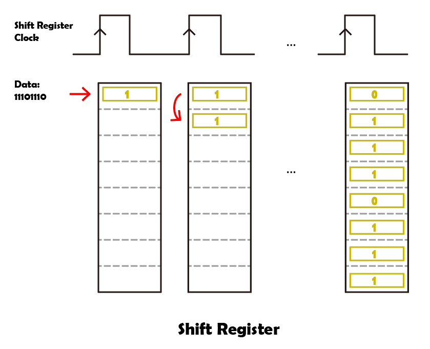

* Speicherregister

    * Wenn das Speicherregister im steigenden Flankenmodus ist, werden die Daten aus dem Schieberegister in das Speicherregister übertragen.
    * Das Speicherregister ist direkt mit den 8 Ausgangspins verbunden, Q0 ~ Q7 können ein Byte an Daten empfangen.
    * Das sogenannte Speicherregister bedeutet, dass die Daten in diesem Register verbleiben und nicht mit einem Ausgang verloren gehen.
    * Die Daten bleiben gültig und unverändert, solange der 74HC595 kontinuierlich mit Strom versorgt wird.
    * Wenn neue Daten kommen, werden die vorhandenen Daten im Speicherregister überschrieben und aktualisiert.

.. image:: img/24_74hc595_storage.png
    :width: 600
    :align: center

Den Schaltkreis aufbauen
-----------------------------

**Benötigte Komponenten**

.. list-table:: 
   :widths: 25 25 25 25
   :header-rows: 0

   * - 1 * Arduino Uno R3
     - 8 * LEDs
     - 8 * 220Ω-Widerstände
     - 1 * 74HC595
   * - |list_uno_r3| 
     - |list_red_led| 
     - |list_220ohm| 
     - |list_74hc595|  
   * - 1 * Steckbrett
     - Jumper-Kabel
     - 1 * USB-Kabel
     -
   * - |list_breadboard| 
     - |list_wire| 
     - |list_usb_cable| 
     -

**Schritt-für-Schritt-Anleitung**

Folge dem Schaltplan oder den unten aufgeführten Schritten, um deine Schaltung aufzubauen.

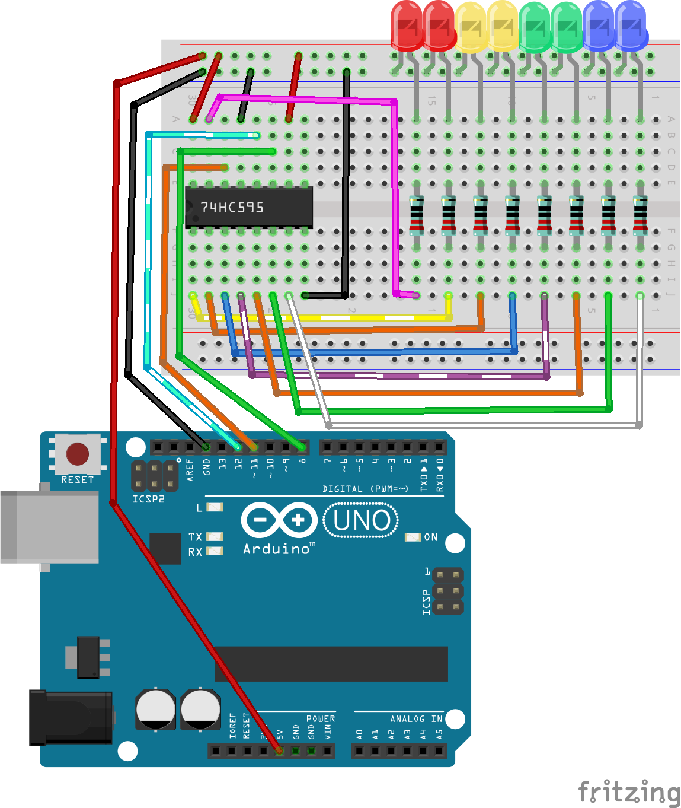

1. Setze 8 LEDs in das Steckbrett, in einer Farbkonfiguration deiner Wahl. Achte darauf, dass alle Kathoden (kurze Beine) der LEDs mit der Masse-Schiene des Steckbretts verbunden sind, während die Anoden in separaten Reihen verbunden werden.

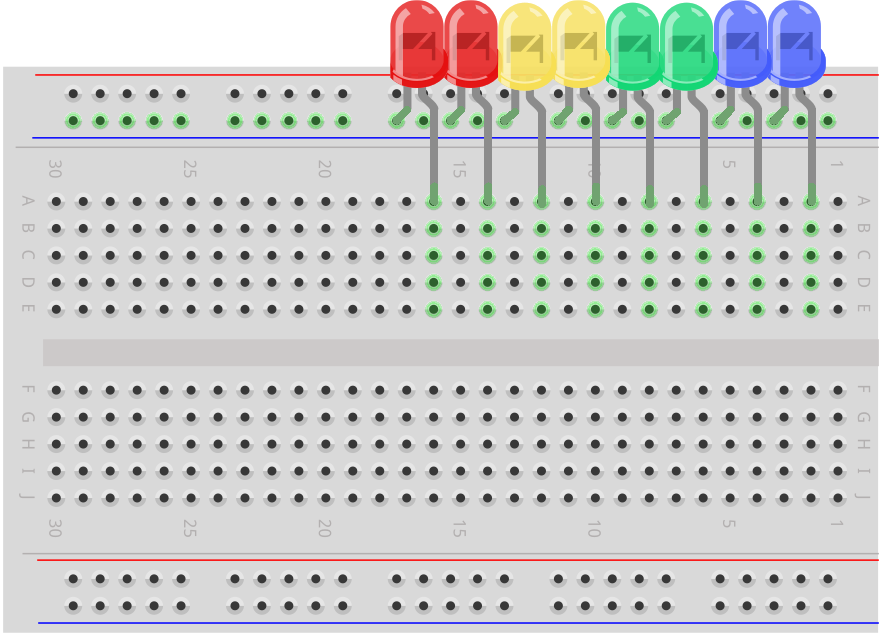

2. Verbinde jeden Anodenanschluss der LEDs mit einem 220Ω-Widerstand.

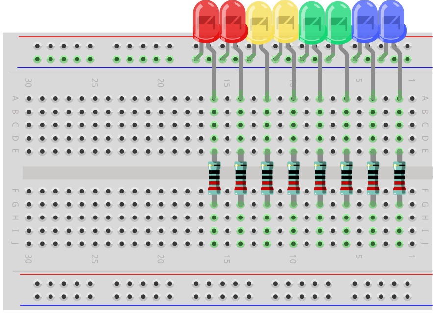

3. Finde den 74HC595-Chip und setze ihn in das Steckbrett. Achte darauf, dass der Chip die Mittelreihe des Steckbretts überspannt.

.. note::

    Achte genau auf die Ausrichtung des 74HC595, um Schäden zu vermeiden. Du kannst die richtige Ausrichtung anhand folgender Merkmale erkennen:

    * Die Beschriftung auf dem Chip ist lesbar.
    * Die Kerbe des Chips zeigt nach links.

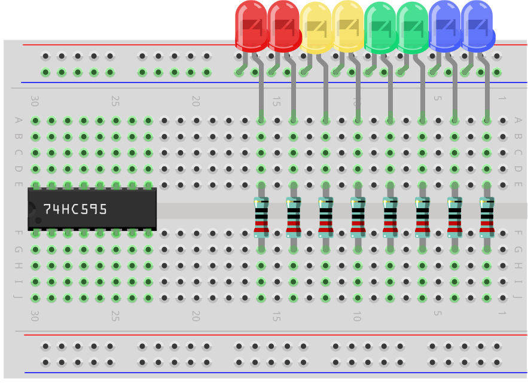

4. Verbinde die VCC- und MR-Pins des 74HC595 mit der positiven Schiene des Steckbretts.

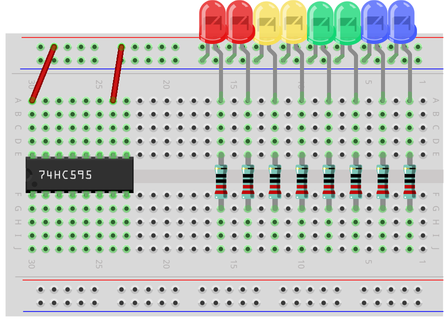

5. Verbinde die CE- und GND-Pins des 74HC595 mit der negativen Schiene des Steckbretts.

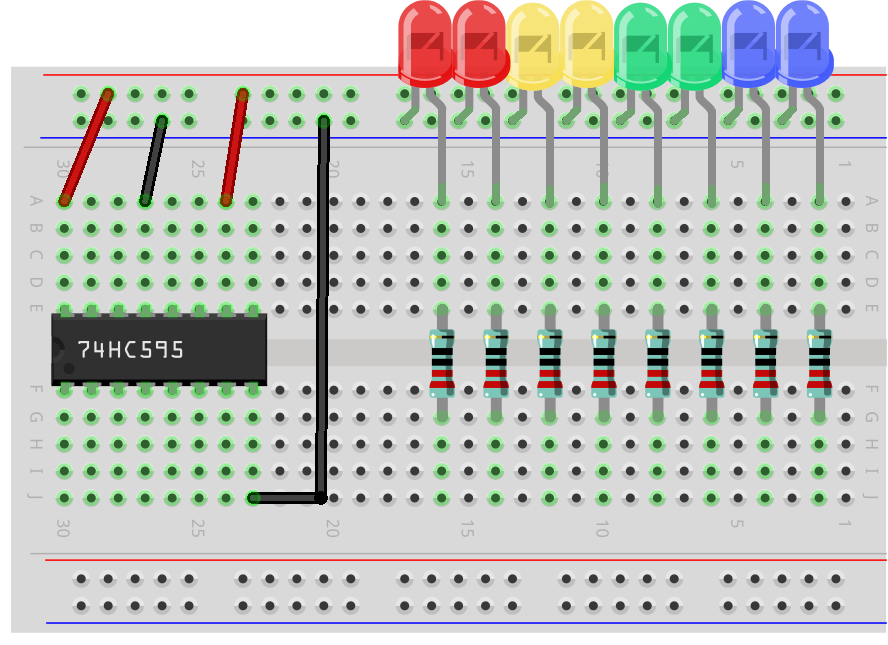

6. Verbinde die Q0-Q7-Pins des 74HC595 mit den Reihen auf dem Steckbrett, die die 220Ω-Widerstände enthalten.

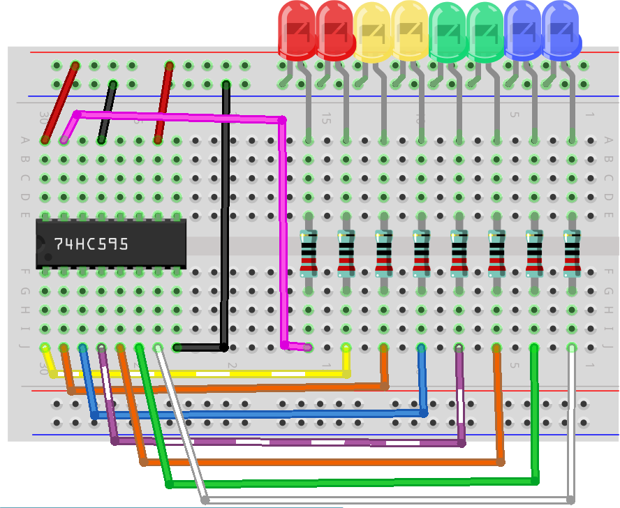

7. Verbinde den DS-Pin des 74HC595 mit Pin 11 des Arduino Uno R3.

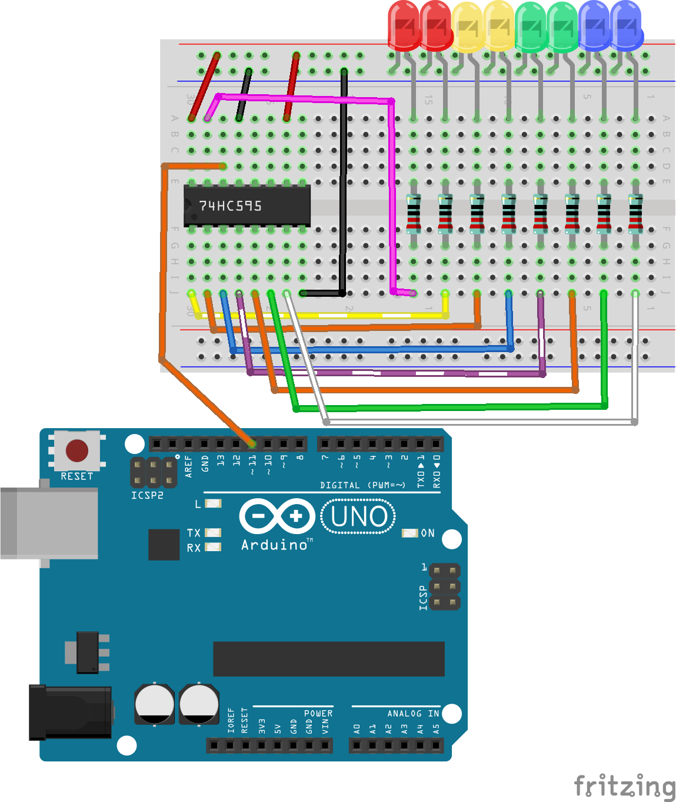

8. Verbinde den ST_CP-Pin des 74HC595 mit Pin 12 des Arduino Uno R3.

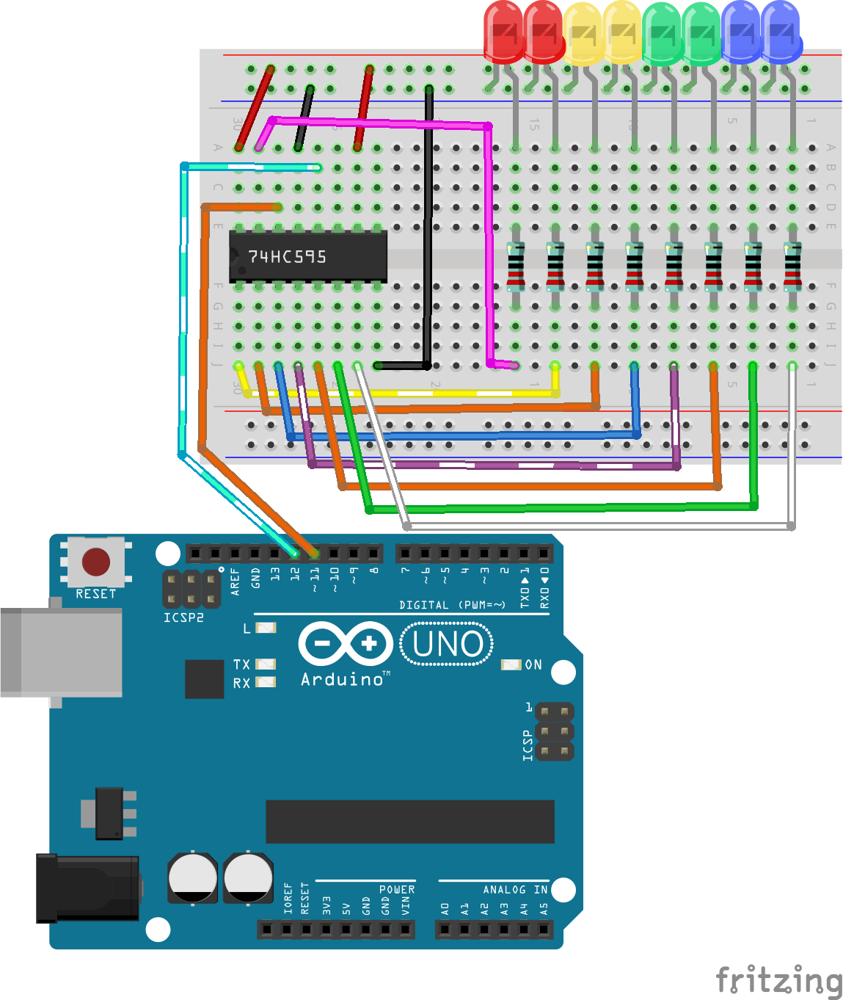

9. Verbinde den Sh_CP-Pin des 74HC595 mit Pin 8 des Arduino Uno R3.

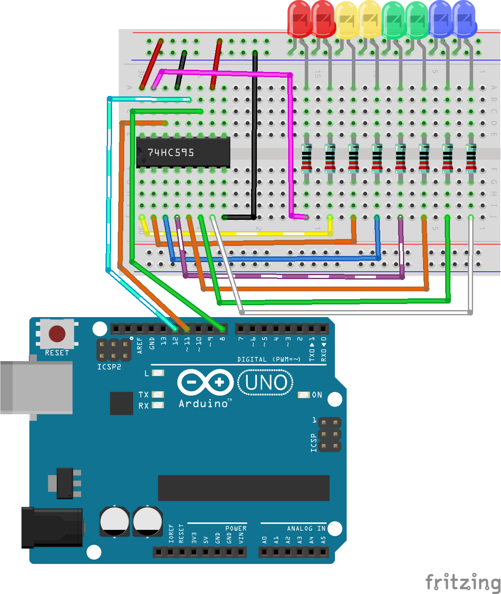

10. Schließlich verbindest du die GND- und 5V-Pins des Arduino Uno R3 mit der negativen bzw. positiven Schiene des Steckbretts.

11. Die folgende Tabelle zeigt die Pinverbindungen zwischen dem 74HC595 und dem Arduino Uno R3.

.. list-table::
    :widths: 20 20
    :header-rows: 1

    *   - 74HC595
        - Arduino UNO R3
    *   - VCC
        - 5V
    *   - Q0~Q7
        - LEDs 
    *   - DS
        - 11
    *   - CE
        - GND
    *   - ST_CP
        - 12
    *   - SH_CP
        - 8
    *   - MR
        - 5V
    *   - GND
        - GND

Code-Erstellung - LEDs einschalten
--------------------------------------------

Das Arduino Uno R3 sendet Gruppen von Binärdaten an den 74HC595-Chip.
Binärdaten bilden den Kern von Computern und vielen elektronischen Geräten, wobei einfache 0en und 1en verwendet werden, um komplexe Daten und Anweisungen zu verarbeiten.
In der Informatik und digitalen Elektronik sind Binärdaten von entscheidender Bedeutung, da sie die Grundlage für die Informationsverarbeitung und Speicherung in elektronischen Computern bilden.
Hier können 0 und 1 als Zustände eines Schalters betrachtet werden, wobei 0 für aus (geschlossen) und 1 für an (offen) steht.

Für Binärzahlen musst du zwei grundlegende Konzepte verstehen:

* Bit: Ein Bit ist die kleinste Einheit im Binärsystem, und jedes Bit kann entweder 0 oder 1 sein.
* Byte: Ein Byte besteht aus 8 Bits. Es ist eine gängige Einheit der Datenverarbeitung in Computern. (Und siehe da, der 74HC595-Chip nimmt genau 1 Byte an Daten auf einmal an!)

Binärzahlen werden vom niedrigstwertigen zum höchstwertigen Bit geordnet, wobei das rechte Bit das niedrigstwertige und das linke Bit das höchstwertige ist.

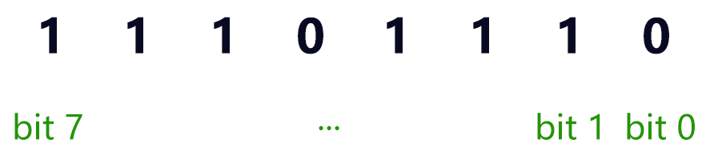

Sehen wir uns jetzt an, wie der 74HC595 Binärdaten empfängt und diese an die LEDs ausgibt!

1. Öffne die Arduino IDE und starte ein neues Projekt, indem du im Menü „Datei“ „Neue Skizze“ auswählst.
2. Speichere die Skizze als ``Lesson24_Lighting_up_LEDs`` mit ``Strg + S`` oder indem du auf „Speichern“ klickst.

3. Zum Steuern des 74HC595 sind nur drei Pins erforderlich, die Pulssignale liefern, daher lege sie als OUTPUT fest.

.. code-block:: Arduino

    const int STcp = 12;  // Pin, der mit ST_CP des 74HC595 verbunden ist
    const int SHcp = 8;   // Pin, der mit SH_CP des 74HC595 verbunden ist
    const int DS = 11;    // Pin, der mit DS des 74HC595 verbunden ist

    void setup() {
        // Setze die Pins auf Ausgangsmodus
        pinMode(STcp, OUTPUT);
        pinMode(SHcp, OUTPUT);
        pinMode(DS, OUTPUT);
    }

4. Dein Computer sendet Binärdaten an den ``DS`` (Daten-Eingang) Pin des 74HC595 und verwendet dann das Taktsignal vom ``SH_CP`` (Schieberegister-Takt-Eingang) Pin, um jedes Datenbit vorwärts zu schieben. Dieser Datenübertragungsprozess kann mit der Funktion ``shiftOut()`` implementiert werden.

    * ``shiftOut(dataPin, clockPin, bitOrder, value)``: Gibt ein Byte Daten ein Bit nach dem anderen aus. Beginnt entweder beim höchstwertigen (MSB) oder niedrigstwertigen (LSB) Bit. Jedes Bit wird nacheinander an einen Daten-Pin geschrieben, danach wird ein Takt-Pin gepulst (erst auf HIGH, dann auf LOW), um anzuzeigen, dass das Bit verfügbar ist.

    **Parameter**

        * ``dataPin``: Der Pin, an dem jedes Bit ausgegeben wird. Datentyp: int.
        * ``clockPin``: Der Pin, der umgeschaltet wird, sobald der dataPin den richtigen Wert hat. Datentyp: int.
        * ``bitOrder``: Die Reihenfolge, in der die Bits ausgegeben werden sollen; entweder ``MSBFIRST`` oder ``LSBFIRST``. (Höchstwertiges Bit zuerst oder niedrigstwertiges Bit zuerst).
        * ``value``: Die auszugebenden Daten. Datentyp: byte.

    **Rückgabewert**
        Keiner

5. Hier versuchen wir, ein Byte (8 Bits) an das Schieberegister des 74HC595 mit der Funktion ``shiftOut()`` zu senden.

.. code-block:: Arduino
    :emphasize-lines: 3

    void loop()
    {
        shiftOut(DS, SHcp, MSBFIRST, B11101110);  // Schiebe die Daten raus, MSB zuerst
    }

* Dies sendet die Daten ``B11101110`` (binär, B steht für binär) an das Schieberegister des 74HC595, wobei die Daten mit dem höchstwertigen Bit beginnen.
* Jedes Mal, wenn der ``SH_CP`` Pin ein steigendes Flankensignal (der Moment, in dem die Spannung von niedrig auf hoch geht) empfängt, werden die Bits im Schieberegister um eine Position verschoben.
* Zum Beispiel nimmt Bit 7 den vorherigen Wert von Bit 6 an, Bit 6 erhält den Wert von Bit 5 usw.

6. Nachdem alle Datenbits über den DS-Pin eingegeben und mit mehreren Taktsignalen an die richtigen Positionen verschoben wurden, besteht der nächste Schritt darin, diese Daten vom Schieberegister in ein Speicherregister zu kopieren.

.. code-block:: Arduino
    :emphasize-lines: 2,7

    void loop() {
        digitalWrite(STcp, LOW);  // Setze ST_CP (Latch-Pin) auf LOW und halte es niedrig während der Datenübertragung
        
        // Sende Daten an das Schieberegister mit MSBFIRST (höchstwertiges Bit zuerst)
        shiftOut(DS, SHcp, MSBFIRST, B11101110);
        
        digitalWrite(STcp, HIGH);  // Setze ST_CP (Latch-Pin) auf HIGH, um die Daten in den Ausgabepins zu speichern
        
        delay(1000);  // Warte eine Sekunde, bevor der Vorgang wiederholt wird
    }

* Wenn der ``ST_CP`` Pin ein steigendes Flankensignal empfängt, werden die Daten im Schieberegister in das Speicherregister kopiert.
* Sobald die Daten in das Speicherregister kopiert wurden, leuchten die LEDs, die mit den entsprechenden Ausgangspins (Q0 ~ Q7) verbunden sind, oder bleiben aus, je nachdem, ob die Daten 1 oder 0 sind.

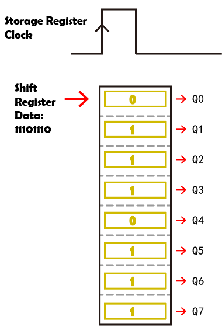

7. Hier ist dein vollständiger Code. Du kannst diesen Code nun auf das Arduino Uno R3 hochladen. Danach wirst du sehen, dass die LEDs, die mit Q0 und Q4 verbunden sind, ausgeschaltet bleiben, während die anderen LEDs leuchten.

.. code-block:: Arduino

    const int STcp = 12;  // Pin, der mit ST_CP des 74HC595 verbunden ist
    const int SHcp = 8;   // Pin, der mit SH_CP des 74HC595 verbunden ist
    const int DS = 11;    // Pin, der mit DS des 74HC595 verbunden ist

    void setup() {
        // Setze die Pins auf Ausgangsmodus
        pinMode(STcp, OUTPUT);
        pinMode(SHcp, OUTPUT);
        pinMode(DS, OUTPUT);
    }

    void loop() {
        digitalWrite(STcp, LOW);  // Setze ST_CP auf LOW und halte es niedrig während der Übertragung
        shiftOut(DS, SHcp, MSBFIRST, B11101110);  // Schiebe die Daten raus, MSB zuerst
        digitalWrite(STcp, HIGH);  // Setze ST_CP auf HIGH, um die Daten zu speichern
        delay(1000);  // Warte eine Sekunde
    }

**Frage**

Was passiert, wenn wir ``MSBFIRST`` in ``LSBFIRST`` in ``shiftOut(DS, SHcp, MSBFIRST, B11101110);`` ändern? Warum?

Code-Erstellung - Lauflicht
--------------------------------

Wie können wir einen Lauflichteffekt umsetzen, bei dem die LEDs nacheinander aufleuchten?

1. Öffne die zuvor gespeicherte Skizze ``Lesson24_Lighting_up_LEDs``.

2. Klicke auf „Speichern unter...“ im Menü „Datei“ und benenne die Datei in ``Lesson24_Flowing_Light`` um. Klicke auf „Speichern“.

3. Wir möchten ein Lauflicht einrichten, bei dem die LEDs nacheinander aufleuchten. Wir schreiben die Ein-/Aus-Zustände dieser Lauflichtsequenz als Array.

.. code-block:: Arduino
    :emphasize-lines: 4

    const int STcp = 12;  // Pin, der mit ST_CP des 74HC595 verbunden ist
    const int SHcp = 8;   // Pin, der mit SH_CP des 74HC595 verbunden ist
    const int DS = 11;    // Pin, der mit DS des 74HC595 verbunden ist
    int datArray[] = {B00000000, B00000001, B00000011, B00000111, B00001111, B00011111, B00111111, B01111111, B11111111};

4. Verwende dann eine ``for``-Schleife, um dieses Array der Reihe nach aufzurufen.

.. code-block:: Arduino
    :emphasize-lines: 3,5

    void loop()
    {
        for (int num = 0; num <= 8; num++) {
            digitalWrite(STcp, LOW);                      // Setze ST_CP auf LOW und halte es niedrig während der Übertragung
            shiftOut(DS, SHcp, MSBFIRST, datArray[num]);  // Schiebe die Daten raus, MSB zuerst
            digitalWrite(STcp, HIGH);                     // Setze ST_CP auf HIGH, um die Daten zu speichern
            delay(1000);                                  // Warte eine Sekunde
        }
    }

5. Hier ist dein vollständiger Code. Du kannst diesen nun auf das Arduino Uno R3 hochladen. Danach siehst du, wie die LEDs nacheinander aufleuchten, wie ein Lauflicht.

.. code-block:: Arduino

    const int STcp = 12;  // Pin, der mit ST_CP des 74HC595 verbunden ist
    const int SHcp = 8;   // Pin, der mit SH_CP des 74HC595 verbunden ist
    const int DS = 11;    // Pin, der mit DS des 74HC595 verbunden ist
    int datArray[] = {B00000000, B00000001, B00000011, B00000111, B00001111, B00011111, B00111111, B01111111, B11111111};

    void setup ()
    {
        // Setze die Pins auf Ausgangsmodus
        pinMode(STcp, OUTPUT);
        pinMode(SHcp, OUTPUT);
        pinMode(DS, OUTPUT);
    }

    void loop()
    {
        for (int num = 0; num <= 8; num++) {
            digitalWrite(STcp, LOW);                      // Setze ST_CP auf LOW und halte es niedrig während der Übertragung
            shiftOut(DS, SHcp, MSBFIRST, datArray[num]);  // Schiebe die Daten raus, MSB zuerst
            digitalWrite(STcp, HIGH);                     // Setze ST_CP auf HIGH, um die Daten zu speichern
            delay(1000);                                  // Warte eine Sekunde
        }
    }

6. Vergiss nicht, deinen Code zu speichern und deinen Arbeitsplatz aufzuräumen.

**Frage**

Wenn wir möchten, dass immer drei LEDs gleichzeitig leuchten und sie „fließen“, wie sollten die Elemente des Arrays ``datArray[]`` geändert werden?

**Zusammenfassung**

In dieser Lektion haben wir die Struktur und Funktionalität des 74HC595-Chips untersucht und gelernt, wie man Binärdaten durch das Schieberegister schiebt und ein Lauflichtexperiment aufbaut. Mithilfe der Funktion ``shiftOut()``, um die Übertragung von Binärdaten zu steuern, haben wir es erfolgreich geschafft, das sequenzielle Aufleuchten von 8 LEDs zu verwalten, um einen Lauflichteffekt zu erzielen. Mit diesem neu erworbenen Wissen solltest du nun in der Lage sein, den 74HC595-Chip effektiv zu nutzen, um beeindruckende Lichteffekte in deinen eigenen Projekten zu realisieren.
