.. note::

    Bonjour, bienvenue dans la communauté SunFounder Raspberry Pi & Arduino & ESP32 Enthusiasts sur Facebook ! Plongez plus profondément dans Raspberry Pi, Arduino et ESP32 avec d'autres passionnés.

    **Pourquoi nous rejoindre ?**

    - **Support d'experts** : Résolvez les problèmes après-vente et les défis techniques avec l'aide de notre communauté et de notre équipe.
    - **Apprendre & Partager** : Échangez des astuces et des tutoriels pour améliorer vos compétences.
    - **Aperçus exclusifs** : Accédez en avant-première aux nouvelles annonces de produits et aux aperçus exclusifs.
    - **Réductions spéciales** : Profitez de réductions exclusives sur nos nouveaux produits.
    - **Promotions festives et cadeaux** : Participez à des concours et à des promotions spéciales lors des fêtes.

    👉 Prêt à explorer et à créer avec nous ? Cliquez sur [|link_sf_facebook|] et rejoignez-nous dès aujourd'hui !

25. Afficher un chiffre avec le 74HC595
===========================================

Dans la leçon précédente, vous avez peut-être remarqué que le 74HC595 et l'afficheur 7 segments forment un duo parfait. Le 74HC595 peut simultanément produire des signaux sur 8 bits, tandis que l'afficheur 7 segments est contrôlé par 8 signaux électriques (y compris le segment LED du point décimal, appelé segment dp).

Alors, le 74HC595 peut-il être utilisé pour contrôler l'afficheur 7 segments ? La réponse est oui.

Dans cette leçon, nous allons utiliser le 74HC595 pour contrôler l'afficheur 7 segments et afficher différents chiffres.

.. raw:: html

    <video muted controls style = "max-width:90%">
        <source src="_static/video/25_show_number.mp4" type="video/mp4">
        Your browser does not support the video tag.
    </video>

Dans cette leçon, vous apprendrez à :

* Comprendre comment utiliser le registre à décalage 74HC595 pour piloter un afficheur 7 segments.
* Apprendre les représentations binaires des chiffres de 0 à 9 et comment les convertir en formats décimal et hexadécimal.
* Comprendre comment utiliser le Moniteur Série pour saisir des données et les afficher sur l'afficheur 7 segments.

Construction du circuit
--------------------------

**Composants nécessaires**

.. list-table:: 
   :widths: 25 25 25 25
   :header-rows: 0

   * - 1 * Arduino Uno R3
     - 1 * Afficheur 7 segments
     - 1 * Résistance de 220Ω
     - 1 * 74HC595
   * - |list_uno_r3| 
     - |list_7segment| 
     - |list_220ohm| 
     - |list_74hc595| 
   * - 1 * Plaque d'expérimentation
     - Câbles de raccordement
     - 1 * Câble USB
     - 
   * - |list_breadboard| 
     - |list_wire| 
     - |list_usb_cable| 
     - 

**Étapes de montage**

Suivez le schéma de câblage ou les étapes ci-dessous pour monter votre circuit.

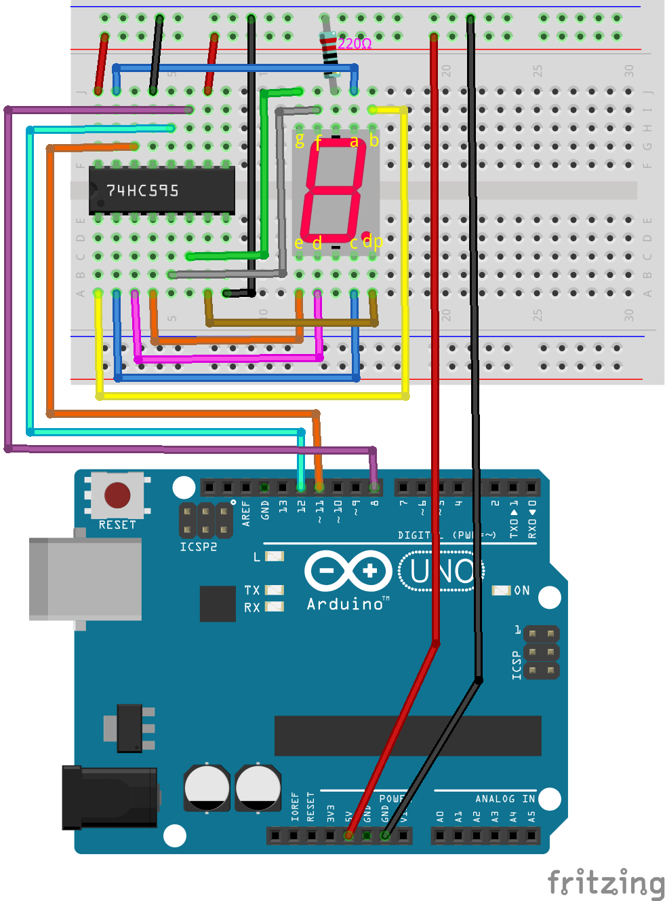

1. Insérez l'afficheur 7 segments dans la plaque d'expérimentation avec le point décimal situé dans le coin inférieur droit.

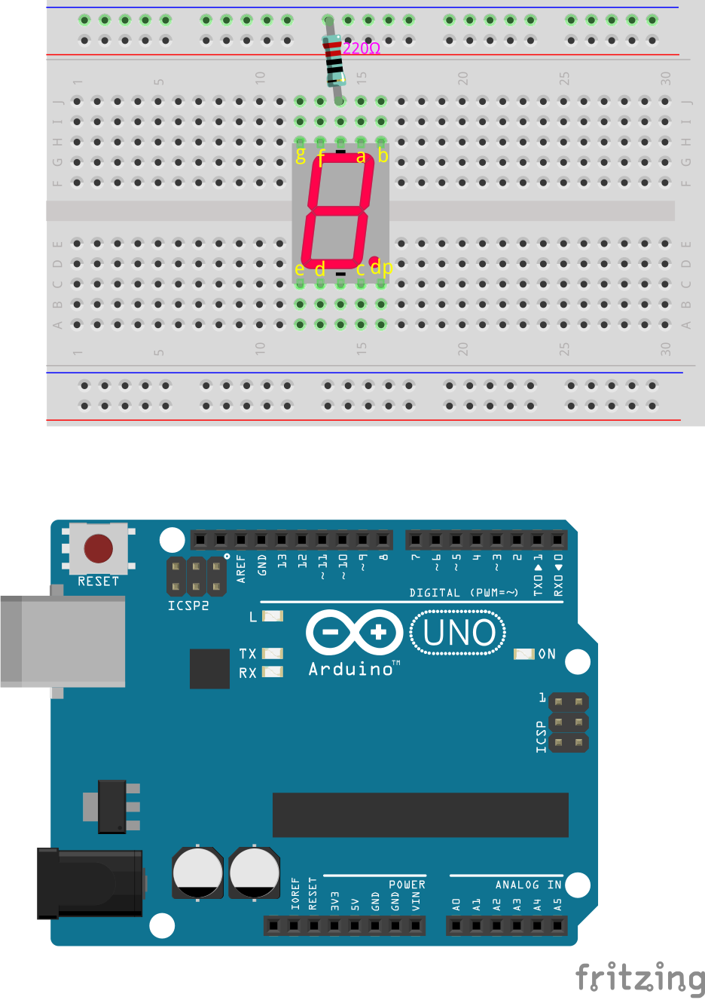

2. Connectez la borne négative (-) de l'afficheur 7 segments au rail de masse de la plaque d'expérimentation à l'aide d'un câble de raccordement.

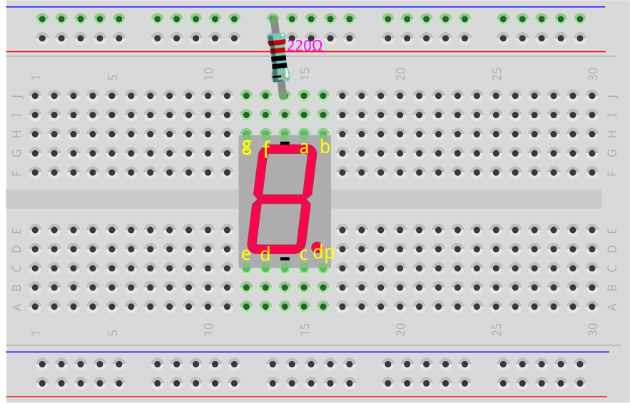

3. Localisez la puce 74HC595 et insérez-la dans la plaque d'expérimentation. Assurez-vous que la puce traverse le milieu de la plaque.

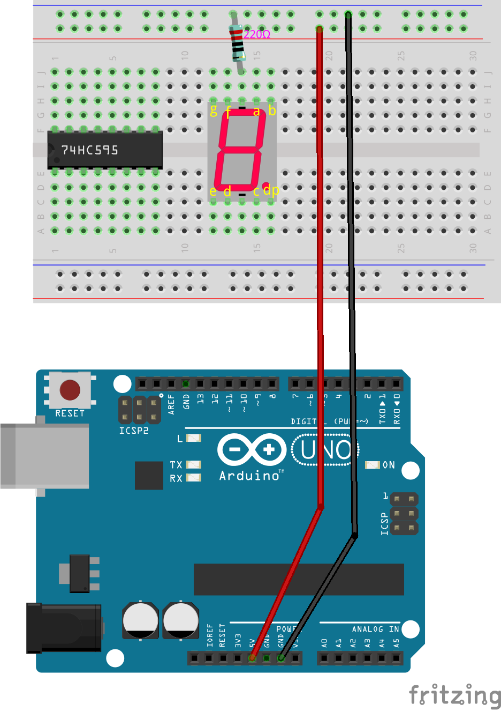

4. Connectez les broches VCC et MR du 74HC595 au rail positif de la plaque d'expérimentation.

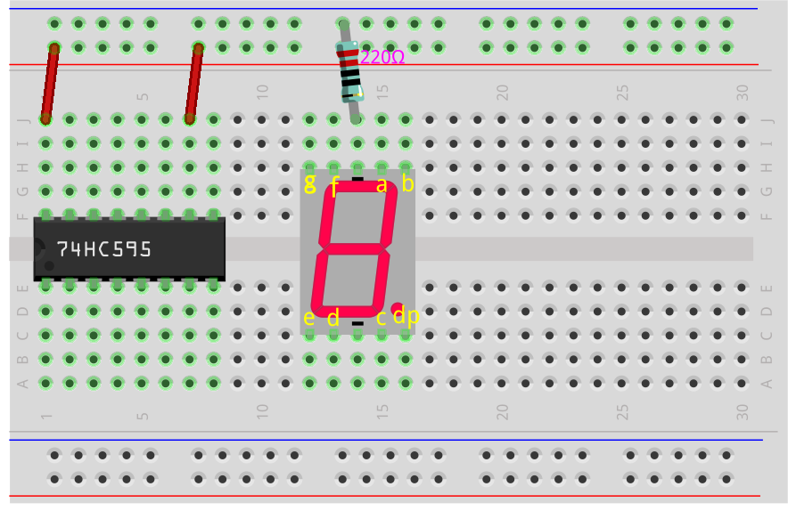

5. Connectez les broches CE et GND du 74HC595 au rail négatif de la plaque d'expérimentation.

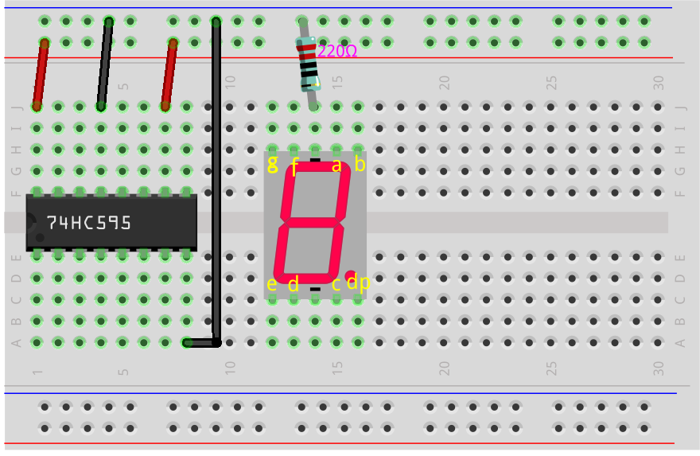

6. Connectez la broche Q0 du 74HC595 à la broche 'a' de l'afficheur 7 segments, Q1 à la broche 'b', Q2 à la broche 'c', Q3 à la broche 'd', et Q4 à la broche 'e'.

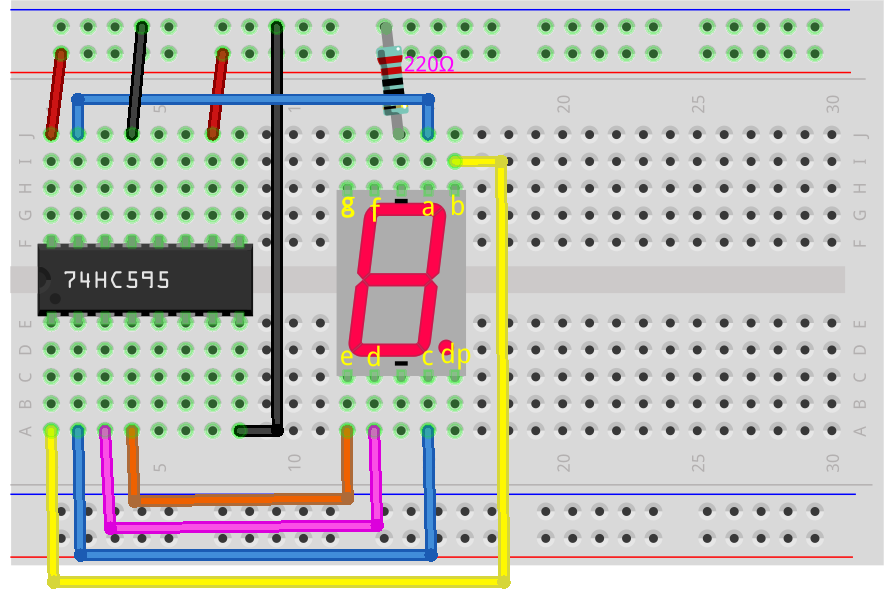

7. Connectez la broche Q5 du 74HC595 à la broche 'f' de l'afficheur 7 segments, Q6 à la broche 'g', et Q7 à la broche 'dp'.

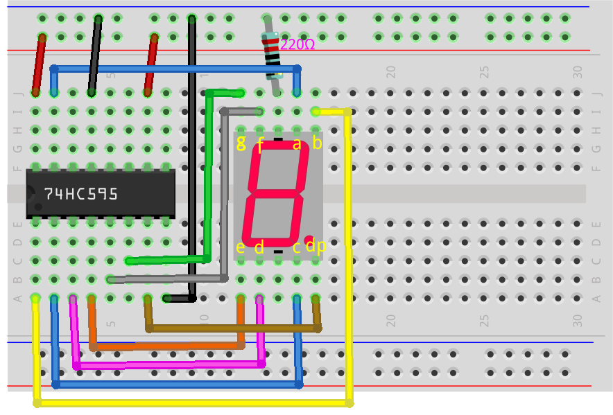

8. Connectez la broche DS du 74HC595 à la broche 11 de l'Arduino Uno R3.

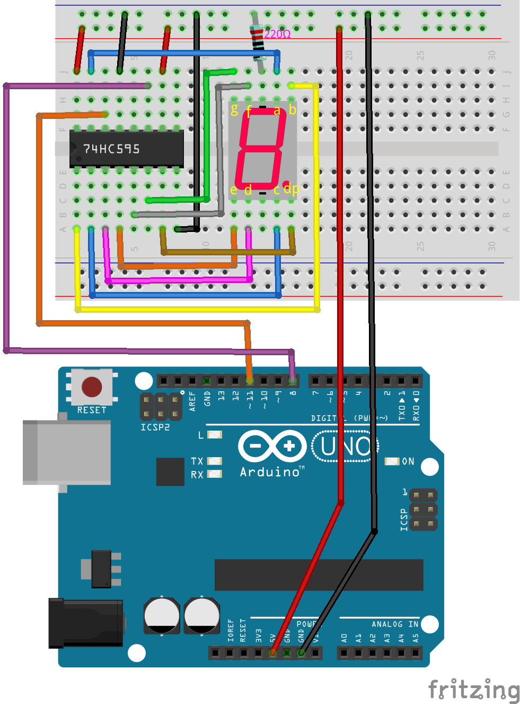

9. Connectez la broche ST_CP du 74HC595 à la broche 12 de l'Arduino Uno R3.

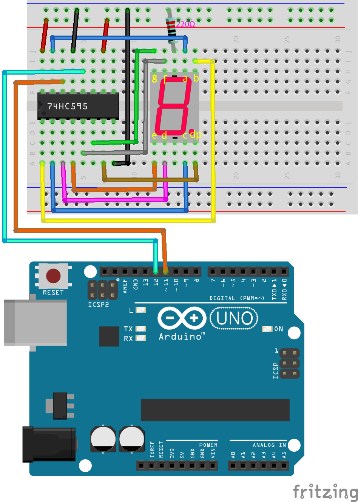

10. Connectez la broche SH_CP du 74HC595 à la broche 8 de l'Arduino Uno R3.

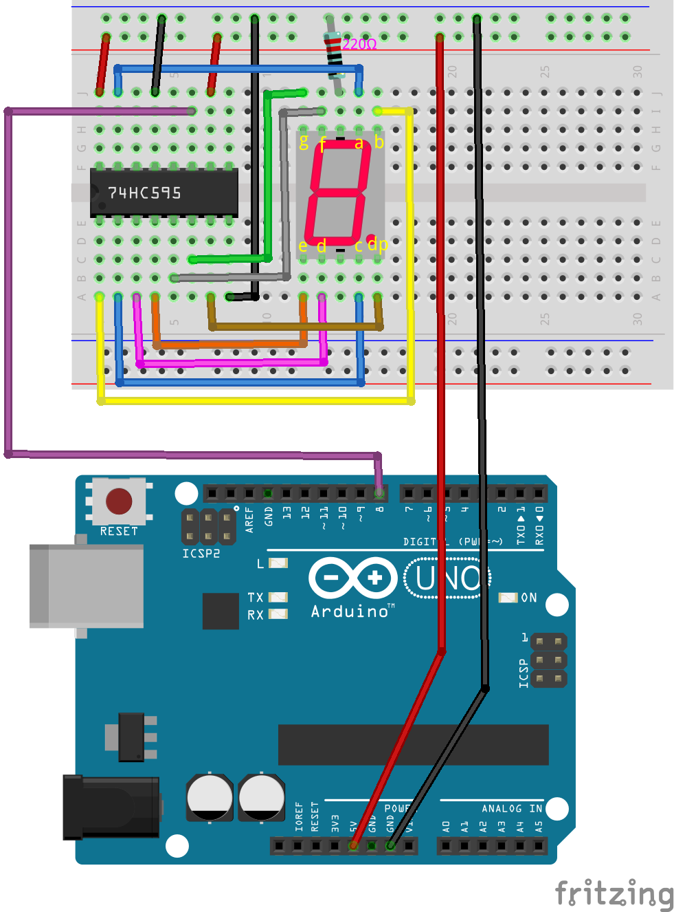

11. Enfin, connectez les broches GND et 5V de l'Arduino Uno R3 aux rails négatif et positif de la plaque d'expérimentation, respectivement.

12. Le tableau suivant montre les connexions des broches entre le 74HC595, l'Arduino Uno R3 et l'afficheur 7 segments.

.. list-table::
    :widths: 20 20
    :header-rows: 1

    *   - 74HC595
        - Arduino UNO R3
    *   - VCC
        - 5V
    *   - DS
        - 11
    *   - CE
        - GND
    *   - ST_CP
        - 12
    *   - SH_CP
        - 8
    *   - MR
        - 5V
    *   - GND
        - GND

.. list-table::
    :widths: 20 20
    :header-rows: 1

    *   - 74HC595
        - 7-segment Display
    *   - Q0
        - a
    *   - Q1
        - b
    *   - Q2
        - c
    *   - Q3
        - d
    *   - Q4
        - e
    *   - Q5
        - f
    *   - Q6
        - g
    *   - Q7
        - dp

Nombres binaires pour les chiffres de 0 à 9
----------------------------------------------

Dans ce projet, nous utilisons le registre à décalage 74HC595 pour piloter l'afficheur 7 segments et afficher différents chiffres. Cependant, le 74HC595 reçoit des nombres binaires. Avant de programmer, nous devons connaître les nombres binaires correspondants aux chiffres de 0 à 9.

Supposons que nous souhaitions afficher le chiffre 2 sur l'afficheur 7 segments, nous devons éteindre les segments f et c, et allumer les autres segments.

.. image:: img/23_segment_2.png
    :align: center
    :width: 200

Selon le schéma de câblage, les broches de sortie Q0 à Q7 du 74HC595 correspondent aux broches respectives de l'afficheur 7 segments, comme indiqué dans le diagramme. En binaire, 0 représente éteint (fermé) et 1 représente allumé (ouvert). Pour afficher le chiffre 2, dp, f et c doivent être 0, tandis que les autres segments doivent être 1, ce qui donne le nombre binaire ``B01011011``.

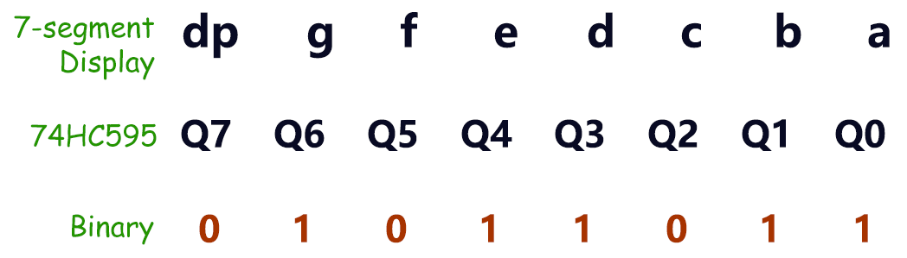

.. note::

    Lorsque vous avez un seul afficheur 7 segments, la broche DP est toujours réglée à 0. Si vous avez plusieurs afficheurs 7 segments en configuration en chaîne, vous pouvez utiliser la broche DP pour indiquer le point décimal.

Pour afficher le chiffre 0, dp et g doivent être 0, et tous les autres segments doivent être 1, ce qui donne le nombre binaire ``B00111111``.

**Question**

Maintenant que nous connaissons les représentations binaires des chiffres 0 et 2, veuillez remplir les nombres binaires des autres chiffres dans le tableau ci-dessous.

.. list-table::
    :widths: 20 20
    :header-rows: 1

    *   - Chiffre
        - Binaire
    *   - 0
        - B00111111
    *   - 1
        -
    *   - 2
        - B01011011
    *   - 3
        -
    *   - 4
        -
    *   - 5
        -
    *   - 6
        -
    *   - 7
        -
    *   - 8
        -
    *   - 9
        -         

Création du code - Affichage des chiffres
---------------------------------------------
1. Ouvrez le sketch que vous avez enregistré précédemment, ``Lesson24_Flowing_Light``. 

2. Cliquez sur “Enregistrer sous...” dans le menu “Fichier” et renommez-le en ``Lesson25_Show_Number_Binary``. Cliquez sur "Enregistrer".

3. Modifiez le tableau ``datArray[]`` pour afficher les nombres binaires correspondant aux chiffres de 0 à 9.

.. code-block:: Arduino
    :emphasize-lines: 5

    const int STcp = 12;  //Broche connectée à ST_CP du 74HC595
    const int SHcp = 8;   //Broche connectée à SH_CP du 74HC595
    const int DS = 11;    //Broche connectée à DS du 74HC595
    //afficher 0,1,2,3,4,5,6,7,8,9
    int datArray[] = { B00111111, B00000110, B01011011, B01001111, B01100110, B01101101, B01111101, B00000111, B01111111, B01101111 };

4. Comme le tableau ``datArray[]`` contient 10 éléments, modifiez la plage de la variable ``num`` à ``num <= 9``.

.. code-block:: Arduino
    :emphasize-lines: 2

    void loop() {
        for (int num = 0; num <= 9; num++) {
            digitalWrite(STcp, LOW);                      // Met ST_CP à la masse et maintient bas pendant la transmission
            shiftOut(DS, SHcp, MSBFIRST, datArray[num]);  // Envoie les données, MSB en premier
            digitalWrite(STcp, HIGH);                     // Met ST_CP à HIGH pour sauvegarder les données
            delay(1000);                                  // Attend une seconde
        }
    }

5. Votre code complet devrait ressembler à ce qui suit. À ce stade, vous pouvez télécharger le code sur l'Arduino Uno R3, et vous verrez l'afficheur 7 segments défiler les chiffres de 0 à 9.

.. code-block:: Arduino

    const int STcp = 12;  // Broche connectée à ST_CP du 74HC595
    const int SHcp = 8;   // Broche connectée à SH_CP du 74HC595
    const int DS = 11;    // Broche connectée à DS du 74HC595
    // afficher 0,1,2,3,4,5,6,7,8,9
    int datArray[] = { B00111111, B00000110, B01011011, B01001111, B01100110, B01101101, B01111101, B00000111, B01111111, B01101111 };

    void setup() {
        // configure les broches en sortie
        pinMode(STcp, OUTPUT);
        pinMode(SHcp, OUTPUT);
        pinMode(DS, OUTPUT);
    }

    void loop() {
        for (int num = 0; num <= 9; num++) {
            digitalWrite(STcp, LOW);                      // Met ST_CP à la masse et maintient bas pendant la transmission
            shiftOut(DS, SHcp, MSBFIRST, datArray[num]);  // Envoie les données, MSB en premier
            digitalWrite(STcp, HIGH);                     // Met ST_CP à HIGH pour sauvegarder les données
            delay(1000);                                  // Attend une seconde
        }
    }

Conversion binaire
----------------------

Dans les applications pratiques, écrire des nombres binaires peut exprimer plus clairement l'état de chaque bit dans les données. Cependant, pour une représentation numérique générale, écrire des nombres décimaux est plus pratique.

.. note::

    L'écriture de nombres binaires, décimaux ou même hexadécimaux n'affecte pas le résultat du programme mais uniquement la lisibilité du code. Par exemple, écrire le nombre décimal ``91`` sera converti en interne en forme binaire ``B01011011``.

Voyons comment convertir des nombres binaires en décimaux.

**Conversion en décimal**

Dans le système binaire, chaque bit représente une valeur de position correspondante. La valeur de position est une puissance de 2, comme 2^0, 2^1, 2^2, etc. En multipliant chaque bit par sa valeur de position correspondante et en additionnant tous les résultats, nous obtenons le nombre décimal.

Par exemple, le nombre binaire ``B01011011`` se convertit en nombre décimal 91.

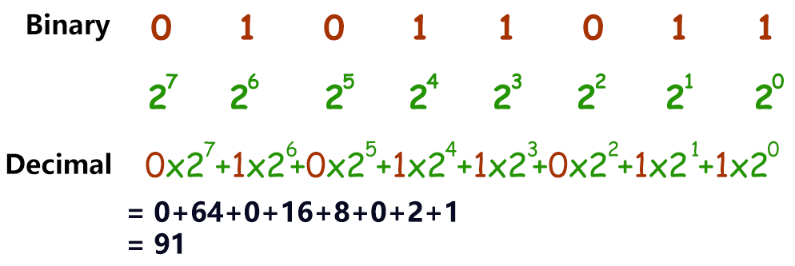

**Utiliser une calculatrice**

Dans les applications pratiques, vous pouvez utiliser la calculatrice de votre ordinateur. Passez en mode programmeur et vous pourrez facilement convertir entre les systèmes binaire, décimal et hexadécimal.

Recherchez "Calculatrice" sur votre ordinateur, puis passez en mode **Programmeur**.

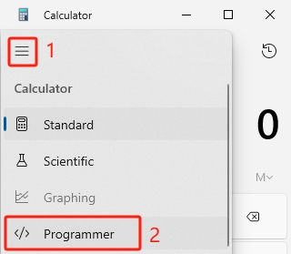

2. Si vous connaissez déjà le nombre binaire et que vous souhaitez le convertir dans une autre base, sélectionnez **BIN**.

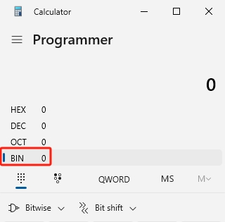

3. Maintenant, vous pouvez commencer à entrer le nombre binaire.

* Les bits significatifs en binaire se réfèrent à la plage du bit le plus significatif (bit non nul le plus à gauche) au bit le moins significatif (bit non nul le plus à droite).
* Donc, pour le nombre binaire ``B00111111``, les bits significatifs sont ``111111``.
* Maintenant, entrez ``111111`` dans la calculatrice pour obtenir les nombres décimaux et hexadécimaux correspondants.

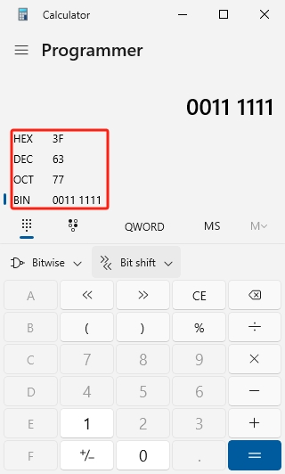

**Question**

Veuillez convertir les nombres binaires représentant les chiffres de 0 à 9 en nombres décimaux et hexadécimaux à l'aide d'une calculatrice, et remplir le tableau ci-dessous. Cela vous donnera un guide de référence rapide pour les conversions de base.

.. list-table::
    :widths: 20 40 30 30
    :header-rows: 1

    *   - Chiffre
        - Binaire
        - Décimal
        - Hexadécimal
    *   - 0
        - B00111111
        - 63
        - 0x3F
    *   - 1
        - B00000110
        -
        -
    *   - 2
        - B01011011
        -
        -
    *   - 3
        - B01001111
        -
        -
    *   - 4
        - B01100110
        -
        -
    *   - 5
        - B01101101
        -
        -
    *   - 6
        - B01111101
        -
        -
    *   - 7
        - B00000111
        -
        -
    *   - 8
        - B01111111
        -
        -
    *   - 9
        - B01101111
        -
        -

**Modifier le Croquis**

Ouvrez maintenant votre croquis ``Lesson25_Show_Number_Binary`` dans l'IDE Arduino. Cliquez sur "Fichier" -> "Enregistrer sous...", nommez le fichier ``Lesson25_Show_Number_Decimal``. Cliquez sur "Enregistrer".

Modifiez tous les éléments du tableau ``datArray[]`` en valeurs décimales, comme indiqué dans le code ci-dessous. Une fois modifié, vous pouvez téléverser le code sur l'Arduino Uno R3 pour voir l'effet.

.. code-block:: Arduino

    const int STcp = 12;  // Broche connectée à ST_CP du 74HC595
    const int SHcp = 8;   // Broche connectée à SH_CP du 74HC595
    const int DS = 11;    // Broche connectée à DS du 74HC595
    // afficher 0,1,2,3,4,5,6,7,8,9
    int datArray[] = { 63, 6, 91, 79, 102, 109, 125, 7, 127, 111 };

    void setup() {
        // configurer les broches en sortie
        pinMode(STcp, OUTPUT);
        pinMode(SHcp, OUTPUT);
        pinMode(DS, OUTPUT);
    }

    void loop() {
        for (int num = 0; num <= 9; num++) {
            digitalWrite(STcp, LOW);                      // Met ST_CP à LOW et maintient bas pendant la transmission
            shiftOut(DS, SHcp, MSBFIRST, datArray[num]);  // Transmet les données, MSB en premier
            digitalWrite(STcp, HIGH);                     // Met ST_CP à HIGH pour sauvegarder les données
            delay(1000);                                  // Attendre une seconde
        }
    }

Création du Code - Entrée Séries
-------------------------------------

Le Moniteur Série est un outil puissant fourni par l'IDE Arduino pour communiquer avec la carte Arduino. Nous l'avons utilisé pour surveiller les données envoyées par l'Arduino, comme la lecture des valeurs analogiques d'une photorésistance. Il peut également être utilisé pour envoyer des données à l'Arduino, lui permettant d'effectuer des actions basées sur les données reçues.

Dans cette activité, nous allons écrire un nombre entre 0 et 9 dans le Moniteur Série pour l'afficher sur l'afficheur 7 segments.

1. Ouvrez votre croquis ``Lesson25_Show_Number_Decimal`` dans l'IDE Arduino. Cliquez sur "Fichier" -> "Enregistrer sous...", nommez le fichier ``Lesson25_Show_Number_Serial``. Cliquez sur "Enregistrer".

2. Dans ``void setup()``, démarrez le moniteur série et réglez son débit à 9600 bauds.

.. code-block:: Arduino
    :emphasize-lines: 6

    void setup() {
        // configurer les broches en sortie
        pinMode(STcp, OUTPUT);
        pinMode(SHcp, OUTPUT);
        pinMode(DS, OUTPUT);
        Serial.begin(9600);  // Configuration de la communication série à 9600 bauds
    }

3. Lorsque vous utilisez le Moniteur Série, vous pouvez lire les données saisies via le code Arduino. Voici deux fonctions à comprendre :

* ``Serial.available()`` : Renvoie le nombre d'octets disponibles à la lecture dans le port série.
* ``Serial.read()`` : Retourne le code ASCII du caractère reçu via l'entrée série.

Utilisez une instruction ``if`` dans ``void loop()`` pour vérifier si des données ont été reçues, puis affichez-les.

.. note::

    Commentez temporairement l'instruction for dans ``void loop()`` qui affiche des caractères sur l'afficheur 7 segments pour éviter d'interférer avec le processus d'impression.

.. code-block:: Arduino
    :emphasize-lines: 2-5

    void loop() {
        if (Serial.available() > 0) {
            // Imprimer le caractère reçu du port série
            Serial.println(Serial.read());
        }

        // for (int num = 0; num <= 9; num++) {
        //   digitalWrite(STcp, LOW);                      // Met ST_CP à LOW et maintient bas pendant la transmission
        //   shiftOut(DS, SHcp, MSBFIRST, datArray[num]);  // Transmet les données, MSB en premier
        //   digitalWrite(STcp, HIGH);                     // Met ST_CP à HIGH pour sauvegarder les données
        //   delay(1000);                                  // Attendre une seconde
        // }
    }

4. Voici votre code complet. Vous pouvez maintenant téléverser le code sur l'Arduino Uno R3.

.. code-block:: Arduino

    const int STcp = 12;  // Broche connectée à ST_CP du 74HC595
    const int SHcp = 8;   // Broche connectée à SH_CP du 74HC595
    const int DS = 11;    // Broche connectée à DS du 74HC595
    // afficher 0,1,2,3,4,5,6,7,8,9
    int datArray[] = { 63, 6, 91, 79, 102, 109, 125, 7, 127, 111 };

    void setup() {
        // configurer les broches en sortie
        pinMode(STcp, OUTPUT);
        pinMode(SHcp, OUTPUT);
        pinMode(DS, OUTPUT);
        Serial.begin(9600);  // Configuration de la communication série à 9600 bauds
    }

    void loop() {
        if (Serial.available() > 0) {
            // Imprimer le caractère reçu du port série
            Serial.println(Serial.read());
        }

        // for (int num = 0; num <= 9; num++) {
        //   digitalWrite(STcp, LOW);                      // Met ST_CP à LOW et maintient bas pendant la transmission
        //   shiftOut(DS, SHcp, MSBFIRST, datArray[num]);  // Transmet les données, MSB en premier
        //   digitalWrite(STcp, HIGH);                     // Met ST_CP à HIGH pour sauvegarder les données
        //   delay(1000);                                  // Attendre une seconde
        // }
    }

5. Après téléversement, ouvrez le Moniteur Série. Dans la zone de saisie, entrez le chiffre ``0`` (ou un chiffre entre 0 et 9) et appuyez sur Entrée. Vous constaterez que la sortie Série affiche le nombre ``48``.

.. note::

    * Si "Nouvelle ligne" est sélectionné dans les options de fin de ligne du moniteur série, vous pouvez également voir un ``10``.
    * ``10`` est le code ASCII du caractère de nouvelle ligne (également appelé LF - Line Feed).

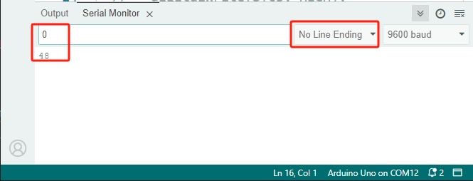

Alors, où est passé notre entrée de ``0`` ? D'où vient ce ``48`` ? Est-il possible que ``0`` soit ``48`` ?

C'est parce que le ``0`` que nous avons saisi dans le Moniteur Série est considéré comme un "caractère" et non comme un "nombre".

La transmission de caractères suit une norme de codage appelée ASCII (American Standard Code for Information Interchange).

Voici un tableau ASCII :

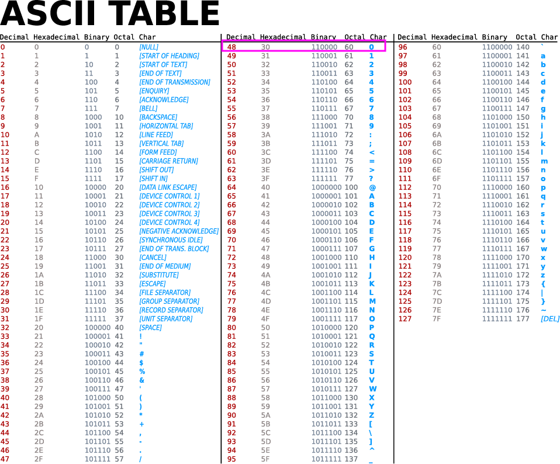

Lorsque vous tapez le caractère ``0`` dans le Moniteur Série, le code ASCII du caractère ``0`` est envoyé à l'Arduino. En ASCII, le code du caractère ``0`` est ``48`` en décimal.

6. Avant de continuer à coder, vous devez commenter le code précédent qui imprime le code ASCII pour éviter les conflits avec le code suivant.

.. code-block:: Arduino
    :emphasize-lines: 4

    void loop() {
        if (Serial.available() > 0) {
            // Imprimer le caractère reçu du port série
            // Serial.println(Serial.read());
        }

        // for (int num = 0; num <= 9; num++) {
        //   digitalWrite(STcp, LOW);                      // Mettre ST_CP à LOW et maintenir bas pendant la transmission
        //   shiftOut(DS, SHcp, MSBFIRST, datArray[num]);  // Transmettre les données, MSB en premier
        //   digitalWrite(STcp, HIGH);                     // Mettre ST_CP à HIGH pour sauvegarder les données
        //   delay(1000);                                  // Attendre une seconde
        // }
    }

7. Vous devez créer une nouvelle variable ``char`` pour stocker le caractère lu à partir du Moniteur Série.

.. code-block:: Arduino
    :emphasize-lines: 6,7

    void loop() {
        if (Serial.available() > 0) {
            // Imprimer le caractère reçu du port série
            // Serial.println(Serial.read());

            // Lire le caractère reçu du port série
            char receivedChar = Serial.read();
        }
    }

8. Convertissez maintenant le caractère en nombre. En ASCII, la valeur pour le caractère ``'0'`` est ``48``, ``'1'`` est ``49``, et ainsi de suite. En soustrayant le code ASCII de ``'0'``, nous obtenons la valeur numérique correspondante.

.. code-block:: Arduino
    :emphasize-lines: 8,9

    void loop() {
        if (Serial.available() > 0) {
            // Imprimer le caractère reçu du port série
            Serial.println(Serial.read());

            // Lire le caractère reçu du port série
            char receivedChar = Serial.read();
            // Convertir le caractère en chiffre
            int digit = receivedChar - '0';
        }
    }

9. Dans cet exemple, nous supposons que l'entrée est un caractère numérique entre ``'0'`` et ``'9'``. Nous devons donc vérifier si le caractère est dans cette plage. Ensuite, utilisez l'afficheur 7 segments pour afficher le nombre correspondant :

* Sélectionnez l'instruction ``for`` précédemment commentée et appuyez sur ``Ctrl + /`` pour la décommenter.
* Modifiez ensuite l'instruction ``for`` en une instruction ``if`` pour vérifier si le caractère d'entrée est dans la plage ``'0'`` à ``'9'``. Si c'est le cas, laissez l'afficheur 7 segments afficher le chiffre correspondant.

.. code-block:: Arduino
    :emphasize-lines: 9

    void loop() {
        if (Serial.available() > 0) {
            // Imprimer le caractère reçu du port série
            // Serial.println(Serial.read());

            // Lire le caractère reçu du port série
            char receivedChar = Serial.read();
            // Convertir le caractère en chiffre
            int digit = receivedChar - '0';

            if (digit >= 0 && digit <= 9) {
                digitalWrite(STcp, LOW);                        // Mettre ST_CP à LOW et maintenir bas pendant la transmission
                shiftOut(DS, SHcp, MSBFIRST, datArray[digit]);  // Transmettre les données, MSB en premier
                digitalWrite(STcp, HIGH);                       // Mettre ST_CP à HIGH pour sauvegarder les données
                delay(1000);                                    // Attendre une seconde
            }
        }
    }

10. Votre code complet doit être le suivant. Vous pouvez maintenant téléverser le code sur l'Arduino Uno R3 et ouvrir le Moniteur Série. Entrez un nombre entre 0 et 9 pour voir si l'afficheur 7 segments affiche le chiffre correspondant.

.. code-block:: Arduino

    const int STcp = 12;  // Broche connectée à ST_CP du 74HC595
    const int SHcp = 8;   // Broche connectée à SH_CP du 74HC595
    const int DS = 11;    // Broche connectée à DS du 74HC595
    // Afficher 0,1,2,3,4,5,6,7,8,9
    int datArray[] = { 63, 6, 91, 79, 102, 109, 125, 7, 127, 111 };

    void setup() {
        // Configurer les broches en sortie
        pinMode(STcp, OUTPUT);
        pinMode(SHcp, OUTPUT);
        pinMode(DS, OUTPUT);
        Serial.begin(9600);  // Configurer la communication série à 9600 bauds
    }   

    void loop() {
        if (Serial.available() > 0) {
            // Imprimer le caractère reçu du port série
            // Serial.println(Serial.read());

            // Lire le caractère reçu du port série
            char receivedChar = Serial.read();
            // Convertir le caractère en chiffre
            int digit = receivedChar - '0';

            if (digit >= 0 && digit <= 9) {
                digitalWrite(STcp, LOW);                        // Mettre ST_CP à LOW et maintenir bas pendant la transmission
                shiftOut(DS, SHcp, MSBFIRST, datArray[digit]);  // Transmettre les données, MSB en premier
                digitalWrite(STcp, HIGH);                       // Mettre ST_CP à HIGH pour sauvegarder les données
                delay(1000);                                    // Attendre une seconde
            }
        }
    }

11. Enfin, n'oubliez pas de sauvegarder votre code et de ranger votre espace de travail.

**Résumé**

Dans cette leçon, vous avez appris à utiliser le registre à décalage 74HC595 pour piloter un afficheur 7 segments et réduire le nombre de broches nécessaires sur l'Arduino Uno R3. Vous avez également exploré les représentations binaires des chiffres à afficher et compris comment convertir les nombres binaires en formats décimal et hexadécimal, rendant le code plus lisible.

De plus, vous avez appris à utiliser le Moniteur Série pour l'entrée série et comment les caractères d'entrée sont convertis en codes ASCII. En comprenant cette conversion, vous avez pu mapper les caractères à leurs équivalents numériques, permettant un affichage précis sur l'afficheur 7 segments.

Dans l'ensemble, cette leçon vous a offert une compréhension approfondie de l'utilisation des registres à décalage, du contrôle des afficheurs 7 segments et de la gestion de la communication série pour des projets interactifs.

