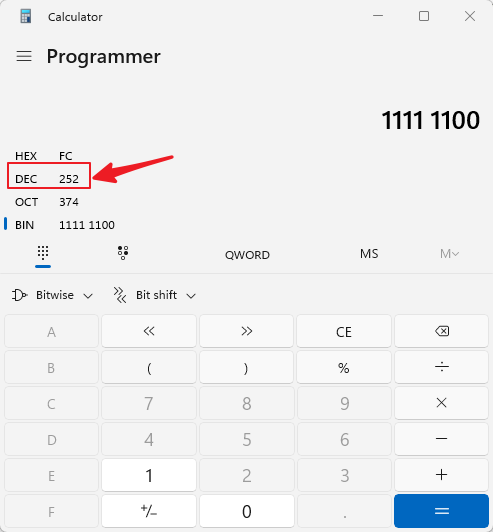
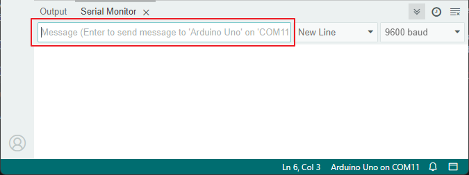
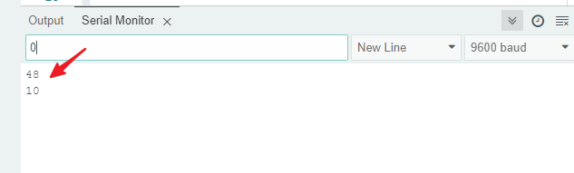
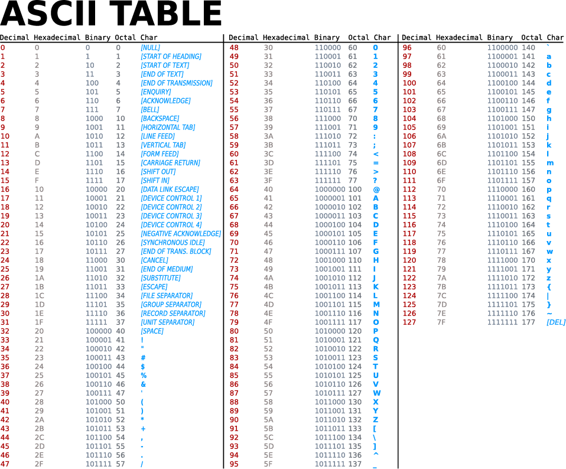

25. Show Number with 74hc595
==================================

在前面的活动中你可能已经注意到了，74HC595和数码管是一对绝佳的搭档。
74HC595可以同时输出8位的信号，而数码管则由8个电信号同时控制（包括了控制右下小数点的LED段，即dp段）。
那么，能否藉由74HC595控制数码管呢？答案是肯定的。

接下来我们就将用74HC595来控制数码管，让它显示不同的数字。

**构筑电路**

数码管的a-g段按顺序连接到Q7-Q1，dp段则连接到Q0。

.. list-table:: 
   :widths: 25 25 25 25
   :header-rows: 0

   * - 1 * R3 Board
     - 1 * 7-segment Display
     - 1 * 220Ω Resistor
     - 1 * 74HC595
   * - |compoents_uno_r3| 
     - |compoents_7segment| 
     - |compoents_220ohm| 
     - |compoents_1kohm| 
   * - 1 * Breadboard
     - Jumper Wires
     - 1 * USB Cable
     - 1 * Multimeter
   * - |compoents_breadboard| 
     - |compoents_wire| 
     - |compoents_usb_cable| 
     - |compoents_meter|

【】

**编写代码**

1.  打开 ``Lesson11_flow_light`` ，另存为一个新的文件， ``Lesson11_74hc595_display`` 。

2. 修改 ``datArray[]`` 数组中的数据，让它们能驱使数码管显示特定的数字。
举个例子，我们想要让数码管亮出数字0，则应当为a-f段写入1，g段写入0，转换成二进制数是 ``B11111100`` 。
想要让数码管亮出数字2，则应当为a,b,g,e,d段写入1，其他段写入0，转换成二进制数是 ``B11011010`` 。
以此类推，我们可以写出数字0-9所对应的编码。

*请将0-9的所有二进制编码写出来，记录在handbook上*

.. image:: img/23_segment_2.png
    :align: center
    :width: 200

.. code-block:: Arduino

    int datArray[] = {B11111100, B01100000, B11011010,,,,,,};

3. 在实际应用中，写入二进制数可以更清晰地表达数据的位状态，但对于一般的数字表示，写入十进制数更为方便。
当我们写入十进制数时，数据以十进制的形式表示。例如，252 表示十进制数 252，但在内部会被转换为二进制形式，即 B11111100。
更通俗的说，写入二进制，十进制，乃至十六进制等都不影响程序的效果，只影响代码的可读性.
因此，为了方便我们编写代码，我们更倾向于将二进制数表达为十进制数。请将 ``datArray[]`` 中的数字编码为十进制。

在进制转换中，一个带有programmer模式的计算器是个非常方便的工具。

*请将0-9的所有十进制编码，十六进制编码也写出来，记录在handbook上，这样你就能获得一个进制转换的速查表*

.. code-block:: Arduino

    int datArray[] = {252, 96, 218, 242, 102, 182, 190, 224, 254, 246};

现在你的完整代码应当如下所示：

.. code-block:: Arduino

    const int STcp = 12;//Pin connected to ST_CP of 74HC595
    const int SHcp = 8;//Pin connected to SH_CP of 74HC595 
    const int DS = 11; //Pin connected to DS of 74HC595 
    //display 0,1,2,3,4,5,6,7,8,9
    int datArray[] = {252, 96, 218, 242, 102, 182, 190, 224, 254, 246};

    void setup ()
    {
        //set pins to output
        pinMode(STcp,OUTPUT);
        pinMode(SHcp,OUTPUT);
        pinMode(DS,OUTPUT);
    }

    void loop()
    {
        for(int num = 0; num < 16; num++)
        {
            digitalWrite(STcp,LOW); //ground ST_CP and hold low for as long as you are transmitting
            shiftOut(DS,SHcp,MSBFIRST,datArray[num]);
            //return the latch pin high to signal chip that it 
            //no longer needs to listen for information
            digitalWrite(STcp,HIGH); //pull the ST_CPST_CP to save the data
            delay(1000); //wait for a second
        }
    }

8. 将这个代码上传到Arduino。

9. 保存你的代码。

显示输入到串口监视器的数字
---------------------------------

串口监视器（Serial Monitor）是 Arduino IDE 提供的一个强大工具，用于与 Arduino 板进行通信。
我们曾用它来监视 Arduino 板上输出的数据，比如查看热敏电阻检测到的温度值。
它还可以用于向 Arduino 板发送数据，让它根据接收到的数据执行相应的操作。

在这个活动中，我们将在串口监视器中写入一个0-9之间的数字，让数码管显示出来。

**编写代码**

1.  打开 ``Lesson11_74hc595_display`` ，另存为一个新的文件， ``Lesson11_74hc595_serial`` 。

2. 当我们使用串口监视器（Serial Monitor）时，可以通过Arduino代码来读取串口监视器中输入的数据。在这里你需要了解两个函数：

``Serial.available()`` ： 返回缓冲区中可供读取的字节数。如果返回值大于 0，则表示串口缓冲区中有数据可供读取。
``Serial.read()`` ： 从串口缓冲区读取一个字节的数据，并返回其 ASCII 码。

得知这两个函数的用途，我们就能很轻松的从串口监视器中读取你输入的数据。

3. 在loop()中改写代码，使用 ``Serial.available()`` 检测你是否在串口监视器中写下数字。

.. code-block:: Arduino

    void loop() {
        if (Serial.available() > 0) {
            ...
        }
    }

4. 使用 ``Serial.read()`` 函数从串口缓冲区读取一个字节的数据。
然而因为一些尚未可知的原因，你需要直接将此处读取到的数据输出出来。
请你将以下代码上传到Arduino板，并我们来学习一个新的知识。

.. code-block:: Arduino
    :emphasize-lines: 23

    #include <Arduino.h>

    // Define the pins connected to 74HC595
    const int STcp = 12; // Pin connected to ST_CP of 74HC595
    const int SHcp = 8;  // Pin connected to SH_CP of 74HC595
    const int DS = 11;   // Pin connected to DS of 74HC595

    //display 0,1,2,3,4,5,6,7,8,9
    int datArray[] = {252, 96, 218, 242, 102, 182, 190, 224, 254, 246};

    void setup() {
        // Set pins connected to 74HC595 as output
        pinMode(STcp, OUTPUT);
        pinMode(SHcp, OUTPUT);
        pinMode(DS, OUTPUT);
        
        // Start serial communication
        Serial.begin(9600);
    }

    void loop() {
        if (Serial.available() > 0) {
            Serial.println(Serial.read());
        }
    }

5. 上传后，在串口监视器的输入框，输入数字0（或者0-9的任意数字），按enter键键入。
此时你会发现，串口将输出一个48(或者一个48-57之间的数字)，一个10。

那么，我们输入的0，去哪了呢？那个48和10又是从何而来的呢？有没有可能0就是48，而48就是0呢？

这是因为我们在串口监视器输入的是“字符”，而非“数字”。
而字符传输会遵循一个名为 ASCII（American Standard Code for Information Interchange） 的编码标准。
它定义了128个字符，包括常见的字母、数字、标点符号和控制字符，每个字符都用一个7位的二进制数（0到127）来表示。
ASCII编码最初是为了在计算机和通信设备之间传输文本信息而设计的，它使得不同设备之间可以共享和解释文本数据。
在编程中，我们经常会用到ASCII码，特别是在处理字符和字符串时。
通过将字符转换为ASCII码值，我们可以进行字符的比较、排序和其他操作。同时，ASCII码也常用于串口通信、文件传输等场景中。
而在这个示例中便是从PC传输文本信息到Arduino板中。

ASCII码包括了常见的字符，如大写字母（A-Z）、小写字母（a-z）、数字（0-9）和标点符号（例如句点、逗号、感叹号等）。
ASCII码还定义了一些控制字符，用于控制设备和通信协议。
这些控制字符通常不会显示在屏幕上，而是用于控制打印机、终端等设备的行为，例如换行、退格、回车等。

以下是一张ASCII表：

通过速查，你可以发现Decimal的48对应的Char是‘0’；Decimal的10对应的Char是[LINE FEED]，也就是换行符。
那么，回顾下我们方才的输入操作，是键入了一个0，然后按下了回车键，这也就和串口监视器的打印结果对应上了。

6. 那么，回过头来继续编写我们的代码。我们需要新建一个char变量来储存从串口监视器读取到的字符。

.. code-block:: Arduino
    :emphasize-lines: 4

    void loop() {
        if (Serial.available() > 0) {
            // Read the character received from the serial port
            char receivedChar = Serial.read();
        }
    }

7. 将字符转换为数字。因为在 ASCII 码中，数字字符 '0' 的值是 48，'1' 是 49，以此类推。所以，通过减去字符 '0' 的 ASCII 码值，我们可以得到对应的数字值。

.. code-block:: Arduino
    :emphasize-lines: 6

    void loop() {
        if (Serial.available() > 0) {
            // Read the character received from the serial port
            char receivedChar = Serial.read();
            // Convert the character to a digit
            int digit = receivedChar - '0';
        }
    }

8. 在这个例子中，我们假设输入的是数字字符 '0' 到 '9'。所以，我们只关心输入的字符是否在这个范围内。因此需要检查数字是否在有效范围内：

.. code-block:: Arduino
    :emphasize-lines: 9

    void loop() {
        if (Serial.available() > 0) {
            // Read the character received from the serial port
            char receivedChar = Serial.read();
            // Convert the character to a digit
            int digit = receivedChar - '0';
            
            // Check if the digit is within the valid range
            if (digit >= 0 && digit <= 9) {
                ...
            }
        }
    }

9. 让数码管亮出对应的数字。当读取到的数字在有效范围内时，我们将相应的段码值发送到移位寄存器，以在数码管上显示相应的数字。

.. code-block:: Arduino
    :emphasize-lines: 11-13

    void loop() {
        if (Serial.available() > 0) {
            // Read the character received from the serial port
            char receivedChar = Serial.read();
            // Convert the character to a digit
            int digit = receivedChar - '0';
            
            // Check if the digit is within the valid range
            if (digit >= 0 && digit <= 9) {
                // Send the segment value to the 74HC595 shift register
                digitalWrite(STcp, LOW);  // Ground STcp and hold low
                shiftOut(DS, SHcp, MSBFIRST, datArray[digit]);  // Send segment value
                digitalWrite(STcp, HIGH);  // Pull STcp high to save the data
            }
        }
    }

你的完整代码应当如下所示：

.. code-block:: Arduino

    #include <Arduino.h>

    // Define the pins connected to 74HC595
    const int STcp = 12; // Pin connected to ST_CP of 74HC595
    const int SHcp = 8;  // Pin connected to SH_CP of 74HC595
    const int DS = 11;   // Pin connected to DS of 74HC595

    //display 0,1,2,3,4,5,6,7,8,9
    int datArray[] = {252, 96, 218, 242, 102, 182, 190, 224, 254, 246};

    void setup() {
        // Set pins connected to 74HC595 as output
        pinMode(STcp, OUTPUT);
        pinMode(SHcp, OUTPUT);
        pinMode(DS, OUTPUT);
        
        // Start serial communication
        Serial.begin(9600);
    }

    void loop() {
        if (Serial.available() > 0) {
            // Read the character received from the serial port
            char receivedChar = Serial.read();
            // Convert the character to a digit
            int digit = receivedChar - '0';
            
            // Check if the digit is within the valid range
            if (digit >= 0 && digit <= 9) {
                // Send the segment value to the 74HC595 shift register
                digitalWrite(STcp, LOW);  // Ground STcp and hold low
                shiftOut(DS, SHcp, MSBFIRST, datArray[digit]);  // Send segment value
                digitalWrite(STcp, HIGH);  // Pull STcp high to save the data
            }
        }
    }

7. 点击“上传”按钮，将草图上传到你的 Arduino 板。

8. 点击 “保存” 来保存你的草图。

