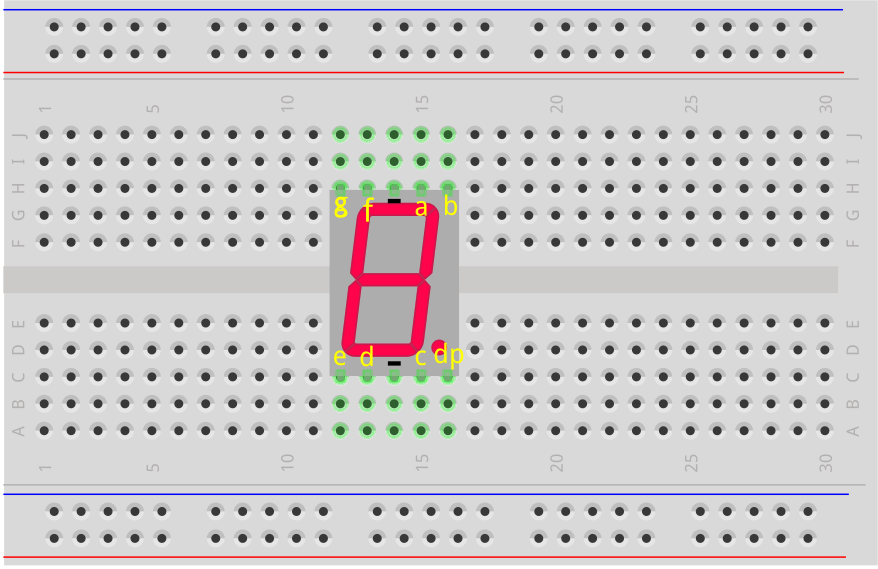
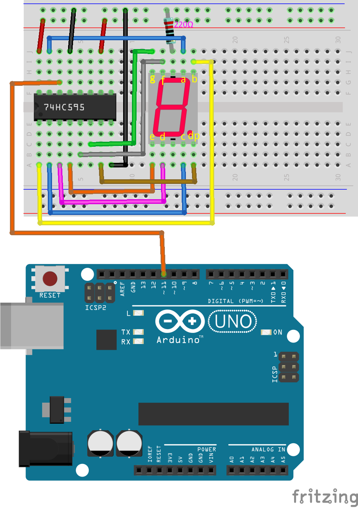

.. note::

    Hallo, willkommen in der SunFounder Raspberry Pi & Arduino & ESP32 Enthusiasten-Community auf Facebook! Tauche tiefer ein in die Welt von Raspberry Pi, Arduino und ESP32 mit Gleichgesinnten.

    **Warum mitmachen?**

    - **Expertenunterstützung**: Löse nach dem Kauf auftretende Probleme und technische Herausforderungen mit Hilfe unserer Community und unseres Teams.
    - **Lernen & Teilen**: Tausche Tipps und Tutorials aus, um deine Fähigkeiten zu verbessern.
    - **Exklusive Vorschauen**: Erhalte frühzeitigen Zugang zu neuen Produktankündigungen und Einblicken.
    - **Spezielle Rabatte**: Genieße exklusive Rabatte auf unsere neuesten Produkte.
    - **Festliche Aktionen und Gewinnspiele**: Nimm an Gewinnspielen und festlichen Sonderaktionen teil.

    👉 Bereit, mit uns zu erkunden und zu erschaffen? Klicke auf [|link_sf_facebook|] und tritt noch heute bei!

25. Nummern anzeigen mit dem 74HC595
========================================

In der vorherigen Lektion hast du möglicherweise bemerkt, dass der 74HC595 und das 7-Segment-Display ein perfektes Paar bilden. Der 74HC595 kann gleichzeitig 8-Bit-Signale ausgeben, während das 7-Segment-Display durch 8 elektrische Signale gesteuert wird (einschließlich des Dezimalpunkt-LED-Segments, d.h. des dp-Segments).

Kann der 74HC595 also zur Steuerung des 7-Segment-Displays verwendet werden? Die Antwort lautet ja.

In dieser Lektion werden wir den 74HC595 verwenden, um das 7-Segment-Display zu steuern und verschiedene Zahlen anzuzeigen.

.. raw:: html

    <video muted controls style = "max-width:90%">
        <source src="_static/video/25_show_number.mp4" type="video/mp4">
        Your browser does not support the video tag.
    </video>

In dieser Lektion wirst du lernen:

* Wie man das Schieberegister 74HC595 verwendet, um ein 7-Segment-Display anzutreiben.
* Die Binärdarstellungen der Ziffern 0 bis 9 zu verstehen und wie man sie in Dezimal- und Hexadezimalformate umwandelt.
* Wie man den seriellen Monitor verwendet, um Daten einzugeben und auf dem 7-Segment-Display anzuzeigen.

Aufbau der Schaltung
-----------------------------

**Benötigte Komponenten**

.. list-table:: 
   :widths: 25 25 25 25
   :header-rows: 0

   * - 1 * Arduino Uno R3
     - 1 * 7-Segment-Display
     - 1 * 220Ω-Widerstand
     - 1 * 74HC595
   * - |list_uno_r3| 
     - |list_7segment| 
     - |list_220ohm| 
     - |list_74hc595| 
   * - 1 * Steckbrett
     - Jumperkabel
     - 1 * USB-Kabel
     -
   * - |list_breadboard| 
     - |list_wire| 
     - |list_usb_cable| 
     -

**Schritt-für-Schritt-Aufbau**

Folge dem Verdrahtungsdiagramm oder den untenstehenden Schritten, um deine Schaltung aufzubauen.

.. image:: img/25_show_number.png
    :width: 500
    :align: center

1. Setze das 7-Segment-Display in das Steckbrett ein, wobei der Dezimalpunkt in der unteren rechten Ecke ist.

2. Verbinde den negativen (-) Anschluss des 7-Segment-Displays mit der Masse-Schiene des Steckbretts mittels eines Jumperkabels.

.. image:: img/25_show_number_resistor.png
    :width: 500
    :align: center

3. Finde den 74HC595-Chip und setze ihn in das Steckbrett ein. Achte darauf, dass der Chip die mittlere Lücke überbrückt.

.. image:: img/25_show_number_74hc595.png
    :width: 500
    :align: center

4. Verbinde die VCC- und MR-Pins des 74HC595 mit der Plus-Schiene des Steckbretts.

.. image:: img/25_show_number_vcc.png
    :width: 500
    :align: center

5. Verbinde die CE- und GND-Pins des 74HC595 mit der Minus-Schiene des Steckbretts.

.. image:: img/25_show_number_gnd.png
    :width: 500
    :align: center

6. Verbinde Q0 des 74HC595 mit dem 'a'-Pin des 7-Segment-Displays, Q1 mit dem 'b'-Pin, Q2 mit dem 'c'-Pin, Q3 mit dem 'd'-Pin und Q4 mit dem 'e'-Pin.

.. image:: img/25_show_number_q0_q4.png
    :width: 500
    :align: center

7. Verbinde Q5 des 74HC595 mit dem 'f'-Pin des 7-Segment-Displays, Q6 mit dem 'g'-Pin und Q7 mit dem 'dp'-Pin.

8. Verbinde den DS-Pin des 74HC595 mit Pin 11 des Arduino Uno R3.

9. Verbinde den ST_CP-Pin des 74HC595 mit Pin 12 des Arduino Uno R3.

.. image:: img/25_show_number_pin12.png
    :width: 500
    :align: center

10. Verbinde den SH_CP-Pin des 74HC595 mit Pin 8 des Arduino Uno R3.

.. image:: img/25_show_number_pin8.png
    :width: 500
    :align: center

11. Verbinde schließlich die GND- und 5V-Pins des Arduino Uno R3 mit der Minus- und Plus-Schiene des Steckbretts.

.. image:: img/25_show_number.png
    :width: 500
    :align: center

12. Die folgende Tabelle zeigt die Pin-Verbindungen zwischen dem 74HC595, dem Arduino Uno R3 und dem 7-Segment-Display.

.. list-table::
    :widths: 20 20
    :header-rows: 1

    *   - 74HC595
        - Arduino UNO R3
    *   - VCC
        - 5V
    *   - DS
        - 11
    *   - CE
        - GND
    *   - ST_CP
        - 12
    *   - SH_CP
        - 8
    *   - MR
        - 5V
    *   - GND
        - GND

.. list-table::
    :widths: 20 20
    :header-rows: 1

    *   - 74HC595
        - 7-Segment-Display
    *   - Q0
        - a
    *   - Q1
        - b 
    *   - Q2
        - c
    *   - Q3
        - d
    *   - Q4
        - e
    *   - Q5
        - f
    *   - Q6
        - g
    *   - Q7
        - dp

Binärzahlen für die Ziffern 0 bis 9
----------------------------------------

In diesem Projekt verwenden wir das 74HC595-Schieberegister, um das 7-Segment-Display zu steuern und verschiedene Ziffern anzuzeigen. Das 74HC595 empfängt jedoch Binärzahlen. Daher müssen wir vor dem Programmieren die entsprechenden Binärzahlen für die Ziffern 0 bis 9 kennen.

Angenommen, wir möchten die Ziffer 2 auf dem 7-Segment-Display anzeigen. Dafür müssen die Segmente f und c ausgeschaltet und die übrigen Segmente eingeschaltet werden.

.. image:: img/23_segment_2.png
    :align: center
    :width: 200

Laut dem Verdrahtungsdiagramm entsprechen die Ausgangspins Q0 bis Q7 des 74HC595 den jeweiligen Pins des 7-Segment-Displays, wie in der Abbildung gezeigt. Im Binärsystem steht 0 für aus (geschlossen) und 1 für ein (offen). Um die Ziffer 2 anzuzeigen, müssen dp, f und c 0 sein, während die anderen Segmente 1 sind. Dies ergibt die Binärzahl ``B01011011``.

.. image:: img/25_display_2_binary.png
    :align: center
    :width: 600

.. note::

    Wenn nur ein 7-Segment-Display vorhanden ist, wird der DP-Pin immer auf 0 gesetzt. Wenn mehrere 7-Segment-Displays in einer Daisy-Chain-Konfiguration verwendet werden, kann der DP-Pin zur Anzeige des Dezimalpunkts verwendet werden.

Um die Ziffer 0 anzuzeigen, müssen dp und g 0 sein und alle anderen Segmente 1, was die Binärzahl ``B00111111`` ergibt.

**Frage**

Da wir jetzt die Binärdarstellungen für die Ziffern 0 und 2 kennen, füllen Sie bitte die Binärzahlen für die verbleibenden Ziffern in der folgenden Tabelle aus.

.. list-table::
    :widths: 20 20
    :header-rows: 1

    *   - Zahl
        - Binär
    *   - 0
        - B00111111
    *   - 1
        -
    *   - 2
        - B01011011
    *   - 3
        -
    *   - 4
        -
    *   - 5
        -
    *   - 6
        -
    *   - 7
        -
    *   - 8
        -
    *   - 9
        -  

Code-Erstellung - Zahlen anzeigen
------------------------------------------
1. Öffne das zuvor gespeicherte Sketch ``Lesson24_Flowing_Light``. 

2. Wähle im Menü „Speichern unter...“ und benenne es in ``Lesson25_Show_Number_Binary`` um. Klicke auf "Speichern".

3. Ändere das ``datArray[]``, um die Binärzahlen anzuzeigen, die den Ziffern 0 bis 9 entsprechen.

.. code-block:: Arduino
    :emphasize-lines: 5

    const int STcp = 12;  //Pin verbunden mit ST_CP des 74HC595
    const int SHcp = 8;   //Pin verbunden mit SH_CP des 74HC595
    const int DS = 11;    //Pin verbunden mit DS des 74HC595
    //zeige 0,1,2,3,4,5,6,7,8,9 an
    int datArray[] = { B00111111, B00000110, B01011011, B01001111, B01100110, B01101101, B01111101, B00000111, B01111111, B01101111 };

4. Da das Array ``datArray[]`` 10 Elemente enthält, ändere den Bereich der Variablen ``num`` auf ``num <= 9``.

.. code-block:: Arduino
    :emphasize-lines: 2

    void loop() {
        for (int num = 0; num <= 9; num++) {
            digitalWrite(STcp, LOW);                      // Setze ST_CP auf LOW und halte es während der Übertragung
            shiftOut(DS, SHcp, MSBFIRST, datArray[num]);  // Sende die Daten, MSB zuerst
            digitalWrite(STcp, HIGH);                     // Setze ST_CP auf HIGH, um die Daten zu speichern
            delay(1000);                                  // Warte eine Sekunde
        }
    }

5. Dein vollständiger Code sollte folgendermaßen aussehen. Jetzt kannst du den Code auf den Arduino Uno R3 hochladen, und du wirst sehen, wie das 7-Segment-Display die Ziffern von 0 bis 9 durchläuft.

.. code-block:: Arduino

    const int STcp = 12;  //Pin verbunden mit ST_CP des 74HC595
    const int SHcp = 8;   //Pin verbunden mit SH_CP des 74HC595
    const int DS = 11;    //Pin verbunden mit DS des 74HC595
    //zeige 0,1,2,3,4,5,6,7,8,9 an
    int datArray[] = { B00111111, B00000110, B01011011, B01001111, B01100110, B01101101, B01111101, B00000111, B01111111, B01101111 };

    void setup() {
        //Pins als Ausgang setzen
        pinMode(STcp, OUTPUT);
        pinMode(SHcp, OUTPUT);
        pinMode(DS, OUTPUT);
    }

    void loop() {
        for (int num = 0; num <= 9; num++) {
            digitalWrite(STcp, LOW);                      // Setze ST_CP auf LOW und halte es während der Übertragung
            shiftOut(DS, SHcp, MSBFIRST, datArray[num]);  // Sende die Daten, MSB zuerst
            digitalWrite(STcp, HIGH);                     // Setze ST_CP auf HIGH, um die Daten zu speichern
            delay(1000);                                  // Warte eine Sekunde
        }
    }

Binärumrechnung
------------------

In praktischen Anwendungen ermöglicht das Schreiben von Binärzahlen eine klarere Darstellung des Zustands jedes Bits in den Daten. Für die allgemeine Zahlendarstellung ist das Schreiben von Dezimalzahlen jedoch bequemer.

.. note::

    Das Schreiben von Binär-, Dezimal- oder sogar Hexadezimalzahlen beeinflusst nicht das Ergebnis des Programms, sondern nur die Lesbarkeit des Codes. Zum Beispiel wird die Dezimalzahl ``91`` intern in die Binärform ``B01011011`` umgewandelt.

Schauen wir uns an, wie Binärzahlen in Dezimalzahlen umgewandelt werden.

**Umrechnung in Dezimal**

Im Binärsystem repräsentiert jedes Bit einen entsprechenden Stellenwert. Der Stellenwert ist eine Potenz von 2, wie z. B. 2^0, 2^1, 2^2 usw. Durch Multiplikation jedes Bits mit seinem entsprechenden Stellenwert und Addition der Ergebnisse erhalten wir die Dezimalzahl.

Beispielsweise wird die Binärzahl ``B01011011`` in die Dezimalzahl 91 umgewandelt.

.. image:: img/25_binary_dec.png
    :align: center
    :width: 600
 
**Verwendung eines Taschenrechners**

In praktischen Anwendungen kannst du den Rechner auf deinem Computer verwenden. Schalte in den Programmierermodus, und du kannst ganz einfach zwischen Binär-, Dezimal- und Hexadezimalzahlen umrechnen.

Suche auf deinem Computer nach „Rechner“ und schalte dann in den **Programmierer**-Modus.

2. Wenn du die Binärzahl bereits kennst und sie in ein anderes Zahlensystem umrechnen möchtest, wähle **BIN**.

.. image:: img/25_calculator_binary.png
    :align: center

3. Jetzt kannst du die Binärzahl eingeben.

* Die effektiven Bits in Binär beziehen sich auf den Bereich vom höchstwertigen Bit (linkes, nicht null Bit) bis zum niedrigstwertigen Bit (rechtes, nicht null Bit).
* Für die Binärzahl ``B00111111`` sind die effektiven Bits ``111111``. 
* Gib nun ``111111`` in den Taschenrechner ein, um die entsprechende Dezimal- und Hexadezimalzahl zu erhalten.

.. image:: img/25_calculator_binary_0.png
    :align: center
    :width: 300

**Frage**

Bitte konvertiere die Binärzahlen, die die Ziffern 0 bis 9 darstellen, in Dezimal- und Hexadezimalzahlen mit einem Taschenrechner und fülle die Tabelle aus. Dies wird dir einen schnellen Überblick über die Basisumrechnungen verschaffen.

.. list-table::
    :widths: 20 40 30 30
    :header-rows: 1

    *   - Zahl
        - Binär
        - Dezimal
        - Hexadezimal
    *   - 0
        - B00111111
        - 63
        - 0x3F
    *   - 1
        - B00000110
        -
        -
    *   - 2
        - B01011011
        -
        -
    *   - 3
        - B01001111
        -
        -
    *   - 4
        - B01100110
        -
        -
    *   - 5
        - B01101101
        -
        -
    *   - 6
        - B01111101
        -
        -
    *   - 7
        - B00000111
        -
        -
    *   - 8
        - B01111111
        -
        -
    *   - 9
        - B01101111
        -
        -

**Sketch modifizieren**

Öffne nun dein ``Lesson25_Show_Number_Binary`` Sketch in der Arduino IDE. Klicke auf "Datei" -> "Speichern unter...", benenne die Datei in ``Lesson25_Show_Number_Decimal`` um und klicke auf "Speichern".

Ändere alle Elemente des ``datArray[]`` in Dezimalzahlen, wie im folgenden Code gezeigt. Sobald die Änderungen vorgenommen wurden, kannst du den Code auf den Arduino Uno R3 hochladen, um den Effekt zu sehen.

.. code-block:: Arduino

    const int STcp = 12;  //Pin verbunden mit ST_CP des 74HC595
    const int SHcp = 8;   //Pin verbunden mit SH_CP des 74HC595
    const int DS = 11;    //Pin verbunden mit DS des 74HC595
    //zeige 0,1,2,3,4,5,6,7,8,9 an
    int datArray[] = { 63, 6, 91, 79, 102, 109, 125, 7, 127, 111 };

    void setup() {
        //setze Pins als Ausgang
        pinMode(STcp, OUTPUT);
        pinMode(SHcp, OUTPUT);
        pinMode(DS, OUTPUT);
    }

    void loop() {
        for (int num = 0; num <= 9; num++) {
            digitalWrite(STcp, LOW);                      // Setze ST_CP auf LOW und halte es während der Übertragung
            shiftOut(DS, SHcp, MSBFIRST, datArray[num]);  // Sende die Daten, MSB zuerst
            digitalWrite(STcp, HIGH);                     // Setze ST_CP auf HIGH, um die Daten zu speichern
            delay(1000);                                  // Warte eine Sekunde
        }
    }

Code-Erstellung - Serielle Eingabe
---------------------------------------

Der serielle Monitor ist ein leistungsfähiges Werkzeug der Arduino IDE zur Kommunikation mit dem Arduino-Board. Wir haben ihn verwendet, um Daten wie analoge Werte von einem Fotowiderstand zu überwachen. Er kann auch genutzt werden, um Daten an das Arduino zu senden, wodurch Aktionen basierend auf empfangenen Daten ausgeführt werden können.

In dieser Aktivität geben wir eine Zahl zwischen 0 und 9 in den seriellen Monitor ein, um sie auf dem 7-Segment-Display anzuzeigen.

1. Öffne dein ``Lesson25_Show_Number_Decimal`` Sketch in der Arduino IDE. Klicke auf "Datei" -> "Speichern unter...", benenne die Datei in ``Lesson25_Show_Number_Serial`` um. Klicke auf "Speichern".

2. Starte im ``void setup()`` den seriellen Monitor und setze dessen Baudrate auf 9600.

.. code-block:: Arduino
    :emphasize-lines: 6

    void setup() {
        //setze Pins als Ausgang
        pinMode(STcp, OUTPUT);
        pinMode(SHcp, OUTPUT);
        pinMode(DS, OUTPUT);
        Serial.begin(9600);  // Serielle Kommunikation auf 9600 Baud einrichten
    }

3. Beim Verwenden des seriellen Monitors kannst du die eingegebenen Daten über den Arduino-Code auslesen. Hier sind zwei Funktionen wichtig:

* ``Serial.available()``: Gibt die Anzahl der Bytes (Zeichen) zurück, die vom seriellen Port zum Lesen bereitstehen. Dies sind Daten, die bereits eingetroffen und im Empfangspuffer gespeichert sind (dieser kann 64 Bytes halten).
* ``Serial.read()``: Gibt den ASCII-Code des über den seriellen Eingang empfangenen Zeichens zurück.

Verwende nun eine ``if``-Anweisung in der Funktion ``loop()``, um zu überprüfen, ob Daten vom Port gelesen wurden, und drucke sie dann aus.

.. note::

    Kommentiere vorübergehend die ``for``-Schleife in ``void loop()`` aus, die die Ziffern auf dem 7-Segment-Display anzeigt, um den Druckvorgang nicht zu stören.

.. code-block:: Arduino
    :emphasize-lines: 2-5

    void loop() {
        if (Serial.available() > 0) {
            //Gibt das vom seriellen Port empfangene Zeichen aus
            Serial.println(Serial.read());
        }

        // for (int num = 0; num <= 9; num++) {
        //   digitalWrite(STcp, LOW);                      // Setze ST_CP auf LOW und halte es während der Übertragung
        //   shiftOut(DS, SHcp, MSBFIRST, datArray[num]);  // Sende die Daten, MSB zuerst
        //   digitalWrite(STcp, HIGH);                     // Setze ST_CP auf HIGH, um die Daten zu speichern
        //   delay(1000);                                  // Warte eine Sekunde
        // }
    }

4. Dein vollständiger Code sieht folgendermaßen aus. Jetzt kannst du den Code auf den Arduino Uno R3 hochladen.

.. code-block:: Arduino

    const int STcp = 12;  //Pin verbunden mit ST_CP des 74HC595
    const int SHcp = 8;   //Pin verbunden mit SH_CP des 74HC595
    const int DS = 11;    //Pin verbunden mit DS des 74HC595
    //zeige 0,1,2,3,4,5,6,7,8,9 an
    int datArray[] = { 63, 6, 91, 79, 102, 109, 125, 7, 127, 111 };

    void setup() {
        //setze Pins als Ausgang
        pinMode(STcp, OUTPUT);
        pinMode(SHcp, OUTPUT);
        pinMode(DS, OUTPUT);
        Serial.begin(9600);  // Serielle Kommunikation auf 9600 Baud einrichten
    }

    void loop() {
        if (Serial.available() > 0) {
            //Gibt das vom seriellen Port empfangene Zeichen aus
            Serial.println(Serial.read());
        }

        // for (int num = 0; num <= 9; num++) {
        //   digitalWrite(STcp, LOW);                      // Setze ST_CP auf LOW und halte es während der Übertragung
        //   shiftOut(DS, SHcp, MSBFIRST, datArray[num]);  // Sende die Daten, MSB zuerst
        //   digitalWrite(STcp, HIGH);                     // Setze ST_CP auf HIGH, um die Daten zu speichern
        //   delay(1000);                                  // Warte eine Sekunde
        // }
    }

5. Nach dem Hochladen öffne den seriellen Monitor. Gib in das Eingabefeld die Zahl ``0`` (oder eine beliebige Ziffer zwischen 0 und 9) ein und drücke Enter. In diesem Moment wirst du feststellen, dass die serielle Ausgabe die Zahl ``48`` anzeigt.

.. note::

    * Wenn im seriellen Monitor die Option „Newline“ ausgewählt ist, kannst du auch eine ``10`` sehen.
    * ``10`` ist der ASCII-Code für ein Zeilenumbruchzeichen (auch als LF - Line Feed bezeichnet).

.. image:: img/25_serial_read.png
    :align: center
    :width: 600

Wo ist unser eingegebenes ``0`` hin? Woher kommt die ``48``? Kann es sein, dass ``0`` gleich ``48`` ist?

Das liegt daran, dass das ``0``, das wir in den seriellen Monitor eingegeben haben, als „Zeichen“ und nicht als „Zahl“ betrachtet wird.

Die Zeichenübertragung folgt einem Codierungsstandard, der als ASCII (American Standard Code for Information Interchange) bekannt ist.

ASCII enthält gängige Zeichen wie Großbuchstaben (A-Z), Kleinbuchstaben (a-z), Ziffern (0-9) und Satzzeichen (Punkte, Kommas, Ausrufezeichen usw.). Es definiert auch Steuerzeichen, die zur Steuerung von Geräten und Kommunikationsprotokollen verwendet werden. Diese Steuerzeichen werden normalerweise nicht auf dem Bildschirm angezeigt, steuern aber das Verhalten von Geräten wie Druckern, Terminals usw., wie z. B. Zeilenumbruch, Rücktaste, Wagenrücklauf usw.

Hier ist eine ASCII-Tabelle:

.. image:: img/25_ascii_table.png
    :align: center
    :width: 800

Wenn du das Zeichen ``0`` im seriellen Monitor eingibst, wird der ASCII-Code für das Zeichen ``0`` an das Arduino gesendet. Im ASCII-Code entspricht das Zeichen ``0`` dem Dezimalwert ``48``.

6. Bevor du mit der Programmierung fortfährst, solltest du den vorherigen Code, der den ASCII-Code ausgibt, auskommentieren, um Konflikte mit dem nachfolgenden Code zu vermeiden.

.. code-block:: Arduino
    :emphasize-lines: 4

    void loop() {
        if (Serial.available() > 0) {
            // Den vom seriellen Port empfangenen Zeichen drucken
            // Serial.println(Serial.read());
        }

        // for (int num = 0; num <= 9; num++) {
        //   digitalWrite(STcp, LOW);                      // ST_CP auf LOW setzen und während der Übertragung halten
        //   shiftOut(DS, SHcp, MSBFIRST, datArray[num]);  // Daten übertragen, MSB zuerst
        //   digitalWrite(STcp, HIGH);                     // ST_CP auf HIGH setzen, um die Daten zu speichern
        //   delay(1000);                                  // Eine Sekunde warten
        // }
    }

7. Du musst eine neue ``char``-Variable erstellen, um das Zeichen zu speichern, das vom seriellen Monitor gelesen wird.

.. code-block:: Arduino
    :emphasize-lines: 6,7

    void loop() {
        if (Serial.available() > 0) {
            // Den vom seriellen Port empfangenen Zeichen drucken
            // Serial.println(Serial.read());

            // Das vom seriellen Port empfangene Zeichen lesen
            char receivedChar = Serial.read();
        }
    }

8. Nun musst du das Zeichen in eine Zahl umwandeln. Im ASCII-Code entspricht das Zeichen ``'0'`` dem Wert ``48``, ``'1'`` dem Wert ``49`` und so weiter. Durch das Subtrahieren des ASCII-Codes für ``'0'`` kannst du den entsprechenden numerischen Wert erhalten.

.. code-block:: Arduino
    :emphasize-lines: 8,9

    void loop() {
        if (Serial.available() > 0) {
            //Den vom seriellen Port empfangenen Zeichen drucken
            Serial.println(Serial.read());

            // Das vom seriellen Port empfangene Zeichen lesen
            char receivedChar = Serial.read();
            // Das Zeichen in eine Ziffer umwandeln
            int digit = receivedChar - '0';
        }
    }

9. In diesem Beispiel gehen wir davon aus, dass die Eingabe numerische Zeichen ``'0'`` bis ``'9'`` sind. Daher interessieren uns nur Zeichen in diesem Bereich. Du musst also überprüfen, ob die Zahl im gültigen Bereich liegt:

* Wähle die zuvor auskommentierte ``for``-Schleife aus und drücke ``Ctrl + /``, um sie zu entkommentieren.
* Ändere dann die ``for``-Anweisung in eine ``if``-Anweisung, um zu überprüfen, ob das Eingabezeichen im Bereich ``'0'`` bis ``'9'`` liegt. Wenn dies der Fall ist, lasse die entsprechende Zahl auf dem 7-Segment-Display anzeigen.

.. code-block:: Arduino
    :emphasize-lines: 9

    void loop() {
        if (Serial.available() > 0) {
            // Den vom seriellen Port empfangenen Zeichen drucken
            // Serial.println(Serial.read());

            // Das vom seriellen Port empfangene Zeichen lesen
            char receivedChar = Serial.read();
            // Das Zeichen in eine Ziffer umwandeln
            int digit = receivedChar - '0';

            if (digit >= 0 && digit <= 9) {
                digitalWrite(STcp, LOW);                        // ST_CP auf LOW setzen und während der Übertragung halten
                shiftOut(DS, SHcp, MSBFIRST, datArray[digit]);  // Daten übertragen, MSB zuerst
                digitalWrite(STcp, HIGH);                       // ST_CP auf HIGH setzen, um die Daten zu speichern
                delay(1000);                                    // Eine Sekunde warten
            }
        }
    }

10. Dein vollständiger Code sollte wie folgt aussehen. Du kannst den Code nun auf den Arduino Uno R3 hochladen und den seriellen Monitor öffnen. Gib eine beliebige Zahl zwischen 0 und 9 ein, um zu überprüfen, ob das 7-Segment-Display die entsprechende Zahl anzeigt.

.. code-block:: Arduino

    const int STcp = 12;  //Pin verbunden mit ST_CP des 74HC595
    const int SHcp = 8;   //Pin verbunden mit SH_CP des 74HC595
    const int DS = 11;    //Pin verbunden mit DS des 74HC595
    //zeige 0,1,2,3,4,5,6,7,8,9 an
    int datArray[] = { 63, 6, 91, 79, 102, 109, 125, 7, 127, 111 };

    void setup() {
        //setze Pins als Ausgang
        pinMode(STcp, OUTPUT);
        pinMode(SHcp, OUTPUT);
        pinMode(DS, OUTPUT);
        Serial.begin(9600);  // Serielle Kommunikation auf 9600 Baud einrichten
    }

    void loop() {
        if (Serial.available() > 0) {
            // Den vom seriellen Port empfangenen Zeichen drucken
            // Serial.println(Serial.read());

            // Das vom seriellen Port empfangene Zeichen lesen
            char receivedChar = Serial.read();
            // Das Zeichen in eine Ziffer umwandeln
            int digit = receivedChar - '0';

            if (digit >= 0 && digit <= 9) {
                digitalWrite(STcp, LOW);                        // ST_CP auf LOW setzen und während der Übertragung halten
                shiftOut(DS, SHcp, MSBFIRST, datArray[digit]);  // Daten übertragen, MSB zuerst
                digitalWrite(STcp, HIGH);                       // ST_CP auf HIGH setzen, um die Daten zu speichern
                delay(1000);                                    // Eine Sekunde warten
            }
        }
    }

11. Vergiss nicht, deinen Code zu speichern und deinen Arbeitsplatz aufzuräumen.

**Zusammenfassung**

In dieser Lektion hast du gelernt, wie du das 74HC595-Schieberegister verwendest, um ein 7-Segment-Display anzusteuern und die Anzahl der benötigten Pins am Arduino Uno R3 zu reduzieren. Du hast auch die binären Darstellungen der Ziffern und die Umwandlung von binären Zahlen in Dezimal- und Hexadezimalformate kennengelernt, was die Lesbarkeit des Codes verbessert.

Zusätzlich hast du gelernt, wie der serielle Monitor für die serielle Eingabe genutzt wird und wie die eingegebenen Zeichen intern in ASCII-Codes umgewandelt werden. Durch das Verständnis dieser Umwandlung konntest du Zeichen in ihre numerischen Entsprechungen umwandeln und so die korrekte Anzeige auf dem 7-Segment-Display ermöglichen.

Insgesamt bot dir diese Lektion ein umfassendes Verständnis für die Verwendung von Schieberegistern, die Steuerung von 7-Segment-Anzeigen und den Umgang mit serieller Kommunikation für interaktive Projekte.
