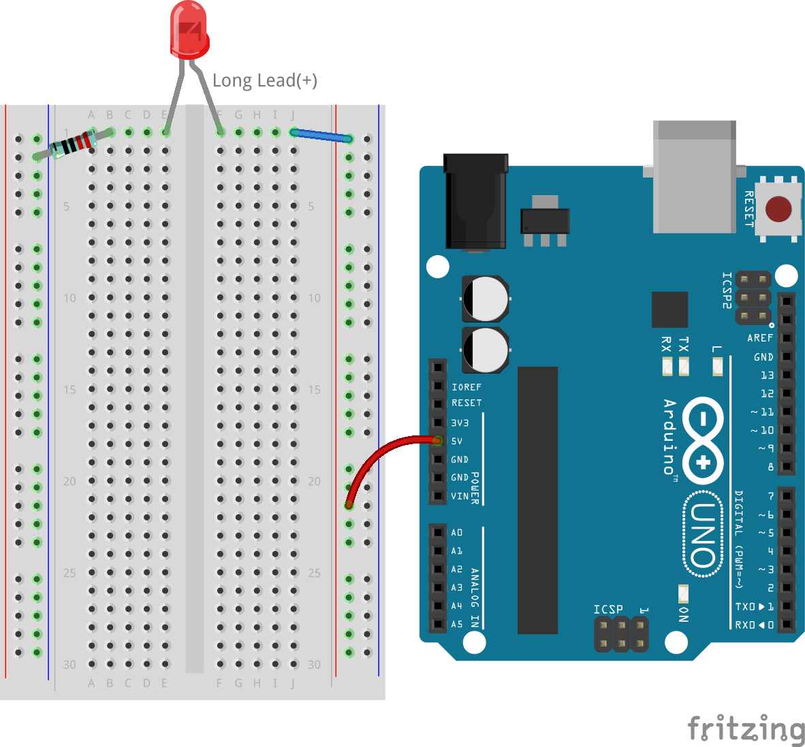

.. note::

    Ciao, benvenuto nella community di appassionati di SunFounder Raspberry Pi & Arduino & ESP32 su Facebook! Approfondisci le tue conoscenze su Raspberry Pi, Arduino ed ESP32 insieme ad altri appassionati.

    **Perché unirti a noi?**

    - **Supporto esperto**: Risolvi i problemi post-vendita e le sfide tecniche con l'aiuto della nostra comunità e del nostro team.
    - **Impara e condividi**: Scambia consigli e tutorial per migliorare le tue competenze.
    - **Anteprime esclusive**: Ottieni accesso anticipato agli annunci di nuovi prodotti e anteprime.
    - **Sconti speciali**: Approfitta di sconti esclusivi sui nostri prodotti più recenti.
    - **Promozioni festive e omaggi**: Partecipa a concorsi e promozioni durante le festività.

    👉 Sei pronto a esplorare e creare con noi? Clicca su [|link_sf_facebook|] e unisciti oggi stesso!

.. _2_first_circuit:

2. Il tuo primo circuito
=============================

Benvenuto nel mondo elettrizzante del tuo primo circuito, dove un semplice interruttore può illuminare l'ambiente e un singolo clic può dare vita ai dispositivi. Questa lezione è la tua porta d'accesso per comprendere la forza invisibile dell'elettricità che alimenta i dispositivi che usiamo ogni giorno. Ti sei mai chiesto come funzionano i tuoi gadget preferiti o cosa fa brillare le luci? È il momento di intraprendere un'esplorazione pratica della costruzione dei circuiti.

All'inizio di questa avventura, esploreremo le origini dell'elettricità e seguiremo il percorso degli elettroni mentre fluiscono attraverso i circuiti. Questa lezione funge da introduzione pratica ai componenti di un circuito e a come interagiscono per svolgere varie funzioni. Giocherai anche il ruolo di detective elettrico, scoprendo come sfruttare e misurare efficacemente questa forza vivace.

Preparati per esperimenti elettrizzanti! Ecco cosa riuscirai a fare:

* Usare una breadboard per costruire facilmente un circuito.
* Leggere i codici colore delle resistenze per gestire il flusso elettrico.
* Comprendere come i LED controllano la direzione della corrente.
* Imparare a conoscere la tensione dall'Arduino Uno R3.
* Scoprire come gli elettroni fluiscono attraverso un circuito.
* Riconoscere diversi tipi di circuiti e le loro funzioni.

Sei pronto a immergerti nella tua prima esperienza di costruzione di circuiti? Caricati e iniziamo questo viaggio illuminante!

Componenti necessari
------------------------

.. list-table:: 
   :widths: 25 25 25 25
   :header-rows: 0

   * - 1 * Arduino Uno R3
     - 1 * LED rosso
     - 1 * Resistenza da 220Ω
     - Cavi di collegamento
   * - |list_uno_r3| 
     - |list_red_led| 
     - |list_220ohm| 
     - |list_wire| 
   * - 1 * Cavo USB
     - 1 * Breadboard
     - 
     -   
   * - |list_usb_cable| 
     - |list_breadboard| 
     - 
     - 

Breadboard
-------------

1. Trova la tua breadboard.

La breadboard che userai è chiamata breadboard senza saldatura. Ogni foro della breadboard contiene un connettore metallico che afferra il filo quando viene inserito. Questo aiuta a prevenire che il filo venga tirato fuori, garantendo una connessione sicura nel circuito.

.. image:: img/2_breadboard_half.png
    :width: 500
    :align: center

Ti sei mai chiesto perché questo strumento essenziale per l'elettronica prende il nome dalla tavola da cucina usata per affettare il pane? È una storia piuttosto interessante! Nei giorni precedenti agli anni '70, i circuiti elettronici venivano assemblati su tavole di legno letteralmente riciclate, talvolta tavole da pane da cucina, inchiodando o incollando i componenti su di esse e realizzando connessioni con fili.

.. image:: img/2_breadboard_circuit.jpg
    :width: 500
    :align: center

Dal 1960 al 1980, gli ingegneri sperimentavano il wire wrapping per circuiti più complessi, una tecnica semi-permanente che richiedeva strumenti specifici ma che alla fine si rivelò troppo ingombrante e inadatta a un uso ripetuto.

.. image:: img/2_breadboard_wire_wrap.jpg
    :width: 500
    :align: center

Poi, all'inizio degli anni '70, Ronald J. Portugal rivoluzionò il prototipaggio con l'invenzione della "breadboard senza saldatura", rendendo l'assemblaggio dei circuiti più rapido, facile e senza necessità di saldatura. Questo strumento innovativo superò rapidamente il wire wrapping, portando alle breadboard che conosciamo oggi, chiamate così per i loro predecessori storici ma progettate per i maker moderni.

.. image:: img/2_breadboard_half.png
    :width: 500
    :align: center

Curioso di sapere cosa si nasconde sotto la superficie di una breadboard? Dietro la facciata di plastica e uno strato di schiuma adesiva, coperto da carta protettiva gialla, si trova il cuore del funzionamento della breadboard: dozzine di strisce metalliche.

.. note::
    È meglio non staccare questo strato protettivo. L'abbiamo fatto qui solo per mostrarti cosa c'è dentro.

.. image:: img/2_breadboard_internal0.jpg
    :width: 500
    :align: center

Se dovessi (anche se te lo sconsigliamo vivamente) estrarre queste parti metalliche con delle pinze, scopriresti che ogni pezzo è una clip metallica con piccoli denti. Ogni striscia ha cinque denti, che corrispondono ai cinque fori sulla superficie della breadboard per ciascuna riga. I binari di alimentazione hanno strisce più lunghe con cinquanta denti.

.. image:: img/2_breadboard_internal1.jpg
    :width: 500
    :align: center

Questi piccoli denti sono perfetti per afferrare le gambe dei componenti elettronici. Quando un componente viene inserito nella breadboard, la clip si apre leggermente per afferrare saldamente la gamba metallica. Qualsiasi altro componente inserito nella stessa fila di denti sarà elettricamente connesso.

.. image:: img/2_breadboard_internal2.jpg
    :width: 500
    :align: center

Questo design intelligente consente un prototipaggio facile e flessibile senza la necessità di saldatura, rendendo le breadboard uno strumento essenziale sia per gli appassionati di elettronica che per i professionisti.

La maggior parte delle breadboard ha numeri, lettere e segni più e meno. Anche se le etichette possono variare da una breadboard all'altra, la funzione è fondamentalmente la stessa. Queste etichette ti permettono di trovare più velocemente i fori corrispondenti quando costruisci il tuo circuito. I numeri delle righe e le lettere delle colonne ti aiutano a localizzare con precisione i fori sulla breadboard, ad esempio, il foro "C15" è dove la colonna C incrocia la riga 15.

I lati della breadboard sono solitamente distinti da colori rosso e blu (o altri colori), così come dai segni più e meno, e vengono generalmente utilizzati per collegarsi all'alimentazione, noti come bus di alimentazione. Quando costruisci un circuito, è comune collegare il terminale negativo alla colonna blu (-) e il terminale positivo alla colonna rossa (+).

.. image:: img/2_breadboard_plus_minus.jpg
    :width: 500
    :align: center

Resistore
---------------------

2. Trova un resistore da 220 ohm.

.. image:: img/2_220_resistor.png
    :align: center

I resistori aiutano a gestire il flusso di elettricità in un circuito convertendo l'energia elettrica in calore. Ogni resistore ha due fili, uno su ciascun lato, che consentono all'elettricità di passare in entrambe le direzioni, il che significa che possono essere posizionati in qualsiasi direzione nel circuito.

Il valore in ohm di un resistore indica la quantità di resistenza che aggiunge. Un valore ohmico più alto significa maggiore resistenza. Ad esempio, un resistore da 220 ohm aggiunge 220 ohm di resistenza, mentre un resistore da 10 kiloohm aggiunge 10 kiloohm.

Per leggere il valore di un resistore, controlla le bande di colore. Questa tabella spiega il significato di ciascuna banda colorata su un resistore. Il moltiplicatore è rappresentato in notazione scientifica, dove l'esponente indica il numero di zeri aggiunti al numero rappresentato dalle bande di colore. Ad esempio, un resistore a 4 bande come quello in alto nella tabella inizia con una banda verde. Il verde rappresenta il numero 5, quindi il valore della resistenza inizia con 5. La seconda banda è marrone, quindi il numero successivo è 1. La banda del moltiplicatore è rossa, che vale 2, il che significa che aggiungiamo due zeri. Questo risulta in un valore totale di resistenza di 5100 ohm, o 5,1 kiloohm (5,1kΩ).

.. image:: img/2_resistor_card.png

La tabella qui rappresenta tutti i resistori inclusi nel tuo kit. Per questa lezione, useremo un resistore da 220 ohm.

.. image:: img/2_all_resistor.png
    :width: 500
    :align: center

3. Piega i terminali del resistore in modo che puntino nella stessa direzione.

.. image:: img/2_220_resistor_pin.png
    :width: 200
    :align: center

4. Inserisci un terminale nel foro superiore del lato negativo della breadboard, collegando il resistore alla fonte di alimentazione. Inserisci l'altro terminale del resistore da 220 ohm nel foro 1b della breadboard.

    .. note::
        
        I resistori sono considerati componenti non polarizzati, il che significa che la direzione in cui vengono posizionati nel circuito non ha importanza.

.. image:: img/2_connect_resistor.png
    :width: 300
    :align: center

LED
-----------------

5. Trova il LED rosso.

.. image:: img/2_red_led.png
    :align: center

I LED, o diodi a emissione luminosa, sono componenti elettronici specializzati che emettono luce quando una corrente elettrica li attraversa in una direzione specifica.

.. image:: img/2_led_polarity.jpg
    :width: 200
    :align: center

I colori dei LED più comuni sono rosso, giallo, blu, verde e bianco, con la luce emessa che generalmente corrisponde al colore del LED stesso.

.. image:: img/2_led_color.png
    :width: 600
    :align: center

Questi dispositivi sono progettati con due terminali: uno più lungo noto come anodo e uno più corto chiamato catodo. Per funzionare correttamente, l'anodo deve essere collegato al terminale positivo della fonte di alimentazione, mentre il catodo deve essere collegato al terminale negativo o a terra. Alcuni LED presentano un bordo piatto sul lato del catodo per facilitare il corretto posizionamento.

.. image:: img/2_led_pin.jpg
    :width: 100
    :align: center

6. Inserisci il catodo del LED (il terminale corto) nel foro 1e della breadboard. Questo collega il LED al resistore da 220Ω. Ricorda, i fori 1b e 1e sono collegati sotto la breadboard.

.. note::

    I LED sono considerati componenti polarizzati, il che significa che la corrente può fluire attraverso di essi in una sola direzione. Se il LED non si accende, prova a invertire i collegamenti.

.. image:: img/2_connect_led.png
    :width: 300
    :align: center

Cavo di collegamento
----------------------

7. Trova un cavo di collegamento.

Il tuo kit include cavi di collegamento di diversi colori e lunghezze, ma tutti funzionano allo stesso modo. Usa colori diversi per identificare facilmente il circuito e cavi più corti per mantenere l'installazione ordinata. Ogni cavo è composto da un'anima conduttiva e un rivestimento isolante per evitare contatti indesiderati.

.. image:: img/2_wire_color.jpg
    :width: 500
    :align: center

8. Inserisci un'estremità del cavo di collegamento nel foro 1j della breadboard. Questo collega il cavo di collegamento al LED, poiché i fori 1f e 1j sono collegati sotto la breadboard. Inserisci l'altra estremità del cavo nel foro superiore del binario positivo della breadboard. Ora, il cavo di collegamento unisce il LED al filo di terra.

.. image:: img/2_connect_wire.png
    :width: 300
    :align: center

Arduino Uno R3
--------------------

9. Trova il tuo Arduino Uno R3.

In questa lezione, utilizzeremo l'Arduino Uno R3 come alimentatore. Il pin da 5V funge da terminale positivo e il pin GND come terminale negativo, fornendo un flusso costante di 5V al circuito.

.. image:: img/1_uno_power_pin.png
    :width: 500
    :align: center

Tuttavia, collegare direttamente i terminali dell'alimentatore senza un carico può causare un corto circuito, generando calore e potenzialmente danni o incendi. È sempre importante includere un carico, come un LED o un resistore, per prevenire cortocircuiti.

.. image:: img/2_short_circuit.png
    :width: 500
    :align: center

10. Collega un filo dal binario positivo sul lato destro della breadboard al pin 5V sull'Arduino Uno R3. Si consiglia di utilizzare un filo rosso o arancione per rappresentare il terminale positivo, utile soprattutto per identificare rapidamente i collegamenti nei progetti complessi.

11. Infine, collega un filo dal binario negativo sul lato sinistro della breadboard al pin GND sull'Arduino Uno R3. Per coerenza, si suggerisce di utilizzare un filo nero o verde, mantenendo lo stesso colore per rappresentare il terminale negativo in tutti i circuiti.

.. image:: img/2_uno_gnd.png
    :width: 600
    :align: center

12. Ora alimenta l'Arduino Uno R3 collegandolo a un computer o a una presa di corrente usando il cavo USB fornito nel kit, e il LED dovrebbe accendersi.

    .. image:: img/2_first_circuit.png
        :width: 600
        :align: center

Dopo aver collegato il tuo Arduino Uno R3 e aver visto accendersi il LED, non stai solo osservando un semplice circuito: stai assistendo ai fondamenti dell'elettricità in azione. Approfondiamo ciò che dà vita al tuo circuito.

Comprendere l'Elettricità nei Circuiti
-------------------------------------------

**Elementi Essenziali dell'Elettricità**

Il flusso di elettroni dal negativo al positivo è ciò che intendiamo come flusso elettronico reale. Inizialmente, scienziati come Ben Franklin credevano che la corrente fosse un movimento di cariche positive, motivo per cui la corrente convenzionale è definita come fluente dal positivo al negativo.

.. image:: img/2_uno_current.png
    :width: 600
    :align: center

In realtà, però, gli elettroni, che portano una carica negativa, si muovono dal terminale negativo al terminale positivo. La maggior parte dei paesi oggi utilizza ancora il modello del flusso di corrente convenzionale. Pertanto, nei diagrammi e nella progettazione di componenti elettronici, la corrente viene rappresentata come fluente dal terminale positivo a quello negativo, anche se in realtà gli elettroni fluiscono nella direzione opposta.

.. image:: img/2_uno_electron.png
    :width: 600
    :align: center

* **A** Direzione della corrente convenzionale
* **B** Direzione reale del flusso di elettroni
* **C** Elettroni (non in scala)
* **D** Filo

Ci sono due tipi di corrente generata da una fonte di energia: corrente alternata (AC) e corrente continua (DC). Una batteria o un microcontrollore come l'Arduino Uno R3 fornisce DC, dove la corrente scorre in una direzione, dal terminale positivo a quello negativo.

Con l'AC, invece, la corrente cambia direzione periodicamente. La tensione nel circuito si inverte mentre la corrente cambia direzione, costringendola a fluire nell'altra direzione. La maggior parte delle case e degli edifici è alimentata da circuiti AC, come i 120 volt a 60 Hz dalle prese di corrente nelle case americane o i 220 volt a 50 Hz in molte case europee.

**Sicurezza nei Circuiti**

Quando si collega una fonte di alimentazione, un approccio prudente è collegare prima il terminale positivo al circuito, seguito da quello negativo. Al contrario, quando si scollega, si dovrebbe rimuovere prima il terminale negativo per prevenire cortocircuiti. Questo corso utilizza tensioni e correnti basse, quindi non c'è rischio di scosse elettriche o lesioni. Tuttavia, buone pratiche di sicurezza possono prevenire danni quando si lavora con tensioni e correnti più alte, come nel caso della sostituzione di batterie per auto o nella riparazione di prese di corrente.

**Circuiti Chiusi e Aperti**

Mentre l'elettricità scorre attraverso il LED, il resistore, i cavi di collegamento e ritorna nel binario negativo della breadboard, forma quello che è noto come circuito chiuso. Se rimuovi un filo dalla breadboard, il LED si spegne perché la corrente si interrompe: il circuito è ora aperto.

.. image:: img/2_open_circuit.png
    :width: 600
    :align: center

Padroneggiando questi concetti di base, sei sulla buona strada per comprendere e creare elettronica più complessa che alimenta il nostro mondo.

**Domande:**

1. Rimuovi il filo rosso dalla breadboard e sperimenta inserendolo in diversi fori della breadboard. Osserva eventuali cambiamenti nel LED. Disegna le posizioni dei fori che permettono al LED di accendersi.

.. image:: img/2_uno_gnd.png
    :width: 600
    :align: center

2. Cosa succede se inverti i pin del LED? Si accenderà? Perché o perché no?
