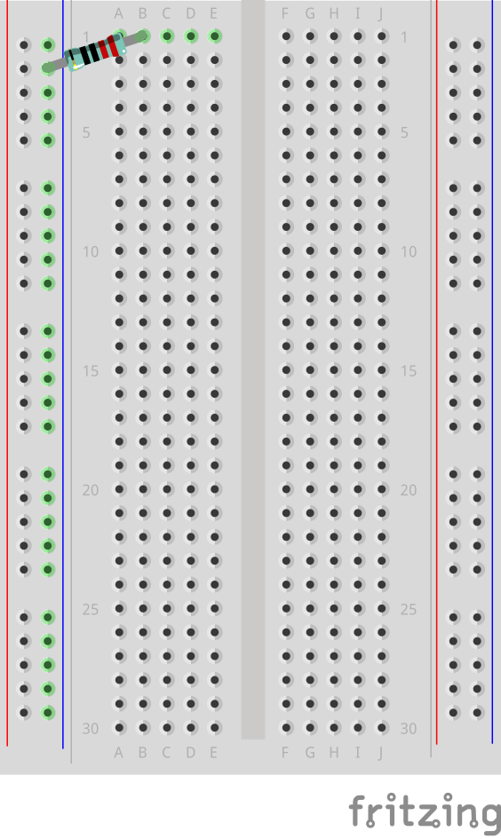
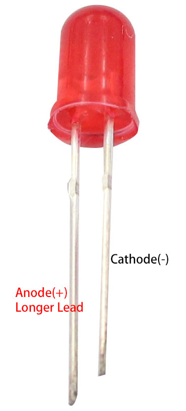
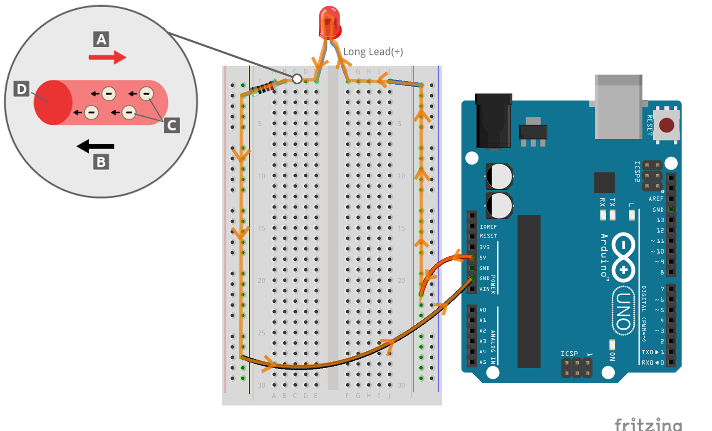

.. note::

    こんにちは、SunFounderのRaspberry Pi & Arduino & ESP32 Enthusiasts Communityへようこそ！Raspberry Pi、Arduino、ESP32について、仲間と一緒に深く掘り下げましょう。

    **参加する理由**

    - **専門家のサポート**：販売後の問題や技術的な課題をコミュニティとチームの助けを借りて解決しましょう。
    - **学びと共有**：スキルを向上させるためのヒントやチュートリアルを交換しましょう。
    - **限定プレビュー**：新製品の発表やプレビューに早期アクセスしましょう。
    - **特別割引**：最新製品の特別割引をお楽しみください。
    - **お祭りのプロモーションとプレゼント**：プレゼント企画やホリデープロモーションに参加しましょう。

    👉 私たちと一緒に探求し創造する準備はできましたか？[|link_sf_facebook|]をクリックして、今すぐ参加しましょう！

.. _2_first_circuit:

2. 最初の回路
=========================

最初の回路のエキサイティングな世界へようこそ。ここでは、シンプルなスイッチで周囲を照らし、ワンクリックでガジェットを動かすことができます。このレッスンは、毎日使うデバイスを動かす電気の見えない力を理解するための入り口です。お気に入りのガジェットがどのように動作するのか、ライトがどのように光るのかについて興味がありますか？回路構築の実践的な探求を始めましょう。

この冒険の始まりとして、電気の起源を探り、電子が回路を流れる経路を追跡します。このレッスンは、回路のコンポーネントとそれらがどのように相互作用してさまざまな機能を果たすかについての実践的な紹介です。また、電気探偵の役割を果たし、この活発な力を効果的に活用し測定する方法を発見します。

エキサイティングな実験の準備をしましょう！以下のことを達成します：

* ブレッドボードを使用して簡単に回路を構築する。
* 抵抗器のカラースコードを読み取って電流を管理する。
* LEDが電流の方向を制御する方法を理解する。
* Arduino Uno R3から電圧について学ぶ。
* 電子が回路を流れる仕組みを発見する。
* さまざまな種類の回路とその機能を認識する。

最初の回路構築の体験に飛び込む準備はできましたか？電気の世界に飛び込み、この啓発的な旅を始めましょう！

必要なコンポーネント
----------------------

.. list-table:: 
   :widths: 25 25 25 25
   :header-rows: 0

   * - 1 * Arduino Uno R3
     - 1 * 赤色LED
     - 1 * 220Ω抵抗器
     - ジャンパーワイヤー
   * - |list_uno_r3| 
     - |list_red_led| 
     - |list_220ohm| 
     - |list_wire| 
   * - 1 * USBケーブル
     - 1 * ブレッドボード
     -
     -   
   * - |list_usb_cable| 
     - |list_breadboard| 
     -
     - 

ブレッドボード
------------------

1. ブレッドボードを見つけましょう。

使用するブレッドボードは、はんだ不要のブレッドボードと呼ばれます。ブレッドボードの各穴には、ワイヤーを挿入するときにそれをしっかりと握る金属コネクタが含まれています。これにより、ワイヤーが引き抜かれるのを防ぎ、回路内の接続を確保します。

ブレッドボードが、キッチンでパンを切るために使うボードと同じ名前を持つ理由を不思議に思ったことはありますか？それはかなりの物語です！1970年代以前、エレクトロニクスは木製の板、時にはキッチンのパン切り板を再利用して組み立てられ、部品を釘や接着剤で固定し、ワイヤーで接続していました。

.. image:: img/2_breadboard_circuit.jpg
    :width: 500
    :align: center

1960年代から1980年代にかけて、エンジニアたちはより複雑な回路にワイヤーラッピングを試みました。これは半永久的で特定のツールを必要としましたが、最終的には面倒で繰り返し使用するのに適していないと見なされました。

.. image:: img/2_breadboard_wire_wrap.jpg
    :width: 500
    :align: center

その後、1970年代初頭にロナルド・J・ポルトガルが「はんだ不要のブレッドボード」を発明し、プロトタイピングが迅速かつ容易になり、はんだ付けを必要としないこの革新的なツールがワイヤーラッピングを凌駕しました。現代のメーカー向けに設計されたブレッドボードは、その歴史的な前身にちなんで名付けられています。

ブレッドボードの表面下に何があるのか気になったことはありますか？プラスチックの外装と粘着性のフォームの層の下には、黄色の保護紙で覆われた金属ストリップがたくさんあります。

.. note::
    この保護層を剥がさない方が良いです。内部をお見せするためにここでは剥がしています。

.. image:: img/2_breadboard_internal0.jpg
    :width: 500
    :align: center

プライヤーでこれらの金属部品を引き抜くと（お勧めしませんが）、それぞれが小さな歯を持つ金属クリップであることがわかります。各ストリップには5つの歯があり、各行の表面に5つの穴があります。電源レールには50本の歯を持つ長いストリップがあります。

.. image:: img/2_breadboard_internal1.jpg
    :width: 500
    :align: center

これらの小さな歯は、電子部品の足をしっかりと掴むのに最適です。部品がブレッドボードに挿入されると、クリップが少し開いて金属の足をしっかりと握ります。同じ行の歯に挿入された他の部品も電気的に接続されます。

.. image:: img/2_breadboard_internal2.jpg
    :width: 500
    :align: center

この巧妙なデザインにより、はんだ付けを必要とせずに簡単かつ柔軟にプロトタイピングが可能となり、ブレッドボードはエレクトロニクス愛好者やプロフェッショナルにとって不可欠なツールとなっています。

ほとんどのブレッドボードには、数字、アルファベット、プラスとマイナスの記号が付いています。ブレッドボードごとにラベルは異なりますが、基本的な機能は同じです。これらのラベルにより、回路を構築する際に対応する穴をすばやく見つけることができます。行番号と列のアルファベットは、ブレッドボードの穴を正確に特定するのに役立ちます。たとえば、「C15」は、列Cと行15が交差する場所です。

.. image:: img/2_breadboard_letter_number.jpg
    :width: 500
    :align: center

ブレッドボードの側面は通常、赤と青（または他の色）およびプラスとマイナスの記号で区別されており、電源バスとして電源に接続するために使用されます。回路を構築する際には、一般的に負極を青（-）列に、正極を赤（+）列に接続します。

抵抗器
---------------------

2. 220オームの抵抗器を見つけましょう。

.. image:: img/2_220_resistor.png
    :align: center

抵抗器は電気エネルギーを熱に変換することで、回路内の電流の流れを管理します。各抵抗器には両端にワイヤーがあり、電流はどちらの方向にも流れることができるため、回路内でどちらの方向にも配置できます。

抵抗器のオーム値は、追加される抵抗の量を示します。オーム値が高いほど抵抗が大きくなります。例えば、220オームの抵抗器は220オームの抵抗を追加し、10キロオームの抵抗器は10キロオームの抵抗を追加します。

抵抗器の値を読み取るには、カラーバンドを確認します。このチャートは、抵抗器の各カラーバンドの意味を説明しています。乗数は科学的記数法で表され、指数は色帯で示される数値に追加されるゼロの数を示します。例えば、チャートの上部に示されている4バンドの抵抗器は、緑のバンドで始まります。緑は数字の5を表し、抵抗値は5から始まります。次のバンドは茶色で、次の数字は1です。乗数バンドは赤で、2と評価されるため、2つのゼロを追加します。これにより、抵抗値は合計5100オーム、または5.1キロオーム（5.1kΩ）となります。

.. image:: img/2_resistor_card.png

ここに示されているチャートは、キットに含まれているすべての抵抗器を表しています。このレッスンでは、220オームの抵抗器を使用します。

.. image:: img/2_all_resistor.png
    :width: 500
    :align: center

3. 抵抗器のリードを同じ方向に曲げます。

4. 抵抗器の一方のリードをブレッドボードの負極側の上部の穴に挿入し、抵抗器を電源に接続します。220オームの抵抗器の他方のリードをブレッドボードの1bの穴に挿入します。

    .. note::
        
        抵抗器は非極性コンポーネントと見なされるため、回路内の向きは関係ありません。

LED
-----------------

5. 赤色LEDを見つけます。

.. image:: img/2_red_led.png
    :align: center

LED（発光ダイオード）は、特定の方向に電流が流れると光を放つ特殊な電子部品です。

最も一般的なLEDの色は赤、黄色、青、緑、白で、放出される光は通常LED自体の色と一致します。

.. image:: img/2_led_color.png
    :width: 600
    :align: center

これらのデバイスは、アノードと呼ばれる長いリードとカソードと呼ばれる短いリードの2つのリードを持つように設計されています。正しく機能するためには、アノードを電源の正極に、カソードを負極またはグランドに接続する必要があります。一部のLEDには、カソード側に平らな端があり、正しい配置を助けます。

6. LEDのカソード（短いリード）をブレッドボードの1eの穴に挿入します。これにより、LEDが1KΩ抵抗器に接続されます。ブレッドボードの1aと1eの穴は内部で接続されています。

    .. note::

        LEDは極性コンポーネントと見なされているため、電流は一方向にしか流れません。LEDが点灯しない場合は、接続を交換してみてください。

.. image:: img/2_connect_led.png
    :width: 300
    :align: center

ジャンパーワイヤー
----------------------

7. ジャンパーワイヤーを見つけます。

キットには、さまざまな色と長さのジャンパーワイヤーが含まれており、すべて同じ機能を持っています。回路を簡単に識別するために異なる色を使用し、整然としたセットアップのために短いワイヤーを使用します。各ワイヤーは、導電性のコアと意図しない接触を防ぐ絶縁被覆で構成されています。

.. image:: img/2_wire_color.jpg
    :width: 500
    :align: center

8. ジャンパーワイヤーの一端をブレッドボードの1jの穴に挿入します。これにより、ジャンパーワイヤーがLEDに接続されます。1fと1jの穴はブレッドボードの下でリンクされています。ジャンパーワイヤーの他端をブレッドボードの正極レールの上部の穴に挿入します。これで、ジャンパーワイヤーがLEDとグランドワイヤーを接続します。

.. image:: img/2_connect_wire.png
    :width: 300
    :align: center

Arduino Uno R3
--------------

9. Arduino Uno R3を見つけましょう。

.. image:: img/1_uno_board.png
    :width: 400
    :align: center

このレッスンでは、Arduino Uno R3を電源として使用します。その5Vピンが正極端子として機能し、GNDピンが負極端子として機能し、回路に安定した5Vを供給します。

.. image:: img/1_uno_power_pin.png
    :width: 500
    :align: center

ただし、負荷なしで電源の端子を直接接続すると短絡が発生し、熱が発生して損傷や火災を引き起こす可能性があります。短絡を防ぐために、常にLEDや抵抗器のような負荷を含めてください。

.. image:: img/2_short_circuit.png
    :width: 500
    :align: center

10. ブレッドボードの右側の正極レールからArduino Uno R3の5Vピンにワイヤーを接続します。複雑なプロジェクトで接続を迅速に特定するために、正極端子を表す赤またはオレンジのワイヤーを使用することをお勧めします。

.. image:: img/2_uno_5v.png
    :width: 600
    :align: center

11. 最後に、ブレッドボードの左側の負極レールからArduino Uno R3のGNDピンにワイヤーを接続します。一貫性のために黒または緑のワイヤーを使用し、すべての回路で負極端子を表すのに同じ色を使用することをお勧めします。

.. image:: img/2_uno_gnd.png
    :width: 600
    :align: center

12. 最後に、キットに含まれているUSBケーブルを使用して、Arduino Uno R3をコンピューターまたは電源ソケットに接続し、LEDが点灯することを確認します。

    .. image:: img/1_connect_uno_pc.jpg
        :width: 600
        :align: center

Arduino Uno R3を接続し、LEDが点灯するのを確認した後、単純な回路を見ているだけでなく、電気の基本を観察していることになります。回路がどのようにして動作するのかを掘り下げてみましょう。

回路における電気の理解
----------------------------------------

**電気の基本**

負極から正極への電子の流れが、私たちが理解している電流です。最初は、ベンジャミン・フランクリンのような科学者は電流が正の電荷の移動であると信じていました。そのため、伝統的な電流は正極から負極へ流れるとされています。

.. image:: img/2_uno_current.png
    :width: 600
    :align: center

しかし、実際には負の電荷を持つ電子が負極から正極へ移動します。ほとんどの国では現在でも伝統的な流れのモデルを使用しています。そのため、図や電子部品の設計時には、電流が正極から負極へ流れると描かれていますが、実際には電子は反対方向に流れます。

* **A** 伝統的な電流の方向
* **B** 実際の電子の流れの方向
* **C** 電子（スケールに比例していない）
* **D** ワイヤー

電源から生成される電流には、交流（AC）と直流（DC）の2種類があります。電池やArduino Uno R3のようなマイクロコントローラーは直流を提供し、電流は正極から負極へ一方向に流れます。

一方、交流では電流の方向が周期的に変わります。電圧が逆転し、電流が反対方向に流れるようになります。ほとんどの家庭や建物は交流回路で電力を供給されており、アメリカの家庭では120ボルト60ヘルツ、ヨーロッパの多くの国では220ボルト50ヘルツが使用されています。

**回路における安全性**

電源を接続する際には、正極端子を先に接続し、次に負極端子を接続するのが賢明です。逆に、取り外す際には、まず負極端子を外して短絡を防ぎます。このコースでは低電圧と低電流を使用するため、感電や怪我のリスクはありませんが、高電圧や高電流で作業する際には、例えば車のバッテリーの交換やコンセントの修理など、安全な作業手順が重要です。

**閉回路と開回路**

電気がLED、抵抗器、ジャンパーワイヤーを通ってブレッドボードの負極レールに戻るとき、それは閉回路として知られています。ブレッドボードからワイヤーを取り外すと、電流が止まり、回路が開いた状態になるため、LEDは消灯します。

.. image:: img/2_open_circuit.png
    :width: 600
    :align: center

これらの基本をマスターすることで、私たちの世界を動かすより複雑なエレクトロニクスを理解し、作成するための道を歩み始めることができます。

**質問:**

1. ブレッドボードから赤いワイヤーを取り外し、ブレッドボードのさまざまな穴に差し込んで実験してください。LEDの変化を観察し、LEDが点灯する穴の位置をスケッチしてください。

.. image:: img/2_uno_gnd.png
    :width: 600
    :align: center

2. LEDのピンを逆にした場合、どうなりますか？LEDは点灯しますか？なぜそうなるのか、またはならないのか説明してください。
