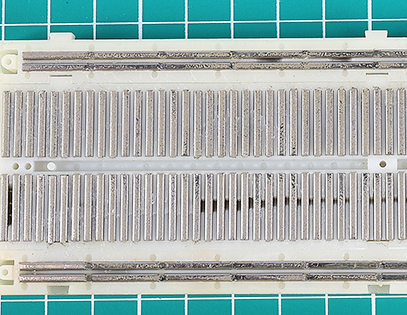
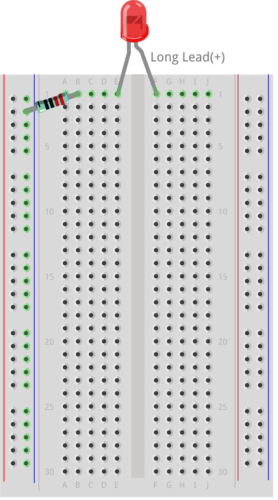
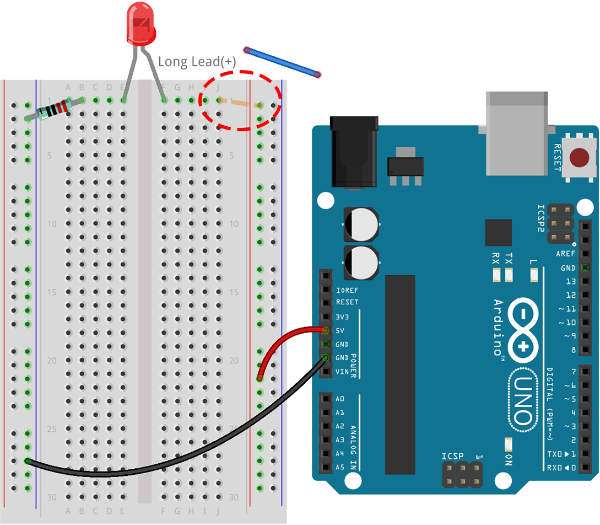

.. note::

    Hallo und herzlich willkommen in der SunFounder Raspberry Pi & Arduino & ESP32 Enthusiasten-Community auf Facebook! Tauche gemeinsam mit anderen Enthusiasten tiefer in die Welt von Raspberry Pi, Arduino und ESP32 ein.

    **Warum beitreten?**

    - **Expertenunterstützung**: Löse nach dem Kauf auftretende Probleme und technische Herausforderungen mit Hilfe unserer Community und unseres Teams.
    - **Lernen & Teilen**: Tausche Tipps und Anleitungen aus, um deine Fähigkeiten zu erweitern.
    - **Exklusive Vorschauen**: Erhalte frühzeitigen Zugang zu neuen Produktankündigungen und exklusiven Einblicken.
    - **Spezielle Rabatte**: Profitiere von exklusiven Rabatten auf unsere neuesten Produkte.
    - **Festliche Aktionen und Verlosungen**: Nimm an Verlosungen und Feiertagsaktionen teil.

    👉 Bereit, gemeinsam mit uns zu entdecken und zu erschaffen? Klicke auf [|link_sf_facebook|] und tritt noch heute bei!

.. _2_first_circuit:

2. Dein erster Schaltkreis
==============================

Willkommen in der faszinierenden Welt deines ersten Schaltkreises, wo ein einfacher Schalter deine Umgebung erhellen kann und ein Klick Geräte zum Leben erweckt. Diese Lektion ist dein Einstieg in das Verständnis der unsichtbaren Kraft des Stroms, die die Geräte antreibt, die wir täglich nutzen. Neugierig, wie deine Lieblingsgeräte funktionieren oder was Lampen zum Leuchten bringt? Es ist Zeit, in die praktische Erforschung des Schaltkreisbaus einzutauchen.

Am Anfang dieser Reise werden wir die Ursprünge des Stroms erforschen und die Wege der Elektronen nachverfolgen, während sie durch Schaltkreise fließen. Diese Lektion bietet eine praktische Einführung in die Bauteile eines Schaltkreises und deren Zusammenspiel zur Erfüllung unterschiedlicher Funktionen. Du wirst auch zum Elektronikdetektiv und lernst, wie du diese lebendige Kraft effektiv nutzen und messen kannst.

Mach dich bereit für aufregende Experimente! Hier ist, was du erreichen wirst:

* Verwende ein Steckbrett, um Schaltkreise einfach zu bauen.
* Lese Farbcodes von Widerständen, um den Stromfluss zu steuern.
* Verstehe, wie LEDs den Stromfluss regulieren.
* Lerne mehr über die Spannung des Arduino Uno R3.
* Erforsche, wie Elektronen durch einen Schaltkreis fließen.
* Erkenne verschiedene Arten von Schaltkreisen und ihre Funktionen.

Bist du bereit für dein erstes Schaltkreiserlebnis? Lass uns loslegen und diese spannende Reise beginnen!

Benötigte Komponenten
-------------------------

.. list-table:: 
   :widths: 25 25 25 25
   :header-rows: 0

   * - 1 * Arduino Uno R3
     - 1 * Rote LED
     - 1 * 220Ω Widerstand
     - Jumperkabel
   * - |list_uno_r3| 
     - |list_red_led| 
     - |list_220ohm| 
     - |list_wire| 
   * - 1 * USB-Kabel
     - 1 * Steckbrett
     -
     -   
   * - |list_usb_cable| 
     - |list_breadboard| 
     -
     - 

Steckbrett
-------------

1. Finde dein Steckbrett.

Das Steckbrett, das du verwendest, nennt sich lötfreies Steckbrett. Jedes Loch auf dem Steckbrett enthält einen Metallverbinder, der das Kabel beim Einstecken festhält. Dies verhindert, dass das Kabel herausgezogen wird und gewährleistet eine sichere Verbindung im Schaltkreis.

.. image:: img/2_breadboard_half.png
    :width: 500
    :align: center

Schon mal überlegt, warum das unverzichtbare Elektronikwerkzeug in deiner Hand denselben Namen trägt wie das Brett in der Küche zum Brotschneiden? Es steckt eine interessante Geschichte dahinter! In den Zeiten vor den 1970er Jahren wurden elektronische Geräte auf tatsächlichen Holzplatten, manchmal umfunktionierten Küchenbrettern, zusammengesetzt, indem Komponenten darauf genagelt oder geklebt und mit Drähten verbunden wurden.

Von den 1960er bis 1980er Jahren experimentierten Ingenieure mit dem Drahtwickeln für komplexere Schaltkreise, was halbpermanent war und spezielle Werkzeuge erforderte. Es wurde jedoch als zu umständlich und nicht für den wiederholten Einsatz geeignet angesehen.

.. image:: img/2_breadboard_wire_wrap.jpg
    :width: 500
    :align: center

Dann revolutionierte Ronald J. Portugal Anfang der 1970er Jahre das Prototyping mit der Erfindung des „lötfreien Steckbretts“. Dies machte den Schaltkreisaufbau schneller, einfacher und lötfrei. Dieses innovative Werkzeug verdrängte schnell das Drahtwickeln und führte zu den heute bekannten Steckbrettern, die nach ihren historischen Vorgängern benannt sind, aber für den modernen Anwender entwickelt wurden.

.. image:: img/2_breadboard_half.png
    :width: 500
    :align: center

Schon neugierig, was sich unter der Oberfläche eines Steckbretts verbirgt? Hinter der Plastikfassade und einer Schicht aus klebrigem Schaum, geschützt durch gelbes Papier, liegt das Herzstück des Steckbretts: Dutzende Metallstreifen.

.. note::
    Es ist am besten, diese Schutzschicht nicht abzuziehen. Wir haben es hier nur getan, um dir zu zeigen, was im Inneren steckt.

Wenn du (was wir dir dringend abraten) diese Metallteile mit einer Zange herausziehen würdest, würdest du feststellen, dass jedes Stück ein Metallclip mit kleinen Zähnen ist. Jeder Streifen hat fünf Zähne, die den fünf Löchern auf der Oberfläche des Steckbretts in jeder Reihe entsprechen. Die Stromschienen haben längere Streifen mit fünfzig Zähnen.

.. image:: img/2_breadboard_internal1.jpg
    :width: 500
    :align: center

Diese kleinen Zähne sind ideal, um die Beine elektronischer Bauteile festzuhalten. Wenn ein Bauteil in das Steckbrett eingeführt wird, öffnet sich der Clip leicht, um das Metallbein fest zu umschließen. Jedes andere Bauteil, das in dieselbe Reihe eingeführt wird, ist elektrisch verbunden.

.. image:: img/2_breadboard_internal2.jpg
    :width: 500
    :align: center

Dieses clevere Design ermöglicht einfaches und flexibles Prototyping ohne Löten, was Steckbretter zu einem unverzichtbaren Werkzeug für Elektronikbegeisterte und Profis gleichermaßen macht.

Die meisten Steckbretter haben einige Zahlen, Buchstaben sowie Plus- und Minuszeichen auf ihnen. Auch wenn die Beschriftungen von Steckbrett zu Steckbrett variieren, bleibt die Funktion im Wesentlichen gleich. Diese Markierungen ermöglichen es dir, die entsprechenden Löcher beim Aufbau deines Schaltkreises schneller zu finden. Die Zeilennummern und Spaltenbuchstaben helfen dir, die Löcher auf dem Steckbrett genau zu lokalisieren, zum Beispiel befindet sich das Loch "C15" dort, wo sich Spalte C und Zeile 15 schneiden.

.. image:: img/2_breadboard_letter_number.jpg
    :width: 500
    :align: center

Die Seiten des Steckbretts sind in der Regel durch rote und blaue (oder andere Farben) sowie Plus- und Minuszeichen gekennzeichnet und werden üblicherweise zum Anschluss an die Stromversorgung verwendet, bekannt als Stromschiene.
Beim Aufbau eines Schaltkreises wird normalerweise der Minuspol an die blaue (-) Spalte und der Pluspol an die rote (+) Spalte angeschlossen.

.. image:: img/2_breadboard_plus_minus.jpg
    :width: 500
    :align: center

Widerstand
---------------------

2. Finde einen 220-Ohm-Widerstand.

.. image:: img/2_220_resistor.png
    :align: center

Widerstände helfen dabei, den Stromfluss in einem Schaltkreis zu steuern, indem sie elektrische Energie in Wärme umwandeln. Jeder Widerstand hat zwei Drähte, einen an jedem Ende, durch die Strom in beide Richtungen fließen kann. Das bedeutet, dass sie in beliebiger Richtung im Schaltkreis platziert werden können.

Der Ohm-Wert eines Widerstands gibt an, wie viel Widerstand er hinzufügt. Ein höherer Ohm-Wert bedeutet mehr Widerstand. Zum Beispiel fügt ein 220-Ohm-Widerstand 220 Ohm Widerstand hinzu, und ein 10-Kiloohm-Widerstand fügt 10 Kiloohm hinzu.

Um den Wert eines Widerstands abzulesen, überprüfe die Farbbänder. Diese Tabelle erklärt die Bedeutung jedes Farbbands auf einem Widerstand. Der Multiplikator wird in wissenschaftlicher Notation dargestellt, wobei der Exponent die Anzahl der Nullen angibt, die der Zahl, die durch die Farbbänder dargestellt wird, hinzugefügt werden. Ein 4-Band-Widerstand, der oben auf der Tabelle angezeigt wird, beginnt mit einem grünen Band. Grün steht für die Zahl 5, also beginnt der Widerstandswert mit 5. Das zweite Band ist braun, daher ist die nächste Zahl 1. Das Multiplikatorband ist rot und hat den Wert 2, was bedeutet, dass zwei Nullen hinzugefügt werden. Dies ergibt einen Gesamtwiderstand von 5100 Ohm oder 5,1 Kiloohm (5,1kΩ).

.. image:: img/2_resistor_card.png

Die hier gezeigte Tabelle stellt alle Widerstände dar, die in deinem Kit enthalten sind. Für diese Lektion verwenden wir einen 220-Ohm-Widerstand.

.. image:: img/2_all_resistor.png
    :width: 500
    :align: center

3. Biege die Anschlüsse des Widerstands so, dass sie in dieselbe Richtung zeigen.

.. image:: img/2_220_resistor_pin.png
    :width: 200
    :align: center

4. Setze ein Ende des Widerstands in das obere Loch der negativen Seite des Steckbretts ein, um den Widerstand mit der Stromquelle zu verbinden. Setze das andere Ende des 220-Ohm-Widerstands in das Loch 1b des Steckbretts.

    .. note::
        
        Widerstände sind nicht polarisiert, was bedeutet, dass ihre Richtung im Schaltkreis keine Rolle spielt.

.. image:: img/2_connect_resistor.png
    :width: 300
    :align: center

LED
-----------------

5. Finde die rote LED.

.. image:: img/2_red_led.png
    :align: center

LEDs (Leuchtdioden) sind spezielle elektronische Bauteile, die Licht abgeben, wenn Strom in einer bestimmten Richtung durch sie fließt.

.. image:: img/2_led_polarity.jpg
    :width: 200
    :align: center

Die häufigsten LED-Farben sind Rot, Gelb, Blau, Grün und Weiß, wobei das ausgestrahlte Licht normalerweise der Farbe der LED entspricht.

.. image:: img/2_led_color.png
    :width: 600
    :align: center

Diese Bauteile haben zwei Anschlüsse: einen längeren, der als Anode bezeichnet wird, und einen kürzeren, der Kathode genannt wird. Damit sie ordnungsgemäß funktionieren, sollte die Anode mit dem Pluspol der Stromquelle und die Kathode mit dem Minuspol oder der Erde verbunden sein. Einige LEDs haben an der Seite der Kathode eine abgeflachte Kante, die bei der richtigen Platzierung hilft.

.. image:: img/2_led_pin.jpg
    :width: 100
    :align: center

6. Setze die Kathode der LED (den kurzen Anschluss) in das Loch 1e des Steckbretts. Dadurch wird die LED mit dem 220Ω-Widerstand verbunden. Denke daran, dass die Löcher 1b und 1e unter dem Steckbrett verbunden sind.

.. note::

    LEDs sind polarisiert, das heißt, der Strom kann nur in einer Richtung durch sie fließen. Wenn die LED nicht leuchtet, versuche, die Anschlüsse zu tauschen.

Jumperkabel
----------------------

7. Finde ein Jumperkabel.

Dein Kit enthält Jumperkabel in verschiedenen Farben und Längen, die alle die gleiche Funktion erfüllen. Verwende verschiedene Farben zur leichteren Identifizierung des Schaltkreises und kürzere Kabel für ein aufgeräumtes Setup. Jedes Kabel besteht aus einem leitfähigen Kern und einer isolierenden Beschichtung, um unbeabsichtigte Kontakte zu verhindern.

.. image:: img/2_wire_color.jpg
    :width: 500
    :align: center

8. Setze ein Ende des Jumperkabels in das Loch 1j auf dem Steckbrett. Dies verbindet das Jumperkabel mit der LED, da die Löcher 1f und 1j unter dem Steckbrett miteinander verbunden sind. Setze das andere Ende des Jumperkabels in das obere Loch der positiven Schiene des Steckbretts. Jetzt verbindet das Jumperkabel die LED und das Erdungskabel miteinander.

.. image:: img/2_connect_wire.png
    :width: 300
    :align: center

Arduino Uno R3
-------------------

9. Finde dein Arduino Uno R3.

.. image:: img/1_uno_board.png
    :width: 400
    :align: center

In dieser Lektion verwenden wir das Arduino Uno R3 als Stromquelle. Sein 5V-Pin dient als Pluspol und der GND-Pin als Minuspol, und versorgt den Schaltkreis mit einer stabilen Spannung von 5V.

.. image:: img/1_uno_power_pin.png
    :width: 500
    :align: center

Das direkte Anschließen der Stromversorgung ohne Last kann jedoch zu einem Kurzschluss führen, der Wärme erzeugt und möglicherweise Schäden oder Brände verursacht. Füge immer eine Last, wie eine LED oder einen Widerstand, hinzu, um Kurzschlüsse zu vermeiden.

.. image:: img/2_short_circuit.png
    :width: 500
    :align: center

10. Verbinde ein Kabel von der positiven Schiene auf der rechten Seite des Steckbretts mit dem 5V-Pin des Arduino Uno R3. Es wird empfohlen, ein rotes oder oranges Kabel zu verwenden, um den Pluspol darzustellen. Dies kann besonders bei komplexen Projekten hilfreich sein, um die Verbindungen schnell zu identifizieren.

.. image:: img/2_uno_5v.png
    :width: 600
    :align: center

11. Schließlich verbinde ein Kabel von der negativen Schiene auf der linken Seite des Steckbretts mit dem GND-Pin des Arduino Uno R3. Ein schwarzes oder grünes Kabel wird für die Konsistenz empfohlen, wobei dieselbe Farbe verwendet wird, um den Minuspol in allen Schaltkreisen darzustellen.

.. image:: img/2_uno_gnd.png
    :width: 600
    :align: center

12. Schließe zuletzt das Arduino Uno R3 über das im Kit enthaltene USB-Kabel an einen Computer oder eine Steckdose an, und die LED sollte aufleuchten.

    .. image:: img/2_first_circuit.png
        :width: 600
        :align: center

Nachdem du dein Arduino Uno R3 verbunden und die LED aufleuchten gesehen hast, betrachtest du nicht nur einen einfachen Schaltkreis – du beobachtest die Grundlagen der Elektrizität in Aktion. Lass uns erkunden, was deinen Schaltkreis zum Leben erweckt.

Verständnis von Elektrizität in Schaltkreisen
-----------------------------------------------------

**Grundlagen der Elektrizität**

Der Fluss von Elektronen vom Minuspol zum Pluspol ist das, was wir als tatsächlichen Elektronenfluss verstehen. Ursprünglich glaubten Wissenschaftler wie Ben Franklin, dass der Strom die Bewegung positiver Ladungen sei, weshalb der konventionelle Stromfluss als vom Plus- zum Minuspol definiert wurde.

.. image:: img/2_uno_current.png
    :width: 600
    :align: center

In Wirklichkeit bewegen sich jedoch Elektronen, die eine negative Ladung tragen, vom Minus- zum Pluspol. Die meisten Länder verwenden heute noch das Modell des konventionellen Stromflusses. In Diagrammen und beim Entwurf elektronischer Komponenten wird daher der Strom als vom Plus- zum Minuspol fließend dargestellt, obwohl die Elektronen in die entgegengesetzte Richtung fließen.

.. image:: img/2_uno_electron.png
    :width: 600
    :align: center

* **A** Konventionelle Stromrichtung
* **B** Tatsächliche Elektronenflussrichtung
* **C** Elektronen (nicht maßstabsgetreu)
* **D** Draht

Es gibt zwei Arten von Strom, die von einer Stromquelle erzeugt werden: Wechselstrom (AC) und Gleichstrom (DC). Eine Batterie oder ein Mikrocontroller wie das Arduino Uno R3 liefert Gleichstrom, bei dem der Strom in eine Richtung fließt – vom Plus- zum Minuspol.

Beim Wechselstrom ändert der Strom jedoch periodisch seine Richtung. Die Spannung im Schaltkreis kehrt sich um, während sich die Richtung des Stroms ändert, wodurch er in die entgegengesetzte Richtung fließt. Die meisten Häuser und Gebäude werden mit Wechselstrom betrieben, wie die 120 Volt bei 60 Hz aus Steckdosen in amerikanischen Haushalten oder 220 Volt bei 50 Hz in vielen europäischen Haushalten.

**Sicherheit in Schaltkreisen**

Beim Anschließen einer Stromquelle ist es ratsam, zuerst den Pluspol mit dem Schaltkreis zu verbinden und dann den Minuspol. Umgekehrt solltest du beim Trennen den Minuspol zuerst entfernen, um Kurzschlüsse zu vermeiden. In diesem Kurs verwenden wir niedrige Spannungen und Ströme, sodass keine Gefahr eines Stromschlags oder einer Verletzung besteht. Aber gute Sicherheitspraktiken können Verletzungen bei der Arbeit mit höheren Spannungen und Strömen verhindern, wie etwa beim Wechseln von Autobatterien oder Reparieren von Steckdosen.

**Geschlossene und offene Schaltkreise**

Wenn der Strom durch die LED, den Widerstand, die Jumperkabel und zurück in die negative Schiene des Steckbretts fließt, bildet er einen geschlossenen Schaltkreis. Wenn du ein Kabel vom Steckbrett entfernst, erlischt die LED, weil der Stromfluss gestoppt wird – der Schaltkreis ist nun offen.

Durch das Beherrschen dieser Grundlagen bist du auf dem besten Weg, komplexere Elektronik zu verstehen und zu entwerfen, die unsere Welt antreibt.

**Fragen:**

1. Entferne das rote Kabel vom Steckbrett und experimentiere, indem du es in verschiedene Löcher auf dem Steckbrett steckst. Beobachte, ob sich die LED verändert. Skizziere die Positionen der Löcher, die die LED zum Leuchten bringen.

.. image:: img/2_uno_gnd.png
    :width: 600
    :align: center

2. Was passiert, wenn du die Anschlüsse der LED vertauschst? Wird sie leuchten? Warum oder warum nicht?

