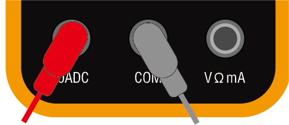
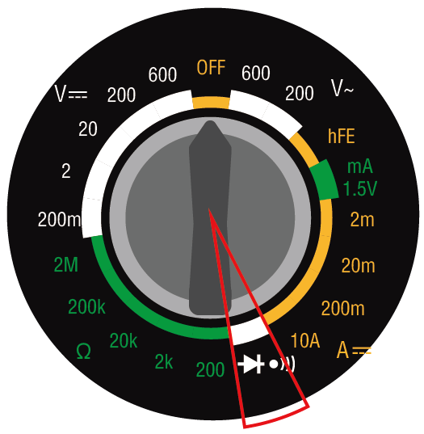

3.1 Introduction to the Multimeter
==========================================

In this lesson, we'll explore the multimeter, an indispensable tool for measuring electrical properties, tracing its origins and learning how to utilize its diverse functions. Get ready to master the art of electrical measurements with ease!

Measuring Electricity: A Necessity Turned Invention
-----------------------------------------------------

Once upon a time in the 1920s, there was a smart engineer named Donald Macadie, who worked for the British Post Office. His big challenge was carrying lots of tools to measure electricity—current, voltage, and resistance, which was quite the hassle. Imagining a simpler way, Donald envisioned a single device that could do all three measurements. This idea led to the creation of the AVOmeter, a cleverly named device for Amperes, Volts, and Ohms—the essential electrical measurements.

* The picture comes from |link_wiki_avometer|.

Donald made his idea a reality, inventing the AVOmeter and securing a patent for it. This device revolutionized the way engineers worked by condensing several tools into one, making their jobs much easier.

The AVOmeter paved the way for modern multimeters, evolving over time into the advanced tools we use today. Whether analog or digital, today's multimeters trace back to Donald Macadie's original invention, showcasing how a simple idea can significantly impact our world, streamlining work and making it more efficient.

Multimeter
--------------

A multimeter is a device used to measure various electrical properties. Most multimeters can measure voltage, current, resistance, and continuity (whether electricity can flow). 

**Preparing the Multimeter**

Before using the multimeter, you need to install the battery and connect the two test leads, so it's ready to use at any time.

1. Follow the video below to connect the battery to your multimeter.

  .. raw:: html

      <video width="600" loop autoplay muted>
          <source src="_static/video/multimeter_battery.mp4" type="video/mp4">
          Your browser does not support the video tag.
      </video>

2. Find your multimeter and the red and black test leads. Ensure the multimeter is in the "off" position. Insert the black test lead into the COM port of the multimeter. Insert the red test lead into the voltage-ohm-milliamp (VΩmA) port.

.. image:: img/multimeter_test_wire.png
  :width: 300
  :align: center

The dial on the multimeter allows you to select the type of electrical measurement and the range you wish to measure in. Now, let's explore the various functions available on the dial.

.. image:: img/multimeter_dashboard.png
    :width: 300
    :align: center

**DC Voltage**
 
In this image, the selected position is used for measuring direct current (DC) voltage.Voltage is represented by a capital V. DC is denoted by three dashed lines with a straight line above them.

Your multimeter has five different DC voltage ranges — 200m (millivolts), 2V (volts), 20V (volts), 200V (volts), and 600V (volts). These numbers represent the maximum voltage that can be measured in each setting.

.. note::

    Here's the conversion between Volts:

    * 1 volt (V) = 1 volt (V)
    * 1 millivolt (mV) = 0.001 volt (V)

    For example, if you have a voltage of 500 millivolts (mV), it can also be expressed as 0.5 volts (V).

.. image:: img/multimeter_dc.png
    :width: 300
    :align: center

**Measuring Method**: Before measuring voltage, you need to select an appropriate measuring range. In all of our courses, the circuit voltage will not exceed 5V, so you can simply select the 20V position. When the circuit is functioning normally, you can test the voltage by placing the red and black test leads on either side of the device.

**AC Voltage**

This image shows the setting for measuring alternating current (AC) voltage. AC is represented by a wavy line.

.. image:: img/multimeter_ac.png
    :width: 300
    :align: center

**Current**

For measuring current, the multimeter has settings for 200μ (200 microamp), 2m (2 milliamp), 20m (20 milliamp), 200m (200 milliamp), and 10A (10 amp).

.. note::

    Here's the conversion between amperes:

    * 1 ampere (A) = 1 ampere (A)
    * 1 milliampere (mA) = 0.001 ampere (A)
    * 1 microampere (μA) = 0.000001 ampere (A)

    For example, if you have a current of 50 milliamperes (mA), it can also be expressed as 0.05 amperes (A).

.. image:: img/multimeter_current.png
    :width: 300
    :align: center

To measure currents less than 200 milliamps, you can insert the red test lead into the VΩmA port. Then, turn the dial to one of the milliamp settings. The circuits you build in this course and project will always have currents less than 200 mA.

For measuring currents up to 10 amperes, you must insert the red test lead into the 10ADC port. Then, turn the dial to the 10A setting.

**Measuring Method**: To measure the current in a circuit, the multimeter must be inserted into the circuit. In other words, it must become part of the circuit. This is different from measuring voltage or resistance, which can be done by across a component in the circuit. You will have the opportunity to make these measurements later when you start building circuits.

**Transistors**

The hFE NPN PNP setting is for measuring transistors. You will not use this setting in this course.

.. image:: img/multimeter_hfe.png
    :width: 300
    :align: center

**Continuity**

The setting with a diode symbol and a sound icon is used for measuring continuity. When measuring continuity, if there can be current flow between the test leads, the multimeter will emit a "beep" sound.

**Resistance**

The final set of options on the multimeter is designated for assessing resistance, symbolized by the Greek letter omega (Ω). Typically, multimeters offer a variety of ranges for resistance measurements. This particular multimeter is equipped with five ranges: 200 ohms, 2k (2,000 ohms), 20k (20,000 ohms), 200k (200,000 ohms), and 2M (2,000,000 ohms). Each range specifies the highest resistance value it can accurately measure. To achieve the most precise readings, select a range that can measure the resistance without surpassing its upper limit.

.. note::

    Here's the conversion between ohms:

    * 1 ohm (Ω) = 1 ohm (Ω)
    * 1 kilohm (kΩ) = 1000 ohms (Ω)
    * 1 megohm (MΩ) = 1000000 ohms (Ω)

For example, if you have a resistance of 1000 ohms (Ω), it can also be expressed as 1 kilohm (kΩ).

.. image:: img/multimeter_resistance.png
    :width: 300
    :align: center

**Tips**

During the measurement of resistance, voltage, or current, you might notice that the values on the display tend to vary. To stabilize and capture a specific reading, you can utilize the HOLD feature. This action freezes the current value on the display, where it stays until the HOLD button is pressed once more.

If you're uncertain about the appropriate range to choose for measuring voltage, current, or resistance, it's advisable to begin with the maximum range available. This approach provides an initial estimate of the values you're working with, allowing you to subsequently narrow down to a more accurate range for precise measurements.

**Question**: 

Now that you have a detailed understanding of how to use a multimeter, consider which multimeter setting you would use to measure the following electrical values?

    * 12 volts DC
    * 220 ohms
    * 25 milliamps
    * 220 volts AC
