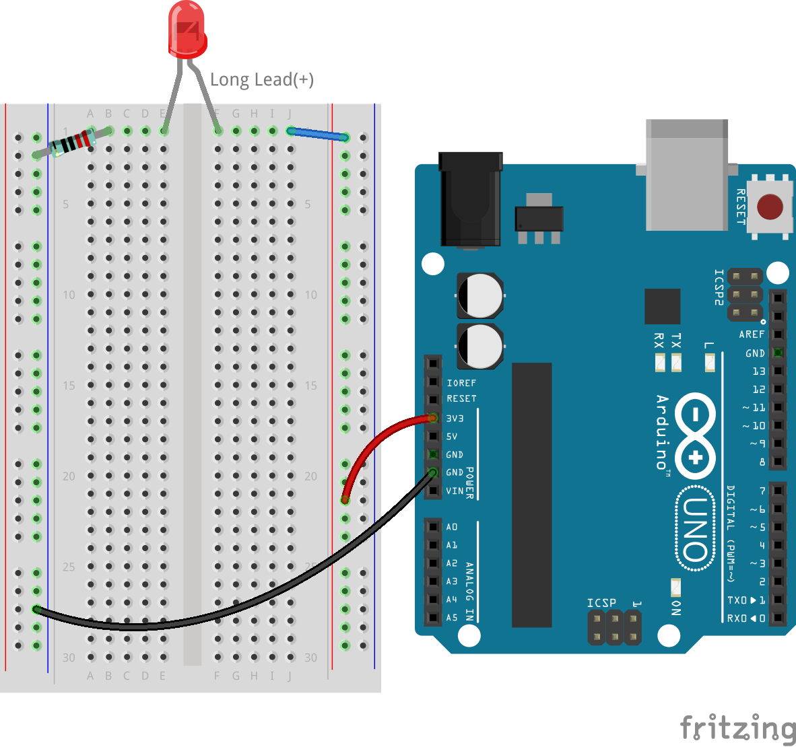

3.2 Using a Multimeter
======================
In the previous lesson, we became familiar with the various functions of the multimeter. In this lesson, you will learn how to measure voltage and current in a circuit using a multimeter. Please be patient and follow along with the operations.

Building an LED Circuit
------------------------------

In the previous chapter, we built a circuit that lights up an LED directly from the 5V and GND pins of the R3 board. Here, we'll adjust this circuit to control the LED's on/off state with pin 13 on the R3 board. Now, let's see how to do it.

**Components Needed**

* 1 * R3 Board
* 1 * Red LED
* 1 * 220Ω Resistor
* Several Jumper Wires
* 1 * USB Cable
* 1 * Breadboard
* 1 * Multimeter with Test Leads

**Building the Circuit**

Take the circuit built in :ref:`2.2_build_circuit`, and switch the wire from the 5V to pin 13, as shown in the image below

.. image:: img/3_led_circuit.png
    :width: 600
    :align: center

If you've dismantled the previous circuit, you can rebuild it following these steps:

1. Connect the 220 ohm resistor to the breadboard. One wire should be in the negative terminal, and the other wire should be in hole 1B.

.. image:: img/2_connect_resistor.png
    :width: 300
    :align: center

2. Add a red LED to the breadboard. The LED's anode (long leg) should be in hole 1F. The cathode (short leg) should be in hole 1E. Sometimes it's hard to distinguish the anode from the cathode by the length of the legs. Remember, the cathode side of the LED also has a flat edge on the colored lens, while the anode has a round edge.

.. image:: img/2_connect_led.png
    :width: 300
    :align: center

3. Use a short jumper wire to connect the LED and the power source. One end of the jumper wire should be in hole 1J. The other end should be in the positive terminal.

.. image:: img/2_connect_wire.png
    :width: 300
    :align: center

4. Connect the breadboard's positive terminal to pin 13 on the R3 board.

.. image:: img/3_led_circuit_13.png
    :width: 600
    :align: center

5. Connect the breadboard's negative terminal to one of the ground pins on the R3 board. The ground pins are marked as "GND".

.. image:: img/3_led_circuit.png
    :width: 600
    :align: center

Uploading Code
--------------------

Let's light up the LED with the ``Blink.ino`` from Arduino's example codes.

1. In the Arduino IDE, click on **File** -> **Examples** -> **Basic** -> **Blink**.  The Blink sketch will open in a new Arduino IDE window.

    A sketch is a program for the Arduino, crafted in the IDE and uploaded to the board, guiding it on the actions to perform, as practiced earlier in this course.

      .. image:: img/1_ide_open_blink.png
          :align: center

2. Before uploading the program, change the timing in the following two lines of the sketch to ``5000`` to slow down the LED's blinking speed.

    .. code-block:: C
        :emphasize-lines: 9,11

        void setup() {
            // initialize digital pin LED_BUILTIN as an output.
            pinMode(LED_BUILTIN, OUTPUT);
        }

        // the loop function runs over and over again forever
        void loop() {
            digitalWrite(LED_BUILTIN, HIGH);  // turn the LED on (HIGH is the voltage level)
            delay(5000);                      // wait for 5 seconds
            digitalWrite(LED_BUILTIN, LOW);   // turn the LED off by making the voltage LOW
            delay(5000);                      // wait for 5 seconds
        }

3. Connect your R3 board to your computer with a USB cable. It's like plugging in a secret doorway to endless possibilities!

    .. raw:: html

        <video width="600" loop autoplay muted>
            <source src="_static/video/connect_board.mp4" type="video/mp4">
            Your browser does not support the video tag.
        </video>

4. Now, let's tell the IDE we're using an **Arduino Uno**. Click **Tools** -> **Board** -> **Arduino AVR Boards** -> **Arduino Uno**.

    .. image:: img/1_ide_select_board.png
        :align: center

5. We also need to pick the right port, like choosing the correct door to send our message through. Click **Tools** -> **Port**. 

    .. note::

        * On Windows computers, this may be the word "COM" followed by a number(not COM1).
        * On Mac computers, the port might resemble "/dev/tty.usbmodem".
        * In Linux computers, the port is called "/dev/ttyACM", followed by a number.

    .. image:: img/1_ide_select_port.png
        :align: center

6. Once it shows "Done Upload," the code will run, and you should see the external red LED blink at 5-second intervals. The built-in LED near pin 13 on the R3 board should also blink.

.. note::

  * If the LED does not light up, try reversing the LED's pins.

  * Keep this sketch running during the measurements below, do not disconnect the USB cable.

Measuring with a Multimeter
--------------------------------

In the previous lesson, you learned about Ohm's Law — the relationship between voltage, current, and resistance. You will use the circuit you just built to test Ohm's Law.
For this activity, you will need your blinking LED circuit, multimeter, and handbook.

**Preparing the Multimeter**

Before using the multimeter, you need to install the battery and connect the two test leads, so it's ready to use at any time.

1. Follow the video below to connect the battery to your multimeter.

  .. raw:: html

      <video width="600" loop autoplay muted>
          <source src="_static/video/multimeter_battery.mp4" type="video/mp4">
          Your browser does not support the video tag.
      </video>

2. Find your multimeter and the red and black test leads. Ensure the multimeter is in the "off" position. Insert the black test lead into the COM port of the multimeter. Insert the red test lead into the voltage-ohm-milliamp (VΩmA) port.

.. image:: img/multimeter_test_wire.png
  :width: 300
  :align: center

**Measuring Voltage**

1. Turn the multimeter to the 20 volts DC setting.

.. image:: img/multimeter_dc_20v.png
  :width: 300
  :align: center

2. Slightly pull apart the positive and negative wires on the breadboard to expose the metal ends without fully detaching them.

3. Then, touch the exposed metal ends with the multimeter's red and black test leads to measure the voltage.

.. image:: img/3_measure_volmeter.png

4. You will find that the voltage displayed by the multimeter is 0V when the LED is off and close to 5V when it is on. Record the voltage when the LED is on in Lesson 3 of your handbook. You can also record the observed phenomena in the Notes column.

.. note::

    * Mine was 4.77V, fill in according to your measurement.

    * Due to wiring issues and instability of your hand, you may see the voltage fluctuate. Keep your hand steady, observe a few times, and you will get a fairly stable voltage reading.

.. list-table::
   :widths: 25 25 50 25
   :header-rows: 1

   * - Type
     - Units
     - Measurement when LED is ON
     - Notes
   * - Voltage
     - Volts
     - *≈4.77 volts*
     - 
   * - Current
     - Milliamps
     - 
     - 
   * - Resistance
     - Ohms
     - 
     -

5. Finally, reinsert all the jumper wires into the breadboard to prevent them from being pulled out while you conduct other measurements.

**Measuring Current**

You have measured the voltage in the circuit. Next, you will measure the current in the circuit.

1. For current measurement, the multimeter needs to be integrated into the circuit's flow path, essentially becoming a segment of the circuit's conductive route. A straightforward method involves adjusting the LED's placement: keep the LED's anode in hole 1F while shifting its cathode (the shorter leg) from hole 1E to hole 3E.

.. image:: img/3_measure_current.png

2. Set the multimeter to the 200 milliamps position.

.. image:: img/multimeter_200ma.png
  :width: 300
  :align: center

3. Place the black test lead on the wire connected to hole 1B and the red test lead on the LED's cathode in hole 3E. Completing this setup, the red LED should begin to blink.

  .. note::

    When measuring voltage across the resistor and LED, ensuring a solid connection with the multimeter test leads can be tricky. To get a better grip, attach the test leads where the component legs enter the breadboard. This way, you can press down harder without dislodging anything.

.. image:: img/3_measure_current2.png

4. You will find the read current is less than 20mA, so we can switch to the 20mA position to get a more accurate reading.

.. image:: img/multimeter_20a.png
  :width: 300
  :align: center

5. Measure and record the current in the circuit when the LED is lit, in milliamps.

.. note::

  Please be aware that fluctuations in the measured current are normal due to various factors such as contact stability, power supply variations, and temperature effects. We recommend simply recording the current value you measure at any given moment. If the value is within theoretical expectations, it should be considered acceptable.

  
.. list-table::
   :widths: 25 25 50 25
   :header-rows: 1

   * - Type
     - Units
     - Measurement when LED is ON
     - Notes
   * - Voltage
     - Volts
     - *≈4.77 volts*
     - 
   * - Current
     - Milliamps
     - *≈11.59 milliamps*
     - 
   * - Resistance
     - Ohms
     - 
     -

6. Put the LED back in its original position, with the anode in hole 1F and the cathode in hole 1E.

**Calculating Total Resistance**

Measuring resistance in a circuit with a multimeter gets tricky when LEDs are involved, because LEDs need a specific amount of voltage to turn on, called the forward voltage. If the voltage isn't high enough, the LED won't light up, and the circuit stays open, which complicates measuring resistance. Moreover, you can't have any voltage in the circuit other than what's coming from the multimeter when you're trying to measure resistance.

So, directly measuring the circuit's resistance with a multimeter isn't straightforward. What should we do then?

In Lesson 2, you learned about Ohm's Law — the relationship between voltage, current, and resistance. Remember, Ohm's Law states:

.. code-block::

    Voltage = Current x Resistance

    Or

    V = I • R

When rearranged, the equation becomes:

.. code-block::

    Resistance = Voltage / Current

    Or

    R = V / I

Using the formula above, with the voltage and current you measured, you can calculate the total resistance in the circuit and fill it into the table.

.. note::

    Voltage is in volts, resistance is in ohms, and current in the table is in milliamps, you need to convert milliamps to amperes:

    1 Amps = 1000 Milliamps

    Meaning you need to divide the measured current by 1000 before using the formula to calculate total resistance. The final calculated result may not be a whole number, please round to two decimal places. For example, my calculated value is 411.56169111302, which I round to 411.56.

    R = 4.77 / (11.59 / 1000) = 411.56 ohms

.. list-table::
   :widths: 25 25 50 25
   :header-rows: 1

   * - Type
     - Units
     - Measurement when LED is ON
     - Notes
   * - Voltage
     - Volts
     - *≈4.77 volts*
     - 
   * - Current
     - Milliamps
     - *≈11.59 milliamps*
     - 
   * - Resistance
     - Ohms
     - *≈411.56 ohms*
     -

**Measuring the Resistance Value**

Now that we've figured out the circuit's total resistance, it's time to see how much of it is because of the resistor and how much is due to the LED. Our resistor is marked as 220 ohms, but with a 1% tolerance, it could actually be anywhere from 217 to 222 ohms. Let's use the multimeter to find out its exact value.

1. When measuring resistance, your multimeter has to act as the only source of voltage; make sure there are no other power sources connected to the circuit. So, unplug any jumper wires from the R3 board to ensure the breadboard is isolated.

.. image:: img/3_measure_resistance.png
  :width: 600
  :align: center

2. For an accurate measure of the resistor's resistance, dial your multimeter to the 2K (2000 ohms) resistance mode.

.. image:: img/multimeter_2k.png
  :width: 300
  :align: center

3. Place the multimeter's red and black test leads on either side of the resistor, and record the reading from the multimeter.

.. note::

  Since you selected the 2K range, the resistance you see on the multimeter should be similar to ``.218 ~ .222``, my reading was ``.218``, which represents ``0.218k`` ohms, translating to ``218`` ohms.

.. image:: img/3_measure_resistor.png

4. After measuring, remember to turn the multimeter off by setting it to the "OFF" position.

**Calculating the LED's Resistance**

To determine the LED's resistance, subtract the resistor's resistance from the total resistance in the circuit.

.. code-block::

    LED Resistance = Total Resistance - Resistor's Resistance

So, according to my measurements, the LED's resistance should be: 411.56 - 218 = 193.56 ohms.

We've taken a hands-on journey through the essentials of using a multimeter to measure voltage, current, and resistance in a circuit. From building a simple LED circuit to delving into the nuances of measuring resistance in circuits with LEDs, we've explored how to practically apply Ohm's Law and understand the dynamics of series and parallel circuits. As we move forward, remember that these foundational skills lay the groundwork for more complex projects and deeper understanding of electronics. Keep experimenting, keep learning, and let's continue to illuminate the path of electronic exploration together.

**Question:**

Now that we can measure voltage, current, and calculate resistance, what change in LED brightness might occur if we switch the wire from the R3 board's pin 13 to the 3.3v pin? Measure the current in the circuit now to verify your answer.

