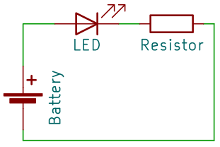

3.3 Serial Circuit
========================

Here, we'll explore the differences between series and parallel circuits, focusing mainly on constructing a series circuit. Through hands-on activities, we'll understand the characteristic feature of a series circuit: the total voltage is equal to the sum of the voltages across each component. This lesson not only deepens our understanding of circuit design but also equips us with practical skills in electrical measurement.

Series Circuit vs. Parallel Circuit
------------------------------------------

In our previous lessons, we've successfully constructed a simple circuit with an R3 Board, a resistor, and an LED. The current in this setup flows in a series configuration: from the board's Pin 13 pin, through the LED, through the resistor, and back to the GND pin. This is a straightforward example of a series circuit.

But as we delve deeper into the world of electronics, we encounter circuits that are more complex, comprising components arranged in series or parallel. To comprehend these arrangements and their implications on current and voltage, we need to familiarize ourselves with circuit diagrams, also known as schematic diagrams.

**Wiring Diagrams vs. Schematic Diagrams**

We've been using wiring diagrams—pictorial representations that mimic the physical layout of circuit components. These diagrams are intuitive and serve well for assembly purposes:

.. image:: img/3_led_circuit.png
    :width: 600
    :align: center

However, to grasp a circuit's functionality and design logic, schematic diagrams are indispensable. Schematic diagrams distill circuits down to their essence, using standardized symbols to represent each component. They reveal the electrical relationships between components without the clutter of physical layouts.

Here are the symbols for a LED, a resistor, and a battery that you'll often find in schematics:

.. image:: img/3_led_resistor_symbol.png
  :align: center

A schematic diagram based on our previous wiring would look like this, with the entire R3 board acting as a battery powering the circuit. From this schematic, you can clearly indicate the flow and direction of current, simplifying the complexity of physical connections.

**Series vs. Parallel Configurations**

In a series circuit, components are lined up in a row, so the current has a single path to follow. If one component fails, the entire circuit is interrupted—much like a string of old Christmas lights where one burnt-out bulb would darken the whole chain.

.. image:: img/3_serial_circuit_2led.png
  :align: center

A parallel circuit, on the other hand, divides the current into multiple paths. Each component operates independently, so if one path is broken, the others continue to function. Think of your home's electrical system: if you switch off a light, the TV can still be on.

.. image:: img/3_parallel_circuit.png
  :align: center

Diving into Series Circuits
------------------------------

Building on our understanding of the differences between series and parallel circuits, this activity focuses on constructing a series circuit with multiple LEDs. Remember, in a series circuit, the electrical current flows through a single pathway. Let's explore the unique characteristics of series circuits through this practical exercise.

**Components Needed**

* 1 * R3 Board
* 3 * Red LEDs
* 1 * 220Ω Resistor
* Several Jumper Wires
* 1 * USB Cable
* 1 * Breadboard
* 1 * Multimeter with Test Leads

**Building the Circuit**

1. Adjust the previous LED circuit by removing the jumper wire between 1J and the breadboard's positive side on the right. Then, take another red LED and insert its cathode (the shorter leg) into 1J, and the anode into the breadboard's positive side, so you can serially connect another LED in the circuit.

.. image:: img/3_serial_circuit.png

2. Plug the USB cable from your computer into the USB port of the R3 board. Once the board is powered, it should continue running the blinking program. You should see two red LEDs in the circuit blinking at intervals of 5 seconds.

Now you have a series circuit with two LEDs. Follow the current through the circuit:

* Current flows from pin 13 on the R3 board, through a long jumper wire to the breadboard's positive terminal.
* Then the current flows through the first LED, lighting it up due to the flow of current.
* The current then flows through the breadboard's metal clips to the second LED, which also lights up.
* After leaving the second LED, it enters the 220Ω resistor, where it encounters resistance, reducing the amount of current. Without this resistor, the current through the LEDs would be too high and could burn them out.
* It then flows back to the R3 board's ground pin, completing the circuit.

**Question:** 

In this series circuit, what happens if you remove one LED? Why does this occur? Record your answer in the series circuit section of Lesson 3 in your handbook.

.. image:: img/3_serial_circuit_remove.png
    :width: 600
    :align: center

**Measuring Voltage**

1. Set the multimeter to the 20 volts DC setting.

.. image:: img/multimeter_dc_20v.png
    :width: 300
    :align: center

2. With the dual LED circuit illuminated, use the multimeter to measure the voltage across the resistor.

    .. note::
        
        Measuring a component's voltage in a circuit means checking the voltage across it. Essentially, voltage represents the energy difference between two points. So, when you measure a component's voltage, you're gauging the energy difference from one side to the other.

.. image:: img/3_serial_circuit_voltage_resistor.png
    :width: 600
    :align: center

3. Record the voltage across the resistor in the series circuit table of Lesson 3 in your handbook, voltage unit: Volts (V).

.. note::

    * Mine was 1.13V, you should fill in according to your measurement.

    * Due to wiring issues and your hand's instability, you may see the voltage fluctuate. You need to keep your hand steady, then observe several times to get a fairly stable voltage value.

.. list-table::
   :widths: 25 25 25 25 25
   :header-rows: 1

   * - Circuit
     - Resistor Voltage
     - LED1 Voltage
     - LED2 Voltage
     - Total Voltage 
   * - 2 LEDs
     - *≈1.13 volts*
     - 
     - 
     - 

4. With the dual LED circuit illuminated, measure the voltage across LED 1 in the circuit.

.. image:: img/3_serial_circuit_voltage_led1.png
    :width: 600
    :align: center

5. Record the voltage across LED 1 in the table.

.. list-table::
   :widths: 25 25 25 25 25
   :header-rows: 1

   * - Circuit
     - Resistor Voltage
     - LED1 Voltage
     - LED2 Voltage
     - Total Voltage 
   * - 2 LEDs
     - *≈1.13 volts*
     - *≈1.92 volts*
     - 
     - 

6. With the dual LED circuit illuminated, measure the voltage across LED 2 in the circuit.

.. image:: img/3_serial_circuit_voltage_led2.png
    :width: 600
    :align: center

7. Record the voltage across LED 2 in the table.

.. list-table::
   :widths: 25 25 25 25 25
   :header-rows: 1

   * - Circuit
     - Resistor Voltage
     - LED1 Voltage
     - LED2 Voltage
     - Total Voltage 
   * - 2 LEDs
     - *≈1.13 volts*
     - *≈1.92 volts*
     - *≈1.92 volts*
     - 

8. With the dual LED circuit illuminated, now test the total voltage in the circuit.

.. image:: img/3_serial_circuit_voltage.png
    :width: 600
    :align: center

9. Fill in the measured voltage into the Total Voltage column of the table.

.. list-table::
   :widths: 25 25 25 25 25
   :header-rows: 1

   * - Circuit
     - Resistor Voltage
     - LED1 Voltage
     - LED2 Voltage
     - Total Voltage 
   * - 2 LEDs
     - *≈1.13 volts*
     - *≈1.92 volts*
     - *≈1.92 volts*
     - *≈4.97 volts*

Through our measurements, you will discover:

.. code-block::

    Total Voltage = Resistor Voltage + LED 1 Voltage + LED 2 Voltage

.. note::
    
    Due to wiring stability, or minor manufacturing differences in the LEDs and resistor, the sum of the resistor voltage and the two LEDs' voltages might not equal the total voltage you measured. This is also okay, as long as it's within a reasonable range.

This is a characteristic of a series circuit, where the total voltage across the circuit is the sum of the voltages across each component.

**Measuring Current**

Having understood the voltage characteristics of series circuits, let's now explore the current within the circuit using a multimeter.

1. Set the multimeter to the 20 milliamps position. The current won't exceed 20mA, so this setting is chosen. If unsure, it's recommended to start with the 200mA setting.

.. image:: img/multimeter_20a.png
  :width: 300
  :align: center

2. For current measurement, the multimeter must be integrated into the circuit's flow path. Keep the LED's anode in hole 1F and shift its cathode (the shorter leg) from hole 1E to hole 3E.

.. image:: img/3_serial_circuit_led1_current.png
    :width: 600
    :align: center

3. With the dual LED circuit illuminated, measure the current across LED 1 in the circuit.

.. image:: img/3_serial_circuit_led1_current1.png
    :width: 600
    :align: center

4. Record the measured current in the table.

.. list-table::
   :widths: 25 25 25
   :header-rows: 1

   * - Circuit
     - LED1 Current
     - LED2 Current
   * - 2 LEDs
     - *≈4.43 milliamps*
     - 

5. Move the first LED's cathode back to its original position and shift the second LED's cathode (the shorter leg) from hole 1J to hole 2J.

.. image:: img/3_serial_circuit_led2_current.png
    :width: 600
    :align: center

6. With the dual LED circuit illuminated again, measure the current across LED 2 in the circuit.

.. image:: img/3_serial_circuit_led2_current1.png
    :width: 600
    :align: center

7. Record the measured current in the table.

.. list-table::
   :widths: 25 25 25
   :header-rows: 1

   * - Circuit
     - LED1 Current
     - LED2 Current
   * - 2 LEDs
     - *≈4.43 milliamps*
     - *≈4.43 milliamps*

Our measurements have illustrated a fundamental principle of series circuits: the current that flows through each component is identical. This consistent flow underscores the interconnectedness of components in series, where the interruption of current in one part affects the entire circuit.

The exploration of voltage, current, and resistance not only enriches our understanding of series circuits but also lays the groundwork for more complex electrical engineering concepts. It's through these hands-on experiments that we bridge the gap between theory and practical application, making the learning process both engaging and informative.

**Question**

If another LED is added to this circuit, resulting in three LEDs, how does the brightness of the LEDs change? why？ How do the voltages across the three LEDs change? Please continue to fill in their voltages into the table.

.. image:: img/3_serial_circuit_3led.png
    :width: 600
    :align: center

.. list-table::
   :widths: 25 25 25 25 25 25
   :header-rows: 1

   * - Circuit
     - Current
     - LED1 Voltage
     - LED2 Voltage
     - LED3 Voltage
     - Total Voltage 
   * - 3 LEDs
     - 
     - 
     - 
     - 
     - 

