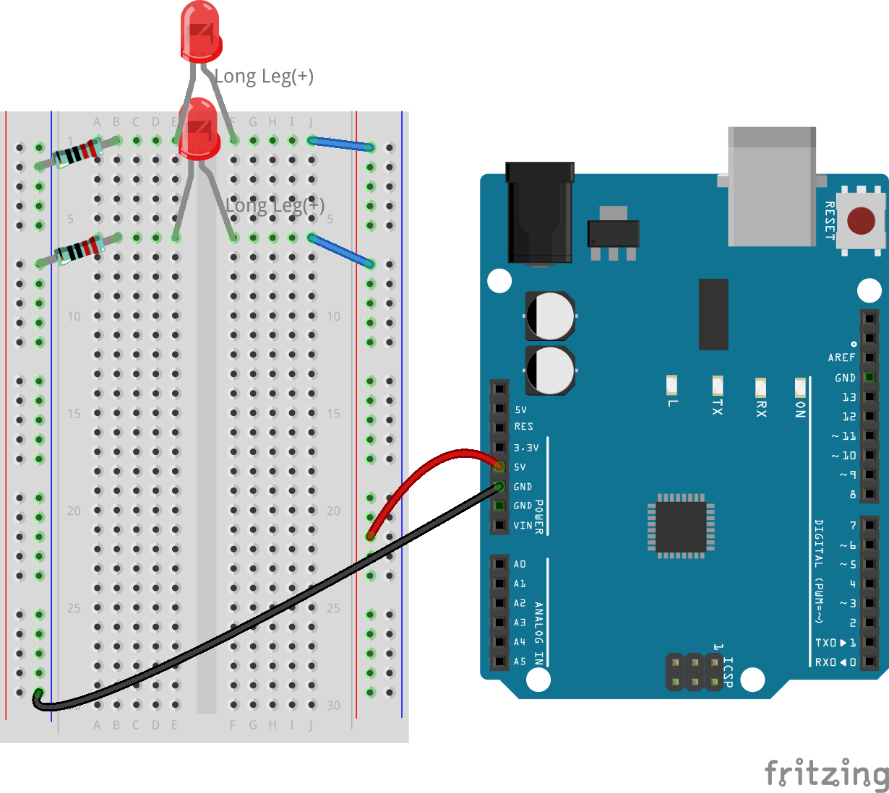
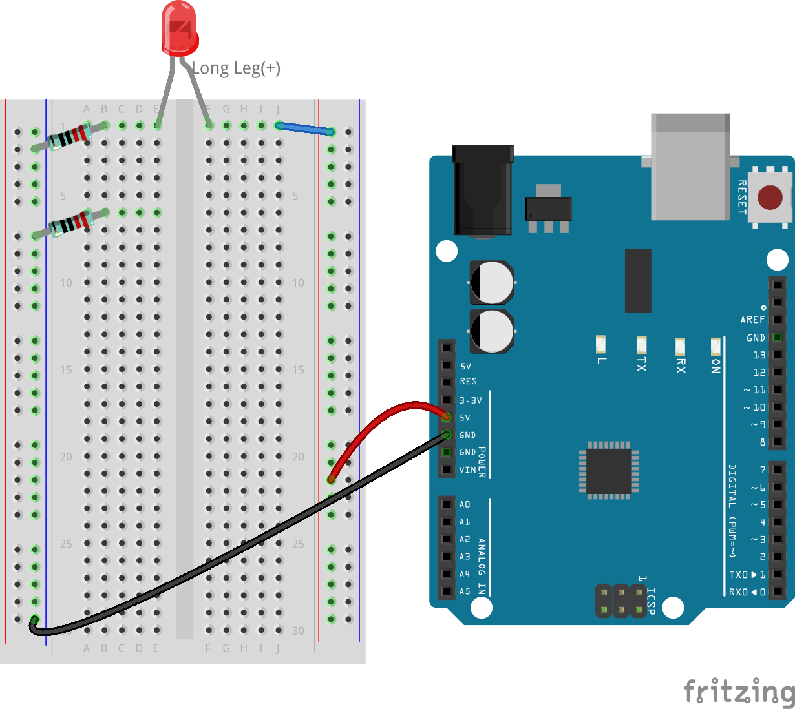
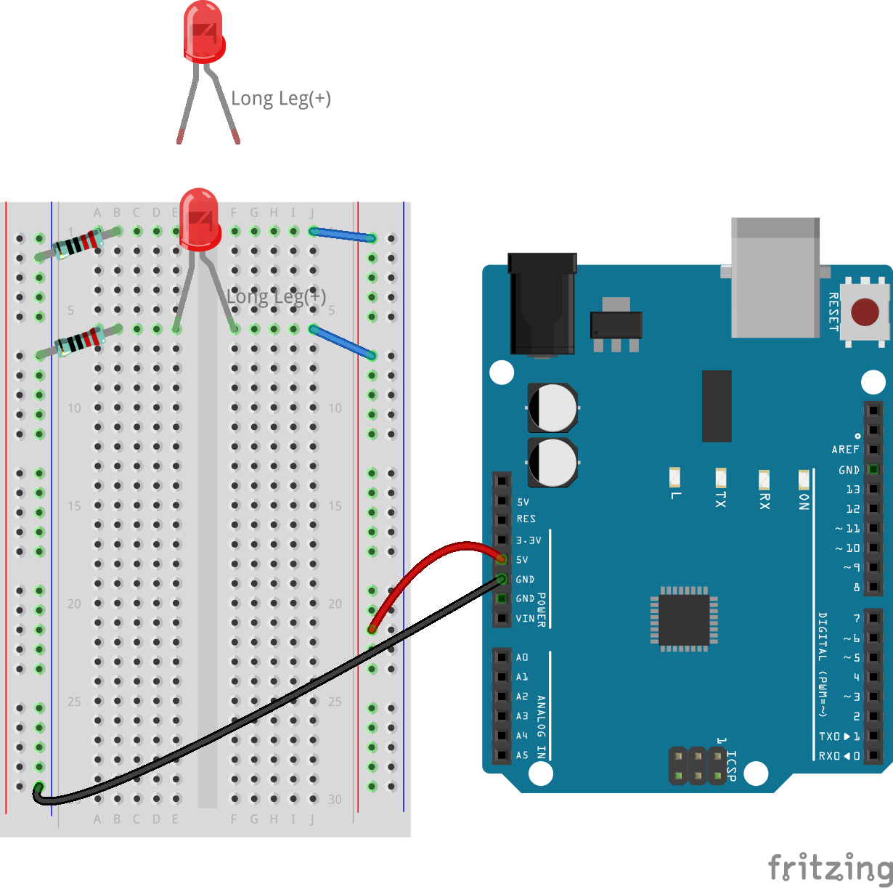
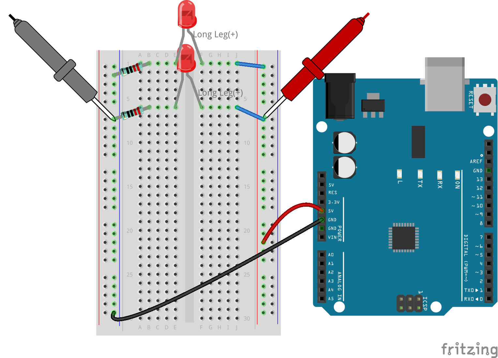
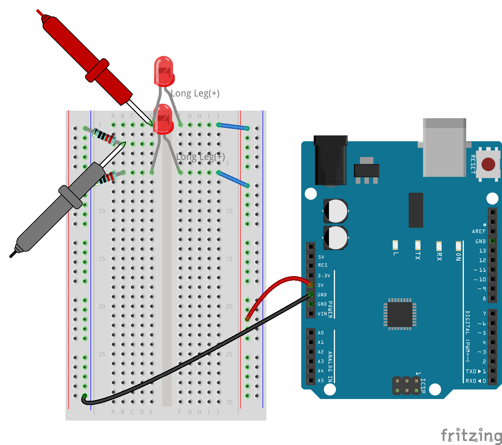
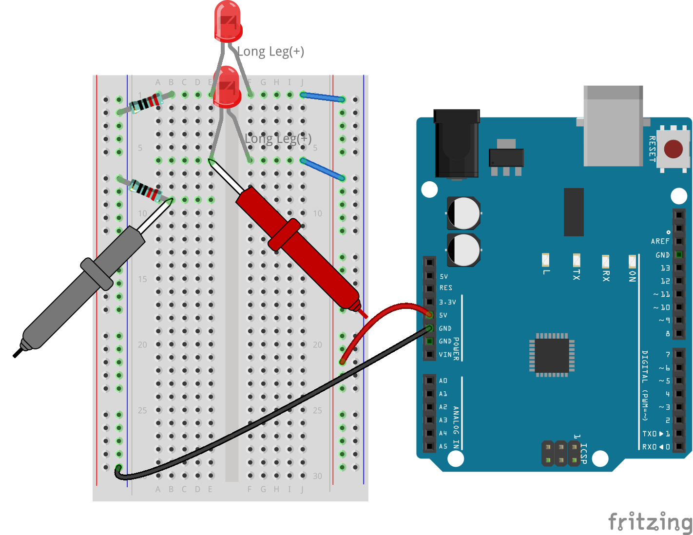
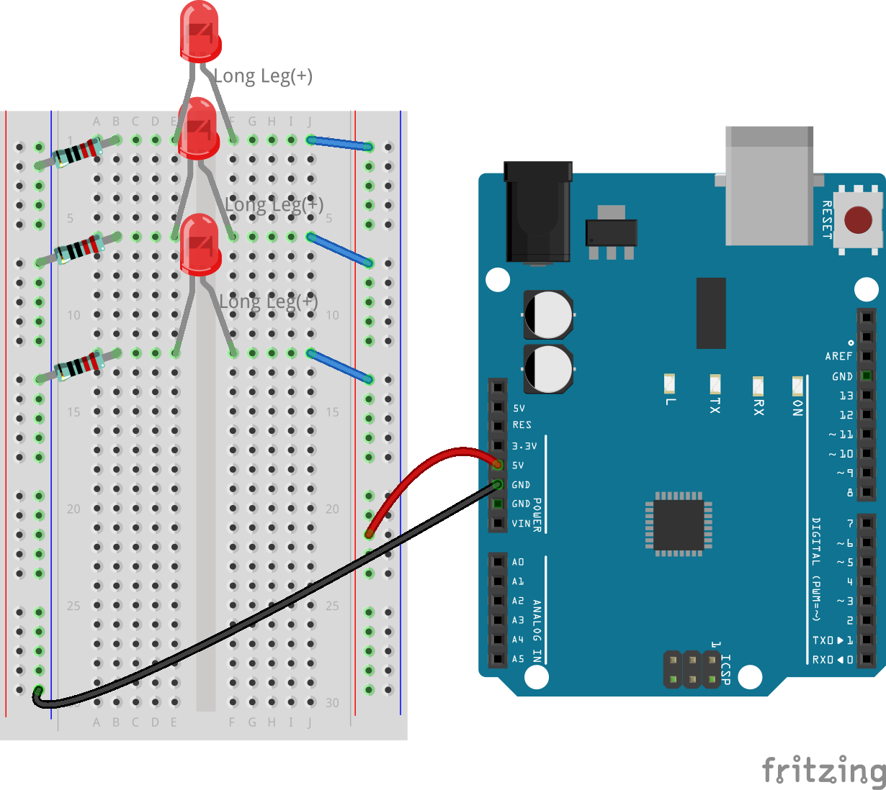

3.4 Parallel Circuits
===========================

After navigating the voltage and current characteristics of series circuits previous lesson, we're set to embark on a new journey in this lesson, where we'll delve into the world of parallel circuits. This lesson aims to unravel the unique properties of parallel circuits, such as how they manage voltage and current across multiple paths. By comparing these with series circuits, we'll gain a comprehensive understanding of circuit behavior and how different configurations affect electrical components. Prepare to deepen your knowledge of electronics as we explore the fascinating dynamics of parallel circuits together.

Diving into Parallel Circuits
---------------------------------------

**Components Needed**

* 1 * R3 Board
* 3 * Red LEDs
* 3 * 220Ω Resistors
* Several Jumper Wires
* 1 * USB Cable
* 1 * Breadboard
* 1 * Multimeter with Test Leads

**Building the Circuit**

A parallel circuit is a series of branched series circuits, so we will create an additional LED branch based on our previous series circuit setup, as follows:

1. Connect a 220Ω resistor to the breadboard. One end should be in the negative terminal, and the other end should be in hole 1B.

.. image:: img/2_connect_resistor.png
    :width: 300
    :align: center

2. Add a red LED to the breadboard. The LED's anode (long leg) should be in hole 1F. The cathode (short leg) should be in hole 1E.

.. image:: img/2_connect_led.png
    :width: 300
    :align: center

3. Use a short jumper wire to connect the LED and the power source. One end of the jumper wire should be in hole 1J. The other end should be in the positive terminal.

.. image:: img/2_connect_wire.png
    :width: 300
    :align: center

4. Connect the long jumper wire connected to the breadboard's positive terminal to the 5V pin on the R3 board. The LED should turn on and stay on. The 5V pin provides a constant 5 volts DC to the circuit. This is different from pin 13, which can be programmed via the Arduino IDE software to turn on and off.

5. Connect the breadboard's negative terminal to one of the ground pins on the R3 board. The ground pins are marked as "GND".

.. image:: img/3_parallel_circuit_gnd.png
    :width: 600
    :align: center

6. Take another 220Ω resistor, connect one end to the negative terminal and the other end to hole 6B.

7. Take another red LED. The LED's anode (long leg) should be in hole 6F. The cathode (short leg) should be in hole 6E.

8. Finally, place one end of a short jumper wire in hole 6J and the other end in the positive terminal. This completes the parallel circuit.

Now, this circuit has two LEDs in a parallel configuration. There are two paths for current to flow through:

* In the first path: current enters the first LED from the jumper wire, flows through the current-limiting resistor, and then to the negative side of the breadboard.
* In the second path: current enters the second LED from the jumper wire, flows through the current-limiting resistor, and then to the negative side of the breadboard.
* At the negative side, the two paths converge again and then flow through the black power wire to reach the ground pin on the R3 board.

**Question:**

In this parallel circuit, what happens if one LED is removed? Why does this occur? Record your answer in the parallel circuit section of Lesson 3 in your engineering notebook.

**Voltage Measurement Steps**

1. Adjust the multimeter to the DC 20 volts mode.

.. image:: img/multimeter_dc_20v.png
    :width: 300
    :align: center

2. Remember, in a parallel circuit, each branch gets the entire voltage from the power source. So, each branch in your setup should show around 5 volts. Start by measuring the voltage along the first path.

.. image:: img/3_parallel_circuit_voltage1.png
    :width: 600
    :align: center

.. list-table::
   :widths: 25 25 25
   :header-rows: 1

   * - Circuit
     - Path1 Voltage
     - Path2 Voltage
   * - 2 LEDs
     - *≈5.00 volts*
     - 

3. Next, check the voltage drop across the second path. Expect it to be near 5 volts as well.

.. list-table::
   :widths: 25 25 25
   :header-rows: 1

   * - Circuit
     - Path1 Voltage
     - Path2 Voltage
   * - 2 LEDs
     - *≈5.00 volts*
     - *≈5.00 volts*

Our voltage measurement exercise in a parallel circuit clearly demonstrates that each branch receives an equal share of the total voltage from the source, approximately 5 volts in this case. This consistency across different paths confirms the fundamental nature of parallel circuits, where voltage remains constant across each branch, despite potential minor variations due to manufacturing differences in components like LEDs and resistors.

**Current Measurement Steps**

From our previous measurements, we learned that each branch in a parallel circuit receives the full voltage from the source. But what about the current? Let's measure it now.

1. Set the multimeter to the 200 milliamps position.

.. image:: img/multimeter_200ma.png
    :width: 300
    :align: center

2. For current measurement, the multimeter must be integrated into the circuit's flow path. Leave one end of the resistor on the breadboard's negative terminal and move the other end to hole 3B.

.. note::
    
    This step will cause LED 1 to turn off while LED 2 remains lit. This demonstrates a characteristic of parallel circuits: the disconnection of one path does not affect the other paths.

3. Place the multimeter's red and black leads between the LED and the resistor, and you will see LED1 light up again.

4. Record the measured current in the table.

.. list-table::
   :widths: 25 25 25 25
   :header-rows: 1

   * - Circuit
     - LED1 Current
     - LED2 Current
     - Total Current
   * - 2 LEDs
     - *≈12.6 milliamps*
     -
     - 

5. Return the first resistor to its original position, and keep one end of the second resistor at the breadboard's negative terminal while moving the other end to hole 9B.

6. Now, measure the current across LED 2 in the circuit.

7. Record the measured current in the table.

.. list-table::
   :widths: 25 25 25 25
   :header-rows: 1

   * - Circuit
     - LED1 Current
     - LED2 Current
     - Total Current
   * - 2 LEDs
     - *≈12.6 milliamps*
     - *≈12.6 milliamps*
     - 

8. Having measured the current in both paths, what is the total current when the paths converge? Now, move the jumper wire from the breadboard's negative terminal to hole 25C.

9. Measure the total current of the circuit now.

10. Fill in the measured results in the table.

.. list-table::
   :widths: 25 25 25 25
   :header-rows: 1

   * - Circuit
     - LED1 Current
     - LED2 Current
     - Total Current
   * - 2 LEDs
     - *≈12.6 milliamps*
     - *≈12.6 milliamps*
     - *≈25.3 milliamps*

Our exploration into parallel circuits has illuminated a key aspect: the total current mirrors the sum of individual branch currents, adhering to the fundamental principles of electrical circuits. This hands-on activity not only strengthens our understanding of parallel circuitry but also highlights its distinct behavior compared to series circuits, offering a clear picture of how components in parallel share the electrical load. As we continue our journey through the world of electronics, these insights lay the groundwork for deeper investigations into circuit design and functionality.

**Question**:

1. If another LED is added to this circuit, what happens to the brightness of the LEDs? Why? Record your answer in your handbook.

Summary of Series and Parallel Circuits
-----------------------------------------------------

**Series Circuits**

* **Advantages**: Since the current throughout the circuit is the same, it's easy to control the current. If one component fails, the current will stop. Its wiring is simpler, reducing the cost of building large circuits.
* **Disadvantages**: If one part of the circuit is damaged, the whole circuit will stop working. Since the current in the circuit is steady, you can't use components that require different currents.

**Parallel Circuits**

* **Advantages**: If any path in the circuit is disconnected, it does not affect the other branches in the circuit. A device in one branch can operate independently of other devices. More branches can be easily added to the circuit at any time.
* **Disadvantages**: As more devices are added to the circuit, more current is drawn. This can become dangerous as the circuit heats up, potentially leading to fire. Fuses or circuit breakers are used to disconnect the circuit when the current is too high to avoid overheating. Its wiring is more complex, increasing the cost of making large circuits.

**Rules of Series and Parallel Circuits**

Here are the rules for series and parallel circuits, which you can continue to verify with a multimeter:

.. list-table::
   :widths: 10 25 25 25
   :header-rows: 1

   * - Circuit
     - Voltage
     - Current
     - Resistance  
   * - Series
     - The total voltage of the circuit equals the sum of the voltages used by each component (Total voltage = V1 + V2 + V3 + ...).
     - The current at any point in the circuit is the same (Total current = I1 = I2 = I3 = ...).
     - The total resistance of a circuit equals the sum of the resistances of each component (Total resistance = R1 + R2 + R3 + ...).
   * - Parallel
     - The voltage used by each load equals the total voltage used by the circuit (Total voltage = V1 = V2 = V3 = ...)
     - The total current of the circuit equals the sum of the currents used by each component (Total current = I1 + I2 + I3 + ...).
     - The reciprocal of the total resistance equals the sum of the reciprocals of each component's resistance (1/ Total resistance = 1/R1 + 1/R2 + 1/R3 + ...)   

