.. note::

    ¡Hola! Bienvenido a la Comunidad de Entusiastas de SunFounder Raspberry Pi, Arduino y ESP32 en Facebook. Sumérgete más en el mundo de Raspberry Pi, Arduino y ESP32 con otros entusiastas.

    **¿Por qué unirte?**

    - **Soporte experto**: Resuelve problemas técnicos y posventa con la ayuda de nuestra comunidad y equipo.
    - **Aprende y comparte**: Intercambia consejos y tutoriales para mejorar tus habilidades.
    - **Preestrenos exclusivos**: Obtén acceso anticipado a nuevos anuncios de productos y adelantos.
    - **Descuentos especiales**: Disfruta de descuentos exclusivos en nuestros productos más recientes.
    - **Promociones festivas y sorteos**: Participa en sorteos y promociones durante las festividades.

    👉 ¿Listo para explorar y crear con nosotros? Haz clic en [|link_sf_facebook|] y únete hoy mismo.

3. Mide con el Multímetro
==========================================

¡Bienvenido a nuestra exploración del multímetro, una herramienta esencial en la electrónica! Esta lección te guiará a través de las funcionalidades y aplicaciones del multímetro, enseñándote a medir diversas propiedades eléctricas de manera eficaz. Desde la configuración básica con una batería y cables de prueba, hasta el ajuste de configuraciones y el uso de sus múltiples funciones, esta experiencia práctica no solo te proporcionará conocimientos teóricos, sino que también te equipará con habilidades para realizar mediciones precisas en cualquier circuito.

Esto es lo que lograrás:

* Comprender los componentes y funciones de un multímetro.
* Dominar la medición de voltaje, corriente y resistencia.
* Mejorar tu comprensión de los fundamentos electrónicos mediante la práctica.

Esta lección no solo impulsará tus habilidades técnicas, sino que también te brindará conocimientos prácticos que sentarán una sólida base para tu aprendizaje y proyectos futuros en electrónica.

Conoce más sobre el Multímetro
-----------------------------------

Un multímetro es un dispositivo utilizado para medir diversas propiedades eléctricas. La mayoría de los multímetros pueden medir voltaje, corriente, resistencia y continuidad (si la electricidad puede fluir).

El dial en el multímetro te permite seleccionar el tipo de medición eléctrica y el rango que deseas medir. Ahora, exploremos las diversas funciones disponibles en el dial.

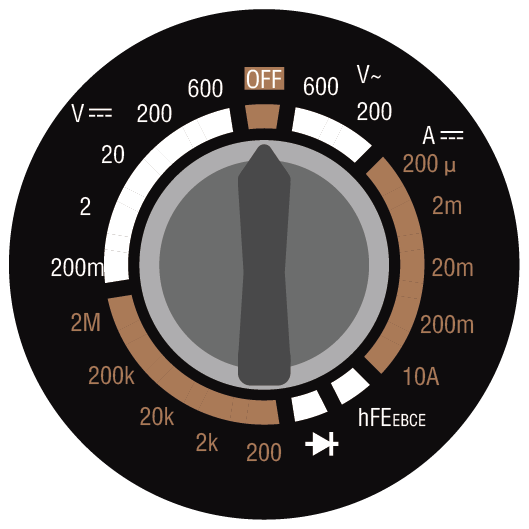

**Voltaje DC**

En esta imagen, la posición seleccionada se usa para medir voltaje de corriente continua (DC). El voltaje está representado por una "V" mayúscula. DC está denotado por tres líneas punteadas con una línea recta encima.

Tu multímetro tiene cinco rangos diferentes de voltaje DC: 200m (milivoltios), 2V (voltios), 20V (voltios), 200V (voltios) y 600V (voltios). Estos números representan el voltaje máximo que se puede medir en cada configuración.

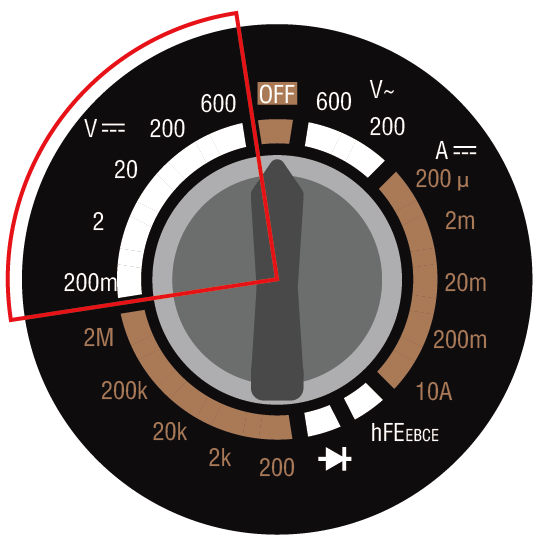

.. note::

    Aquí tienes la conversión entre voltios:

    * 1 millivolt (mV) = 0.001 volt (V)

    Por ejemplo, si tienes un voltaje de 500 milivoltios (mV), también se puede expresar como 0.5 voltios (V).

**Método de medición**: Antes de medir el voltaje, necesitas seleccionar un rango de medición adecuado. En todos nuestros cursos, el voltaje del circuito no excederá los 5V, por lo que puedes seleccionar la posición de 20V. Cuando el circuito esté funcionando normalmente, puedes medir el voltaje colocando los cables de prueba rojo y negro a ambos lados del dispositivo.

**Voltaje AC**

Esta imagen muestra la configuración para medir voltaje de corriente alterna (AC). AC está representada por una línea ondulada.

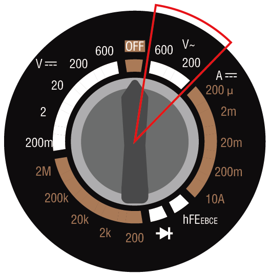

**Transistores**

La configuración hFE NPN PNP es para medir transistores. No utilizarás esta configuración en este curso.

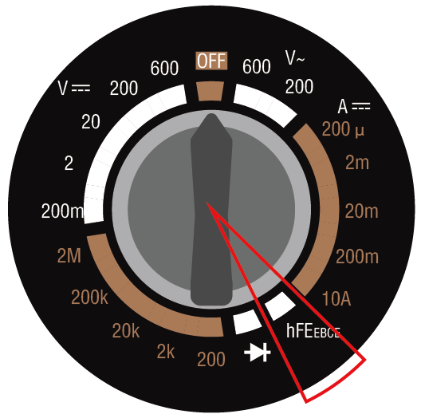

**1.5V mA**

La configuración "1.5V mA" en un medidor se utiliza para medir la corriente a un nivel de voltaje de 1.5V, generalmente para probar cuánta corriente consume un circuito o dispositivo a este voltaje.

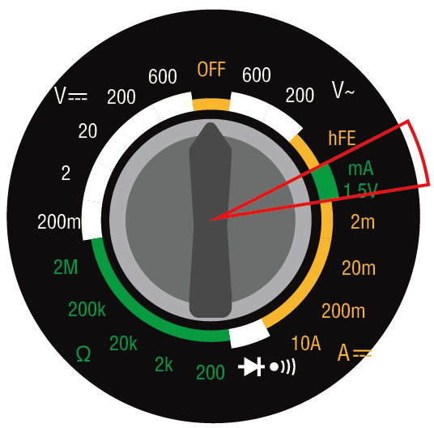

**Corriente**

Para medir corriente, el multímetro tiene configuraciones de 2m (2 miliamperios), 20m (20 miliamperios), 200m (200 miliamperios) y 10A (10 amperios).

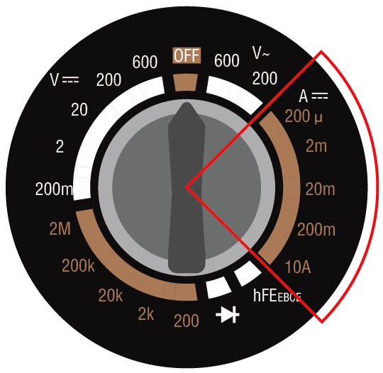

.. note::

    Aquí tienes la conversión entre amperios:

    * 1 milliampere (mA) = 0.001 ampere (A)

    Por ejemplo, si tienes una corriente de 50 miliamperios (mA), también se puede expresar como 0.05 amperios (A).

Para medir corrientes menores de 200 miliamperios, puedes insertar el cable de prueba rojo en el puerto VΩmA. Luego, gira el dial a una de las configuraciones de miliamperios. Los circuitos que construyas en este curso y proyecto siempre tendrán corrientes menores a 200 mA.

Para medir corrientes de hasta 10 amperios, debes insertar el cable de prueba rojo en el puerto 10ADC. Luego, gira el dial a la configuración de 10A.

.. image:: img/multimeter_10a.png
    :width: 300
    :align: center

**Método de medición**: Para medir la corriente en un circuito, el multímetro debe estar insertado en el circuito. En otras palabras, debe formar parte del circuito. Esto es diferente de medir voltaje o resistencia, lo cual se puede hacer a través de un componente en el circuito. Tendrás la oportunidad de realizar estas mediciones más adelante cuando comiences a construir circuitos.

**Continuidad**

La configuración con un símbolo de diodo y un ícono de sonido se utiliza para medir la continuidad. Al medir la continuidad, si puede fluir corriente entre los cables de prueba, el multímetro emitirá un sonido de "bip".

.. image:: img/multimeter_diode.png
    :width: 300
    :align: center

**Resistencia**

El conjunto final de opciones en el multímetro está destinado a medir la resistencia, simbolizada por la letra griega omega (Ω). Por lo general, los multímetros ofrecen una variedad de rangos para las mediciones de resistencia. Este multímetro en particular está equipado con cinco rangos: 200 ohmios, 2k (2,000 ohmios), 20k (20,000 ohmios), 200k (200,000 ohmios) y 2M (2,000,000 ohmios). Cada rango especifica el valor máximo de resistencia que puede medir con precisión. Para obtener lecturas más exactas, selecciona un rango que pueda medir la resistencia sin exceder su límite superior.

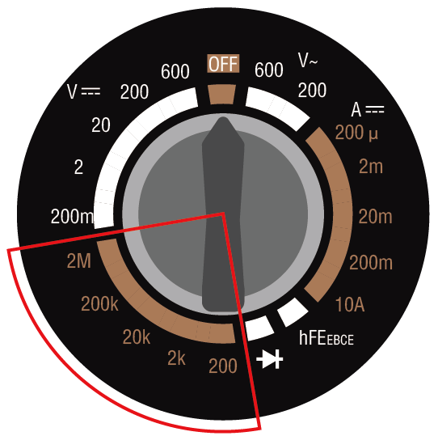
  
.. note::

    Aquí tienes la conversión entre ohmios:

    * 1 kilohm (kΩ) = 1000 ohms (Ω)
    * 1 megohm (MΩ) = 1000000 ohms (Ω)

Por ejemplo, si tienes una resistencia de 1000 ohmios (Ω), también se puede expresar como 1 kiloohmio (kΩ).

**Consejos**

Durante la medición de resistencia, voltaje o corriente, puedes notar que los valores en la pantalla tienden a variar. Para estabilizar y capturar una lectura específica, puedes utilizar la función de retención (HOLD). Esta acción congela el valor actual en la pantalla hasta que se vuelva a presionar el botón HOLD.

Si no estás seguro del rango adecuado para medir voltaje, corriente o resistencia, es recomendable comenzar con el rango máximo disponible. Esto te dará una estimación inicial de los valores con los que estás trabajando, permitiéndote luego ajustar a un rango más preciso para obtener mediciones exactas.

**Pregunta**

Ahora que tienes un entendimiento detallado de cómo usar un multímetro, ¿qué configuración del multímetro usarías para medir los siguientes valores eléctricos?

.. list-table::
  :widths: 25 25
  :header-rows: 1

  * - Objeto de Medición
    - Configuración del Multímetro
  * - 9V DC
    - 
  * - 1K ohmios
    - 
  * - 40 miliamperios
    - 
  * - 110V AC
    - 

Medición con un Multímetro
----------------------------

En la lección anterior, configuraste un circuito simple para encender un LED. Ahora usaremos un multímetro para medir el voltaje, corriente y resistencia en este circuito. ¡Veamos cómo hacerlo!

**Preparación del Multímetro**

Antes de usar el multímetro, necesitas instalar la batería y conectar los dos cables de prueba para que esté listo para usar en cualquier momento.

1. Sigue el video a continuación para conectar la batería a tu multímetro.

  .. raw:: html

      <video width="600" loop autoplay muted>
          <source src="_static/video/3_multimeter_battery.mp4" type="video/mp4">
          Your browser does not support the video tag.
      </video>

2. Encuentra tu multímetro y los cables de prueba rojo y negro. Asegúrate de que el multímetro esté en la posición de "apagado". Inserta el cable de prueba negro en el puerto COM del multímetro. Inserta el cable de prueba rojo en el puerto de voltios-ohmios-miliamperios (VΩmA).

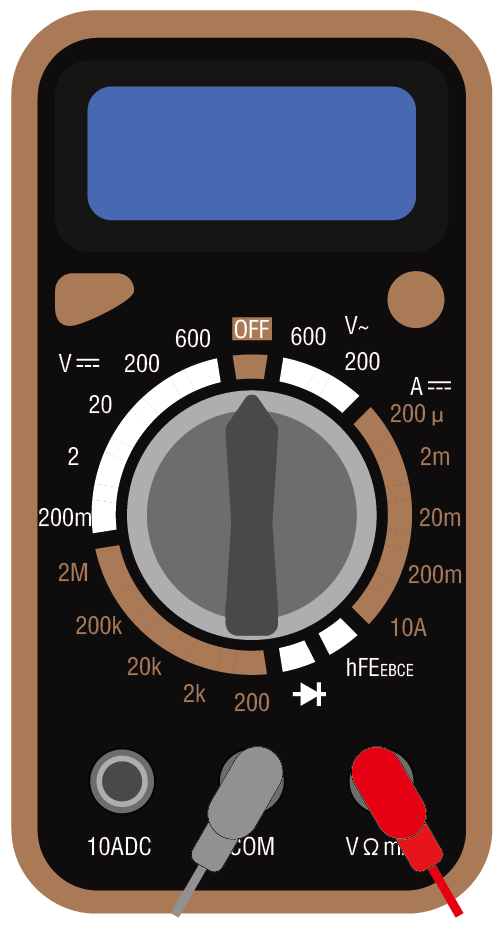

**Medición de Voltaje**

1. Gira el dial del multímetro a la configuración de 20 voltios DC.

.. image:: img/multimeter_dc_20v.png
  :width: 300
  :align: center

2. Separa ligeramente los cables positivo y negativo en la protoboard para exponer los extremos metálicos sin desengancharlos completamente.

3. Luego, toca los extremos metálicos expuestos con los cables de prueba rojo y negro del multímetro para medir el voltaje.

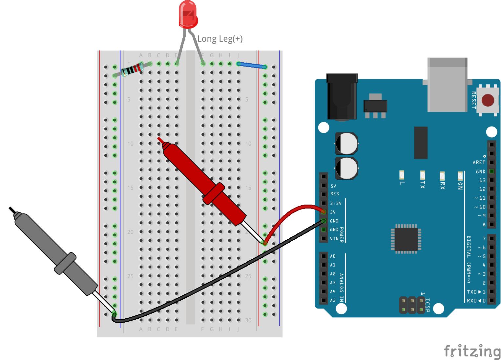

4. Registra el voltaje; también puedes anotar los fenómenos observados en la columna de Notas.

.. note::

    * El mío fue de 5.13 voltios, completa según tu medición.

    * Debido a problemas con el cableado y la inestabilidad de tu mano, puede que veas que el voltaje fluctúa. Mantén tu mano firme, observa varias veces, y obtendrás una lectura de voltaje bastante estable.

.. list-table::
   :widths: 25 25 50 25
   :header-rows: 1

   * - Tipo
     - Unidades
     - Resultados de Medición
     - Notas
   * - Voltaje
     - Voltios
     - *≈5.13 voltios*
     - 
   * - Corriente
     - Miliamperios
     - 
     - 
   * - Resistencia
     - Ohmios
     - 
     - 

5. Finalmente, vuelve a insertar todos los cables de puente en la protoboard para evitar que se salgan mientras realizas otras mediciones.

**Midiendo Corriente**

Ya has medido el voltaje en el circuito. Ahora, medirás la corriente en el circuito.

1. Para medir la corriente, el multímetro debe integrarse en el camino de flujo del circuito, esencialmente convirtiéndose en un segmento de la ruta conductora del circuito. Un método simple implica ajustar la colocación del LED: mantén el ánodo del LED en el agujero 1F mientras mueves su cátodo (la pierna más corta) del agujero 1E al 3E.

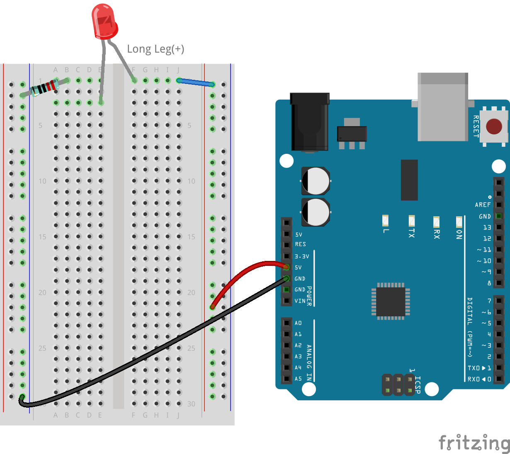

2. Configura el multímetro en la posición de 200 miliamperios.

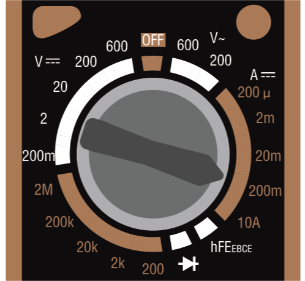

3. Coloca el cable de prueba negro en el cable conectado al agujero 1B y el cable de prueba rojo en el cátodo del LED en el agujero 3E. Al completar esta configuración, el LED rojo debería comenzar a parpadear.

  .. note::

    Cuando midas voltaje a través de la resistencia y el LED, asegurar una conexión sólida con los cables de prueba del multímetro puede ser complicado. Para obtener un mejor agarre, coloca los cables de prueba donde las patas del componente entran en la protoboard. De esta manera, puedes presionar más fuerte sin desconectar nada.

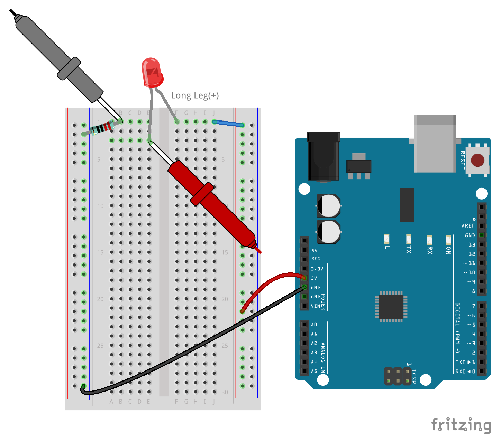

4. Verás que la corriente medida es menor de 20mA, por lo que podemos cambiar a la posición de 20mA para obtener una lectura más precisa.

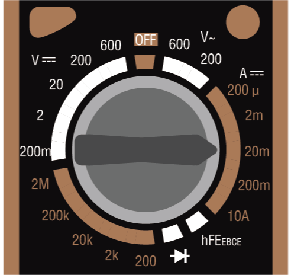

5. Mide y registra la corriente en el circuito, en miliamperios.

.. note::

  Ten en cuenta que las fluctuaciones en la corriente medida son normales debido a varios factores como la estabilidad del contacto, variaciones en la fuente de energía y efectos de temperatura. Te recomendamos simplemente registrar el valor de corriente que midas en un momento dado. Si el valor está dentro de las expectativas teóricas, debe considerarse aceptable.

  
.. list-table::
   :widths: 25 25 50 25
   :header-rows: 1

   * - Type
     - Units
     - Measurement Results
     - Notes
   * - Voltage
     - Volts
     - *≈5.13 volts*
     - 
   * - Current
     - Milliamps
     - *≈13.54 milliamps*
     - 
   * - Resistance
     - Ohms
     - 
     -

6. Vuelve a colocar el LED en su posición original, con el ánodo en el agujero 1F y el cátodo en el agujero 1E.

**Calculando la Resistencia Total**

Medir la resistencia en un circuito con un multímetro puede ser complicado cuando se incluyen LEDs, porque los LEDs necesitan una cantidad específica de voltaje para encenderse, llamado voltaje de umbral. Si el voltaje no es lo suficientemente alto, el LED no se encenderá y el circuito permanecerá abierto, lo que complica la medición de la resistencia. Además, no puede haber ninguna otra fuente de voltaje en el circuito aparte de la que proviene del multímetro cuando intentas medir la resistencia.

Entonces, medir directamente la resistencia del circuito con un multímetro no es sencillo. ¿Qué hacemos entonces?

Aquí, usaremos la fórmula mostrada a continuación para calcular la resistencia a partir del voltaje y la corriente, que es la Ley de Ohm. Proporcionaremos una introducción detallada a esto en la próxima lección.

.. code-block::

    Voltage = Current x Resistance

    Or

    V = I • R

Al reordenar, la ecuación se convierte en:

.. code-block::

    Resistance = Voltage / Current

    Or

    R = V / I

Usando la fórmula anterior, con el voltaje y la corriente que mediste, puedes calcular la resistencia total en el circuito y llenar los resultados en la tabla.

.. note::

    El voltaje está en voltios, la resistencia en ohmios, y la corriente en miliamperios. Necesitas convertir miliamperios a amperios:

    1 Amps = 1000 Milliamps

    Esto significa que necesitas dividir la corriente medida entre 1000 antes de usar la fórmula para calcular la resistencia total. El resultado final puede no ser un número entero; redondea a dos decimales. Por ejemplo, mi valor calculado es 378.8774002954, que redondeo a 378.88.

    R = 5.13 / (13.54 / 1000) = 378.88 ohms

.. list-table::
   :widths: 25 25 50 25
   :header-rows: 1

   * - Tipo
     - Unidades
     - Resultados de Medición
     - Notas
   * - Voltaje
     - Voltios
     - *≈5.13 voltios*
     - 
   * - Corriente
     - Miliamperios
     - *≈13.54 miliamperios*
     - 
   * - Resistencia
     - Ohmios
     - *≈378.88 ohmios*
     - 

**Midiendo el Valor de Resistencia**

Ahora que hemos calculado la resistencia total del circuito, es hora de ver cuánto de esa resistencia se debe a la resistencia y cuánto al LED. Nuestra resistencia está marcada como 220 ohmios, pero con una tolerancia del 5%, en realidad podría estar entre 209 y 231 ohmios. Usemos el multímetro para averiguar su valor exacto.

1. Cuando midas resistencia, tu multímetro debe actuar como la única fuente de voltaje; asegúrate de que no haya otras fuentes de energía conectadas al circuito. Desconecta cualquier cable jumper del Arduino Uno R3 para asegurar que la protoboard esté aislada.

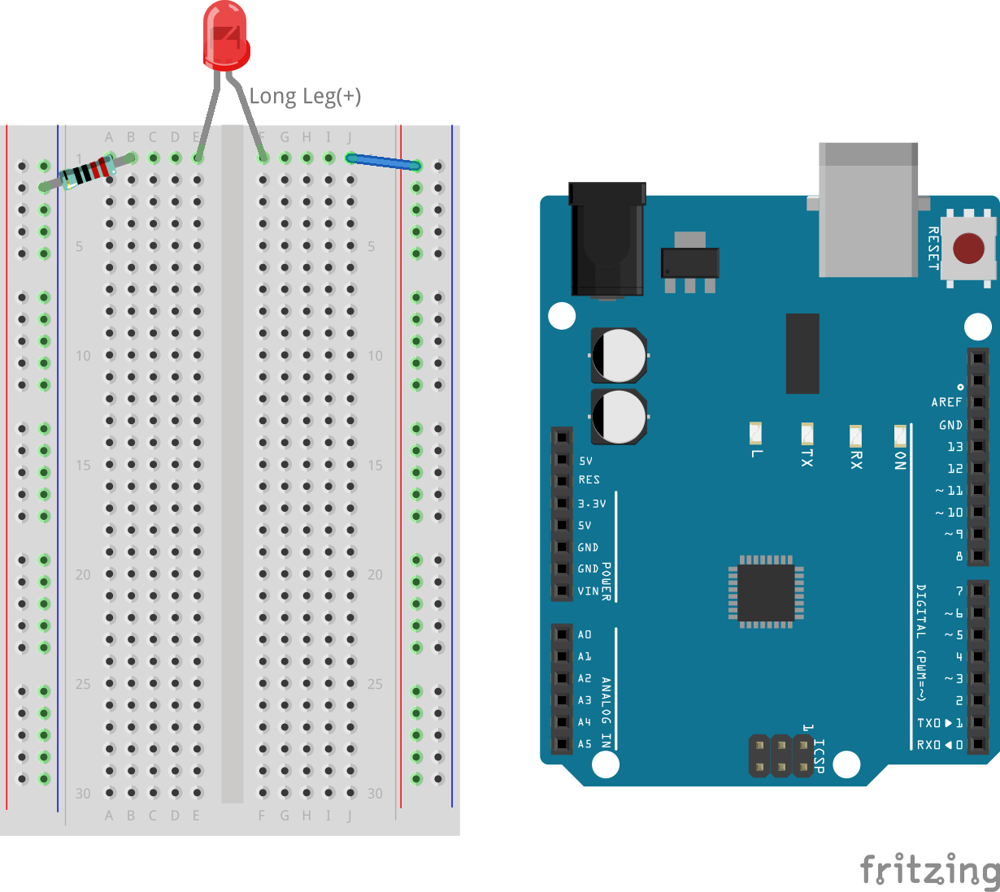

2. Para medir con precisión la resistencia del resistor, ajusta tu multímetro al modo de resistencia 2K (2000 ohmios).

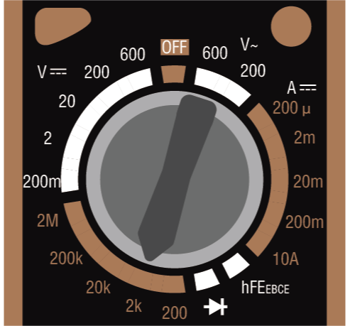

3. Coloca los cables de prueba rojo y negro del multímetro a ambos lados del resistor, y registra la lectura del multímetro.

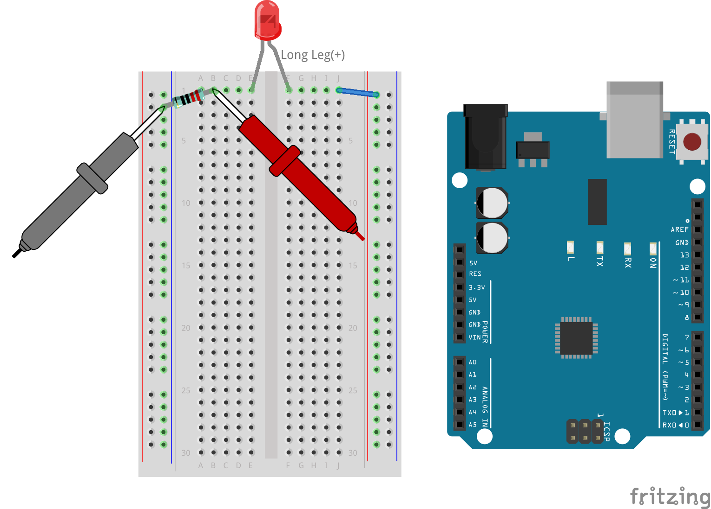

4. Después de medir, recuerda apagar el multímetro colocándolo en la posición "OFF".

**Calculando la Resistencia del LED**

Para determinar la resistencia del LED, resta la resistencia del resistor de la resistencia total en el circuito.

.. code-block::

    Resistencia del LED = Resistencia Total - Resistencia del Resistor

De acuerdo con mis mediciones, la resistencia del LED debería ser: 378.88 - 215 = 163.88 ohmios.

Hemos recorrido un camino práctico a través de los conceptos esenciales de cómo usar un multímetro para medir voltaje, corriente y resistencia en un circuito. Desde construir un simple circuito LED hasta profundizar en los matices de la medición de resistencia en circuitos con LEDs, hemos explorado cómo aplicar prácticamente la Ley de Ohm y comprender la dinámica de los circuitos en serie y en paralelo. A medida que avanzamos, recuerda que estas habilidades fundamentales sientan las bases para proyectos más complejos y una comprensión más profunda de la electrónica. Sigue experimentando, sigue aprendiendo, y sigamos iluminando juntos el camino de la exploración electrónica.
