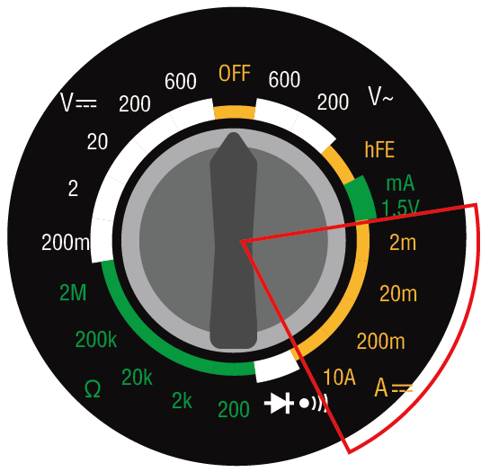
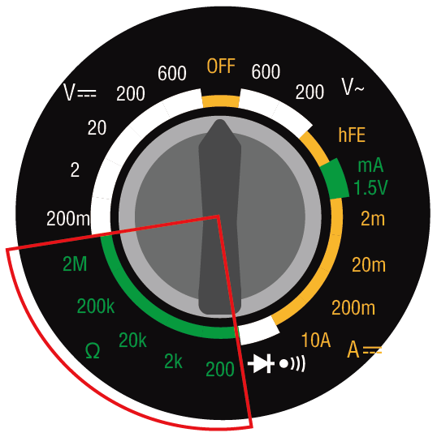
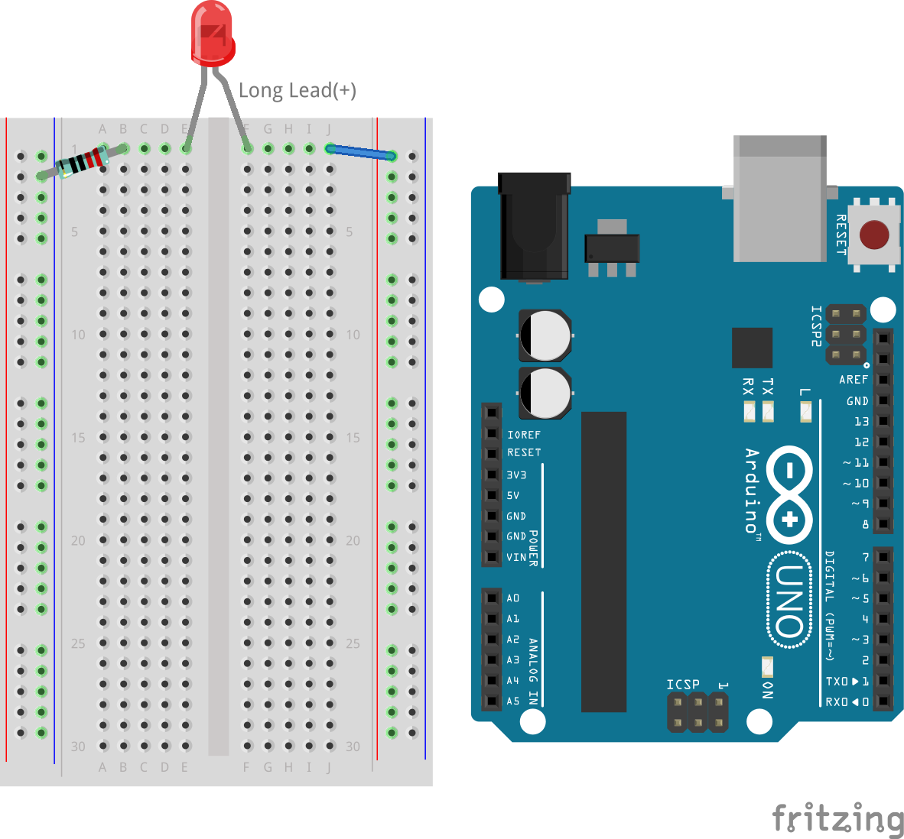
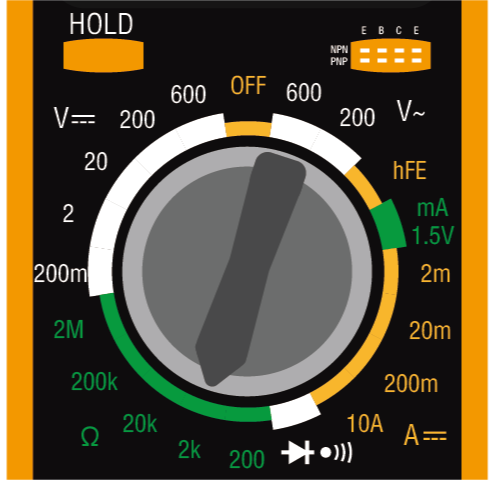
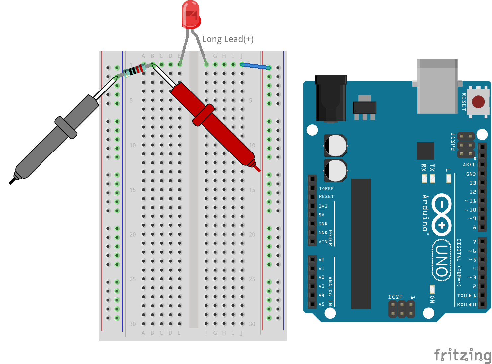

.. note::

    Ciao, benvenuto nella SunFounder Raspberry Pi & Arduino & ESP32 Enthusiasts Community su Facebook! Approfondisci le tue conoscenze su Raspberry Pi, Arduino ed ESP32 insieme ad altri appassionati.

    **Perché unirsi a noi?**

    - **Supporto esperto**: Risolvi i problemi post-vendita e le sfide tecniche con l'aiuto della nostra comunità e del nostro team.
    - **Impara e condividi**: Scambia consigli e tutorial per migliorare le tue competenze.
    - **Anteprime esclusive**: Ottieni l'accesso anticipato a nuovi annunci di prodotti e anteprime.
    - **Sconti speciali**: Approfitta di sconti esclusivi sui nostri prodotti più recenti.
    - **Promozioni festive e giveaway**: Partecipa a omaggi e promozioni durante le festività.

    👉 Pronto a esplorare e creare con noi? Clicca su [|link_sf_facebook|] e unisciti oggi stesso!

3. Misurare con il Multimetro
=================================

Benvenuto nella nostra esplorazione del multimetro, uno strumento essenziale nell'elettronica. Questa lezione ti guiderà attraverso le funzionalità e l'applicazione del multimetro, insegnandoti come misurare correttamente varie proprietà elettriche. Partendo dalle basi dell'impostazione del multimetro con una batteria e i cavi di prova, esploreremo la regolazione delle impostazioni e l'utilizzo delle sue numerose funzioni. Questa esperienza pratica non solo ti fornirà conoscenze teoriche, ma ti equipaggerà anche con le competenze per eseguire misurazioni accurate su qualsiasi circuito.

Ecco cosa otterrai:

* Comprendere i componenti e le funzioni di un multimetro.
* Imparare a misurare tensione, corrente e resistenza.
* Migliorare la comprensione dei fondamenti elettronici attraverso la pratica.

Questa lezione non solo aumenterà le tue abilità tecniche, ma ti fornirà anche conoscenze pratiche che pongono una solida base per il tuo futuro apprendimento e progetti elettronici.

Conosciamo il Multimetro
------------------------------

Un multimetro è un dispositivo utilizzato per misurare varie proprietà elettriche. La maggior parte dei multimetri può misurare tensione, corrente, resistenza e continuità (se l'elettricità può fluire). 

La manopola sul multimetro ti consente di selezionare il tipo di misura elettrica e l'intervallo che desideri misurare. Ora esploriamo le varie funzioni disponibili sulla manopola.

.. image:: img/multimeter_dashboard.png
    :width: 300
    :align: center

**Tensione DC**

In questa immagine, la posizione selezionata viene utilizzata per misurare la tensione a corrente continua (DC). La tensione è rappresentata dalla lettera maiuscola V. La DC è indicata da tre linee tratteggiate con una linea retta sopra di esse.

Il tuo multimetro ha cinque diversi intervalli di tensione DC: 200m (millivolt), 2V (volt), 20V (volt), 200V (volt) e 600V (volt). Questi numeri rappresentano la tensione massima che può essere misurata in ciascuna impostazione.

.. image:: img/multimeter_dc.png
    :width: 300
    :align: center

.. note::

    Ecco la conversione tra Volt:

    * 1 millivolt (mV) = 0.001 volt (V)

    Ad esempio, se hai una tensione di 500 millivolt (mV), può essere espressa anche come 0,5 volt (V).

**Metodo di Misura**: Prima di misurare la tensione, devi selezionare un intervallo di misura appropriato. In tutti i nostri corsi, la tensione del circuito non supererà i 5V, quindi puoi semplicemente selezionare la posizione 20V. Quando il circuito funziona normalmente, puoi testare la tensione posizionando i cavi di prova rosso e nero su entrambi i lati del dispositivo.

**Tensione AC**

Questa immagine mostra l'impostazione per misurare la tensione a corrente alternata (AC). L'AC è rappresentata da una linea ondulata.

.. image:: img/multimeter_ac.png
    :width: 300
    :align: center

**Transistor**

L'impostazione hFE NPN PNP è per la misurazione dei transistor. Non utilizzerai questa impostazione in questo corso.

.. image:: img/multimeter_hfe.png
    :width: 300
    :align: center

**1.5V mA**

L'impostazione "1.5V mA" su un multimetro viene utilizzata per misurare la corrente a un livello di tensione di 1,5V, tipicamente per testare quanta corrente un circuito o un dispositivo assorbe a questa tensione.

.. image:: img/multimeter_1.5v.png
    :width: 300
    :align: center

**Corrente**

Per misurare la corrente, il multimetro ha impostazioni per 2m (2 milliampere), 20m (20 milliampere), 200m (200 milliampere) e 10A (10 ampere).

.. note::

    Ecco la conversione tra ampere:

    * 1 milliampere (mA) = 0.001 ampere (A)

    Ad esempio, se hai una corrente di 50 milliampere (mA), può essere espressa anche come 0,05 ampere (A).

Per misurare correnti inferiori a 200 milliampere, puoi inserire il cavo di prova rosso nella porta VΩmA. Poi, gira la manopola su una delle impostazioni per milliampere. I circuiti che costruirai in questo corso e progetto avranno sempre correnti inferiori a 200 mA.

Per misurare correnti fino a 10 ampere, devi inserire il cavo di prova rosso nella porta 10ADC. Poi, gira la manopola sull'impostazione 10A.

.. image:: img/multimeter_10a.png
    :width: 300
    :align: center

**Metodo di Misurazione**: Per misurare la corrente in un circuito, il multimetro deve essere inserito nel circuito. In altre parole, deve diventare parte del circuito. Questo è diverso dalla misurazione della tensione o della resistenza, che può essere fatta su un componente del circuito. Avrai l'opportunità di effettuare queste misurazioni più avanti quando inizierai a costruire i circuiti.

**Continuità**

L'impostazione con il simbolo del diodo e l'icona del suono viene utilizzata per misurare la continuità. Quando misuri la continuità, se c'è un flusso di corrente tra i cavi di prova, il multimetro emetterà un suono "beep".

.. image:: img/multimeter_diode.png
    :width: 300
    :align: center

**Resistenza**

L'ultimo set di opzioni sul multimetro è destinato alla valutazione della resistenza, simbolizzata dalla lettera greca omega (Ω). Tipicamente, i multimetri offrono una varietà di intervalli per le misurazioni della resistenza. Questo particolare multimetro è dotato di cinque intervalli: 200 ohm, 2k (2.000 ohm), 20k (20.000 ohm), 200k (200.000 ohm) e 2M (2.000.000 ohm). Ogni intervallo specifica il valore massimo di resistenza che può essere misurato con precisione. Per ottenere le letture più precise, seleziona un intervallo che possa misurare la resistenza senza superare il suo limite massimo.

  
.. note::

    Ecco la conversione tra ohm:

    * 1 kilohm (kΩ) = 1000 ohms (Ω)
    * 1 megohm (MΩ) = 1000000 ohms (Ω)

Ad esempio, se hai una resistenza di 1000 ohm (Ω), può essere espressa anche come 1 kiloohm (kΩ).

**Suggerimenti**

Durante la misurazione di resistenza, tensione o corrente, potresti notare che i valori sul display tendono a variare. Per stabilizzare e catturare una lettura specifica, puoi utilizzare la funzione HOLD. Questa azione blocca il valore corrente sul display fino a quando non premi nuovamente il pulsante HOLD.

Se non sei sicuro dell'intervallo appropriato da scegliere per misurare tensione, corrente o resistenza, è consigliabile iniziare con l'intervallo massimo disponibile. Questo approccio fornisce una stima iniziale dei valori con cui stai lavorando, consentendoti di restringere successivamente a un intervallo più preciso per misurazioni accurate.

**Domanda**

Ora che hai una comprensione dettagliata di come utilizzare un multimetro, considera quale impostazione del multimetro utilizzeresti per misurare i seguenti valori elettrici:

.. list-table::
  :widths: 25 25
  :header-rows: 1

  * - Oggetto della Misurazione
    - Impostazione del Multimetro
  * - 9V volt DC
    - 
  * - 1K ohm
    - 
  * - 40 milliampere
    - 
  * - 110 volt AC
    - 

Misurare con il Multimetro
--------------------------

Nella lezione precedente, hai configurato un semplice circuito per accendere un LED. Ora utilizzeremo un multimetro per misurare la tensione, la corrente e la resistenza in questo circuito. Vediamo come farlo!

**Preparare il Multimetro**

Prima di usare il multimetro, devi installare la batteria e collegare i due cavi di prova, in modo che sia pronto all'uso in qualsiasi momento.

1. Segui il video qui sotto per collegare la batteria al tuo multimetro.

  .. raw:: html

      <video width="600" loop autoplay muted>
          <source src="_static/video/3_multimeter_battery.mp4" type="video/mp4">
          Your browser does not support the video tag.
      </video>

2. Trova il tuo multimetro e i cavi di prova rosso e nero. Assicurati che il multimetro sia in posizione "off". Inserisci il cavo di prova nero nella porta COM del multimetro. Inserisci il cavo di prova rosso nella porta volt-ohm-milliampere (VΩmA).

.. image:: img/multimeter_test_wire.png
  :width: 300
  :align: center

**Misurare la Tensione**

1. Gira la manopola del multimetro sull'impostazione 20 volt DC.

.. image:: img/multimeter_dc_20v.png
  :width: 300
  :align: center

2. Allontana leggermente i fili positivo e negativo sulla breadboard per esporre le estremità metalliche senza staccarli completamente.

3. Poi, tocca le estremità metalliche esposte con i cavi di prova rosso e nero del multimetro per misurare la tensione.

.. image:: img/3_measure_volmeter.png

4. Registra la tensione, puoi anche annotare i fenomeni osservati nella colonna Note.

.. note::

    * La mia era di 5,13 volt, compila in base alla tua misurazione.

    * A causa di problemi di cablaggio e dell'instabilità della tua mano, potresti vedere la tensione oscillare. Mantieni la mano ferma, osserva più volte e otterrai una lettura della tensione abbastanza stabile.

.. list-table::
   :widths: 25 25 50 25
   :header-rows: 1

   * - Tipo
     - Unità
     - Risultati della Misurazione
     - Note
   * - Tensione
     - Volt
     - *≈5,13 volt*
     - 
   * - Corrente
     - Milliampere
     - 
     - 
   * - Resistenza
     - Ohm
     - 
     - 

5. Infine, reinserisci tutti i fili jumper nella breadboard per evitare che vengano estratti mentre esegui altre misurazioni.

**Misurare la Corrente**

Hai misurato la tensione nel circuito. Ora misurerai la corrente nel circuito.

1. Per misurare la corrente, il multimetro deve essere integrato nel percorso del flusso del circuito, diventando essenzialmente una parte del percorso conduttivo del circuito. Un metodo semplice prevede l'adeguamento della posizione del LED: mantieni l'anodo del LED nel foro 1F e sposta il catodo (la gamba più corta) dal foro 1E al foro 3E.

.. image:: img/3_measure_current.png
  :width: 600
  :align: center

2. Imposta il multimetro sulla posizione 200 milliampere.

.. image:: img/multimeter_200ma.png
  :width: 300
  :align: center

3. Posiziona il cavo di prova nero sul filo collegato al foro 1B e il cavo di prova rosso sul catodo del LED nel foro 3E. Completando questa configurazione, il LED rosso dovrebbe iniziare a lampeggiare.

  .. note::

    Quando si misura la tensione attraverso la resistenza e il LED, può essere difficile ottenere una connessione solida con i cavi di prova del multimetro. Per una presa migliore, collega i cavi di prova dove le gambe dei componenti entrano nella breadboard. In questo modo, puoi esercitare più pressione senza staccare nulla.

.. image:: img/3_measure_current2.png

4. Noterai che la corrente letta è inferiore a 20mA, quindi possiamo passare alla posizione 20mA per ottenere una lettura più accurata.

.. image:: img/multimeter_20a.png
  :width: 300
  :align: center

5. Misura e registra la corrente nel circuito, in milliampere.

.. note::

  Tieni presente che le fluttuazioni nella corrente misurata sono normali a causa di vari fattori come la stabilità del contatto, le variazioni dell'alimentazione e gli effetti della temperatura. Si consiglia di registrare semplicemente il valore di corrente che misuri in un dato momento. Se il valore è all'interno delle aspettative teoriche, deve essere considerato accettabile.

  
.. list-table::
   :widths: 25 25 50 25
   :header-rows: 1

   * - Tipo
     - Unità
     - Risultati della Misurazione
     - Note
   * - Tensione
     - Volt
     - *≈5,13 volt*
     - 
   * - Corrente
     - Milliampere
     - *≈13,54 milliampere*
     - 
   * - Resistenza
     - Ohm
     - 
     - 

6. Rimetti il LED nella sua posizione originale, con l'anodo nel foro 1F e il catodo nel foro 1E.

**Calcolare la Resistenza Totale**

Misurare la resistenza in un circuito con un multimetro diventa complicato quando sono coinvolti i LED, poiché i LED necessitano di una quantità specifica di tensione per accendersi, chiamata tensione diretta. Se la tensione non è sufficientemente alta, il LED non si accenderà e il circuito rimarrà aperto, il che complica la misurazione della resistenza. Inoltre, non deve esserci altra tensione nel circuito a parte quella proveniente dal multimetro quando stai cercando di misurare la resistenza.

Quindi, misurare direttamente la resistenza del circuito con un multimetro non è semplice. Cosa dobbiamo fare allora?

Qui utilizzeremo la formula mostrata di seguito per calcolare la resistenza dalla tensione e dalla corrente, che è la Legge di Ohm. Forniremo una spiegazione dettagliata di questo nella prossima lezione.

.. code-block::

    Voltage = Current x Resistance

    Or

    V = I • R

Quando riorganizziamo l'equazione, diventa:

.. code-block::

    Resistance = Voltage / Current

    Or

    R = V / I

Utilizzando la formula sopra, con la tensione e la corrente che hai misurato, puoi calcolare la resistenza totale nel circuito e inserirla nella tabella.

.. note::

    La tensione è in volt, la resistenza è in ohm e la corrente nella tabella è in milliampere, devi convertire i milliampere in ampere:

    1 Ampere = 1000 Milliampere

    Ciò significa che devi dividere la corrente misurata per 1000 prima di usare la formula per calcolare la resistenza totale. Il risultato finale calcolato potrebbe non essere un numero intero, ti preghiamo di arrotondare a due decimali. Ad esempio, il mio valore calcolato è 378,8774002954, che arrotondo a 378,88.

    R = 5.13 / (13.54 / 1000) = 378.88 ohms

.. list-table::
   :widths: 25 25 50 25
   :header-rows: 1

   * - Tipo
     - Unità
     - Risultati della Misurazione
     - Note
   * - Tensione
     - Volt
     - *≈5,13 volt*
     - 
   * - Corrente
     - Milliampere
     - *≈13,54 milliampere*
     - 
   * - Resistenza
     - Ohm
     - *≈378,88 ohm*
     -

**Misurazione del Valore di Resistenza**

Ora che abbiamo calcolato la resistenza totale del circuito, è il momento di capire quanto di essa è dovuto al resistore e quanto all'LED. Il nostro resistore è contrassegnato come 220 ohm, ma con una tolleranza del 5%, potrebbe variare tra 209 e 231 ohm. Usiamo il multimetro per scoprire il suo valore esatto.

1. Quando si misura la resistenza, il multimetro deve fungere da unica fonte di tensione; assicurati che non ci siano altre fonti di alimentazione collegate al circuito. Quindi, scollega eventuali fili jumper dall'Arduino Uno R3 per garantire che la breadboard sia isolata.

2. Per una misurazione accurata della resistenza del resistore, imposta il multimetro sulla modalità di resistenza 2K (2000 ohm).

3. Posiziona i cavi di prova rosso e nero del multimetro su entrambi i lati del resistore e registra la lettura del multimetro.

4. Dopo aver misurato, ricorda di spegnere il multimetro impostandolo sulla posizione "OFF".

**Calcolo della Resistenza dell'LED**

Per determinare la resistenza dell'LED, sottrai la resistenza del resistore dalla resistenza totale del circuito.

.. code-block::

    Resistenza LED = Resistenza Totale - Resistenza del Resistore

Quindi, secondo le mie misurazioni, la resistenza dell'LED dovrebbe essere: 378,88 - 215 = 163,88 ohm.

Abbiamo compiuto un percorso pratico attraverso le basi dell'uso di un multimetro per misurare tensione, corrente e resistenza in un circuito. Dalla costruzione di un semplice circuito a LED fino all'approfondimento delle sfumature della misurazione della resistenza nei circuiti con LED, abbiamo esplorato come applicare praticamente la Legge di Ohm e comprendere le dinamiche dei circuiti in serie e parallelo. Man mano che procediamo, ricorda che queste competenze di base costituiscono il fondamento per progetti più complessi e una comprensione più approfondita dell'elettronica. Continua a sperimentare, continua a imparare e continuiamo a illuminare insieme il cammino dell'esplorazione elettronica.

