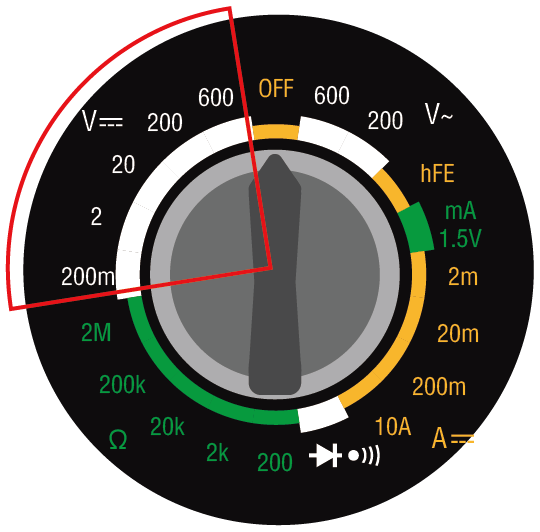
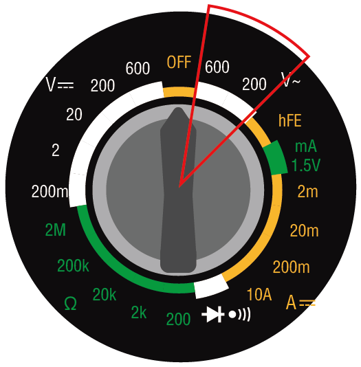
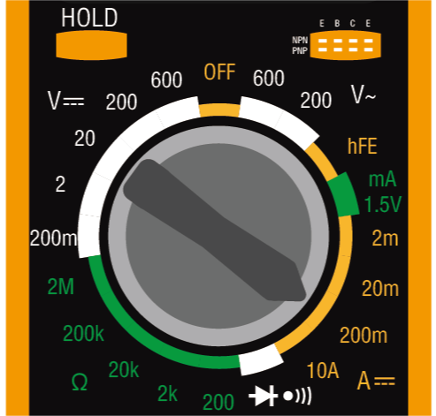

.. note::

    Hallo und herzlich willkommen in der SunFounder Raspberry Pi & Arduino & ESP32 Enthusiasten-Community auf Facebook! Tauche gemeinsam mit anderen Enthusiasten tiefer in die Welt von Raspberry Pi, Arduino und ESP32 ein.

    **Warum beitreten?**

    - **Expertenunterstützung**: Löse nach dem Kauf auftretende Probleme und technische Herausforderungen mit Hilfe unserer Community und unseres Teams.
    - **Lernen & Teilen**: Tausche Tipps und Anleitungen aus, um deine Fähigkeiten zu erweitern.
    - **Exklusive Vorschauen**: Erhalte frühzeitigen Zugang zu neuen Produktankündigungen und exklusiven Einblicken.
    - **Spezielle Rabatte**: Profitiere von exklusiven Rabatten auf unsere neuesten Produkte.
    - **Festliche Aktionen und Verlosungen**: Nimm an Verlosungen und Feiertagsaktionen teil.

    👉 Bereit, gemeinsam mit uns zu entdecken und zu erschaffen? Klicke auf [|link_sf_facebook|] und tritt noch heute bei!

3. Messen mit dem Multimeter
==========================================

Willkommen zur Erkundung des Multimeters, einem unverzichtbaren Werkzeug in der Elektronik. Diese Lektion führt dich durch die Funktionalität und Anwendung des Multimeters und lehrt dich, wie du verschiedene elektrische Eigenschaften effektiv misst. Beginnend mit den Grundlagen, wie der Einrichtung deines Multimeters mit einer Batterie und Messleitungen, tauchen wir in das Anpassen der Einstellungen und die Nutzung seiner zahlreichen Funktionen ein. Diese praktische Erfahrung vermittelt dir nicht nur theoretisches Wissen, sondern auch die Fähigkeiten, um präzise Messungen in jedem Schaltkreis durchzuführen.

Das wirst du erreichen:

* Verständnis der Komponenten und Funktionen eines Multimeters
* Beherrschung der Messung von Spannung, Strom und Widerstand
* Verbesserung deines Verständnisses der Elektronik durch praktische Übungen

Diese Lektion wird nicht nur deine technischen Fähigkeiten erweitern, sondern dir auch praktisches Wissen vermitteln, das eine solide Grundlage für dein zukünftiges Elektroniklernen und deine Projekte bildet.

Mehr über das Multimeter erfahren
-------------------------------------

Ein Multimeter ist ein Gerät, das verschiedene elektrische Eigenschaften misst. Die meisten Multimeter können Spannung, Strom, Widerstand und Durchgang (ob Strom fließen kann) messen.

Das Einstellrad des Multimeters ermöglicht es dir, die Art der elektrischen Messung und den gewünschten Bereich auszuwählen. Lass uns nun die verschiedenen Funktionen auf dem Einstellrad erkunden.

.. image:: img/multimeter_dashboard.png
    :width: 300
    :align: center

**Gleichspannung**

In diesem Bild ist die gewählte Position für die Messung von Gleichspannung (DC) vorgesehen. Spannung wird durch ein großes V dargestellt. Gleichspannung wird durch drei gestrichelte Linien mit einer durchgehenden Linie darüber angezeigt.

Dein Multimeter verfügt über fünf verschiedene Gleichspannungsbereiche — 200m (Millivolt), 2V (Volt), 20V (Volt), 200V (Volt) und 600V (Volt). Diese Zahlen geben die maximale Spannung an, die in jeder Einstellung gemessen werden kann.

.. note::

    Hier ist die Umrechnung zwischen Volt:

    * 1 Millivolt (mV) = 0,001 Volt (V)

    Zum Beispiel, wenn du eine Spannung von 500 Millivolt (mV) hast, kann dies auch als 0,5 Volt (V) ausgedrückt werden.

**Messmethode**: Vor der Spannungsmessung musst du einen geeigneten Messbereich wählen. In all unseren Kursen überschreitet die Spannung im Stromkreis nicht 5V, daher kannst du einfach die 20V-Position wählen. Wenn der Stromkreis ordnungsgemäß funktioniert, kannst du die Spannung messen, indem du die roten und schwarzen Messleitungen an beiden Seiten des Geräts platzierst.

**Wechselspannung**

Dieses Bild zeigt die Einstellung zur Messung von Wechselspannung (AC). Wechselstrom wird durch eine wellenförmige Linie dargestellt.

**Transistoren**

Die Einstellung hFE NPN PNP ist für die Messung von Transistoren vorgesehen. Diese Einstellung wirst du in diesem Kurs nicht verwenden.

.. image:: img/multimeter_hfe.png
    :width: 300
    :align: center

**1.5V mA**

Die Einstellung "1.5V mA" auf einem Messgerät wird verwendet, um den Strom bei einer Spannung von 1,5V zu messen, typischerweise um zu testen, wie viel Strom ein Stromkreis oder Gerät bei dieser Spannung zieht.

**Strom**

Zum Messen von Strom verfügt das Multimeter über Einstellungen für 2m (2 Milliampere), 20m (20 Milliampere), 200m (200 Milliampere) und 10A (10 Ampere).

.. image:: img/multimeter_current.png
    :width: 300
    :align: center

.. note::

    Hier ist die Umrechnung zwischen Ampere:

    * 1 Milliampere (mA) = 0,001 Ampere (A)

    Zum Beispiel, wenn du einen Strom von 50 Milliampere (mA) hast, kann dies auch als 0,05 Ampere (A) ausgedrückt werden.

Zum Messen von Strömen unter 200 Milliampere kannst du die rote Messleitung in den VΩmA-Port einstecken. Dann drehst du das Einstellrad auf eine der Milliampere-Einstellungen. Die Schaltkreise, die du in diesem Kurs und Projekt baust, haben immer Ströme unter 200 mA.

Zum Messen von Strömen bis zu 10 Ampere musst du die rote Messleitung in den 10ADC-Port einstecken und das Einstellrad auf die 10A-Einstellung drehen.

.. image:: img/multimeter_10a.png
    :width: 300
    :align: center

**Messmethode**: Um den Strom in einem Stromkreis zu messen, muss das Multimeter in den Stromkreis eingefügt werden. Mit anderen Worten, es muss Teil des Stromkreises werden. Dies unterscheidet sich von der Messung von Spannung oder Widerstand, die über ein Bauteil im Stromkreis erfolgen kann. Du wirst die Gelegenheit haben, diese Messungen später durchzuführen, wenn du beginnst, Schaltkreise zu bauen.

**Durchgang**

Die Einstellung mit einem Diodensymbol und einem Lautsprecher-Symbol wird zur Messung des Durchgangs verwendet. Wenn der Durchgang zwischen den Messleitungen gegeben ist, gibt das Multimeter einen "Piepton" ab.

.. image:: img/multimeter_diode.png
    :width: 300
    :align: center

**Widerstand**

Die letzte Gruppe von Optionen auf dem Multimeter ist für die Messung des Widerstands vorgesehen, dargestellt durch den griechischen Buchstaben Omega (Ω). Typischerweise bieten Multimeter verschiedene Bereiche für Widerstandsmessungen an. Dieses Multimeter ist mit fünf Bereichen ausgestattet: 200 Ohm, 2k (2000 Ohm), 20k (20.000 Ohm), 200k (200.000 Ohm) und 2M (2.000.000 Ohm). Jeder Bereich gibt den höchsten Widerstandswert an, den es genau messen kann. Um die genauesten Messungen zu erzielen, wähle einen Bereich, der den Widerstand messen kann, ohne dessen obere Grenze zu überschreiten.

.. image:: img/multimeter_resistance.png
    :width: 300
    :align: center
  
.. note::

    Hier ist die Umrechnung zwischen Ohm:

    * 1 kilohm (kΩ) = 1000 ohms (Ω)
    * 1 megohm (MΩ) = 1000000 ohms (Ω)

Zum Beispiel, wenn du einen Widerstand von 1000 Ohm (Ω) hast, kann dies auch als 1 Kiloohm (kΩ) ausgedrückt werden.

**Tipps**

Während der Messung von Widerstand, Spannung oder Strom wirst du vielleicht feststellen, dass die Werte auf dem Display schwanken. Um eine stabile und präzise Anzeige zu erhalten, kannst du die HOLD-Funktion nutzen. Dadurch wird der aktuelle Wert auf dem Display eingefroren, bis der HOLD-Button erneut gedrückt wird.

Wenn du dir unsicher bist, welchen Bereich du für die Messung von Spannung, Strom oder Widerstand wählen sollst, ist es ratsam, mit dem maximal verfügbaren Bereich zu beginnen. Dies gibt dir eine erste Schätzung der Werte, mit denen du arbeitest, und du kannst dann schrittweise zu einem genaueren Bereich übergehen, um präzise Messungen durchzuführen.

**Frage**

Nachdem du nun ein detailliertes Verständnis für die Verwendung eines Multimeters hast, überlege dir, welche Multimeter-Einstellung du verwenden würdest, um die folgenden elektrischen Werte zu messen:

.. list-table::
  :widths: 25 25
  :header-rows: 1

  * - Messobjekt
    - Multimeter-Einstellung
  * - 9V Gleichspannung
    -
  * - 1K Ohm
    -
  * - 40 Milliampere
    - 
  * - 110 Volt Wechselspannung
    -

Messen mit dem Multimeter
--------------------------------

In der vorherigen Lektion hast du einen einfachen Stromkreis aufgebaut, um eine LED zu beleuchten. Jetzt werden wir ein Multimeter verwenden, um die Spannung, den Strom und den Widerstand in diesem Stromkreis zu messen. Lass uns sehen, wie das funktioniert!

**Vorbereitung des Multimeters**

Bevor du das Multimeter verwendest, musst du die Batterie einlegen und die beiden Messleitungen anschließen, sodass es jederzeit einsatzbereit ist.

1. Folge dem Video unten, um die Batterie mit deinem Multimeter zu verbinden.

  .. raw:: html

      <video width="600" loop autoplay muted>
          <source src="_static/video/3_multimeter_battery.mp4" type="video/mp4">
          Your browser does not support the video tag.
      </video>

2. Finde dein Multimeter und die roten und schwarzen Messleitungen. Stelle sicher, dass das Multimeter in der "Aus"-Position ist. Stecke die schwarze Messleitung in den COM-Port des Multimeters. Stecke die rote Messleitung in den Spannung-Ohm-Milliampere-Port (VΩmA).

.. image:: img/multimeter_test_wire.png
  :width: 300
  :align: center

**Spannung messen**

1. Drehe das Multimeter auf die Gleichspannungseinstellung 20 Volt.

.. image:: img/multimeter_dc_20v.png
  :width: 300
  :align: center

2. Ziehe die positiven und negativen Drähte auf dem Steckbrett leicht auseinander, um die Metallenden freizulegen, ohne sie vollständig zu entfernen.

3. Berühre dann die freiliegenden Metallenden mit den roten und schwarzen Messleitungen des Multimeters, um die Spannung zu messen.

.. image:: img/3_measure_volmeter.png

4. Notiere die gemessene Spannung, du kannst auch die beobachteten Phänomene in der Notizspalte vermerken.

.. note::

    * Meine Messung betrug 5,13 Volt, trage deine Messung entsprechend ein.

    * Aufgrund von Verdrahtungsproblemen und Instabilität deiner Hand kann es zu Spannungsabweichungen kommen. Halte deine Hand ruhig, beobachte einige Male und du wirst eine relativ stabile Spannungsmessung erhalten.

.. list-table::
   :widths: 25 25 50 25
   :header-rows: 1

   * - Typ
     - Einheiten
     - Messergebnisse
     - Notizen
   * - Spannung
     - Volt
     - *≈5,13 Volt*
     - 
   * - Strom
     - Milliampere
     - 
     - 
   * - Widerstand
     - Ohm
     - 
     -

5. Setze schließlich alle Jumperkabel wieder in das Steckbrett ein, um zu verhindern, dass sie herausgezogen werden, während du andere Messungen durchführst.

**Strom messen**

Du hast die Spannung im Stromkreis gemessen. Als Nächstes wirst du den Strom im Stromkreis messen.

1. Für die Strommessung muss das Multimeter in den Stromfluss des Stromkreises integriert werden und somit Teil des Leitungswegs werden. Eine einfache Methode besteht darin, die Position der LED zu ändern: Lasse die Anode der LED in Loch 1F und verschiebe die Kathode (das kürzere Bein) von Loch 1E auf Loch 3E.

.. image:: img/3_measure_current.png
  :width: 600
  :align: center

2. Stelle das Multimeter auf die Position 200 Milliampere ein.

3. Platziere die schwarze Messleitung auf dem Draht, der mit Loch 1B verbunden ist, und die rote Messleitung auf der Kathode der LED in Loch 3E. Wenn alles richtig verbunden ist, sollte die rote LED anfangen zu blinken.

  .. note::

    Beim Messen der Spannung über den Widerstand und die LED kann es schwierig sein, eine feste Verbindung mit den Messleitungen des Multimeters herzustellen. Um einen besseren Halt zu bekommen, befestige die Messleitungen dort, wo die Komponentenbeine in das Steckbrett eingeführt sind. So kannst du fester drücken, ohne etwas zu lösen.

.. image:: img/3_measure_current2.png

4. Du wirst feststellen, dass der gemessene Strom unter 20 mA liegt. Daher können wir auf die Position 20 mA umschalten, um eine genauere Messung zu erhalten.

.. image:: img/multimeter_20a.png
  :width: 300
  :align: center

5. Messe und notiere den Strom im Stromkreis in Milliampere.

.. note::

  Bitte beachte, dass Schwankungen im gemessenen Strom aufgrund verschiedener Faktoren wie Kontaktstabilität, Stromversorgungsänderungen und Temperatureffekten normal sind. Wir empfehlen, einfach den Stromwert zu notieren, den du zu einem bestimmten Zeitpunkt misst. Wenn der Wert innerhalb der theoretischen Erwartungen liegt, sollte er als akzeptabel angesehen werden.

  
.. list-table::
   :widths: 25 25 50 25
   :header-rows: 1

   * - Typ
     - Einheiten
     - Messergebnisse
     - Notizen
   * - Spannung
     - Volt
     - *≈5,13 Volt*
     - 
   * - Strom
     - Milliampere
     - *≈13,54 Milliampere*
     - 
   * - Widerstand
     - Ohm
     - 
     -

6. Setze die LED wieder in ihre ursprüngliche Position, mit der Anode in Loch 1F und der Kathode in Loch 1E.

**Gesamtwiderstand berechnen**

Die Messung des Widerstands in einem Schaltkreis mit einem Multimeter wird kompliziert, wenn LEDs beteiligt sind, da LEDs eine bestimmte Spannung benötigen, um zu leuchten, die sogenannte Vorwärtsspannung. Wenn die Spannung nicht ausreicht, leuchtet die LED nicht und der Stromkreis bleibt offen, was die Widerstandsmessung erschwert. Zudem darf keine andere Spannung im Stromkreis vorhanden sein, außer der des Multimeters, wenn du den Widerstand messen möchtest.

Was tun wir also?

Hier verwenden wir die unten gezeigte Formel, um den Widerstand aus Spannung und Strom zu berechnen, das Ohmsche Gesetz. Wir werden dies in der nächsten Lektion ausführlich behandeln.

.. code-block::

    Voltage = Current x Resistance

    Or

    V = I • R

Umgestellt lautet die Gleichung:

.. code-block::

    Resistance = Voltage / Current

    Or

    R = V / I

Verwende die obige Formel und die von dir gemessenen Spannungs- und Stromwerte, um den Gesamtwiderstand im Stromkreis zu berechnen und in die Tabelle einzutragen.

.. note::

    Spannung wird in Volt, Widerstand in Ohm und Strom in Milliampere gemessen. Du musst Milliampere in Ampere umrechnen:

    1 Amps = 1000 Milliamps

    Das bedeutet, dass du den gemessenen Strom durch 1000 teilen musst, bevor du die Formel zur Berechnung des Gesamtwiderstands verwendest. Das Endergebnis wird möglicherweise keine ganze Zahl sein, runde bitte auf zwei Dezimalstellen. Zum Beispiel lautet mein berechneter Wert 378,8774002954, den ich auf 378,88 aufrunde.

    R = 5.13 / (13.54 / 1000) = 378.88 ohms

.. list-table::
   :widths: 25 25 50 25
   :header-rows: 1

   * - Typ
     - Einheiten
     - Messergebnisse
     - Notizen
   * - Spannung
     - Volt
     - *≈5,13 Volt*
     - 
   * - Strom
     - Milliampere
     - *≈13,54 Milliampere*
     - 
   * - Widerstand
     - Ohm
     - *≈378,88 Ohm*
     -

**Den Widerstandswert messen**

Nun, da wir den Gesamtwiderstand im Stromkreis berechnet haben, ist es an der Zeit zu sehen, wie viel davon auf den Widerstand und wie viel auf die LED zurückzuführen ist. Unser Widerstand ist mit 220 Ohm markiert, aber mit einer Toleranz von 5% könnte er tatsächlich zwischen 209 und 231 Ohm liegen. Lass uns das Multimeter verwenden, um den genauen Wert herauszufinden.

1. Beim Messen des Widerstands muss dein Multimeter die einzige Spannungsquelle sein. Stelle sicher, dass keine anderen Stromquellen mit dem Stromkreis verbunden sind. Ziehe daher alle Jumperkabel vom Arduino Uno R3 ab, um sicherzustellen, dass das Steckbrett isoliert ist.

.. image:: img/3_measure_resistance.png
  :width: 600
  :align: center

2. Um den Widerstand des Widerstands genau zu messen, wähle die 2K (2000 Ohm) Widerstandseinstellung an deinem Multimeter.

.. image:: img/multimeter_2k.png
  :width: 300
  :align: center

3. Platziere die roten und schwarzen Messleitungen des Multimeters auf beiden Seiten des Widerstands und notiere den Messwert.

.. image:: img/3_measure_resistor.png

4. Nachdem du die Messung durchgeführt hast, denke daran, das Multimeter auszuschalten, indem du es auf "OFF" stellst.

**Den Widerstand der LED berechnen**

Um den Widerstand der LED zu bestimmen, ziehe den Widerstandswert des Widerstands vom Gesamtwiderstand im Stromkreis ab.

.. code-block::

    LED-Widerstand = Gesamtwiderstand - Widerstand des Widerstands

Gemäß meinen Messungen sollte der Widerstand der LED folgendermaßen sein: 378,88 - 215 = 163,88 Ohm.

Wir haben eine praktische Reise durch die Grundlagen der Verwendung eines Multimeters unternommen, um Spannung, Strom und Widerstand in einem Schaltkreis zu messen. Vom Bau eines einfachen LED-Schaltkreises bis hin zum Eintauchen in die Feinheiten der Widerstandsmessung in Schaltkreisen mit LEDs haben wir gelernt, wie man das Ohmsche Gesetz praktisch anwendet und die Dynamik von Reihen- und Parallelschaltungen versteht. Während wir weitermachen, denke daran, dass diese grundlegenden Fähigkeiten die Grundlage für komplexere Projekte und ein tieferes Verständnis der Elektronik bilden. Experimentiere weiter, lerne weiter und lass uns gemeinsam den Weg der elektronischen Erkundung erleuchten.

