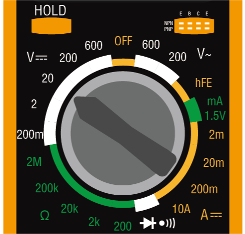

.. note::

    こんにちは、SunFounderのRaspberry Pi & Arduino & ESP32 Enthusiasts Communityへようこそ！Raspberry Pi、Arduino、ESP32について、仲間と一緒に深く掘り下げましょう。

    **参加する理由**

    - **専門家のサポート**：販売後の問題や技術的な課題をコミュニティとチームの助けを借りて解決しましょう。
    - **学びと共有**：スキルを向上させるためのヒントやチュートリアルを交換しましょう。
    - **限定プレビュー**：新製品の発表やプレビューに早期アクセスしましょう。
    - **特別割引**：最新製品の特別割引をお楽しみください。
    - **お祭りのプロモーションとプレゼント**：プレゼント企画やホリデープロモーションに参加しましょう。

    👉 私たちと一緒に探求し創造する準備はできましたか？[|link_sf_facebook|]をクリックして、今すぐ参加しましょう！

3. マルチメータの使い方を学ぶ
==========================================

マルチメータはエレクトロニクスの必須ツールであり、その機能と使い方を探求しましょう。このレッスンでは、マルチメータの設定や使用法を学び、さまざまな電気的特性を効果的に測定する方法を習得します。バッテリーとテストリードを使ってマルチメータの基本設定から始め、設定の調整や多くの機能の利用方法に進みます。この実践的な経験は、理論的な知識だけでなく、正確な測定を行うスキルも身につけることができます。

このレッスンで達成すること:

* マルチメータの構成要素と機能を理解する
* 電圧、電流、抵抗の測定をマスターする
* 実践を通じて電子の基本を深く理解する

このレッスンは技術的なスキルを向上させるだけでなく、将来のエレクトロニクス学習やプロジェクトの基礎を築く実践的な知識を提供します。

マルチメータについてもっと知る
----------------------------------

マルチメータは、さまざまな電気的特性を測定するための装置です。ほとんどのマルチメータは、電圧、電流、抵抗、および導通（電気が流れるかどうか）を測定できます。

マルチメータのダイヤルを使って、測定する電気的特性と希望する測定範囲を選択できます。では、ダイヤル上で利用可能なさまざまな機能を探ってみましょう。

.. image:: img/multimeter_dashboard.png
    :width: 300
    :align: center

**直流電圧**

この画像では、直流（DC）電圧を測定するための位置が選択されています。電圧は大文字のVで表されます。直流は、上に一直線がある3本の破線で示されます。

マルチメータには5つの異なる直流電圧範囲があります。200m（ミリボルト）、2V（ボルト）、20V（ボルト）、200V（ボルト）、および600V（ボルト）です。これらの数字は、各設定で測定できる最大電圧を表しています。

.. image:: img/multimeter_dc.png
    :width: 300
    :align: center
  
.. note::

    ボルトの変換は次のとおりです：

    * 1ミリボルト（mV）= 0.001ボルト（V）

    例えば、500ミリボルト（mV）の電圧がある場合、それは0.5ボルト（V）としても表現できます。

**測定方法**: 電圧を測定する前に、適切な測定範囲を選択する必要があります。すべてのコースでは、回路の電圧が5Vを超えることはないため、20Vの位置を選択するだけで済みます。回路が正常に機能している場合、赤と黒のテストリードをデバイスの両側に置いて電圧をテストできます。

**交流電圧**

この画像は、交流（AC）電圧を測定するための設定を示しています。交流は波線で表されます。

.. image:: img/multimeter_ac.png
    :width: 300
    :align: center

**トランジスタ**

hFE NPN PNP設定は、トランジスタを測定するためのものです。このコースではこの設定を使用しません。

.. image:: img/multimeter_hfe.png
    :width: 300
    :align: center

**1.5V mA**

メーターの「1.5V mA」設定は、1.5Vの電圧レベルでの電流を測定するために使用されます。通常、回路やデバイスがこの電圧でどれだけの電流を消費するかをテストします。

.. image:: img/multimeter_1.5v.png
    :width: 300
    :align: center

**電流**

電流を測定するために、マルチメータには200μ（200マイクロアンペア）、2m（2ミリアンペア）、20m（20ミリアンペア）、200m（200ミリアンペア）、および10A（10アンペア）の設定があります。

.. image:: img/multimeter_current.png
    :width: 300
    :align: center

.. note::

    アンペアの変換は次のとおりです：

    * 1ミリアンペア（mA）= 0.001アンペア（A）
    * 1マイクロアンペア（μA）= 0.000001アンペア（A）

    例えば、50ミリアンペア（mA）の電流がある場合、それは0.05アンペア（A）としても表現できます。

200ミリアンペア未満の電流を測定する場合は、赤いテストリードをVΩmAポートに挿入します。その後、ダイヤルをミリアンペアの設定のいずれかに回します。このコースおよびプロジェクトで構築する回路は常に200 mA未満の電流を持ちます。

最大10アンペアの電流を測定する場合は、赤いテストリードを10ADCポートに挿入する必要があります。その後、ダイヤルを10Aの設定に回します。

.. image:: img/multimeter_10a.png
    :width: 300
    :align: center

**測定方法**: 回路内の電流を測定するには、マルチメータを回路に組み込む必要があります。言い換えれば、回路の一部になる必要があります。これは、回路内のコンポーネントを介して電圧や抵抗を測定するのとは異なります。回路を構築し始めたら、これらの測定を行う機会が得られます。

**導通**

ダイオードのシンボルと音のアイコンが付いた設定は、導通を測定するためのものです。導通を測定する際、テストリード間に電流が流れる場合、マルチメータは「ビープ」音を発します。

.. image:: img/multimeter_diode.png
    :width: 300
    :align: center

**抵抗**

マルチメータの最後の設定は、ギリシャ文字のオメガ（Ω）で表される抵抗を評価するためのものです。通常、マルチメータはさまざまな範囲の抵抗測定を提供します。この特定のマルチメータは、200オーム、2k（2,000オーム）、20k（20,000オーム）、200k（200,000オーム）、および2M（2,000,000オーム）の5つの範囲を備えています。各範囲は、正確に測定できる最大の抵抗値を指定します。最も正確な読み取りを達成するために、抵抗を測定する際には、その上限を超えない範囲を選択します。

.. image:: img/multimeter_resistance.png
    :width: 300
    :align: center

.. note::

    オームの変換は次のとおりです：

    * 1キロオーム（kΩ）= 1,000オーム（Ω）
    * 1メガオーム（MΩ）= 1,000,000オーム（Ω）

    例えば、1,000オーム（Ω）の抵抗がある場合、それは1キロオーム（kΩ）としても表現できます。

**ヒント**

抵抗、電圧、または電流を測定する際、表示される値が変動することがあります。特定の読み取り値を安定させてキャプチャするために、HOLD機能を利用できます。この操作により、現在の値が表示に固定され、HOLDボタンが再度押されるまで保持されます。

電圧、電流、または抵抗を測定する適切な範囲がわからない場合は、最大範囲から始めることをお勧めします。このアプローチにより、作業している値の初期推定が得られ、その後、正確な測定のためにより適切な範囲に絞り込むことができます。

**質問**

マルチメータの使用方法を詳細に理解したところで、次の電気的値を測定するにはどのマルチメータ設定を使用しますか？

.. list-table::
  :widths: 25 25
  :header-rows: 1

  * - 測定対象
    - マルチメータ設定
  * - 9V直流電圧
    -
  * - 1Kオーム
    -
  * - 40ミリアンペア
    - 
  * - 110V交流電圧
    -

マルチメータを使った測定
--------------------------------

前回のレッスンでは、LEDを点灯させる簡単な回路をセットアップしました。今回は、この回路の電圧、電流、および抵抗をマルチメータで測定します。さっそくやってみましょう！

**マルチメータの準備**

マルチメータを使用する前に、バッテリーを取り付け、テストリードを接続する必要があります。これでいつでも使用できるようになります。

1. 以下のビデオに従って、マルチメータにバッテリーを接続します。

  .. raw:: html

      <video width="600" loop autoplay muted>
          <source src="_static/video/3_multimeter_battery.mp4" type="video/mp4">
          Your browser does not support the video tag.
      </video>

2. マルチメータと赤と黒のテストリードを見つけます。マルチメータが「オフ」の位置にあることを確認します。黒のテストリードをマルチメータのCOMポートに挿入します。赤のテストリードを電圧-オーム-ミリアンペア（VΩmA）ポートに挿入します。

.. image:: img/multimeter_test_wire.png
  :width: 300
  :align: center

**電圧の測定**

1. マルチメータをDC 20ボルトの設定にします。

2. ブレッドボードの正極と負極のワイヤーを少し引き離し、金属端が露出するようにしますが、完全には取り外さないようにします。

3. 次に、マルチメータの赤と黒のテストリードを露出した金属端に接触させて電圧を測定します。

.. image:: img/3_measure_volmeter.png

4. 電圧を記録し、メモ欄に観察結果を記録することもできます。

.. note::

    * 私の場合は5.13ボルトでした。測定値に従って記入してください。

    * 配線の問題や手の不安定さのため、電圧が変動することがあります。手を安定させ、数回観察して、安定した電圧読み取り値を得ることができます。

.. list-table::
   :widths: 25 25 50 25
   :header-rows: 1

   * - タイプ
     - 単位
     - 測定結果
     - メモ
   * - 電圧
     - ボルト
     - *≈5.13ボルト*
     - 
   * - 電流
     - ミリアンペア
     - 
     - 
   * - 抵抗
     - オーム
     - 
     -

5. 最後に、他の測定を行う際にジャンパーワイヤーが引き抜かれないように、すべてのジャンパーワイヤーをブレッドボードに再挿入します。

**電流の測定**

回路の電圧を測定しました。次に、回路内の電流を測定します。

1. 電流を測定するには、マルチメータを回路の流れの中に組み込む必要があります。つまり、回路の導電経路の一部となります。簡単な方法は、LEDの配置を調整することです。LEDのアノードを1Fの穴に保ち、カソード（短い足）を1Eの穴から3Eの穴に移動します。

.. image:: img/3_measure_current.png
  :width: 600
  :align: center

2. マルチメータを200ミリアンペアの位置に設定します。

.. image:: img/multimeter_200ma.png
  :width: 300
  :align: center

3. 黒のテストリードを1Bの穴に接続されたワイヤーに、赤のテストリードを3Eの穴にあるLEDのカソードに接触させます。このセットアップを完了すると、赤いLEDが点滅し始めるはずです。

  .. note::

    抵抗とLEDを通して電圧を測定する際には、マルチメータのテストリードでしっかりと接続することが難しい場合があります。より良いグリップを得るために、コンポーネントの足がブレッドボードに入る場所でテストリードを取り付けると、よりしっかりと押し付けることができます。

.. image:: img/3_measure_current2.png

4. 測定した電流が20mA未満であることがわかったら、20mAの位置に切り替えて、より正確な読み取りを行います。

.. image:: img/multimeter_20a.png
  :width: 300
  :align: center

5. 回路内の電流をミリアンペア単位で測定して記録します。

.. note::

  測定された電流の変動は、接触の安定性、電源の変動、温度の影響など、さまざまな要因によって正常です。任意の時点で測定された電流値を記録するだけで問題ありません。理論的な予測範囲内であれば、その値は受け入れられるべきです。

  
.. list-table::
   :widths: 25 25 50 25
   :header-rows: 1

   * - 種類
     - 単位
     - 測定結果
     - メモ
   * - 電圧
     - ボルト
     - *≈5.13ボルト*
     - 
   * - 電流
     - ミリアンペア
     - *≈13.54ミリアンペア*
     - 
   * - 抵抗
     - オーム
     - 
     -

6. LEDを元の位置に戻し、アノードを1Fの穴に、カソードを1Eの穴に戻します。

**総抵抗の計算**

LEDが関与する回路でマルチメータを使用して抵抗を測定することは難しいです。これは、LEDが点灯するために必要な順方向電圧があるためです。電圧が十分でないと、LEDは点灯せず、回路が開いたままになり、抵抗の測定が難しくなります。さらに、抵抗を測定する際には、マルチメータからの電圧以外に回路内に電圧がないことを確認する必要があります。

したがって、マルチメータを使って直接回路の抵抗を測定するのは簡単ではありません。そのため、電圧と電流から抵抗を計算するために、オームの法則を使用します。この法則の詳細については、次のレッスンで詳しく説明します。

.. code-block::

    電圧 = 電流 x 抵抗

    または

    V = I • R

この方程式を変形すると、次のようになります：

.. code-block::

    抵抗 = 電圧 / 電流

    または

    R = V / I

上記の式を使用して、測定した電圧と電流を使用して回路内の総抵抗を計算し、表に記入します。

.. note::

    電圧はボルト単位、抵抗はオーム単位、表の電流はミリアンペア単位であるため、ミリアンペアをアンペアに変換する必要があります：

    1アンペア = 1000ミリアンペア

    つまり、測定した電流を1000で割ってから、式を使用して総抵抗を計算する必要があります。最終的な計算結果は整数ではないかもしれません。小数点以下2桁に四捨五入してください。例えば、私の計算値は378.8774002954でしたが、378.88に四捨五入します。

    R = 5.13 / (13.54 / 1000) = 378.88オーム

.. list-table::
   :widths: 25 25 50 25
   :header-rows: 1

   * - 種類
     - 単位
     - 測定結果
     - メモ
   * - 電圧
     - ボルト
     - *≈5.13ボルト*
     - 
   * - 電流
     - ミリアンペア
     - *≈13.54ミリアンペア*
     - 
   * - 抵抗
     - オーム
     - *≈378.88オーム*
     -

**抵抗値の測定**

回路の総抵抗を計算したので、次はその抵抗がどれだけ抵抗器によるものか、そしてどれだけLEDによるものかを確認します。私たちの抵抗器は220オームとマークされていますが、5％の許容範囲があるため、実際には209から231オームの間にある可能性があります。マルチメータを使用して正確な値を確認しましょう。

1. 抵抗を測定する際には、マルチメータが唯一の電圧源として機能する必要があります。回路に他の電源が接続されていないことを確認してください。したがって、Arduino Uno R3からジャンパーワイヤーを取り外し、ブレッドボードが孤立していることを確認します。

.. image:: img/3_measure_resistance.png
  :width: 600
  :align: center

2. 抵抗器の抵抗を正確に測定するために、マルチメータを2K（2000オーム）の抵抗モードに設定します。

.. image:: img/multimeter_2k.png
  :width: 300
  :align: center

3. マルチメータの赤と黒のテストリードを抵抗器の両側に置き、マルチメータの読み取り値を記録します。

.. image:: img/3_measure_resistor.png

4. 測定後、マルチメータを「OFF」位置に設定して電源を切ることを忘れないでください。

**LEDの抵抗値の計算**

LEDの抵抗を求めるには、回路の総抵抗から抵抗器の抵抗を引きます。

.. code-block::

    LEDの抵抗 = 総抵抗 - 抵抗器の抵抗

私の測定値に基づくと、LEDの抵抗は次のようになるはずです：378.88 - 215 = 163.88オーム。

マルチメータを使用して回路内の電圧、電流、および抵抗を測定する基本的な操作を体験しました。簡単なLED回路の構築から、LEDを含む回路での抵抗測定の詳細まで、オームの法則を実践的に適用し、直列回路と並列回路のダイナミクスを理解しました。これから進むにあたり、これらの基本的なスキルがより複雑なプロジェクトとエレクトロニクスの深い理解の基礎を築くことを覚えておいてください。実験を続け、学び続け、一緒にエレクトロニクスの探求の道を照らしていきましょう。

